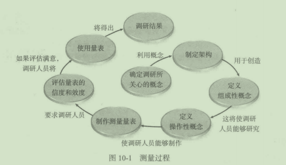
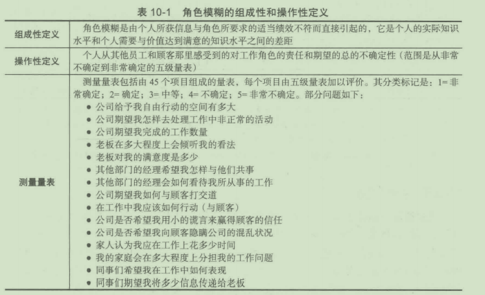
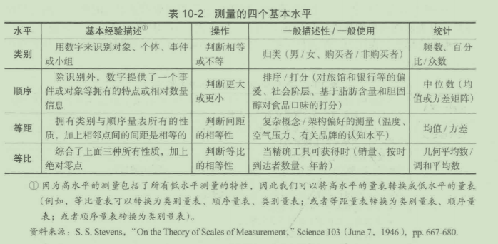
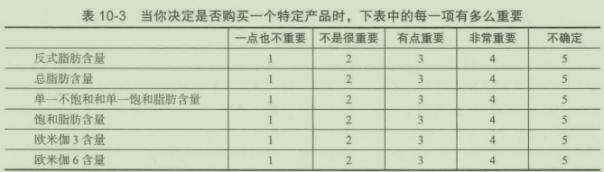
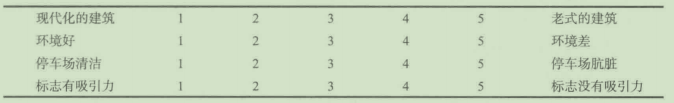

# 第10章测量的概念

## 学习目标

1. 理解测量的概念
2. 界定一个概念
3. 了解架构的性质
4. 描述组成性概念
5. 定义操作性概念
6. 建立测量量表
7. 评估测量的信度和效度

测量的本质是什么？描述相关步骤。解释测量的三个水平及其区别。信度和效度的概念是什么？为什么它们对测量的概念如此重要？这些是第10章的主题。

## 10. 1测量程序

测量(measurement)是指按照特定的规则将代表其特征的数量或质量的数字或符号分配给每一个人、目标或事件的过程。它是一个分配数字的过程，这些数字反映了事件、个人或物体所具有的特性。注意，要测量的不是事件、个人或物体本身，而是它们的特性。例如，调研人员不是去测量某个消费者，而是测量消费者的态度、收入、品牌忠诚度、年龄和其他相关因素。

规则的概念是测批的关键。规则(rule)是一种指南、方法或指令，它告诉调研人员应该做什么。测量的规则也许会这样陈述“请您对家务事的处理做出评价，将数字1~配给它们。如果认为非常愿意做家务事，则将数字l配给它；如果不愿意做任何家务事则将数字5配给它。”按柜应标准分配数字2、3、4。

测量者经常会碰到的难题是：规则缺乏具体性或清晰性。一些事件容易测量，是因为调研人员很容易制定出规则并按其进行操作。例如，性别的规则非常容易制定，因为调研人员有明确的标准，可以用"l"表示“男性"'"2"表示女性。但遗憾的是，调研人员感兴趣的特性，如品牌忠诚度、购买意向或家庭总收入等，是难以测量的。因为调研人员很难找到能够测量这些特性真实值的规则。图I0- 1表明了调研人员测量一个现象的全部步骤。



## 10. 2第一步：确定调研所关心的概念

整个测量过程从确定调研人员所关心的概念开始，概念是从特定事实中提炼出来的抽象的想法。概念是一种将感觉到“好像它们都是相同的“数据组合在一起的思想类别。所有有关南大街和主街交口的红灯信号的理解可以归于一类观念，虽然这是一种相对狭义的类型；对所有红灯信号的感知，不管在什么地方都是一个广义的概念，或是一种思想类别。

## 10. 3第二步：制定架构


架构(constructs)是存在于较高抽象水平上的特定类型的概念，比日常的概念更抽象。架构是为理论应用而创造的，并且很可能跨越各种已存在的思想类别。特定架构的价值有赖千它们在解释、预测和控制现象时的可用性有多大，正如日常概念的价值依赖千它们对我们日常事件有多少帮助一样。通常来说，架构并不是可直接观察到的，而是通过一些间接的方式（如间卷中的发现）从结果中推断出来的。这些市场架构的例子包括品牌忠诚度、高参与性购买、社会阶层、个性和渠道力量等，营销架构有助千调研人员将营销环境中发现的复杂现象简单化并进行整合。

## 10. 4第三步：定义组成性概念

调研过程的第三步是定义组成性概念。组成性定义(constitutivedefinition)(可以是理论性或概念性的）是指研究概念的中心思想，确立其边界的意义陈述。科学理论的架构可以定义为组成性的。因此，能够应用千理论的所有架构必须拥有组成性的含义。组成性定义有点像字典里的定义，定义的组成性概念必须能把所研究的概念与其他所有概念区分开来，也就是说，调研所使用的概念应当能够从类似的但不同的概念中清晰地区分开来。组成性定义模糊不清会导致调研问题不恰当的表达，例如，“我们想研究婚姻角色”这种提法太笼统，是毫无意义的，即使说“我们想研究新婚夫妇（结婚不到一年），年龄在24~28岁，受过四年大学教育的”也不够，因为有的调研人员对给定角色下的情感交流形态感兴趣，而有的调研人员对家长的角色更感兴趣。

## 10. 5第四步：定义操作性概念

精确的组成性定义使得制定操作性定义的工作更加简便。操作性定义(operationaldefinition)是指确定要测量的可观察的事物特征，并分配给概念某一数值的过程，换句话说，它根据具体情况下实施测量的必要操作，赋予架构一定的意义。

由千在营销中采用直接测匮的方法受到过多的限制，因此我们发现，许多变侃是以更抽象的术语加以定义的，同时是基于对其特性的理论化假设进行间接的测量。例如，我们不可能对态度进行直接测批，因为态度是一种抽象概念，它是指存在于人头脑中的事情。然而，仍可能给态度一个清楚的理论性定义，把它看成能够反映我们周围环境许多方面的，有关诱导性、感情、感性和认知过程的一种持久组织。以这一定义为基础，人们已经开发出了可以通过询间有关人员的感觉、信念和行为意图等问题来间接测量态度的方法。

总的来说，操作性定义作为理论概念和真实世界活动或因素之间的桥梁服务。例如，＂态度”和“高参与性购买＂的架构是抽象的、不可观察的。操作性定义把这些架构转换成可观察的事件，换句话说，它们通过阐明调研人员必须做什么来测量给架构定义或者赋予含义。对任意单一的概念都有许多不同的潜在操作性定义，不论其组成性定义是多么严密。调研人员必须选择和调研目标最符合的操作性定义。

表10- 1给出了一个有关组成性定义、操作性定义和合成测量量表的例子。两位营销专家将开发出的角色模糊的操作性定义用千分析销售人员和顾客服务人员。理论上认为，角色模糊将导致工作压力、阻碍员工提高绩效的能力和获取工资报酬的能力，并且还导致对工作的不满。



架构的均等性间题涉及人们如何看待、理解和开发对某一特定现象的测抵。全世界的市场调研人员都面临一个间题是，由千社会文化、经济和政治上的差异，对架构的看法也不可能是相同或均等的。

在英国、德国、斯堪的纳维亚半岛，啤酒普遍被视为一种洒粕饮料，然而在地中泡半岛(Mediterraneanlands),啤酒被认为类似千软饮料。关千啤酒在北欧竞争状况的研究，英国建立在洒和洒精饮料的间题上，在意大利、西班牙、希腊应该与软饮料相比较。

## 10. 6第五步：制作测量量表

我们注意到，在表I0- 1中有一个从“非常确定”到“非常不确定“跨度的量表。量表(scale)是一系列结构化的符号和数字，这些符号和数字可以按照一定的规则分配给适用于量表的个人（或他们的行动、态度）。这种扯表的分配代表了址表所要测晁内容的个人判断。因此，在表I0- 1中，一位销售人员认为她十分清楚公司期望她如何与顾客打交道，因此她会在址表上标注“非常确定”。

量表的制作始于确定渴望或可能的测量水平。表10- 2描述了四种基本的测量水平，即类别的、顺序的、等距的和等比的。



### 10. 6. 1类别量表

类别量表(nominalscales)是市场调研中最普通的量表之一，它将数据分成互相排斥、互不相容的各种类别。这意味着，任何一个数字都将适合千一类而且是唯一的一个类别，在量表中所有的数据都有适合的类别。类别是指”与名字类似的＂，这意味若赋予目标或现象不同的数字是用来命名或分类的，但这些数字没有真正的意义。这些数字不能排序或加减乘除，它们只是一种标签或识别数字，别无他意。类别屈表的例子如下：

|性别：|(1)男|(2)女||
|:- - - |:- - - |:- - - |:- - - |
|地理区域：|(I)城市|(2)农村|(3)郊区


类别付表中唯一的址化是对每一类别的客体进行频次和百分比计算。例如，有50位男性（占48. 5%)和53位女性（占51. 5%)。计算平均数（如对地理区域求平均数为2. 4)是垒无意义的，只有计算众数，即出现频率最多的数才比较适当。

### 10. 6. 2顺序量表

顺序量表(ordinalscales)除f具有类别最表用数字代表特征的特点外，还增加了对数据排序的能力。顺序测价是基千可传递假设的应用（假设是为进行操作或思考而假定的必要前提条件）n可传递假设(transitivitypostulate)可以这样加以描述：“如果a大于b,而b人千c,则a大千C"还有一些其他可代替大千的词语：更喜欢、比. . . . . . 强或在. . . . . . 之前以下是顺序量表的一个例子：


顺序数字严格地用千表不等级的顺序，数字既不表明绝对数量，同时也不表明两个数字之间的差距是相等的。例如，对传真机进行排序的应答者也许认为惠普比佳能略好些，而夏普则是完全不可接受的。但这样的信息不可能从一个顺序量表中获得。

顺序队表的自的是排序，因此任何可以代表顺序关系的系列数字都可以接受。换句话说，Spark可以被指定为30分、eharmony为40分，Match为27分，Zoosk为32分，FriendFinder为42分。也可以用其他的数字，只要其顺序不改变即可。如在上述例子中，FriendFinder是I,eHarmony是2,Zoosk是3,Spark是4,Match是5。普通的尊术运算如加、诚、乘、除都不能用千顺序侬表，对中心趋势的适当扯度是众数、中位数，百分位数或四分位数可以用来测忧离散程度。

使用顺序卧表时一个自粕矛盾（但仍很普遍）的情况是评价各种特征。在这种情况下，调研人员指定数字来反映一系列陈述的相应等级，然后又用这些数字来表示相应的距离。问忆一下市场调研人员在测址角色模糊时所使用的、从非常确定到非常不确定的队表。注意，下列的值是这样进行分配的：


如果调研人员能判断在阻表范围内间距是相等的话，我们就能运用更有利的统计参数检验（统计参数检验将在第16、17章加以讨论。）确实，一些研究测母的学者主张，一般来说都要假定间隔是相等的

最好是将顺序测量看作等距测量，但应时常注意总体内部是不等距的，因此应当尽可能多地了解有关测量工具的特点，随着心理学、社会学和教育的进步，利用这种方法可以获取大量有用的信息总之，如果调研人员小心地应用这种方法，他们是不至于被严重误导的

### 10. 6. 3等距量表

等距量表(intervalscales)除包含顺序量表的所有特征之外，还增加了协表范闱内各点之间的间距相等这一维度。温度的概念就是基于相同的间隔。相对顺序揽表而言，市场调研人员更喜欢用等距量表，因为它能表示某一消费者所具有的特性超过（或不超过）另一消费者多少。使用等距量表，调研人员能够研究两个目标对象之间的差距。这一缸表具有顺序和差距的特性，但是零点是任意的。以温度表示法为例，温度表示法有华氏和摄氏两种，因此水的结冰点华氏法表示为32°F,而在摄氏表示法中是O"C。

等距量表中的任意零点限定了调研人员对量表值的表述。你可以说80"F比32"F温度高，或者64"F比80°F低16"Fe然而、你不能说64°F比32"F温度高两倍。为什么呢？因为在华氏量表中零点是任意设定的。为了证明我们的观点，让我们用公式C(摄氏温度）＝5/9(F- 32)对两种温度表示法进行换算，这样，32下=O"C,64"F=l7. 8"C。很明显，若得出华氏量表"64"F是32"F的两倍＂，则根据公式对摄氏矶表是不成立的。用等距矶表来评价网络订票服务同样也是如此。如果给Match20分，而给Zoosk10分，我们也不能认为Match受喜欢程度是Zoosk的两倍，这是因为我们在址表中没有给出表示不喜欢的零点，也没有在量表上分配一个零值。

使用等距扭表得到的数据可以求算术平均值、标准差和和关系数，也可以利用t检验、F检验等强有力的参数统计分析法。此外，如果调研人员担心”相等间隔＂的假设，则可以采取更为保守的方法并使用非参数检验。

### 10. 6. 4等比量表

等比量表(ratioscales)除综合了上面所讨论的三种扯表的功能之外，还加上绝对零点或原点的概念。由千大家对零点的确定有一致的慈见，所以可以对等比贵表的数值进行比较。因此，等比扭表反映了变最的实际数炽。应答者的物理特征，诸如体重、年龄、高度之类都是等比量表的例子。其他的等比量表有面积、距离、货币价值、回报率、人口统计、时间间隔等数据。

因为一些事物不具备要测量的特性，等比量表源自零点，因而有一个绝对的实证含义。例如，一项投资（比较差）可能没有回报，或者新墨西哥州某个地区的人口为零。绝对零点的存在意味着可以进行所有的尊术运算，包括乘除都可以使用。量表上的数值表明了被测事物特性的实际值。例如，麦当劳的一个大包法式躲条重8盎司气而汉堡王的一包普通薯条重4盎司，因此一大包麦当劳法式兽条的重区是一包汉堡王普通署条的两倍。

## 10. 7第六步：评估量表的信度和效度

理想的市场调研要能够提供精确、正规、清晰、及时的数据。正确的数据来自千正确的测量。我们以M表示测量值，A表示实际值，则可以表述为M=A。但是，在市场调研工作中，这种情况(M=A)是极少见的，或者说根本不可能。相反，在市场调研中碰到的是：

M=A+E

式中，E表示误差。

正如第6章所提到的，误差可以分为随机误差和系统误差。系统误差是指测搅中产生的持续误差，这主要是由于测量设备和测量过程存在缺陷而造成的例如，如果使用一把刻度不准的尺子(1英寸的实际长度为J. 5英寸）在品食乐公司(Pillsbury)的测试厨房测量所选巧克力蛋糕的高度，那么测址的所有蛋糕的高度都比实际的矮。随机误差也会影响测风结果，但不是系统性的，因此随机误差的影响方式在本质上讲是短暂的。一个人没有真实地回答问题可能是因为那天正好心情不好。

一个测址攒表中有两个得分不同可能是多种原因引起的。以下所列的原因中，只有第一种原因不存在误差问题，其余7个都存在误差间题。调研人员必须确定其余7种导致测佩差异的原因是系统误差还是随机误差：

(1)被测量的特征存在真正的差异。完美的测量差异应只是巾实际差异引起的。例如，约翰先生给麦当劳的服务l分（非常好），而桑迪则给服务4分（一股化），这种差异仅是由于实际态度差别造成的。

(2)I甘下应答者稳定的特征导致的差异，如个性、价值观、知识因素等。桑迪是一个非常喜欢挑剔的激进派人上，从来不说任何事物或人很好。虽然她内心对麦当劳的服务感到非常满意．但她期待这样的服务，因此只打了个平均分。

(3)巾于短期的个人因索引起的差异，如当时的情绪波动、健康状况、时间限制或疲劳程度。今天上午，约翰先生参加了当地电台的"NameThatTune"节目举办的竞赛并获得400美元奖励。他在取回钱后，去麦当劳吃了一顿，这时他对麦当劳服务态度的评价可能会与昨天的访谈评价不一样。

(4)环境因素导致的差异。例如，接受访问时被访者是否分心，是否有其他人在旁边，这也会使测见产生误差。桑迪在接受访问时，她在照看他4岁的外甥，小孩正在麦当劳的儿竟乐园中玩。而约翰在接受访间时，他的未婚妻也在场，两个入的回答都可能与独自在家被访问、没有其他朋友或亲戚在场时的回答不一样。

(5)主持访问的调查人员不同，也会使测量产生差异。采访者用不同的语调来提间，被访问者的反应可能会有所不同。采访者友善、穿着方式、性别、种族等其他因素都会使被采访者的回答有所不同。采访者的误差可能像点头一样微妙。采访者不自觉地点头的动作会误导应答者，采访者点头的动作可能是表示“好了！我巳记录下你讲的了，请接下去说”。对千同一个调查，在移动设备上访问和电话访问有所不同。

(6)差异可能来自间卷的内容。调研人员试图测量”麦当劳＂的服务质量，所采用的量表和其他问题表达方式只是所有可能实际内容的一部分。调研设计者所制定的拟表，反映了他们对有关概念结构的解释（服务质最）和采用的测量的方法。如果调研人员使用不同用词或增加或减少内容，那么对约翰和桑迪的采访所得的量表值就会不一样。

(7)测卅工具不清晰也会产生测量差异。问题模糊不清、过于复杂或不正确的解释，都是导致差异的根源。例如，调研人员设计了这样一个问题，“你住的地方离｀麦当劳'多远”；同时，给出这样的答案：飞）少千5分钟；<2)5~10分钟”等。亳无疑问的是，步行的人会比开车或骑车的入所花时间多。这些问题将在第11章具体阐述。

(8)由于器械等设备原因所产生的差异。印刷质量较差的问卷、没有足够空间记录答案、间卷缺页、错误的电脑按键敲击或在移动设备上拇指点了错误的按钮，都会导致反应有所不同。

下面的“市场调研实践I0- 1"中，琳达·纳达克和一家华盛顿调研公司MatthewGreenwald&Associates讨论了间卷设计中减少误差的技术。

## 设计一份更好的调查问卷

你不知道你所不知道的是什么。当我设计问卷时，这个道理经常在我的脑海里。我认为问正确的问题是我的工作，只有这样我的客户才能得到他们所需的信息。但我不确定我是否成功了，如果我不知道调查对象如何理解并诠释我的问题。也许阐明我对于不知道的事的担心最好的方式是让你想象会发生什么，如果：

- 在特定问题的回答选项列表中，调查对象没有看到反映他们想法的答案。
- 特性列表不包括所有与客户目标相关的因素。
- 调查对象认为某个术语的含义与你想要表达的不同。
- 调查对象完全不能理解问题的切入点。
- 你只是没有想起某事，遗涌了研究的重要因素。

简单的回答是你传递给客户的结果，或者是不完全的，或者是基于你认为只是好的不理想的数据。

现在调研人员使用许多方法来尝试避免这些问题，包括让调研同事评论草稿问卷，在进行定量调研之前实施定性调研，买施并监测预测试访问，每种方法都有帮助。但是，即使我们使用全部的三种方法，我们的问题仍然会偏离目标，不完全或者以无效的方式表达，因为仍然有一些我们所不知道的事。

用他们的专业评论帮助我们的调研同事经常能看到缺口，然后帮助填补。但是，我们和我们的同事经常和将要完成调查的对象有不同的生活经历，所以我们无法像他们一样思考或想象每一种应用于他们的情形。

为了克服这些问题，我们公司已经转向认知访谈(cognitiveinterviewing)。认知访谈技术是一种专业的预测试类型，专注于调查对象听到或看到调查问题时的思考过程。这种技术积极钻研他们如何说明问题的意思以及可能的回答，当他们思考如何回答时在想些什么，他们怎样决定他们的答案，答案意味着什么。我们的方法主要从戈登·威利斯(GordonB. Willis)的认知访谈技术中得到，它是一种提升调研问卷设计的工具：

- 让调查对象用自己的语言改述问题或回答选择。
- 让调查对象告诉访问者，当他们考虑问题、考虑答案、决定他们的实际回答时在想些什么。
- 问调查对象巳选择问题中的具体单词或短语对他们意味着什么。
- 问他们回答问题有多难或多简单，如果不简单，探索困难的原因。
- 寻找可能反映某个问题的暗示，包括犹豫或者看起来与提供给另一个问题的信息相冲突的某个问题提供的信息。

另外，我们有时问调查对象他们在看到回答选项之前会如何回答预编码(precoded)问题，以确定我们巳经展示了所有的相关类另朊我们也可以以稍微不同的措辞来重复同一个问题，稍后在问卷中查看是否会引出不同的回答。如果我们听到看起来不一致的回答，我们应该探寻原因。我们观察并听到调查对象有困难或感到困惑的不用言辞表达的提示。

我们最近实施的一项公开发表的关于营养的调查，有认知访谈技术的几个例子阐明了他们的价值观。在关于营养的调查中，有一个倾向问题让调查对象评出等级，如口味、价格、健康、持续性等因素，对他们的食物选择有多大影响。在我们的理解中，＂持续性”可以意味着食物生产和销售的生态学、经济学、社会学方面。了解到有出人意料的高比例人口在以前的研究中报告出来，它对他们的购买决定有很大的影呴。我们决定用认知访谈技术来探索其概念。

一个叫安琪的年轻女子解释说，对她来说持续性意味着，如果被放进冰箱里，事物能保鲜多久；与此相似，一个中年男子认为持续性与食物的自身寿命相关。对于不同的人有不同的理解，这个术语不会有什么用处。

后来，在对一个叫戴维的中年男子的认知访谈中，我们从相同的草稿问卷中提炼了表10- 3的这些问题。



他在解释对这个问题的回答时，戴维强调某些列出的食物成分加入饮食中是很好的，如欧米伽3'而其他的像反式脂肪酸和单一饱和脂肪却是不好的。我们最初提出这个问题的时候，我们希望能测量重量，即便如此，对调查对象强加这些要素，不论他们对健康是有益的还是有害的。然而，戴维在想要表明他要加到饮食中的是有益的食物要素时，选择了“非常重要”选项；在传达避免有害要素时，选择了“一点也不重要“。

戴维的思考提示我们在和客户深入交流后，重问这个问题。我们最终把这个问题分为两部分：第一部分问是I否，调查对象是否考虑他们购买的食物中是否含有这些类型的脂肪；第二部分提出为了了解调查对象是否被争取为消费者或避免每一种。

最后，对戴维的访问中还有一个例子：

据你所知，你的血压. . . 

(1)高或者高于正常值；

(2)正常（在正常范围内）；

(3)低或者低于正常值；

(4)不确定。

戴维问了我们一个问题来回答这个问题：“如果我潜在的血压高，但由于吃药处在正常值时，我该如何回答？”这是一个让我们拍额头的时刻，我们知道了我们需要两个版本的“正常值“回答选项－——一个是“不服药”，另一个是“服药＂。经过修正的问题被证明在分析调查对象的子组之间的差异时十分有用。

问题：

1. 认知访谈技术能帮助减少误差吗？如果能，是哪种类型的，随机的还是系统的？
2. 认知访谈技术有哪些益处？
3. 一位学者要求认知访谈技术的三个循环，每个有10次访问。这个过程的优势和劣势是什么？一个循环不够吗？

### 10. 7. 1信度

如果测量屈表可以在不同时间均得出一致的结果，则呈表具有信度。如果用一把尺子测昼一个巧克力蛋糕的高度始终是9英寸，那么可以说这把尺子是可靠的。调研人员可以放心地使用可靠的量表、量器和其他测星工具。短暂性因素和环境因素不会对测扭过程产生干扰，具有信度的记表能够在不同环境、不同时刻提供稳定的测蜇。在考虑信度时的一个关键间题是：“如果重复几次使用同一测量工具对同一现象进行测蜇，所得到的答案是否高度相似。“如果回答是肯定的，则测量工具是可靠的。

因此，我们将信度(reliability)定义为：信度是指在测量中可以避免随机误差，从而提供前后一致的数据的程度。随机误差越少，调查就越可靠。因此，能够摆脱随机误差影响的测晕是准确的。如果在被测概念的值保持稳定的情况下，测量结果保持不变，那么这个测量量表就是可靠的。但是，如果被测概念的值发生了变化，可靠的测量应该能揭示出这一变化。那么，究竞什么样的测量工具是不可靠的呢？如果你的体重一直稳定地保持在150磅，但你在浴室秤上反复测量，结果总是在不断波动，这种测量就是不可靠的，这种不可靠可能是因为一个不牢固的弹簧。

有三种主要方法可以用来评估信度：测试－再测试、等价形式，内在一致性。

1. 测试－再测试信度

通过在尽可能相同的条件下使用相同的测量工具进行重复测队，可以判断测试－再测试的信度(test- retestreliability)。测试－再测试的理论依据是：如果随机变化存在，那么这种情况可以通过两次测试中分数的变化显示出来。稳定性(stab山ty)意味若在第一次和第二次测试时，分数上的差别非常小，此时测量工具是稳定的。例如，我们用一个有30个问题的请表对百货商店的形象进行测试，在不同的两个时点上向同一消费者群测试。如果两次结果高度相关，那么我们可以推断测试的信度较高。

有关测试－再测试信度存在几个关键性间题：第一，安排和取得与应答者第二次测试的合作非常困难；第二，第一次测试也许会使应答者在第二次测试中改变行为；第三，环境和个人因素会改变，从而使第二次测试结果会有所变动。

2. 等价形式信度

测试－再测试方法中的问题可以通过创造测量工具的等价形式避免。例如，假设调研人员想识别内在导向型和外在导向型的生活方式，他可以设计两份包括内在导向型行为（见表10- 4)和外在导向型行为测试的问卷，每份间卷应当有同样的重点。因此，尽管每份问卷中用来确定生活类型的问题不一样，但是用来测试每种类型生活方式的问题数目应该一样多。虽然有时两个间卷调查是前后进行或同时进行，但一般建议二次等价形式间卷调查的间隔最好是两周J两套问卷测试得分的相关系数决定了等价形式的信度(equivalentformreliability)。

表10- 4用来测试内在导向型生活方式的陈述
````
我经常得不到我值得拥有的信誉
不管别人怎么讲，我都试图用自己的方式做事
我最大的成就就是超越自己
我有很多想法，有一天我会把它们编成书
我能很快地接受新观点
我常想我是怎样的人，以及我在他人心中的印象如何
我是一个富有竞争力的人
当别人批评或责骂我时，我感到很不自在
我想成为一个名人
当做危险的事情时，我感到很恐惧
我感到在生活中没有什么能代替伟大的成就
对我来说受人关注是重要的
我与朋友们保持紧密的联系
我花大批的时间来决定我对事情的感觉如何
我经常认为我的方式在内心深处会成为另一个人
我感觉．在人们心中理想是强有力的激励力扯
我认为，不相信上帝，有些人也能成为一个好人
对我来说，东方宗教比基督耶稣更有吸引力
我对我的生活感到满意
我喜欢进入新的、不寻常的状况
我认为我了解我的生活方向
总之，我得说我是快乐的
我总想使自己与众不同
对待生活，我保持平常的心态
````

有关等价形式信度有两个问题值得單视：第一，制定两份完全等价的问卷相当困难，甚至可以说不可能；第二，即使我们可以得到两份等价的间卷，但从它的难度、时间和投入的费用方面考虑也许是不值得的。等价形式信度的理论依据与测试－再测试信度的理论依据一样，两者之间的主要区别在千测量工具本身。测试－再测试使用同一工具，而等价形式使用一个高度相关但不同的测量工具。

3. 内在一致性信度

内在一致性信度(Internalconsistencyreliability)指标评估的是，在同一时间内，利用不同的样本测试同一现象而产生和似结果的能力。内在一致性的理论在千”等价”概念。等价(equivalence)关注的是，用来测试同一现象的各项内容会带来多少误差，以及各项在时点上的变化。调研人员可以通过评估一系列项目条款的同质性来测试各项内容的等价性。用来测试某一现象（如内在导向型生活方式）的所有各项内容可以分为两个部分，如果这两部分的得分相关，则存在内在一致性，这种技术称为折半技术(split- halftechnique)。使用折半技术要求各条款项目要随机地分配给两部分中的一个。这种方法存在的一个问题是，信度系数的评估完全依靠条款项目如何分为两半。不同的分法会得到不同的相关关系，但这是不应当的。

为了克服折半二分法中的难题．许多调研入员现在都使用克朗巴哈阿尔法技术(Cronbachalphatechnique)。这种技术需要计算所有可能的二分情况的信度系数平均值，如果在量表中证明某一项目与其他项目缺乏粕关性，则该项口应该删去。克朗巴哈阿尔法技术的一个局限性是量表各条款的间距应相等，如果不能满足这一准则，则可以使用"KR- 20"技术。"KR- 20"技术适用于所有二分量表和类别惜表项目。

### 10. 7. 2效度

回忆一下，一个优良的测扯工具应具备的第二个特性是效度。效度(validity)所研究的是，我们试图要测噩的事物实际上是页正要测量的。当庞蒂亚克(Pontiac)收购阿兹特克(Aztek)时，调研告诉他们，尽管存在有争议的设计，但每年会卖出50000~70000辆汽车。随后的每年只销售出了27000辆，这个型号的汽车也停产了不幸的是，他们的测量工具不具各效度。测量的效度涉及测量工具和过程能够避免系统误差和随机误差的程度，因此，如果测匮得到的分数上的差异只反映了我们所测址的特征上的真正差异，而不是系统或随机误差，则测毋是有效的。应该认识到效度的先决条件是测址工具足可靠的。当在不同时间测量同一个现象时，不可靠的工具也不会产生一致的结果。

量表或其他测晟工具如果缺乏效度，对调研人员来讲，它们基本上就毫无意义，因为它们不能测量所想要测毋的东西。从表面上看，这似乎是一个作常简单的问题，但是效度经常是建立在微妙差别的基础上。假设老师进行了一次测验，来检查你们对市场调研知识的掌握情况，他所拟定的考题是用一些公式对简单的案例进行分析。某一同学考试成绩很低，就对老师抗议说：“我真的理解市场调研。“从他的角度来讲，考试不具备效度，这种考试只是检查学生是否记住公式以及运用简单算术去寻找解决方案的能力，而不是检查学生是否真的理解了市场调研。如果老师再进行相类似的测验，那将发现，学生成绩的优劣大抵与这一次相同。这是不是说那位不服气的学生的抗辩是错误的？并不一定。因为老师可能在系统地测试学生的记忆力，而不是测试对市场调研知识的真正理解。

与这位老师试图测扯市场调研知识不同，品牌经理感兴趣的是成功地预测市场。例如，经理想通过一个购买意向址表成功预测新产品的试销情况。因此，我们可以从不同的方面来检查效度，包括表面效度、内容效度、衵关准则效度和架构效度（见表l0- 5)。

表10- 5评估量表的效度

|效度类型|评估量表的效度|
|:- - - |:- - - |
|表面效度|调研人员判断测扯工具看上去像测从了所要测机内容的程度|
|内容效度|测址工具的条款项目能够覆盖所研究内容的程度|
|相关准则效度|测拭工具预测已确定的准则变队的能力<br>a预测效度：通过使用当前测拭工具在规模上预测准则变址未来水平的能力<br>b同时效度：通过对同一时点的变扯进行测扯来预测已确定的准则变扯的能力>|
|架构效度|测肚能够证实以所研究的概念为基础的理论建立的假设的程度<br>a收敛效度：测扯同一概念的不同测址下具间联系的程度<br>b区别效度：假定不同的架构之间缺乏联系|


1. 表面效度

表面效度(facevalidity)是效度的最低级形式，它是指好像测世了应该测量的内容的程度。它是由调研设计人员在间题设计时做出的判断决定。当详细检查每个问题时，就存在表面效度的隐含评估。问卷不断修订，直至通过调研设计者的主观判断。此外，表面效度可能反映了调研人员、专家或熟悉市场、商品或行业的人上，就槛表似乎准确反映了要测试的内容达成了主观上的一致。例如：“你的年龄多大？”后面紧接着一系列答案，这样一个直截了当的问题一般被认为是表面有效的。不过，市场调研中使用的大部分且表都是试图测量那些较难捉摸的态度和行为倾向。

2. 内容效度

内容效度(contentvalidity)是指测量工具内容的代表性或样本充分。换言之，量表是否足够覆盖了要研究的主题？例如，麦当劳委托你测量年龄在18~30岁，每月至少吃一次快餐汉堡的成年人对公司的印象。你设计下面的挝表并要求顾客对其打分：



一位麦当劳的执行经理可能很快就提到有关性表的问题：从来不吃汉堡的人只要经过麦当劳的店门，就能够对这些做出评价。事实上，一位路过麦当劳的人就能简单地做出评估。经理人员可能进一步争辩到，这份炽表不具备内容效度，因为许多重要的形象要素，如食品质量、休息室和进餐室的清洁卫生以及服务的快速和礼貌等，都没有被测扭。

判断测量是否具有内容效度不是一件简单的事。要想识别麦当劳形象的所有方面非常困难，而且是不可能的。内容效度最终是一种评判性行为，调研人员可以通过下列步骤来判断内容效度：CD对所要测屋的概念、对象进行仔细和准确的界定；＠竭力收集相关的文献资料以及举行焦点小组访谈，尽卅列举出可能包括的内容；＠召开专家座谈会，研讨员表中应包括哪些内容；＠对品表进行预先测试，也可以通过开放式提问来了解可能包括在内的其他内容。例如，你可以在测社麦当劳形象的量表后面，附带提这样的问题：“你对麦当劳有什么其他恁法吗？”对这类预测性问题的回答，可能会为你提供先前没有涉及的其他形象内容的线索。

3. 相关准则效度

相关准则效度(criterion- relatedvalidity)是检查测惜工具预测已确定的准则变量的能力。为了说明这一点，假设我们希望设计一个判断能够出色地主持小组访谈的调研人员测试。首先，从能够很好地主持小组访谈的调研人员的姓名地址目录中确定一些公正的市场调研专家。然后．构建一个拥有300多项条款内容的问题询间各主持人，讷他们回答”是”或“否＂。例如，“我和信强迫小组中害羞的参与者发表言论是很重要的”“我愿意和一些小群体的人们接触＂。接着检查同答，挑选出有关的条款。在这些条款中，好的小组主持人以一种类型回答，而其余人以另一种类型回答。假设这一过程产生了84项条款，将这些条款组合在一起就形成了上面所说的小组主持人的效度测试(TEFGM)~我们会发现，这个测试能够确定优秀的小组主持人，这里感兴趣的标准是指导好的焦点小组访谈的能力，并可以通过实施对一组新主持人的测试来对TEFGM的和关准则效度进行深入的探讨匕这组新主持人在以前曾被分为两个部分，一部分是优良主持人，而另一部分则不是然后，我们确定测试识别每个被指定的调研人员的程度。因此，相关准则效度与发现研究的架构中存在或缺乏一个或多个的标准有关。

衵关准则效度包括两种类型：预测效度和同时效度。预测效度(predictivevalidity)是指一个准则变量的未来值可以通过当前肚表的测量来预测的程度例如，投票人动机员表被用千预测某入在下一次竞选投票的可能性。一位精明老练的政治家认为，整个社区的看法并不是蜇要问题，重要的是那些可能投票人的感觉，这些也是政治家在演讲和广告宣传时注重的问题。另一个顶测效度的例子是Pepperidge农场采用新型糕点的购买意向扯表来预测产品实际的试销情况。

同时效度(concurrentvalidity)关注的是预测变嚣和准则变招之间的关系，两者均在同一时点上评估。例如，家庭妊娠试剂能够准确测试如女现在是否实际巳怀孕的能力。这样一种测试如果同时效度低的话，可能会带来过多的压力

4架构效度

虽然许多市场调研人员经常是无意识地提起架构效度，但对千营销研究人员来讲，架构效度是非常重要的。它涉及对千现在已有的测量工具的理论基础的理解。如果测扭是按照预测背后的理论所进行的，测玑就具有架构效度(constructvalidity)。我们有时可以直接观测到购买行为，例如某人是否购买A品牌。然后，营销研究人员巳经开发出了一些架构，如生活方式、参与度、态度和个性等，这些架构有助千我们理解消费者为什么购买某些产品或者为什么不买。这些架构在很大程度上是不可观测的。我们能够观测的是与架构有关的行为，也就是购买一种产品，而不是架构本身（如态度）。架构有助千营销研究人员利用或建立学说来解释现象。

你或许认为架构效度是一个“标签”问题。当你昶量一个称为“高参与度”的概念（架构），你真正测量的又是什么？用一种稍有不同的方法看，当一个研究者表明架构效度时，他本质上巳经有了一个关千现象、人和有关彼此测量（其他理论条目）的理论了，换句话说，研究者为我们提供了一个理论模式。当研究者宣称架构效度，他正宣称的是研究项目中所观察的模式与这个理论的校式和一致。在这个情况下，研究者认为的事物是如何相互作用的，那么事物就是如何作用的。

即使架构效度是与其他类型的效度一块在这里做介绍，但架构效度确实在其他所有其他架构之上。为什么？这是因为架构效度与你试图测量内容的本质非常相关。如果你的研究缺乏架构效度，其他效度也没有很大的关系了。

评估架构效度有两种统计方法：收敛效度和区别效度。收敛效度(convergentvalidity)是指用来测械同一架构的不同测批工具之间的相关程度；区别效度(discriminantvalidity)是揭示被认为不同的架构之间的低度和关或不相关。假设我们设计一个多项置表来测记在折扣商店的购物倾向。理论上认为，这种购买倾向由四种个性变量引起：高度的自信、低地位需求、低特色需求以及高水平的适用性。而且，理论上还认为，在折扣商店的购物倾向与品牌忠诚度或高度的争强好胜不存在相关性。

如果量表具有以下特征，则表明存在架构效度：

- 与在折扣商店购买倾向的其他测量结果高度相关，例如、经常光顾的商店和社会阶层（收敛效度）。

- 与非相关的品牌忠诚度架构和高度的争强好胜之间存在低度相关性（区别效度）

这里所讨论的各种类型的效度在理论与实践方面是相互联系的。很明显，在制定预测某人是否会在折扣商店购物的员表中，预测效度是非常重要的。调研人员制定折扣商店光顾者量表时：首先，要考虑提供预测基础的架构；其次，提出有关折扣商店光顾的理论，这是架构效度的基础；最后，调研人员要考虑量表所要包括折扣商店光顾者内容的具体条款，这些具体条款是否包含在架构范围之内。因此，调研人员要确认内容效度的程度。通过将用折扣商店光顾者噩表测显的分值与实际商店光顾者进行比较，可以提出相关标准效度的间题。

### 10. 7. 3信度和效度：总结性评论

信度和效度的概念在图10- 2中加以说叨。悄形l显示出弹孔布满了整个靶板，可能是由于使用了老式的来福枪，或者射击技术很差以及其他的一些原因。完全缺乏一致性意味着不具有信度。因为测量工具缺乏信度，因此产生了巨大的错误，因而很可能是无效的，测量的信度是效度的必要条件。


情形2显示出弹孔虽然很集中（一致性），但偏离了靶板的有效部位，这说明它具有高信度（小的偏差），但缺乏效度。虽然测量是一致的，但所测量的并不是我们所想要的。射手有沉若的眼力，但瞄准调整不准确。情形3显示出调研人员所追求的标准，说明测量工具是有效的和可靠的，在靶心上正是调研人员试图要测量的。

## 本章小结
测量是指按照特定的规则将数字或符号分配给目标，进而来代表量化和质化属性的过程。测量的规则是一种指南、方法或指令，它告诉调研人员该做什么。准确的测量要求规则清晰和具体。

测量的程序如下：心确定调研所关心的概念；＠制定架构；＠定义组成性概念；＠定义操作性概念；＠制作测量量表；＠评估量表的信度和效度。组成性定义是指研究概念的中心思想，确立其边界的意义陈述；操作性定义是指确定要测量的可观察的事物特征，并分配给概念某一数值的过程。

有四种基本的测量水平：类别、顺序、等距和等比。类别量表将数据分成互相排斥、完全穷尽的各种类别，分配给客体或现象的数字只是一些简单的数字标签，没有真正的数字意义；顺序量表除了具有类别量表用数字代表特征的特点之外，还增加了对数据排序的能力；等距量表除包含顺序量表的所有特征之外，还增加了量表范围内各点之间的间距相等这一维度，使用等距量表，调研人员能够研究两个目标对象之间的差距，得到的数据可以用来求算术平均值、标准差和相关系数；等比量表综合了以上所讨论的三种量表的功能之外，还加上绝对零点或原点的概念，因此可以对等比量表的数值进行比较，同时反映了变量的实际数量。

测量数据包含准确的信息和误差。系统误差是指测量中产生的持续误差。随机误差也会影响测量的结果，但不是系统性的。随机误差的影响方式从本质上讲是短暂的。信度是指在测量中可以避免随机误差，从而提供前后一致的数据的程度。有三种主要方法可用来评估信度：测试－再测试、内在一致性和等价形式。效度是指试图进行的测量是否是成功的。测量的效度涉及测量工具和过程能够避免系统误差和随机误差的程度。效度概念包括表面效度、内容效度、相关准则效度和架构效度。

## 复习思考题

1. 什么是测量？
2. 四种类型的测量量表之间有什么区别？讨论每种量表所包含的信息类型。
3. 信度与效度有何不同？请各举一例。
4. 举一例具有信度但不具有效度的量表，再举一例具有效度但不具有信度的量表。
5. 评估信度有哪三种方法？
6. 评估效度有哪三种方法？
7. 将班级分成4组或5组，到网上查找带有数据的调查结果，随后每组确定研究的表面效度和内容效度。每组应该再提出一个评估调查信度的方法。

## 调研实例10- 1

女性购物者介绍

当你考虑女性控制7万亿美元以上的国内消费，以及在大多数主要类别中85%以上的购买决策时，难怪市场人员焦急破译密码一说服女性打开她们的钱包。

为了更好地了解如何刺激女性，洞察女性行为和购买决策的无意识的驱动因素。位于伊利诺伊州威尔梅特市的调研公司InsightsInMarketingLLC开发了五种女性行为洞悉(FemaleBehavioralInsight,FBI)简介，旨在创造一个完全的、更清晰的关于对美国女性重要的是什么的图景。

下面是对FBI简介的介绍。

简介1(26%的女性）：受到驱动，专注于不论做什么都成功。这些女性想要拥有一切。不论她是500强公司的领导者还是家里的CEO,她下决心要实现目标。她经常在工作生活和家庭生活中犹豫不决。但是，有了明确的目标，她从不会忘记，知道拥有了足够的韧性，她就能够成功。

简介2(21%的女性）：她是一个快乐的传统主义者，很保守且规避风险。你很可能发现她和朋友以及家人待在家里。她是一个通过照顾别人来照顾自己的典型营养家，不论是心理上还是身体上的。比起中心位置，她更喜欢在风景背后，由强烈的信念系统、结构和惯例指导。

简介3(20%的女性）：她是深思熟虑的，很想知道为什么人们会做他们所做的事。惯例是她生活的支柱，她对知道接下来会发生什么感到舒服。当事情按计划进行时，她是一个快乐主义者，但生活和预测之外的世界使她感到失去了平衡。她可以解决几个难题，但是遇到太多难题的时候会很勉强。如果有规则，她会遵从，因为规则定义了指导方针和期待。

简介4(17%的女性）：自我信赖，试图对她身边所有的事保持控制，她感觉只有她能够解决她的问题。她能敏锐地意识到挫折和降临在她身上的失望，促使情感的堡垒包围自己。尽管她看起来独立，但她也需要援军以及来自千他人的积极反馈。

简介5(16%的女性）：由不可遏制的好奇心驱动，她是一个活泼的、社会型的、对任何事都开朗的享乐主义者。她不会仅仅为了耀武扬威而爬山或者尝试最新的餐馆，她做这些只是为了满足自己的好奇心。无畏的、坦白的她会抗拒一切无聊或重复的事。她相信人们会发现并且追求使她们开心的事。她想要所有人充分地经历生活提供给她的一切，所以她想尽办法变得有魅力、有涵养并且大方。

问题：

1. 调研的结构是什么？给出一个组成性定义。
2. 调研人员可能使用的是什么测量水平？举出例子。
3. 调研人员有什么可以用于信度的测试？
4. 调研人员可能会怎样进行信度的测试？
5. 调研人员可以做什么来证明结构效度？
6. 你认为这个量表对市场调研人员有价值吗？为什么？

