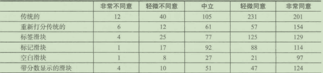
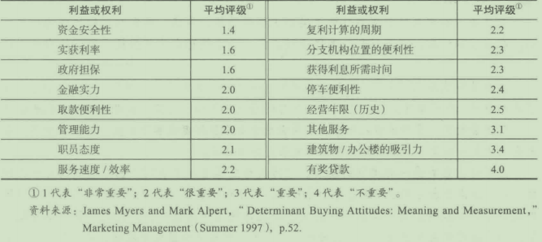

# 第11章 态度测量

## 学习目标

1. 解释态度、行为与营销效果的联系
2. 熟悉量表概念
3. 比较各种类型的态度量表
4. 认识在选择类型量表时应考虑的基本因素
5. 认识态度量表在管理决策制定中的重要性

态度测匿有哪些不同的方式？为什么它对测扯态度有帮助？在设计态度掀表时应该考虑哪些因素？这些问题将会在本活得到解决。

## 11. 1态度、行为与营销效果

态度是一种心理学架构，是指一种将无形的东西概念化的方法。态度难以直接观察或测匾，它们的存在是从其结果中推断出来的。态度(attitude)是一种与我们周围环境的某些方面相关的包括动机、情感、感觉和认知过程的持久结构。在市场调研中，是对某一客体所持有的一种比较稳定的赞同或不赞同的内在心理状态。态度一般较持久，而且包括了一组内在相关的信念。态度也包含了反映我们对好坏、对错判定标准的价值体系。因此，基于对娱乐需求、卡通人物、幻想、拥挤人群、排队等候以及其他许多事物的看法，你可能对迪士尼世界持有一种特定态度。你很可能给予迪士尼世界高度评价，认为它是美好、洁净、充满乐趣的世界。

### 11. 1. 1态度和行为的联系
态度和行为之间的关系是复杂的。对一群消费者未来行为的预测一般要比对单个消费者行为的预测更难。特别地，研究人员还发现以下一些情况：

(1)顾客的态度越积极，使用产品的可能性越大；顾客的态度越消极，使用产品的可能性越1j·o

(2)人们对一种产品的态度越是不赞成，他们停止使用它的可能性就越大。

(3)那些从未尝试使用某产品的人们的态度将在均值左右呈正态分布。

(4)当态度以对某产品的实际试用或使用经历为基础时，通过态度就能很好地预测行为；相反．当态度是以广告为她础时，态度和行为的一致性明显减弱。

一些研究人员对态度调查预测行为的能力持悲观态度C门前，大多数研究人员的观点是，我们必须学会识别那些影响被测态度、预测行为的准确程度的因素。在评价态度调查结果是否能预测行为时，应考虑以下六个因素：

(1)顾客的参与？只有在高度参与的情况，态度才可以用来预测购买行为。

(2)态度测卅。态度测矶必须是可靠而有效的，而且应该与行为测量具有同等的抽象度C例如．如果行为是关千向一家特定的慈善机构捐款，如美国癌症协会，那么就不应询问那些不够明确的（更抽象的）有关顾客对一般慈善机构的态度问题。类似的问题涉及时间变员如果行为与在以后的6个月内购买一辆新的保时捷汽车有关，那么测址就应包括一个时间测量参数。态度测员与行为发生之间的时间间隔越长、它们之间的关系就越小。

(3)其他人的影响。其他人的购买欲望和顾客与这些欲望保持一致的动机也影响着态度预测行为的程度。

(4)情景因素。情枭因索，如假期、时间紧迫性、疾病干扰．测低态度使之不能很好地预测行为

(5)其他品牌的影响- 即使顾客很喜欢某一品牌，但如果顾客对另一品牌更加喜欢，那么另一品牌则更有可能被购买。“对某一客体的态度”桢型在预测行为时存在问题的原因之一是，它不能测员人们对其他客体的态度。

(6)态度强度。对于一种可能影响行为的态度来说，它必须是足够坚决和确信从而能够在记忆中发挥作用。态度与客体之间的结合程度在一个连续谱中变化。在连续谱一端是无态度一顾客对一特定品牌基本上既无积极感觉也无消极感受；连续谱的另一端是极端态度一顾客对品牌感觉极为强烈。

### 11. 1. 2改善营销效果

态度的确是所有帮销人员想要设法影响的“人类变化动因＂的巫要方面。正如以上所说的，营销经理巳经认识到，态度和行为之间并不存在完全的相关性u然而，在设计或调整市场营销组合时，为f创造一种有效组合，态度测惜通常被认为是“最好的可用工具＂。当丰田汽车公司试图决定在三种新的可行设计中哪一种能使汕屯混合车销卅最佳时，它所依赖的是态度调查。暗含的假设是，当其他悄况都和同时，在态度调查中最被召好的油电混合车的销址达到最多。因此，营销经理试图预测那些能将适销对路的新产品推向市场的行为时，他们要进行态度测卅。新产品的上市将得到依据调查得出的＂恰叫的营销组合策略”的支持在确定新的营销组合时，说明性的图示数据和过去的购买模式也是重要的数据来源＾

## 11. 2量表的定义

量表(scaling)一词是指试图确定主观的、有时是抽象的概念的定墨化测卅的程序。它被定义为以数字（或其他符号）代表客体的某一特性，从而对所研究客体的不同特性以多个数字来代表的过程。事实上，我们指定数字代表客体的属性？玻璃管中水银的升降就指示温度变化的情况- 

量表是一种测量工具。态度态表有一维和多维之分。一维量表(unidimensionalscales)用千测员应答者或客体的单一特性。例如，可以设计一种抵表来测狱消费者对价格的敏感性。虽然我们可能会设计好几个条款来测扯它，但这些条款都可以结合为单一的测世，并把所有消费者一起放在一条称为价格敏感程度的线谱上。多维量表(multidimensionalscales)是指某一概念或客体需要用多个维度来描述例如，美洲虎汽车厂通过“富裕程度、价格敏感性、对汽车的欣赏水平”三个方面来确定它的目标消费者。

## 11. 3态度量表

态度测量同物理学中的测扭相比要难得多，而且极少川精确刻度。如上面提到的，态度是存在千顾客头脑中的一种结构，它不像物理学中的重量那样可以直接观测到。态度僵表是建立在用来测呈态度结构的各种操作性定义的基础上。在许多情况下令测社态度的屈表属于类别蜇表或顺序址表，一些更粘细的埴表使研究入员可以在等距水平上测量。不过应当注意，不要把等距呈表的一些特性用到低水平的类别且表或顺序堪表中C

### 11. 3. 1图示评比量表

图示评比量表(graphicratingscales)提供给应答者一个有两个固定端点的图示连续体。如图11- 1描述了三种可以用来评价La- Z- Boy睡椅的图示评比阰表形式。量表A是最简单的形式，应答者被指示沿着连续线画出他们的反应。在做完回答的标记后，再把直线划分成足够多的部分，每一部分代表一个类别，并分配给一个数字。例如，如果连续线是6英寸长，那么每一英寸就代表一个类别。卧表B预先安排了刻度并写上数字，因此提供给应答者一个稍微复杂一些的结果。

如队表C所示，图示评比址表并不限千简单地在连续线上画钩。许多调研入员成功地运用批表C来加快访间的过程。调研人员在受访者面前出示一张画有篮表（就好像温度计）的卡片，并要求受访者指出最能描述他们感觉的温度计。

当在线调研和使用移动终端调研时，图示评比僵表有时也称为＂滑动条”，应答者只需在一个区间轻轻用手指滑动测狱点。在有些滑动条上，数字会随着测址点的移动显示在其上方（见表11- 1中倡表D)~

图示评比凡表容易制作并且使用简便，如果我们承认打分者有足够的分辨能力，那么调研人员利用这种址表可以分辨出微小差别。通过图示评比批表获得的数据通常作为等距数字使用。

图示评比址表的缺点是，应答者在难以决定的情况下，倾向于选择中间答案。此外，调研人员不知逍应答者在评价时所使用的评判标准。研究表阴，图示评比量表的可靠性不如列举评比僵表。

### 11. 3. 2(^)列举评比量表

列举评比量表(itemizedratingscales)与图示评比批表非常相似，只不过应答者在列举评比员表上必须在有限的类别中做出选择，而不像图示评比倡表是在连续体上做记号（一些刻意追究的人会认为图11- 1中的员表C是一个列举评比砒表）。表11- 1是从全国市场调查研究中提取出来的列举评比贝表的例子。每份问卷的起点是循环的以消除每次都以相同的选项开始可能造成的次序误差。另一个以滑动条展现的例子在下面的“市场调研实践”中讨论口

表11- 1用于网络和商场调研的列举评比量表

在表ll- 1中，甩表A帮助一家网络公司调研它们网站上应该增加哪些特色和服务；星表B帮助一家网上旅游公司调研用户满意度；挝表C帮助一家网上音乐商品零售店更好的『解人们如何选择音乐网站；量表D也是一个网络调研，是由开发一种与消费者建立良好关系的软件的公司设计的。表11- 2为其他列举评比扭表的例子”

表11- 2列举评比量表精选

虽然列举评比汛表没有像图示评比表那样很好的表现微小差别，但是列举评比量表很容易构造和操作。列举评比惯表的可靠性比图示评比县表好。

出千某些原因，有时一个调研人员会想得到卜分积极正向的观点，这时他就可能使用两阶段格式的最表。调查显示两阶段格式最表比单阶段格式婿表更能得到极端的观点。以下是两个阶段格式量表的应用。

比较传统的李克特最表和滑动选择量表

为了评测一个标准5分李克特量表与一个动画制成的滑动量表的表现差异，“国际抽样调查“开展了一系列调查两种量表的评估都建立在数据收集、安排应答者回答问卷和受访者对两种方式的满意度的基础上。

实验致力于两个关键的问题：同等评估和评估之间的距离。在建立实验的阶段，应答者拿到一份包含四个问题陈述的传统李克特量表，并被要求在最后给他们对这一量表的感觉评级，评级要求表达自己的真实观点·,之后应答者会拿到第二份量表，让他们在一份5分量表上的任意相邻级别上重新回答刚刚的选项。应答者对传统量表大都表达了满意，大多数回答者选择重新评估，尤其是那些之前选了同意／不同意的人（大致有75%)。总之，这说明了一个令人信服的结果，那就是传统量表没有提供一个足够多的等级范围，来精确地反映回答者的观点。另外，选项相同不能认为回答者的观点是等价的。

在实验的下一个阶段，应答者被要求用滑动量表来评估刚刚回答过的问题。四个滑动量表中的每个都被放在问题文本下面，并且不包括任何其他视觉元素。第一个滑块附带传统的标签；第二个保留了散列标记，但删除了文本；第三个移除了标记；第四个添加了1~5的数值分数以体现滑块的位置。下面的表格提供了六个滑动条的例子。应答者要回答这个问题：道德和伦理的最高标准是人生中最重要的。

数据分布随不同设计明显不同，说明量表的设计的确会影响应答者如何回答。然而，在使用平均分时，数据通常看起来跨越量表设计而排列。显而易见的是，滑动量表就回答选项提供了更大的间隔。这一间隔由应答者的态度反映出来，总之与滑块的设计无关，使用滑动量表的应答者有更高的满意度。

问题：

1评估下面陈述：李克特量表与滑块量表的比较是正确的G

2现在给你一个机会，你会将你的回答放在它当前的位置和与它相邻的某个地方吗？为什么？

3. 回答一个浅显的问题时，根据所给陈述，你认为你能准确表达你的观点吗？

### 11. 3. 3传统的单阶段格式量表

### 11. 3. 4两阶段格式置表

### 11. 3. 5等级顺序量表

列举评比最表和图示评比量表都是非比较性量表(noncomparativescales)的，因为应答者在没有其他客体、观念或人作参照的情况下做出判断。另一方面，等级顺序量表(rank- orderscales)则是可比较性量表(comparativescales)的，因为应答者被要求用一个条款来判断另一个。等级顺序量表在市场调研中被广泛应用有几个原因：按照某一评价条款而制定的等级顺序量表容易制作而且使用简便；指令易于理解而且整个过程都以一种固定的步骤进行；一些研究者声称这强迫应答者用一种现实态度来评价。例如，表11- 3A显示了从一项有关眼影的调查中抽选出来的等级顺序量表；表11- 3B显示了轿车的转售价值百分比的在线量表。

表11- 3用干评价眼影和汽车转售价值的一系列等级顺序量表

等级顺序量表也有一些缺点。第一，如果在所有的被选项中没有包含应答者的选择项，那么结果就会产生误导。例如，应答者在有关哏影所有因素中的第一选择是蜡质，而被选项中却不包含这一项。第二，概念的等级可能完全超出了个人的选择设翌，因此产生亳无意义的数据。或许某一应答者从不使用眼影而且认为这种产品不适合任何女性。第三，这种量表仅为调研人员提供了顺序信息。我们完全不了解条款之间有多大差距或者某个人对千一个条款的等级划分的态度有多强，因此我们也就不清楚为什么条款按此序排列。

### 11. 3. 6配对比较量表

配对比较量表(pairedcomparisonscales)要求应答者按照一定的要求，从一组的两个客体中选出一个。应答者在多个客体之间进行一系列的成对比较判断。表11- 4说明了一个全国性的日光浴产品调查中使用的配对比较姐表。表中只显示了量表的一部分，因为数据收集过程需要应答者比较所有可能的搭配组。

配对比较方法克服了传统等级排序量表存在的几个间题。第一，对人们来说，从一组两个成对的答案中选出一个要比从一大组中选出一个更容易。第二，顺序误差的问题得以克服，也就是项目或问题的排序形式可能导致的误差。相反，因为对所有配对都要进行评估，因此，当客体的数炽以算术级增加时，配对比较的数址却是以几何级增加。这样，被测客体的数凰就应尽可能少，以免使被访人厌烦。

表11- 4日光浴项目的配对比较量表

### 11. 3. 7固定总数量表

与配对比较衵比，使用固定总数量表(constantsumscales)可以避免次数繁多的配对比较，所以调研人员更广泛地使用这种方法。固定总数卧表技术要求应答者根据各个特性的重要程度将一个给定分数（通常是100分）在两个或多个特性间进行分配。分给每个选项的数值表阴了应答者将这一项列在某一等级，而且这些被分配的值也说明了，当每个选项被应答者认知时它们的相对等级。表11- 5中列出了一个在网球运动装的美国全国调查中使用的固定总数搅表。固定总数挝表另一点优于等级顺序法和配对比较法的是，当两种特性被认为具有相同价值时，可以被如实地表示出来。

表11- 5用千网球运动装调查的固定总数量表

固定总数旦表的一个主要的缺点是：当需要给分的特性或是物品过多时，被访者给分的总和难以到达100分。许多调研人员认为10种物品就是上限了。

### 11. 3. 8语意差别量表

语意差别法是巾查尔斯·奥斯古德(CharlesOsgood)、乔治·苏西(GeorgeSuci)和珀西·坦南鲍姆(PercyTannenbaum)等人研发的。最初研究的焦点是测量某一客体对人们的意义。因此，这一客体可能导致人们产生某些联想，而某一特定群体联想的图像具有一定的意义。

语意差别量表(semanticdifferentialscales)的第一步是确定要进行评分的概念，如公司形象、品牌形象或商店形象。调研人员挑选一些能够用来形容这一概念的一系列对立（相反）的形容词或短语。然后，巾应答者在一个（通常是从I~7)量表上对测世的概念打分。调研人员计算出应答者对每一对形容词评分的平均值，并以这些数据为基础，构造出“轮廓”或“形象”图。

表11- 6是亚利桑那储蓄和贷款协会被家庭收入为80000美元以上的非顾客认知时的真实形象。快速浏览一下就可发现，虽然这家公司被看作有些过时而且设施简单，但同时它也被视为根基稳固的、可靠的和成功的，而且很好打交道。不过存在停车困难的问题，而且出入可能也有困难；另外，它的广告很沉闷。

表11- 6亚利桑那储蓄和贷款协会的语意差别轮廓图

利用语意差别法可以迅速、高效地检查产品或公司形象与竞争对手相比所具有的长处或短处，更重要的是，在营销与行为科学研究中发现，语言差别法在制定决策和预测方面有足够的可靠性和有效性。而且，当用千公司形象研究时，从一组客体到另一组都证明语意差别法在统计上具有适用性。语意差别法适用千广泛的主题，而且非常简洁，故被调研人员所偏爱，经常作为测星形象的工具。

尽管所有这些优点使许多研究者把语意差别法用做形象测量的工具，但它也不是完美无缺的。首先，它缺乏标准化。调研人员必须根据实际调研主题制定语意差别量表。由于语意差别法没有一套标准模式，因此调研人员经常要花大力气来解决这些问题。

另外，语意差别星表中的评分点数目也是一个间题。如果评分点数太少，整个晕表过千粗糙，缺乏现实意义；评分点数太多，又可能超出了大多数人的分辨能力。研究表明，"7点评分“最表的测佩效果较令入满意。

第三，语意差别法的另一大弱点是“光晕效应”。对一个特定形象的组成要素的评分可能受到被访者对测试概念总体形象的印象制约，特别是当被访者对各要素不太清楚时，可能产生明显的偏差。为了能部分地消除＂晕轮效应”，调研设计者应随机地将相对的褒义词和贬义词分布在两端，不要将褒义词集中在一边，贬义词集中在另一边。这样做可以迫使应答者在回答前仔细考虑。为了在数据收集之后便于进行分析，可以把所有褒义词放在一边，贬义词放在另一边。

### 11. 3. 9斯塔普量表

斯塔普量表(Stapelscale)是语意差别法的一种变通方式。它将单独一个形容词放在量表的中间，通常被设计成一个+5~- 5的10点刻度，同时测址态度的方向和强度。此外，语意差别法反映的是描述性形容词与被测概念的适合程度。表11- 7说明了斯塔普量表法的一个例子。

斯塔普量表的最大优点在千，它能使研究人员免去设计双向形容词的繁蜇工作，而且这种量表被认为在态度测量时具有较高的分辨度；消极的一面是，描述性形容词可能是中性的，也可能偏向肯定或否定方面。形容词的选择显然影响了测量结果和人们的反应能力。语意差别法的流行程度在20世纪90年代巳大大下降，其主要原因是电话访间增多。斯塔普量表法在商业调查中从未广泛地流行过而且也比语意差别法使用得少。

### 11. 3. 10李克特量表

李克特量表(Likertscale)避免了设计对立形容词的难题。这种批表由一系列能够表达对所研究的概念是肯定还是否定态度的陈述所构成，应答者被要求回答对每种陈述同意或不同意的程度。每位应答者所选择的答案都给予一个分数，以便反映他对每个陈述同意或不同意的程度。然后，将这些分数加总起来，就可以测定应答者的态度。

表11- 8是游戏网站对青年人的调研所使用的两个李克特址表，其中量表A是对注册

李克特员表只要求应答者每次考虑一个陈述。它还可以测讯一系列陈述（态度），应答者只要给出一套同一标准的答案即可。

伦西斯·李克特(RensisLikert)设计该段表的目的是测卅个人对概念（工会）、活动（如游泳）等的态度。李克特员表的建立步骤如下：

(1)调研人员确认所要测忧的概念。让我们假设是滑雪。

(2)调研人员收集大扭（如75~100条）的有关公众对滑雪召法的陈述。

(3)调研人员依据被测态度将每个测量项目大致划分为＂赞成”或“不赞成＂。不必对项目进行度炽，不过，需要实施一次包括全部陈述和有限个被访者的预先测试。

(4)在预先测试中．被访者指出对每个项目同意（或不同意），然后在后面的方向－强度描述语中打钩：

a. 完全同意b. 同意C. 无所谓（不确定）d. 不同意e. 完全不同意

(5)给每个回答一个数字（如5、4、3、2、1)。

(6)个人总态度得分以被勾出的和关项目分数的代数总和表示。在评分过程中，态度的方向（同意到不同意）应与项目保持一致。例如，如果给同意项口中的“完全同意”为5分，那么在不同意项目中的“完全不同意”也应是5分。

(7)在吞过预先测试结果之后，分析员只选出那些在高的总分与低的总分之间比较好地表现出差别的项目。第一步是在基础总分中选出最高和最低的四分组数；然后在这些高、低组之间（不包括中间50%的项目），比较每个项目之间的细微差别。

(8)最后选出20~25个有最大区别的项目（如以平均值表示出最大的差别）。

(9)在正式研究中重复步骤(3)~(5)。

利用李克特设计的这种蜇表，研究人员能够得到一个总计分数，并且识别出某个人对了特定概念的态度到底是肯定的还是否定的。例如，在一个有20个项门的队表中，最高的赞同总分是100分。所以，若某人打分92分，就可以被认定持有赞同的态度。当然，两个都打92分的人也可能对各种陈述有不同的评价，因此他们各自对自己整体态度中各要素的态度就可能极为不同C例如，受访者A可能完全同意(5分）“银行要有一个好的停车场”的观点，而完全不同竞(1分）“此银行的贷款计划在镇上是最好的＂。受访者B可能持完全和反的态度，但他们总分都为6分。

在市场调研实务中，李克特慑表非常流行。它们制作快捷、简便、易F操作．而且可以通过电话来进行，或是给受访者一个“回答范围“卡，要他从中挑选出－个答案。但是，在商业市场调研中很少遴循前面所列出的那些步骤来制定址表。相反，母表通常是由顾客项目经理和调研人员共同设计的C许多时候，戳表是在召开小组访谈会后创制的。

### 11. 3. 11购买意向蜇表

也许商业市场调研中唯一用得最频繁的就是购买意向景表对千恃销经理来说，最主要的间题就是顾客会不会买产品？如果买，我期望占领市场的百分比是多少？零售商甚至非营利组织在推出新产品和新服务、进行产品更新或服务调整时，都会开展购买意向调查。

新产品研制期间．在概念测试时进行购买意向测试以便得到对需求的一个大致认识经理们想快速排除潜在的（无发展的项目），仔细挑选那些拥有中等购买意向的项目．并推进拥有明显潜力的项目。这一阶段投资量较少，产品调整和重新定位产品概念都比较容易。

当产品研制阶段完成后，产品本身、促销策略、价格水平和分销渠道都变得越来越固定和集巾。在开发的每一个阶段都要评估购买意向，需求估计也要不断修正具有决定性的在全国性或地区性开展销售活动”进行还是停止＂的决策，一般也是在市场测试之后做出的。

试销之前，对调研人员来说是也是一个关键的评估阶段。然后，最终的或接近最终的产品样品发放到国内各测试城市的顾客家中，在经过一段入户使用后（通常是2~6周），在参与者中进行一次跟踪调查，以便发现他们喜欢或不喜欢什么，这些产品与他们现在所使用的和比较如何，他们会为它付多少钱等。整个调查的最关键间题是：在问卷末尾询间他们是否愿意购买。

表11- 9中的问题21,是对入户放晋驱蚊器后进行的跟踪调查中抽取出来的购买意向问题。驱蚊器包括一个由三根塑料柱支撑的大约1/4英寸高的两个直径为3英寸的圆盘，看起来有些像一个大的、细长的yo- yo(一乔巾玩具），驱蚊器的工作原理与RoachMotel大致相同，里面含有一种可以吸引蚊蝇的刺激素和能够保持6个月黏度的胶液。可以想象，蚊蝇飞进去就无法出来！在其中一个圆盘背面的中心有一个可粘贴的小塞子，这样盘子就能贴在厨房的窗上。其创惹是不依靠杀虫剂而消除厨房地带的蚊蝇。表11- 10中的问题22是帮助产品定位的。问题23一般是生产商用于对购买意向进行双向核查的，即如果60%的受访者声称他们肯定会购买产品，而90%的人声明他们肯定不会将产品推荐给朋友时，调研人员将质询购买意向的有效性。

表11- 9为驱蚊器产品入户放置设计的购买意向量表及相关问题

研究表明，购买意向址表能很好地预示顾客对经常性购买产品和耐用消费品的选择情况。这种量表很容易制作而且只要求应答者对他们购买一件新产品的可能性做一个主观判断。从以往的经验看，营销经理可以把顾客在量表上的回答转换成对购买可能性的估计。很显然，每位声称肯定会购买产品的人并不一定会这样做，事实上，却有少数声称他们肯定不会购买的人反而购买了产品。驱蚊器的制造商同时也是杀虫剂和非衣药型害虫控制产品的主要生产者。假设以历史追踪调查为基础，制造商便可得到几条有关非农药型家用害虫控制产品的信息：

- 回答＂肯定会买＂的人中有63%在12个月内实际购买了产品；
- 回答“可能会买＂的人中有28%在12个月内实际购买了产品；
- 回答“可能不会买＂的人中有12%在12个月内实际购买了产品；
- 回答＂肯定不会购买＂的人中有3%在几个月内实际购买了产品；

假设驱蚊器调查的结果如下：

- 40%肯定会买；
- 20%- 一可能会买；
- 30%一可能不会买；
- 10%—肯定不会买。

假设样本在目标市场上具有代表性，那么

0. 4X63%+0. 2X28%+0. 3X12%+0. 1X3%=35. 7%的市场份额

大多数营销经理都会为一种新产品有如此高的预测市场份额而欣喜若狂。不幸的是，虽然驱蚊器的预测这么高，但由千顾客的混淆，这种产品在入户试用之后便夭折了。

对千市场调研公司来说，做一项包括购买意向测量的调查很平常，但委托方往往没有历史数据可以作为衡最调查数据的基础。一个可能且保守的估计是，＂肯定会购买＂的人为70%,"可能购买＂的为35%,"可能不会买＂的有10%,"肯定不会买＂的为0。如果该产品是工业品，比例会更高些。

有些公司使用购买意向盟表不是为了测量市场份额，而是为了帮助做出产品开发的可行性决策。一般而言，营销经理将回答＂肯定买”和“可能买＂的人数的百分比相加，然后将之作为一个决策的依据。例如，一家消费品制造商可能要求在概念测试阶段这一百分比达到80%或更高；在家庭试用阶段，这一百分比达到65%可能才考虑试销。

### 11. 3. 12盂表转换

许多反映消费者态度cvoe)或是消费者满意度调查都是跟踪调查的。跟踪调查就是随时找到消费者在态度和购买行为上的变化。例如：消费者满意度调查可能是每3个月或6个月进行一次。有时候，一些公司产生了一些变化比如政策变化，这都需要进行消费者满意度调查。也可能在分制比例上产生变动（比如从5分制到JO分制）。产生变动的原因有很多，但是有一个很明显的问题：用两种分制收集的数据如何比较呢？

客观性是为了帮助一个调研人员比较不同方式得出的数据，并做出明智的决策。这里的基本假设是扯表的措辞是可类比的，这样才能进行量表转换的尝试。尽管有很多种方法可以转换量表，我想用一种最简单直接的方法。

需要等效的量表，就不可试图更改数据；相反，我们要找到一种可类比的方式将数据表现出来。这种方法不可能适用千所有情况，而主要是作用于以被画框分数（前两位加总，前三位加总等）的形式报告结果的情况。

考虑到在市场调查中普遍应用匹种量表（根据量表分制）：5分制量表、7分制量表、10分制量表、11分制量表。而用这些僵表的调查结果经常以被画框分数的形式列出。那么间题便集中在一当一个使用了5分制量表并且以“前两个被画框“分数报告调查表如何转换成新的量表一7分制量表。创建等效量表时，我们关注每种分值所占百分比。

举个例子，5分制量表中的每一分数占20%的比例，也就是说，如果我们随机产生一个数据来对应该世表，那么预期20%对应l,20%对应2,以此类推。所以，前两个分数比例加总在5分制量表中将占40%。同样地，对千一个7分制量表，每个单位大约占14%的百分比，而前两个分数比例加总百分比大约为28%。表11- 10显示了四种量表下被画框分数所占百分比的情况。

表11- 10四种量表下被画框分数的百分比

被画框分数表明，比如说，5分制拔表下的前两位分数比例加总占百分数大约等于7分制址表下的前三位分数比例加总所占的百分比或是IO分制比例下前四位分数比例加总所占的百分比（大约是40%)。

所以，当不同比例下的数据相比较时，可以使用相对应的加总数字。更多情况见表11- 11,其中提供了四种批表下的加总百分数转换（大约柜等）。”？”表示简单的转换难以做到。

表11- 11四种量表下的被画框分数转换

### 11. 3. 13净推荐值法

避免量表使用过程中蜇表分数的不同数字带来的困惑的一个方法就是使用净推荐值法。净推荐值的概念首次出现在2003年的《哈佛商业评论》一篇文章中。文中认为，一家公司仅仅需要问一个问题：“你在多大程度上愿意向朋友推荐我们公司（或品牌）？”评级范围从0到10。净推荐值法(netpromoterscore,NPS)是指推荐者（那些评级7或10的）所占的百分比减去坻毁者（那些评级0~6的）所占的百分比。那些评级7或8的被认为是被动的或良性的。公司从小到大都普遍接受这一方法，这一方法意味着不再有一堆间题的问卷和令入困惑的模型需要理解。关键策略是提高高分数降低低分数。通用电气公司的总裁杰夫·伊梅尔特(JeffIm. melt)说：“这是我见过的最好的顾客关系度量方式。”

来自马萨诸塞州Tern虹n集团的调研人员发现，81%的推荐者很有可能在未来再次购买该公司产品，64%的推荐者在该公司出现失误时愿意原谅它。对千诽谤者，占比分别是16%和24%。

并不是所有人都强烈支持NPS,例如，图Ll- 2展现了净推荐值为20%(推荐者减诽谤者）的三种不同的情况。公司A没有诽谤者，但是80%都是被动者；公司B的推荐者和被动者一样多，同时有20%的诽谤者；公司C没有被动者，但有多达40%的诽谤者。因此，尽管三家公司的净推荐值相同，他们都分别需要不同的市场营销和顾客关系策略。

同样地，净推荐值随时间的增加意味着更多的推荐者，更少的诽谤者，或者同时分别增加和减少。根据净推荐值是如何增加的，也会有不同的策略。

另一个间题是那些被标记的被动者，一些人认为被动者实际上不是被动的。在早一些的说法中，被动者是那些评级7或8分的人。弗吉尼亚阿灵顿的TARPWorldwide发现，被动者的顾客忠诚度明显比较低，并容易传播负面评价。TARP的副总约翰·古德曼(JohnGoodman)说：“想象一下，如果有个入走过来跟你说，｀我刚刚去了这家饭店，我绝对要给它打7分＇，这时候你会做何反应？“你听到的是他们在说”还凑合吧”或者”它们没有做得很差＂，那么你还会特别乐意进那家饭店吗？我们认为你不会。TARP还发现被动者对价格比较敏感。

## 11. 4选择量表需要考虑的一些基本因素

选择量表有很多需要注意的问题。考虑因素包括量表构造的本质、星表类型、平衡址表和非平衡报表的选择，呈级层次的个数，强迫性与非强追性量表的选择。

### 11. 4. 1量表构造的本质

一个量表是否适合表现在它是否可以将调查的大体客观真实体现出来。客观调查将对拯表调查的方式产生重要的影响。

### 11. 4. 2量表类型

大多数的商业性调研工作者都倾向千使用那些能够通过电话或互联网进行操作从而节省访间费用的僵表，易千管理和制作也是重要的考虑因素。例如，等级顺序量表很容易制作而语意差别址表（评比挝表）的开发、制作过程却是冗长复杂的。顾客的需求、决策制定往往最为重要。是否可以利用口头数据就做出决定还是必须具备等距类数据？调研人员还必须考虑应答者可能更喜欢那些类别量表和顺序量表，因为这两类量表较简单。最终选择哪种盟表，基本上还是取决于所要解决的间题和想要知逍的答案。在一次市场调研中使用多种量表也是常见的。例如，在一项为熟食连锁店进行的形象研究中，调研人员可以设计评级量表来对公司竞争对手排序，设计语意差别量表来测量公司形象的各组成因索。

调研人员也会从网络上或其他调研组直接借来拢表。许多在线调研网站都有可用的量表（比如surveymonkey. com、researchrockstar. com、marketingscales. com和questionpro. com),也有些植表的手册提供调研人员完备而成熟的量表，这就使狱表系统不断积累，市场调研人员经常会发现借到的最表正好适合，然而也可能不合适。

一位市场调研入员在借量表之前，应该清楚地知道需要测量的范围和其本质以及相关项目的量表的合理化措辞。总之，告诫就是“在借量表前一定要仔细"。

### 11. 4. 3平衡量表与非平衡量表的选择

平衡量表(balancedscale)具有相同数匮的正面和负面的层次；非平衡量表(nonbalancedscale)偏蜇一端或另一端。如果肯定态度的答案数目与否定答案数目相等，该态度置表为平衡量表，否则为非平衡员表。如果研究人员想得到广泛的意见，那么用平衡量表比较好。如果以往的调研或预先研究巳表明，大多数的意见都是肯定的，那么蜇表就应该有更多的肯定倾向，这能使研究人员确定对于被测概念的肯定程度。作者从巳进行过的一系列YMCA调查中得知该机构的整体形象是肯定的。在调查YMCA的形象时，使用了以下几个分类：O非常好；＠很好；＠好；＠一般；＠差

市场调查专家要解决的另一个问题是一个量表中应包含的量级层次个数。如果层次个数太少，如只有“好”“一般”和“差"3级，那么匮表过千粗略而不够全面。一个3级景表无法反映出感觉的强度（例如，像一个10级矶表所能提供的）。然而，10级毋表可能超出了人们的分辨能力研究表明，评比谓表基本上以5级或7级为宜。

偶数个砒级的址表意味着没有中间答案。如果没有中间答案，被访者就会被迫选择一个正向或负向答案，但那些确实持有中立意见的人就无法表达他们的观点。另一方面，一些商业研究人员认为，给被访者设立一个中间点，事实上如同给被访者提供了一个简单的出路。假设他确实没有某种很强烈的意见，他就不必集中思考他的真实感觉而可以简单地选择中间答案。研究人员还指出，对一种新口味的沙拉调料、一种包装设计或一个浅斗小货车的测试广告，持有某种强烈感受也是不正常的C

### 11. 4. 4强迫性与非强迫性量表的选择

我们曾在语意差别法的讨论中提到，选择中间答案的人可以分为两类，即真正持中间态度和那些不知如何回答问题的人。一些研究人员已通过加入“不知逍”这个答案作为附加分类而解决了这一问题。一个语意差别法可能按如下方式构成：

但是，加上一个“不知逍＂的意见也可能使部分应答者偷懒。

没有“不知迫”意见或中间答案的员表迫使应答者给出一个肯定或否定的慈见，而一个既没有“中间慈见”也没有“不知道”的措表，甚至强迫那些对所测目标一无所知的入也给出一种意见。支持被迫性选择的论据与支持偶数分层扯表的大致相同。反对被迫性选择的根据是．因为这样会使数据不精确或导致应答者拒绝回答问题。一个问卷若在被访者韦实上缺少足够信息，不能做出决定时仍继续要求他们给出一种意见，那么这种间卷就可能导致一种厌恶情绪而致使访间过早结束。

## 11. 5态度测量和管理决策

至此，在本章中我们已经讨论了态度的性质、同类型的测量量表和在设计址表时应考虑的因素。现在，我们把注意力转向如何使态度研究在管理决策中更有价值。

在一种产品或品牌的所有特性中，总有一些特性能促使消费者去行动（即产生产品偏好、实际购买、向朋友推荐等），而其他特性则不能。对千那些与偏好或实际购买密切相关的特性的态度是决定性态度(determinantattitudes)。具余的特征或态度无论多有利，都不是决定性的。营销入员显然需要了解哪些态度或特性将导致或“决定“购买行为，因为营销策略必须围绕这些特性来建立。

关于决定性态度，通用电气公司消费者和公共关系研究项目的负责人尼尔森·宫特(NelsonFoote)评论说：“在电器行业，产品的一些具体特性，尤其是那些与产品的基本功能和（如安全性等相关的特性），其被消费者所认可的方式一再给予我们强烈的印象。”

“如果产品中缺少这些价值，使用者就感到利益被严重侵害了，“他说，”即使这些价值都具备，制造商或卖方也得不到特别嘉奖或青眯，因为显然所有其他制造商或卖方也都在提供相同的价值。换句话说，在决策中重要的价值是那些难以确定但必须确定的、确实能与其他产品彼此区分的价值。”

我们可以以下面的例子进一步阐述这个概念。在要求消费者评价如发动机舒适性、经济性、外观和安全性这些汽车特性的专项调查中发现，消费者经常把安全的蜇要性列在第一位，但同样是这些消费者，却并不认为不同牌子的车在安全性方面有什么显著的差异。由此可见，在实际购买决策中，安全性并不是决定性态度或特性。上述情况直接导致公司将力量集中在提高安全性以外的其他性能上。但是，如果安全性完全被忽略，那么这一品牌可能很快会被视为是不安全的，从而造成它的市场份额下滑。这意味着，安全性可能成为决定性的态度，而且这种决定性会一直保持，直到“不安全”公司对安全性投入足够力量从而使其产品在这一性能上达到与同行业基本相当的水平。

要确认哪些态度是决定性的，并确认其决定性的相对程度，仅仅依赖被访者态度测量是不够的。调研设计中还必须包括测量重要性的方法，因为这在测卅过程中无法自然形成。确认决定性态度的方法主要有三种：直接询间法、间接询问法、观察法。下面分别加以讨论。

### 11. 5. 1直接询问法

在识别决定性态度中，最显而易见的方法是直接询间消费者，他们认为在购买决策中哪些因素最重要。然后，请他们说出他们偏好于某一种产品或品牌的原因是什么，或者请他们解释为什么购买这一种产品而不买另一种，或者要求他们依据某一给定产品的几种产品属性评出他们的“理想品牌”，从而勾画出一个理想轮廓（参看前面提到的语意差别法）。

这种方法好像具有能直接解答“为什么你会买＂的问题的妙处。但可惜的是，它是建立在两个存在疑间的假设之上：

(1)受访者知道他们为什么买或者为什么更喜欢某一种产品。

(2)受访者将很愿意说出这些原因是什么。

另一种直接方法是“双重询间"~这种方法需要就可能具有决定性态度的每种产品特性询间两个相关问题。首先直接询问消费者，他们认为在购买决策中哪些因素重要；然后诮他们就不同产品或品牌来评价这些因素。

有关这种方法的图示可参看表ll- 12和表11- I3,这两个表是在对洛杉矶地区的普通市民进行的有关对储蓄和贷款机构的态度调查设计中形成的（在每张表中，不同的利益或权利都是按降序排列的，以便各表之间能方便地进行比较）。值得注意的是，某些条款的重要性比例很高，但在不同估菩和贷款机构之间差别并不大（如资金的安全性、既得利率）。因此，虽然资金的安全性按重要性被列在第一位，但大约一半的受访者认为就安全性而言，储蓄和贷款机构之间没有什么差别。这表明，在受访者看来，资金的安全性可能并不是最具决定性的态度。相反，有些条款在不同机构间存在很大差别，但在选择储蓄和贷款机构的决策中并不十分重要（如经营历史、停车便利性等）。

表11- 12储蓄和贷款诸特性的差别比例

表11- 13储蓄和贷款诸特性重要性的评估

此外，利率的蜇要性排名特别靠前，而且只有极少数的受访者认为不同机构之间的利率没有什么差别；金融实力在重要性方面的排名则相对靠后一点，但就不同机构间的差别而言，比例却是第二高的。由此看来，金融实力相对来说可能是态度的决定性因素。以类似的方式，调研入员可以通过分析各种不同的重要性排名来确定哪些态度在选择储蓄和贷款机构时影响最大，这些态度可以认为是最具决定性的。

### 11. 5. 2间接询问法

另一种确认决定性态度的方法是间接询问法，它是不直接要求受访者陈述购买产品或服务的原因，或哪些特性最重要的调查方法，有许多具体的形式。间接询问及其优缺点在第5章中都有详细讨论。

### 11. 5. 3观察法

确认购买动机的第三种方法是观察调研法（参见第8章）。例如，在一项研究中，对超市购物者进行了观察，并对他们在一系列的商店中与特定产品接触时的言行做详细记录。调研人员就谁进行购买、儿竟及成年男性对购买决策的影响、价格的影响和在哪里做出品牌选择以及有关包装费用等一系列间题得出了结论。这项调研的发现之一是，购物者似乎会拒绝某种包装的糖果而接受另一种包装的糖果。这一发现说明，包装设计也许是一个具有决定性的特性，虽然它绝不是唯一的一种（观察法的缺点在第8章巳进行了讨论）。

### 11. 5. 4选择一种识别决定性态度的方法

直接询问法、间接询问法和观察法，每一种在识别决定性态度时都有一定的局限性。因此，调研入员应当使用两种或更多种方法，得出的共同结论对于确认决定性态度提供了更多的保障。有几种统计工具可以辅助调研人员从数据中发现决定性态度，这些将在15~18章进行讨论。

## 本章小结
态度是一种有关我们周围环境中某些方面的动机、情感、感觉和认知过程的持久结构。在市场调研中，它是对某一客体或观点的一种比较稳定的赞同或不赞同的内在心理状态。

量表是指试图确定主观（有时是抽象的）概念的定量化测量的程序，它是以数字（或其他的符号）代表客体的某一特性，从而对所研究客体的不同特征以多个数字来代表的过程。态度量表有一维和多维之分。一维量表用于测量应答者或客体的单一特性，而多维量表则认为某一概念或客体需要用多个维度来更好地描述。

图示评比量表是一种类型的量表，它提供给应答者一个有两个固定端点的图示连续体。列举评比量表与图示评比量表十分相似，只不过应答者在列举评比量表上必须在有限的类别中做出选择，而不像图示评比量表是在连续体上做记号。等级顺序量表是可比较的，因为应答者被要求用一个条款来判断另一个。配对比较量表要求被访者按照一定的要求，从一组的两个客体中选出一个。固定总数量表要求应答者根据各个特性的重要程度，将一个给定分数（通常是100分）在两个或多个特性间进行分配。这种量表要求应答者给每个选项相对于其他选项的分数，分配给每一选项的数值显示出应答者将此选项分在哪个等级。

语意差别法是由测量某一客体对人们的意义而发展起来的。语意差别量表的第一步是确定要进行评分的概念，如品牌形象；然后，调研人员挑选一些能够用来形容这一概念的一系列对立（相反）的形容词或短语；接着，由应答者在一个（通常是从I~7)量表上对测量的概念打分。应答者对每对形容词评分的平均值被计算出来，并以此构造出“轮廓＂或“形象图”。斯塔普量表是将单独一个形容词放在量表的中间，通常这种量表可以同时测量态度的方向和强度。李克特量表避免了设计对立形容词的难题，这种量表给应答者列出一系列陈述，并请应答者根据自己的感觉，对每种陈述做出有利或不利的评价。应答者被要求回答对每种陈述同意或不同意的程度，然后将这些分数加总起来以测定应答者的态度勹

对调研人员来说，使用最频繁也可能是最重要的量表是购买意向量表，这种量表用来测量应答者买或不买某一产品的意向购买意向问题通常是询问人们将要做什么，肯定会买、可能买、可能不会买或肯定不会买。研究表明，购买意向量表可以较好地预测消费者是否愿意购买重复性购买的耐用消费品- 

另一个非常受欢迎但有争议的量表是净推荐值法，就“你在多大程度上愿意向朋友推荐我们的公司”这一问题用0~10打分，最后得分是推荐者所占百分比减去诚毁者所占百分比。调研人员发现，推荐者很有可能重复购买并且原谅公司的失误。这一方法的缺点是得分大宽泛，并且经常被忽视的被动者很有可能传播负面评价。

随着时间的推移当量表层级发生改变时，有必要进行量表转换。当被框起来的分数被用于评估测量时，能建立等价量表u

调研中选择量表时，往往要考虑几个因素：第一，是选择评比量表、等级顺序量表，还是选择语意差别量表；第二，要考虑平衡量表与非平衡量表的选择；第三，量级层次的个数必须确定；第四，量级层次的奇数与偶数的选择；第五，研究人员必须考虑强迫性与非强迫性量表的选择。

促使消费者行动的态度称为决定性态度－在所有被测态度中，市场调研人员需要确定哪些是决定性态度。这可以通过直接询问、间接询问和观察调研法来完成。

## 复习思考题

1. 讨论在选择评估等级、评级或购买意向量表时应考虑的主要因素。
2. 支持和反对在量表上设立中间点的论据各有哪些？
3. 比较语意差别量表、斯塔普量表和李克特量表，说明研究人员应各在什么条件下使用每一种量表
4. 假定你家乡的百货商店已经被来自大型全国性连锁店的竞争对手包围。能够改变目标消费者对商店态度的方法有哪些？
5. 设计一个用来评估你所在城市的公园和休闲区的李克特量表。
6. 为在学校餐厅就餐的大学生设计一个购买意向量表。如何衡量这一量表的可靠性和有效性？你认为购买意向量表能在商业市场调研中如此流行的原因是什么？
7. 在什么情况下调研人员会使用图示评比量表而不使用列举评比量表？
8. 打分和排名之间的不同有哪些？哪一个最适合态度测量？为什么？
9. 为喜欢喝苏打饮料的大学生设计一个等级顺序量表。这种量表的优缺点是什么？
10. 决定性态度的含义是什么？为什么它们很重要？
11. 解释等价量表的概念。
12. 为什么网络推广受欢迎也有争议？
13讨论顾客满意度和利润之间的关系<. )
14. 将学生分组，每一组都要创造出5组形容词用语义差别法调查你的学校或大学的形象；然后，教师将这些建议综合到一个单独的语义差别量表中；之后，每个组员都要对不在课堂中的学生进行5次采访当学习过统计分析之后，在运用这些数据进行分析。

## 调研实例11- 1

改进医药品牌的长期预后

在过去的儿年里，医药公司开始重视客户的忠诚度，并开展市场调研，以增强市场定位的竞争力、改善客户体验并提供更多的参与性营销。对医药公司来说，赢得客户忠诚度的竞争意味着嬴得更多的医生，这些医生会给公司带来更大的利益份额，而一些非忠诚的医生会尽可能地拒绝公司产品、

如图11- 3所示，对药品制造商的识别是很广泛的（每一行代表的产品产自一个公司）。顶端的公司成功地推广了它们所有的品牌，大多数医生都知道是哪个公司生产的产品。然而，底端的一行显示，仍有医药公司没有使医生知晓它们的制造商。

双管齐下的努力

图示11- 4显示，建立与医生更深的关系需要双管齐下的努力：将模棱两可的医生转变成忠诚客户，并修补那些没有使医生成为忠诚客户的问题。另一些数据的进一步分析显示了一个重要发现：两种优先考虑的事不是一回事。建立忠诚度和消除不忠诚度需要不同的策略

从分析的结果看，图11- 5显示出对忠诚度影响最强烈的四种方式。我们了解到如果医生相信公司：<D在交易过程中对医生很公平；＠）提供持续的高水平服务；＠）提供有价值的服务；＠理解医生的工作，则医生对医药公司更可能有更高的忠诚度。

条形图ll- 5代表了分别对三家公司满意的匡霆—沁色~丿医生的百分比，想象一下，你是公司A,你面对着公司B,有超过一半的医生对公司B满意，B公司在上述四个方面中的前三个都做得非常好，你的公司在其中两个方面做得比较好。为了打造一个品牌定位，在客户心中形成领导地位，你需要再发掘至少一个你能拥有的方面，也就是说，”提供有价值的服务”。为了完成这些工作，在那些可能的领域的缩小差距，确定差距的范围和可得到的资源。

强大的影响

困11- 6显示了不忠诚的四大驱动因素其
中一个因素（理解医生的工作）对于客户忠诚和
不忠诚都有作用，其他三个对不忠诚有强烈的影
响与忠诚度无关。

我们了解到不忠诚的第一大驱动因素是来自
于公司不在意病人的情况这一说法。第二个关键
因素是，有一种观点认为公司就是市场的经销渠
道和销售力量，它们并不关注医生的需求。第三
个导致不忠诚的原因是公司的服务没有价值。

公司B仍占据支配地位，比其他公司有着更低的客户不满意度，在照顾病人需求方面，没有医生觉得公司B做得不好。所以，公司A的第一个工作是理性地保持自己的优势。公司A其他要做的是消除弱点（比如了解医生为什么认为公司没有关注医生的需求）并发挥竟争对手没有做到位所带来的不忠诚的优势

评估和管理

当今的医药行业，建立客户忠诚度的不再是名声和药品样本了，多渠道的经验创造了价值、品牌核心竞争力的观点，作为回报，客户忠诚度得到提高（见图11- 7)。制药公司现在面临着多渠道经验的评估和管理的挑战。有趣的是，在不同的治疗领域，不同的渠道已经发挥作用，弥补名声的主导作用。

- 对于每个品牌支柱，确定渠道和资源能使顾客确信你的公司和品牌按照承诺交付产品或服务。
- 接下来依据这些渠道和资源传递最佳的服务。

图11- 7哪种渠道和资源建造了品牌支柱

深入分析发现渠道对公司有最强的影响力，那些渠道促使医生感受到公司表现的使客户忠诚或不忠诚的因素。

图11- 8显示了针对一个品牌核心竞争力的渠道的深入分析：提供有价值的服务。制药公司不会感到惊奇，名声是最重要的核心竞争力。药品样本在治疗领域也同样重要，这样医生才能为病人提供有效的治疗。但是，很多其他因素也发挥了作用，从视频细节到与病人助理的医学联络，整个范围形成了多渠道顾客体验。这显示了多方面的、复杂的品牌塑造过程可以通过促进品牌核心竞争力和客户忠诚的高影响力的渠道来简化。

为了树立公司提供了客户所期望的有价值的服务这一观念，市场营销者需要关注对那些有助于建立品牌核心力量维护客户忠诚度的各渠道的评估。我们的结果显示了公司A将需要在药品样本和视频细节上多下功夫（类似于名声营销，只不过是在视频平台上）。这个公司的名声和网站为很多医生提供了一个杰出的体验，但是给视频细节打高分的医生比例并不多。

度量差异很大

在其他行业，用于评估医疗卫生行业的客户忠诚度的度量差别很大，净推荐值法是最受欢迎的方法。把复杂的指标简化为一个问题究竟有多大好处还是个问题。医药行业有大量基于客户行为的数据资料，包括凭证和医生开处方的收入。图11- 9显示了分析的结果，医生观点的数据和每位医生开处方的收入有关系。每两条将有忠诚度的医生与不忠诚的医生做比较。

在每种情况里，忠诚的医生比不忠诚的医生收入更多。关键问题是：收入多多少？比较推荐者和诽谤者，他们分别各占25%,也就是说，推荐者比诽谤者多开25%的药方（推荐者指给9~10分的医生，诽谤者指给0~6分的医生）。当我们将量表和计算法应用于一个满意度调查，则更好辨别了。极度满意的医生（给9~10分的医生）开的处方，比不满意的医生（给0~6分）多35%。

多年来调研人员都了解指数能体现单个问题，所以忠诚度指数体现了单个问题是在意料之中，但是有多少呢？忠诚的医生（指给分比指数临界值高的）比不忠诚的医生多开55%的处方。

值得注意的是，三个指数被认为是忠诚的医生所占百分比是一样的，它们的不同在于哪些医生被归入忠诚一类。至少在医药行业，如果想多开处方多拿收入，指数对于评估忠诚度来说更准确。

问题：

1. 假如你是一个大型制药公司的市场经理，从这个调研中能总结出哪四个关键点？
2. 对几个图表来说，解释一下他们用了哪种类型的量表来产生数据？
3. 忠诚度指数和满意度得分被证明比净推荐值法能更好地体现医生个人收入。有什么相关启示吗？如果有的话，这对于净推荐值法有借鉴吗？
4. 现在许多处方药被直接推荐给最终患者，这次调研中考虑到这个问题了吗？如果考虑到了，是如何测量的？
