# 第12章 问卷设计

##  学习目标


1. 了解问卷在收集数据过程中的作用
2. 熟悉好问卷的标准
3. 了解问卷设计过程
4. 理解软件、互联网和移动终端是如何影响问卷设计的
5. 理解问卷对于数据收集成本的影响

从高层面来讲，问卷设计不仅是科学更是艺术。然而，在处理问卷具体类型上，例如怎样提问某一类问题，学者和市场调研专家共同研究总结出来的调研方法中包含很强的科学性。在本章，我们不仅提供全面的调查间卷设计指导，并且在调查方法研究成果的基础上，提供关于解决具体问题的最好的练习。

## 12. 1问卷的作用
询间调研的每一种形式都依赖千问卷的使用。问卷(questionnaire)是为了达到调研目的和收集必要数据而设计好的一系列问题。它是收集来自于被访者信息的正式一览表。你可能在近期看到过甚至填写过一份问卷，制作一份优秀的问卷既需要努力的工作又需要创造力。

问卷提供了标准化和统一化的数据收集程序，它使问题的用语和提问的程序标准化。每个应答者看到或听到相同的文字或问题，每个访问人员问完全相同的问题。如果没有问卷，每个访问人员随感而问。调研人员将陷入这样的困惑：即应答者的回答是否受到了访间人员用词、试探或解释的影响？对不同应答者进行比较的有效基础就不存在了。一堆混乱的数据从统计分析的角度来看也难以处理。从这个意义上来讲，问卷是一种控制工具。

问卷（有时被称为访间表或询问工具）在收集数据的过程中起着重要作用。如果问卷设计不好，那么所有精心制作的抽样计划、训练有素的访问人员、合理的数据分析技术和良好的编辑和编码都将徒然无用。不恰当的问卷设计将导致不完全的信息、不准确的数据，而且导致必然的高成本。问卷是市场调研的生产线。正是在此生产线上，产品不论好坏，都被生产出来。问卷是生产基础产品（应答者信息）的工具。

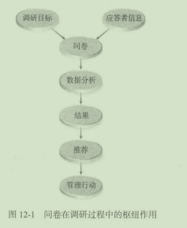

图12- 1说明了问卷的枢纽作用。它被定位在调研目标（来源千管理者的问题）和应答者信息两者之间，处千这种地位，它必须将目标转化为具体的问题以从应答者处索求信息。

间卷必须将调查目的转化为应答者能理解的形式，并从应答者那里获得必要的信息。同时｀它还必须将所得的信息重新整理成易于列表的形式，并将其转化成满足管理者信息要求的调查结果和建议。问卷在调查费用中也起着重要的作用。这一点将在本章进行详细讨论。

## 12. 2—份优秀调查问卷的标准

要设计一份好的间卷，必须考虑这样几个问题：它是否能提供必要的管理决策信息？是否考虑到应答者的情况？是否以公正的态度征求回答？是否满足编辑、编码和数据处理的需要？

### 12. 2. 1问卷能否提供必要的决策信患

任何间卷的主要作用就是提供管理决策所需的信息，任何不能提供管理或决策重要信息的问卷都应被放弃或者加以修改，这就意味着将要利用数据的经理首先要认可间卷。经理对间卷表示满意，就意味着：“好的，这种工具将提供我们进行决策的数据。“如果管理者对问卷不满意，那么市场调研人员将继续修改问卷。

### 12. 2. 2问卷是否考虑到应笞者

由于公司巳经认识到市场调研的重要性，调研的数最每年都迅速增加。问卷设计欠佳、令人迷惑、漫长的询间都会失去数千个潜在的应答者。

设计问卷的研究者不仅要考虑主题和受访者的类型，还会要考虑访间环境和问卷的长度。被访者对问卷题目感兴趣或当他们感到间题的回答不太困难时，他们会回答一些较长的问卷。移动终端调查设计给间卷设计带来了新的挑战，因为更多人愿意用这个方式完成问卷。吸引应答者的一个具有潜力的新方法是将间卷调研游戏化，为此我们根据以往经验创作了几种游戏。

问卷设计应该适合于应答者。例如，尽管父母是典型的冰冻谷物的购买者，但儿竟经常直接或间接地制定购买哪种品牌的决策，因此对儿童进行品尝测试的间卷应当用儿童的语言表述。此外，关千成人冷冻谷物购买者的间卷应当使用成入语言。问卷设计最重要的任务之一是使间题适合潜在的应答者。间卷设计必须避免使用营销专业术语和可能被应答者误解的术语。实际上，只要没有侮辱或贬低之意，最好是运用简单的日常用语。

### 12. 2. 3问卷能否满足编辑和数据处理的需要

一旦信息收栠完毕，就要进行编辑，接着对数据进行处理。间卷设计时应当考虑到后来的程序。

编辑(editing)是指检查问卷以确保按跳间形式进行，需要填写的问题巳经填好。如今的市场调研，编辑只应用于邮件和其他纸质调查。围绕问卷逻辑性的问题是由电脑和移动设备处理的。

跳问(skippattern)是根据应答者的回答而提问题的顺序。表12- 1显示了当应答者对间题4a的回答是“不”时，对其进行的一个从4a到5a的跳问。

表12- 1问卷的跳问形式

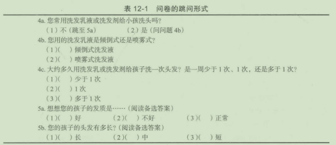

大多数市场调研数据分析软件会自动的捕捉一些编码错误。计算机辅助电话访谈(CATI)和网络软件程序会自动维护好“跳问＂。有两种灵活编写间卷的方式：

- 根据前一个间题的答案，分支会把参与者带到一系列不同的间题。这是一个简单的跳间，在这个跳间里，问题因为与应答者无关被跳过，或者是“动态分支＂，在这个动态分支里，根据他对一个问题的回答，将可能的一系列间题呈献给参与者。

- 将完整的回答传导到下一个问题中。一个参与者被要求将一个开放性问题的答案写出来（例如，他们常开的车的型号、年限、制造），这个写有答案的文档将纳入下个问题的编写中（例如，整体来说你怎样评价你的2010丰田花冠）。

开放式间题的数据处理适用千所有类型的调查，并在第15章中详细讨论。

总之｀一份问卷服务千许多管理者。首先，它必须完成所有的调研目标，以足够的深度和宽度来满足经理的信息需求；其次，它必须以一种令人理解的语言和适当的智力水平与应答者进行沟通；再次，对访间员来讲，它必须易千管理，方便地记录下应答者的答案；同时，它还必须有利于方便快捷地编辑和检查完成，也便千进行编码；最后，间卷必须可转换成能回答经理原始问题的结果。间卷也应易千数据处理。

下面的“市场调研实践11- 1"概括了用于提高回答率的间卷设计建议。

提高在线调查回答率的建议

对市场调研来讲，没有哪种方法可以与互联网相提并论，你几乎可以锁定任意一种回答者目标群体，他们可以在他们休闲的时候仔细详尽地回答问题下面是10条有价值的建议：

````
(1)确定应答者乐意参与调查。把过滤性问题和数据管理问题放在前面，谨慎使用下
拉列表。保持目标明确，保持产品特性清晰且不要超过20个。留给应答者不回答的权利，
像“不知道”和“我倾向于不回答”选项
(2)不要忘记应答者是在帮你忙，想办法让他们有个愉快的经历
(3)保证在应答者眼中产品属性的评价是简单的
(4)调查要尽可能的短，长意味着厌倦和疲劳。
(5)保持对特殊应答者及其需要或偏向的敏感，例如．青少年的研究（使用活泼的图
形，提一些与年龄相符的问题）
(6)在一些敏感性问题上，保证应答者回答的隐私
(7)给予奖励，确定他们是目标人群；对于一些长的调查，要给予慷慨的奖励。
(8)把容易引起应答者退出的问题放到调查最后已
(9)使用电话调查和语音回答来增加并保持参与率
(10)利用高速率线上互动的普遍性，如Flash等技木，这些技术可以使调研人员抽出关于消费者对广告或模拟购物环境反应的样本
````
什么因素是影响一个人回答网上问卷的首要因素?Esesrch. com位于加利福尼亚州延绵山庄，根据Esesrch. com的CEO珍妮特·韦斯特加德(JanetWestergaard)的研究，重要性排序如以下所示：O所提供的奖励，66%;(2)调查时时间是否宽裕，56%;@调查主题，37%;@调查长短，30%。

韦斯特加德认为，性别也会产生影响。相比女士重视时间的宽裕程度，男士更会被奖励所吸引；相比30岁以上(50%认为是这样的）的人来说，18~30岁的人(72%认为是这样的）认为时间因素是最重要的；相比女士(31%)而言，男士(46%)对调研主题和调查长短反应更强烈。一般来讲，男士和女士(46%)认为奖励是最重要的因素，其次是他们是否有时间(27%),只有12. 6%的人认为调查主题是主要影响因素。所以结论是：为调查设置诱人的奖励，选择合适的时间”

但是，仍旧不能低估调查主题的吸引力。在2300个成人电话调查中，调研人员发现，如果应答者对调查主题感兴趣的话，他们参与调查的概率会上升40%所以结论是：如果调查主题足够吸引人，尽早把主题展示给应答者来引起他们的兴趣，

问题：

1. 为调查草拟几个很“热”的主题，并在问卷前面的问题中，用诱人的方式来展示调查内容。

2. 考虑可能提供给潜在应答者的三种奖励的优缺点。

## 12. 3问卷设计过程

设计一份间卷包括一系列的逻辑步骤，如图12- 2所示。这些步骤巾千调研人员的不同而有些差别，但所有的步骤趋向于一个共同的顺序。委员会和管理层的方针路线会使间卷设计的过程复杂化，明智的做法是与拥有项门最终决策权的经理一起确定设计过程的每一步这对于第一步一—确定调查目标、来源和限制因素一一尤为重要。当调研入员完成一份间卷来同答某一类的问题，而真正的决策者却想得到完全不同的信息时，许多工作时间都浪费在间卷设计仁同时值得注意的足设计过程本身，如问题的用词和安排形式，可以自己附加问题或未回答的问题；反过来，可以使研究者回到第一步来寻求对信息更沽晰地描述。

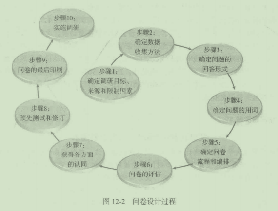
图12- 2问卷设计过程

### 12. 3. 1步骤1:确定调研目标、来源和限制因素

调研过程经常是在市场部经理、品牌经理或新产品开发专家做决策的时候感到所需信息不足发起的在- 止匕公司，评价全部二手资料以确认所需信息是否收集齐全是经理的责任；在另外一些公司，经理将所有的市场调研活动，包括原始资料和二手资料的收集交巾市场部门凶趴在第2e:义厂调研过程的讨论更多地涉及了这个问题。

尽眢可能是品牌经即发动了市场研究，但受这个项目影响的每个人，包括品牌经理助理、产品经理甚至是市场持销经理都应当一起讨论究竞斋要些什么数据，调研目标(surveyobjectives)(界定f需要的决策信息）应当尽可能精确、清楚。如果这一步做得认真彻底，下面的步骤会更顺利、更有效。

### 12. 3. 2步骤2:确定数据收集方法

前面已经给出（收头数据收染的多种方式，如通过网络、电话、邮件或自我管理式访问商场里的而对而访谈比网上间卷有更多的限制（如时问上的限制），臼我管理访问则要求间卷设计得非常冲楚，rfri且衵对较短，因为访问人员不在场，应答者没有澄沽问题的机会电话调杏经常忐要1二宫的词汇来描述一种概念以肯定应答者理解了正在讨论的问题。

显然口味的测试不能用电话或网络来做，至少那样做的话非常困难。在网上调查中，你可以给应答者出示图片或视频或解释一个概念。你完成研究目标需要获得的信息决定了你必须收集数据。

我们依赖的数据收栠方式一直随若社会和科技的变化在不断滨进。20世纪50年代，登门拜访是调研数据收集的最初模式，同答者在家中接受拜访。紧随其后的是电话访间，购物中心拦截访问这些需要面对面接触的调杏出现，让人们体验产品、评估广告等。邮件调查也开始被使用并持续发挥着重要作用．正如下面“市场调研实践12- 2"中所述。

20世纪90年代，线上访谈出现了，应答者会用电脑接受访谈。之后，我们不得不面对这样的事实，只拥有一个或几个无线电话的家庭增多，在2012年大概是40%。有代表性的样本，应包括有一个无线电话无线数字组合的家庭。另外，移动设备开始在数据调查中发挥着主要的并越来越重要的作用，据估计，25%~30%的在线调研都由这些移动设备完成。这些移动设备对间卷设计的影响在稍后讨论。“市场调研实践12- 3"强调（在线调研的霍要性，以及如何设计得不同。

市场调研实践12- 2

艾奥瓦市发现邮件调查符合其需求

我在艾奥瓦大学主修的统计学中有一门课是统计方法，邮件调查包括在内，大约6个课时。“我们没必要在这上面花费大多时间，能收到多少邮件回复都不一定。“教授说。然而几年后当我在梅瑞狄斯出版社工作时，我才知道教授错了。

我们为《更好的家具和园艺》和《成功务农》的读者做邮件调查，回复率高达80%~85%。几年后我为《成功务农》做的调查的回复率达到了75%。这些天，我使出浑身解数，仍然能使回复率达到50%。一个方法就是使用激励措施，包括随调查问卷奖励回复者1美元。这1美元没有增加多少邮费，但却为邮件调查的成功发挥了重要作用。这1美元太少了，读者不会把它当成回复问卷的报酬，但是这1美元能引起他们对问卷的注意，如此一来他们就会阅读信件的封面，这至关重要，因为“魔法”就在信的里面。

最近，我受雇于北利伯蒂做一些调查，北利伯蒂是艾奥瓦北部的一个城市，是该州发展最迅速的直辖市。这个城市对公共交通有特殊需求，他们曾尝试过自己做调查，但没有成功。

北利伯蒂城市规划的惠特利院长，解释了该项目的目的：“我们需要无误差地把握居民对巳存在和潜在城市服务的感受。在精益预算和需求不断增长的这段时间里，关注重点需求避免逐一应对是非常重要的。至于这个调查，我们期待能为交通运输委员会提供帮助，并通过帮助精确公众需求来改善停车服务和再生产。我们询问问题来帮助员工和城市委员会了解居民对现有的、潜在的服务和项目的满意度水平。”

以志愿为基础

早先北利伯蒂的服务只有公共交通，人们可以几种方式志愿地参与其中完善它，包括城市网站、在城市走廊中穿梭、从当地报纸中将它复制出来。正如你所期望的，只有对公共交通感兴趣的人才会参与，10000人中大概有104个。

我知道邮件调查可以比那种方式做得更好，但做邮件调查要花钱。纳税人不希望看到政府把钱花在这种愚蠢的事上。这从调查合作的一开始就错了。所以为了增加回复率，我的建议是把调查建立在一系列具体的事上，这样能激发每个人的兴趣。

当领导需要群众的意见时，会从市民那里期待得到什么回复呢？根据我的经验，35%~40%的概率是希望政府尽可能做到最好。假设理想的情况：人们喜闻乐见的问题；市民对领导者支持或不支持；领导者愿意花钱开展邮件调查的程度。不出错的话，推荐邮件调查的原因不是因为这种方式更便宜，合适的邮件调查技术比人们预想的要花更多钱，用合适的方式，可以把邮件调查的支出与电话调查的费用相提并论。

但是邮件比电话更好地完成调查清单。电话访问是件苦差事，核对名单再根据回复率打电话。邮件调查的另一个好处是，每个人都有收信地址，这使我在处理随机样本时充满信心，而我用电话访问时随着时间的流逝自信就被消磨了。不是每个人都有座机．私人号码也一直是个问题，尽管我所在的地区很少。大量增长的家庭，尤其是年轻一代，只有一个手机。

为了获得一个随机样本．采用将座机和手机结合起来的假设方法是非常必要的。尽管目前还没有市场调研将两者很好地结合，这种拨打手机号码的调查也引起了人们的反感。这种方法使得人们在面对电话中的问题询问时提出质疑。以网络为基础的调查，尽管快捷便宜，但并不适于面向城市居民调查。很多人不能使用网络，这妨碍了随机样本的收集。

我喜欢网络调查，我有一个具有代表性领域的清单，比如管理者花名册，但是那确实不适合面向市民的调查。尝试开发一个适合上述调查的假设方法是矫枉过正，给本来能直接解决的问题增加了复杂性和成本。

内置的误差

每种方法都有内部存在的误差。网络和手机调查更偏向年轻人。邮件调查的回复者更倾向于那些谨慎思考、更有耐心的中老年人。有趣的是，这些特点差不多都是用来形容更可能参与投票选举的人，并且邮件调查在态度评估和预测投票者可能行为这些方面做得很好。身处困境的人和那些消极的人总是比那些幸福的人更多地发生，至千他们的观点是否是有效的、择优的，这很容易被混淆视听。此外，民众对千一些问题采取无为而治的态度也使调查带有一些风险。没错，我们这里谈论的是再次选举。

我不是非常偏爱邮件调查，尽管看起来好像是偏爱。作为一个只对自己时间负责的顾问，我真不在乎我推荐的那种方法，只是为了使手头的工作做到最好。邮件调查有一些缺点，并不适合所有情况。它不适于用来评估意识，例如，因为无法阻止人们查询，所以他们回答问卷时就会变聪明。收件人还可以检查在决定回答问卷前检查一遍问卷。邮件调查比电话调查或网络调查执行起来要花费更多时间。

现有的替代

让客户最感兴趣的是，我通常寻找一些现有的替代方式，这或许能满足客户需求，在这个调查中我也这么做了。我注意到，至少有两个公司是面向市民展开调查的，我看过它们的工作，它们做了份额外的任务。从技木角度看，它们儿乎把所有的止损都撤出了。它们的报告表述清晰，完美呈现，附带许多出色的有用数据。它们考虑到市民最关心的事，它们还有客户名单。它们的问题标准很宽泛，如此一来它们能通过时间展现每年或隔年的访问，并且能对比两个城市市民的打分，这是非常有用的数据。我会毫不犹豫地推荐客户体验它们的服务。

然而，它们的缺点在于支付能力。根据客户名单，大部分市民明显感受到他们能支付得起它们的服务，然而有些小城市和城镇的客户觉得太贵了。北利伯蒂就属于这种情况，所以我设计了一种非常类似于其他公司的合理化方法，结果显示，可支付性得到提升，我向北利伯蒂要价2600美元用于计划、几次会议、材料准备、方法建议、数据录入、表格制成、报告撰写和展示等。城镇政府负贵印刷、装配、邮寄和支付相关费用。除去开会和旅游以及通过电子邮件解决问题的费用，我收取的费用能降到2000美元以下L

有的公司也采用邮件调查，但是我做了个家庭调查。它们做跟踪花了很多钱，我只是做原始邮件调查，并没有做跟踪。我同意它们所做的事，但是结果证实了我对这个过程的简化。在北利伯蒂的项目中，我们邮寄了I005封邮件，收到了334封回复，在没有使用激励措施的情况下得到33. 2%的回复率。

效果很好

对于北利伯蒂来说，邮件调查效果很好。惠特利说：“使用调查结果文件我们能诚实地真实地报告并在调查的问题之内按优先原则填答，它帮助我们回应市民感兴趣的软事和问题。”

正如他所指出的，当市政府努力了解市民的观点，通过科学的项目调查这些方式是很重要的口调查必须解决问题并且不能遗留争议。我喜欢人们说：“好吧，这不是一个科学调查。”所以你为什么烦恼？没有什么你可以指望的是学到的。目标是不要使用最新的方法，相信你能相信的真相。

从长远来说，和一个职业调研人员一起工作涉及了第三方的参与，所以不是说政府人员被不满意结果的市民所攻击。职业调研人员能提供一个令人信服的和可以理解的结果

问题：

1市场调研实践数据中指出的邮件调查的优点是什么？在其他调研方式中也有这些优点吗？

2. 邮件调查的缺点是什么？

3邮件调查始终是最好的吗？为什么是或为什么不是？

市场调研实践12- 3

有效的手机调研的方法

智能的、可上网的手机调研的增加始终没有减退，对于许多顾客来说，这些移动终端代替了那些收集在线调研数据的台式机和笔记本电脑。2011年用移动终端调研的还不到2%,然而，美国和其他国家从那之后经历了以移动终端为中心的调研方式的转变。

随着使用移动设备的调研越来越多，相比于台式机和笔记本电脑CatalystMR25%~30%的在线调研都能用移动设备完成。与准确使用移动设备收邮件相关联的，美国所有邮件的36%是由移动设备打开的因此必须事先考虑一个用于在线调研的移动数据收集策略。

美国国内的数据收集，由于市场份额的下降和顾客行为不同，对功能机（或非智能可联网的设备）的考虑不是关键。在美国，这些非智能可联网手机与智能机相比不会被用来浏览网页或购买东西。

因为国际智能机对功能机的接纳不是很迅速，以及世界不同地区的文化和经济不同（可联网的功能机很受欢迎），开展调研需要根据具体问题具体分析，以使功能机能用于在线调研。

换句话说，对于使调研能够在功能机上开展这一事，在世界其他地方比在北美和欧洲更重要。国际上对智能机认可的趋势是持续的，如在亚大地区和拉丁美洲这些地区，功能机的作用包括网上冲浪和线上购买，超越了智能机和平板电脑。在这些区域和除北美、欧洲以外的世界上大部分区域，人们都能用全功能机上网冲浪。

作为开展调研和行为模式的工具，移动设备被越来越迅速地普及。结果，任何远瞻性的最佳实践都是不断变化的目标。否则，组合一个最佳实践的清单仍然是一个值得努力的工作。

问题的数蜇和调查长度

几年前，CatalystMR对其客户说，5~7分钟的问题对于移动设备的问卷调查来说很合适，不能再超过这个长度了。然而，随着移动设备的改善以及应答者使用移动设备更加频繁，更长的问卷正被人们接受。事实上，对很多人来说，比起台式机，他们更喜欢移动设备。另外，应答者发现并接受了移动设备比台式机和笔记本的屏幕空间更小。我们推荐的移动设备的最长调查长度大约和台式机相同：20分钟及以下，理想的是10~15分钟及以下，尤其对智能机来说。

当调查长度超过20分钟，我们能看到完成问卷的应答者人数减少了，这与设备种类无关。请记住：越短越好。你需要考虑到应答者与品牌的关系、顾客的期待、调查的市场影响、奖励金额、面板与非面板，以及其他可能使你的调查更简明的因素，可能只需要5~15个问题。

使用平板电脑的应答者比使用智能机的有更长时间的耐心，可能由于智能机需要在;J屏幕上上下滚动问卷；使用功能机的应答者比使用智能机的耐心更少，可能是相同的原因。对于功能机用户，这些应答者应被提供一个缩小比例的调查问卷，以减少应答者的疲劳感并减少中途退出率。

记住这些的同时，仍要知道移动设备调查比台式机仍有很高的中途退出和放弃的概率。然而，无论是网上调查还是通过移动终端的调查，调查结果都趋同。很少有例外，比如需要大屏幕的调研问卷（联合研究、大型或复杂的网格演示等）。调查结果与调查使用的设备无关。

何时缩减问题：移动设备和台式机

如果你的调研超过了15分钟，考虑一下要限制移动设备上问题的数量。为了避免应答者疲劳和不必要的中途退出，想想围绕你调研的最多JO个问题。例如，如果你准备了一系列问题询问应答者，评估一下他们对15个问题的满意度，考虑一下询问智能机用户最重要的JO个问题。或者也许旋转块的属性，以至于所有的属性都被评为被调研人员的一个子集。

调查设计：问题种类、设置和逻辑

缩减的问题要限于5个或最多7个。JO分制的问题占用屏幕大多空间并因此需要向左向右滚动或收缩屏幕可视范围，使得问题很难回答。

试着限制每种属性的文本数量。过多文字属性的文本占用屏幕太多，增加了滚动屏幕的需要。

问题的排序在智能机和平板电脑上是全功能的。再次强调，过多的文字或过多的选项对小屏幕来说会使页数增多，看起来变得很复杂。在智能机上，要时常考虑问题越长垂直滚动越多，使问卷更难被完成。

其他问题种类包括数字广播（单选）、复选框（多选）、文本和适合于智能手机和平板电脑的下拉菜单。

为了减少滚动，最好的方法就是一个问题占一个屏幕。

调查逻辑：任何可获得的在线调查的调查逻辑都与移动设备调查相似。

一个调查引擎（与平台无关）：在可联网移动设备上运行的调查与在台式机上运行的一样，因为调查引擎是一样的。在我们公司的案例中，由于调查引擎是一样的并且CatalystMR跟踪用户代理数据，用户代理数据可以驱动调查逻辑，这意味着你有能力基于调研设备自定义调研逻辑。

装置信息

我们的调查系统，例如从用户的设备自动捕获许多数据点。我们可以用容易理解的方式报告这些数据反馈。

调查介绍（包括弹出的邀请）

为调查做出介绍和邀请这一环节需要特殊考虑。考虑以下情况来改善你的调查前准备：

- 使邀请看起来吸引人。

- 发出生动的电子邮件申请，因为这样会带来更好的结果，并且不会被垃圾邮件过滤器自动过滤掉。

- 使邀请的文本内容简短清晰并令人信服。邀请会吸引读者几秒钟的注意，所以你说的内容要有用。

- 如果调查邀请只是被发送到一个具体的人群，要让应答者知道。这可以传达一个观点，就是应答者有机会收到回馈。

问题：

1. 用移动设备完成调查有什么主要的约束？
2. 为移动设备设计调查问卷时，在涉及调查问卷长度的问题数量上主要考虑什么？
3. 当考虑到移动终端调研的管理问题时，关于问题种类，设置和逻辑都要考虑什么？

### 12. 3. 3步骤3:确定问题的回笞形式

一旦数据收集方法确定下来，调查中所需要的间卷类型必须确定下来。在市场调研中，有三种主要的问题类型：开放式问题、封闭式间题、量表应答式间题。

1. 开放式问题

开放式问题(open- endedquestions)是一种应答者可以自由地用自己的语言来回答的
间题类型。也就是说．调研人员没有对应答者的选择进行任何限制。

开放式问题对调研人员来讲有好多优点。它可以使应答者给出他们对以下问题的一般反应：

(1)您认为利用邮寄目录公司定购比本地零售有什么优势？（追问：还有什么？）

(2)为什么您宁愿请专业清洁公司来清洗您的地毯，而不愿自己或家人在家清洗？

(3)您认为这里的机场在哪方面最需要改进？

(4)产品色彩中哪类颜色是您最喜欢的？（追间：您最喜欢什么颜色）

(5)您为什么认为某种品牌（您最常用的）更好？

以上问题都是从不同的全国性询问调查中抽选出来的，涉及五种产品和服务。注意，在间题(2)和(4)的开放式间题是跳间的一部分。在被询问间题(2)之前，应答者巳经暗示了他们选择专业地毯清洁服务而不靠家庭成员清洗。

相同的是，开放式间题也许会为封闭式间题提出额外的选项。例如，以前没有认识到的邮购定购目录的优点，可能从间题(1)中揭示出来。这个优点可能会在用封闭式间题调查时被忽略掉。

一位与作者磋商的厂商总是以下的问题结束一份产品定购的问卷：“对于过去3周中您试用的产品，您还有其他意见向我们反映吗？”这样的间题可能为研究人员获得最后的珍贵信息提供了更多的顿悟。

亚历克萨·史密斯(AlexaSmith)是纽约研究中心的主任，他建议为了获得更好的理解，应该提问一些开放式问题，在随后“市场调研实践12- 4"中将会出现。

开放式问题不是没有缺点，一个缺点是在编辑和编码方面费时费力。对开放式回答的编码需要把许多回答归纳为一些适当的类别并分配给号码，如果使用了太多的类别，各种类别的频次可能很少，从而使解释变得很困难；即使使用了适当的类别，编辑人员也不得不解释访间人员所记录的内容并且强制地将数据归类。如果类别太少，回答都集中在几个类别上，信息又变得太一般，重要的意思就会丢失。

市场调研实践12- 4

有用的开放式问题

下面是一些开放式问题，通常没有被注意到，但却能产生很深刻的理解。

(1)什么因素可以使你使用或购买一项产品或服务？这样的问题在焦点小组讨论或深度访谈中是很有用的。至少，它可以为问卷前面的发现做一个即时的总结。它也可以被当成一场讨论会，对前面问卷没有涉及的问题进行讨论。例如，在一个关千欧洲发行的儿童杂志调研中，应答者反映文章应该被简化，所举的例子应该能够被美国的儿童所接受。

(2)关于产品、服务和促销，什么才是最好的？这个问题比传统“你喜欢它什么“产生更好的效果，并且能够作为传统“喜欢”问题的补充。一个食品公司推出了一种冷冻早餐，无论从口味还是质量上．都还不能为公司赢得任何奖项。如果再问应答者关千这种食物你喜欢什么，将会一无所获，因为应答者对这种产品本身就很不满意。然而，通过问这种食物的最大的优点是什么，公司发现这样会是一种“解决之道”。在调研中，很多应答者是有工作的母亲，她们希望能够有一种方便的、迅速加热即食的早餐提供给自己的家人。基于简单“喜欢”问题的回答，所有想法可能都巳经讲出来了，但是基于“最好”问题的回答，顾客就会知道公司将会做什么事，即对产品口味和质量的改进

(3)关于产品、服务和促销，什么才是最差的？这是“最好”问题的对立面，这个问题往往能带来意想不到的答案。讨论起看牙医的经历，应答者能很理性地说出他们的厌恶，包括疼痛、花费、不安全感。当你被问起“看牙医时，发生在你身上最差的事情是什么＂的时候，很多人会回答：“你会死的！“死在牙诊的椅子上是很少发生的，但是这些回答使调研发起者明白了人们是可以理解自己处的恐惧水平的。

(4)是否进行了主要思想登记？至少调研人员可以知道应答者是否真正理解问题。要求主要思想登记(mainidearegistration)往往是确认沟通是否顺畅的捷径，否则，关于主题的沟通问题会妨碍主题的接受度。有时实施过程是主题是否发生偏离的关键。在焦点小组和访谈中，快速修正可能会消除误解，也可能改变主题。如果应答者不能理解潜在的意图，他们就会觉得这个问题有歧义或者难以回答。

(5)朋友和亲密伙伴怎样涉及这种主题？有时一个令人侧目的想法或主题会引起消费者的不满。当一个公司努力为自己营造一个高端的形象时，这种情况就会发生。在这个例子中，消费者会暗示：他们不会如此势利来涉及此类问题。当这种情况发生时，把问题变为第三人称，这样优势就会很明显，例如“你知道交流过这种想法的朋友或伙伴吗＂，如果应答者回答”是＂，调研人员就能确定，对于这个问题其朋友和伙伴是什么样子的。在谈论其朋友和伙伴是怎样涉及这种问题的过程中时，顾客就会以一种社会更认可的方式谈论到自己。很多客户没有这样的意识，不顾善意的警告，只想知道应答者自己怎么想的。

(6)在使用这种产品和服务之前，你会做什么？年龄较大的女士有被问到最喜欢杂志的情况，尤其是当她们脱下鞋子，穿上拖鞋，换上舒适的衣服，独自去阅读杂志。阅读杂志是她们完全为自己做的事情，出版商就会知道对于这些女人而言，杂志是很珍惜的伙伴这些难题可以通过预先为开放式问题编码加以部分解决。假设在一项食品调研中有这样的一个问题：“如果可以任意添加调料，当你在家准备炸玉米卷时，除了肉以外，你还会加什么？当然，这是一个开放式问题，而且可列编码种类如下：

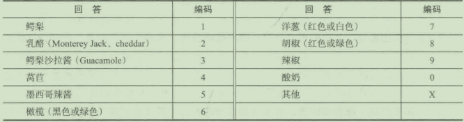


这些问题会列在问卷上，在最后栏内留一定的空间给答案以外的其他类。在电话访谈中，因为应答者看不到编码种类，而访问人员又不得泄露，问题仍将以开放式进行回答。当然，预先编码要求对以前类似性质的研究足够熟悉，以能对应答者的回答做出正确的预期，否则，则要大样本的预先测试。

开放式问题的关键在于解释处理的范围。为此，必须进行二阶段判断：首先，研究者必须确定一套合适的分类；其次评价每个答案各属千哪一类。

开放式问题的最后一个不足是它们不适合使用在一些自我管理型问卷上。如果没有访问人员在追问，一个浅显的、不完整的或不清楚的回答可能记录在问卷上例如，上述"taco"问题如果使用在自我管理性问卷中，而没有预先编码的选择答案，则可得到的回答可能是“我每样多加一点”或“与饭店添加的一样”等这类对调研人员来讲没有多大价值的答案。

通常，开放式问题需要探测(probing)。探测意味着调研人员鼓励回答者将讨论进行得完善或继续下去。强大的探测将讨论提前迅速远离顶部的心理反应和最后的答案，并接触到更深层的信息，让洞察驱动行为。

探测分为三个不同的领域：积极主动、无反应和自发的。蔽后一种也被称作“自然探索”，因为它从调研人员的脑海中突然出现，调研人员阴白更深层的洞察需要被表达出来。例如，一个回答者说：“当我发现检查的线太长时我会很烦躁。“自发的探测应该是：“是什么使你烦躁？”

相对地，积极主动的探测是可以事先计划的，看起来像是如下情形。原本的间题可能是：“你买上一辆车时对你来说重要的关键影响因素是什么？“积极主动的探测可能是：“回顾一下你脑海中的那些关键因素，哪个在你的购买决定中起关键作用？”一个积极主动的探测可以是事先计划好的，以使讨论进行得更好，直达调研目的。不时地，积极探测的家庭可能有来自自然探测的来访者。

无反应探测类似千自然探测，它们更像是＂膝反射"(kneejerk)。最常见的是：”是什么使你那么说？”“你信仰的基础是什么？”这些探测间题比起询间回答者的行为更多的是间他们的思考底线。如下面几个例子：

```
要求阐述：＂跟我再说说。”“给我个例子。”
要求单词联想：“你这么说的意思是·····". . 这个说法对你来说意味着什么？”
要求说明：“是怎么区别的？”“在哪种情况下你会. . . ···"
要求比较：“和是怎么个柏似法？”“哪种花费更多，X还是y?"
要求分类：＂适合哪里？”“这个种类的还有哪些？”
```

2. 封闭式问题

封闭式问题(closed- endedquestion)是一种需要应答者从一系列应答项中做出选择的问题。封闭式问题的优点主要是避免了开放式间题的缺点。应答者读出选项也许提醒记忆，从而提供了一个更实际的应答；封闭式问题可以减少访间人员误差，因为访问人员只需在选项上点击一个框或画圈，记录下编码或按一下键，因为应答者无需对有关主题进行介绍，从而避免了想那些善千表达自己意思的人倾斜的偏向；最后，编码与数据录入过程被大大简化了，也就大大减少了这方面可能发生的误差。

认识到预先编码的开放式问题与多项选择题间的差异是非常尔要的。一个预先编码的开放式间题允许应答者随心所欲地回答，访问人员只是根据他们的回答在记录单上钩一下或画一个圈。追问被使用，但列出的答案从来不读也不给应答者看，如果应答者给出的—种回答没有预先编码，它就被在其他栏内逐字记下。相应地，封闭式间题要向应答者读出选项或给他们看。

传统上，市场调研人员把封闭式问题分成二项选择题(dichotomousquestions)与多项选择题(multiple- choicequestions)。二项选择题又称为“两分式”，而多项选择题常称为“多项选择题”或“多分式”。

(1)二项选择题。在二项封闭式问题中，回答类别有时是暗示的。例如，你对以下问题如何反应：“上星期您为汽车加油了吗？“很显然，暗示的选项是“是”或“否＂。尽管事实上有时回答是：“上星期我租了辆车，他们替我加满了油，那算不算？”这类问题仍被归类为二项封闭式选择题。下面是几个二项选择题的例子：

1)您在抽丹麦卷烟时要加热吗？

是

否2

2)联邦政府并不关心像我这样的大众，您怎么认为？

同意

不同意2

3)您认为今年的通货膨胀比去年严重，还是有所缓解？

严重

缓解2

由于应答者被限千在两个固定的选项中加以选择．这容易管理，应答者也可以快速方便地回答间题。很多时候要加上中立的或无意见／不知道以兼顾到这些情况，即有时问卷未给出中立选项，访间人员也会潦草地写上DK表示“不知道”，或者NR表示“未回答"。

(2)多项选择题。对于多项选择题而言，不需要像开放式间题那样编码，但只能提供有限的信息。多项选择题要求被访者给出一个正确表达了他意见的选项，或者在某些情况下表明所有合适的选项。下面是多项选择题的例子：

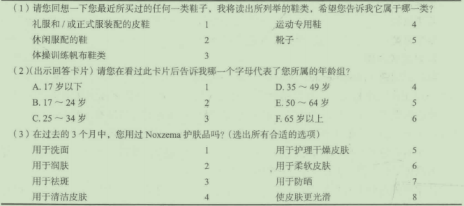

第一个问题可能没有涵盖所有选项，这样就可能得不到真实的回答。例如，访问人员在哪儿记录工作鞋？同样的问题存在千第三个间题。选项不能包括所有可选择的答案，而且受访者无法详尽或合格地表述答案，这个问题部分可通过增加“其他“选项来克服。

封闭多项式问题还有两个缺点。首先，调研人员必须花许多时间来想出一系列可能的答案，这阶段也许需要焦点小组访谈的录音分析、头脑风暴和二手资料调研。另一个问题是可能的选项范围。如果列出的选项太长，受访者可能会被搞糊涂或失去兴趣。与上面间题相关的是次序误差。受访者一般对排在前面和后面的答案有优先选择的倾向，而其他的选项则相同。然而，当网上间卷软件和CATI开始使用时，次序误差会通过自动调整答案顺序而减少。

3. 量表应答式问题

最后一种应答形式是量表应答式问题(scaled- responsequestions),它是一种封闭式问题，并且答案选择可以对感觉强度进行测量。考虑以下问题：
````
(1)既然您已试用了该产品，您将购买它吗？（选一个）
是的，会购买
不会购买
(2)既然您已试用了该产品，您将. . . . . . （选一个）
肯定购买
可能购买
也许会也许不会
可能不会购买
肯定不会购买
````

第一个问题没有抓住强度，它只是决定了方向（买与不买），在完整性与反应强度上不如第二个，后者本质上也是次序行的。技术上，问题来源千数据，但一般被作为度量性的。详见第10章对不同类型数据量表的讨论。

量表应答式问题的主要优点是可以对应答者回答的强度进行测量，另外，许多量表式应答可以转换成数字，并且这些数字可直接用于编码。最后，对量表应答式间题，调研人员可以使用一些更高级的统计分析工具（参见第17章）。

### 12. 3. 4步骤4:确定问题的用词

一旦确定了问题的内容和回答的形式，下一步就是实际设计问题。对调研人员来讲，在特定问题的用词上总要花相当长时间，除非使用的是间卷设计软件或者像Perseus的调查网站。对调研公司来说许多间题都能被用于多类调查、整体问卷选项以及在通常的提问方式上并不是难事。

要记住四条一般的指导原则是非常有用的：O用词必须清楚；＠选择用词以避免误导受访者；＠考虑到应答者回答问题的能力；＠考虑到应答者回答问题的意愿。

1. 用词必须清楚

一旦调研人员认为间题是绝对必要的，那么问题的表述对每个人来说必须意味着同样的意思，应当避免使用含糊不清的词语。比如：＂您住在离这里5分钟路程之内的地方吗？”或者“您通常在哪里买衣服？“第一个问题有赖千来这里的方式（应答者可能是步行），开车的速度，对消逝时间的感受（更好的做法是向应答者出示一种具有该地区某种描绘的地图，然后再问他们是否住在某一地区内）；第二个问题有赖千对服装的样式和词语“哪里”的解释。

明晰(clarity)也意味着使用合理的用语，问卷不是词汇测试，应当避免专业术语。用语要适合千目标观众。例如问题：“请说一下您最常用的洗碗剂的功效如何？”可能不少人拒绝回答。更简单的问法是：“您对现有品牌的洗碗剂是：O非常满意；＠有些满意；＠不满意。“最好的用词是具有准确的意义、普遍的用法并且没有含糊其辞的表达。当应答者不能明确问题的意义时，拒答的现象将增多。

选择用词更复杂的是需要根据目标受访者群体来修改用词，考虑他是否是律师还是建筑工人。这一建议很明显，但也存在错误的应答者参考构架导致灾难性后果的例子。例如，在“一般您每周喝几瓶啤酒”这个间题中瓶（或听）一词的使用。在南方的一些州．啤酒装在32、12、8、7、6甚至是4盎司的瓶子里，所以能喝8瓶的＂嗜洒者”可能每周只喝32盎司的啤酒，(8x4盎司）；形成鲜明对比的是，一个只能喝3瓶的“不善饮酒者”却喝了96盎司的啤酒(3X32盎司）。

在访谈的开始可以通过说明调查的目标来提高透明度，通常应答者应该了解研究的性质，所期望的但并不是必须要知道由谁来主持项目。这不包括确定调查的赞助商，这可能会使受访者产生偏见。

有时分类的问题并不是互斥的。比如：

您税前年家庭总收入是多少？

(l)少千40000美元

(2)40000~60000美元

(3)60000~80000美元

(4)超过80000美元

所以，如果一个应答者的家庭收入是60000美元，他会选(2)还是(3)?

下面是一个意义有冲突的问法。

请选择您最常使用的产品，可以多选：

(1)手机

(2)烤面包机

(3)微波炉

(4)真空吸尘器

在这个问题中，“最常使用”和“可以多选“是冲突的结构。

当需要多选时，调研人员必须认真决定。下面网络调查间题只允许选一项，但是应该”可以多选“。

您喜欢在一天中的哪个时间查看邮件？

- 早上
- 中午
- 傍晚
- 夜间
- 一周查看一次邮件或更少
- 不用邮件

调研人员必须获得有效的回答。下面的例子很明显，但是在一些情况下，回答是非常微妙的。

您最喜欢什么颜色？

- 红色
- 绿色
- 蓝色

为了提高透明度，调研人员应当避免在一个句子中出项两个问题，有时又称为“双向式问题”，例如：“您认为咖啡蛋糕的味道和原料如何？”此问题应分为两个问题：一个有关味迫，另一个有关原料。每个问题应该只阐明一个方面。

2. 避免应答者误差

像“您常在低档店购物吗”和“您曾在过去的6个月中购买过任何高质量的百得(Black&Decker)工具吗”这样的问题，会导致一个显而易见的误差。有些问题是诱导性的，例如：“您对昨晚上在假日酒店得到的服务满意吗？”然而，误差可能比这些例子中说明的更微妙。

调研发起者在访问过程中过早地被识别，也会使回答发生扭曲。例如，“我们正在进行一项关千东北国家银行的信贷质量研究，想问您几个问题”这样的开场白应当避免。相似地、如果在进行了三个问题后，每个问题都与米勒啤酒有关，那么应答者不会花很长时间就认识到是在进行米勒啤酒的调查。

3. 考虑到应答者回答问题的能力

在某些场合，应答者可能对回答问题所需的信息一无所知，间一位男士他的妻子最喜欢哪种牌子的缝纫线就属于这种类型，问应答者从来没有遇到的品牌或商店也会产生同样的问题。当问题的表述方式暗示着应答者能够回答，那么在答案是现成的这些情况下，得到的答复除了瞎猜之外，没有什么价值，这就产生了误差。

第二个有关这方面的间题是遗忘。例如，你可能记不住以下间题的正确答案：“您在电影院里看到的最近的一部电影名是什么？”“谁是主角？”“您还有爆米花吗？”“容器容积是多少盎司？”“爆米花的价格是多少？”“您还买了其他零食吗？”“为什么买或不买？”应答者一般也记不住。另外一种情况是，玛氏有限公司的品牌经理很想知道应答者上次购买糖果时考虑了哪些品牌，购买的是什么品牌以及什么因素导致他们选择该品牌的。如果市场调研人员直接问应答者也会产生测量误差，应答者经常会给出一个名声响的品牌，如星河(Milkyway)或好时(Hershey)。而在另一种场合，应答者也许会提一个他经常购买的品牌，但很可能不是最后一次购买的品牌。

为了避免应答者记忆力差的问题，时间期限应当保持相对短。例如：“在过去的7天里，您购买过糖果吗？“如果回答”是＂，才可间什么品牌和购买动机问题。对千“去年您租了多少碟在你的DVD上看？”这类鳖脚的问题，调研人员可以用如下间题取代：

(l)在过去一个月里，您租了多少影片在你的DVD上看？

(2)在过去一个月里，您租了更多、更少或者是每个月的平均水平的影片看？（如果是“更多”或“更少＂，再问下面的问题。）

(3)您每个月租碟的通常数题是多少？

下面有两个实际调研中产生的两个间题：第一个是来自邮件调研，第二个是来自电话调研。间题l:在过去的三个月里，对千报纸上所宣传的电影您花了多少钱？大多数人不会对在过去三个月里的电影花费有任何线索，除非是没有任何花费。他们也记不起哪些电影在报纸上做过宣传。如果应答者是为全家买票又怎么办？问题2:在您过去10次喝威士忌中，有几次是在家里？几次在朋友家里？几次在饭馆里？几次在酒吧或者洒馆里？一个轻度威士忌嗜饮者喝完10次要至少花两年的时间！也许，他会写一份威士忌饮酒日志，但是这是值得怀疑的。

如果上面两个问题是不好的，但下面这份来自于邮件调研的问题，要么是一个粗心的问卷设计者的设计，要么他与我们大多数的生活方式不同。

问题1:通常一天您会用多少次腋下产品？一天一两次？一天三四次？一天五六次？一天六次以上？

问题2:您一天洗几次澡？一天一次？一天两次？一天三次？一天匹次？一天五次或更多？

有一个好的打扮非常很重要，但是这些间题或许已经超过底线了。

4. 考虑到应答者回答问题的能力

考虑到应答者回答问题的意愿，一些东西应答者可能记得很清楚，然而他们也许不愿给出真实的答案。如果一个问题被判定为尴尬的、敏感的、有威胁的或有损形象的问题，这类问题要么得不到回答，要么朝社会准则的方向倾斜。

涉及如借钱、跟人卫生、性生活以及犯罪记录等尴尬话题，间题必须小心表达，以减少测量误差。一种处理技术是用第三人称方式提间，例如：＂许多人的信用卡都透支，您知道是什么原因吗？“通过问其他人而不是应答者自己，调研人员也许能够更多地了解到对有关信贷和债务司题的个人态度。

第三种处理尴尬问题的方法是在问间题前声明这种行为或态度是很平常的，例如：＂许多美国人都患有痔疮，您或您的家庭成员有这方面的问题吗？”这种技术被称为对等误差表达，他使应答者以平常心来讨论尴尬间题。

### 12. 3. 5步骤5:确定问卷流程和编排

在系统阐述间题后，下一步就是将其排序并形成间卷的版面编排。问卷不能任意编排，间卷每一部分的位置安排都具有一定的逻辑性（见表12- 2)。有经验的市场研究人员很清楚问卷制作是获得完整访谈的关键。结构组织好的问卷可以使应答者思考和回答得越仔细。研究人员经过总结巳形成问卷流程的一般性准则。

表12- 2问卷如何组织
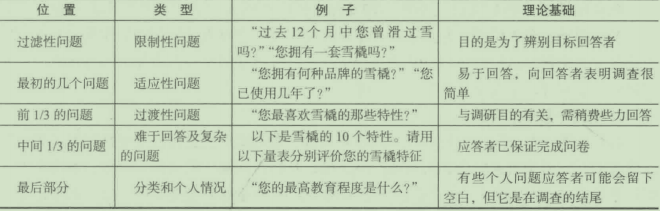

1. 运用过滤性问题以识别合格的应答者

许多市场研究运用各种配额抽样方法。只有合格应答者被访间，才能得到每类合格应答者特定的最小数量（配额）。例如，有关食品生产的研究一般都有具体品牌使用者的份额，杂志研究要筛选读者，化妆品研究也要筛选出对品牌知晓的应答者等。

过滤性问题(screeners)可能出现在问卷上，在许多情况下也可能会提供“过滤性间卷＂。此时，过滤性问题要由接受访谈的每个人来埴写。这样，任何得到的人口统计资料提供了对符合全部研究要求的人进行对比的基础。一个长的过滤性问题会大大提高研究费用。这意味着你正从每次与应答者的接触中得到更多的信息。然而，一个较长的过滤性间题可提供关千未使用者、未适用者或对正在调查的产品或服务不了解的人的重要信息。如表12- 3中较短的过滤题可以很快排除不合格的受访者，并使访间人员可以立即转向下一个潜在应答者。

表12- 3一份关千寻找手动剃须刀，一周至少刮三次脸的15岁以上的男性过滤性问卷

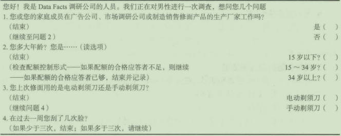

最重要的是过滤性问题提供了估鍔调查费用的基础。在其他条件都一样的情况下，一个所有人都适合接受访谈的调查会比有5%不合格率的调查费用低很多。许多调查都为每份完成的问卷设笆了平均服务率，此比率以一个既定的“平均访谈时间和不合格率”为基础。过滤性间题用来确定在一特定的城市中实际上不合格率是否真实。如果不真实，该比率要相应地调整。

2. 以一个能引起应答者兴趣的问题开始访谈

在介绍性引导语和经过过滤性问题发现合格的访问人员后，起初提出的问题应当简单，容易回答，令人感兴趣并且不存在任何威胁。用一个收入或年龄间题作为起初的问题也许是一大错误，这些问题经常认为具有威胁性，并且立即使应答者处千防卫状态。起始间题应易千回答，不需要许多事先的考虑。

3. 先问一般性问题

在开始的“热身“性问题之后，问卷应该按一种逻辑形式进行一般性问题首先出现以使人们开始考虑有关概念、公司或产品类型，然后再问具体的问题。例如，有关洗发水的间卷也许会这样开始：“在过去的6个星期里，你曾经购买过洗发水、护发索和定型剂吗？＂促使人们开始考虑有关洗发水的问题；然后间及有关洗发水的购买频率、在过去3个月呈所购品牌、对所购品牌的满意程度、再度购买的意向、理想洗发水的特点、应答者头发的特点；最后是年龄、性别等人口统计方面的问题。

4. 需要“思考＂的问题放在问卷中问

起初，应答者对调查的兴趣和理解是含糊的，培养兴趣的问题为访间过程提供了动力和承诺。当访间人员转到量表应答式间题时，应答者受到鼓励去理解回答的类别与选择。另外，在部分应答者身上，会有一些间题需要记忆，已建立起来的兴趣、承诺和与访间人员间的融洽关系保证了对这部分访间的回答。

5. 将敏感的、威胁性的和人口统计的问题放在最后

正如早先提到的，研究的目标有时难免会使回答者感到尴尬。这些话题应当放在间卷最后，以确保大多数问题在应答者感到被冒犯之前被回答了。另外，把这些问题放在最后会使被访问者条件反射性地回答了。换句话说，应答者进入了一种回答模式，看见或听见问题就回答。

6. 提示要用特殊字体

为了避免混淆并分清什么是问题，什么是提示，所有自我管理问卷的提不都要用特殊字体，比如“如果间题13回答＇是＇，则跳到间题17"。特殊字体有助千让提示引起应答者的注意。当然，这可以由基于计算机的调查自动完成。

7. 使用合适的引言和结尾

每份间卷必须有一个引言和结尾。在众多不同研究的基础上，CMOR提出了一个调查引言和结尾的模板。CMOR建议如下：

(1)引言／开头模板。
- 为了获得应答者的信任，访谈者应该提供出他的姓名，或者就联系人姓名达成一致。
- 如果合适的话，提供调研人员的公司名字，必要时也要提供客户／发起者的姓名；若不合适，对调研结果反而会造成误差，比如我们进行一个图形调查，定义发起者的身份就是不好的。
- 用平常的形式，解释调研主题／题材的本质。
- 尽早地官布调查不会涉及推销。
- 在引言中，应答者应被告知调查长度是适度的。
- 被推荐为标准的做法是取得两方同意来进行监控／记录。也就是说，无论是申请人还是访问者都应当被告知：为了调查质量，电话可能被监控／记录／质社控制v
- 强调应答者的时间是宝贵的I值得珍惜。
- 邀讷衍答者参与到调查中，确定调查时间是否合适，如果不合适，提供一个可供选择的回访时间来完成调查。

您好，我是，我从（公司）打电话过来。今天／今晚我们收集关于（一
般主题）的看法，不会销售任何东西。这个调查的长度是适中的，为了调查质
量，该过程可能会被监控或记录。我们非常感激您的配合。我可以知道您的看
法吗？

(2)结尾校板

- 在调杏的总结处，感谢应答者抽出时间配合。

- 如果应答者有一个愉快的调查经历，表达需要其参与以后的市场调研的意图。

- 提醒应答者的看法是很有用的。

非常感谢您参与这个调查，希望您对答题经历感到渝快。请记住，您的看法

非常重要J祝您愉快！

### 12. 3. 6步骤6:间卷的评估

一旦间卷草稿设计好后，问卷设计人员应再回过来做一些批评性评估。如果每个问题都是深思熟虑的结呆，这一阶段似乎是多余的。但是，考虑到间卷所起的关键作用，这一步还是必不可少的。在问卷评估过程中，下面一些原则应当考虑：中间题是否必要？＠问卷是台太长？＠问卷是否回答了调研目标所需的信息？

1. 问题是否必要

可能问卷评估方面最重要的标准是所有的问题都是必要的。有时研究人员和品牌经理想间问题，因为“他们正在进行我们所感兴趣的调查”，或因为＂了解是有好处的＂，过多的人口统计间题是很普遍的。有关教育数据、各年龄层次儿竞的人数和有关配偶的广泛的入口统计不只是以许多研究的屈性为根据的。

问题应是必要的，即每个问题都必须服从于一定的目的，要么它是过滤性的，要么是培养兴趣的，要么是过渡用的，要么与所陈述的特定调研目标有关。任何问题如果不能达成上述目的中的一个，就应当删去。

2. 问卷是否过长

在这一点上，研究者应该利用志愿人员充当应答者以判断回答的时间。尽管没有一定之规，完成问卷花费的时间取5次最短时间的平均数。在街上拦截或电话调查的问卷，如果访问长度超过20分钟，应当考虑删减；如果有比较有吸引力的刺激物，问卷可稍微长一些。大多数网上调查不应该超过15分钟。

礼品卡（如准备好的签证）是现在最常用的刺激物了。使用刺激物实际上经常可以降低调查成本，因为回答率会增加，访间过程中的中止率会下降。

分间卷设计技术可以诚少间卷的长度。当问卷过长或样本过大时就会被使用到。间卷被分为一个主体间卷（如人口统计部分、使用方式、消费者心理学）和一系列子间卷。应答者必须回答主体间卷和任选一个子间卷。

3. 问卷是否回答了调研目标所衙的信息

调研人员必须肯定有足够数械和类型的问题包含在问卷中以满足管理者决策的信息要求。一个建议的程序是，先仔细回顾一下写好的调研目标；接着，调研人员检查一下间卷，在特定问题所完成的调研目标旁写下该间题的题号，例如问题1用于目标3'间题2用千目标2等。如果有些问题没有与目标相联系，调研人员应当判定目标是否都完成了。如果都完成了，问题应当删去。此外，如果检查了所有问题，有目标旁没有列出问题或有些目标虽有一些问题，但目标并不能完成，那么，应当在问卷上加上适当的问题以保证该目标能完成。关千写好一个间卷的建议见“市场调研实践12- 5"。


运用这些要点来撰写一份优秀的问卷

如果你曾将你认为的“最终”问卷送给一位市场研究人员，结果拿回的问卷上到处是添加或删改的痕迹及其他编辑意见，这并不奇怪。乍一看，撰写问卷并不是一件非常困难的任务：只要表达出你想了解什么，并且写出能得到那些信息的问题即可。虽然撰写问卷很简单，但撰写优秀的问卷却不容易。这里有一些在撰写问卷时应该做和不应该做的要点。

(1)避免使用应答者可能不明白的缩写、俗语或生僻用语。例如，你对PPO的意见是什么？很可能不是每个人都知道PPO代表优先提供者组织(PreferredProviderOrganzation)。如果这一问题以一般公众为目标应答者，研究人员可能会遇到麻烦。此外，如果针对的是物理学家或医院管理者，那么缩写PPO很可能是被接受的。

(2)要具体。含糊的提问得到含糊的答案。例如，您的家庭收入是多少？当应答者给出问题的数字答案时，其答案是各式各样的，如税前收入、税后收入等。另外一个例子：在过去儿年中，您经常是多长时间参加一次体育活动?CD从未参加；＠极少参加；＠偶尔参加＠经常参加。这一问题的解释也是开放性的。人们对于“体育活动”和答案会有不同的理解，“经常＂的意思是每周一次、每月一次或是其他。

(3)另一方面，也不要大过于具体。当问题过于精确的时候，人们是不会回答的，他们可能拒绝回答或者乱猜。例如，1996年您读了多少本书？要给出一个范围：CD无；(2)1~10本；@11~25本；@26~50本；＠多于50本。

(4)确保问题易于回答。要求过高的问题也会导致拒答或猜想。例如，在您购买新车时，按重要性排出以下20项要素的顺序。这时你正在要求应答者做一次相当大的计算工作。不要让人们为20项排序，应该让他们挑选出前5项。

(5)不要过多假设。通常问题撰写者默认了人们的一些知识、态度和行为，这是一个相当普遍的错误。例如，您对总统关于枪支控制的立场倾向于同意还是反对？这一问题假设了应答者知道总统对枪支控制有一个立场并知道立场是什么。为避免这类错误，问卷制作者必须准备好做一些指导。举例来说，“总统近来声明了关于枪支控制的立场，您是否知道他对此问题所持有的意见？“如果答案是“是＂，就继续问：“请您用自己的话描述您对总统关于枪支控制的理解。”并且最后问：“您对他的立场是倾向于同意还是反对？”

(6)注意双重问题和双重否定的问题。将多个问题结合起来或运用双重否定的问题会导致模棱两可的问题和答案。例如：“您赞同在私人住宅内吸食大麻而不在公共场所吸食合法化吗？“如果此问题能精确描述应答者的立场，那么就很容易解释”是“这种回答。但是回答为“不”时，可能意味着应答者赞同在公共场所吸大麻而不赞同在私人场所吸，或者两者都反对，或者两者都赞同。相似地，这里有一个双重否定的问题：＂警察总长不应该直接对市长负责吗？”这个问题模棱两可，几乎任何回答都可以。

(7)检查误差。带有误差的问题会引导人们以某一种方式回答，但这种方式不能准确反映其立场。有几种使问题存在偏向性的方式。一种方式是暗示应答者本应参与某一行为。例如：“今年看电影XYZ的人比看其他电影的人多，您看过这部电影吗？”为了不显示出“不同＂，应答者即使没有看过，也会说是的。问题应该是：“您曾看过电影XYZ吗？”另一种使问题具有误差性的方式是使选择答案不均衡。例如：“近期我国每年在援助外国方面花费XX百万美元。您认为这个数字应：CD增加；©保持不变；＠）稍减少一点；＠减少一些；＠大量减少。”这套答案鼓励应答者选择“减少”选项，因为其中有三项“减少＂，而只有一项是增加。

预先测试：正式调查之前的试调查

所有的修改和编辑都不能保证成功，事先测试是保证你的问卷研究项目成功而费用最低的方式。预测试的基本目的是保证问卷提供给应答者以清晰、容易理解的问题，这样的问题将得到清晰、容易理解的回答。

在预先测试完成后，任何需要改变的地方应当切实修改。在进行实地调研前应当再一次获得各方的认同，如果预先测试导致问卷产生较大的改动，应当进行第二次测试。

### 12. 3. 7步骤7:获得各方面的认同

问卷设计进行到这一步，问卷的草稿已经完成。草稿的复印件应当分发到直接有权管理这个项目的各个部门。实际上，营销经理在设计过程中可能会多次加进新信息、要求或关注。不管经理什么时候提出新要求，经常修改是必需的。即使经理在间卷设计过程中已经多次加入，草稿获得各方面的认同仍然是重要的。

经理的认同表明了经理想通过具体的间卷来获得信息。如果问题没有问，数据将收集不到，因此问卷的认同再次确认了决策所需要的信息以及它将如何获得。例如，假设新产品的问卷询间了形状、材料以及最终用途和包装，一旦得到认同，意味着新产品开发经理已经知道”什么颜色用在产品上”或“这次觉得用什么颜色并不重要“。

### 12. 3. 8步骤8:预先测试和修订

当间卷巳经获得管理层的最终认可后，还必须进行预先测试。在没有进行预先测试前，不应当进行正式的询问调研。此外，预先测试并不意味若一个调研员向另一个调研人员实施调研，理想的预先测试最好由最终将进行实地调研的最优秀的访间人员对调研的目标应答者实施调研。通过预先测试(pretest),调研人员寻找间卷中存在的错误解释、不连贯的地方、不正确的跳跃方式、为封闭式问题寻找额外的选项，以及应答者的一般反应预先测试也应当以最终访间的相同形式进行。如果访间是网上调研，预先测试应当采取网上的形式。

### 12. 3. 9步骤9:间卷的最后印刷

即使到了间卷的最后印制时，调研人员仍不应松懈，精确的打印指导、空间、数字、预先编码必须安排好，监督并校对。在邮寄调研中，重视程度和应答率受间卷的正规性影响；在电话调研中，间卷能够从计算机屏幕上读取就行了。网上调研软件则需要设计者选择背景、形式等。

### 12. 3. 10步骤10:实施调研

间卷的完成为从市场获得所需决策信息提供了基础。正如第2章讨论的，许多研究访问由专业调研机构进行，完成访谈且将其返回研究者是专业机构的职责。本质上说，专业调研机构是市场研究产业的一线生产者。问卷可以根据不同的数据收栠方法并配合一系列的形式和过程，以确保数据可正确的、高效的、以合理的费用收集，这些过程包括管理者说明、访间人员说明、过滤性问题、记录纸和可视辅助材料。

管理者说明

正如上文所说，街上拦截、焦点小组访谈和其他类型的调研是由专业调研机构进行的，这就必须要有管理者说明。管理者说明(supervisor'sinstruction)向专业调研机构阐述了研究的性质、开始和完成的日期、配额、报告次数、装备和需要的设备、抽样说明、需要的访间人员入数和批准过程。此外，任何包括预备食品的口味测试都需要细节说明C典型的食品定量是用严格的测量技术和精密的仪器来测量和烹任的。

管理者说明是任何研究中极其重要的一部分，在研究进行中设立了参数。如果没有清晰的说明，对10个城市的访谈就可能以10种方式进行。表12- 4显示了一套管理者说明的样表。

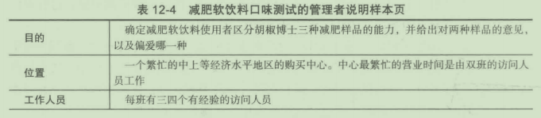
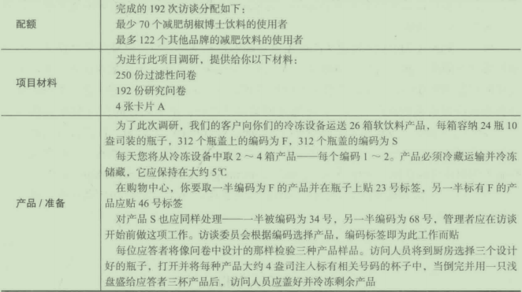

### 12. 3. 11实地调研公司

像QFact、On- LineCommunications等实地调研公司(fieldmanagementcompanies)通常提供文件格式、过滤性问题的撰写、开发指导和辅导材料、运输、实地预算，以及所有数据收其的协调、编码和项目需要的监督服务。研究完成后，它们提供合并的单一收据。一般来说，这些公司依靠员工提供顾客所需服务，而不试图与具有设计和分析能力的提供全而服务的公司和调研委员会成员相竞争。

很多提供全而服务的公司和专业定性分析人员也巳发现，实地调研公司会更节省成本，它可以使公司用更少的内部资源来接受更多的项目，有效地提高生产力。一些从事定性研究的研究人员巳与实地调研人员建立了待续的业务关系。作为咨询公司的外部成员，实地调研公司可以承接项目，帮助研究人员指导焦点小组访谈、撰写报告和与客户协商。

当然，像调研产业的其他部门一样，实地调研公司也有其自身的局限。顾名思义，实地调研公司一般不具备设计和分析能力，这就意味若它们的客户可能偶尔会需要寻求其他的调研公司来满足其全面服务的要求。此外，作为一个相对较新的产业部门，经验、服务和标准在各公司间有很大差异，明智的做法是认真筛选待选公司，查找参考资料。尽管有其局限性，但实地调研公司还是提供了一个让研究人员提高其生产力，而且同时能够以低成本维持公司决策和判断所需信息质惯的机会。

## 12. 4互联网在问卷发展中的影响

与大多数市场调研的其他方面一样，互联网以不同方式对间卷的发展与使用产生了重大影响。例如，某调研公司可以撰写一份问卷，然后以电子邮件的形式发给管理层来寻求评价和支持，一旦通过，这份问卷就可以作为网上调研形式放在客户的服务器上使用。或者，调研入员可以简单地利用像Perseus、lnquisite、WebSurvey、SSIWeb或具他的网络企业来实施网上调研。

例如，SurveyMonkey是领头的网络自助间卷撰写网站，它可以使市场调研人员迅速地开展网上调研，使用远程访问随时随地关注实时结果。优势在于市场调研人员不需要安装任何间卷撰写软件，也不需要任何程序和管理，包括调研设计、回答邀请、数据收集与分析和调研报告在内的所有运作，都通过网站自动进行。附带回顾的广泛DIY调研平台可以在该网址http://www. survey- reviews. net/index. pbp/review/上看到。最近，谷歌推出了谷歌顾客调研，谷歌用这个服务可以提供一套完整的调研工具、得到回答并总结结果。这些服务的描述可以在网站http://www. google. com/insigbt/consumersurveys/how找到。

网上调研工具不断变得复杂，使得DIY调查更具可行性。关千DIY调研更具体的讨论见“市场调研实践12- 6"。

市场调研实践12- 6

DIY调研人门指导

DIY调研的理念巳经不新鲜了。多年来，调研人员使用多种工具开展面对顾客的调研，给公司提供顾客洞察以帮助他们改善客户关系。快进到2012年，社交媒体和类似的技木以指数速度增长创造了更多基于客户的调研机会，给予公司更多可利用的工具和信息。

新的挑战伴随着新的机会一起出现，调研人员通常只是不具备需要获取客户调研价值的知识和工具。

别问自己你是否应开展基于客户的调研（你当然应该这么做），反而要问问你如何使公司尽可能做到最好的DIY调研，这包括当专家讲解利弊时了解DIY方法的危险性。

DIY调研的好处

DIY调研常常被看作成熟的市场调研项目的一个短期可行的替代，尤其是当预算有限时。

(1)便利性。对于许多公司来说，DIY调研首先的好处是便利性。如果你只是从几个明确的话题中简单查找反馈而不需要过多分析，你可以使用在线调研工具SurveyMonkey。

(2)洞察力。如果你负责管理调研的方法和分析，你又是一个新手，要深度了解客户需求以及如何最好地满足他们。这个优点也有一个要注意的不足，你的客户可能不愿意向他们每天面对的公司敞开心靡。

(3)成本。节省成本常被吹捧为DIY调研方法的另一个优点但这取决于调研的深度和问题的数量。随着调研时间的增加不会造成额外成本。更多问题和顾客特点打开了一个缺口，而你还没有注意到超出了预算。如果你是一家小公司或者并不需要十分严谨的数据，你可以用DIY调研。

DIY调研方法的危险性

认真起草的DIY调研计划书能够传达重要的洞察。然而，DIV方法有些潜在的缺点，这些挑战威胁了数据质量和最终目标。

(1)浪费数据。DIY调研会有调研问题和组织目的没有联系上的风险。理想地，调研的每个方面都应传达数据以做出具体的商务决策和实现清楚准确的组织目标。许多DIY调研都带有组织想提问和被回答的随机问题，尽管这些问题可能和生意目的没关系。

(2)有缺陷的结果。DIY调研在整个数据分析和决策制定的过程中可能产生一些基础错误。如果你的调研没能成功传达必要的洞察，或者更糟的是传达了不准确的结果，那会使重要的决定建立在错误的信息基础上。当创建DIY调研时，人们经常忘记坚持到最后。客户经理采取DIY方法应当注意在调研回复中对其客户个人联系的影响。与客户经理有长久关系的客户很可能使他犹豫着披霞客户公司的消极因素。考虑选择一个独立的第三方，或者其他组织内部的个体，来确保有意义的回答。

(3)设计拙劣的问题。当涉及调研技术，问题的措辞是DIY调研的另一个笨拙的地方，甚至可能看起来意思很明显的具体问题，调研参与者还是要费劲去回答那些模糊的、不清楚的、不准确的问题。将问题种类与你试图揭露的、调研本质的信息相连是十分重要的［比如开放式量表与李克特量（表强烈同意或强烈不同意）］。问题的措辞和句子结构的缺点，将不可避免地变成客户糊涂的回答。

(4)疏远客户。DIY调研的一个最严重的缺点，可能是你的调研工具或方法会疏远客户。如果调研高度重复，没能成功考虑调研参与者的时间，或者加强了消极的刻板印象，DIY调研能对客户关系造成严重的破坏，最终触牲的将是你的底线。尽管你可能把调研看作是技高一筹的，但你的客户可能不这么想r

运用专业技能

调研人员需要了解DJY调研不是灵丹妙药。尽管科技的发展能对客户进行有用的润察，仍然有许多事态需要职业调研的专业知识和技能。事实上，知晓什么时候运用专业技能在整个调研过程中起着决定作用。

问问你自己：这个调研我想完成的是什么？我需要收集的是什么数据？为什么？这些问题在当你开始调研过程时就应该问自己。如果你真的想获得其他问题的洞察并定义未知的问题，就要利用专业的调研方法，它们有经过检验而可靠的问题的数据库能提供回答以及你需要的数据。

同样地，如果你想挖掘得更深并且不确定客户是否会如实回答你的调研问题，请第三方来消减客户的不适感。反过来，你可能发现结果变得更真实了。

随着利益的增加，DJY调研的局限性变得更明显。当公司想寻求长期问题的解决方案或需要具体的可行的洞察时，专业调研方法就变得很重要。除了提供连续的调研过程管理，专业技能还提供数据分析的专业知识，以及其他客户调研的重要方面。

DIY调研的最佳实践

如果你选择采取DIY方法，你将被认为对调研方法的整体性负责，包括儿个DIY调研过程中的实践。

(1)调研目的。成功调研的第一步是考虑你如何应用调查结果。准备好应对任何调研中出现的问题或弱点，因为客户将期望你基于结果做出正确改善。

(2)战略性细分。DlY调研中最危险的错误是尝试在一个调研中完成大多目标。在一个调研中涵盖你所有的基础客户或涉及每个可能调研角度是没必要的；相反地，将调研细分成几个可管理的方面使团队更容易将调研结果变成行动。

(3)参与度。参与度可以带来或打破DLY调研的成功。如果可能的话，私下向客户介绍调研而不要用邮件轰炸另一个大幅增加参与度的策略是通过电话或面对面会议开展调研，认识到更高参与度的调研的价格将增加额外的时间投入。如果你通过电子邮件发送一个调研，包括状态栏，能看到一个结束进程将能增加参与度。

(4)问题的种类。大多数DJY调研应该包括李克特量表和开放式量表问题的结合八当李克特量表问题显露了参与者对具体问题的态度或感觉，开放式问题提供了定性的数据，那对你来说是无价的。可能的话，避免使用“中立“这一回答选项，让你的客户选择一边。另外，在底部提供一个评论区，这样他们可以在调研过程中表达他们没能表达的任何想法。

(5)分析和平均估价。牢记在心，DIY调研的目的始终应该是具备可行性的洞察，最有效的调研技术常常是一对一调研“以平均值传达结果的调研有有限的价值，因为它或许没有传达具有可行性的结果。例如，一个调查显示你1/3的客户发现你的排序过程冗长复杂，不是像显示的你最大客户竭力去适应的新网站排序解决方案那么有用。一个好的规则是，尽管平均估值很有用，但传递小范围的调研结果以及一对一的结果，可以使调研过程达到目标行动更容易

组合服务最佳

最后，大多数调研人员发现他们的工作能依靠由DJY调研和专业调研相结合的方式来很好地完成，DIY调研的最快反馈可以导入／导出由专业的客户管理提供的对长期问题的深刻洞察和解决方案。

问题：

I. DIY调研的优点有哪些？哪个对你来说最好？为什么？

2. DIY调研的主要缺点是什么？哪个对调研质量构成最大的威胁？

3. 什么时候要采取专业技术？为什么？

## 12. 5适应移动设备问卷

当我们为网站管理开展调查时，门标回答者受他们使用的设备所限制。他们可以使用任何可获得网络的设各来完成调研。我们明显注意到，最近的评估显示25%~30%的网上调查是用智能手机和平板电脑完成的。回答者不仅受调研设备的限制，他们还受填问卷的时间地点的限制或他们是否完成了问卷，他们可能在火车上、候机厅或其他地点，或者只是盯着一个公园长椅。

许多调研利用台式机、笔记本电脑、平板电脑和智能手机，可能使用哪一个，这取决千哪一天和什么时候。为了尽可能鼓励更多人完成调查，我们必须使调查变得容易完成，这与平台的硬件无关6移动设各尤其是智能手机，会受屏幕大小的限制，因此当开展网上调查时，我们必须牢记这些局限性。

我们的服务人员完全可能探测回答者使用的运作系统一Mac、Windows、lOS、Android等，并根据该运行系统开展不同版本的最佳化调研。通常来说，我们乐于鉴别台式机或笔记本电脑与平板电脑或智能手机。尽管平板电脑通常比智能手机的屏幕尺寸大，在间卷设计时它们可以被同等对待。

为了减少移动设备开展网上调查时滚动屏幕和缩小屏幕的需要，这里提供了一些适用的规则，包括：

- 给单个问题显示网格。
- 评分上限控制在最多5~7分。
- 减少问题的用词量。
- 使答案最多不超过10~12个。
- 争取调查时间为10分钟。
- 重新设计编程的问题，寻求在两个不同种类之间的更为有创意的方式。
设计移动设备友好型问卷的几条建议见下面的“市场调研实践12- 7"。

设计移动设备友好型问卷的10个最佳建议

(1)记住实际情形。移动手机屏幕的大小只占个人电脑屏幕大小的一部分，平板电脑尽管大一些，也只是个人电脑屏幕的一半或更小。

(2)竖屏和横屏的界面。回答者将可以选择他们喜欢的界面，所以问卷必须为两种情况设计：

a. 为使所有选项都在横屏上呈现，选项清单要足够短。

b为使所有选项都在竖屏上呈现，宽度应该足够狭窄

C. 为安全起见，在问卷文本内容中提到评分量表（例如，下题使用5分制），以防答题者只看到一部分问题。同样地，考虑使用左侧顶端的量表，因为在3结尾是不合理的，但如果你从1开始，他们或许不会意识到量表会达到10,因为如果不滑动屏幕的话答题者只能看到7或8。

(3)减少问题的单词量。人们在移动设备上的沟通不会使用太多单词。我们可能需要用更短的问题代替更长的问题，并使问题意思和定义保持不变。

(4)重新设计Flash动画元素。移动设备不支持Flash动画。

(5)从移动设备设计开始并估量大小。在移动设备上表现很好的问卷设计同样能在个人电脑上表现很好。所以，与其一味盯着台式机上的问卷设计，不如从缩小移动设备问卷大小开始。

(6)首先设计功能要素。例如，人们要点触的“下一个＂、音频按钮或复选框这样的任何功能设置都要尽可能大并尽可能快速。在传统意义上，问卷设计关注文本内容然后才是功能要素。在移动设备领域，我们要把关注重点倒过来

(7)测试多种设备。彻底测试竖屏和横屏的界面。

(8)避免滚动设计。不要让人们滚动或缩放屏幕，减少选项数量。在移动设备上滚动屏幕速度很快（所以许多用户可能只看到开头和结尾而遗漏中间的内容）移动设备问卷设计使网格问题的设计重新得到考虑。

(9)文本框尽可能大。调研显示文本框越大，在开放回答时能回答更多。

(10)抵制诱惑，使用手机的全部功能。从设计的角度来看，像旋转的“车轮”功能在移动日历中是有吸引力的，但是可能会由于不相容或未预料的结果使用户尴尬。

问题：

1. 为什么设计移动设备友好型问卷要同时做好竖屏和横屏的界面？
2. 为什么要在多种设备上测试你的移动设备友好型问卷？

作为调研平台的脸谱网

在2010年年未，脸谱网开发了FacebookQuestions。它允许用户围绕他们选择的主题开展调查和提问，征求他们朋友或所有脸谱网用户的信息和想法。打印出来后调查会经过beta测试并将在测试反馈后进一步完善。

FacebookQuestions是否能提供一个非正式的调研形式，还是只是像“这是什么歌”“这个腰带搭配什么鞋子更好看”这种娱乐消遣的间题，还有待观察。但是，公司和品牌将有能力测址顾客对新产品感受如何或潜在开发，并且为用户和品牌“粉丝”建立一个论坛能了解到用户自己的感受。

FacebookQuestions能显示用户的头像并显示用户好友的新需求，所以回答是预先的、个人的，尤其关系到发帖者。如果用户想定义什么东西，同样可以添加照片，比如他们家花园里的某种花。

FacebookQuestions的社会方面体现在问题说明的形式以及有用I无用选框。无论何时回答了民意调查或间卷、用户可以发送给自己好友，如果用户看见了一个好友可能回答的问题，他可以向好友推荐那个问题。FacebookQuestions有和Digg、亚马逊、YahooAnswers相似的特点。用户可以标记看到或回答了间题的位置（匿名地），不论他们觉得回答者的答案有没有用，最有用的答案将被放在最上面。用户也可以追踪问题，这样如果有另一个回答者回答了问题就可以收到通知。

## 12. 6成本、获利性与问卷

如果不提到间卷对成本和利润的影响，对间卷的讨论将是不完全的，有代表性的是市场调研人员与其他调研人员为客户的项目投标。如果过高估算了费用成本，调查提供者通常会输给一个低成本的竞争者。在所有的询问调研中，问卷和拒答率（参见第6章）是估计一个项目成本的核心决定因素。美国最大的一家调查公司检查了其中心场所电话访谈项目的成本与投标报价。该公司发现，在最近一年半内，它将这一时期的项目成本高估了44%。由千出价过高而造成了上百万美元的销售机会的损失。

为了避免过高出价，管理者必须更好地了解间卷的成本费用。MARC是一家大型国际市场调研公司，发现在一个50%发生率(50%的人适合被访间），平均调查时间为15分钟的中心地区电话调研(central- locationstudy)中，只有30%的数据收集费用是询间的费用，而70%的数据收集费用是获得合格应答者的费用。

表12- 5描述了一个访问人员在完成一次完整访谈时可能遇到的许多困难，其中每项困难都增加了成本。例如，MARC巳发现，只给问卷简单加上一个保护性过滤问题就会增加7%的成本。

表12- 5在中心地区电话访谈中寻找合格受访者的困难

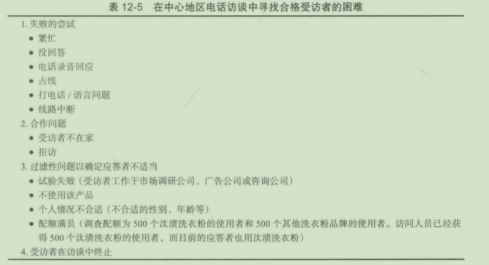

询间调研中另一类主要费用发生在受访者终止访谈时。人们终止访谈的主要原因有四类：受访者因素、多余的或难以理解的间题、问卷长度，以及在一次访谈中改变题目。人们喜欢谈论某些题目而不喜欢其他的。口香糖访谈没间题，但漱口水就会导致许多访谈终止。图12-3显示一次20分钟的有关口香糖的访谈极少导致访谈的终止（实际数据）。然而，许多人会在3分钟内或19~22分钟内终止一次漱口水的访谈。除非访谈时间达到20分钟，终止休闲旅游访谈不是一个严重的问题。当然，终止意味着必须重新做访谈，而且所有花在访间该受访者身上的时间都白费了。然而，探索性调研巳发现，重新访问中途拒访者有时会完成一次完整的访谈。（对最初就拒访者重新进行相同的调研，效果就不太好。）

一旦管理者了解了其收集数据的实际成本，他们应使成本估算的准确度达到更高水平而在竞标调研时处千更有利的形势。这样做可以尽量避免过高出价从而更多地赢得合同。

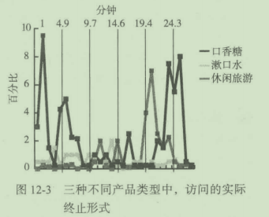

## 本章小结

问卷在数据收集的过程中起到了至关重要的作用。一份优秀问卷的标准被分为以下主题：1提供必要的决策信息；2问卷适合于应答者；3满足编辑、和数据处理的要求。问卷设计由一系列的步骤组成：

步骤l:确定调研目标、来源和限制因素；

步骤2:确定数据收集方法；

步骤3:确定问题回答形式；

步骤4:确定问题的用词；

步骤5:确定问卷流程和编排；

步骤6:问卷的评估；

步骤7:获得相关方面的认同；

步骤8:预先测试和修订；

步骤9:问卷的最后印刷；

步骤10:实施调研

此外，还特别分析了三种不同类型的问题（开放式、封闭式和量表应答式）以及每种问题的优缺点。在介绍问卷用词和编排问题时，调研人员一定要保证用词清晰，不要误导应答者，而且应答者能够并且乐意回答问卷中问题。

接下来讨论了在实施问卷调查的过程中需要遵循的必要步骤，这些程序用于保证在合理的成本下正确、有效的收集证据。这些程序包括管理者说明、访问人员说明、过滤性问题、通话记录单和可视性辅助材料等。我们还注意到，许多研究组织正求助于各类实地调研公司进行实际面谈。

现如今，问卷软件和互联网很大程度上影响着问卷设计过程。VoviciWeb在线调研、SSIWeb和其他软件使调研人员能够在网上创立在线调研。

本章还讨论了问卷在调研成本中的决定性作用。如果一个研究者高估了数据收集的费用，可能将项目输给另一研究提供者。大部分数据收集的费用并不是进行实际访谈的费用，而是寻找合格应答者的费用。调研题目的性质也会影响到应答者中止访谈的倾向。

复习思考题

1解释问卷在调研过程中的作用。

2应答者是如何影呴问卷设计的？举几个例子（比如分别针对工程师、棒球手、军队将军、移民农场主的问卷）。

3. 讨论开放式问题和封闭式问题的优点缺点。

4概括问卷形成的步骤。假设你正为麦当劳的一种新三明治做问卷，利用这一假定情况讨论问卷制作的过程。

5举几个措辞不佳的例子，这些问卷的不足之处在哪里？

6. 问卷设计好后，投入使用前还要考虑哪些其他因素？

7. 为什么预先测试问卷很重要？是否存在可省略预先测试的情况？

8设计三个开放式问题和三个封闭式问题来检验顾客对宝马车的态度。

9. 以下问题有何不足：

a您认为这种高质量的麦氏咖啡的口味如何？

b. 您认为这种SaraLee咖啡蛋糕的口味和原料的构成如何？

C. 我们正在进行一种Bulova表的研究，您认为Bulova表的质量如何？

10. 您认为利用实地调研公司的主要优点是什么，缺点是什么？

11. 计论基于网络的调查问卷的优缺点。

12. 将一个班的同学分为四五组，然后将每组平均配成供应商组与客户组。随后教师将供应商组与客户组配对。每个客户组挑选一个与大学生活有关的话题，如学生住宿问题、学生交通问题、运动项目、女生联谊会、男生联谊会、校园餐饮或学生生活的其他方面接着，客户组需要为他们选择的话题制定四个管理目标，构思一份符合管理目标的调查问卷。此外，问卷需要包括以下人口统计数据：性别、专业和其他老师要求的信息9客户组批准问卷后，每个客户组和供应商组都要完成10次访谈。访谈结果向全班同学公布。注意：这些数据可编排为SPSS供以后详细分析。

## 调研实例12- 1

了解消费者行为

下面是一份真实的调查问卷（进行了很小幅度的修改），它是一份学生设计的调查问卷（学生不是来自商学院），用以了解中西部城市的购物行为。它违反了许多问卷设计的基本原则，看你能发现多少。

调查问卷

````
1. 您多大年龄？＿＿

2. 您配偶多大年龄？
3您们结婚多久了？
4您或您的配偶所取得的最高学历是？
a没受过正式教育
b小学
c中学
d大学
e两年制专科
f四年制本科
g研究生
5. 您父母的最高学历是？
a没受过正式教育
b小学
c中学
d大学
e两年制专科
f四年制本科
g研究生


286当代市场调研
6您是否受雇于营利性组织？
a是
b否

7. (如果回答是“是＂，请回答第8题；如果答案是＂否“跳到第9题）您每月的收
入为美元？
8. 您配偶是否受雇于营利性组织？
a是
b否
9. (如果回答是“是＂，请回答第10题；如果答案是＂否“跳到第11题）您配偶每月
的收入是美元？
10. 您与丈夫有小孩吗？
a有
b没有
1I. (如果回答是“有＂，请回答第12题；如果答案是“没有“跳到第14题）您有几
个小孩（填入准确数字）。
12. 您的小孩多大了？
13. 他们上学了吗？在哪里上学？
14您和丈夫，谁是家中日常事务的决策者，比如在哪里居住，去哪里度假，买什么家
具等？
a我是
b我丈夫是
c都不是或者都是
15. 有其他成年家庭成员与你们一起居住吗？
a有
b没有
c有时有。他们是
16. 您在哪里购物？
17. 为什么在那里而不在其他地方？
18. 您怎样评价它们的商品？
a非常好
b比较好
c不是特别好
d很差
19. 您是通过什么途径了解这家商店的？
a电视上
b互联网上
c通过朋友

d广告
e报纸
f我只是碰巧经过
20. 我想我的朋友一定会满意在这里购物的。
a非常同意
b比较同意
c同意
d不怎么同意
e十分不同意
21您最喜欢什么？
22. 有哪些有待提高的地方？

问题：
1. 评论每个问题，讨论它们如何改进。
2提出几个用以了解中西部城市有关商品和服务消费行为的问题。
3修改过的问卷应当如何重新排序？
````

移动的Sonic

声音驱动程序最近复查了一系列调研的信息，包括儿种产品评价。所有调研都由顾客在他们的专有面板在线完成。除了实际调研数据和其他信息，线上访问系统捕获回答者使用的浏览器来完成调研。分析“使用的浏览器“数据，Sonic发现了在移动设备浏览器上完成调研的人数缓慢但稳定地增长，包括平板电脑和智能手机。最近的结果与一年前相比实现了飞跃的增长，平均将近30%的调研在移动设备的浏览器上完成。

几个管理者试图使用他们自己的平板电脑和智能手机完成其中一些调研。他们喜欢使用这类平台给顾客增加可选择的方式这一理念，这些设备允许顾客在他们曾经所不方便的时间和地点参与调研。然而，管理者在他们的移动设备上测试调研的体验表明，他们还需要改进为智能手机和平板电脑设计的问卷。

问题：

1. 用移动设备完成调研的障碍和困难是什么？

2. 利用新调研平台的优势，Sonic在问卷设计上还需要做出什么改进？

3在笔记本电脑上和在移动设备上完成的混合调研结果怎么样？如果有需要注意的地方，那是什么？

4. 包含移动设备和笔记本电脑以及台式电脑的调研能够改善样本质量吗？为什么？


