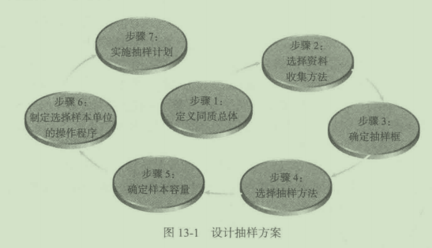
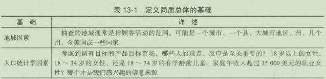
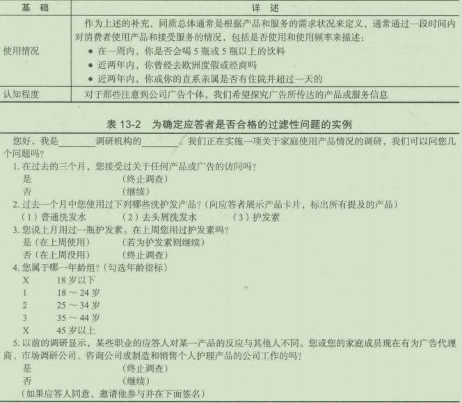
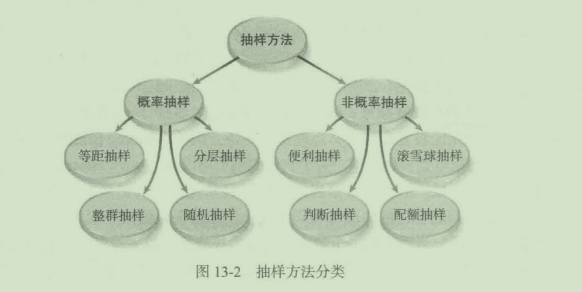
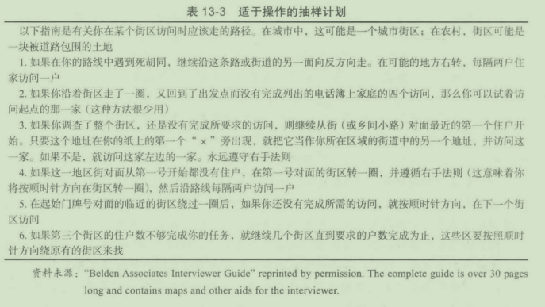
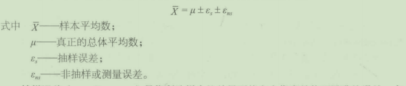
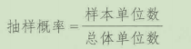
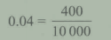
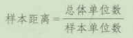

# 第13章基本抽样问题

## 学习目标

1. 掌握抽样的概念
2. 学习制订抽样计划的步骤
3. 明确抽样误差和非抽样误差的概念
4. 明确随机样本和非随机样本的区别
5. 了解互联网调研涉及的抽样问题

## 13. 1抽样的概念
抽样(sampling)是指从一个较大的群组（范围或总体）的一个子渠（样本）获得信息的过程。市场调研的使用者接下来使用从样本中得到的结论，对较大的总体的特征进行估计。进行抽样的动机是可以比其他可能的方式更快、更节省经费地进行这样的估计。我们常常会发现对总体的较小比例的抽样可以带来十分准确的估计结果。你可能熟悉的一个例子就是与总统选举有关的民意测验。大多数主要的民意测验使用I000~l500人对几千万人的投票行为进行估计，他们的估计结果被证明出奇的准确。

根据相对较小的样本对较大总体的特征进行准确估计的要诀就在，选择了哪些个体作为样本进行这样的估计。以科学的方式选择这些样本，以确保样本的代表性（可以作为总体的缩影）是至关蜇要的。所有构成总体的主要类型在样本中的比例应与它们在较大总体中的比例相同，这也是我们在利用网络和社交媒体获取数据时应该秉持的。而样本容量不能代替选择方法，不能保证样本的代表性。这听起来很简单，作为－介个概念来讲也很简单，然而对人口总体进行抽样时想达到这个目的就不那么容易了。

### 13. 1. 1总体
讨论抽样时，“总体"(population)和“范围"(universe)这两个概念是11「以互换的＾在本书里，我们会使用“总体”。总体或相关总体、被专注总体，是指调研人员需要从巾获取相关信息的全部人群。抽样步骤的首要步骤之一就是定义被关注总体，通常包括定义产品或服务的目标市场。

我们可以设想一个为康泰克这样缓解感咒症状的作处方药物进行的产品概念实验，你可以认为同阮总体包括了所有人，因为所有人都时不时会感冒。尽管这是正确的，但是并不是每个入都会去买缓解感百症状的非处方药物。在这个例子里，第一项任务就是确认在一段时间里，人们是否购买或使用了一种或者包括竞争品牌的多种药物，只有购买或使用了一种这些品牌的药物的人才会被包含在同质总体之中。此处的思维逻辑为除非新产品创新性II瑞强．能够吸引新的消费者，否则产品的销售还要依赖老顾客。

抽样过程的关键步骤之一就是定义同质总体。定义同质总体不需要遵守特定的准则，调研人员所需要做的就是运用逻辑和判断来回答一个基本间题：为了达到调研的目的需要怎样的材料和观点？通常，定义总体是根据现有顾客群或目标顾客群的特点来进行的。

### 13. 1. 2抽样和普查

在普查(census)中，数据是从同质总体的每个个体处收集到的，或者是关于所有这些个体的市场调研行业一般不会进行忤查，因为营销人员面对的同质总体通常包括数百姓至数百Jj个体。从这样大规模的总体中获得数据花费的时间和金钱十分巨大，以至于普查几乎从来不在考虑范围内。我们经常听到别人说．一个较小但是稍心选取的样本可以很好地反映选取样本的总体的特点。样本(sample)是总体的一个子集。获得样本的相关信息，然后用来对总体的特点进行推测C理想的情况是，子集能够代表总体的各个部分。

一般人都会认为，普查比抽样能提供更准确的结果，其实这不一定是正确的。人「I普查中．简单地从总体的各个成员处获得信息会遇到很多阳碍。调研人员不一定可以获得总体的所们成员完整准确的名单，或者是总体的部分成员会拒绝提供信息。因为这些陷碍，理炬的普查很少可以实现，即使只是对很小的总体。你也许听说过同这些问题相关的2000年和2010年的美国人口普查。

以驾照和选举登记悔为抽样框

北卡来罗纳大学教堂山分校的医学研究者想为他们的实验提供最具代表性的抽样框，该实验以人口为基础．研究艾滋病毒在北卡来罗纳州八个县的黑人异性恋间传播的情况。他们发现，18~59岁男性与女性的驾照登记簿覆盖面最佳，能提供该总体最完整的抽样框，实现高效率的抽样，其次是选举登记簿，远超所有人口普查表和其他至少四种可用的人口列表

例如，电话黄页的不足之处在于它不包括未公布的号码，这就将这些未公布号码的人排除在研究之外医疗保险名单上只有老年人、残疾人或确诊患病者。机动车登记簿只含“有车一族”，研究人员也无法通过随机数字拨号辨别受访者是否符合要求。人口普查表也不够准确，研究人员发现驾照登记簿往往多于以人口普查为基础得出的总体。另外，驾照登记簿又优于选举登记簿，鉴于男性登记选举的人数会低于女性，驾照登记簿能更好地锁定目标人群

1992年，其他医学研究者在研究成年黑人的膀胱癌和乳癌时，也用了驾照登记簿抽样但是在1994年，一项国会法案限制了驾照登记簿统计分析用途，但没有限制直接联系驾照持有者。对市场调研人员来说不幸的是，随后的国会复议、司法复议以及某几个州的立法会议使此抽样框方法非常不稳定。

问题：

1. 驾照登记簿的统计分析会产生什么有用的数据？你会如何进行此项研究？

2. 请指出另两项驾照登记簿能够为之提供准确信息的市场研究种类。

## 13. 2设计抽样方案

设计一个可运作的抽样计划可以总结为图13- 1中的7个步骤，它们是定义同质总体、选择资料收集方法、确定抽样框、选择抽样方法、确定样本容讯、制定选择样本单位的操作程序和实施抽样计划。

### 13. 2. 1步骤一：定义同质总体

为了满足研究的需要，必须详细说明可提供信息或与所需信息有关的个体或实体（如顾客、公司、商店等）所具有的特性。同质总体可以从以下几方面进行描述：地域特征、人口统计学特征、使用情况、认知程度等（见表13- 1)。在调查中，从调查表开始部分的过滤性间题，可以看出某个个体是否质千同质总体。即使有总体和样本消单，仍有必要使用过滤性问题识别合格的应答者。表13- 2给出了一系列简单的过滤性问题。

另外，为了确定总体包括哪些人，通常情况下，重要的是确定那些应排除在外的人的特征。例如，大部分商业市场调查就因为一些所谓的安全性间题而排除某些个体。通常，间卷调查表上的第一个问题就是询间采访对象或其家庭成员是否从事市场调查、广告或者生产与调查内容有关的产品的工作（如表13- 2中第五个问题）。如果采访对象指出他们从事其中的某项工作，那么就不必要去采访他了。这就是所谓的安全性问题，因为这样的采访对象不保险。他们也许是竞争对手或者为竞争对手服务的。所以，我们不能给予他们关于我们打算干什么的暗示。

此外，排除某些个体还有其他原因。例如，胡椒博士公司就宁愿采访一些在一周内喝5瓶或5瓶以上各种包装饮料的人，而不愿采访一些只喝胡椒博士的人。因为公司要加深对这些不喝胡椒博士而喝软饮料的人的了解，因此就会排除那些过去一周内经常喝胡椒博士的人。

### 13. 2. 2步骤二：选择资料收集方法

资料收集方法的选择对抽样过程有很重要的影响。信件调查由千低回复率的原因可能会得到具有偏见的结果（本章后面将详细介绍）。电话调查没有那么大的低回复率的问题，但是受到潜在受访者的电话屏蔽手段的使用的影响，以及许多只有手机的人的影响，据最保守估计，目前只有电话的家庭约占38. 2%。互联网调查会受到专业受访者的影响（第7音谈到过），同时样本组或电子邮件名单提供的受访者有时不能正确地代表同质样本组C在使用脸谱网、推特以及其他社交媒体平台作为样本来源时，存在同样的问题。

大数据之“大“常使人们忽视数据的代表性。某些情况下，数据由千来椋有限而不能代表总体。“大”不能保证其代表性。研究者越来越倾向于巾不同的收染方式棍合而获得的样本，比如信件—电话－互联网、互联网－短信、互联网－社交媒体等。旧的方法已经很难得到回应，我们需要使反馈简便有趣，同时要保证样本具有代表性和结果准确这个间题会在下面的“市场调研实践13- 2"里深入讨论。

将社交媒体融人网上固定样本组

社交媒体可为市场调研提供大量的调查对象，这些调查对象所代表的人群往往与网上固定样本组的人群不一样。社交媒体调查对象的“不一样”和众多数量意味着我们需要找到方法，将其纳入我们的网络调研中。

但是，“不一样“既是资源也是问题。．数年来。既有的网上固定样本组巳提供众多有价值的数据，新成员的突然加入可能会导致数据不一致，而数据不一致是我们力图避免的。如何添加新调查对象，本书推荐了一个保守慎重的方法。我们需要根据人口统计学单元里存在的固有差异，决定能加入网上固定样本小组的最高比例。

向既有的固定样本小组添加网络新成员时，以审慎保守为佳。这样我们能将最不尽如人意的样本情况也考虑进去，包括样本容量、收入，以及其他由统计学计算得出、抽样中允许的差异量。

网上样本的管理正从完成配额转向关注整体样本架构。“关注样本整体架构”这一方法对样本提供者的一个首要理念一要确保样本中的数据变化真实，而不是由样本源的变化导致，值得使用样本的研究者信赖一非常忠实敏感。样本提供者有责任透明化样本架构，因为只有公开透明，研究者才能知道如何理解这些数据，最终的使用者才能厘清其可信度口

### 13. 2. 3步骤三：确定抽样框

在整个过程中的第三步就是确定抽样框。以往，我们把抽样框(samplingframe)定义为总体的数据目录或单位的名单，从中可以抽出样本单位。理想的情况是，我们有一个完整和准确的名单。遗憾的是，通常这样的名单是不存在的。例如，一项研究的总体可以定义为在过去的一个星期里花两个或两个小时以上时间上网的人，但是根本就没有一种计罚方法可以完全提供这份名单。在这个例子里，抽样框详细说明了一个可以产生具有希望特征的代表性样本组的过程。因此，很少能够见到抽样框和同质总体具有很好的匹配性。

例如，电话号码湔可以作为某一个电话调查抽样的抽样框，这个调查中的同质总体就是某一个城市中的所有家庭。然而，电话沥不包含没有电话和未公布电话的家庭。一些因素表明，公布电话的居民和未公开电话的居民在一些重要方面的特征可能有很大的区别。很明显，那些不主动提供电话号码的居民有可能是房客，居住在城市中心，最近刚搬家，或者是人口多、孩子小、收入低。在某些产品的购买，拥有和使用等方面，这两类人有很显著的区别。样本框问题将在“市场调研实践专题13- 3"中提到。

在西部大城市作白人和18~34岁的人中，不公布自己电话号码的人是比较多的，这项发现已经被一系列的调查所证实。这个发现的意义很明显，即当样本单位是从电话调查中获得时，还应该包括那些不公布电话号码但是却适合被采访的城市居民。

一种可能就是随机数字拨号(random- digitdialing),它可以随机地产生一系列电话号码，这种程序可能是比较复杂的。幸运的是，一些公司（如SurveySampling)可以以比较低廉的价格提供随机电话号码样本。关于它们的细节可以访间[http://www. ssisamples. com/random/digit. html](http://www. ssisamples. com/random/digit. html)。在抽样领域，形成一个恰当的抽样框经常是调研人员面监的最有挑战性的问题之一。抽样框的问题在之前的市场调研实践板块和接下来的两个案例板块都有所体现。

前面也提到，研究者面临的一个越来越突出的挑战是，越来越多的家庭不再使用座机而只用手机了。目前，只使用手机的家庭几乎达到了40%。幸运的是，我们可以向提供商，如SSI,购买移动电话样本。

基千地址抽样如何实现样本基本全覆盖

比较而言，基于地址的抽样方法(address- basedsampling,ABS)比单纯的电话抽样好。在美国，座机只能联系到75%的家庭，使用手机又过于复杂。市场调研公司SSI发现ABS儿乎能捕捉到所有电话抽样的＂漏网之鱼”。

SSI将电话号码数据库与邮箱地址列表相结合一一－通信地址若有匹配的电话号码，则拨打电话号码，若没有则寄送邮件。SSI利用美国邮政服务邮递编码档案(U. S. PostalService'sDeliverySequenceFile)和其他个体家庭信息较完整的商业数据库，成功覆盖了95%的通邮家庭，其中85%的地址配备姓名，55%~65%地址匹配电话号码，在制作样本时，也可获得人口统计学数据。

手机潮使得电话调查颇为困难。20%的美国家庭没有座机，20多岁的美国年轻人尤其不爱使用座机。ABS不仅能囊括主要或者只使用手机的家庭，比起只用电话进行的调查，还能提供更多地理人口统计学信息和更多的选择。

但是ABS也暗含挑战一一般而言，邮政服务花费更高，不同的设计会导致不同的回复率，但这也有相应的解决方式。修改筛选标准，使得邮件投递效率最大化。也可通过核查附加的电话号码来提高准确性和回复率。总之，ABS能提高回复率，使研究者获得相对更完整的样本，也能让受访者对反馈渠道有选择空间。

问题：

1. 你能想到通过ABS也很难收集调查的人口统计细分市场吗？

2. 研究者有哪些方式可以减少邮件调查的费用？

### 13. 2. 4步骤四：选择抽样方法

制订抽样计划的第四步是选择抽样方法。选择哪种抽样方法取决千研究目的、经济实力、时间限制、调查间题的性质。可供选择的重要抽样方法可以分为两大类：概率抽样和非概率抽样（见图13- 2)。

1. 概率抽样

概率抽样(probabilitysamples)指在总体中的每个单位都具有同等可能被选中的机会。简单随机抽样是一种众所周知并被广为使用的概率抽样。在概率抽样法中，调研人员必须严格迷守正确的选择程序，即要求避免不合理的或有偏见地选择抽样单位C'½严格遴守这些程序时，概率论中的法则都是有效的。这就是说，对千预测的范围来说，样本中的数据可以认为是被允许与总体的实际值有所差异，这个差异被称作抽样误差网上抽样小组能否提供概率抽样的样本，有很多争论。我们将在接下来的“市场调研实践13- 4"探讨相关问题。

2. 非概率抽样

非概率抽样(nonprobabilitysamples)是指从总体中非随机地选择特定的要素。根据简便易行、减少开支的原则选择总体中的某些要素，可能就会导致非随机性。有目的的非随机调查可能系统地排除或过分强调总体的某些部分。例如，一项要调查所有18岁以上的女性意见的调查若在周一至周五的白天通过电话进行，就显然会系统地排除了所有职业女性。

概率抽样较非概率抽样有以下几个优点

- 调研人员可获得被抽取总体的不同年龄、不同层次的人们的信息。

- 能估计出抽样误差。

- 调查结果可以用来推断总体。例如，在一项使用概率抽样法的调查中，如果有5%的被访者给出了某种特定的回答，那么调研人员就可以以此百分比再结合抽样误差，推及总体情况。

另一方面，概率抽样也有一些弊病，最蜇要的是，同样规模的概率抽样的费用要比非概率抽样高。通常精挑细选的做法不仅增加了调研费用，而且还要有专门的时间对样本进行复核修改。概率抽样比非概率抽样需要更多的时间策划和实施。必须遵守的抽样计划执行程序会大量增加收集资料的时间

单个网络受访群能提供真正具有代表性的样本吗

多个受访群有助于网上研究项目由于多种原因，获得真正具有代表性的样本并不简单数据来源单一的情况下，为获得代表性样本，即使研究者采用多种核实方式、人口统计配额及其他策略，筛选方式本身会造成质的差异，或者允许差异扩大凝聚一个网络社区或者受访群的决定要素（如话题、活动、互动机会等）本身也会造成这种情况每个社区网上的内容都是特殊的，游客和成员会根据自己体验偏好，选择性加入社区由于社区成员间经历趋同，差异减少，每个网址之间的差异随之固化（物以类聚，人以群分）。

因而，研究者不能认定任何网上受访群落可以作为精准的概率统计样本，用以调查美国成人或者网络公民总体。结果，内在的差别（性格特点、价值观、控制点等）、外在的差别（参与受访群的时间、参与研究的频率等）都会影呴对受访群落之反馈的衡昼诠释为控制样本中的内因分布，同时尽可能随机化外因，研究者需从多个受访群落里随机挑选

纽约Gtlc卓越研究中心(GtlcResearchCenterforExcellence)进行实验，观察不同受访群落间个人内外差异分布的不同。从五个不同的受访群落中以不同方式筛选出受访人，用回归分类法根据受访人上网驱动器的简介将他们秘密分为五类消费者。

研究者随后测试哪些内在特点会出现在多个类别中，结果是一个内在特点最多会出现
在三种消费者类别里。而且，各个受访群落里，每个消费者类别的集中度差异很大。

各个消费类别呈现出人口统计学分布的差异其中一类性别分布明显不均匀，有两类成员年龄集中，这两类中一类年轻人较多，另一类年龄大的较多

总之，Gtlc的研究显示了不同的受访群落存在诸多差异。随着该研究的深入，最新发现也促使调研人员不得不警惕起来，尤其是在选择、留用受访者的策略上和在确定受访群落的数量和敲定受访群落上。

问题：

1. 为得到一个真正具有代表性的样本，如果一个受访群落不够，你认为需要多少个受访群落供你挑选样本呢？为什么？

2. 生成样本时，你觉得该如何解释所涉及的外在特点？

### 13. 2. 5步骤五：确定样本容置

一旦选定抽样方法，下一步就是要确定合适的样本容量(samplesize)。关于这个问题将在第14章详细阐述。对非概率抽样，通常我们仅依靠可得预算、抽选规则、子集批分析来决定样本侃。然而，就概率抽样而言，需要在允许误差的目标水平（抽样结果和总体指标的差异）和置信水平（笆信区间的概率，置信区间是样本结果加减允许误差形成一个涵盖总体真值的范围）下计鍔样本社。如前所述，基于样本指标推测总体指标是概率抽样的主要优势。

### 13. 2. 6步骤六：制定选择样本单位的操作程序

无论使用概率还是非概率抽样，在一个项目的资料收集阶段必须指定和明确选择样本单位的操作程序对千成功的概率抽样来说，这个程序更为重要，必须详细沽晰，不受访问人员的干扰。若不能制定合适的选择样本单位的操作程序，则整个抽样程序会陷入困境。表13- 3提供f- 个适千操作的抽样计划。

### 13. 2. 7步骤七：实施抽样计划

在实施适于操作的抽样计划前，应先对其进行讨论研究。这一步很重要，应包括检查，确定是否要根据拟定好的详细程序来实施计划。

## 13. 3抽样误差和非抽样误差

请假想一种情景：我们的门标是估计智能手机用户群体每天使用智能手机的平均分钟数，如果可以获得总体中每个人的确切信息，我们就可以计算出总体参数每天平均使用智能手机的分钟数。总体参数(populationparameter)是定义总体真实特征的数伯。假处μ(总体参数，平均每天使用智能手机的分钟数）是65. 4。正如已经讨论的那样，要调杏总体中的每个人不总是可行的，但是研究人员会抽取样本，并根据样本的调查结果对总体参数进行推测。本例中，研究人员可能会从几百万的总体中抽出400份样本，根据样本数值得到总体平均每天使用智能手机的分钟数的估计值(e)。假设该样本的平均数值是64. 7分钟／天。第二份陌机样本从同一个整体中抽出，得出的平均值是66. 1分钟／天。可能会有更多样本被抽出来计算，可以算出所有样本数值的平均数，我们会发现，大多数情况下这个所有样本的平均数与真实的总体数值很接近，但并不完全一样。

样本结果的准确性受到两种误差的影响：一种是抽样误差，另一种是非抽样误差（测量误差）。下列公式描述了在估计总体平均数时对这两种误差的影响。

抽样误差(samplingerror)是指所选样本的结果不能完全代表总体而导致的误差。有 两类抽样误差：随机误差和管理性误差。管理性抽样误差涉及执行抽样的间题，即样本的 设计和执行中有缺陷而不是样本不能代表总体。这类误差能在样本设计和执行中通过小心 谨慎而避免或使之极小化。随机抽样误差是由于偶然事件引起的，是无法避免的。这类误 差只能依赖增加样本量使之缩小，但不能完全消除。非抽样误差(nonsamplingerror)或 测量误差(measurementerror)是在研究过程中由千计鍔的不准确和偏见等原因产生的不 同千抽样误差的各种误差。

从网上固定样本组抽样和收集数据

米歇尔·多德，AT&T公司战略客户的洞察与研究部门主管

第一次报价，第二次报价. . . . . . 敲定了，承包给报价最低的网上样本组团队！

寻求网上样本组团队进行合作就这么简单吗？才不是呢。选择和一个或多个样本组团队合作完成一个项目需要考虑多重因素。

首先，要拿到他们的标书。我们需要尽快拿到标书，标书到手就成为项目方案的一部分。方案的可行性和费用会影响你对数据收集方法的意见。有些网上样本组团队反应非常迅速，标书很快就能上交，有些得过两三天。我们必须向样本组提供的信息包括：调查对象的地理区域、预计调查时长，以及他们需达到的合格率c如果你要在很短的一段时间内（一周内）完成数据收集，那么这一点也得交代清楚

接下来，需要考虑你自己之前和这些样本组合作的经验他们的标书真实性如何？他们能一贯坚持甚至超过其预计的可行性吗？他们倾向于夸大其词，最后你得手忙脚乱另谋他法重新收集数据吗？他们的团队中是否有较多违规赶进度、重复回应或虚假回应的成员？项目经理及时回复你的问题并能随时告知进度吗？

现在我们有多个样本小组的标书，那该如何挑选呢？比较紧要的一个标准是，看其中有没有一个样本组能独立实现你所有的配额要求。能独立满足研究需要的一个样本小组要比多个小组更好，主要是为了实现配额和降低样本中重复回应的概率。如果你面对一个受限的地理区域和I或范围小，那为了达到配额要求，你很可能就要使用多个样本组。

如果够幸运，有多个样本组能够独立满足配额要求，那么就该考虑费用和客户服务了。如果你坚信每个小组能独立满足配额要求，那么你就会选择每场访谈花费(costperinterview,CPI)最少的小组。但是，我们也不能忽视客户服务这一点，大多数样本小组的项目经理都非常尽责，帮你在所需时间内测试、发起和完成研究。但是，如果项目进行中，你挥汗如雨还在担心能不能满足配额要求或者跟上进度，那么长远来看，低价格并不值得。

数据收集阶段结束后，你可能还需要附上从第三方获取的数据（比如Acxiom或KnowledgeBasedMarketing),以补充或促进分析，并非所有网上样本小组都会这样做，有些网上样本小组不提供组员的姓名和地址信息，其他的可能有信息但不会公布。如果这是你项目的一项要求，则很有必要在前期和你的样本组合作伙伴商量好，让他们提供参加项目的组员信息。

## 13. 4概率抽样方法

如前面提到的，随机抽样中总体中的每一个要素都有同样的可能性被选中。有四种概率抽样方法：简单随机抽样、等距抽样、分层抽样和整群抽样。

### 13. 4. 1简单随机抽样

简单随机抽样是最完全的概率抽样。在简单随机抽样下，抽样概率公式为

例如，如果总体单位数是10000,样本单位数是400,那么抽样概率为4%,计算过程为

如果一个抽样框是可以得到的，那么调查人员可以选择简单随机抽样(simplerandomsample)方式，步骤如下：

(1)对总体的每个单位进行编号，总体单位数为10000的总体编号为I~10000。

(2)在随机数表中（见附录C中表一）从任意的一个编号开始向上数或者向下数或者跳跃数选编号。在1~10000选出400个（样本单位数），从明确了具体的总体元素的表格中选出的数字将包括在样本中。

简单随机抽样的优越性在千，它看起来简单，并且足以满足概率抽样的一切必要的要求，保证每个总体单位在抽选时都有相等的被抽中机会。简单随机抽样以一个完整的总体清单为依据，在现实中编制这样一个完整的表是极其困难的，也是不可能做到的。简单随机抽样可以通过电话随机拨号功能完成这个步骤。样本也可以从顾客名单等计算机文件中获得，选择随机样本的软件程序也容易获得或编写，能够满足所有必要的要求。

### 13. 4. 2等距抽样

等距抽样(systematicsampling)经常作为简单随机抽样的代替物使用。由千其简单，所以应用相当普遍。等距抽样得到的样本几乎与简单随机抽样得到的样本相同。等距抽样是一种折中妥协的方式，并不严格满足随机抽样的规则，其产生不具代表性的样本的可能性虽小但也存在。

使用等距抽样，必须首先对总体进行编号，这一点与简单随机抽样一样。调研人员必须决定一个样本距离，并在此基础上选择样本，样本距离可通过下面公式确定

例如，假设你使用本地屯话箭并确定样本距离为100,那么从100个中抽取一个组成样本。这个公式保证栩盖f总体。

等距抽样起点的选取也应是随机的。例如，如果你正在使用一本电话沥，必须随意取出一个号码决定从该页开始翻阅，假设从第53页开始，在该页上再选另外一个数从该行开始。假设选择从第三行开始，最后在该行选一个数，这就决定了实际开始的位笆。假设从第17个数开始，那么以此为起点，样本距离就确定下来了。

等距抽样方式相对于简单随机抽样方式最主要的优势就是经济性。等距抽样方式比简单随机抽样更为简单，花的时间更少，并且花费也少。使用等距抽样方式最大的缺陷在千总体单位的排列上。一些总体单位数可能包含隐蔽的形态，调研人员可能疏忽，把它们抽选为样本。然而，这种缺陷在使用字母表时可以被消除。

### 13. 4. 3分层抽样

分层抽样(stratifiedsamples)是一种卓越的概率抽样。具体程序是：

(1)把总体各单位分成两个或两个以上的相互独立的完全的组（如男性和女性）。

(2)从两个或两个以上的组中简单随机抽样，样本相互独立。

总体各单位按主要标志加以分组。尽管一些作者指出，分层抽样的要求没有指明分组标志，但是根据常识的判断，分组的标志与我们关心的总体特征相关。例如，如果你正在进行一次政治民意调查，要预测选举结果。结果表明，男性和女性的投票方式大不相同，那么性别是划分层次的恰当标志。如果不以这种方式进行分层抽样，分层抽样就得不到什么效果，花再多时间、精力和物资也是白费。前面的例子中，将性别作为分层抽样的标志，我们得到男、女两组，各组都完全独立。在一组中（男性组或女性组）保证每个总体单位都有被选的机会，没有哪些单位是不能被抽中的。第二步就是进行简单随机抽样，在每个组中独立进行。

分层抽样与简单随机抽样相比，人们往往选择分层抽样，因为它有显著的潜在统计效果。也就是说，如果我们从相同的总体中抽选两个样本，一个是分层样本，一个是简单随机样本，那么相对来说，分层样本的误差更小些。另一方面，如果目标是获得一个确定的抽样误差水平，那么更小的分层抽样将达到这一目标。由于排除了一种变差的来源，所以分层抽样在统计上更为有效率。

如果分层抽样统计更好，为什么不一直使用这种方式呢？有两个原因。首先，将样本适当划分层次所需的信息通常是得不到的。例如，几乎没有人会找到某种特定产品的消费者的人口统计特征。注意，我们强调的是＂适当＇分层。要适当分层并得到分层的好处，必须选择使得各层次间存在明显差异的因素为分层基础。如果不能定义这样的因素，样本就不能被适当地分层。其次，即使必要的信息是可以得到的，但是从所得信息的价值看，分层所需时间和费用不划算。

对千简单随机抽样，调研人员完全依照概率法则抽取总体中有代表性的样本；对于分层抽样，调研人员按照各组总体单位数占全部总体单位数的一定比例来抽取样本，某种程度上更有代表性。例如，调研人员可能了解到，尽管男性和女性有同等可能成为某种特定产品的使用者，但是女性更有可能成为产品的蜇度使用者。在设计一个方案分析产品消费模式时，抽取的样本中如果女性没有被合理地代表性会导致得到片面的消费模式认识，假设女性占总体的60%,男性占总体的40%。即使每件事都做得完全正确，但是简单随机抽样的程序可能会抽到这样的样本，女性占55%,男性占总体的45%,这样的结果是由于样本的波动。当我们将一枚硬币掷10次的时候也会有这种误差。正确的结果是5次正面和5次背面，但是大部分时间我们得到的结果不是这样。同样，即使设计正确和操作简单的随机抽样，也不可能从女性占60%和男性占40%的总体中恰好抽取到一个含60%女性和40%男性的样本。然而对千分层抽样，调研人员可以控制样本含60%的女性、40%的男性。

实现正确的分层抽样有以下三个步骤：

(1)辨明突出的（重要的）人口统计特征和分类特征，这些特征与所研究的行为相关。例如，研究某种产品的消费率时，我们有理由相信男性和女性有不同的平均消费比率。为了把性别作为有意义的分层标志，调研人员肯定能够拿出资料证明男性和女性的消费水平明显不同。用这种方式可以识别出各种不同的显著特征。调查表明，一般来说识别出六个重要的显著特征后，再增加显著特征的辨别对千提高样本代表性就没有多大帮助了。

(2)确定每个层次占总体的比例（如果性别已被确定为一个显著的特征，那么总体中的男性占多少比例，女性占多少比例）。利用这个比例，可计算出每组（层）中应抽取的人数。当然，在做最终决定之前，还要确定是否按总体比例或者不按总体比例分配样本或者最优分配。

在按比例分配(proportionalallocation)方法下，样本各组比例与总体各层比例相同。这种方法下，样本按照n/N的公式(n为该层的样本数，N为总体的样本数），从各个分层中抽取。

非比例分配(disproportionalallocation)或最佳分配(optimalallocation),能产生最有效的样本，并为样本量提供最精确的和最可靠的估计。这种方式需要一个双重方案：其一，考虑样本容量中各组比例与总体各层比例相关；其二，样本容量中各组单位数的样本还要考虑总体各层之中共有特征的离差（变差）。前者固然重要，它涉及对总体样本数的估计；后者对总体某个变异较大的层，通过扩大其在样本量中的比例，可提高样本的代表性，减少费用，相应也提高了估计的准确性。如果总体各层中变异（标准差）相同，比例抽样和非比例抽样就没有很大的不同。

(3)调研人员必须从每层中抽取独立简单随机样本。现实中，这个步骤可以以不同方式完成。假定分层抽样计划要访间240位女性和160位男性。样本从包括男性和女性的总体中的抽取，在访问过程中对被访的男性和女性的人数进行跟踪。在访问过程中的某个时点，可能访问了240位女性和127位男性。自此以后，只访问男性，直到达到160人的目标。按这种方式，样本中男性和女性的比例将达到与第二步中的要求一致。

分层抽样在市场调研中并不像人们想的那样使用频繁，因为我们往往预先得不到给样本分层的必要信息。分层不能建立在猜测或预感的基础上，而应建立在对总体特征及其内部变批关系和所调查行为的充分认识的基础上。分层抽样经常被用在对政治选举和大众媒体的研究，在这些领域，研究者更情愿也更容易掌握分层的必要信息。

### 13. 4. 4整群抽样

迄今为止，我们讨论的抽样类型全部是按单位抽取，即按样本单位数，分别一个一个地抽取。在整群抽样(clustersamples)中，样本是一组单位一组单位地抽取。这里有两个步骤：

(1)同质总体被分为相互独立的完全的较小子集，如地理区域。

(2)随机抽选子集构成样本。

如果调研人员在抽中的子集中观察全部单位，我们就有了一级整群样本。如果在抽中的子集中再以概率方式抽取部分单位观察，我们就有了二级整群样本。分层和整群抽样都要将总体单位分为相互独立的完全子集。它们的区别是，分层抽样的样本是从每个子集中抽取，而整群抽样则是抽取部分子集。全部观察一级样本或者先抽取部分自己再在抽中的自己中抽取部分单位，取得二级样本。

所有概率抽样法都需要列举或提供一些已经组织好的关千目标总体所有单位的统计表。在整群抽样中，研究入员开发出了不需列举所有单位而只需列举子集的抽样框。抽取子集后，再列举其内部单位统计表，最后取得样本。

地理区域抽样是整群抽样的典型方式。挨门挨户去调查一个特定城市的调研人员也许会随机抽选一些区域，较集中地访查一些群体，大量减少访间时间和经费。整群抽样被认为是概率抽样技术，因为它随机抽出群和随机抽出单位。

在整群抽样下，我们假定群中单位与全及总体一样存在着异质性。如果一群中单位的特征非常相似，那么就违反了这个假定。在上面的例子中，由于共同环境使群内差异小而群与群之间差异大。一般来说，要解决这个问题可以扩大群数，然后从各个群中抽取少量单位数，以保证样本的代表性。

另外一种类型是多级区域抽样(multistageareasampling)或多级区域概率抽样(multistageareaprobabilitysampling),它包括三个或更多的步骤。这些类型被应用于覆盖广阔区域的全国性调研。在这种抽样方法下，调研人员随机抽取相对较小的区域。删去挨家挨户社区整群抽样例子。

从统计效率的立场上看，一般来说整群抽样的效率没有其他类型高。换言之，一组一定大小的整群样本，将比一组简单随机样本或一组同样大小的分层样本有更大的抽样误差。我们用下面的例子来说明这种方法的高成本绩效和低统计效率。研究人员需要在某个特定的城市选取一个由200个家庭组成的样本来进行家访。如果这200个家庭是通过简单随机抽样抽取的，它们会散布在整个城市之中。但通过整群抽样可以抽取城市中20个住宅区并从每个区中抽取JO户人家来家访。容易看出，整群抽样可以大大降低费用，采访者不必花费大量时间穿梭千遍布整个城市的各个被采访的对象之间。然而，简单随机抽样的抽样误差却小一些。散布在整个城市的200户家庭，提高了得到一组涉及各个方面被访者代表性的可能性。和反，如果采访仅仅在城市中选定的住宅区中进行，那么就有可能错过、夸大或降低某些宗教、经济或社会闭体的代表意义。

如前所述，整群抽样没有简单随机抽样的统计效率高。简单随机抽样也可以视为一种特殊的整群抽样，其中样本量与群数相当，从每个群中选一个样本单位。在这一点上，整群抽样的统计效率和简单随机抽样相同。从这一点开始．我们减少群数并增加每个群样本单位数，整群抽样的效率就会衰减。在另一种极端情况下，我们只选择一个群并从中抽选所有的样本单位。例如，可以在城市中选取一个和对小的地区，在那访间200人。如果这种方式能都抽出代表整个居民的样本，那么，工作也太容易了！

由于现在当面访谈的作用不大，以费用划觅为主的整群抽样，也受到人们的冷落。

## 13. 5非概率抽样

一般而言，任何不满足概率抽样要求的抽样都被归为非概率抽样(nonprobabilitysample)。非概率抽样的缺点是，不能计算其抽样误差，这意味着评估非概率抽样的总体质量有很大的困难。我们知道它们不满足概率抽样所必需的标准，但问题是它们脱离标准有多远？资料的使用者必须对非概率抽样进行评估。评估应该建立在对非概率抽样方法论仔细评价的基础上。那么使用的方法是否能够疫盖目标总体的各个部分？或者样本是否无目的地倾向于一些特殊方面？这些是仔细评估时必须考虑的。经常使用的有四类非概率抽样：便利抽样、判断抽样、配额抽样和滚雪球抽样。

### 13. 5. 1便利抽样

顾名思义，便利抽样(conveniencesamples)是因为便利。如菲多利(Frito- Lay)公司的研发部门经常让员工对其开发的新产品进行初步测试。固然这个方法看上去会有很大的偏差，然而他们不要求员工评估现有的产品或与竞争对手的产品进行比较。他们要求员工提供总的感觉（如成色、脆度、油腻度等）。在类似的情况下，便利抽样是获取必要信息的有效而实用的方法。在进行试探性调研时，即缺乏经验而又需要真实数据的近似值时，这种方法很实用。

有人认为，与概率抽样相比，便利抽样应用比率增长得很快，其原因是在低发生率和难以分类情形下消费者数据库的可获得性。例如，一家公司开发出一种新型脚辨治疗仪，并且需要在受疾病困扰的人中做一次调研。它发现这些人仅占人口的4%,这表明在电话调研中，调研人员在找到一个忍受脚癡痛苦的人之前，不得不与25个人交谈。一个变通的办法是努力取得一个巳知目标者（忍受脚窖痄苦的人）名单。这样，调研成本和所需时间就会大大减少。尽管一个名册中也许会包括哪些购买产品时使用优惠券的人，公司仍甘愿以低成本快速获得低质量的样本。

### 13. 5. 2判断抽样

判断抽样(judgmentsample)适用千调研人员基千选择标准抽取典型样本的任何情形。购物中心进行的大部分市场或产品测试调研基本上都属千判断抽样。就市场测试而言，是选择一个还是几个市场需要看它们能否代表全及总体。为调研产品味道而选择购物中心取决于调研人员的判断。特殊的购物中心会吸引不同的消费者，而这些人恰好是某种被调研产品的既定调研群。

### 13. 5. 3配额抽样

配额抽样(quotasample)是根据一定标志对总体分层或分类后，从各层或各类中主观地选取一定比例的调研单位的方法。所谓“配额”是指对划分出的总体各类型都分配给一定数量而组成调研样本。因而，配额抽样较之判断抽样加强了对样本结构和总体结构在“量”的方面的质址控制，能够保证有较高的代表性。配额抽样类似于随机抽样中的分层抽样。不过两者有两点重要的区别：首先，配额抽样的被调研人员不是按随机抽样原则抽出来的，而随即抽样必须遴守随机原则；其次，在分层抽样中，用于分类的标志，应联系研究目标来选择，而配额抽样无此要求。配额抽样中调研人员进行分类的关键因素是基千调研人员个人的判断。

### 13. 5. 4滚雪球抽样

滚雪球抽样(snowballsample)是指通过使用初始被调研人员的推荐来挑选另外的被调研人员的程序。这种方法主要用千低发生率或少见的总体中进行抽样。至千低发生率或者少见的总体，是指全及总体中所占比例很少的那一部分。要找到这些少见总体中的个体，代价是很大的，使得调研人员因为费用的原因不得不使用利于滚雪球抽样那样的技巧。例如，某保险公司可能想得到过去6个月从健康保险转入康复组织的全国性个体样本，为了找到符合条件的I000个样本，可能需要在全国范围内进行大量的调研。然而，若先取得特征总体中200个最初样本单位，平均从每个最初调研人员那里得到另外4个人的名单，以此来完成这I000个样本单位就经济多了。

滚雷球抽样的主要优点是调查费用的大大减少，然而这种成本的节约是以调研质量的降低为代价的。整个样本很可能有偏差，因为那些个体的名单来源于那些最初调研过的人，而他们之间可能十分相似。结果，样本可能不能很好地代表整个总体。人们普遍认为，以推荐方式接触到的被调研人员数量应该有所限制，但是并没有具体的界线。另外，如果被调研人员不愿意提供人员来接受调查，那么这种方法就会受阻。

## 13. 6互联网抽样

我们在第6章详述过，互联网访间的优点是十分引人注目的：
- 目标受访者能够更方便地依照自身情况完成调查一深夜、周末或者其他合适的时间。
- 数据收集更加廉价。一旦基本的运营经费和其他固定成本被解决了，调研本质上对样本数量的变化就不那么敏感了。数以千计的访间可以以每次不到一美元的数据收集价格进行。这种低成本效果某种程度上也许会被向受访者提供激励的需要所抵消。相比较而言，一项针对占目标群体50%人口的10分钟电话访间每次可能会花费15美元或更多。数据输入和数据处理花费显著地载少了，因为受访者实际上帮助调研人员进行了数据输入的工作。
- 调研可以在软件控制下进行管理，这使得调研能够衔接上调过的过程或者做其他有意义的工作。
- 可以很快地完成调研。一天内就可以进行数百甚至数千的调研。

越来越多的研究表阴，如果使用SSI和ResearchNow公司旗下样本小组在网上进行的调研，其结果可与电话调研结果相娥美。越来越多的研究者将网上数据与电话、邮件等其他方式得出的数据结合使用，以克服单一研究方法的不足。接下来的“市场调研实践13- 6"将继续探讨这一话题。

构建多元样本是如何改善研究结果的

大多数研究者更倾向于从单一数据源荻取样本，然而在很多情况下，仅从单个数据源很难获得真正具有代表性的样本。SSI公司采用多元样本源：样本小组、网络访问流量以及共同利益小组(alignedinterestgroups),得到了比单一样本源质量更好的数据。

使用多元样本源有两大好处：CD能够捕获不愿加入样本组的人的意见；＠提高非均一性。然而，样本源多样化后，我们需要弄清楚每个数据源的倾向性和不足，并加以控制，才能提高样本质量。未达到这一目的，唯一的方法就是弄清楚倾向性和不足的形成原因。例如，只使用样本组，我们就会涌掉一部分不愿加入样本组但是意见很宝贵的受访者。

研究者还须保证样本的一致性和可预见性。研究表明，控制人口统计和其他传统平衡因素，并不总能解释不同样本源迥异的特点所造成的差异。人口统计配额也许行得通，但那只在所选分层与问卷话题直接相关的情况下。将样本源与外部基准相比较也可以提高其一致性，但多数情况下，这些基准并不是现成的。

SSI对数据源的差异研究表明，比起传统的人口统计学变量，心理学和神经学变蜇对不同样本源差异的影响力更大。但是，这些变量并不总能解释所有的样本源差异，为多元样本内部的一致性，研究者必须继续钻研实验。

SSI为创建多元样本提供以下的建议：

- 考虑加入一些刻度性问题一—－找出你与你研究话题相关的外部基准。
- 理解你所用样本的混合技巧一将所用的样本处理与质量监控方式告诉你的样本提供方。
- 了解你的样本源一询问你的样本提供方如何维护样本质量，
- 提前计划——在一开始就考虑到样本计划。
- 确保受访者对研究体验很满意一需要注意的是，较高的无回复率和未完成率也能产生偏向性。

问题：

1. 在创建混合样本时，除了以上谈到的变量，你还能想到哪些其他变量？

2. 你觉得混合样本有用吗？如果有用，你会选择使用吗？有没有单个样本源更有效的情况？为什么？

## 本章小结

总体或全域是指能够提供信息的一群人的总和普查指从同质总体的每个个体处收集令人满意的信息、）一个样本仅仅是总体的一个子集制订抽样调查计划的步骤如下：定义同质总体；选择资料收集方法；确定抽样框；选择抽样方法；确定样本容量；制定选择样本单位的操作程序；实施抽样计划。抽样框是指列出总体中各个总体名单的方法，样本就是从中抽出来的

由于概率抽样法是按随机原则抽选样本，以至于总体中的每个单位都可以按巳知非零的概率被抽中9非概率抽样调研法包括桉非随机原则从总体中选择特定单位的各种方法。概率抽样法有一些非概率抽样法所没有的优点，包括信息来源于总体中具有代表性的各个层次，抽样误差可被估计出来，并且可以用调研结果来推断总体。然而，概率抽样法的费用比非概率抽样法高，并且通常需用更多的时间来设计和实施调研。

抽样调研结果的准确度是由抽样误差和非抽样误差决定的。抽样误差是因为样本不能完全代表总体特征造成的有两种形式的抽样误差：随机误差和管理性误差，随机抽样误差是由于偶然事件引起的、是无法避免的，只能通过增大样本容量来减少误差

概率抽样方法包括简单随机抽样、等距抽样、分层抽样和整群抽样；非概率抽样包括便利抽样、判断抽样、配额抽样和滚雪球抽样。当前，互联网样本多为便利性样本，这种状况在未来随着更好的电子邮件抽样框的出现将得到改变。

## 复习思考题

1. 在哪些情况下普查优千抽样调研？为什么人们通常选择抽样调研而不选择普查？

2. 设计一个抽样方案，调研商科大学生对于互联网广告的态度。

3. 给出一个理想抽样框的例子为什么一个具体城市的电话号码簿通常不能作为可用的抽样框？

4. 区分概率抽样和非概率抽样，它们各有哪些优劣？为什么在市场调研中非概率抽样受欢迎？

5. 区分整群抽样、等距抽样和分层抽样，各举一个例子。

6. 分层抽样和配额抽样有哪些不同？

7. 美国国家银行有J000个客户，经理想从中抽取100个进行抽样调研。如果用等距抽样应该怎样去做？如果名单是按照平均存款额顺序排列的，这会对抽样技木有影响吗？如果有，有什么影响？

8. 假定电话号码簿是某项研究可接受的抽样框，你能发现从电话号码簿中抽取等距样本有什么问题吗？

9. 叙述滚雪球抽样法L举一个例子，讲述你可能用到这种抽样法的情况，并指出这种抽样法有什么危险？

10. 给下列情况列举概率抽样框：
    
   a. sushi酒吧的顾客
   b. 抽高价香烟的人
   c. 滑雪的人
   d. DVD播放机的持有者
   e. 在去年去过一个或多个欧洲国家的人
   f. 在过去两年移民到美国的人
   g. 长粉刺的人

11. 辨别下列抽样设计：

a. 200个娱乐场所光顾者的名单是从上个月光顾者名单中抽出来的．对他们进行问卷调查。

b. 电台节目主持人请听众打电话进来，就禁枪问题以“是”或“否＂的方式发表意见已

c. 一狗食制造商想测试一狗食新产品，他决定选择100个用罐装食品喂养狗的狗主人．选择100个使用干食喂养的狗主人和100个用半干食品喂养的狗主人进行调查。

d. 一个民意测验是让打高尔夫球者来预测一次总统选举的结果。

## 调研实例13-1

市场调研集团

国家互联网服务供应商联合会雇用了市场调研集团(RG)来弄清以下问题：

- 哪些具体因素促使人们选择某个特定的互联网服务供应商(ISP)?
- 家庭用户和企业用户在选择ISP时，有哪些不同的考虑因素？
- 为什么人们选择某一个lSP而不选择其他的？去年有多少人更换了他们的ISP?为什么他们要更换ISP?
- 他们对其现在的ISP满意度如何？
- 用户知道或关心其ISP是否是全国互联网服务供应商协会会员吗？
- 使用者还想从ISP处得到哪些增值服务？（例如，为问题和麻烦提供电话支持。）

RG以低于其他三家公司的出价得到了这一合同，实际上它的出价比第二最低价低了25%以上。RG之所以报出这一最低价是与它的抽样方法有关的。在方案中，RG指明用大学生来收集资料、它计划从全国随机选出20所高校，与其市场营销系负责人取得联系，要求他呈递一份有兴趣赚取额外收入的10个学生的名单。最后，调研组分别与这些学生取得联系，从每个学校选择5个学生来完成10份完整的调查问卷。每宪成一份问卷，学生将获得10美元报酬。选择合格被调研人员的唯一要求是“现在他们必须是lSP的活跃用户”。调研组计划建议学生采取最简单的办法，就是在午餐时间到学生会或学生活动中心挨个问他们是否有兴趣参加这项调研。

问题：

1. 你怎样描述这种抽样方法？

2. 这种方法将产生什么问题？

3. 给全国互联网服务提供商协会建议另外一个能获得更满意信息的抽样调查法。

## 调研实例13- 2

社区银行

社区银行(CommunityBank)职员乔·斯图亚特接到该银行董事会的任务，让在他们服务的社区进行一场市场调研社区银行有五个支行，分布在一个都市区，所服务的顾客主要是中等规模的商家，满足顾客的特殊需求是该行的一大优势。社区银行很好地绕开大型国家银行所用的单一无差异的策略，还比同地区的竞争对手做得更灵活。

然而，该银行的增长在放缓，董事会和高层管理者觉得该在顾客中进行市场调研，以发掘新的商机口他们认为在专注于商家的时侯，他们忽略了一些的商机。一些董事会成员和高层管理者大学时上过几节市场调研的课，他们最初的计划是在顾客中进行随机抽样。

乔用Excel做研究后有了一些发现。例如，如果他们进行随机抽样，则只有3. 8%的受访者年收入大于或等于200000美元，这个数据与美国最新的人口普查得出的比例数是相通的，由于社区银行拨下的预算只能采集I000份样本，那么年收入大于或等于200000美元的样本中只能有38个人。其他关键分组也是这样，乔总觉得这些关键分组的样本容量大小，由这个样本容量得出的研究结果不足以使人信服。

问题：

1. 有其他抽样方式能够更好地满足社区银行的需要吗？那是什么抽样类别？将如何更好地满足其需要？

2. 假设乔认为你在问题l的答案中给出的方式更好，他要怎么使董事会和高层管理者信服，并采用你的建议呢？

3. 该银行所寻求的关键分组的样本容量应该为多大？你的回答依据是什么？