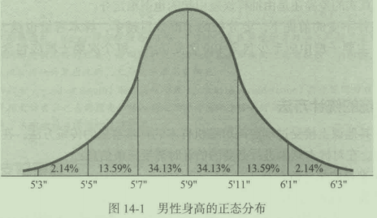

# 第14章样本容量的确定

## 学习目标

1. 理解正态分布
2. 理解总体、样本及样本分布
3. 学习如何计算均值的抽样分布
4. 学会如何确定样本容量
5. 理解如何确定统计功效

## 14. 1概率抽样中样本容量的确定

确定概率抽样的样本容世过程会涉及财务、统计以及管理的问题。通常来说，样本
容岱越大，所产生的抽样误差就越小。然而，大样本意味着高成本，而且对于一个项目而
言，它所能使用的资源通常是有限的。虽然抽样成本会随着样本容倡的增加呈线性递增
（样本容世增加一倍，抽样成本就会增加一倍），但是抽样误差却只能以样本容瞿的增长速
度的平方根的速度递减。如果样本容量翻两番，资料收集成本也会相应地翻两番，但是抽
样误差的水平只能下降50%。

管理问题和研究目的必须在样本容量的计算中有所反映。要求多高的估计精度，管理
所要求的实际总体的四信水平是多少？有些情况要求在较小的误差范围内有较高的精确度
（抽样误差比较小），当总体值落入较小的置信区间时，要求总体值有较高的暨信水平。有
些情况可能并不要求同样的精确度或是赞信水平。

在线访谈、互联网抽样小组和社交媒体驱动抽样的影响下，样本容量得到扩大，可用
性提高。接下来的“市场调研实践14- l"中，我们看看哪些研究结论可以由样本容狱便捷
经济地得到。每个工作日都会有4300名消费者接受访谈，我们可以及时获取关键指标的
精确数值。

市场调研实践14- 1

“超级碗“真正的影响：极大提升了顾客购买欲的品牌

舆观品牌指数(YouGovBrandlndex)的一项新研究表明，人们可能喜欢百威在“超级碗”的广告一“狗碗"(PuppyBowl),但人们看完广告后并不会更想消费。而M&M's巧克力豆广告则会大大提高购买率。

“喜欢一个有创意而且令人发笑的广告和想去店里买这个广告产品还是很有差别的。”舆观品牌指数的首席执行官泰德·马资力(TedMarzilli)表示。

舆观品牌指数称，每个工作日会有4300人接受访谈，他们来自一个网上样本小组，该小组具有美国总体的代表性。舆观品牌指数在比赛前和比赛后针对“超级碗“广告做了相关计算。结果表明，百威、Godaddy、多力多滋和微软，比其他广告客户更能吸引人们的注意力，给人们留下积极印象，但这四个品牌里只有多力多滋挤进了顾客购买欲提升最高的公司前10名。

马兹利先生说，对于M&M's、多力多滋以及其他类似吉普的品牌来说，哪怕是这样的影响日后也难说。他说：“我们的研究只关注｀超级碗＇赛后两天的情况，这个研究没有表明这种购买欲会持续多久。”

有些其他品牌可能致力于提高品牌形象，其中睿侠(RadioShack)以20世纪80年代为主题的“超级碗”广告获得比较好的反响。马兹利先生评论说，就百威目前的情况而言，“超级碗”与其说是年度营销投资大案，还不如说是小型品牌的宣传圣地。

“超级碗”：购买欲指数

### 14. 1. 1可支配预算

某一研究对象的样本容量通常是确定的，至少也会间接地受到可支配预算的限制。因此，它通常是最后确定的项目要素。一个品牌经理如果有50000美元预算可以用千一项新产品测试。那么除去其他项目成本（如调研方案和问卷的设计、数据的处理等）后，余下的那部分预算才决定调研的样本容址的大小。如果可支配的资金不能产生足够的样本容员，管理者就必须做出决策，是补充更多的资金还是放弃这一项目。

虽然这种方法看来缺乏科学性和过千武断，但是在公司环境下确实存在。财务上的限制要求调研人员和设计方案要利用有限的资源，提供有利千决策的高品质和数据资料。例如，可以用更省钱的方式收集数据，如用网络代替电话。”可支配预算“使得调研人员不得不寻求多种选择的数据收集方案并谨慎衡信信息的价值及其成本。

### 14. 1. 2经验法则

一些客户会在征求建议书中指定，要求样本容蜇为200、400、500或其他的特定量。这个数据的确定有时是出千对抽样误差的考虑，而有时则只是依据以往的经验。对指定样本量这种做法的合理解释归结起来只能说是“一种强烈的感觉”，认为某一特定的样本容量是必要的或适当的。

如果调研入员确定要求的样本容量不能充分支持调研计划的目标，这时他们就有职责向客户提出扩大样本容量的建议，并让客户做出最后的决定。如果扩大样本容量的建议遭到了否决，调研人员会拒绝提交调研计划，因为他认为样本容谓不合理会严重影响调研结果，那样的结果有那么多的错误从而会对客户产生误导。

### 14. 1. 3拟分析的“子群数”

在任何确定样本容矗的问题中，都必须认真考虑所要分析并要据此做统计推断的总体样本的各个子群的数目以及预期容盘。例如，研究者可能认为，总的来说400的样本容量足够进行研究。但是，如果男性和女性受访者必须单独分析，且各占50%,则每个子群的容匮就是200,这足够用来统计推测两组子群的属性特点和行为表现吗？如果结果需要分年龄和性别来分析，问题会变得更复杂。

假设要对一个样本的四个子群进行分析，这些群分别是：35岁以下的男性、35岁以上男性、35岁以下的女性和35岁以上的女性。如果每组都要样本占25%,那么每组就只有100名受访者。间题是，样本容世变小后，抽样误差就会变大，每个样本子群间观测到的区别到底是真实的差异还是由抽样误差引起的也很难定夺。

在其他条件不变的前提下，要分析的子群数目越多，样本容妞也越大。一般建议，一个样本中，主要子群中应至少包含100个受访者，每个次要子群应包含20~50个受访者。

### 14. 1. 4传统的统计方法

你可能在其他课上接受过确定简单随机样本的样本容量的传统方法，在本章会对这些方法进彴回顾。在对样本结果进行必要的估计时需要三条信息：

- 总体标准差的估计值；
- 抽样的允许误差范围；
- 抽样结果在实际总体值的特定范围（抽样结果士抽样误差）内的允许置信水平。

有了以上三条，就可以计算出简单随机抽样所需的样本容量了。

## 14. 2正态分布

### 14. 2. 1总体特征

在古典统计推断中正态分布居千特别重要的地位，这有以下几方面原因。首先，市场调研人员遇到的许多变量及其概率分布都趋千正态分布。例如，软饮料的罐数、瓶数或杯数；爱吃快餐的人平均每月吃快餐的次数；每星期看电视的平均小时数。其次，有理论上的原因。比较重要的一条是中心极限定理(centrallimittheorem)。根据该定理，对千任何总体，不论其分布如何，随着样本容量的增加，抽样平均数和抽样比例的分布趋近于正态分布。这种趋向的重要性将在后面做详细说明。最后，许多离散型概率的分布也近似千正态分布。例如，将大量的美国男性的身高值绘制在一张图上，就会得到类似千如图14- 所示的分布图的分布，这种分布就是正态分布，它有以下几个重要特征：

(I)正态分布呈钟形且只有一个众数(mode)。众数代表着集中的趋势，是发生频率最高的那个特殊值。两峰的（两个众数）分布有两个峰值。

(2)正态分布关于其平均数对称。也就是说，它没有发生倾斜，它的集中趋势的三个衡量标准（平均数、中位数和众数）是相等的。

(3)一个正态分布的特殊性由其平均数和标准差决定。

(4)正态曲线下方面积等千I,表明它包括了所有的观测值。

(5)正态曲线下方在任意两个变虽值之间的面积，等千在这一范围内随机抽取一个观察对象的概率。以图14- 1为例，一次抽取到一名男性，其身高在5英尺7英寸~5英尺9英寸(5'7"~5'9")的概率为34. 13%。

(6)正态分布还有一个特点，所有的正态分布平均值与给定的标准差之间的面积是柜等的。所有的正态分布在平均数士1个标准差之间的面积相同，都占曲线下方面积的68. 26%,或者说是占全部调查总体结果的68. 26%。这叫作正态分布的比例性(proportionalproperyofthenormaldistribution),这一特点为本章将要讨论的统计推断提供了基础。

### 14. 2. 2标准正态分布

任何正态分布都可以转换为标准正态分布(standardnormaldistribution)。标准正态分布的特点与正态分布相同，只是标准正态分布的平均值等千0,标准差等于1。标准差(standarddeviation)是离散程度的一个衡量标准。用一组中的每个值减去组平均数，再将各个值平方后，除以（项数－］），最后开平方，便可以得到标准差。

附录B的表B- 2中列出的概率就是建立在标准正态分布的基础上。正态分布的任一变量值X通过一个简单的转化公式就能变换成相应标准正态分布中的Z值。这种转换是由正态分布的比例性决定的：

## 14. 3总体分布和样本分布

进行抽样调查，目的是要对总体做出推断，而不是为了描述样本的特征。总体，就像前面定义的，包括可以从中获取信息达到调研目标的全部可能的人或物体，样本是总体的子集。

总体分布(populationdistribution)是总体中全部单位的频率分布。这一频率分布的平均数，通常用希腊字母μ表示，标准差用希腊字母6表示。

样本分布(sampledistribution)是单个样本中所有单位的频率分布。样本分布的平均数常用X表示，标准差S表示。

## 14. 4平均数的抽样分布

在这里，有必要介绍一下第三种分布一—平均数的抽样分布。理解这一分布对于充分认识估计简单的随机抽样误差的依据十分重要。平均数的抽样分布(samplingdistributionofthemean)是指从一个总体中抽取一定数量的样本，其平均数的概念的和理论的概率分布。虽然人们很少计算这种分布，但它的特性具有很大的实际意义。要获得样本平均数的分布，首先要从特定总体中抽取一定狱的样本（如25000),接着，计算各样本的平均数，并排列出频率分布。因为每个样本由样本单位的不同子集构成，因此样本平均数不会完全相同。当样本的单位数和随机性足够大，样本平均数的分布近似于正态分布。这一论断的基础是中心极限定理。定理说明随着样本容量的增加，从任一总体中抽取的大址随机样本的平均数的分布接近正态分布且平均数等于μ,标准差Sx(称为标准误差）等于

式中，n为样本单位数。

平均数的标准误差(standarderrorofthemean)(S又）之所以按前面所示的方法计算是因为．一个特定的样本平均数分布的方差或离差会随着样本数的增加而减少。由常识可知，样本数越大，单个样本的平均数就越接近总体平均数。

值得注意的是，中心极限定理的成立不考虑样本总体的分布形状，也就是说忽略了总体分布，样本平均数的分布会趋近正态分布。

常用来表示总体分布、样本分布和抽样分布的平均数及标准差的符号都列在表14- 2中。图14- 3表明了平均数的总体分布、样本分布和抽样分布之间的关系。

### 14. 4. 1基本概念

考虑一个抽样案例：以为调查人员以在最近30内至少吃过一次快餐的所有顾客为总体，从中抽取了1000组容量为200的简单随机样本。调查目的是要估计平均一个月内这些人吃快餐的平均次数。

如果调查入员计算出每一组的平均数，按和关值确定区间，整理后便得到表14- 3的
频率分布图。而图14- 4以直方图的形式表示这
些频率，直方图上方还可以看到一条正态曲线。
正如你所看见的，直方图十分接近正态曲线的形
状。如果调查人员选取足够的容量为200的样
本，计算每组的平均数，整理排列后所得的分布
就是正态分布。图14- 4的正态曲线就是这项调
查中平均数的抽样分布。大样本(~30)平均数
的抽样分布有以下特征：

- 是正态分布。
- 分布的平均数等千总体的平均数。
- 分布有标准差，称为平均数的标准误差，它等于总体标准差处以样本容量的平方根。

将标准差称为平均数的标准误差表明它更适用于样本平均数的分布，而不是总体或是样本的标准差分布。记住这种计箕只适合简单随机样本，其他类型概率的样本（如分层样本和整群样本）要用非常复杂的公式计鍔标准误差。记住，这个公式没有包括全部类型的偏差，例如在稍后讨论的无回应偏差。

市场调研实践14- 2

一项关千荷兰酒品消费研究中的＂拒答偏差”

在现实中，有些人拒绝回答民意测验中的问题，或者仅仅是选择性地回答一些问题，忽略其他的，这样会影响到一项调查的精度。市场调研人员把这种拒答叫作拒答偏差(nonresponsebias),鹿特丹市的Addiction调研机构中的研究者认为这是一个严重的问题。实际上，在荷兰，调查的回答率在20世纪80年代有80%,然而到了20世纪90年代，就下降到了60%,而且还在不断地下降，这样就会导致样本容量会更小，而且在总体估计上的精确度就会下降。那些在民意测验中拒答的人可能会有一些有别于回答者的特征。

在2002年，研究者回顾了在1999年所做的一项关于酒消费的研究结果。他们的研究假设是：戒酒者不回答的原因是他们对于这个项目不感兴趣，而那些嗜酒者不回答的原因在于他们会由于自己的嗜酒而感到尴尬。这个假设是在后续的研究中提出的。在设计他们的研究时，他们知道拒答偏差不能仅仅通过建立在人口统计变量上的加权数据而得到修正。他们需要调查那些拒答者，来考察他们的答案是否与那些回答的人有所不同。

首先，从鹿特丹市的行政区域内选择一个包含了1000个人、年龄为19~69岁的随机样本。每个人都会收到一份邮寄的调查问卷，问卷内容是关于他们对酒的消费。在两封提醒单寄出后，回答率是44%。在接下来的研究中，研究者选择了鹿特丹市的25个邮政区域，得到了一个包含310人的二次样本。在这些人中，有133个人已经回答了第一项调查，177人拒答，所以这两个组就被分别称作主要的回答者和拒答者。后一个组内的成员每5个一组地进行了一对一的访谈。最终，有48个主要的拒答者无法取得联系，因此拒答者最终的样本容量为127。

两个组都被问到相同的问题：心你是否饮过酒？＠你是否在一天中饮过6种或是更多的酒精饮料？拒答者对于这两个问题的净回答率都是52%,换句话说，在后续的研究中，会遇到甚至更多的拒答者（超过48%)。

更重要的是，荷兰的研究者发现：首先，戒酒者未被充分的代表，除了频繁外，嗜酒者也是；其次，女性中的戒酒者未被代表的比男性更严重，在35岁以上女性中的更严重，其他民族相对荷兰人更严重；最后，在以后的研究中，对拒答者进行彻底的研究对于估计拒答偏差是非常必要的。究竟是谁没有回答，这个答案对于任何的研究都是非常有价值的，都具有统计的必要性。

问题：

1以酒精的使用为例，拒答偏差来自于极端值（戒酒者和嗜酒者）。有没有什么方法可以深入这两个重要的群体，从而避免后续的研究？

2. 在第二项研究中，有48%的人没有回答，那么相对于提高统计的精确度，因此而付出的邮寄问卷的费用、保护隐私的费用是否值得呢？

### 14. 4. 2根据单个样本做出推断

在实际操作中，人们往往不愿从总体中抽出所有可能的随机样本，画出如表14- 3和图14- 4那样的频率分布表和直方图来；相反，人们希望进行简单的陆机抽样，并据此对总体进行统计推断。间题出现了，通过任意简单随机样本对总体平均数进行的估计，其估计值在实际总体平均数士1个标准误差范围内的概率究竞为多大？根据表14- 1可知概率为68. 26%,因为所有样本平均数有68. 26%都在此范围内。而通过简单随机样本对总体做的估计为在实际总休平均数士2倍标准误差范围内的概率为95. 44%,在实际总体平均数士3倍标准误差范闱内的概率为99. 74%。

### 14. 4. 3点估计和区间估计

当利用抽样结果对总体平均数进行估计时，有两种估计方法：点估计和区间估计。点估计(pointestimates)是把样本平均数作为总体平均数的估计值。观察图14- 4的平均数抽样分布可知某一特定的抽样结果，其平均数很可能相对更接近总体平均数。但是，样本平均数分布中的任意一个值都可能是这一特定样本的平均数。有一小部分的样本平均数与实际总体平均数有柜当的差距，这种差距就叫抽样误差。

抽样结果的点估计在很少的情况下完全准确，因此人们更偏向于区间估计。区间估计(intervalextimate)就是对变员值（如总体平均数）的区间或范围进行估计。除了要说明区间大小外，习惯上还要说明实际总体平均数在区间范围以内的概率。这一概率通常被称为置信水平(confidencelevel),区间则被称为置信区间(confidenceinterval)。

平均数的区间估计按以下步骤推导：从总体上抽出一定员的随机样本，计算出样本平均数，可知这个样本平均数存在千所有样本平均数的抽样分布中，但确切位置不清楚。此外还知逍，这个样本平均数在实际总体平均数土1个标准误差（正或负）范围内的概率是68. 26%巾此，研究者确信：实际值等于样本值加上或减去l个标准误差的赞信水平为68. 26%。用符号表示如下

同理可知，实际值等千样本估计值加上或减去2倍标准误差（严格上是1. 96,但为了计笃简便通常使用2)的四信水平为95. 44%,实际值等于样本值加上或减去3倍标准误差的匣信水平为99. 74%

以上都假设总体标准差巳知，大多数时候情况并不是这样。如果总体标准差巳知，根据定义可以知逍总体平均数，那就没有必要事先抽取样本了；如果不知逍总体标准差，那就必须通过样本标准差去估计。

### 14. 4. 4比例的抽样分布

市场调研人员经常会偏重于进行比例或百分比方面的估计，下面是一些常见的例子：

- 知逍某一广告的总体百分比。
- 平均一周上网一次以上的总体百分比。
- 最近30天内吃过快餐和吃过4次以上快餐的总体百分比。
- 观看某一电视节目的观众的总体百分比。

当总体比率或是百分比是有意义的时，比例抽样分布就会被采用。

从特定总体中抽出大量随机样本．这些样本的抽样比率的相对频率分布就是比率抽样分布，它有以下特征。

•近似于正态分布。

•所有比率抽样的平均数等千总体比率。

•比率抽样分布的标准误差可以按下面的公式计算。

式中Sp一比率抽样分布的标准误差；

P一总体比率的估计值；

n一样本单位数。

考虑一下，如果需要估计最近90天内曾在网上购物的所有成年人的百分比，那么就像要得到平均数的抽样分布一样，要从成年人总体中选取1000组容量为200的随机样本，计算出L000组样本中所有在最近90内曾在网上购物的人数的比率。这些值排列将形成一个趋近千正态分布的频率分布。这一分布的估计比例标准误差可以用前面计算比率标准误差的公式来计算。

读完下一节，你就会明白，市场调研入员对千样本容侃间题，更趋向千进行比率估计而不是平均数估计，是有其原因的。

## 14. 5样本容量的确定

### 14. 5. 1平均数问题

考虑前面那个估计平均一个月快餐族吃快餐次数的案例，如果管理层需要对顾客的平均光顾次数做出估计，从而决定是否实行正在拟订的新促销计划。为了得到这个估计值，市场调研经理打算在所有的快餐消费者中考察某个简单随机样本。间题是，确定本次调查样本容量的信息是什么？首先，对于估计平均数的间题，计尊其所需要的样本容量的公式是

式中Z一标准误差的置信水平；

a- - 总体标准差；

E—可接受的抽样误差范围（允许误差）。

计算所需的样本容量要有三条信息：

(1)抽样误差E的可接受的或允许的详细范围。

(2)标准误差置信水平的允许确切值，即Z值。换一种说法，即总体平均数包括在制定置信区间内的置信水平是多少。

(3)最后需要估计一下总体标准差a。

计算中要用到的控信水平和允许误差(allowablesamplingerror)E必须由调研人员与客户进行磋商后才能确定。如前所述，管信水平与误差范围的确定不仅要根据统计原则，同时要顾及财务与管理方面的要求。理想情况下，我们总是希望置信水平很高，误差很小但要知逍｀这是经营决策，必须考虑成本间题，因此要在精确度、控信水平与成本之间进行权衡。有时候，不要求很高的精确度与管信水平。例如，在探索性研究中，你也许只是想通过调研基本了解一下消费者对产品的普遍态度是正面的还是负面的，这里精确度就显得不太蜇要了。但如果是一项产品创意测试，就需要精确度较高的销售估计值，以便在把新产品推向市场前可以做出潜在的成本与风险的估计。

对总体标准差(populationstandarddeviation)进行估计，是一个更麻烦的问题。我们在前面说过，如果总体标准差巳知，那么也就能知道总体平均数（总体平均数是用来计算总体标准差的），这样的话就没必要抽取样本了。但调研人员如何不抽取样本就估计出总体标准差呢？结合使用以下四种方法可以解决这个问题：

(1)利用一切的考察结果。大多情况下，公司以前曾经进行过类似的调研，这时可以利用以前的调研结果作为本次总体标准差的估计值。

(2)进行试点调研。如果调研对象规楼太大，可以投入一定的时间和资源对总体进行小规模的试验调研。根据调研结果估让总体标准差做出估计。

(3)利用二手资料。有时候通过二手资料也可以对总体标准差做出估计。

(4)通过判断。如果其他方法都失败了，还可以判断总体标准差，即把许多管理人员的判断集中起来进行分析，而这些管理人员都有能力对有关的总体参数做出有所根据的猜测。

当调研完成了，计鍔出样本平均数和样本标准差后，调研人员就可以正确估计出总体标准差，并确定所需的样本容址了。这时如果需要，可以对以前的抽样误差估计做出调整。

再来考虑估计快餐族每月平均吃快餐的平均次数：

- 与公司的管理者进行磋商后，市场调研经理认为有必要估计一下快餐族吃快餐的平均次数。考虑到管理者对精确度的要求，他规定估计值不得超过实际值的0. (1/10)。这个值(0. 10)将作为E值代入公式。

- 此外，市场调研经理认为需要考虑全局，把实际总体平均数在区间以内的置信水平定位95. 44%,而若要置信水平为95. 44%,就必须是在2倍标准误差范围内（严格是1. 96)。因此，2作为Z值代入公式。

- 最后，确定公式中的值。幸好公司一年前曾做过类似的调研，调研对象是最近30天内吃快餐的平均次数。其标准差是1. 39,以此作为值最好不过。因此，把1. 39作为代入公式，然后通过计算可知，样本容量为772时可以满足提出的要求。

### 14. 5. 2计算比率的问题

考虑估计最近90天内曾在网上购物的所有成年人的比率或百分比的案例。其目标是
从成年入总体中抽取一个简单随机样本，估计其比率是多少。

- 由于问题涉及快餐消费者，以抽样结果为基础进行比率均值估计的首要任务是确定一个可接受的E值。例如，如果士4%的误差水平是可以接受的话，就可以把0. 作为E值代入公式。

- 其次，假设调研人员要求抽样估计在实际总体比率的士4%范围以内的置信水平为95. 44%,那么按前面讲的，把2作为Z值代入公式。

- 最后，在一年前的一次类似调研中，有5%的被调研人员表示在最近90天内曾在网上购物。我们可以用0. 05作为P伯代入公式。

根据要求，需要一个119人的随机样本。值得注意的是，与确定估计平均数所需的样本容扭的过程相比，调研人员在确定估计比率所需的样本容量时有一个优势：如果缺乏估计P值的依据，可以对P值做最悲观或最糟糕的假设。给定Z伯和E值. P值为多大时要求的样本量最大呢？当P=0. 5时，"P(I- P)"有极大值0. 25存在，如此设定P值样本容斌最大。而给定Z值和E值，对于与平均数估计所需样本社有关的6值就没有最悲观的假设。

### 14. 5. 3确定分层样本和整群样本的容量

本章列出的计算样本容量的公式只适用千简单随机样本，当然也有适用千其他如分层样本、整群样本确定样本容量和抽样误差范围的公式。虽然本音提到的许多概念对这些样本都适用，但是它们的计算公式却要复杂得多，而且公式中要用到的数据往往很难得到。因此，这些样本的容最确定问题超过了本书的介绍范围，有兴趣的读者可以参考高级教材。

### 14. 5. 4定性调研下的样本容量
在确定调研需要的传统焦点小组、深入访谈或在线公告牌焦点小组等的数量时，定性调研下的样本容矗间题就呈现出来。由千我们在定性调研中使用的样本容园较小，我们在本章讨论的样本容量计算方法没有办法解决这个问题。专家根据经验讨论出了一些规则，并且分析建议，定性调研中，访间过20~30人以后，受访者的回答模式就固定下来了。这个间题会在接下来的“市场调研实践14- 3"中详细谈到。

定性调研下的样本容量

在定性调研中，样本容量需要多大？需要多少个焦点访谈小组．进行多少次单独深入访谈(individualdepthinterviews,IDIs)或者组织多少在线电子公告牌焦点小组(onlinebulletinboardfocusgroup)?考虑到一个小组异常不具代表性的可能性比较大．一个建议是每个话题要有两个及以上的小组；另一指导方针则是一直采样，直到达到饱和，即受访者中不再出现新观点为止。这些规则都直观合理，但没有坚实的理论支撑，也不能产出最优的样本容量。这里提出的方法能给出一些明确的答案。

首先，我们必须要清楚定性调研的重要性。

就算是定性调研，样本容星也至关重要

我们通过定性调研去发现一些东西：找出顾客喜爱或不喜爱产品的原因、对顾客来说很重要的产品因素、顾客对某位代言人的看法、顾客购买我们品牌产品服务时遇到的问题等随后，定量调研需要利用精准的统计学估计每种观点的重要性或普遍性。

关键在于我们定性调研的样本必须足够大，以确保大部分乃至全部重要观点都被采集到。

定性调研的“遗漏＂，结果可能很严重

如果定性调研没有及时发现一些问题，比如一些需要立即采取应对措施的市场反应、产品性质、顾客意见、需求和费用问题等，会造成哪些严重后果呢？下面有些例子：

- 未发现造成顾客不满意的原因，而且无法纠正在竞争压力巨大的行业里、即使是极小的不满都会减少公司利润。
- 针对一则广告进行定性测验，如果广告文案某些方面会得罪市场总体中一个较小但是善千发声抗议的群体，却没被定性测验检测出来，那么就会造成公关大失败。
- 为了定量调研首先进行定性调研，定性调研中某个问题措辞含糊可能会导致随后的定量调研中受访者回答无效。因而，定性调研的失败会导致受访者的误解，最终造成定量调研估计错误。

尽管与样本容证对定量调研的重要性原理不同，样本容量对于定性调研很重要。下面的例子则向我们展示，为什么就算忽略某些点的风险非常大、但这些风险仍然会被轻视。

计算概率以决定样本容量

那么我们该如何确定所需要的样本容量以降低风险呢？我推荐两种方式：一种是与估计定性样本容量相似但不同的以计算概率为基础的方式。另一种方式就是参考一些实际的调研。根据多项调研结果，样本容量大小达到30时，无论事件的发生率为多大，都会被囊括其中。

为覆盖所有种类（或几乎所有种类）重要客户的看法，30是样本容量(N)比较合理的起点一—－除非有人能提出更明确的答案。研究表明，将样本容量定为30可以把遗漏观点的概率从10%降到5%(假设为随机抽样），而且其他调研结果都比5%的概率小。如果采用焦点小组访谈气而且挑出一个一个的成员，凑齐30的样本容量（例如，从三个访谈小组里各抽出10人），每个成员对每个关键问题都应有足够的发言时间．这一点十分重要除此之外比较关键的是，焦点小组访谈调解员要控制好小组内喜欢主导谈话的人，同时鼓励激发害羞内向的人｀以免不善言辞的消费者及其特色鲜明的观点被遗漏。

问题：

1. 样本容量对定性调研来说重要吗？为什么？

2. 一个定性调研的合理样本容量是多大？这个样本容量是以什么为基础的？

### 14. 5. 5总体容量和样本容量

你也许会注意到计算样本容惯的公式中没有一个用到总体容量，读者（和经理们）经常会注意到这个问题表明上看来好像是要抽取的样本容量越大，其总体容量也应该增大。其实不然，血常总体容量与在一定误差和管信水平范闱内估计总体参数所需要的样本容量之间没有直接的关系。实际上，总体容量只有当样本容量和对它而言过大时才会起作用。根据经验，当样本容皇超过总体的5%时，就需要调整样本容最了。一般都假设样本的抽取是相互独立的独立假设(independenceassumption),这一假设在样本相对千总体很小的时候成立。当样本凰占总体比例相对较大(5%以上）时就不成立了。因此，我们必须调整一下标准公式。例如，前面的计鍔平均数标准误差的公式

当样本容怅占总体5%以上，就要推翻独立假设。调整后的正确公式是

(N- n)/(N- 1)被称为有限总体修正系数(finitepopulationcorrectionfactor,FPC)。

当样本容量占总体的5%以上，调研人员可以通过FPC来诚少所需的样本容址。计算公式如下

经过FPC的调整，需要的样本容凰由原先的400变成了333。

问题关键不是样本容榄大小与总置大小的关系，而是选取的样本是否能真实代表总体的特征。经验检验表明，经过仔细挑选的样本，尽管容恨不大，却也能十分准确的反应总体特征。许多著名的全国性调研和民意测验，如盖洛普民意测验、哈里斯民意测验的样本都不超过2000。这些例子表明，即使调研对象是数千万人的行为，也可以通过相对于总体相当小的一部分样本进行十分准确的预测。

### 14. 5. 6所需的抽样单位数目的确定

不考虑目标样本容量是如何确定的，调研人员常常会受到一个实际问题的限制，即如果要完成一项任务的话，需要多少抽样单位（电话号码、地址等）。例如，如果最终的目标样本量是400,那么很明显一个电话调查需要多千400个电话号码来完成。

电话薄上的一些号码是联系不上的；一些人是没有资格来作为调研对象的，因为他们不满足总体的要求；也有一些人会拒绝完成调研。当需要进行抽样调研客户或是顾客的满意度时，这些因素影响着最终对千抽样所需要的电话号码的数员的估计。这种估计应该是比较精确的，因为研究者要避免向多余的人支付购买电话号码的费用。此外，研究者也不希望在调研中出现电话号码没有了而需要等待的情况，接下来的“市场调研实践14- 4"对如何为一项电话抽样估计所需要的电话号码的数址进行说明。

要保证估计的精确度：需要多少电话号码

计算一个项目需要多少个电话号码是一项艰难的工作，但是下面的一些基本准则可
以使它变得更容易些。SSI公司在调查抽样中应用的计算样本容量的公式包括四个要素：
O需要的巳完成访谈的数量；＠）有效电话率（或“可用的“电话率）；＠）发生率；＠接触率／
完成率。

1. 已完成的访谈

已完成访谈的数量是建立在样本容量计算公式上的简单随机样本，是最终你需要达到的样本容量

2. 有效电话率

有效电话率随着抽样方法的不同而不同。一个SSIRDD样本产生出一个60%的有效电话率，这对于在公式里使用来进行估计是很好的一个数值。

3. 发生率

发生率指的是访谈中有资格的接触率、或者说，接听你的电话（或是回复邮件问卷）的人中有多少比率会通过你的筛查性问题？准确的发生数据对于确定合适的样本容量是非常重要的。若你的研究在某领域进行，制定过高的发生率会导致样本的缺乏。

4. 接触率／完成率

最后一个因素是接触率／完成率。SSR把这个比率定义为那些有资格成为研究对象的人中愿意合作完成访谈的比率。在你试图合理的估计出完成率的时候，有很多重要的问题需要考虑：

- 接触率；
- 访谈的长度；
- 问题的敏感性；
- 一年的某个时段；
- 尝试／回调的数量；
- 在这个领域中时间的长度。

假设一个访谈时间很短(10分钟内），而且不涉及敏感话题，有着充足的回调，而且这个研究在该领域中有足够长时间了，SSI估计会有30%的完成率。完成率需要根据每个研究的特征而进行调整。如果调研对象是敏感的，或者说这个访谈的时间很长，那么这个完成率就会下降。如果在这些领域中的时间不超过一周，SSI建议至少增加20%的样本容量。

一个例子

假设你希望在英国完成300个访谈。通过使用一个随机数样本，你可以期待有效电话率是60%。最开始，需要通过有效电话率(0. 6)将你需要完成的访谈数量(300)进行分类，产生出500个。你需要接触到那些重度的软饮料嗜好者（成人中17%),你估计30%接触到的人会完成这个访谈。通过发生率(0. 17)和完成率(0. 3)来对500进行分类a最终的结果显示你需要9804个电话号码来完成这个调研。

## 14. 6统计功效

尽管在市场调研中用本章公式计算样本最是十分标准的做法，但这些公式都只承认l型错误（不存在差值时推断差伯存在而产生的误差）。它们显然不考虑II型错误，即实际存在差伯时认为没有差值而产生的误差。不发生1J型错误的概率叫作统计功效(statisticalpower)。计算样本容量的标准公式默认统计功效为50%。举个例子，如果要确定两种产品中哪一个对目标顾客群更有吸引力，并且与可能进行购买的目标顾客的百分比之同可以有5%的差值，这时标准样本容员公式要求每项产品需要的样本容址大约为400c通过这一计算，我们默认了一个事实，即有50%的可能使得我们错误的推断出两种产品具有柜等的吸引力。

表14- 4列出了a(误拒无效假设的概率）为0. 25和两个独立比例之间的差值为不同伯时要求的样本容量。对千各种置信水平都有公式，可以进行指数计算，但足公式很复杂，而且并不能帮助你来理解统计功效的基本概念。互联网上有专门进行这些计算的程序在网上蜇新计算一下表14- 4里的数据，其中一个的网址是：https://www. dssresearch. com/K. nowledgeCenter/toolkitcalculators/statisticalpowercalculators. aspx其过程如下：

- 点击屏幕左上方的两组样本百分比选择键。
- 向右栏内输入样本l的百分比和样本2的百分比，这一输入的数据就能反映出你要观察的差值，并且值在预期范闱内。这些数据的统计数为50%(标准样本容阳公式里的P值）。

- 在右下方，输入a和f]的误差水平，a是标准样本容卧公式里的E们. /J是没能否定无差值的零假设的概率，统计功效等于1- /J。
- 点击屏幕右下方的”计算样本容量”键。

表14- 4计算a为0. 25和不同效用下独立样本比例之间的差值时要求的样本容量

## 本章小结

确定概率抽样的样本容量要考虑到财务、统计和管理三方面的要求。若其他条件相同的话，样本容量越大，抽样误差就越小；相反，调研费用随着样本容量的增大而增加。

确定样本容量的方法很多。一种是根据可支配的资金来确定门简言之，就是根据预算来确定，尽管看上去不够科学，但它在市场调研领域里也是经常用到的。第二种是凭经验确定，主要是凭一种感觉或是平时的经验来确定样本容量，常用的有200、400或500,还有一种是根据要分析的子群数目来确定。一般来说，需要分析的子群数目越多，样本容量就越大。

除了以上所说的，还有一些传统的确定样本容量的方法，传统的计算方法需要三个数据：总体标准差的估计值、调研人员或客户能够接受的抽样误差范围，以及总体值不超过可接受范围的置信水平。

统计抽样理论中很重要的一个概念是正态分布。正态分布呈钟形，只有一个众数，它对称千平均值。标准正态分布与正态分布的特征相同，只是标准正态分布的平均值等于0,标准差等于1。通过转换公式可以将任何正态分布的X值转换成相应的标准正态分布的Z值。中心极限定理的内容是：从任一总体中抽取的大量随机样本，其平均值的分布趋近于正态分布，且分布的平均数等于μ,标准差等于

样本平均数分布的标准差叫作平均数的标准误差。

利用抽样结构估计总体平均数有两种估计方法：点估计和区间估计。点估计就是把样本平均数作为总体平均数的估计值；区间估计是对变量值的区间或是范围做出估计。说道区间的重要性，我们也提到了实际总体平均数包含在区间范围内的概率，即置信水平；区间也称为置信区间。

那些对估计比例或比率而非平均值感兴趣的调研人员者使用比例抽样分布。该比例的抽样分布是一个给定大小的随机从一个特定人口样本获取大样本比例的相对的频率分布。比例抽样分布的标准误差计算如下

计算样本容量时，下列条件是需要满足的：允许的抽样误差范围(E),标准误差的允许置信水平(Z)和总体标准差的估计值0。在估计平均值时，计算所需样本容量的公式是

估计比例时，计算所需样本容量的公式是

最后，统计功效是指不发生II型错误的概率。II型错误是指实际存在差值时推断没有差值而产生的误差。标准样本容量公式默认统计功效为50%,要根据决策的性质采用不同标准的统计功效。

## 复习思考题

1. 解释样本容量的确定如何成为一个财务、统计和管理问题？

2. 讨论并举例在市场调研过程中确定样本容量的三种方法。

3. 一名分析快餐业情况的研究人员发现．在加利福尼亚，人们在快餐店的平均消费为3. 30美元，标准差为0. 40美元；在佐治亚州，人们的平均消费为3. 25美元，标准差为0. 10美元。这些统计数据可以告诉你什么有关这两个州的快餐消费的情况？

4. 区分总体分布、样本分布和抽样分布，区分这三者有什么重要性？

5. 什么是有限总体修正系数？为什么要使用有限总体修正系数？何时使用？

6. 假设上面的快餐店调查表明有80%的顾客喜欢法式薯条，调研人员希望标准误差不超过6%,置信水平为95%。求简单随机抽样需要的样本容量。

7. 如果你负责筹划一次辣椒烹任比赛，你必须保证有足够的样本。具体的要求如下：量信水平为99%,误差是每个烹任小组不超过4盎司辣椋，上一年比赛的标准差是3盎司，求所需样本容量。

Concomm电信公司

Concomm电信公司是一家为住户提供捆绑式通信的新兴供应商，它提供本地和长途的电话服务、数字电缆、网络服务以及家庭安全监控服务。在美国西南部，Concomm正处于品牌意识的建立阶段，现在处于这个阶段的第二年，这家公司计划花费2200万美元在这些目标地区提高其捆绑式通信的品牌意识和品牌形象。品牌意识和品牌形象对千Concomrn来说非常重要，因为它需要与许多优势企业进行竞争，其中包括AT&T、Verizon和Comcast。

在品牌形象塑造活动的第一年，Concornm花费1200万美元来追求在品牌形象和品牌意识方面同样的增长目标。为了检验这个活动是否成功，这家公司进行了电话的跟踪调研。它在活动开始前进行了一个前期测试，然后又在活动结束后进行了相应的测试。调研是为测量Concomm的品牌意识和品牌形象而设计的。任何测量上的变化都被归因于广告活动，在这个活动期间，其他任何的营销战略因素都没有发生改变。

未经提示的或是首先联想的，品牌意识（当你想到住宅通信提供商时，你最先想到的是哪个公司）在前后两次测试中从21%增加到了25%。在前期测试中，有42%的调研对象对Concomrn有着积极的印象，这一数字在后续调研中增加到了44%。虽然两个关键的测量项都有所增长，但是这两次测试的样本容量都大小了，两次测试都采用了100位随机消费老的样本。在95. 44%的置信水平下，品牌意识的抽样误差是士8. 7%,而品牌形象的抽样误差是土9. 9%,这都是后一次测试的结果。面对在品牌意识和品牌形象上较小的改变和较大的抽样误差，Concomrn只能说，在95. 44%的置信水平下，后一次测量中的品牌意识是(25土8. 7)%,或者说是16. 3%~33. 7%。而对于品牌形象，仅仅可以说在95. 44%的置信水平下，对Concornm的品牌抱有积极印象的，后一次测量中的比例是(44土9. 9)%,或者说是34. 1%~53. 9%。鉴于在品牌意识和品牌形象上较小的改变和较大的抽样误差，Concomm没有信心说这两个方面有实际的改变。

ConcommCEO关心的是花在做广告上的钱．而且想要知道广告是否实现了它本应实现的目标她想要一个更灵敏的检测，以便可以根据广告的效果得出最终的结论。

问题：

1. 说明后一次测试中抽样误差是怎么计算的？
2. 如果CEO想要在95. 44%的置信水平下使得估计品牌意识和积极的品牌形象的实际值落于士2%的区间内，样本容量应该是多大？
3. 如果CEO想要达到99. 74%的置信水平，要求的样本容量是多大？
4. 如果现在能够进行电话访谈的预算是20000美元，而每个访谈的成本是19美元，Concomm能够达到它在问题3中设定的目标吗？在这样的预算前提下，两个测量所能达到的误差水平应该是什么样的？要想达到问题3中的目标，所要求的预算是多少？

建一个村庄

村庄房屋建造(VillageHomeBuilders,VHB)是六大市场之＿＿西南地区的高级商品房建筑公司。2013年，该公司建造了200多座价格高于500000美元的房子。管理层感觉到市场和顾客品位有微妙的变化，于是请营销部门员工乔·莫斯进行分割目标市场的项目，以深入了解今日市场行情。

乔·莫斯在样本容量上遇到一些问题。由于这个项目战略意义霆大，他既和一冢市场调研公司合作，又和一家管理咨询公司合作。公司此时预算紧张，管理层承诺往这个项目投入75000美元。这些钱完全投入给市场调研项目，管理咨询公司的收费不包括在这75000美元之内。

公司、市场调研公司和管理层都提出多个应该在样本中有所体现的市场和子群后，他们初步估计样本容量至少为2000。乔接到市场调研时的一个方案，他认为该方案中的方法、应交付的产品及其他都很适合项目目标。然而，费用上遇到了问题。市场调研公司不知道该项目只有75000美元预算，一般研究者是不会被提前告知调研经费预算的，以防止他们打着能花掉每一分预算的心思而设计调研项目，或者一些其他问题。调研公司的估计如下表所示，总额为83700美元，远超过了项目预算。乔有两个选择：和管理层洽谈为项目争取更多的资金；或者备好方案修改明细，让调研公司根据修改后的方案重新估价。

VHB公司市场细分调研成本估算

问题：

1. 你认为乔应该怎么做？是为项目争取更多的资金还是减少项目的资金，还是两者都做一点？说明你的原因。
2. 如果乔打算从管理层争取更多的资金支持，请简单列出他的理由。
3. 如果乔决定改明细重新让调研公司降低价格，你建议可以或应该从哪些地方省钱？减少样本容量可以吗？将样本容量降到I600左右，可以将费用控制在预算内吗？样本容量减少后，其他花费就算降低也不会有大的降幅。减少样本容量的好处和坏处各是什么？

