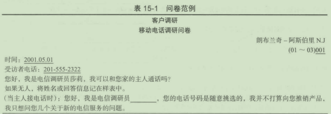
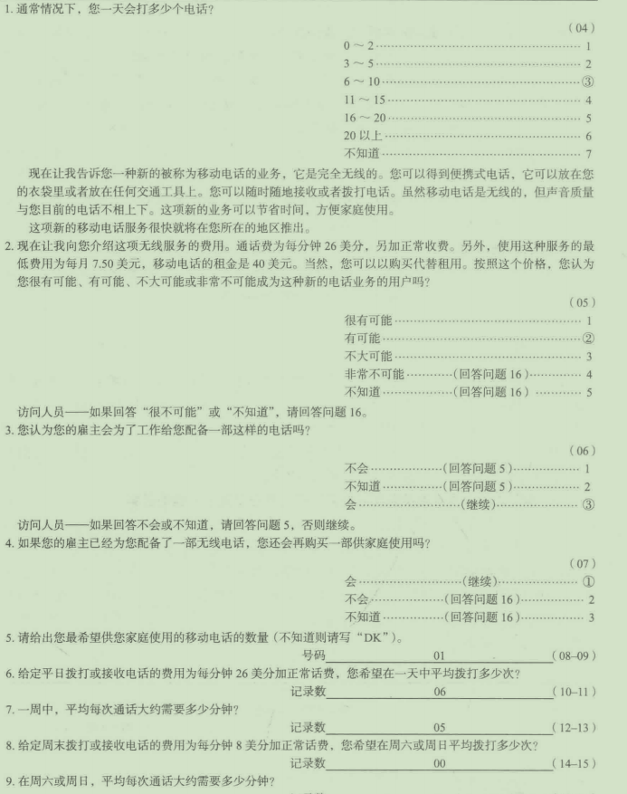
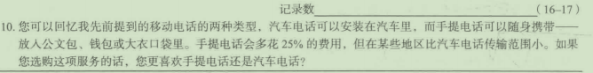
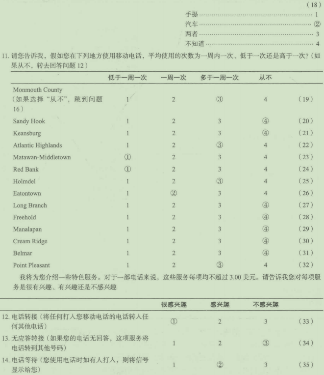
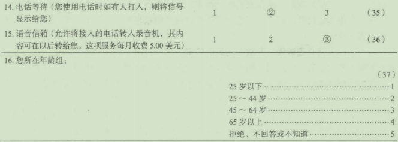
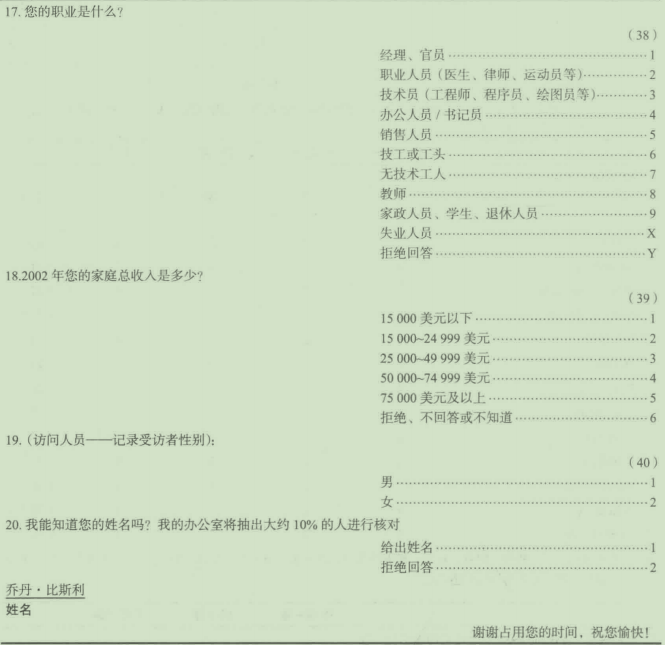
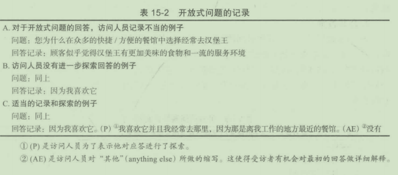
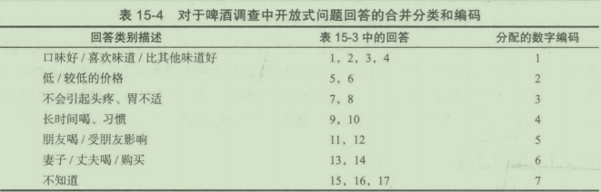

#第15章数据处理与数据分析

##学习目标

1.对数据分析过程有整体认识
2.理解数据的检验和编样
3.学习如何将调研中的问题进行编码
4.理解数据录入过程和数据录入备选
5.理解筛选问卷减少数据错误的重要性
6.学习如何将调研制表
7.深入研究图形所代表的数据意义
8.理解描述性数据

DSS调研公司最近完成了一项包含1300份间卷的邮件调研，每份问卷足足10页纸， 这13000页的纸叠起来高度超过3英尺。研究者要怎样才能把这里包含的所有信息转化成 进一步研究所需要的形式呢？最不济的情况是，研究者可以把所有的信息都浏览一遍，边 阅读边记笔记，最后得出一些结论，这种做法的局限性相当明显。为了避免上述做法的盲 目性和低效率，专业研究者采取以下五个步骤来分析数据：

(1)确认与编辑（质量控制）；

(2)编码；

(3)数据录入；

(4)数据自动清理；

(5)制表与统计分析。

如果数据是通过电子方式获取的，那么处理起来会轻松得多，但也要适当遵循这些步骤。

##15.1第一步：确认与编辑

第一步有两个目的，即研究者需要保证所有的调研都是按指定的程序进行的（确认）， 并且所有的间卷都被准确完整地填写（编辑）。

###15.1.1确认

第一步的目的是尽可能地确保每份调查问卷都是有效间卷。这里所有的术语“有效” 与第10章的＂效度”有着不同的定义。在第10章，＂效度“定义为实际测址反映拟测蜇 内容的程度，而这里的“有效"(validation)是访谈是否按适当的方式进行，而对测批标准 反映拟测量内部的程度不做评估。有效性的主要目的是确定访问人员没有作假，或者没有 迷循关键的指示。你可能巳注意到，本书介绍的大量调查问卷中都要记录被调研人员的姓 名、地址及电话号码等，这些内容对数据的分析亳无用处，但它们为市场调研人员确认有 效性提供了基础。

职业调研人员知道，访问人员说谎的现象衵当普遍。许多研究都有有关访问人员欺骗 行为的记载。因此，确认调查问卷是否有效是市场调研项目中数据分析过程中内在的、必 不可少的步骤。

所有调研结束后，调研企业要对每位访间人员所做的调研做适当比例的复查，通常复 查的比例为10%~20%。如果一位访问人员对50个入做了调研，以10%的比例做复查 确认的话，那么这位访问人员所调研的入中有5位将通过电话进行复查。电话确认主要包 括五方面内容：

(1)确认此人是否真正接受了调研。

(2)受访者是否符合条件。例如，一项调研可能要求对家庭年收入为25000美元以 上的人进行，那么在复查中受访者将被再次间到他或是他的家庭的年收入是否在25000 美元以上。

(3)确认调研是否按要求的方式进行的。例如，一项购物中心的调研应在指定的购物 中心进行，那么就应确认受访者是否在该购物中心接收到的调研。一个受访者到底是在购 物中心接受的调研，还是在其他的地方，例如在家里或是在餐馆里?

(4)确认调研是否完整。有时访问人员知道受访者很忙，没有时间完成所有的测试； 某项具体调研的受访者很难找到，所以访问人员很可能一开始间一些问题，然后其余的问 题自己填写。由千存在这种情况，在确认过程中应询间受访者是否被提问了调研中的所有 问题。

(5)确认过程中还应检查其他方面的间题。例如，访问人员是否彬彬有礼？访问 人员是否明确介绍了委托人的身份或调研的目的？受访者对访问人员或调研过程有什么 意见？

综上所述，这一步骤的目的是确认调研是按要求正确无误进行的。研究人员必须确信 将用以提出建议的调研结果真实反映目标顾客的回答。

如果调研是通过网络平台进行的，相应的确认过程也是必需的。下面的“市场调研实 践15-1"中将给出DSS调研公司用以确认数据有效性的具体细节。

市场调研实践15-1

DSS调研网上数据收集质益确认流程

受访者选择

当我们选择网络调研对象的时候，可以遵循以下的流程：

-选择信誉良好的网络样本组。网络样本的招募、维护和质量控制方式对于确保最好 的受访者样本至关重要。只有那些采取双向确认登记方式注册并通过使用实际地址 确认其为有效的样本组成员的样本组才值得使用。网络样本公司还必须限制调查内 容的数量，确保平台成员能在一定时间内完成，同时预留相应的程序尽量减少受 访者使用同一组织中的多个账号。以下是评价一个网络样本公司所要考虑的主要 因素：

a招聘方式。确保样本成员来自于有效的群体并且自愿参与调研。一些集体（自动 生成的邮件地址和来自网页、博客、论坛等地方的电话号码）不应当被采用。网 络样本组建和运营的唯一目的应是市场调研。

b.受访者再补充频率。这反映了网络样本剔除不积极平台成员和添加新成员的频 率。平台样本成员的保留率和整体的增长比率标志着他们的参与程度和积极性。

C.每个月调研的最大完成量。确保留有一定的限度，防止平台样本成员成为职业 受访者。

d.身份核查。这决定了网络样本公司以何种方式核查样本成员的身份。在这些步 骤中应该包括核查身份、剔除多账户个体和来自同一家庭的多个个体。

e简介收集。这决定了受访者群体的类型和从样本成员中收集的行为信息，后者 将用来描述成员特征和预先筛选特定目标人群。应制订计划对这些信息进行常 规的更新，并且根据一些显著的变化（比如性别的改变或年龄趋势的剧烈变化） 区别平台成员，以便从平台剔除部分的潜在可能。

f.激励方式。这反映了平台提供的激励类型和激励使用的频率。过少的激励次数和 过低的中奖概率都可能降低参与者行为的可靠性。

g.惩罚手段。弄清每个平台如何处理那些被怀疑在研究中有欺骗或其他违规行为的 个人。

h.典型回答率。一个平台的典型回答率反映该平台对受众的吸引程度和激励计划 的公平程度，同时也反映平台成员是否被过度调研，或者因长时间表现不积极 而不被剔除。

i.隐私保护政策。样本平台应该有明确的政策和数据保密手段，确保成员隐私的安 全和数据库的安全。

j.客户服务。拥有能迅速提供报价、估计完成数量和实施调研的积极代理人对平台 至关重要。在提供方案和收集数据时常常需要灵活的变通。客户目标和项目范围 都可能迅速改变，所以平台也必须兼备积极性和灵活性。


-不断监测网络样本的表现。需要不断监测网络样本组的回答率、受访者质量和客户 服务质量。有关前两个方面的问题（回答过快、拷贝回答、缺乏专注等）常常反馈 回平台公司。

网上数据收集质量保证一一受访者的配合度和专注度

采取这些步骤的目的是为了尽可能增加受访者的配合度和尽可能剔除那些回答问题缺 乏专注，或者故意欺骗系统以使自已被包括在某个他们并不符合条件的调研里的人。

-筛查重复回答和域外受访者。DSS调研公司使用软件工具识别试图完成多项调研 的个体，无论它们是在一个平台拥有多个账号还是拥有多个平台公司的账号。该系 统为每台电脑创建一个独一无二的”指纹＂，以区别那些在同一台电脑上进行的重 复调查，无论该用户使用了哪些平台或哪些用户名。该系统还能检测IP地址和有 关平台成员ISP的信息，以甄别那些在目标地区或国家之外却试图参与调研的平台 成员。一旦有平台成员被识别出多次试图参与同一项调研或在城外参与调研，它们 将被排除在后续的调研之外，并被报告给平台公司以便采取进一步行动。

-排除“超速者”。任何以过快速度完成调研的人都会被排除在样本之外，并且他们 巳花的时间也将得不到补偿。当然，他们已经快到不可能对调研问题进行合理的考 虑了。

-设置最短调研时限。调研开始时提前设置所允许的最短时间，以便在早期受访者中 初步标示可能的“超速者”。最初估计的限度在预计调研时长的40%~50%,最 初的受访者不会因为低于此限度立刻被终止调研，而是在随后的复查中被排除，而 且一旦收集好调研样本，最短的调研时间也能确定。早期的调研时长如果低于最新 设定的限度，将被排除在最终的样本之外。只要接收到足够数量的回复，便能计算 调查时长的中间值，然后设置调研时长50%~60%的区间，最终确定调研的最短 时限。同时，调研特征（调研复杂性、问题的跳跃性、目标人群的差异性）和调研 经验也将用来帮助设置最终的时限。一旦设定了最终的调研时限，以低于此时限完 成调研的受访者将被终止调研。作为“超速嫌疑人＂，他们的ID也将被送至平台 公司。在整个调研过程中要不断监测“超速者”比例，如果觉得最初设置的限度不 合适，还要适当调整最短时限。

-逐项检测。收集受访者花在每个问题的时间以供分析。在最终决定数据样本之前，还 应当检测受访者在每个问题上的时间分配。任何极端异常的表现都将被进一步审查，以排除那些超速完成大部分题目而在个别题目上花较长时间以躲避监测的“超速者”。

-剔除选项单一者和前后矛盾者。在调研中需要关注的另一方面是专注度。那些似乎 不加阅读题目就选择答案或总是选择一个范围内相似地方的答案的受访者将被标示 为＂嫌疑人”，以供进一步评估。对一连串项目进行重复选择（对较长一系列的问 题提供相同的选项）诚然可疑，但选项中若包含态度相反的陈述则完全可以确定该 受访者缺乏专注，并放弃对其进行调研。在一个调研的不同地方使用相同或相似的 问题是检查专注度的另一个办法。对相似或相同问题的回答有略微的偏差是很正常 的，但那些给出自相矛盾的选项（比如某人在调研之初对某问题表示“非常满意"' 而在之后回复“有点儿不满意")的受访者将被从最终样本中剔除；前后有出入者 也将被标示，比如某人自称是资深经理而后却称家庭收入很低；若不能找到合理的 解释说明这些不一致，也要将他们剔除。

-监测关键群体和行为特征，以确保样本能代表目标市场。在筛查过程中尤其要检查 样本有关性别、年龄和受教育水平的信息，以确保网络样本不会偏向年龄更低或受 教育程度更高的群体。因为在目标人群中无论以何种方式调研，出现此样本儿乎是 不可能的。如果一个关键市场变量（如市场份额、市场占有率等）是已知的，则可 以将调研结果直接同已知的范围进行比较。不能保证具有代表性样本的平台应当重 新评估。

-不允许受访者更改关键问题和筛查问题选项。一旦受访者被终止调研，要防止他们 返回修改任何筛查问题选项。如果没有这一步骤，他们就能尝试不同的答案使自己 不被剔除，这和他们一开始给出可接受的答案无异。同样地，如果在调研的主干部 分有一些你想要取得受访者第一印象的关键问题（比如竞争品牌的独立意识），也 要防止受访者返回修改那些最初选项。

-在现场调研结束前剔除回答者。为了保证计划样本量达到目标水平，在数据收集的 整个过程中都应该尽可能分析“超速者”、单一选项者（对一系列比例问题都给出 相同的答案）和缺乏专注者。在某些情况下，为了使在数据收集过程中剔除一些受 访者而不对样本容量造成不利影响，还可能需要超量取样。

-延长调研时间。不管采用哪种调研方法，延长几天数据收集时间都有助于采集更具 代表性的样本。只要有可能，让调研至少持续3~5天。即便数据收集能在一个晚 上轻松完成，持续调研一星期以上也是更好的选择。

###15.1.2编辑

确认是指对访间人员的欺骗行为及调研是否严守程序进行核实，而编辑(editing)是 对访间人员和应答者的错误进行检查。通常，在进行数据录入之前，间卷至少应经过两次 编辑：首先，由执行实际调研的现场服务企业进行编辑；其次由雇用这些现场服务企业的 市场调研公司做编辑。电话访谈、网络调研以及其他的软件驱动调查巳经进行了逻辑筛 查。纸质调研的编辑过程会涉及以下一系列的问题。

(1)确定访问人员是否没有问某些问题或没有记录某项问题的答案。例如，在表15- 所示的问卷中，间题19的答案没有记录。据问卷的机构，这个问题应该询问所有的被调 研入员，然而没有记录任何答案。同样，受访者的名字并不能清楚的表示出他们的性别。 第一次编辑（现场编辑）的目的是识别这类间题，及时与受访者取得联系，并且获得那些 没有回答的问题的适当答案。这些工作也可以在第二次编辑（由市场调研公司做的编辑） 中来做。但是，在许多情形中，这时巳经没有时间再与受访者联系，因此这份调研结果可 能被当作无效而被丢弃。

表15-1问卷范例








(2)是否遵循规定的跳问模式。根据表15-1中的跳问模式(skippattern),如果受访 者选择“非常不可能”或“不知道”，则应该直接询间问题16。问卷编辑需确保访间人员 遵循指示。有时候特别是在前几次调研访间中，访问人员会混淆顺序，在需要跳过题目时 忘记或者在不需要时跳过题目。在电子调研中，这类间题在调研设计中就能解决，不会发 生在调研过程中。

(3)访问人员是否意译了开放式问题的答案。市场调研人员以及他们的客户通常对开 放式间题的答案很感兴趣。回答的质讯或至少是所记录的内容，是反映记录答案的访间入 员工作优秀程度的标志。通常要求访问人员逐字记录答案，而不以任何方式重新释意、表 达或插入自己的语言，同时，也要求他们对初始回答进行进一步的探索。表15-2列出了 几种记录缺陷的例子。其中，第一部分展示了访间人员释意并解释一个开放间题答案的例 子；第二部分说明了访问人员没有进一步探索受访者的回答。从决策角度看，这个答案亳 无用处受访者经常去汉堡王是因为他喜欢那个餐馆，这似乎没有什么伯得惊奇的。表中 笫三部分显示，这最初亳无意义的回答是如何借助适当的探索转变为有用的形式。对回答 “因为我喜欢它“适当的探察是“为什么您喜欢它”或“您喜欢它什么＂。回答表明，他经 常去那是因为那里离他工作的地方最近，并且能够提供最方便快捷的食物。



做编紨工作的人必须对开放式间题的非标准答案做出判断，还必须判定对某一特定间 题的回答中哪些方面有局限性以至亳无用处。如有可能，与受访者再次接触并再次提间那 些答案未被认定有价伯的问题口

编辑过程是极其冗长乏味并且浪费时间的，不过，编辑工作确实是整个数据处理过程中重要的一步

##15.2第二步：编码

正如在第12市中谈到的，编码(coding)是指对一个间题的不同回答进行分组和确定 数字代码的过程大多数间卷中的大多数间题是封闭式的并且巳预先编码，这意味着对调 研中一组问题的不同答案的数字编码巳被设定。全部封闭式间题都需要预先编码。例如， 在表15-1的问卷中，第一个问题屈千这一类，在每种答案的右边都标有一个数字代码， 回答··o~2"的用编码"l"表示，回答"3~5"的用编码"2"表示，依此类推。调研 人员应该将右边数字代码阁上以记录下受访者的回答。例如，若受访者的答案是“每天7 次＂，就阁上"6~JO"这一栏右边的编码"3"。

开放式问题产生了一个编码的困境。它们之所以被设暨成为“开放式问题”是因为调研 人员或是不知道会得到什么同答，或是希望能给出比封闭式间题更加详尽的回答。在编辑过 程中，对开放式问题进行编码是一项冗长乏味并且耗时的工作。此外，这个过程在某种程度 上是主观性的。因此｀可能的悄况下人们会避免使用开放式问题，除非确实需要的情况下。

###15.2.1编码过程

对开放式问题的同答进行编码需要采用以下四个步骤

1.列出答案

调研企业的编目员准备一份列出每个开放式问题答案的清单。在有几百名被调研人员 的调研中，所有的答案都用列出。在大型抽样调研中，列出某个样本的回答。这项工作可 以作为编码过程的一部分或单独的一个步骤来完成。列表工作经常是由编辑间卷的人来完 成的。

2.合井答案

表15-3提供了一个对开放式问题回答的清单。从这份清单可以看出，一些（形式上不 同的）回答，在本质上是一致的，因此它们可以被适当地合并为一类。完成合并过程后， 就得到了如表15-4所示的表。要获得这样的表，还必须做出一些主观的判断。例如，第4 个答案是属千第一类，还是应单独归为一类？这些决定通常由资深的分析人员做出，常常 也吸收客户的意见。

表15-3开放式问题回答实例
````
问题：为什么您喜欢喝那个牌子的啤酒？（品牌已在前面的问题中提到）
回答实例：
(I)因为它口味较好
(2)它具有最好的味道
(3)我喜欢它的口味
(4)我不喜欢其他啤酒太重的口味
(5)它最便宜
(6)我买任何打折的啤酒，它大部分时间都打折
(7)它不像其他牌子的啤酒那样使我的胃不舒服
(8)其他牌子使我头疼，但这种不会
(9)我总是选择这个牌子
(10)我已经喝了20多年了
(II)它是大多数同事喝的牌子
(12)我的所有朋友都喝这个牌子
(13)这是我妻子在食品店中买的牌子
(14)这是我妻子／丈夫最喜欢的牌子
(I5)我没有想过
(I6)不知道
(I7)没有特别的原因
````

表15-4对于啤酒调查中开放式问题回答的合并分类和编码



3.设四编码

这一步通常在获得最终合并表单后进行。该表的每个类别都分配有数字编码。对啤酒调研样本的数字编码如表15-4所示。

4.输人编码

在列出答案，合并答案并且设暨编码之后，最后一步涉及实际数字记录，包括以下几个分步骤：

(1)读取每组间题中每个开放式间题的回答。

(2)找出与按步骤2得到的合并类别相符的回答，并为每个回答确定合适的编码。

(3)在调研表的适当地方，注明每个间题回答的数字编码（见表15-5),并在数据库 中输入合适的电子编码。

表15-5开放式问题的问卷例子
````
37.为什么您喜欢喝那个牌子的啤酒（牌子已在前面的问题中提到）？
因为它更便宜。(P)没有(AE)没有。
````

这里是一个过程的例子，表15-3中使用了答案清单，表15-4显示了合并和编码设眢
编码

-参见第一份间卷（见表15-3),阅读间题“您为什么喝那个牌子的啤洒＂的答案， 即“因为它便宜＂。
-将上述回答与巳经合并好的回答分类进行比较，决定将其归为＂价格高／低”这一 组，对应的编码是2(见表15-4)。
-在问卷的合适地方标注编码（见表15-5)。

市场调研实践15-2

尽力弄懂全部数据

数据库的出现使公司能够在一个单独的、高效的环境中收集、存储和分析来自多个公 司系统的信息。然而，企业管理者被局限于仅能够分析结构数据。结构数据由整齐的或固 定的答案和成排的或成列的数字组成。这些数据只需要一个数据库就能轻松存储、分类、 甄别、报告和积累。文本分析法打破了数据分析的限制，使公司能够在公司数据库中以分 析结构数据相同的方式分析非结构性、形式自由的数据。

与客户交互的系统本身就充满了大量非结构性、形式自由的文本。例如，电话中心输 入的短信、客户调查中开放式问题的回复和网络上发布的评论都是非结构性文本。文本分 析法，也称文本挖掘(textmining),是一种将非结构性信息转化为结构性信息以便用商务 智能系统进行数据处理的技术。

有很多种将文本转换为结构性数据的方法和技术，每种方法的精确度和有效性水平都 不同。在此我们将探索那些技术以及如何联合使用它们发现隐藏在文本之中的奥秘。

遗忘还是故意忽略

如今，从消费者身上产生的自由形式文本信息成爆炸式增长。研究表明，公司产生的 数据中有80%是形式自由或原始的文本。同时，由于计算机原本只能进行简单的模式匹 配、对照和挑选，因此并不能精确处理这些信息，也不能理解传统形式的语言。而且，公 司还可能有意无意地遗漏大量可能对公司生意有价值的信息。

公司有许多诸如电话中心、邮箱和自动回复系统的内部系统以收集和管理客户信息。 然而，网络公开评论对大家都是可见的，是一条能够廉价获取相关客户对公司及其竞争者 评价的途径。公司和它们的竞争者都可以使用这一信息进行竞争性研究，了解一般市场趋 势，在产品生产周期早期发觉可能出现的问题。然而，由于这些非结构信息形式自由、数 量庞大，收集和理解起来花费颇高而且麻烦。

交流性或反馈性调研通常包含一个或多个如“我们要怎样提高”“请描述您所遇到的 问题”这样的问题，这些问题的回复通常每条都很有价值。但是，如果你有几千条，你要 怎样去概括它们？

由于这些原因，公司便求助千能够自动处理和分析各种形式文本的文本分析技术系 统，将这些信息进行转换以便用来判断市场趋势、尽早发现商标和产品问题、为公司提供 改进意见和寻求客户帮助。

发现原因

传统的商务智能系统能够很好地分析结构性数据并对客户和市场当前的状况进行统计 报告一销售增长还是下降、客户满意还是不满意、这个区域的业绩比那个区域好......尽 管了解这些现象也很重要，但更为关键的问题却被忽略了——－为什么会产生这些现象。即 使投入更多对传统结构性数据进行添加、建模和统计分析，发掘这些数据背后的原因通常 也是不太可能的。

然而，如果将结构性与非结构性数据进行比较分析，比如开放性问题的回复和网络上 的评论，你就能对情况有个更深层次的理解。例如，你能够了解客户是怎么形容表现不好 的产品的，你也能知道为什么某些特定区域的客户在某些特定时期对某些特定的产品不满 意，你还能了解到导致低满意度的关键问题。文本分析法有助于解决这些问题

设计良好的调查通常都会让客户给产品或服务评判等级，然后询问”为什么您给出这 个等级的评判”或“为什么您对我们的服务今不满意”这些问题的答案非常重要。然而直到 最近，才能比较轻松地分析它们。公司习惯性地依赖千逐字编码系统，人工浏览几百份随 意抽取的样本，然后设置编码将它们归类为一般问题。

尽管人工浏览回复的样本有一定的准确性，但不可否认这一过程存在固有的缺陷。第 一个也是最重要的缺陷，是你没有浏览全部的数据。如果你有儿千甚至更多的回复，你只 能分析很小一部分信息，同时这也是最划算的。第二个缺陷是个人的偏见。每当要做出有 关数据的决定，人们总会倾向于根据他们当天的心情进行反馈和分类。眼疲劳和工作过度 同样会传递不一致的结果。例如，分析人员在某天将一个事件归类为客户服务问题，第二 天或一周后却认为它应该是产品问题。

另外，客户可能反映传统编码体系无法轻松编码的复杂问题。在这种情况下，你可能 需要进行多重相互联系的编码，但这就给人工分析带来更多困难。现如今，分析调查中自 由、开放式评论的这些挑战普遍存在。文本分析法能够自动处理和分析大量形式自由的文 本，并且能保持一致性和精确性。

不同的方法

进行文本分析有很多不同的方法，包括：

关键词分析。关键词分析是最传统的分析方法，使用的是一种模式识别法。谷歌搜索 就是一个很好的例子。

自然语言处理。为了克服关键词搜索和分析固有的缺陷，文本分析法的提供者开发了 更加高级的基于自然语言处理(NLP)的技术。这些系统虽然已存在一段时间，但使用成 功的水平不同。自然语言处理需要电脑能像人类一样思考，换句话说，就是要让电脑用人 类理解语言的方式理解语言。这包括理解基本语法规则和文字形式，如动词、名词、形容 词、介词短语等。只要系统理解了基本的语言结构，电脑就能凭借这一本领从新输入的信 息中推导出语言和表达的真实意思。

命名实体识别。命名实体识别(namedentityrecognition,NER)能够识别并提取自由 文本中实体所属的类别一人、地方以及其他诸如公司、产品、群体、组织、地点、日期 的东西。使用这项技术需要分析员预先知道需要提取的实体类别，并将它们分配到预先确 立的群组中。提取结果将被储存在数据库中，并用来了解在目标群体中广泛讨论的话题及 其出现的频率。这种分析方法优于关键词分析，因为它不仅使用了NLP区别名词和动词， 还保证提取的结果能与你的预先设定相匹配。

目标事件提取。事件提取是一项专门的技术，该流程需要设置复杂的规则，将目标 文件中经常被提及的术语作为线索，然后据此将数据进行标示和分类。标示出线索词汇之 后，再找出常常与它相伴出现的特征词汇。举一个恰当的例子，比如分析员可以先将“控 告”作为线索词汇，然后再据此找出目标文件中所提及的所有原告、被告、审判区域和诉 讼时间。

全面提取。这一全新的文本分析方法是由Attensity发明的，运用语言学的探索方法 和模式，分辨出目标文本中所包含的关键因素和关键概念。这些模式可以普遍运用在分析 文本数据，让系统能够在一个结构化数据库中生成并提取所有可用数据。这样，分析员就 能够利用处理传统数据库问题的方式报告文本中最常出现的话题。这种处理方法的优势在 于分析员不必非得在提取程序执行之前就确定所要分析的问题、事件或话题。这也意味着 全新的问题和全新的视角都能被及时有效地发现。

分析员除了要考虑用什么技术理解文本，还需要考虑许多与评论收集和评论存储有关 的问题。比较几种在社交媒体平台收集文本的区别：一种是推特，用户在上面最多只能输 入140个字，因此会有大量缩略语、代码、非正式用语和隐语；另一种是产品评价，客户 通常叙述其使用某一产品的经历；还有一种客户调查，则是直接对客户进行提问。 这些情况给文本分析制造了很大的困难。因此，尽管NLP技术能提供准确的结果， 最好的文本分析系统还应当能针对不同的信息来源和研究目的，选择适合的分析方法。

有效的洞察

从文本分析中能够普遍了解到的东西之一是，客户在与公司或品牌交流的哪个阶段会 表现出一些积极的或消极的情绪。考虑到客户在自由文本中能够表达的所有东西，一般性 的情绪是很容易发掘的，因为人们描述不满或不悦的方式普遍相似。

然而，客户评论中获得的最具价值的洞察是那些被称为有效洞察(actionableinsights) 的东西。有效洞察直接指向客户经历中可能对公司立马造成影响的部分，比如某个产品问 题。另外一个例子是不完善的工作流程或运营政策给客户带来的不悦或与客服代理的不愉 快交流使得客户要求退款。与客户表达的一般性情绪不同，这些类别的信息直接指向那些 公司能够采取的防止客户流失和提高客户忠实度和满意度的措施。

问题：

1.为什么现如今文本分析变得不可或缺？

2.请描述文本分析的不同方法。

###15.2.2自动编码系统

对千计算机辅助电话访谈(CAT[)、网络调查以及短信调查(SMS),封闭式间题的数
据录入以及编辑都被完全省略了。然而，对于开放式间题，编码过程还是必需的。随着技
术的发展与进步，对于开放式间题单调的编码过程将会很快被计算机系统代替，这个系统
几乎不需要高水平的专家的介入和决策c
SPSS的TextSmart模块就是一个自动编码系统的典型代表。这些系统的核心有一些
符号算法作为支撑，能够很有效地加快编码的速度，降低成本，并且还能增加编码的客观
性。从根本上说，这些算法就是利用计算机来搜寻开放式间题的类型，根据关键词或词组
来进行分类。
Semantria提供了许多不同的文本处理工具和许多处理开放式问题结果的选择，能
够对开放式间题进行一定程度的概括，尽管这显得不太可能。重要的是它还很快。详情
不妨参考它们的网站semantria.com。在“市场调研实践15-3"中提供了一个公司使用
semantria服务的范例。
词云(wordclouds)是另一种处理开放式间题或任何形式自由回复文本的方法。具体
的例子可以在wordle.net和textisbeautiful.net上找到。两个网站都提供了能从你输入（复
制粘贴）的文本中组织词云的工具，用户对它们实用性的评价各异。这些“云”将着重显
示那些在原文本中出现的词，并且大部分的处理工具都能让你用不同的字形、版式和颜色
对“云”进行调整。
............................................................
市场调研实践15-3
如何使用Semantria进行文本分析
施万家庭服务有限公司(Schwan'sHomeService,Inc.)隶属于施万食品(SchwanFood
Company),通过家庭配送和邮寄订单经营管理施万旗下大约400种的冰冻食品。典型的生
产线包括最具公司特色的冰激凌、比萨、自选肉、海产、民族特色食品、早餐和甜点。
该公司每周都送出许多调查问卷，让客户对公司产品、服务、食品质量及其他方面
进行反馈。然而每月几千份的问卷，公司缺少人力用传统的方式处理所有的问卷。直到最


第15章数据处理与数据分析343
近一段时间以前，该公司都没有有效的手段检测反馈回来的定性数据。这是一个很大的缺
陷，因为调研信息中最具价值的部分就在客户评论区，它们没有办法从客户评论中直接获
得可靠、即时的信息。一开始，公司团队采用逐条阅读评论、人工编码的方法，试图确定
热门主题然而，他们提取的大部分信息都似乎陷入如“这个产品非常好”“我很满意你们
的服务”的条条框框，这些好评就实用性而言是很差的。因此，评论区的关键信息还是没
有被发掘，公司还是没办法真正了解客户的需求。为了弥补这点，施万求助于Semantria
的Excel输入以寻求解决9现在，该团队只要将开放式问题的数据从他们的调研系统中导
出，然后用Semantria输入设置中的Excel打开。
只要再点击几次鼠标，系统就能对数据进行处理。根据自定义类别将所有评论进行分
类，然后挑选出其中的主要话题和观点，并找出与客户问题相关的情绪特征。Semantria
只要几秒钟的时间就能将非结构性、开放式的回复转化为有用的数据。最初，施万公司使
用Semantria分析它们评分较低的东西以了解客户普遍投诉的问题，找到这些问题的根源，
然后在问题刚发生的时候就寻求弥补措施。在Semantria数据分析团队的协助下，施万公
司在数小时之内就定制好了它们所需要的客户类别，有了这些设置好的类别，施万公司现
在很快就能对开放式回复进行分类。而且，通过将Excel的查询功能与Semantria的询问
功能结合使用，施万公司就能在儿分钟内提取客户情绪评分、关键词和其他文本分析数
据，然后根据问题类型对它们进行分类，再追溯回与之相关的客户1D。
使用Semantria不到一个月，施万公司的团队就从客户那里获得了很多有关公司产品
和服务的有效信息，他们获得了具体的数据可以依照并采取相应的措施，这是仅有评分
是不能做到的。他们现在正在与公司高管交流一项信息传递计划，即在Semantria关键词
（比如"delivery")查询结果的帮助下，通过仓库传递信息。施万的市场调研分析师内森
解释道：，我们运用统计软件，每周收集客户的统计信息：所属区域、配送司机和客户数量。
我们将Semantria和客户评分结果联合使用，更进一步了解客户对我们的看法。对情况有
所了解之后，再逐一运用到客户身上，找到问题所在。”
施万公司团队希望Sernantria的运用能够提高他们的客服水平，迅速对客户普遍关心
的问题进行反馈。同时，他们也将该计划运用千其他商业板块，以发掘其中的积极因素或
有问题的地方。他们希望Semantria的使用能够提高他们的产量。
问题：
1为什么施万公司之前不使用开放性问题的回复？

2.Semantria如何帮助他们解决这一问题？
3.现在他们从开放性问题中得到了哪些之前没有的信息？得到这些信息有多难？
##15.3第三步：数据录入
在前面三个步骤结束后，下一步就该录入数据了。数据录入(dataentry)用来指将信
息从计算机不可识别的形式转换成为计算机能够识别的形式过程，这个过程需要一个数据
输入装置和一个存储介质。数据录入装置包括计算机终端和个人电脑，用于数据录入的相
关介质包括磁带，软盘和硬盘。


344当代市场调研
###15.3.1智能录入系统
大多数数据录入都会通过智能录入系统进行。智能数据录入(intelligentdataentry)
是指经过编程的数据录入装置或与之相关的计算机对输入的信息进行逻辑检查。数据录入
系统能通过编程避免在数据录入时出现某种类型的错误：录入无效的或是太广的编码，以
及违背跳间楼式的编码。
考虑一下表15-1所示的调查问卷中的间题2,五个有效答案对应的数字编码为1~5。
一个为有效编码编制的数据录入程序，只允许输入人员在为这个间题所留的位翌上输入编
码1~5。如果输入的不是这几个编码，机器就会告知数据输入人员出现问题了尸例如，
数据输入装翌可能会发出“啡啡＂声，并在屏幕上显示编码为无效的信息，并且也不进行
下一步的处理。当然，在这种输入情形下，可能错误的输入"3".而不是正确的"2"-我
们再春表15-1,如果间题2的答案是“非常不可能”或者”不知逍＂，那么数据输入人员
就会直接跳到间题16,智能数据录入系统会自动实现这一跳跃。
###15.3.2数据录入过程
现在，有效的、编辑好了的、编过码的调查表巳经交给了一个数据处理员，他端坐在
计算机终端或个人电脑前，数据录入软件系统巳经为有效录入编好了程序，真正的数据录
入过程就要开始了。通常，数据会从调查表上直接录入。一般来说，专业的市场调研入员
不会直接把数据从调查表上转录到电脑编码表上，因为实践证明，在这种转录过程中会产
生大批的错误，而将数据从编码表直接转入数据录入装暨和相关的存储媒介会更加精确有
效。为了更好地理解处理过程，请参见表15-1中的调查问卷，并考虑以下几点：

-在问卷的右上角，写着数字"001",这个数字独一无二地确定了这份间卷，而且
这将是第一份被数据录入入员输入的间卷。这个编号非常重要，如果录入的第001
号问卷中出现了错误，那么数据录入入员就能够找到原始输入文件。
-"001"旁边是用括号括起来的"OJ~03"。这表明"001"将被输入到数据求入的
1~3区域中。在整个调查表中，括号内的数字均表示被圆圈圈住的编码及每个问
题的答案在记录中的对应位驾。问题1中有待括号的"04",它与间题答案的编码
有关。这个问题的答案将被输入到数据记录的04号区域。开放式问题如表15-5所
示。注意带括号的"48"旁边的数字"2"。在这种间题中，括号内的数字指的是
一个编码或对应千问题答案的编码在数据记录巾应写入的位置，如括号中的"2"
应被输入到对应这份问卷的数据记录48号区域的位仅口
表15-1清晰地说明了问卷中编码的位笠（相对问题的不同答案的数字）和区域（数据
记录填写答案编码的地方）与数据记录位置之间的关系。
###15.3.3扫描
众所周知，光学扫描仪巳经间世几十年了。作为找出多选题答案并判分的有效途径，
它被广泛应用千各个学校。然而，直到最近，它在市场调研方面的应用仍然受到限制这
种使用限制主要归结千两个方面的原因：安装费用和记录答案时需要使用的2号铅笔的要


第15章数据处理与数据分析345
求口安装费用包括对特殊纸张和用千印刷的特殊油墨的需要以及答案空白位置的精确设
翌。利用盈亏平衡分析，数据录入上节约的花费与安装花费持平的范围在10000~12000
份间卷。因此，对大多数调研，这种方法不可行。
不过，扫描技术(scanningtechnology)的发展和个人电脑的出现，已经改变了这种
平衡。现在，由任何视窗文字处理软件设计出的调查问卷，不管是激光打印还是普通打
印，不管用什么纸，都能通过使用合适的软件和2000美元的附件在个人电脑上的小扫描
仪，随时随地地进行扫描。另外，最新技术可以允许任何的书写工具（铅笔、圆珠笔、转
动笔、钢笔等）来填写间卷，因此也没有必要用2号铅笔来坟写问卷了，而且检查过程也
被大大简化了。最后，由千使用了最新技术，也没有必要仔细地将答案选择填写在对应的
圆圈或是方格里，只要你画个标记"X"或任何其他的标记，它们都能将答案选择填入适
当位四。
巾千上述几个方面的发展，可以扫描的调查问卷的长度增长衵当惊人。在你需要完成
400~500份间卷的时候，扫描的成本就比较合算了。
虽然不能提供具体可信的数字，但是一个普遍接受的事实是通过电子方法获取数据的
数狱确实大幅增加了。例如，在计算机辅助的电话访问、在线调研、邮寄的磁盘调研以及
触摸屏调研中获得的数据都有显著的增加。
##15.4第四步：数据自动清理
至此，所有间卷中的数据已经输入并在电脑中得到了处理。在图表化和进行数据分析
之前，必须再检查一遍错误之处。多数大学有一种甚至多种图表化和数据分析的软件包，
你可能在学校的主机或小型机上使用统计分析系统(SAS)、社会科学统计软件包(SPSS),
此外，大学可能还有SPSS或SAS的家用电脑版，或者其他的统计分析软件，而且这些软
件的数炽在不断地增多。
无论使用哪种软件包来将数据图表化，要做的第一步是进行错误检查，有时也被称为
逻辑或自动清理(logicalormachinecleaningofdata)。两种途径可以完成这项任务：错误
检查程序或边际报告。
一些电脑软件允许用户编写错误检查程序(error-checkingroutines),这些程序包括一
组对不同条件进行检查的描述。例如，如果为某个调研数据记录设定的专门的域只有代码
"I"或"2"'那么逻辑描述可以检查这个域是否存在其他代码。一些更为复杂的软件包可
以报告有多少次违反了某个特别的条件，并列出违反条件的数据记录。有了这样的程序，
使用者可以参考原始问卷以确定恰当的值。
这一步骤的目的是保证数据逻辑上的一致性。如果缺乏此一致性，图表分析最终结果
可能与事实不符。虽然在大多数情况下这种误差都很小，但再小的误差都可能造成客户的
不满并可能使他们质疑整个调研过程的完整性。
##15.5第五步：制表与统计分析
至此，调研结果已经存储在计算机文件中了，并且无逻辑录入错误与访间人员记录错
误下一步是将调研结果图表化


346当代市场调研
###15.5.1单项频次表
最基本的表是单项频次表(one-wayfrequencydata),它显示了对每个问题做出每种可
能回答的人数。表15-6中列出了这种表的一个例子，该表表明，有114人（占48%)说他
们会选择圣保罗的医院，有146(48.7%)说他们会选择明尼阿波利斯的医院，有10人（占
3.3%)说他们不知道选择哪一家医院。电脑输出资料将会显示出调研中每个间题的单向频
次表。在大多数情况下，这种表是调研分析人员首先吞到的统计结果的概括。除频次外，
单向频次表通常显示出每个问题可能答案的百分比。
表15-6单项频次表
问题30:如果将来您或您的家人需要接受住院治疗，井且有明尼阿波利斯和圣保罗两座城市的医院可供选择，
您会选择哪个城市？
总数
300
总数
100%
144
去圣保罗市的医院
48.0%
146
去明尼阿波利斯市的医院
48.7%
10
不知道／未回答
33%
在使用单向频次表时需要解决的一个问题是选择百分比的基数。有三种选择：
(1)全部被调研人员人数。如果有300人参加了某项调研、并决定利用所有参与者作
为计算百分比的基数，则每张单向频次表的百分比都将以300作为基数。
(2)需回答具体间题的入数。在大部分间卷中，不是所有的人都回答全部的问题。例
如一项调研的问题4也许会问调研人员是否有狗，其中回答有的有200人，而间题5和6
是专门问这200人的。在这种情况下．用200作为计算百分比的基数来对间题5和6进行
单向频次表分析较为恰当。
(3)做出回答的人数。在单向频次表中计算百分比的另外一个基数是回答了特定问题
的人数。如300入被间及某个特定问题，但28人表示“不知道”或未回答，则要以272
作为百分比的基数。
一般来说，需回答间题的人数被作为制表中计算百分比的基数，但也许在一些特殊场
合，使用其他的基数会更合适。利用三种不同基数计算百分比的例子如表15-7所示。
对某些间题，被调研人员可有多种回答。例如，某间题要求顾客列出所有记忆中的吸
尘器的名称时，多数人会列举不止一个牌子。因此，将回答列表时，答案的数最会超过被
调研人员人数。如果200名顾客中，平均每位列出三个牌子，则200名顾客会给出600个
答案。间题是，频次表中的百分比应根据被调研人员的人数还是众多答案的数量？表15-8
给出了用两种方法计算百分比的例子。在市场调研中，一般的算法是以被调研人员的人数
为基数计算百分比，因为我们对给出特定答案的人的数址更感兴趣。


第15章数据处理与数据分析347
表15-7三种不同的方式计算百分比的单项频次表
问题35:您为什么不选择去圣保罗市的医院就医？

被调研人员总数J(^)受访者回答者
总数
3006456
100%100%100%
医院不好或服务水平差
181818
6%28%32%
圣保罗医院的服务或设备比不上明尼阿波利斯
171717
6%27%30%
圣保罗太小了
666
2%9%11%
公众形象差
444
1%6%7%
其他
II11II
4%17%20%
不知道／未回答
88
3%13%
CD,一共进行了300次采访，其中只有64位受访者被问及这一问题，因为在之前的问题中他们表示不会
考虑去圣保罗市的医院就医。64人中又只有56人给出了回答。
表15-8以被调研人员总数和答案总数为基础计算多选项问题的百分比
问题34:如果将来您或您的家人需要住院治疗，您会考虑以下哪个城市？
总数
明尼阿波利斯
圣保罗
布鲁明顿
罗切斯特
明尼苏达
伊根
###15.5.2交叉分组表
被调研人员总数
300
100%
265
88.3%
240
80.0%
112
37.3%
92
30.7%
63
21.0%
46
15.3%
答案总数
818
100%
265
32.4%
240
29.3%
ll2
13.7%
92
11.2%
63
7.7%
46
5.6%
交叉分组表(crosstabulations)可能是分析的下一步骤，它们是一种易理解且有效的
分析工具。许多市场调研，在分析上都只进行到交叉分组表。这种方法的基本思想是，结
合对其他问题的回答来参考对某一问题的答案。表15-9列出了一个简单的交叉分组表，
从中可以考察那些愿意在不同城市住院治疗的消费者与其年龄间的关系。这个交叉分组表
列出了频次和百分比，而且百分比是以列为基数统计的。数据显示了年龄与选择明尼阿波


348当代市场调研
利斯的医院或圣保罗的医院就医之间有趣的关系：消费者随着年龄的增加而更倾向千选择
圣保罗的医院，而更少地去选择明尼阿波利斯的医院。
表15-9简单交叉分组表
问题30:如果将来您或您的家人需要住院治疗，井且只能在明尼阿波利斯或圣保罗的医院住院，您会选择哪个
地方？
年龄（岁）
总数18~^3435~^5455~^6465以上
300658351100
总数
100%100%100%100%100%
去圣保罗的14421402557

医院(^)48.0%32.3%48.2%49.0%57.0%
去明尼阿波14643402340
利斯的医院48.7%66.2%48.2%45.1%40.0%
不知道／未10333
回答(^)3.3%1.5%3.6%5.9%3.0%
关千交叉分组表的建立和计算百分比，有许多因素应该考虑，其中一些较重要的因素
总结如下：

-前面关于合适的百分比基数的选择及多种答案百分比计算的讨论适用千所有交叉分
组表。
-在交叉分组表中，可以为每一单元计算三种不同的百分比：列、行、总的百分比。
列百分比是以列总数为计算基数的，行百分比以行总数为基数，而总的百分比以表
的总数为基数。表15-10列出了一个带有频次的交叉分组表和表中为每一单元列的
三种百分比。
-建立交叉分组表的通常做法是设计一个表，在这种表中，各列列出各种不同因素，
如人口统计和生活方式特征，它们可以作为各行所列出因素（如心理、行为或意
愿）的预测指标。在表中，百分比通常以列总数为基数进行计算。采用这种方法可
以简单比较各种关系，如心理、行为或意愿数据与性别或年龄之间的关系。问题可
能是，不同年龄段的人在某些要考察的方面有什么不同？表15-9显示了这种表的
一个例子。表15-11将多选项问题的回答结果纵向展示在交叉分组表中。
表15-10包含行百分比、列百分比和总百分比的交叉分组表
问题34:如果将来您或您的家人需要住院治疗，您会考虑以下哪个城市？
总数男
30067
总数
100.0%100.0%
100.0%22.3%
100.0%22.3%
26563
圣保罗
88.3%94.0%
100%23.6%
88.3%21.0%
女
233
100.0%
77.7%
77.7%
202
86.7%
76.2%
67.3%


第15章数据处理与数据分析349
（续）
总数男女

(^24053187)
明尼阿波利斯
80%79.1%80.3%
100.0%22.1%77.9%
80.0%17.7%62.3%
1122290
布鲁明顿
37.3%32.8%38.6%
100.0%(^)19.6%80.4%
37.3%7.3%30.0%
注：百分比分别代表列百分比、行百分比和总百分比
表15-11复杂交叉分组表
美国北社区学院的任何地方
问题Q1c.您是单身、已婚还是离婚了？
地区性别(^)年龄（岁）
总数23男女18-3435-5455以上
总数
3001421035516913148122130
100%100%100%100%100%100%100%100%100%
已婚
228105873613197369795
76%74%84%65%78%74%75%80%73%
未婚
5I224I2I2
2%1%2%4%2%1%4%1%2%
离婚
241110312123912
8%8%10%5%7%9%6%7%9%
拒答
4325414222171521
14%(^)18%4%25%13%16%15%12%16%
种族(^)家庭（孩子）选举历史注册选举人
白黑其他<18>182~3次~4次是否
268284IOI5310419672228
总数
100%100%100%100%100%100%100%100%100%
20718382398014858170
已婚
77%64%75%81%74%77%76%81%75%
5234
未婚
2%2%2%1%2%
186561014321
离婚
7%21%5%11%10%7%4%9%
384148l2^311033
拒答
14%14%25%14%15%12%16%14%14%
注：有时被称为stub-banner表c
交叉分组表的末日？
有些现象显示在市场调研中使用交叉分组表的热潮正在消退，使用者也开始减少。在
第19章中将详细讨论这一变化。然而，新一代的管理者与他们的前辈相比，更加不喜欢
在一大堆打印文件中搜寻有用的信息，他们越来越趋向于仅仅知道一个“答案”。结果是，


350当代市场调研
正如我们在“市场调研实践15-4"中讨论的，其他如Q软件的工具可能更可靠。这些工
具能提取出与调查目标直接相关的结果。
市场调研实践15-4
实用数据分析软件——Q软件
澳大利亚软件设计公司NumbersInternational最近发布了一款名为Q软件的数据分析
程序，它为调研人员提供了很多先进的统计分析和建模的工具，并包装成即使非专业统计
人员也能使用的形式。无论用它来研究什么形式的调研数据，都能得到有意义的结果。
虽然Q软件的一些功能要熟悉一段时间才能完全掌握，但它同时提供了许多帮助使
用者入门的工具。一份60页的快速入门指南大致地对桌面、功能和建模工具进行介绍，
这些内容又被概括到一份一页纸的参考表格上。同时，该软件还自带求助功能、辅导软件
和网上培训教程。
与其他许多分析软件不同的是，Q软件给调研人员提供了简单、直接的途径接触
基础数据，并使他们在数据分析的整个过程中都与数据相联系。市场调查公司Sweeney
research悉尼片区的总经理埃里克·海勒(ErikHeller)采用了Q软件，并取得了很大的成
功。他评论道："Q软件与其他诸如SPSS的软件的不同之处就在千其易千掌握，让使用
者能专注于数据本身。”
大部分数据分析功能都能在下拉莱单栏和工具板块中找到，让使用者能在主页面上操
控数据。Q携带的工具同样能用来进行浅显的分析。对于那些只需了解数据基本信息的用
户，Q软件在提供简单交叉分组表的同时，还提供了先进的多元分析工具以便进一步研究。
然而，当进一步涉及这些多元分析工具时，使用者入门的操作难度与使用基础分析工具无
异，然后再逐步建立分析过程。调研至此还停留在逐步探索阶段。随着调研人员更加深入
地操作，Q软件能辅助组织数据和制表并在分析结束时将它们打包输出。海勒也说：”即
使是对数据分析略懂皮毛的人，也能很容易地用它进行数据分析并使用一些交叉表。"Q
软件还提供了免费的软件Reader,让使用者轻易就能查看和评价这些报告，即便做出这些
报告的分析功能还被限制使用。
Q软件有一个小小的缺陷，就是它的输出功能不够完善。由于没有Excel或Power
Point的支持和有限的图表选择，最终的报告结果可能没有其他数据分析软件那么生动形
象。就目前的版本而言，Q软件也不适合用来进行时间序列分析和多次(multi-wave)调
查项目分析。总的来说，它最大的弱点可能就是过度强调分析功能。
问题：
l使用Q软件与使用传统交叉表有什么不同？

2.你认为Q软件的使用能增加分析人员所需的想法吗？请解释你的回答。
##15.6数据的图形化
你也许听过俗语“一图值千字＂，图形描述使用“图片”而不是“表”来展示调研结
果。调研的结果，特别是重要的结果，可以用图形更充分有效地表达。
市场调研人员可能一直都很明白．最好是将调研结果用图形来表示。然而，直到几年

第15章数据处理与数据分析351
前，图表的准备仍是乏味、困难和耗时的。个人电脑的普及及图表软件和激光打印机的出
现，改变了这一切r所有主要的电子图表软件如Excel具有强大的图形处理能力，特别是
它们的Windows版。另外，设计用干生成演示的程序，比如PowerPoint,可使用户轻松
制作出花样繁多且质偎很好的图形。有了这些程序，就可以：

-快速生成图形。
-在电脑显示器上展示图形。
-改变图形和重新显示。
-使用激光打印机或矩阵图形打印机打印最后的稿样。
这一部分显示的图形都是用个人电脑、激光打印机和图表软件包制作的。
###15.6.1线形图
线形图或许是所有图形中最简单的，尤其适用千显示在不同时点上进行的测量。图
15-1显示了一家女子泳衣零售商JustAddWater200I年和2002年的月销售记录。从中可
以看出，这两年的销售形态非常类似，6月是最高峰，1~3月和9~12月是淡季。Just
AddWater正在根据这些销售数据来分析可能增加的产品线，以便改进在淡季的销售。
5
4
321
(隘

(^)RoO
)l
兰茹
。
1月2月3月4月5月6月7月8月9月JO月11月12月
（月）
图15-1女性泳装销批线性图
###15.6.2饼状图
饼状图是另一种较常用的图形，
适用千许多情形的市场调研结果。图
15-2显示的是一项来自于路易斯安那、
密西西比和亚拉巴马海湾沿岸主要城
市地区居民对电台音乐偏好的调研．
这个例子中的三维效果图都是通过软
件生成的。
福音音乐9.3%
爵上乐／布鲁斯7.1%
乡村音乐54.3%
摇滚乐20.0%
怀旧音乐9.3%
图15-2最常听音乐类型的三维饼图


352当代市场调研
###15.6.3柱形图
柱形图是这部分讨论的三类图形中最灵活的，任何可在线形图、饼状图中表示的数据
结果均可在柱形图中表达。另外，许多不能表达的或不能在其他图中有效表达的数据，也
能用柱形图表达。下面介绍四类柱形图。

1.简明柱形图
顾名思义，简明柱形图是柱形图中最简单的一种。在前面用饼状图所表示的相同信
息在图15-3中用柱形图表现出来。你可以自己判断比较一下，哪种图表达信息更加有效。
图15-3是一个传统的二维图，现在许多软件已经可以生成立体效果的简明柱形图，如图
15-4所示。你可以看出哪种方式更有趣、更吸引人。
;;{!
60%
50%
~40%
乏^~
士30%
$
60%


40%
20%
10%
0%
玉30%
念
肛
20%I
10%
0%
54.3%
20.0%
口乡村音乐仁l摇滚乐．福音音乐．怀旧音乐．爵士乐／布鲁斯
图I5-3最常听音乐类型的简单二维柱形图
54.3%
「
I120.0%
音乐类型
图15-4最常听音乐类型的简单三维柱形图
口乡村音乐
口摇滚乐
．福音音乐
．怀旧音乐
．爵士乐／布鲁斯


第15章数据处理与数据分析353

2.聚类柱形图
聚类柱形图是可表达交叉表内数据结果的三种柱形图中的第一种。图15-5显示了按
照年龄编制的音乐偏好的结果。从图中可以看出，乡村音乐是35岁以上、35岁和35岁
以下的人都最喜好的音乐；35岁和35岁以下的人对摇滚乐的哀欢程度远远高千35岁以
上的人，仅次于乡村音乐处于第二位。结果表明，如果目标听众是35岁和35岁以下的
年龄组，播出乡村音乐和摇滚乐是适合的。对千35岁以上的入，集中播放乡村音乐是适
合的。
70%
60%
50%
乏~40%
兰
尔30%
肛
20%
10%
0%
35岁以上35岁或以下
口乡村音乐
口摇滚乐
图怀旧音乐
·爵士乐／布鲁斯
·福音音乐
年龄组
图15-5按年龄分类的最常听音乐类型的聚类柱形图
3.堆积柱形图
同聚类柱形图一样，堆积柱形图也是可表达交叉表内数据结果的三种柱形图中的一
种。图15-4以堆积柱形图的形式提供了与图15-6柜同的信息。
120%
100%
80%
士
令60%
肛
40%
20%
0%
__
口福音音乐
口爵士乐／布鲁斯
．怀旧音乐
．摇滚乐
．乡村音乐
总计35岁以上35岁或以下
年龄组
图15-6按年龄分类的最常听音乐类型的堆积柱形图
4.多行三维柱形图
我们认为这是表达交叉表格信息最具有视觉吸引力的形式。图l5-7以多行三维柱形
图的形式提供了与图15-5和图15-6相同的信息。


354当代市场调研
70%
60%
50%
士40%
令
肛30%
20%
10%
0%
总计35岁以上35岁或以下
年龄组
图15-7按年龄分类的最常听音乐类型的多行三维柱形图
##15.7描述性统计
描述性统计是一种能更有效地概括大规模数据特征的方法。在数据分析中，分析人员
可算出一个或几个能揭示大规模数据特性的数字。
###15.7.1集中趋势的计量
在开始这部分之前，你需要先复习一下再第10章中介绍的有关数据皇表类型的知识。
数据矗表有四种类型，分别是定类量表、定序量表、定距量表和定比批表。定类和定序量表
的数据有时也指非测批数据量表，而定距和定比量表也叫作测量数据痲表。在这个部分以及
后续部分中的统计过程中，许多都是要求测量数据的，而其他的才是为非测置数据设计的。
有三种集中趋势的计址：平均数、中位数和众数。平均数(mean)只能有定距或定比
（可计量）量表数据计算得出。将某一变量（如年龄）的所有观察值加起来，再除以观察次
数，可算出平均数。使用调研数据时，也许我们并不知道变量的确切值，但是知道这一变
量是属于某一类别的。例如，调研中的某年龄段也许是18~34岁。如果一个人恰好属于
这一类别，我们不知道这个人的确切年龄，只知道他的年龄是在18~34岁。对千这种分
组数据，把各组的中值乘以相应的平均数，再把求出的各组的总量相加，得出总体数，然
后用总体单位数去除总体数，得出平均数。这个过程可以用下列公式表示
fnx
hT]
-X=曰
式中i—一第i组的频次；
x;—第l组的中值；
h—组数；
n—观察总体数。


第15章数据处理与数据分析355
中位数(median)可以用除类别数据以外的所有种类的数据计算。就是找到一个值，
使一半的调研数据小千它。如果将一个变趾的所有观察值排成一个数列，无论是按从小到

大还是从大到小的顺序，中位数都是这个数列的(^)表15-12平均数、中位数以及众数
中间值。中位数经常被用来概括收入等变量，对有10位啤酒饮用者（平均每天喝一罐．一
于这些变挝，研究者担心平均数会受一些极端值瓶或一杯以上的啤酒）参与了商场的拦截访问
的影响，从而不能准确反映一组变量的集中趋势。调研，他们被询问每天喝多少酒
众数(mode)能用各种类型的数据计算，它是
指出现次数最多的变量值。在频次分布中，众数
就是出现频次最高的变量值。这样就存在一个问
题，一组数据很可能会有不止一个众数。如果三
个不同的值出现了相同的次数并且这个次数比其
他值高，那么这组数据就有三个众数。表15-14显
示了一组关千啤酒消费的样本数据的平均数、中
位数和众数。
###15.7.2离散程度的计量
经常使用的离散程度的计盘包括标准差、方
差和全距。集中趋势的计量指明了一个变量的典
型的值，而离散程度的计量指出了数据的离散程
度。只依赖集中趋势计量可能是危险的，这一点
可以从表15-13所示的例子中看出来。需注意的
是啤酒的平均消费量在两个市场是相同的。然而，
市场二的标准差大于市场一，这表明市场二在数
据上更为分散。虽然两个市场的平均数是相同的，
但我们可以从标准差提供的附加信息中看出它们
是不同的。
对千观察到样本，计算标准差的公式如下
被调研人员听／瓶／杯数量
23456789
10
平均数=3听／瓶／杯
中位数=2听／瓶／杯
众数=2听／瓶／杯
22325
220
l
表15-13离散程度计量和集中趋势计量
考虑表15-12中提到的啤酒消费数据，假定
在两个市场进行调研，结果如下
被调研听／瓶／杯数量听／瓶／杯数量
人员市场一市场二
2
S=
22
33
42
55
6
72
823
91010
1010
平均数33
标准差2.73.
式中S一样本标准差；
x广一第i个观察值；
灭—样本平均数
n—样本容量。
去掉标准差公式中的平方根符号后得到的是方差。平均数的离差平方和除以观察数量
减1.全距等于变量的最大值减去变量的最小值。


356当代市场调研
###15.7.3百分比及统计检验
从基础数据分析看，分析人员面临着是用集中趋势计最（即取平均数、中位数、众数）
还是用百分比（指用单向频次表或交叉分组表）的决断。调查中提问的问题可以是类别的
也可以是连续变化的变量。职业就是一种类别变量（其中，"l"代表专业人士和管理人
员，"2"代表白领阶层等）。对于这种变量，我们唯一能做的就是对各类别做频次和相对
百分比的分析。有些变量（如年龄）可以是分类别的或连续变化的，这取决千信息资料获
取的方式。例如，我们可以间一个人的实际年龄，也可以间他们属于哪个年龄段(35岁
以下、35岁及35岁以上）。如果有了实际年龄资料，就可以计鍔出年龄的平均数。如果
用年龄段进行统计，则显而易见，使用单向的频次分布或交叉表将是最好的选择。不过，
连续变化数据也可以转化类别数据，而类别数据的平均数可以通过前面提到的分组数列平
均数的公式计算出来。
最后，统计检验能告诉我们，两个平均数或两个百分比值的差异是否是偶然因素（抽
样误差）造成的（如快餐店中男性和女性的平均消费水平），或者告诉我们在交叉分组表中
两个变量间是否有显著的关系。统计检验将在第16程中详细讨论
e本章小结
调查问卷回收完毕后，要进行如下五个步骤：心质量控制，也就是确认与编辑；©编
码；＠数据录入；＠数据自动清理；＠制表与统计分析。这一过程中的第一步非常关键，
否则就会应验那句老掉牙的谚语”进垃圾出垃圾＂。质量控制阶段首先要做的是确认，也
就是尽可能地确保每份问卷都是有效问卷。有效在这里是指调研是桉适当的方式进行的。
因此，确认的目的是探测访问人员是否有欺骗行为或是否严格遵守指南。这项工作包括对
每位访问人员所做调研中一定比例的受访者进行回访来完成。如果回访中发现与实际不符
的情况，则要对该访问人员所做的全部调研进行复查。如果发现访问人员有欺骗行为，他
的全部调研数据都要从数据库中清除。在确认工作完成后，便进入编辑阶段。编辑涉及检
查访问人员的失误，确保每个需要回答的问题都有答案，跳问模式正确，并对开放式问题
的答案进行检查。
编辑工作完成后要给数据进行编码。调研中的大部分问题是封闭式的并且巳预先编
码，也就是说，对这类问题的不同答案事先设定了编码。至于开放式问题，调研人员事先
并不清楚将会得到的答案，因此编码员必须在事后列出这部分问题的答案，将答案合并分
类并编码。设计出编码表后，再根据编码表上的类别对每份问卷进行编码。
在确认、编辑和编码之后，下一步是数据录入。当今绝大多数的数据录入都是通过能
检验数据内容逻辑的智能数据录入系统完成的，数据直接由问卷录入系统。光学扫描技术
的新进展，使数据自动录入方法也可以有效地适合于小型项目。
数据自动清理过程是对于数据计算错误进行检验的最后一个程序，这需要通过错误检
查程序或边际报告来实现。错误检查程序可以指出某个特定的情况之前是否遇到过，而边
际报告则是一种频率表，可以帮助使用者来确定是否有不合适的编码被录入了，跳问模式
是不是很好地被执行了。


第15章数据处理与数据分析357
整个过程的最后一步是根据数据制表。最基础的表格是单向频次表，显示出就每一问
题受访者中给出每一可能答案的人数。使用单向频次表时需注意的一个问题是百分比的计
算标准C·例如，百分比是以全体被调研人员人数为基础计算出来的，还是以指定回答某一
问题的人数或是以实际回答某一问题的人数为基础计算。分析过程中的下一步一般是制作
交叉分组表，以检测一个问题的答案同其他一个或多个问题的答案之间的联系。交叉分组
表是概括和分析调研结果的一种非常有效又易千理解的方法。
统计方法对于数据分析而言更为重要。也许最普遍的统计方法是估计集中趋势，像平
均数、中位数和众数平均数是把某一特定变量的所有观察值加总，再除以观察的次数，
它只适用于等距比等比数据。中位数是指处于中间位置的观察值，有50%的观察值比它
小。中位数适用于除类别数据外的所有类型的数据。众数是指发生频次最高的数据值。迄
今力止，平均数是反映集中趋势最常用的指标。
除了集中趋势外，调研人员也经常需要了解数据的离散程度。离散程度的指标有标准
差、方差和全距，其中全距等于一种变量的最大值与最小值之间的差。
e复习思考题
I.测量的有效性与访谈确认的区别是什么？

2.假定史密斯是一位访问人员，他进行了50份调研，其中的10份调查问卷通过与受访者
电话联系后，询问受访者一个有关态度的问题和两个有关人口统计特征的问题并进行了
确认。有一份问卷，受访者称其年龄属于30~40岁这个年龄段，但在调查问卷上标明
的却是20~30岁这个年龄段。在第二份问卷上，当受访者被问及“市政府面临的最重
要问题是什么”时，访问人员写的回答是“市政府急于提高税率＂。但当对这份调查问
卷确认时受访者说“该城市的税率过高”。作为一名审核人员，你认为该访问人员是否诚
实？是否可以认为这50份问卷均有效，可以接受？如果答案是否定的，你将如何做？
3.什么是编辑过程？编辑人员如发现开放式问题的答案不够完整，他们能否加入他们的观
点？请说明理由
4请举一例有跳问式问题的问卷。为什么说严格遵循跳问模式是十分重要的？
5.人们常说，在某种程度上，开放式问题的编码是一种艺术。你同意这种观点吗？为什
么？如果在对一大堆问卷进行编码后，调研人员发现，许多被调研人员最终选择了“其
他“这一栏，这意味着什么？如何修正它？
6.什么是智能数据录入？为什么数据通常直接从问卷输入数据录入装置？
7.数据自动清理的目的是什么？给出儿个数据自动清理的例子。你认为机器清理数据费用
昂贵且无必要吗？为什么？
8.人们常说，有两个变量的交叉分组表比两个简单的单向频次表更能为调研人员提供丰富
的信息。为什么这么说？给出一个例子。
9.说明在单向频次表中使用百分比时可以选择的方法，并解释不同备选方案的使用条件。
10解释平均数、中位数和众数之间的差别，并举例说明研究者在什么样的情况下会对这
三种集中趋势的测量方式更感兴趣。
11计算下列数据组的平均数、中位数、众数和标准差。


358当代市场调研
访一者


受
过去6个月到访次数
Whitehall购物中心Northpark购物中心
47
511
1321
60
918
36
20
213
411
1413
77
83
83
Sampson购物中心
2
16
3
11248179525
12将下面的数据输入Excel表格中（包括表头QI、Q2和Q3以及数值），关于数值的含
义会在表格的底部有所说明。在Excel中打开Pivot这个表（在数据选项的下方可以找
到），然后用交叉分组表表示出购买的可能性（行）、性别（列）和收入水平（列）。关千
性别与购买可能性之间以及收入与购买可能性之间的关系，你可以得到什么结论？
访一^者


受
购买可能性
5443I554
竺
222
122
1
3332233
ll2554334522lll221ll
入

-
2222333
收
注：I.购买可能性：非常可佳=5;可f毛=4;不确定=3;不可徒=2;非常不可能=I。
2.性别：男性=I;女性=2。
3.收入：3万美元以下=I;3万-7.5万美元=2;7.5万美元以上=3。


第15章数据处理与数据分析359
13.利用报纸或杂志文章中的数据，制作下列图形：
a.线性图b.饼状图C.柱形图
©调研实例15-
WaffleWorld公司
WaffleWorld是一家专门经营各种华夫饼的连锁饭店，目前巳有175家分店，它们提
供的产品至少都包含华夫饼。最近，该公司对一款全新的比利时华夫饼早餐三明治进行
了口味测试，受采者被要求选择一项最能形容这款早餐三明治的选项。紧接着，询问受访
者选择该选项的原因。这是一个开放式问题，答案被记录在该调研专门网站上的一份名为
waffletastetest.xlsx的文件里。
问题：
l运用传统手段对文本中的内容进行编码。你能得到什么结论？

2.在Semantria.net上注册一个免费账户。再用Semantria的软件处理文本，看看能得
到什么结果，你从这些结果中能得出什么结论？
3.通过上面的程序生成调查结果的词云，访问textisbeautiful.net,从中你又能得到什
么结论？
4.你认为哪种方法最深入，哪种最实用？为什么你这样认为？
©调研实例15-
TicoTaco公司
TicoTaco公司最近在犹他州开了它的第17家分店。现在连锁店提供的产品包括墨西
哥玉米卷饼、墨西哥肉卷和墨西哥玉米煎饼。管理者最近在考虑推出一款比普通玉米卷饼
大一倍的超级卷饼，该卷饼包含有足足6盎司的牛肉末。玉米卷饼上一般会撒上牛肉末、
生莱和奶酪。管理者认为，超级卷饼应该提供更多的选择。
他们正在准备实施一项市场调研以决定应该增加哪些口味选择。调查问卷上的一个关
键问题就是：“如果在家中制作墨西哥玉米卷饼，除了肉类以外您一般还会添加什么？”这
是一个开放式问题，下表是对该问题进行的分类编码。

答案编码(^)答案编码
牛油果I(^)洋葱7
奶酪2胡椒8
鍔梨沙拉3甜辣椒9
生菜4酸奶酪。
墨西哥辣酱5其他X
橄榄6
问题：
l.如何对下列回答编码？


360当代市场调研
a.我通常加入一种绿色的牛油果味辣酱。
b我会将生菜和疲菜切碎后混合起来加入卷饼r
C.我是一个素食主义者，所以完全不加肉类，我的墨西哥玉米卷饼中加的全是鍔梨
色拉。
d.通常我喜欢用香菜，不过偶尔也会加点儿生菜。
2如果有很多回答落在“其他“分类中，会出现什么问题？这说明调研人员在哪里出
了问题？
.)SPSS练习
练习一：机器自动筛查数据
l登录网站[http://www.wiley.com](http://www.wiley.com)/college/mcdaniel,下载“出席电影的大学生市场细分”这
个数据文件下载到SPSS里这个数据文件有许多错误需要改正在SPSS的数据编辑器
中，转换到变量视图窗口，注意每个变量的计算机编码。

2.同样是从www.wiley.com/go/global/mcdaniel下载“出席电影的大学生市场细分的
调查问卷＂。注意那些计算机编码与SPSS数据编辑器中的变量视图窗口中的编码一致的
变量，这个信息对于在数据文件中发现错误是很重要的。
3在SPSS数据编辑器中，通过analyze/descriptivestatistics/frequencies的顺序来获取
数据库中所有变量的频率户
4从SPSS结果输出窗口中，确定哪些变量有输入误差。通过下面的模板来总结错误：
问卷号包含错误的变量不正确的值正确的值
然后回到SPSS的数据编辑器中的数据视图窗口。
5.另一个可能的错误源自问题8'注意这个问题的答案总和应该是100%的。给问题
8设计一组累积变量(Q8a+Q8b+Q8c+Q8d),通过调用命令transform/compute来进行错
误的检查。现在计算Q8组的频率分布e那些值不等于100%的意味着存在着输入性错误
（这样的错误可能是由于受访者累积百分比没有到100%,但是对于机器的自动筛查操作而
言，这里假定是输入性错误）。通过上述的模板对错误进行总结。
6当你巳经总结完包含错误的变量之后，回到SPSS数据编辑器的数据视图窗口。将
光标定位于每个包含错误的变怔。使用ctrl+F功能来找出出现错误的问题编码。在这个时
候，你需要改正数据库，或者数据库本身没有错误。你的教授巳经进入了没有错误的数据
库中。在得到改正过的数据库之后，用正确的数据填写完成问题4的表格，然后对数据库
进行改正，使你的数据库没有错误。在改正错误之后一定要重新保存数据库。
7在电脑清除数据之后，重新执行顺序为analyze-descriptivestatistics-frequencies的
操作来获取你改正过数据库之后的频率。
8.使用这次练习的答案来回答练习二和练习四中的问题。
练习二：用频率分布来分析数据
如果你没有完成练习一，你需要从教授那里得到改正过的数据库。在获得改正后的数


第15章数据处理与数据分析361
据库之后，使用陌序为analyze-descriptivestatistics-frequencies操作来获取数据库中所有
变量的频次分析，除了问卷编号(QNo)之外。
如果你完成了练习一，你会有一个完整的数据库，包含了对数据库中每一个变量的频
次分析
1过去一年中，所有受访者中有多少百分比的人至少观看过1次电影？%
2所有受访者中有多少百分比的人从来没有看电影时购买食品？%
3做出一个表格来显示在问卷问题5中认为非常重要的受访者占所有受访者的比例。
桉降序列出前5个电影选项（以最高比例回答非常重要的选项开始）。
举例：
电影选项
具有最高比例的电影选项
具有第二高比例的电影选项
受访者的百分比
75.0%
39.2%

4.受访者中认为“报纸”是获取影院中放映电影的一种非常重要来源的百分比为多少？
%
5.受访者中认为“网络”是获取影院中放映电影的一种非常重要来源的百分比为多少？
%
6.通过观察Q8a、Q8b、Q8c和Q8d的回答分布，哪个是电影票最受欢迎的购买方式？
%?
7.做一个表格以降序方式列出认为每个影院信息来源(Q7)非常重要的受访者比例。
举例：
影院信息来源
网络
报纸
练习三：用描述性统计分析数据
表示非常重要的受访者比例
55%
31%
如果你没有完成练习一和练习二，你需要从教授那里得到改正过的数据库。本次练
习的目标是使用集中趋势测址和离差测世来分析数据。使用analyze-descriptivestatistics-
descriptives的顺序来分析平均数和标准差；使用analyze-descriptivestatistics-frequencies
的顺序并选择statistics来分析中位数和众数。你会看见关于集中趋势（平均数、中位数和
众数）全部三种测量方式
在问卷中，问题5采用了4点列举式评点址表（如以下表所示），这个量表是平衡的
并且假定为产生定距量表／标准测昼数据。基干之前的内容，执行SPSS来计算问题5中
(Q5a-Q5i)所有变量的平均数和标准差。
非常不重要
回答以下问题：
比较不重要
2
比较重要
3
l仅使用每个变昼的平均数，哪个影院选项被认为是“最重要的"?
非常重要
4


362当代市场调研

2.仅使用每个变量的标准差，哪个问题有最高的同意数量？
3.问题4和问题6使用了多项选择问题，会产生非标准测量的数据，但是一个顺序量
表。对于非标准测量数据的集中趋势的适当测量是中位数和众数。
a.问题4的中位数是多少，关于在电影院一个人要为食品／饮料花费多少？
从没在电影院购买过食品
(0)
7.49美元以下
(I)
7.50~14.99美元
(2)
15.00美元以上
(3)
b.关于问题6中一个人要开车去观看”大银幕“电影的距离，这个回答分布的众数
是多少？
01~9英里11~24英里25~49英里
(0)(1)(2)(3)
4.本问题中的目标是比较Q3答案的中位数和平均数结果。
a.平均数回答：
b.中位数回答：
C.标准差：
d.最小值回答：
e.最大值回答：
50英里以上
(4)
5.当回答一个问题时包含了极值的情况，平均值回答可能会位于回答分布的四分位数
上下。在这些例子中，中位数值相比于平均值而言是一个更好的平均回答指标。基于从问
题4中获取的回答信息，对于Q3而言，平均数和中位数哪个是对“平均＂的回答具有更
好的代表性？
练习四：使用图表来分析人口统计特征
如果你完成了练习一或练习二，你就会有完成本次练习的信息。
如果你没有完成练习一或练习二中的一个练习，你要从你的教授那里获取一个修正过
的软饮料数据库。在得到数据库之后，使用analyze-descriptivestatistics-frequencies的顺
序来获取人口统计的频率分布（问题11~14)。
完成以下任务：
］在表格中展示四个人口统计变量中的每一个人口统计数据。
2对于每一个人口统计变量而言，对数据进行一些图形表述来解释表格结果。
注意：对于人口统计变量中的地理描述，精通Excel的同学可能会向Excel空白表格
中粘贴他们的数据库。


