# 第16章差分统计检验

## 学习目标

1. 认识统计显著性的实质
2. 理解假设建立的概念及如何检验假设
3. 理解I型错误和II型错误的区别
4. 熟悉几种常见的统计检验方法，关于一个平均数的假设、关于两个平均数的假设，以及关于比例的假设
5. 学习方差分析法
6. 理解P值和显著性检验

本章将重点介绍统计方法和技巧。这些方法可用于判断差异是否真实存在，抑或只是抽样误差的产物。

## 16. 1评估差分和变化

各种测量方法之间，是否存在区别？这是营销管理人员关心的众多问题的核心。下面列出了几个具体例子：

- 我们对第一品牌提及率（无提示情况下提出的第一个品牌，所做的事后测试结果略高千事前测试的结果。认知度真的提高了吗？还是另有别的解释？我们该终止抑或继续与代理商之间的合作？
- 我们的整体顾客满意度得分从三个月前的92%上升到今天的93.们该为此而庆祝一番吗？
- 采用10级量表，达拉斯市顾客对我们的有线电视系统所提供的服务满意度比辛辛那提市顾客平均要高1.2%。那么，达拉斯市的顾客真的更为满意吗？负责辛辛那提市的顾客服务经理是否应该被撤换？负责达拉斯的经理又是否应该受到奖励呢？
- 在一次产品创意调查中，19.8%的被调研人员表示，他们有很大的可能会去购买该项正在接受评估的新产品。这是好事吗？这是不是比我们去年对另一款同类产品进行调查所得到的结果要好？这种结果对我们推出新产品的决策有何意义？
- 在一项市场细分调查中，我们发现年收入在30000元以上的人去快餐店的次数为平均每月6.2次，而年收入为30000元或30000元以下的人去的次数则为平均每月6.7次。这种差别是否真实？是否有意义？
- 在一项认知度调研中，28.3%的被调研入员在无提示的情况下表示听说过我们的产品。这项结果值得满意吗？

这些都是在市场营销和当代市场调研中常见到的问题。尽管有些人会认为统计假设检验十分枯燥无味，但它们的重要性绝对不容忽视。假设检验有助千调研人员得以逼近以上众多问题的最终答案。我们说“逼近＂，是因为要确凿无疑地回答这些市场调研中的问题几乎是不可能的。

## 16. 2统计显著性

统计推断最根本的目的是从抽样调研的结果中归纳出总体特征。统计推断的基本信条是，在数学意义上的数字差异，在统计学意义上可能并没有显著的不同。例如，调研人员要求人们在一项蒙眼口味测试中品尝两款不同口味的可乐并说出自己更喜欢哪种。结果表明，51%的人倾向千被试验产品中的一种，49%的人倾向千另一种。这里有一个数学上的差别，但这种差别极小且并不重要。它可能在调研人员判定口味偏好能力的准确性误差范围之内，因此在统计意义上可能并不显著。

关于差分有三个不同的概念：

- 数学差分。根据定义，如果数字之间不是完全相同，它们就有差分。然而，这并不能说明差分是重要的，也不意味着它在统计意义上是显著的。

- 统计显著性。如果某个差分大到不可能是巾千偶然因素或抽样误差而引起的地步，那么这个差分就是统计显著性(statisticalsignificance)。

- 管理意义上重要的差分。只有当结果或数字的差异程度足够大，我们才可以说这个差分从管理角度来看是有意义和重要的。例如，在顾客对两种不同包装的反应调研中，其差分在统计上也许很显著，但从它的实用价值或管理意义的角度出发，却可能是极不显著的。

本章介绍了两种不同的方法检验统计显著性。“市场调研实践16-1"也介绍了与统计显著性检验有关的问题。

当你在阅读本章材料时，请铭记以下三点：

(1)随机样本是假定的前提。在本章中我们讨论的所有检验方法都是建立在数据来源于随机样本这个前提之下的。虽然有些检验方法还有其他的假定前提，但样本随机是所有方法都必须满足的前提。如果数据不是来自千随机样本，就不太适合使用显著性检验

(2)数据不是越多越好。大量的数据会带来一些特别的挑战。首先，无论有多大的数据量，都不能忽略它们必须来源千随机样本这个前提；其次，即使成干上万的数据来源于随机样本，也会导致误差被放大的问题。因为数据量太大，显著性常被乔加，很小的误差也可能导致统计显著性差异。

(3)不过度依赖于显著性检验。完全依赖显著性检验可不是明智的选择。一方面、假如我们使用不同的方法检验在不同时间段实施的调研，以探索期间发生的变化，有些检验可能就会产生假阳性（错误地显示具有显著性差异）的结果；另一方面，忽略一些并不显著的差异也可能使我们错过重要的发现。

让我们检验一切

统计检验的原理并不复杂，理解起来却不容易，因为它和日常人们的逻辑思维完全不同。总的来说，如果要判断两个数字是否显著不同，我们首先假定它们相同。然后，如果检验过程拒绝了这一假定，我们就能说这些数字“在（某些预设的）置信水平下存在显著的统计性差异”。

虽然检验原理并不复杂，人眼却不易察觉。在计算机自动统计检验的辅助下，这将导致一个常见的问题一过度检验。假设现在有两个小组，一个由200位男性组成，一个由205位女性组成，他们对某一新产品做出有关支付意愿的回复，数据如表16-1所示。

表16-1男性和女性支付意愿表

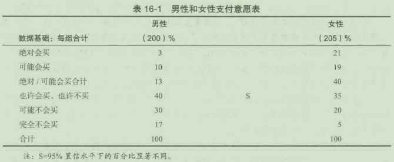

统计检验原理假设这两个需要检验的百分比来自于相同的人群－他们没有不同。而且，还假设男女的支付意愿相同。检验规则同时还假定两个数据之间不相关，也就是说两个待检验的百分比可能是任意的，0~100%都有可能。不同的约束方法可能改变统计检验的结果。

正确的检验方式是选择一个关键的数据去总结那些回复，并检验该数据。在表16-中，检验的是最上层的两个数据－前两个百分比之和("绝对会买“加上“可能会买")。在男性分组里面，这一数据可能是任何值，现在刚好是13%;在女性分组里面，它也可能是任意值，现在的结果是40%。每个分组中的数值都可能是0~100%中的任意一个，选取该百分比进行显著性检验符合检验规则。统计检验的结果拒绝它们来源于同一地方（或它们相同）的假设，因此我们就能说它们“在95%的置信水平下存在显著的统计性差异”

然而．在实践中经常会发生一些不同的情况。因为整理调查数据的计算机程序并不知道哪些合计数据是重要的，所以检验它们全部。在计算机程序整理的表格中可以看到像表16-2那样的整理结果。

表16- 2男性和女性支付意愿表

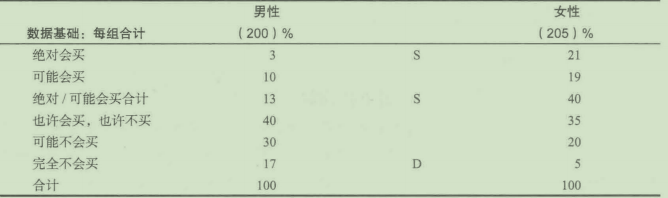

如果事先就选择了前两个表格的合计百分比进行检验，并且只检验了这一数据，那这个自动检验是很有效的。它进行了应有的工作，并显示13%与40%不同，而其他的统计检验结果被自动忽略了。但是，如果数据按照表16-2的方式进行检验，就会产生一个问题。

男性分组的百分比之和是100%,如果某些百分比已经被检验，就相当于在原有样本中将它们剔除，剩下的数据就不再是任意的了，它们加起来必须等于100%减去巳检验的百分数。男性分组剩下的数据在0~87%,但不可能更高，因为有13%已经“用完了＂。相似地，女性分组剩下的数据只在O~60%。当你看到其他行或每一行的检验结果时，你所使用的置信水平和你认为你在使用的就不同了一它发生了变化。

在统计上，如果有人说表16-2中“绝对会买”和“绝对I可能会买＂栏的百分比都在95%的置信水平下显著不同，这可能是错误的。对其中一项来说这是对的，但另一项的置信水平是未知的，很可能远低于95%。

统计检验非常有用。每个检验结果都对有关数据关系的特定问题做出了回答。对回复的百分比问题，人们最想了解的问题之一就是两个数字之间是否存在显著性差异。如果两个数字是有用的，并采用了合适的方法检验，那很容易回答相应的问题，但如果两个数字不符合检验假设或采用的检验方法不合适，就有可能误导决策者。

问题：

1. 为什么说统计检验原理与日常思维完全不同？请解释。

2. 对于回复的百分比问题，我们一般希望统计检验能回答什么问题？

## 16. 3假设检验

假设(hypothesis)可以被定义为：调研人员或管理者对被调研总体的某项特征所做出的一种假定或猜想。营销人员常常面临这样的间题，即调研结果与标准是否有足够大的差别，而需要公司对其营销策略的某些方面进行调整和改变。让我们看看以下几种情形：

- 一项跟踪调研的结果表明，顾客对产品的了解程度，比6个月前所做的类似调研中显示的要低。那么，该结果是否明显降低？是否低到需要改变广告策略的程度？
- 一位产品经理认为其产品购买者的平均年龄为35岁。为检验其假设，他进行了一项调查，调研表明购买者平均年龄为38.5岁。调研结果与其观点的差异是否足以说明这名经理的观点是不正确的？
- 一家快餐店的营销部长认为她的顾客中60%为女性，40%为男性，对此她进行了一项调研。通过调查她发现，顾客中55%为女性，45%为男性。调查结果与她初始设想的差别是否足以让她得出“原来的假设是错误的＂的结论？所有这些问题都可以通过一定的统计检验来进行评估。在假设检验中，调研人员测定一个关于总体特征的假设是否正确。如果假设确实正确，统计假设检验便可以让我们预测到某项结果出现的概率。

对千某项具体调研结果与其初始假设值之间的差分，有两种主要的解释：假设是正确的，差分很可能是由抽样误差造成的；或者，假设是错误的，真正的数值是另外一个值。

### 16. 3. 1假设检验的步骤

检验假设一般有五个步骤：
*陈述假设；
*选择适当的统计方法来检验假设；
*明确判定标准，并作为决定拒绝或不拒绝(FTR)原假设（虚无假设）凡的基础（请注意，我们不说“拒绝H。或接受H。"'尽管这看似是很细微的区别，但却很重要。我们将在后面的内容中详细讨论两者的区别；
*计算统计检验值并进行检验；
*从初始调研问题的角度陈述结论。

步骤1:陈述假设

假设主要用两种形式表示：原假设H。和备择假设H.。原假设H。(nullhypothesis,有时也叫零假设）在检验时和备择假设H.(有时也叫调研关注假设）是相对的。例如，汉堡城快餐店的经理认为，他的操作程序能保证顾客在免下车窗口前只需排队等待2分钟。他在随机时段对随机选择的店面中，对1000名顾客进行观察调研。结果发现，被观察的顾客的平均等待时间为2.4分钟。原假设和备择假设将表示如下：

- 原假设H。：平均等待时间=2分钟。

- 备择假设H.:平均等待时间#-2分钟。

注意：原假设和备择假设的陈述方式应可保证两个假设不能同时为真的情况。这样做的原则是，要利用可用的证据来判别哪一个假设更有可能为真。

步骤2:选择适当的统计检验方法来检验假设

正如你将在本章后面了解到的，分析人员必须根据调查情况的特征来选择适当的统计检验方法。本章将讨论几种不同的统计检验方法及它们适用情况。表16-3为在不同情况下选择适当的检验方法提供了一定的指导。所有在表格中提及的检验方法都将在本章后面的内容中得到详细的阐述。接下来的“市场调研实践16-2"将阐述相关间题。

表16- 3统计检验方法及其用途

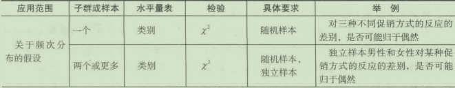
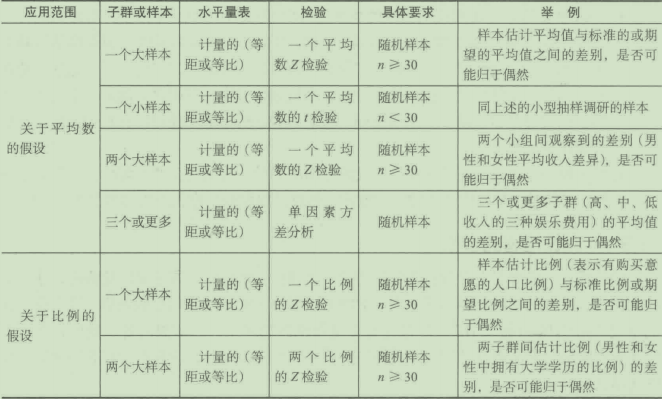

选择合适的检验方法

调研人员如何选择适当的统计检验软件和方法对市场调研数据进行制表检验呢？以下三个是帮助你进行选择的基本准则：

- 区分检验两组数据还是三组及三组以上数据。
- 区分检验百分比还是平均数。
- 区分检验匹配样本还是独立样本。

检验独立样本的百分比数据，若分组大于或等于三个，则使用卡方检验；若分组为两个，则使用Z检验。检验平均数数据，若分组大于等于三个，则使用方差分析(ANOVA);若分组为两个，则使用t检验。可以参考附表：

尽管分析软件能快速处理调研数据，调研人员在使用时也一定要注意使用方法。在分析软件的安装包里有一些预置程序会自动进行相同的检验，在检验多组数据时常常违背上述的第一条准则。另外，在检验验百分比数据时，很多软件工具常常重复运用Z检验而不是使用卡方检验；在检验平均数时，常常重复运用t检验而不是使用方差分析。

根据统计原理，以上述这些错误的方式进行检验通常都会导致所使用的置信水平低于你认为在使用的数值。例如，在比较三个分组的百分比数据时，卡方检验是同时比较三个分组的数据来决定它们在统计上是否存在显著差异的。而Z检验则是运行三次独立的检验，将分组两两分别进行比较，最终可能产生不同的结果。卡方检验的结果可能是三组间存在显著的统计差异，而Z检验的结果可能是组间不存在显著的统计差异或者只在某些组别间存在显著的统计差异。

本质上的不同在干，卡方检验同时考虑所有的数据，而Z检验只是对部分数据进行多次检验。大多数情况下，使用错误的检验方式可能不会给管理者的市场调研带来严重的误导，但很可能严重减弱数据的可靠性。调研人员只要认真选择处理方式和处理程序，很容易就能避免这一错误，控制数据质量。

问题：

1. 除了文中提到了分析软件预翌程序以外，你还能想到哪些可能导致调研人员使用错误方法检验的程序性因素？

2. 如果你有办法使用分析软件，试着用Z检验和卡方检验两种方法检验相同的数据（你也可以使用本书中曾出现的数据）然后对比两种检验结果。它们差别大吗？如果它们的处理结果不同，你知道其中的原因吗？

步骤3:明确判定标准

从前面关千样本均值的讨论中可以发现，抽样调查结果与总体参数完全相等的情况几乎是不可能发生的。关键问题是要确定，如果统计假设是正确的话，实际样本均值和基千假设所得出的期望值均值之间的差分或偏差是由偶然因素引起的吗（例如，100次内发生5次）？这就需要一个判定标准(decisionrule)或规则，来决定拒绝或不拒绝原假设。统计学家用“显著水平”来描述这种判定标准。

显著水平(a.)在原假设和备择假设的选择过程中至关重要。它被认为以很低的概率来判定原假设的可接受性，如0.10、0.05或0.01。

假设我们现在决定检验一项显著水平为0.05的假设。也就是说，如果检验结果反映的观察值（比如抽样均值与期望值之间的差值），只有低于5%的可能是由随机误差或抽样误差而引起的，那么我们将拒绝原假设。拒绝原假设就等千接受备择假设。

步骤4:计算统计检验值

这一步骤的工作有：

- 运用适当的公式来计算统计检验值；
- 对当前的计算值与基于所选择的判定标准对应的统计临界值进行比较（临界值可从对应的表格中查得）。
- 通过比较，得出是否拒绝原假设凡的结论。

步骤5:陈述结论

从初始研究问题的角度陈述结论，以总结检验结果。

### 16. 3. 2假设检验中的错误类型

假设检验中易犯两种类型的错误，一般称为I型错误和II型错误。

I型错误(typeIerror)是指，调研人员拒绝了原假设，而实际上它是正确的，即拒绝正确。调研人员之所以会得出这种不正确的结论，也许是因为样本与总体值之间的差分是由抽样误差造成的。调研人员必须决定在多大程度上容忍I型错误的存在。0.水平正是表示容忍I型错误出现的概率。相反地，1-o.表示的是得出正确结论的概率，即在原假设为正确的情况下，不拒绝原假设的概率。

II型错误(typeIle订or)是指，原假设错误，而调研人员却没有拒绝它，即接受错误。Il型错误被认为是P错误。1-/J的值，反映了在原假设错误的情况下，决策者能够做出正确的决定，即拒绝该假设的概率。表16-4总结f假设检验判断中的四种可能的清况。

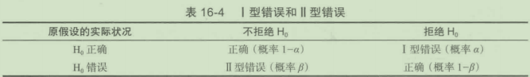

在进行各种假设检验的时候，都要牢记一件事悄：不管是做出拒绝还是不拒绝原假设的决定，都不可能是100%确定的。我们的结论可能是正确的，也可能是不正确的。前面曾提到，a值的水平是由调研人员自己规定的，但这种说法似乎不够准确。实际上，调研人员必须与客户商讨，考虑到项目中可获得的资源，并思考I型错误或II型错误的意义。

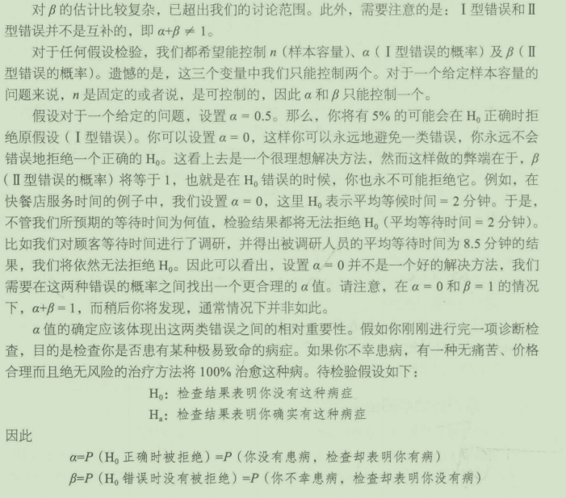

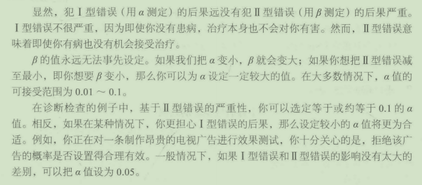

### 16. 3. 3接受H。或不拒绝H。

调查人员经常不能对接受H。和不拒绝H。做出区分。实际上，正如本章前面所述，这两个决定之间存在重要差别。检验一个假设时，在H。没有被证明有可能是错误的之前，我们一般假定它是正确的。在任何假设检验的情况下，唯一可以被接受的假设是备择假设H.。也许会有充分的证据支持H.(拒绝H。)，也可能没有（不拒绝H。)，而真正的问题是，在数据中是否有足够的证据证明凡是正确的。如果我们不拒绝H。，这只说明现有数据无法对H.提供足够的支持，并不是说我们接受了H。。

### 16. 3. 4单尾检验和双尾检验

检验分为单尾检验和双尾检验两种，具体选用哪一种检验取决于间题的性质及所要证明的内容。例如，一家快餐店的质量控制部要对刚从一个供应商手中收到的一批鸡胸肉进行检测，并需要测定脂肪含量是否符合标准，这时采用单尾检验比较合适。如果没有达到最低标准，这批鸡胸肉将被打回。此外，肉类供应方的经理则应该进行双尾检验以测定两个因素。首先，在装运之前，他们必须保证产品达到顾客的最低要求；其次，他们还希望能测定产品是否超过了标准要求，因为生产超过标准的产品将带来高昂的成本。如果他们一直提供超出合同中规定的质盟水平的产品，无疑将会增加不必要的成本。

需要双尾检验的经典例子是对电路保险丝的检验。保险丝在达到预定的温度时必须松脱或断开，否则将会引起火灾。此外，你当然不希望它在达到预定的温度前断掉，否则将会带来不必要的断电。因此，质量控制过程的检验必须是双尾的。

### 16. 3. 5统计检验操作实例

雷克萨斯北美(LNA)正在对核心市场之一一一南加利福尼亚州市场进行销售预测。它们认为收入是影响豪华房车销售的一个重要因素，于是它们查阅美国人口普查资料，了解到该市场内家庭平均年收入为55347美元。此外，LNA在该市场内随机抽出250个家庭进行调查，以收集一些官方资料中不存在的，而对销售预测却非常重要的数据。结果显示，受访家庭的平均年收入为54323美元。市场内家庭的总体平均数(tt)的实际值还是未知数。在人口普查结果及此项调查结果中，我们得到μ的两个估计值。这两个估计值之间的差分将对根据LNA的预测模型计冥得出的销量估计值结果有着显著的影响。通过计算，我们发现人口普查资料中提供的估计值是μ的最优估计值。

关千显著性检验的建议

保罗·施米格，DSS调研营销科学部

在进行定量的市场调研工作时，你要花费大量的时间进行测量和对比，但与用确定的衡量标准测量某一物理量不同的是，你的测量会有样本误差（样本误差属于技术层面，并不代表一种错误）那么，当你对比两个测量结果时，由于两者皆存在样本误差，你不可能100%保证它们之间存在差异。但是，在统计上你能说：“虽然没有100%的把握，但可以检验我们在95%或90%的置信水平下差异是否存在口”

进行比较的目的是为了引导你像数据的＂翻译“一样评估数据。”这个差异是否重要，我们是否应当采取一定的行动，我们是否一个继续采取相同的广告策略，以提高品牌无提示认知(unaidedawareness)?"不幸的是，数据统计并不能回答这些问题

记住用统计方法检验差异和评价给定差异的内涵及联系的区别很重要。市场调研中最常见的检验方法是双样本的t检验。调研业界内有这样一个经典问题：“上一年我们的品牌在受访者中的无提示知晓度为43.2%,今年这一比例攀升到47.5%那么，两者的差异是否显著呢？”这种类型的问题相当常见，甚至于在你整个职业生涯中都可能见不到其他类型的检验。鉴于两个样本t检验的极端重要性，我们有必要至少牢记以下两点：

．两个样本的t检验是双尾检验，关注”是否存在显著的差异”而非"A是否显著大于／小于B"。因此，当有显著差异存在时，我们可以说，“存在统计上显著的差异，而且该差异比观察值更高（低）”。

．两个样本的t检验适用于样本方差相等的情况。由于我们不知道总样本的标准差，因此要联合两个样本的标准差来进行计算，得出相当于其加权平均数的数值。在学术研究中，你可以先检验两个样本的方差是否相等，但在商业世界中则基本上不需要这样做。

对于任何给定的差分，都能找到足够大的样本容量，使得该差分在两个样本的t检验中显著（样本容量作为等式中的分母）。我们也可以从另一角度来考虑：随着样本变得越来越大，即使是很小的差分都能在两个样本的t检验中变得统计显著，然而它的实用显著性却维持不变。0.5%的增长在统计上也许是显著的，但它的实用意义是否值得管理层予以关注呢？估计不值得吧。

最后，一定要记住统计上的显著性和直观上的显著性、重要性是不同的。在其技术意义的核心，统计学上的差异意味着比样本误差更大的差异。不要误用了统计检验，一个仅就数据分析而言非常有用的工具。

为评估人口普查估计值，LNA决定用统计方法将其与调研结果进行对比，相关的样本

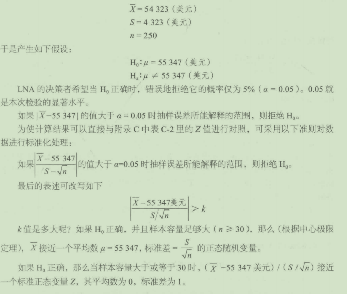
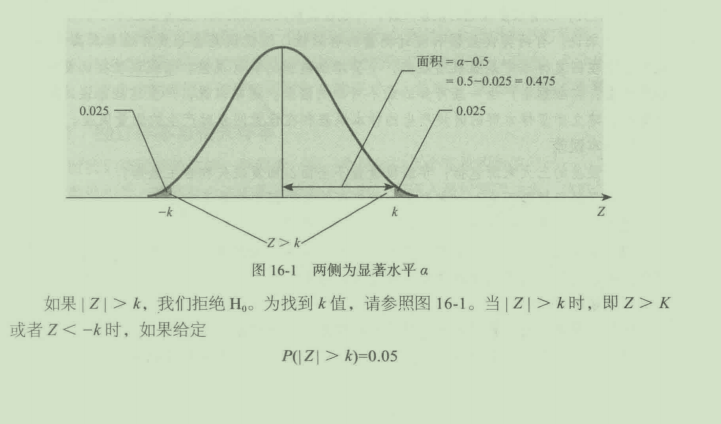

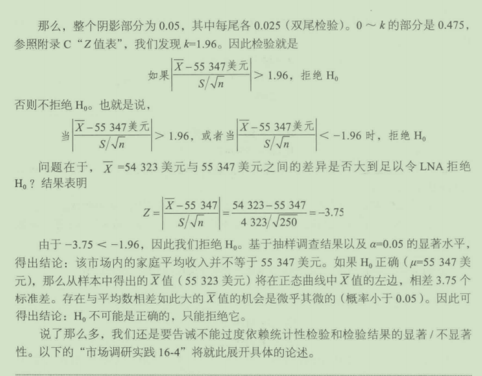

统计的精确度能够带来有效的结果吗

统计检验的结果可能是不可靠的。统计上的显著性不一定就意味着实际上的显著性。除了样本容量过大，还有很多其他的误差来源，可能在调研人员甄别统计显著性差异时带来困扰。

一般来说，有两类误差影响统计测量的有效性。随机误差会导致方差与真实值不符，但由于它在回复样本中是随机出现的，不会增加数据的统计误差。系统误差在回复样本中始终存在，在数据中产生一些可知的或不可知的偏差。通常来说，产生这些错误的原因有两类：在建立回复样本群的时候产生的样本误差和在设置问卷时产生的测量误差。

1. 样本误差

样本误差的三大来源包括：年龄段覆盖不全面、回复缺失和自主选择。

(1)年龄段覆盖不全一来自某一特定年龄段的回复数量不充分。

(2)回复缺失——培衫〉人群不愿意参与调研项目。

(3)自主选择一受访者在调查过程中可以自主选择结束访问。例如，参与者在网络平台接受访问时可能感到无聊并在调查结束前退出。

2. 测量误差

以下六种类型的测量误差可能导致随机误差和系统误差。

(1)问题解释一受访者对一些迷糊的或模棱两可的问题有不同的解读。

(2)受访者个人观念一不管问题是如何表述的，受访者都会带有个人的观念，任何外部因素的改变也会影响他们对问题的理解。

(3)问题次序-在一份问卷的不同地方提问相同的问题，受访者也可能做出不一样的回复，因为他们的想法会受周围题目的影响。

(4)调查方法不同一调研人员必须注意到，采用不同的方式进行调查也可能会导致一些错误。

(5)调查性质表述一描述调查性质的不同方式也可能导致受访者做出不同的回复。

(6)省略重要问题一系统误差最常见的来源就是在一连串问题中关键变量的回复不够，缺少变量对数据分析结果的影响很大。

管理意义

调研人员必须认真区别不可避免的随机误差和系统误差。而且，必须认识到统计精度不足以表明差异是可用的或有意义的。调研人员要做的不是专注于显著性检验本身，而是甄别那些具有管理意义的结果一即与决策过程相关的结果。假设有一个充分大的样本，任何零假设都可能被拒绝，任意两个不相等的均值都可能被检验出具有统计性差异。两个不存在统计性差异的“不同＂的群体间也可能存在统计意义上的联系。因此，统计检验应当被当作工具使用，以寻找有实际意义的内容，而不是去定义它。

问题：

1. 上面提到了很多可能导致误差的原因，你认为哪个最容易识别，哪个最难？说明你的理由。

2. 你是否能想到什么办法帮助调研人员决定检验结果中出现的统计性差异是否具有管理意义？

## 16. 4常用的统计检验方法

接下来，我们将介绍多种常用的差分统计检验方法。尽管除此以外，还有很多其他的统计检验方法也得到了发展和应用，但对它们进行全面讨论会超出本书的范围。

为对那些被计算并制表的数据进行比较，我们将采用Z分布、t分布、F分布及f分布等分布。这些分布的表值可通过查阅附录C的表C-2、表C-3、表C-4和表C-5来获得。

### 16. 4. 1独立样本与相关样本

有时我们需要检验这样一种假设：即一个总体中某个变量的数值与另一个总体中同一变量的数值相等。在选择合适的统计检验方法时，调研人员就需要注意：这些样本之间是相互独立的还是相关的。独立样本(independentsamples)是指，对一个样本内某变量的测定，不会影响到对另一样本内同一变量的测定结果。只要对一个总体中某变量的测定不会影响到另一个总体中同一变量的测定结果，就不需要进行两次调查。在相关样本(relatedsamples)中，对一个样本中某变量的测定会影响另一样本中同一变量的测定结果。

例如，在一项关千外出就餐频次的调研中，如果分别对男性和女性进行采访，一个男人的回答绝没有可能会影响或改变一个女人对同一条调研间题的答复，这就是关千独立样本的一个例子。另一方面，假如调研人员需要测定一项新的广告活动对消费者品牌知晓度的影响，而在推出新活动前，随机抽取消费者样本并进行调研；而且在新活动推出90天后，再对同一批样本进行调研。这些样本并不是相互独立的，因为90天以后的调研结果受到第一次调研的影响。

### 16. 4. 2自由度

许多统计检验都要求调研人员指明自由度，以便从统计表中找出统计检验的临界值。自由度(degreeoffreedom)是一个统计问题中可以不被约束或自由变化的观测值的数目。

自由度(d.f.)的数目等千被观测单位数减去计算统计量所必需的假设或约束条件的数目。例如，5个数相加，巳知其平均数为20。这种情况下，5个数字中只有4个可以随意变化，因为一旦4个数字巳知，最后一个数值也就知道了（可以计算出来），因为巳知平均数必须是20。假设我们知道5个数中的4个分别为14、23、24和18,那么第五个数一定是21,这样平均数才为20。因此，我们可以说这个样本有4个（或n-I个）自由度。这样做就像是样本中少了一个观测值一样，（就是说样本比被测个体少1)。在计算中包含自巾度可以更好地反映事实。

## 16. 5拟合优度

### 16. 5. 1 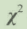 检验

正如前文提到的一样，调查收集到的数据经常用单向频次和交叉表分析法。交叉表分析法的目的是研究不同变量间的关系。问题是，实际的回答是否与期望值相同呢？例如，我们通常将用户按性别（男性、女性）、年龄（小千18岁、18~35岁、大千35岁）或收入水平（低、中、高）来进行分组，然后再结合品牌偏好或使用水平等制作交叉表格。卡方<I)检验(chi-square,I)能帮助调研人员确定观测到的频次形态是否与期望的一致，可检验观测到的分布与期望分布之间的拟合优度。我们将描述这项技术在检验单个样本和两个独立样本的交叉类别数据分布方面的应用。接下来的“市场调研实践16-5"介绍了I检验的一个运用案例。

市场调研实践16- 5

检验运用案例

自从1786年美国第一个高尔夫球场在查尔斯顿开发以来，高尔夫就在南卡罗莱纳州的经济中扮演重要角色，络绎不绝的高尔夫爱好者在2007年为南卡莱罗纳州创造了高达27.2亿美元的经济效益。

高尔夫运动及其相关旅游产业对该地区独特的重要性让我们有机会了解该区域的一项营销计划一一－莫尔特比奇高尔夫通行证计划对当地游客和高尔夫爱好者的影响。

该项计划让符合条件的居民以及在该地区有别居的人士能够全年享受高尔夫费用折扣。自1993年实施以来，受到广泛好评，如今已有超过10000名成员，每年的更新率达到75%。

复制成功

为了复制该成功经验，调研人员进行了一项市场调研，以确定该通行证应该仅包含高尔夫费用折扣还是应该扩展到其他如景点、餐厅和零售点的高尔夫旅游项目中。

通行证计划组同意支持该项调研，并协助整理了与通行证计划密切相关的一些营销项目，包括景点、餐厅和零售商店。具体如下：

景点：调查选取了莫尔特比奇地区10个具有代表性的旅游景点，这些景点吸引的人群既有成年人也有小孩。

餐厅类型：调研选取了莫尔特比奇的一些典型餐厅。

零售商店：调研选取的10家零售商店既包含专售高尔夫特色产品的，也包含一般类型的。

调查问卷采用几种不同的列表形式，通过电子邮件发送给受访者。除了各种与人口特征有关的问题，参与者被问及这些问题：他们是偶尔来游玩还是季节性游客？他们是部分时间在该地区居住还是长久居住？然后，他们将被划分为游客和居民两个类别。对于问卷上的每个景点、餐厅类型和零售商店，参与者都将回复他们是从不、很少、有时还是总是参观它们。

最终，调查收到了529份居民回复和199份游客回复，合计728份容量的样本。然后对这些数据进行了差分统计检验，检验居民和游客间的差异。

整体统计结果：整体上，总是参观某景点的人很少，从MyrtleWaves的1.2%到CarolinaOpry的8.5%。不同的是，总是参观餐厅的比率跨度较大，从主题餐厅的2.3%到牛排餐厅的33.7%。而对于零售商店，该比率从老式高尔夫专卖店的1%到马丁高尔夫球协超市(Martin'sPGASuperstore)的57.2%。

景点：下面列出的是6处景点及f检验的P值：AlabamaTheater(P<0.0001)、CarolinaOpry(P<0.0001)、DixieStampede(P<0.002)、LegendsinConcert(P<0.0001)、MedievalTimes(P<0.0001)、Ripley'sAquarium(P<0.003)。

在任何情况下，居民参观这些景点的意愿显著高于游客。然而，拥有通行证的成员有时或总是参观任意景点的比例很低，不同景点为10.7%~39.0%,平均下来也只有19.8%。由于大部分拥有通行证的游客参观各景点的意愿不高，在考虑价格折扣计划时就不优先考虑景点。即使是居民，有时或总是参观任意景点的比例也高不了多少，不同景点为9.9%~43.9%,平均下来也只有26.1%。

餐厅类型：下面列出的是两种类型餐厅及其f检验的P值：意式餐厅(P<0.002)、海鲜餐厅(P<0.008)。

大部分拥有通行证的成员有时或总是参观下列餐厅的比例很高：牛排餐厅79.2%,海鲜餐厅77.8%,意式餐厅68.0%,体育酒吧51.1%。

虽然居民和游客参观牛排餐厅的比率没有显著的统计性差异，但拥有通行证成员有时或总是参观牛排餐厅的比率高达83.6%,是餐厅类型中最高的。

零售商店：下面列出的是五家零售商店及其卡方检验的P值：CoastalGrandMall(P<0.0001)、ColonialMall(P<0.04)、GolfDimensionsSuperstore(P<0.044)、InletSquareMall(P<0.0001)、MacFrugal'sGolf(Murrellslnlet)(P<0.034)。

大部分拥有通行证的成员有时或总是参观零售商店的比例很高。

最常被访问的零售商店不是高尔夫特色商店就是综合零售中心，

建议

该调查的结果被发表在莫尔特比奇地区高尔夫球场业主协会(MyrtleBeachAreaGolfCourseOwnersAssociation)的一次业主会议上，并提出了如下建议：

．通行证折扣计划可能包含的三个方面以潜在价值降序排列为：购物、餐厅和景点。

．既然通行证拥有者无论是居民还是游客有时或总是参观景点的比率都不高，就不建议将景点纳入折扣计划。景点吸引力不足就无法从该项目获利。

．强烈建议将牛排餐厅和海鲜餐厅纳入折扣计划，无论通行证持有老是居民还是游客。该建议的依据是居民和游客回复有时或总是参观这两种类型餐厅的比率都很高。

虽然调查组也建议将零售商店纳入折扣计划，但仅限于高尔夫用品店。他们采取了这一建议并在大部分专卖店对拥有通行证的顾客进行10%价格折扣：GolfDimensions(9折）、CallawayPerformanceCenter(9折）。

效益提高

所有者网站myrtlebeachgolfpassport.com上同步采取了这些特殊的折扣。采取折扣计划以来，该网站上81家球场的效益都提高了。如果能找到更多合作者，该折扣计划还可能包含更多的餐厅和高尔夫产品零售店。

问题：

1. 在这个案例中，调研人员从f检验中了解到哪些信息？

2. 调研人员找到了哪些与购物、餐厅和景点潜在价值有关的信息？

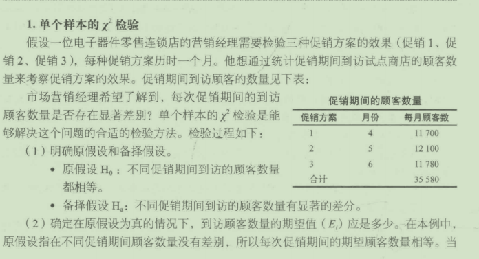
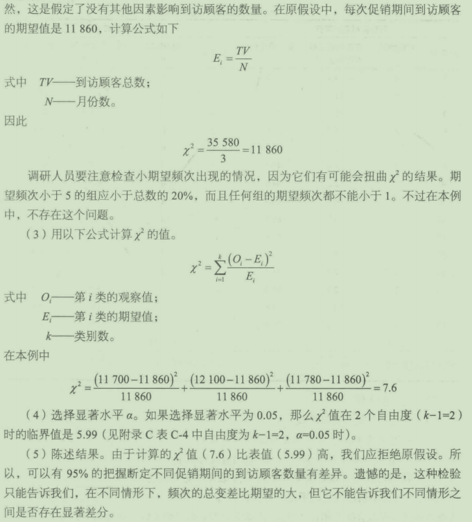
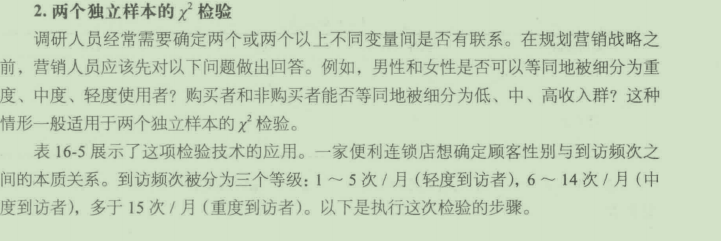
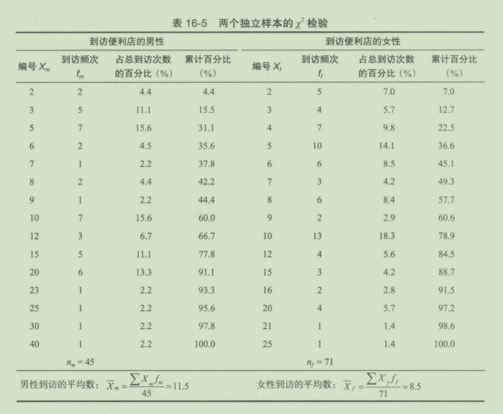
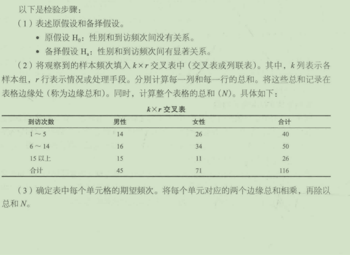
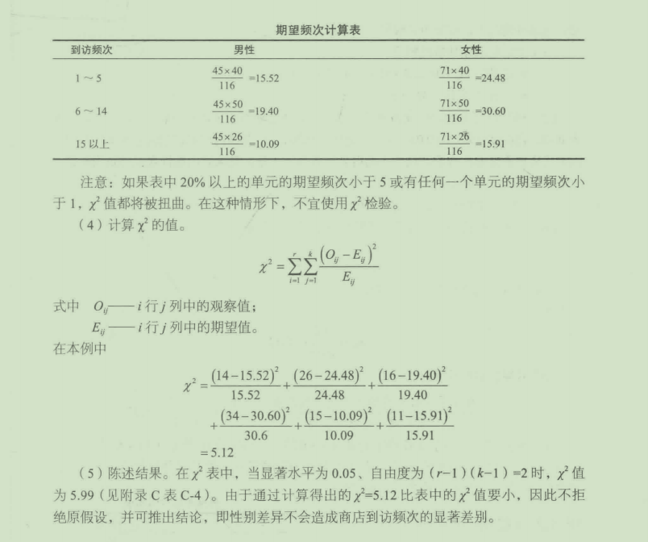

## 16. 6关于一个平均数的假设检验

### 16. 6. 1Z检验
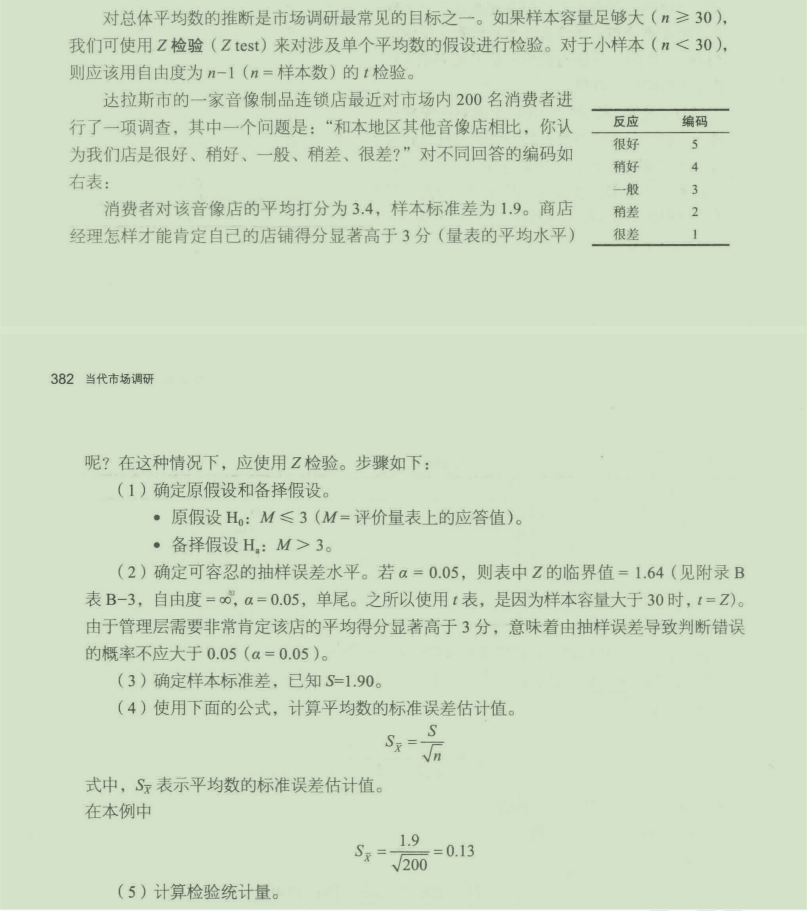

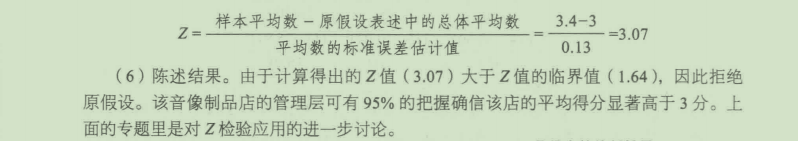

### 16. 6. 2t检验

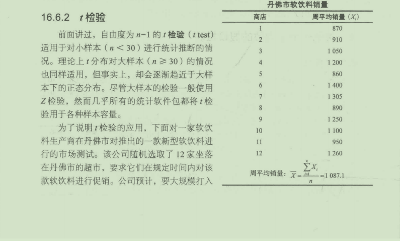

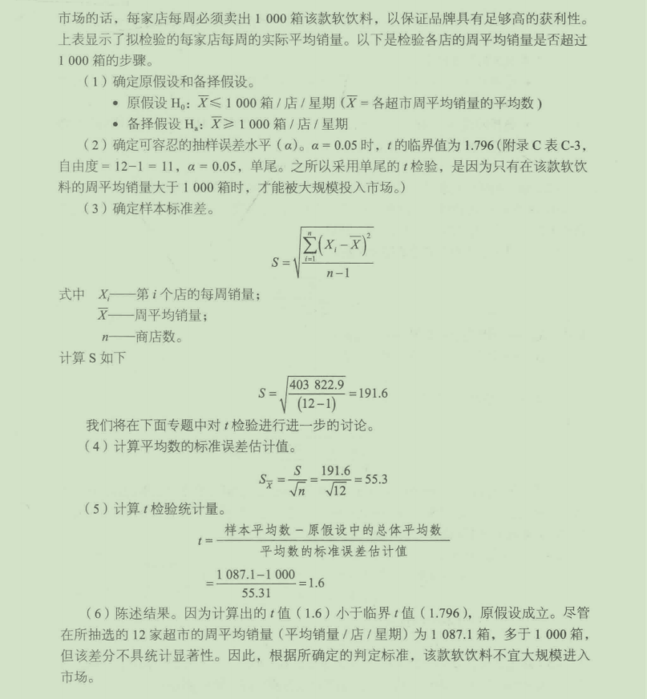

## 16. 7关于两个平均数的假设检验

营销人员往往热衷千检验群体间的差别。接下来，我们将举例说明如何检验两个平均数之间的差分，其中的样本是相互独立的。

在前面提到的便利店例子中，管理层希望了解男性和女性在到访频次的差别。他们相信男性比女性更频繁地造访该店，故从光临该店的消费者中随机抽取I000人，再进行数据收集。假设检验的步骤如下：

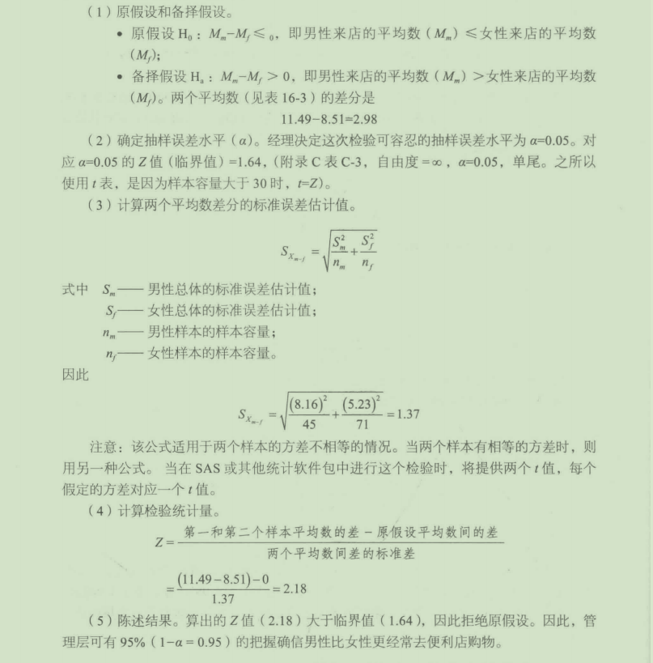

## 16. 8关于比率的假设检验

很多时候，调查人员会遇到采用百分数表达情况的方式。例如，营销人员希望检验偏爱A品牌的比率和偏爱B品牌的比率，又或者是检验品牌忠诚者的比率与非忠诚者的比率。

### 16. 8. 1一个样本的比率检验

一家大银行对500名顾客进行调查，结果表明，愈74%的家庭的年收入高千70000美元。如果事实的确如此，该公司将为这个群体度身打造一套新服务。在开发和推出新套餐之前，管理层想知道，总体中家庭年收入高千70000美元的实际顾客比例是否高千60%。调查结果显示，在被接受调查的银行客户中，74.3%的顾客的家庭年收入高于70000美元。以下是比率假设检验的步骤：

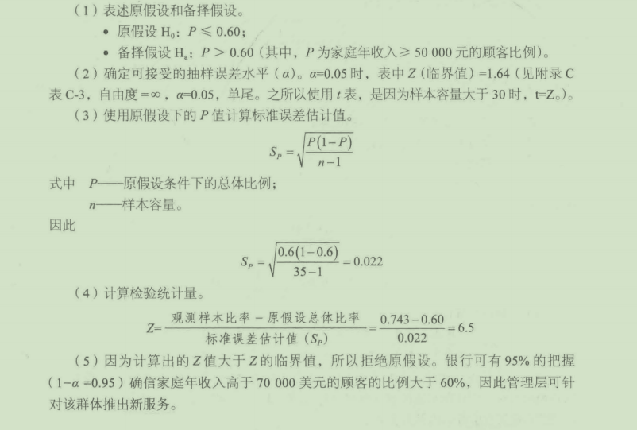

### 16. 8. 2独立样本的两比率间差分的检验

在不少个案中，管理层感兴趣的是两个群体中具有某种行为或特征的人的所占比率的差分。例如，经研究，便利店的管理层有理由相信，每月到访商店~9次（重度到访者）的人中，男性百分比＞女性百分比。以下是假设检验的步骤及要求：

(1)确定原假设和备择假设。

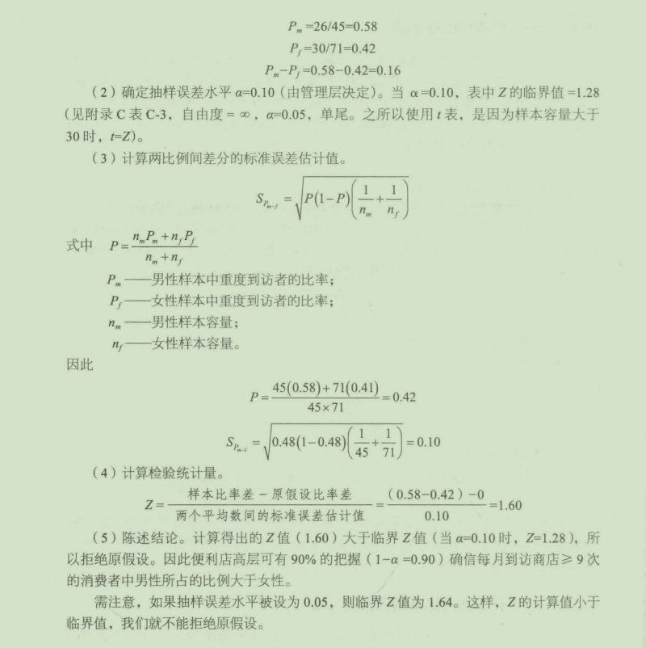

## 16. 9方差分析

方差分析(analysisofvariance,ANOVA)适用于对两个或以上独立样本的平均数的差分所进行的检验。尽管它也可用来对两个平均数进行差分检验，但是它更多的是用于对三个或三个以上独立样本的平均数进行差分检验。方差分析可以用来确定，抽样误差的存在是否使得样本中或样本之间平均数的差异大于预期。

之前论及的Z型和t型检验仅适用千涉及两个样本平均数时的假设检验，当有三个或三个以上样本时，利用这两种方法则缺乏效率。例如，有五个样本及对应的平均数，那么就需10次t检验来对每一对平均数进行检验。更重要的是，当有三个或更多个平均数出现时，使用Z型或t型检验，也增加了出现第一类错误的可能性。原因是每两个平均数组合都必须进行一次检验，平均数越多，需要检验的次数越多，检验结果表现出显著差分的机会就越大。若显著性水平为0.05,则平均每20次检验中就可能出现一次由抽样误差而引起的错判。

单向方差分析经常被用来实验结果的分析。例如，一家制动器连锁店的市场部经理正准备挑选一种服务来进行店内促销：车轮校正、换机油或调整发动机。他想知道这三项服务带来的潜在销量是否存在显著差异。

该店在三个城市中随机选出60家连锁分店（每个城市选20家），每个城市分别促销一项服务，实验期间服务的价格和宣传等方面均维持不变。实验共进行30天，其间各项服务的销售情况均被一一记录。

被测城市的日平均销售额

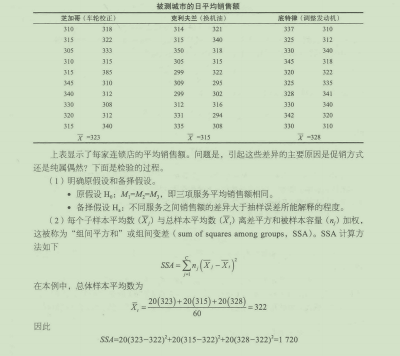

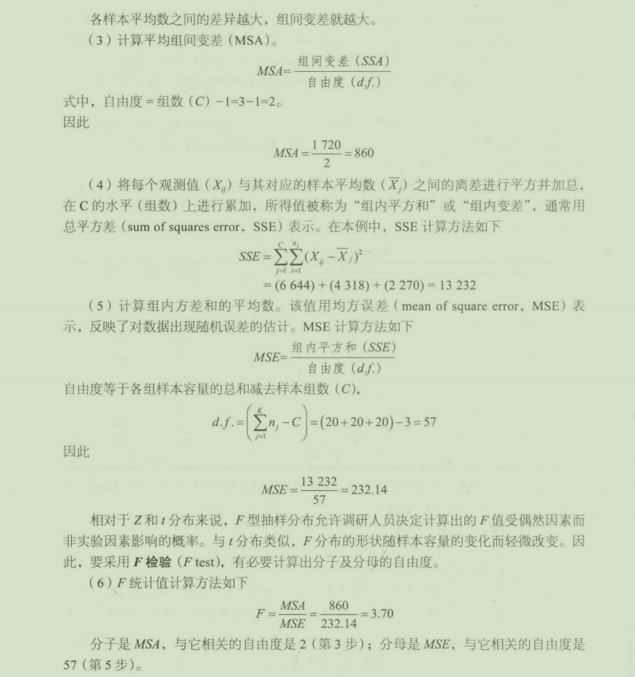

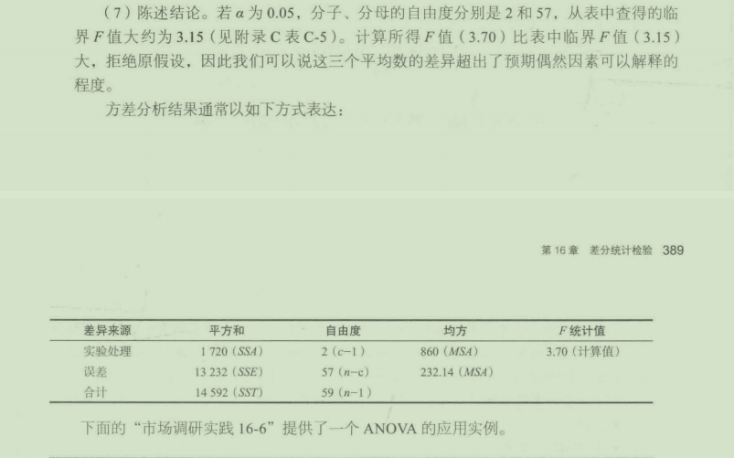

市场调研实践16- 6

12枚硬币、3家商店、2个微生物学家和1个检验--ANOVA

ANOVA,即方差分析，是一项由英国统计学家罗纳A、费雪(RonaldA.Fisher)于1920年发明的统计检验方法。同任职于伯明翰的阿斯通大学的英国微生物学家理查德·阿姆斯特朗(RichardArmstrong)和安东尼·希尔顿(AnthonyHilton)最近发现ANOVA是对复杂数据集进行统计检验的“最合适的方法＇勹在本例中，复杂数据集指的是从屠宰店、书报摊和三明治店收集到的硬币。

研究人员上述的场所中各随机抽取4枚硬币，并对这些硬币进行细菌数量分析。阿姆斯特朗和希尔顿把他们的检验程序描述为“在一个随机试验设计中进行4次重复的单向方差分析＂。考虑到各对象间的差异，该检验程序把这些差异向下划分到各店，甚至是每家店所对应的4枚硬币。尽管如此，这仍只是一个单因素的方差分析实验一唯一的变量是“商店”。

接着他们又进行了一次因子分析来研究一些因素，即抹布的类型（棉布和海绵）和细菌数量转移到食物准备表面前的清洗工作，以及两个变量之间的关系。然后，他们进行了一次更为复杂的ANOVA研究来确定两种细菌在JO个时间间隔的培养皿上生存的如何。ANOVA方法使他们分辨变量间三个因子细微的交互模式（比如表面类型与细菌类别之间细微的交互），细菌数量随着时间的衰减因表面的类型产生差异，并且在相同的情况下其中一种细菌类型比其他类型在数量上衰减的要快。

每个这种调查领域都会产生数据丰富的AVOVA表格和信息，卫生检查员肯定能够发现现实的且及时的益处C研究人员高度称赞ANOVA技术，称为应用微生物学的“有力调查方法”．这是因为它能够突出单个因素的作用以及他们之间的交互作用。更好的是，在一个研究中结合不同的因素是有效的并且通常能减少复制需要的数量。

问题：
1. 你能为这些微生物学家设计出一个四因素的ANOVA检验法吗？

2. 这两名微生物学家把他们不同的ANOVA检验法应用到与食品供应有关的商店中。你觉得该如何把这种检验方法应用到牙医诊所中呢？

## 16. 10p值及显著性检验

在本音讨论的各种检验中．我们先设立标准，即显著性水平和相应统计星的临界值．然后再将其与计算所得统计量值进行比较。如果计算所得的统计星超过临界侦，那么就称被检验的结果在该水平上具有统计显著性。

然而，这种方法未说明计算所得统计量由千偶然因素引起的确切概率。计算这种概率所需的计算过程冗长，因此一般用电脑来处理，这种概率通常被称为p值。p值(pvalue)是指根据计算所得的统计量而能够满足统计（而非管理意义的）显著性要求的水平。

你可以在许多电脑统计软件包输出结果中看到如下符号：

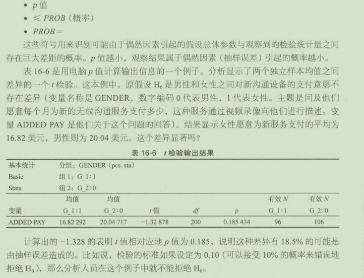

## 本章小结

做出统计推断的目的在于把样本结果推广为总体特征。与差分相关的三个概念是：数学差分、管理意义上重要的差分和统计显著性。

假设是研究人员或管理者对一些需调研的总体特征做出的假定或设想。研究人员通过检验可以推断出与总体特征有关的假设是否有效。通过统计假设检验，研究人员可以计算出涉及观察值特征的概率以及得出假设结果是否为真的结论。在假设检验中，第一步应使假设具体化，然后选择合适的统计工具来检验假设，之后设定是否拒绝假设的标准。假设检验要受制于两种类型的错误，I型错误(a错误）出现在假设正确时，11型错误(/3错误）则出现在假设错误时。最后，计算统计量的值，并提出概括检验结果的结论。

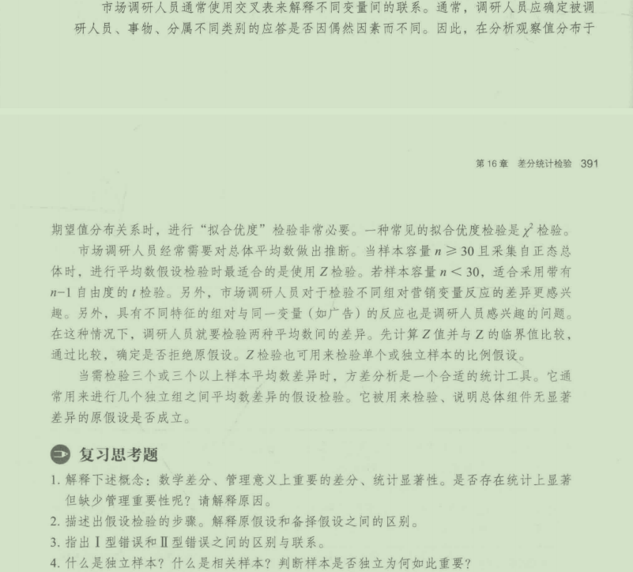

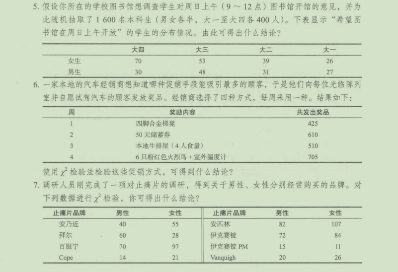

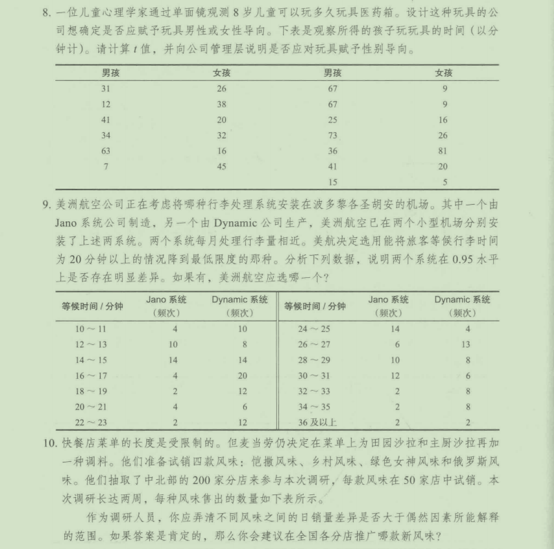

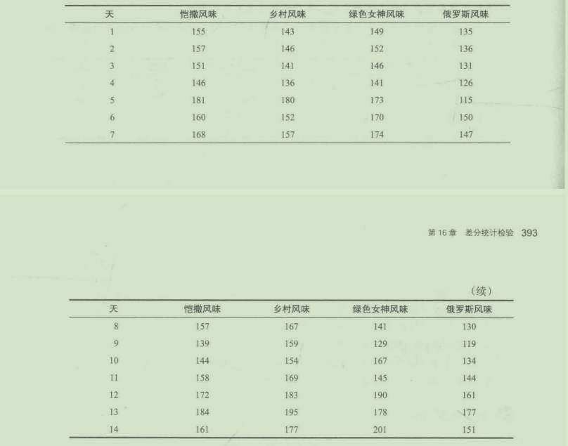

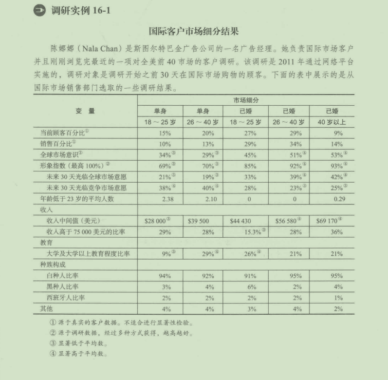

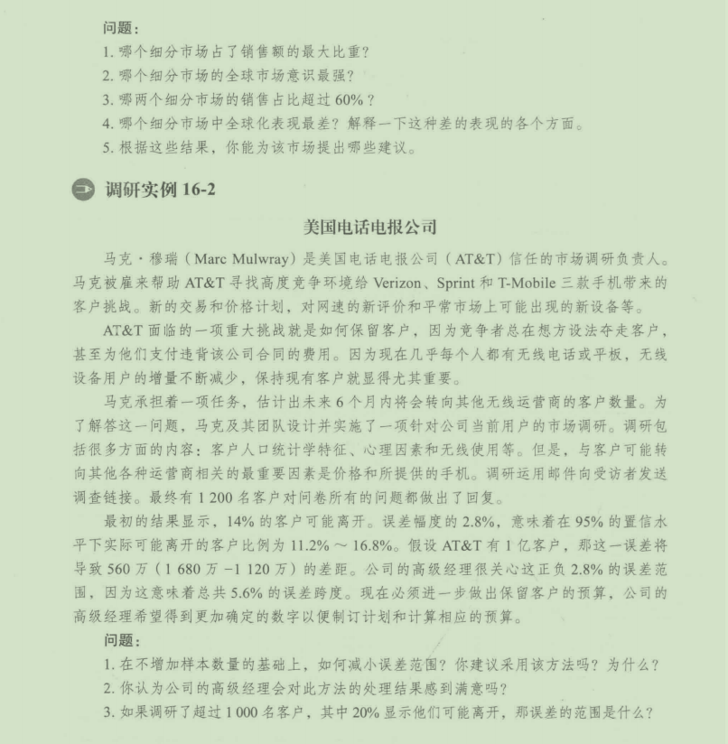

