# 第18章 多变量数据分析

## 学习目标

1. 定义多变量数据
2. 了解多变量分析软件
3. 描述多元判别分析
4. 理解聚类分析
5. 理解因子分析

## 18. 1多变量分析

计算机软硬件的发展为在市场调研数据分析中使用很多高级统计方法提供了基础。这些发展也使得方便地分析大量且复杂的数据成为可能。特别地，多元变僵分析方法在数据分析变革中巳引起特别的关注。在“市场调研实践18- 1"中将介绍人才市场对拥有和关技能的人的高度需求。

多变量分析(multivariateanalysis)这一术语是指同时对所研究的每个个人或对象的多蜇测量维度进行分析。某些专家认为，凡是多千两个变量的联立数据分析就叫多元变批分析。多元变煜分析方法是前面盎节中讨论过的一元变鼠和二元变量统计方法的延伸。

多元变阻分析技术很多，本章将讨论其中的五种：

- 多元回归分析；
- 多元判别分析；
- 聚类分析；
- 因子分析；
- 联合分析。

市场调研实践18- 1

数据科学家：21世纪最流行的工作

由于全世界公司数据库的高速增长，多年来市场对统计学家的需求都很高口然而，不断增加的社交媒体和移动终端带来大量的信息流是传统的数据存储和数据分析方法所不能处理的。在2013年5月，独立调查机构SINTEF声称：“在过去两年中，世界上数据的90%都被收集了J互联网公司充斥着待可分类的、有价值的数据。”例如，雅虎、谷歌、脸谱网和eBay公司，不得不需找新的方法捕获和处理每天接收到的大量的信息。这些信息大部分都没有固定的形式，也没有传统数据库那样的结构，因此需要新型的分析师和分析方法。这些新型分析师被称为数据科学家，因为他们要探索着分析大量不同的数据元素，很像工程师或科学家。原来是几MB或几GB的内容和数据，现在是几TB、几PB甚至几EB的数据，包括图像、文本、视频，推特、博客，线上、线下行为和全球定位信息等。

数据科学家的关键任务之一是将这些不太好相互联系的不同数据来源结合起来。除非找到数据的模式或数据间的关系，不然这些原始数据就没有很大的作用。数据科学家需要用最先进的统计工具、开源程序和定制程序操作可得的信息。除了要掌握这些技术手段，他们还必须了解公司潜在的商业模式以区分有效关系和随机模式或巧合关系。而且，他们还需要将这些分散的数据部分整合成一个简洁明了的、具体的故事，以便公司高管能够理解并做出反应。目前大学教育还不能满足市场对这一新角色的需求，因此公司经常训练来自其他计算机、数学、经济学和生物学等学科的员工从事这一工作。性格内向、缺乏社会工作经验的人可能成为很好的数据管理者或分析者，但他们也可能因为缺少与客户或公司其他部门的人的交流技巧而错过一些重要的机会或方法。

例如，谷歌雇用数据科学家不断寻找新的方式将广告投递给最匹配的人群，以最大化广告的影响力和广告收入。如果没有认真分析，大量的数据很可能超出了模型的承载能力，导致数据间强烈的相关性无法被检测出来。然而，随着数据的爆炸性增长，发觉数据间异常的数学关系也很有价值。公司需要能够适当地解释这些异常，因此也需要最好的分析师和交流者。这些技能组合也很适合用来与银行打交道。

问题：

1. 最近你是否发现统计和数据分析披用在了一些你完全没想到的领域？它是如何被使用的？

2. 顶尖的公司发现很多高端的分析师和统计学家都有其他如经济学、数学和计算机的学科背景。你认为这些学科与数据分析有什么联系？

多数学生在初级统计学中已接触过多元回归分析，其他方法较新，他们可能对其了解不多。这些技术的概要性描述如表18- 1所示。

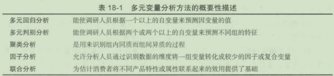

尽管人们对多变诅技术的了解仍然有限，但它们已有数十年的历史，其巳在各种商务统计中得到广泛采用。例如，FairIsaac公司就是围绕多变量技术的商业应用而发展起来的调研公司，其营业额达7000万美元。该公司及其客户发现，这些技术能准确预测谁将按时付账、谁将延迟付账以及谁将赖账。根据这些分析，美国联邦政府用机密方式来识别逃税者。FairIssac公司的成功表明，多变恬分析可以用来预测销售前景。下面的“市场调研实践18- 2"将介绍一系列的多元变揽分析方法()

市场调研实践18- 2

11种数据分析技术

高明的市场调研人员都知道，不同的营销问题适合用不同的分析工具。在众多工具中做出选择，调研人员必须了解每种工具的优缺点。接下来将介绍11种可能用到的工具。

(1)多元回归分析：分析一个数值型因变量和多个数值型自变量关系的分析方法。使用时必须认真考虑正态性、线性和同方差性等假设前提。该方法常用于预测。

(2)逻辑回归：由多个回归组成，用来评估一个二元选择出现的概率，再与预测到或观察到的情况进比较。估计不同人群做出某种选择的可能性，预测在存在替代选择的情况下消费者的行为。

(3)判别分析法：将观察对象根据其特征，分配到各个同性质的组里。要求数值型自变量是高度正态分布的。可以用来对人群进行分类，如购买者和非购买者。两组判别分析与逻辑回归法相似，但后者的假设前提更少。

(4)多元方差分析(MANOVA):将分类自变量与数值型因变量进行对比，考虑多组因变量之间的关系。经常用在实验设计中，但不适用于样本容量大大的情况。

(5)因素分析：在各类相关的变量中提取出一些相互无关的因素，不存在因变量。主要包括普通因素分析和主成分分析。

(6)聚类分析：将大型数据样本对象按照合理的特征进行划分。并非所有的对象都能与定义的分组相匹配。主要的聚类分析法包括分层聚类分析、无分层聚类分析和两者的组合。

(7)多维尺度分析(MOS):使用认知图表将消费者对商品相似度的判断转化为多个维度。该方法常在缺少比较原则的情况下使用，通常要求有观察对象四倍数量的维度。

(8)关联分析：通过对研究对象属性值的维数约化，得到认知图表。当评价大量属性时该方法很有效，因为它不要求个体对每个属性都做出评估。但是，当把自变量和因变量结合起来考虑时，解释起来比较困难。

(9)联合分析：同样因分析市场交易问题得名，衡量与产品或服务相关的特征的值。分析结果可用来预测产品偏好，估计不同方案下的市场需求量。

(10)典型相关分析：将自变量和因变量联系起来分析，可以是数值型自变量或非数值型分类变量。在所有多变量分析中，该方法的限制最少，假设前提也最少。

(11)结构方程模型(SEM):运用多种技术（比如线性结构关系、隐变量分析和验证性因素分析等），同时检验数据集合间的多种关系。SEM可以用来建立或检验反映自变量和一个或多个因变量因果关系的理论模型。


问题：

1. 当你选择一个多变量分析工具时，要考虑什么问题？

2. 你是否在做某个项目时发现选用的多变量分析工具不适用？你因此遇到了什么困难？

## 18. 2多变量分析软件

本章介绍的各类多变矶技术要求的计鍔量是相当大的，因此要进行我们所讨论的分析需要依赖计算机及相关软件。直到20世纪80年代末，本节所涉及的绝大多数多元变景分析都是在大型机或小型机上进行的。因为当时个人计符机的计算速度、内存、存储能力等十分有限，可用的软件也不多，这些限制都成了历史。现在的个人计算机则有能力处理市场调研人员有可能遇到的任何问题，多数典型的间题在几秒钟内就可以得到解决。现在有许多Windows版本的多元变量分析软件，在众多面向Windows系统的多元变批分析软件中. SPSS是众多最为出色软件中的一款，其在专业市场调研领域得到了最为广泛的应用。

这种软件包括数据库创建与管理模块、数据变换与处理模块、图表模块、描述性统计模块和多变蜇分析模块，而且其还拥有简单易用的图形界面。关于SPSS软件的其他信息详见[http://www.spss.com/analysis](http://www.spss.com/analysis)。此外，这个网址还提供了其他一些有用的资料：

- 提供技术支持、产品信息、常见问题、各类下载以及产品回顾信息。

- 提供运用多变量分析解决企业实际问题的成功范例。

- 提供有关数据挖掘与数据仓库应用讨论的内容。

当我们讨论数据分析方法的时候，别忘了我们必须为模型收集数据。这是一项更大的挑战，将在有关银行业的“市场调研实践18- 3"中讨论。当我们涉及大数据的时候，这一挑战就更加明显。我们将介绍如何运用本章中介绍的很多分析技术，但首先我们必须收集奻据并整理成我们能够使用的形式。更多有关的问题将在本章之后的部分讨论。

市场调研实践18-3

掌握数据管理

贾德·夏尔马(CbandanSharma)是Verizon解决方案公司金融服务市场部门的全球董事总经理，他说：“通过数据和分析方法推动客户购买对某些银行来说较为重要，这些机构已经开始重视培养它们自己的数据管理部门。”

“它们高度重视数据管理的作用，并且认识到在公司恰当的地方设置有关数据管理的功能相当重要，”他说，“这样它们就能轻松地以跨企业的视角了解客户。”

以Dokota为基地的西部大银行，苏福尔斯银行(SiouxFalls,拥有90亿美元资产）是完成了有关数据管理系列工作的组织之一，现在它还依靠这项成果创造的平台开发新的用户获取方式，掌握市场主动权。

罗恩·范·赞特(RonVanZanten)是该银行监管数据质量的副总裁，他说：“过去，我们在使用数据分析获取市场和客户的时候，为了保证那些代码可以用于不同的文件和记录而面临的最大挑战就是数据质量。”

范·赞特说，为了解决这个问题，银行从组织内部不同团队挑选人员组成了数据委员会。委员会建立了标准化的规定，这些规定被组织内不同的团队运用在和定价和账户有关的方面。这些规定现在在银行的不同系统中已经被标准化。

通过建立起信任，这项数据管理工作使得银行从职员那里得到了许多数据。范·赞特说：“假设你组织里的员工看到一份报告后声称他的贷款数额不对，并且事实也确实如此的话，那么组织无论做什么都将受到质疑。”他还补充道：“我们现在可以保证我们的数据和据此数据进行的工作是有效的。”

从组织内部获得数据并非易事。范·赞特的团队最近一直致力于集中银行数据库，他说：“有时候让一些部门放弃它们的数据有点勉强。我们从其他数据库里拿到数据源，并把它们输入到我们自己的数据库里。这意味着有些人必须放弃对这些数据的占有，但这其实解放了我们的员工，他们不用再日复一日地做同样的报告。”

拥有了这个设计良好的数据库，银行开始着手吸引更多更优质的客户来扩充资本。该银行的分行过去经常失去一些新用户，但是现在凭借着新的数据管理，银行可以吸引客户，与客户建立更稳定的关系，并且吸引客户购买增值产品。

最近，银行从Experian处购买了人口统计数据来扩充自己的数据库，借此来寻找有潜在利益的客户，并向他们推销产品。

范·赞特说：“我们建立了一个系统，以至于当一个新客户建立新账户时，我们就可以根据类似客户的选择来做出应对。如果客户选择开一张信用卡的话，我们会建议一些直接存款什么的，并吸引他们与我们建立稳定的关系。”

银行也致力于优化它们的产品价格体系，将产品的成本因素考虑在内。他说：“我们考虑到资金的转移成本和操作成本，从账户中直接获得有关费用和收入的信息，然后在存贷差中保证收入。”

西部大银行(GreatWestern)现在能够分配数据给一些特别的客户，比如客户支票账户或小型业务客户，并能完全了解服务那些客户的成本。

## 18. 3多元回归分析

当调研人员的目标是调查两个及两个以上自变量（计量数据）与一个因变量（计量数据）之间的关系时，调研人员使用多元回归分析(multipleregressionanalysis)来进行分析。在某些情形中（后文将要谈到），如果记录的内容为二元变最的话，也可以引入类别变员。

多元回归分析是第17立讨论过的二元回归的延伸，它不仅适合于二维空间的直线观测分析，而且适合千多维空间的观测分析。多元回归所得结果以及相关解释基本与二元回归相似。多元回归分析的一般方程如下

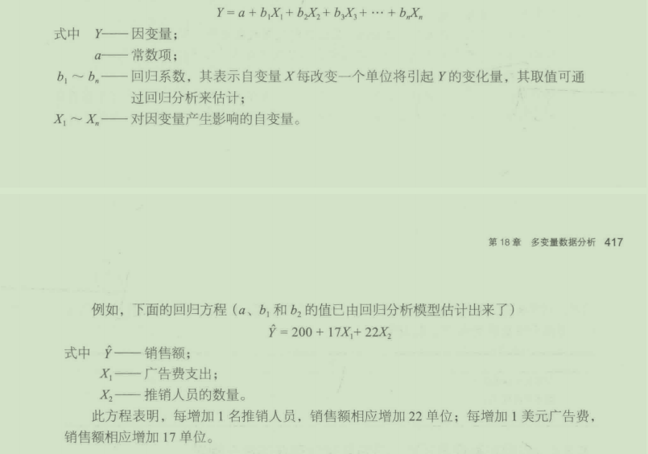

### 18. 3. 1多元回归分析的应用

在市场调研中，多元回归分析的运用主要包括如下几方面：

- 预测各种营销组合变量对销售额或市场份额的影响。
- 预测各种入口统计因素或心理因素与消费者光顾各商场或其他服务场所的频次之间的关系。
- 确定各个因素对总体满意度的影响。
- 确定各种分类变最间的数量关系，如年龄、收入、对产品或服务的态度三个变量之间的关系。
- 确定哪个变量是某一特定产品或服务销售额的预测性变瞿。

上述应用的基本目的可归纳为两大类：O在给出自变量的基础上预测因变益的值；©明确自变量与因变量之间的关系。多元回归可满足其中的任何一类目标，也可同时满足这两类基本目标。

### 18. 3. 2多元回归分析的测量

在二元回归间题的讨论中，判定系数(coefficientofdetermination)(或R2)被视为回归分析的一个结果。这个统计量的取值范围为O~I,它表明总变差巾由自变址解释的比例。例如，如果在某个给定的回归分析中Rz的值为0. 75,这说明因变量变差的75%可由自变量解释。

分析人员总是喜欢接近千l的Ri。通常，他们将变量加入回归模型以查看变量对Rz值的影响。

b值或回归系数(regressioncoefficients),指各个自变量对因变匮的影响。考察各个b值是由偶然因素引起的概率也是恰当的。几乎所有统计软件包的输出结果都包含该概率的计算。通常，软件包要计算错误地拒绝原假设(bn=O)的概率。

### 18. 3. 3哑变置

某些情况下，分析人员在多元回归分析中需要使用类别自变量，如性别、婚姻状况、职业和种族。哑变量(dummyvariables)即是以此为目的而提出的。将一个值（如女性）设定为"O",将另一个值（如男性）设定为"I"'二分类别自变址就可转换为哑变鼠。对于拥有两个以上值的类别自变量，则需要稍微改进一下该方法。考虑一个关于美国种族的问题，其答案有三种可能，即非裔美国人、西班牙裔或高加索人，，用哑变械对回答进行编码需要两个哑变量凡和Xi,其设定如下：

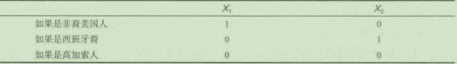

### 18. 3. 4应用和解释多元回归分析结果时存在的潜在间题

分析人员在应用和解释多元回归分析结果时可能会遇到一些问题，他们必须对这些问题有足够的敏感度。下面对这些间题进行了概括。

1. 共线性

多元回归分析的一个重要假设是，自变量不是彼此相关的。如果自变量彼此相关，那么预测的Y值将是无偏的，但b(回归系数）的估计值将是有误差的和不稳定的。传统的观点认为，如果回归模型的目的完全是预测性的，这将不是个问题。但是，当分析的目的是确定自变量如何影响因变惺时，b值巾于其共线性(collinearity)而有偏差将是个严重间题。

检测共线性最简便的方法是检验回归分析中每个变景间的相关矩阵。其中一个重要的规则是：找出自变量间相关系数为0. 30或更大的自变量。如果存在如此高的相关性．那么分析人员应对各b值的失真进行查核。其中一个办法是：将两个或多个共线变量放在一个回归模型里进行运算，然后将它们彼此分开再进行运贷。在回归楼型中得到的b值应该与单独进行运算得到的b值是相似的。

解决共线性问题有多种方法，最常用的两种方法是：O如果两个变量彼此高度相关，那么其中一个变僵在分析中可省略；＠以某种方式（如指数形式）将相关的变昼结合起来，形成一个新的复合自变量，该变讯就可用千后续的回归分析中。

2. 因果关系

虽然回归分析能表现出变侃间彼此是相互关联的或相互联系的，但却不能证明其因果关系(causation)。因果关系仅能以其他方法确定（前面章节有详细说明）。因此，要确定自变量与因变量间存在因果关系必须有逻辑性的理论性的基础。但是，即便有很强的逻辑性和统计相关性，也只是表明可能存在因果关系。

3. 系数尺度

只有在计量单位相同或数据标准化的情况下，与各自变量相联系的回归系数的大小才能直接进行比较。例如

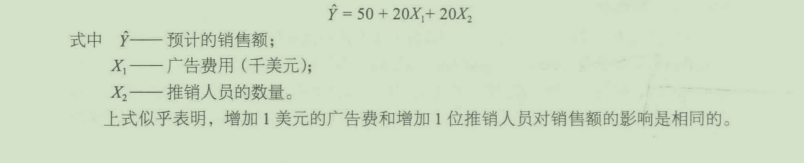

进一步考察可以看出，这是错误的。因为Xi和Xi是以不同的单位来测址的。如果我们想对各回归系数直接进行比较，则所有自变址必须以同一单位计挝（如美元或千美元）或者数据必须被标准化。所谓标准化，是将数列中各数值与其平均数相减再除以数列标准差的结果，其过程可用下列公式表示


4. 样本容量

相对于样本容量，自变量的个数影响着Ri的大小。一些重要的规则指出，观察数至少等于自变量个数的10~15倍。如在前例中，销售额是广告费用和推销人员数的函数，其有两个自变量，这就至少需要20~30个观察值。

## 18. 4多元判别分析

尽管多元判别分析(multiplediscriminationanalysis)与多元回归分析类似，但其也有许多不同之处。首先，在多元回归分析中，因变量必须是可测量的(metric)数据；在多元判别分析中，因变量在性质上属千名义的或类别的(nominalorcategorical)。例如，因变如是一特定产品或服务的使用状态，使用该产品或服务的受访者在此变量中标"l"'而没使用的人可标"2";自变量包括各种可测量的指标，如年龄、收入、受教育程度等。判别分析的目的是：

- 确定两个（或多个）组（如上例中的使用者和非使用者）在平均判别分方面是否存在统计显著性差异。
- 根据自变量的取值建立一个可对若干个人或客体进行分组的模型，即综合标准。通过模型分析，可判别任意个人或客体应属于哪个群体或类别。
- 确定两个组或多个组平均得分方面的差异有多少可以用自变批解释。

判别分析的一般模型为


判别分(discriminantscore)通常表示为Z分，它是根据公式为各个个体或客体计算得来的，这个分值是预测特定客体或个体属于哪个组的基础。判别权数也经常被称作判别系数(discriminantcoefficient),是通过判别分析程序计算出来的。与特定自变量相联系的判别权数（或系数）的大小由公式中变量的方差结构决定。差别性大的自变量（在各组之间差异大），判别权数就大；反之，差别性小的自变量，判别权数就小。

判别分析的目的是预测类别变最。分析人员必须断定哪些变量将与某一个入或客体落在两组（类）之一或多组（类）之一的可能性和关。从统计意义上行，分析各组差异的性质就是要找出一个自变量的线性组合（即判别函数）来表明组平均数问存在巨大的差别。在某些多元回归分析和多元判别分析都可以应用的领域，多元判别分析要更胜一穷。

判别分析的应用范围

判别分析可以回答市场调研中的许多问题。例如：
- 某品牌的购买者与非购买者之间有什么差别？
- 从入口统计及生活方式吞，对某新产品具有较高购买可能性的顾客与具有较低购头可能性的顾客之间有什么区别？
- 从人口统计及生活方式看，经常光顾某一快餐店或商店的顾客与经常光顾另一家快餐店或商店的顾客之间有什么区别？
- 巳经选购HMO保险和PPO保险的顾客对医疗的使用、感知和态度有什么不同？

## 18. 5聚类分析

聚类分析(clusteranalysis)一般指的是指根据两个或多个分类变址将具有某种相似特征的个人或物体归为一类的方法和技巧，也称归类分析。其目的是把物体或人分成很多相对独立且较为固定的组，在每一组内，成员彼此之间在某方面具有极大的相似性。换句话说，在每一组内，成员之间都是很柜似的，而组与组之间却具有极大的差异性。

聚类的过程

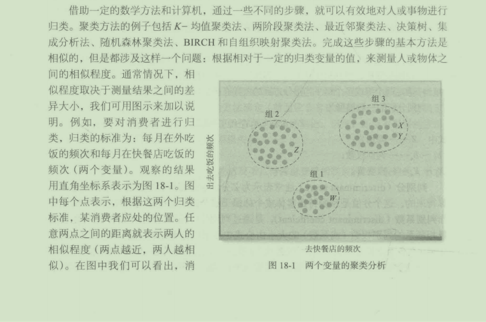


费者X与消费者Y更相似，而与消费者Z和消费者W则相异。图中已列出三个较为明显的分类群体。

在同时考虑”出去吃饭的频次“和“去快餐店频次“这两个因索时，我们将消费者划分为三个类别小组：

组1:这一组包括了那些既不经常出去吃饭，也不经常去快餐店的消费者。

组2:包括了那些经常出去吃饭但不经常吃快餐的消费者。

组3:包括了那些不但经常在外吃饭而且经常光顾决餐店的消费者。

快餐企业可以从中看出，它们应该在那些经常在外吃饭的消费者中寻找服务对象。为了进一步分析，研究人员应该再对组3消费者的人数、行为特点及心理倾向做进一步的总结分析。

在此例中，我们可以根据图18- 1中点的分布进行分类。然而，这是一种复杂烦琐、浪费时间、需要反复进行的过程。当分类的标准增加或分类对象增多时，它就会变得更加烦琐。你可以想象一下，在图18- 1中，分类的标准只有两个，而分类对象也只有100人。如果分类标准增加到三个，且分类对象增加到500人时，又会是怎样一种局面呢？人脑恐怕很难想象得出。这时候，计算机可以帮助我们完成这项工作。它基本的方法就是，首先划定各组之间的界限，然后不断地修改界限，直到在每组内各点之间平均距离相对千组与组之间平均距离尽可能小时，才算是完成。

下面的“市场调研实践18- 4"还会更加详尽地介绍聚类分析的应用。

市场调研实践18- 4

如何用聚类分析细分市场

尽管许多可替代的统计方法在过去的数十年里不断变化，传统的K- 均值聚类分析方法仍然被公认为可靠而又有效的市场细分方法。聚类分析方法是一种比较容易获得的数据分析程序，而且能够给出除了极端情况下的令人满意的结果。

在运行聚类分析方法或者其他任何形式的有关部分前，必须首先定义哪些“基础“变量需要派上用场。细分方法需要和选择的变扯一致。为了选择正确的基础变量，需要仔细浏览总体的细分目标。你想要在市场里找到的所有前景与特色都必须纳入基本变量。如果目的是为了确认新产品最好的受众，产品的偏好就需要考虑在内，连带在一起的还有人口统计数据以及客户态度，这些都可能跟客户的偏好有关。

研究的目标、过去的经历、对市场的了解、高质量的调研和可用数据的分析，可以用来确定待选的最优基本变量。除非你有非常具体的、定义准确的目标来细分市场，否则一般来说最好先设定较为宽泛的基本变量范围，然后再通过测试一步一步缩小范围。

基本变量选择完毕后，各种各样的数据处理和转换就需要准备就绪。如果根据不同的评价范围使用基本变量，你需要一些标准来防止过大数值对整个集群的影响，以及虚拟变量对数和非线性的转化，甚至需要建立复合变量来强调模型中的数据或重新调节的重要性。你需要观察潜在的基本变量的对应分布，来确保有足够的基本变量来有效地区别结果。

被设为基本变量的项目越多，那么关于主题的结果就会越多。为了防止纳入过多的基本变量，需要用有关因素的分析或者相关性的分析来选择有代表性的子集。

一旦基本变量选择完毕，运行集群分析方法就会变得比较容易。只需要输入基本变量，选择需要在你的数据里确认的集群数量就行了。然而，估计结果和确认最佳方法是一项需要反复训练的技能。你对目标理解得越透彻，你找到最好解决方法的可能性就越高。找到最好的集群是没有固定标准的。

你可以通过缩小潜在集群的方法，比如要求最小部分比例至少达到样本量的10%,如果一个极小的部分（比如说不到样本量的1%)一直出现在数据中，就可以考虑将它们设为异常值，并从数据中剔除。试着转换一些变量，移除一些项目，增加相关项目来加强具体特征的影响，以此来改变一些不符合预期的结果。

方差分析(ANOVA)是一种相当完美的变量分析方法。首先，使用方差分析可以确保你有足够的变量；然后，应用方差分析到相关的调研和外部数据中，以判断最终的方法是否足以区别结果的相关性。通过强调每项研究中最高和最低的项目，就可以迅速观测到最有效的项目。一旦你给那些部分赋予了具有一定意义的名字，并且那部分满足你的一般期望，那么该方法就值得考虑。

如果一个办法没有很快奏效，不要轻易放弃。多尝试几次，重新考虑你的基本变量。

## 18. 6因子分析

因子分析(factoranalysis)的目的是使数据简单化，即减少变屈的个数。其目标是从大批的测量数据（如等级评分）中总结出柜对少数的简叩信息，即因子。因子分析与聚类分析一样，其也没有因变量。

市场调研人员感兴趣的许多现象实质上是一些指标的组合概念，这些概念通常是通过等级评分问题来测量的。例如，要测量消费者对一种新型汽车的反应，其中一点就是测量它的＂豪华程度”，而这个问题通常要通过评价汽车的“安静性”“平稳性”及“内部装溃”等指标来决定。汽车制造商想要生产一种“豪华型”汽车，但对于“豪华型”可能会有很多不同的要求和特征，而每一相关的要素都只反映＂豪华”的某一侧面。

如果一个概念包含多方面的指标，那么它们可以综合在一起形成一个综合概念或计算出这个概念的平均得分。表18- 2的资料即反映了6个消费者在4个特征方面对汽车的评价。从中可以看出，注重汽车平稳性的消费者也倾向千关注安静性。类似的情况也存在千加速性能与操作性能。这四个指标可以被综合成两个简单的标准，即“豪华”和“性能”（见表18- 3)。

表18- 2消费者对豪华汽车的评定值

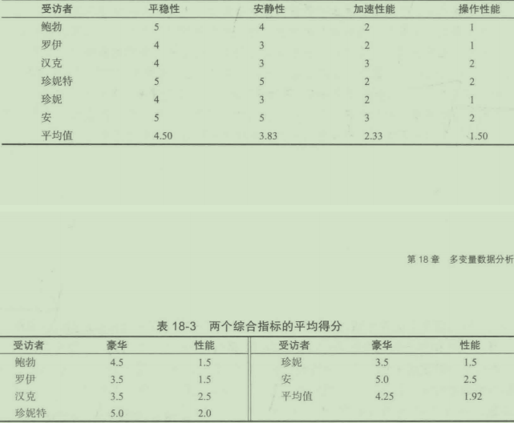

从上面两个表的变化可见，最初的4个变扯缩减为2个综合变址（即因子），而其中每一因了都暗含着原始变侬的影响。

### 18. 6. 1因子得分

因子分析结果可产生一个或几个因子或复合变晕，因子(factor)的技术性定义实际就是指变矶的线性组合。一个因子就是一系列相关变挝的加权汇总。这与加权平均很和似，即在因子分析中要根据各个指标（变址）对每个因子变化的贡献进行加权。

进行因子分析时，要为数据组中每个受访者计算各因了得分例如，在一个只有两因子的因f分析中，应根据下述公式计算因子得分

````
F1=0. 40A1+0. 30A2+0. 02A3+0. 05A4
F2=0. 0IA1+0. 04A2+0. 45A3+0. 37A4
````

式中F1~Fn- 因子得分；

A1~An一“特性等级”评分。

用这些公式，我们就可以通过替代每个等式中变饥A1~A4的评估值，计符出每个受访者的两因子得分。等式中的系数（如0. 40)是被应用到各个受访者的因子得分系数。

例如，某甲的两因子得分计算如下
````
F1=0. 40(5)+0. 30(4)+0. 02(2)+0. 05(1)=3. 29
F2=0. 01(5)+0. 04(4)+0. 45(2)+0. 37(1)=2. 38
````

在第一个等式中，对Ai和A2而言，因子得分的系数或权数就较大(0. 4和0. 3),而A3,儿却较小。A扣儿的权数较小是指这两个变僵对千因子E的变化影响不大。无论受访者赋予A3和A4的等级评分是多少，它们对Fl值的影响几乎不存在。计算笫二个因子得分(F2)时，变批A3和A4却起很大的作用，而A,、A2却只有较小的影响。

系数的相对大小是有实际意义的。变量A1(0. 4的权数）较之A2(0. 3的权数）对因子凡的变化有更大的作用。这个发现对千产品设计者来说，在他们估计不同设计变化的意义时是非常重要的。例如，产品部经理可能通过产品的重新设计和广告来提高车辆外观的档次。根据其他相关的研究，他认为花一定费用重新设计可把“平稳性”的平均得分从4. 5提高到4. 8;同时，同样的费用也能使“安静性”的平均得分提高到0. 5。因子分析表明，要想使车辆的豪华程度得以提高，在同样的费用下，改善“安静性”比改善“平稳性”更有效

### 18. 6. 2因子载荷

通过检测因子载荷(factorloadings),我们可以测定因子起源的性质。用上述提过的
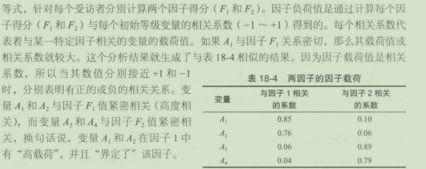

### 18. 6. 3因子命名

当确定了每个因子的定义后，下一步就是给因了命名。在为因子命名时，既要有对“高负荷“变量的观察和了解，又要凭直觉来判断。通常，对某个特定因子来说，在负荷高的变量间往往存在某种一致性（或共性）。依据这个一致性就可以为因子命名，例如前面例子里就把“平稳性”和“安静性”命名为＂豪华”。此外，虽然我们选择用“豪华”来命名这个因子，但当另一个研究人员看到同一个结果时，他也可能决定把这个因子命名为“高级”或别的名称。

### 18. 6. 4因子数目的确定

在因子分析中，我们还要解决一个间题，那就是确定最后要保留多少个因了为宜。最后的结果中可以只有一个因子，也可以有和初始变最一样多的因子，这个决定通常是通过观察由每一因子说明了的原始数据总变差的百分比而得到的。在选择要保留的因子数目方面有多个规则，其中一重要规则是：当附加一个因子而不再有意义时就不再予以保留了。最初被识别出来的因子往往能表现出逻辑上的一致性，但最后被识别出来的那些则经常会解释不通，那是因为它们包含了大量的随机变动。

## 18. 7联合分析

联合分析(conjointanalysis)是一种很受营销人员喜欢的多变量分析程序，它能帮助营销人员决定新产品或服务需要什么样的特征以及如何定价。人们普遍认为，联合分析大受欢迎的原因在千，它对这些重要问题进行研究时较之传统的创意测试方法更有力、更灵活且花费更小。

联合分析并不是一个完全标准化的程序。典型的联合分析包括一系列步骤，涉及许多程序，而不是单一程序（这与回归分析不同）。幸运的是，联合分析并不难懂，下面将介绍联合分析在高尔夫球案例中的应用。

### 18. 7. 1联合分析实例

假设你是Titleist公司的产品经理，该公司是高尔夫球的主要制造厂商。你从最近组织的焦点小组访谈、以前的各种研究和你作为一个高尔夫球爱好者的体验得知，高尔夫爱好者主要以三个重要屈性为标准来评估高尔夫球，它们分别是平均击球距离、球的平均寿命和价格。同时，你还了解到每个属性都有个可能的取值范围。

(1)平均击球距离：
- 比高尔夫球爱好者的平均水平多10码；
- 与高尔夫球爱好者的平均水平相当；
- 比高尔夫球爱好者的平均水平低10码。
(2)球的平均寿命：
- 54个洞；
- 36个洞；
- 18个洞。
(3)每个球的价格：
- 2美元；
- 2. 5美元；
- 3美元。

潜在购买者心中理想的高尔夫球应有以下特征：

- 平均击球距离：比高尔夫球爱好者的平均水平多10码。
- 球的平均寿命：54个洞。
- 每个球的价格：2美元。

对千制造商来说，基千制造成本的考虑，理想的高尔夫球应有以下特征：

- 平均击球距离：比高尔夫球爱好者的平均水平低10码。
- 球的平均寿命：18个洞。
- 每个球的价格：3美元。

上述这些特征是根据这样的事实得出的：击球距离越短、寿命越短，制造成本越低。若按照顾客的标准改进生产，必然可以大大提高销量，但对于厂商来说却毫无利益可言。相反，若完全按照厂商心目中的理想标准改进生产的话，销量必然不高。所以，从商业的眼光来看，“最好”的高尔夫球往往是位千这两个极端的中间。

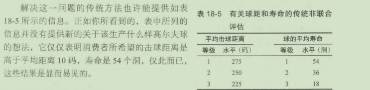

### 18. 7. 2联合考虑特性

在联合分析中，我们让受访者将特性联合起来进行评估而不是单个逐项评估。将平均击球距离和平均寿命进行不同的组合，然后让两个高尔夫球爱好者对此进行评估，结果如表18- 6和表18- 7所示。

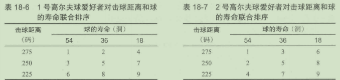

正如所预计的，他们最愿意购买和最不愿意购买的球是相同的。可是，分析他们对球的第二至八选择会发现，第一个高尔夫球爱好者更看重球的击球距离（他宁可接受一个寿命较短但击球距离较长的球），而第二个人则更看重球的寿命（他宁愿接受一个击球距离较短但寿命较长的球）。

这类信息是联合分析能够提供的最具启发性的信息，传统分析是做不到的。这种技术能让营销人员看到潜在消费者愿意舍弃哪个特性去换取其他特性。这是我们在购买决策过程中每天都要做的事（例如，你会用相对较高的价格在某个商店购买商品，仅仅因为这个商店更便利）。

### 18. 7. 3效用评估

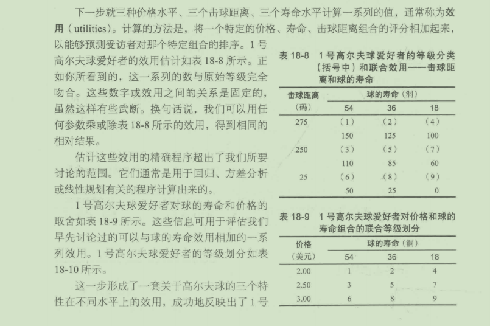
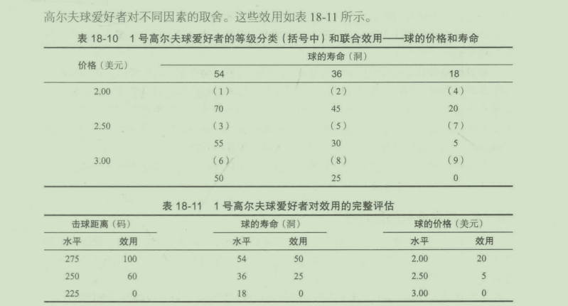

### 18. 7. 4模拟购买者的选择

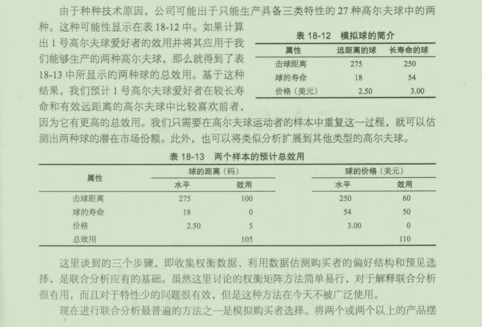

放在一起，并标注有关产品待分析特征的细节，然后让调研对象从各产品中挑选一个。为了反映产品的各种特征，该模拟将重复进行多次，但是无论进行了多少次都不能包含重复的调研人员。

计算机模拟时还可以根据前期回复和人群特征调整对每个受访者的模拟，在那些很可能影响产品选择的问题上多分配时间。基于菜单的联合分析能够复制消费者在超值套餐和照菜单点之间的选择。还有些计鍔机模拟能够让受访者在适当的约束条件下设计自己的产品，就像让消费者在线配置自己的戴尔电脑或装配自己的新车。只要设计、执行和分析进行的恰当，上述或其他方法都能够用来收集用以估计效用的信息。

前面曾提到，联合分析有许多方法。不过，如果你理解了这个简单的例子，那么也就理解了联合分析的基本思想。

### 18. 7. 5联合分析的局限性

与其他许多调查技术一样，联合分析在一定程度上受到人为因素的影响。受访者在调查过程中可能比在真实情况下更深思熟虑，他们也可能在调查中比在实际市场环境中获得更多的产品信息。

最后还需要记住一点：任何新产品或服务的广告和促销都能够导致消费者感觉的形成，这种感觉与通过用千调查的产品描述所产生的感觉是不同的。

## 18. 8大数据和Hadoop平台

大数据是用来描述大量复杂数据集的术语。很多公司在计算机时代初期就开始收集交互信息。然而，数据规模在过去短短几年间发生了令人出乎意料的增长，并且现在需要处理的数据也很难同传统的分级数据库结构相匹配。大数据要求有全新的数据收集和数据管理方法，能够以更快的速率处理规模更大、形式更复杂的数据。大部分的大数据处理程序现在还处于开发阶段，能够使用这些工具的人才也很稀缺。

Hadoop是一个由Apache基金会发布的开源分布式计算平台，通过成百上千个相互连接的计算机处理大量的信息。每个计算机各自处理一小部分数据，这样就能以与使用传统数据库结构差不多的时间完成诸如收集几十亿记录的任务。每个数据块都有多个备份，因此任何处理差错都能被另外与该数据块相联系的计算机迅速发现。谷歌和雅虎都参与了Hadoop平台的开发和基础技术的设计，因为它们也在探索存储和处理所收集的大菌调研数据的方法。

现在，很多需要处理大数据的公司都在使用Hadoop,比如亚马逊、eBay、脸谱网、谷歌、IBM、领英、Spotify、推特和雅虎。

## 18. 9预测分析

预测分析描述了一系列从数据集中提取和分析信息的方法技术。统计学、机器学习、数据库管理和计算机程序都在识别模式和转换数据信息中起作用。随着数据指数性地增长，这些工具组合在商业上的重要性与日俱增。因为公司都要在数据中寻找有效信息以提高效率。预测分析既可以运用于传统数据库，也可以运用于大数据。还可以运用于诸如计分卡使用情况的观察数据，诸如社交媒体文件的网络信息，网站跟踪数据以及一些原始调查的结果。欺诈检测、趋势分析、目标导向性营销、高频用户推测和潜在购买者鉴别等，只是预测分析的一些运用方面。

### 18. 9. 1预测分析使用流程

1. 设置数据集

进行预测分析之前，必须设嚣一个与研究问题相关的目标数据集。预测分析只能用来寻找存在数据间的数据模式或关系。因此，数据集通常要足够大才能包含现实中可能存在的所有模式和关系。

以往，设置一个如此庞大的数据集需要很多的金钱和时间；现在，从客户中收集几个TB的信息对大部分公司来说只是日常项目，并且许多社交媒体公司也为需要的人提供了获取大量信息的途径。此外，还有许多第三方供应商为美国的家庭和公司提供了可供购买的数据信息。

2. 预处理

设置好数据集后，就要进行数据检验，对包含过多因素的观察数据、错误的数据以及遗混的数据进行编辑和删减。可以用数据转换处理不规则数据，最小化极端值。从类似的记录中引入缺失值以及建立预测模型填补缺失信息是常用的方法。联系多个数据集合也是数据预处理的内容。

3. 建模

在建模过程中可以采用多种手段：

- 聚类。这项工作的目的是发掘数据中具有与预设变矗相关相似的集合。这些相似性并非一目了然，也不是单个变量组或很少项目量就能决定的。进行聚类时，通常需要经过大量的测试才能找到最好的方法。在本章的前面部分介绍的聚类分析，通常用来发现数据背后令人意想不到的联系。

- 分类。一些完全可得的信息，比如人口统计信息和地理位置信息，也可以用来区分个体的关键行为（购买频率或产品偏好）。一些专有资料，比如播出的线上广告或之前销售的产品，都能够非常有效地预测将来的行为。聚类分析得到的客户划分也要考虑在模型内，以预测新客户属千那个分类。成功的模型可以用来处理那些因数据缺失而无法直接处理的新客户和新记录。

- 估计。应当计算个体或群体的一些关键值，比如风险指数、欺诈比率、客户保留比率、客户终身价值和可能购买比率等。这些值可以根据当下拥有的有限数据预测未来结果。它们也能够用来检测个体或群体以发现客户行为的变化，尽早做出反应，防止客户流失和利润减少。

4. 验证结果

预测分析的最后一步是将预测模型算法运用到更广泛的数据集中，以验证模型发掘的数据模式。并非在前面步骤中得到的所有模式和关系都能够用到现实生活中。在验证过程中，用到的测试数据集是那些未曾用来建立预测模型算法的数据。输出的结果将和预想的结果相比较。

例如，如果要开发算法预测最可能回复邮件的人，那么开发和调试过程都要依靠过去的邮件发送数据。一旦建立了算法，将运用到那些没有用在建立算法的邮件或最近真实发送的邮件中。如果预测模型的测试结果没有达到预期的精确水平，那就需要重新浏览之前的步骤以修正模型和算法。

5. 运用结果


市场调研实践18- 

塔吉特如何比父亲更早发现少女怀孕

你每次购物的时候，都在和零售商分享有关你的消费模式的私人信息。许多零售商都在研究这些信息，以发现你喜欢什么，需要什么，以及哪种优惠券最合你的胃口。例如，塔吉特超市就发明了一种方法，能够在你需要买尿布之前就从与你有关的数据中推测出你是否怀孕。

查尔斯，都希格(CharlesDuhigg)在《纽约时报》上概述了塔吉特是如何在即将成为父母的客户还没成为婴儿用品狂热和忠实购买者之前发现他们的。他在塔吉特极度兴奋并切断一切有关客户怀孕信息之前与该公司的统计学家安德烈·波尔(AndrewPole)进行过交谈。塔吉特为所有的客户分配了一个客户ID,并将其与他们的信用卡、姓名及邮件地址信息相联系。它们组成了一个信息集，用来存储一切他们所购买过的物品信息以及塔吉特收集或购买的其他人口统计信息。通过这个信息集，安德烈·波尔就能观察到所有在塔吉特婴儿登记簿上签名的女士的购买数据。

他使用多种方法分析数据，就得到了有用的规律。很多人都会购买洗液，但安德烈·波尔的一名同事注意到。在婴儿登记簿上的女士大约在登记后第四个月初购买大量的无香型洗液。还有一名分析师注意到，在最初的20周的某个时间，孕妇会购买大量提供钙、镁和锌的产品。许多购物者还会购买肥皂和棉球，但某人一旦开始购买大量无香味肥皂和超大包棉球，以及消毒杀菌剂和毛巾，就意味着她们离分挽日期很近了。

当安德烈·波尔的计算机浏览数据时，他就能够联合分析大约25种产品，得到每位客户的＂怀孕预测分＂。更重要的是，他还能比较精确地估计出怀孕女士的分挽日期，因此塔吉特就能够根据孕妇所处的具体阶段向她们送出合适的优惠券。

举一个例子，塔吉特的一位购物者JennyWard(虚构名字），23岁，住在亚特兰大。她在3月购买了cocoa- butter润肤乳、一个能够装下两个尿布包大小的女士手提包、补锌和镁的产品，以及一块亮蓝色的小地毯。通过分析，她是一名孕妇的可能性是87%,并且她的分挽日期在8月末的某个时候。根据小地毯的颜色，也许那还是一名男孩。因此，塔吉特就根据客户的“怀孕预测分“向她们发送婴儿用品优惠券。一个怒气冲冲的男人闯入塔吉特在明尼阿波利斯的一家实体店，要求与经理谈谈。“我的女儿在你们的邮件中收到这个，”他说，“她只是个高中生，你们就送给她婴儿衣服和婴儿床的优惠券？你们是在鼓励她怀孕吗？”

该经理完全不懂那个男人在说什么，他看了看邮件，很显然该邮件是发送给那名男士的女儿的，邮件中包含了孕妇服、幼儿家具以及微笑的婴儿图像的广告。经理当场向该男士道歉，并在几天后又打电话道歉了一次。然而，在电话中那位父亲显得有点尴尬。“我和我女儿进行过谈话，”他说，“我发现我没有完全注意到我家里发生的一些事情，她的分挽日期预计在8月。我需要向你道歉。”

但是塔吉特很快发现，人们对该公司提前了解她们的怀孕信息感到不满。“如果我们送给客户一些产品样本并说｀恭喜你即将拥有第一个小孩＇，但其实她们并没有告诉我们她们怀孕了，有些人就会对此感到不满，“安德烈·波尔对我说，“我们一向非常服从一切隐私法律。但是即使遵守法律也不意味着不能做让人感到不自在的事。”

因此，塔吉特就变本加厉地发送优惠券。公司建立了个性化的小册子，不仅向高”怀孕预测分”的客户寄送尿布、摇铃和婴儿床的优惠券，甚至还包括睡前故事书。

“接着我们在其中混入一些明知孕妇不会购买的用品，这样婴儿用品广告就显得是随机发送的。我们同时寄出割草机和尿布广告，同时寄出酒杯和婴儿服装的优惠券。这样，所有的产品就像是随机选择的。

“我们发现，只要孕妇没有发现自已被监视，她们就会使用优惠券。她们以为同街区的其他人也收到了附带尿布和婴儿床优惠券的邮件。只要我们没有吓到她们，该方法就有效。”因此，塔吉特对待孕妇的哲学与第一次约会的哲学相似：即使你巳经在脸谱网或谷歌上完全了解了对方，也要假装只是略懂一点，以免吓坏了对方。

都希格说，塔吉特在21世纪前10年取得了巨大的成就，2002年利润增长到440亿美元，到2010年波尔退休的时候，巳经增长到670亿美元。在波尔的帮助下，该零售巨头垄断了幼婴用品市场，引用该公司总裁格雷格·斯坦哈费尔(GreggSteinhafel)向投资者自夸的一句话：“专注于经营母亲和婴儿需要的产品。”

### 18. 9. 2隐私和伦理问题

大多数人都认为预测模型是道德中立的，然而建立预测模型时数据的收集方法、获得的数据类型，可能产生一些有关隐私、合法性和伦理方面的间题。例如，为了国家安全或执法目的而进行的电话监听和网络使用监测就产生了隐私问题。

### 18. 9. 3商业预测建模软件及运用

像甲骨文和微软等数据库提供商提供了最适用千它们的平台的工具。Hadoop拥有大量开源的商业工具。用来预测建模的高度集成安装包也越来越多，包括：

- AngossKnowledgeSTUDIO;
- Clarabridge;
- RapidMiner;
- SASEnterpriseMiner;
- SPSSModeler;
- STATISTICADataMiner。

## 本章小结


多变量分析是指用来对所研究的每个个人或对象的多重测量同时进行分析的一组统计过程。一些流行的多变量技术包括多元回归分析、多元判别分析、因子分析、聚类（归类）分析、知觉图和联合分析。

多元回归分析使调研人员可以根据一个以上自变量的水平来预测因变量。由多元回归分析得到的一个统计量被称为判定系数或R2,它的取值范围在0~I,代表了因变量变化中由自变量变化解释的百分比。b值，叫回归系数，指明了单个自变量对因变量的影响。多元回归要求因变量是可测量的，而在多元判别分析中使用的因变量在性质上是类别变量。多元判别分析可以用来确定在两个或两个以上组的平均判别分是否存在统计显著性差异。这种技术可以用于建立模型，根据个人或客体在几个变量上的得分将其进行分组。最后，多元判别分析也可以进行两个或两个以上组的平均得分的差异中有多少是因为自变量引起的。判别分被称为Z分，是根据判别方程获得的。

聚类分析使调研人员可以识别各组群，这些组群内的个人或客体具有相似性而与其他组群有所不同。聚类分析要求所有自变量是可测量的，但对因变量则没有特殊规定。聚类分析是进行市场细分的有效工具。

因子分析的目的是使大量的数据简单化。其目标是利用少量的概括性指标（即因子）来反映在大量可测量的数据（如等级评分）中的信息。在因子分析中，没有因变量。因子分析产生出因子，每个都是一组相关变量的加权组合。每个指标都根据其对每个因子变化的贡献来加权。另外一个重要的概念是因子载荷，因子载荷是通过计算因子得分与初始输入变量间的相关系数来决定的。通过检查哪些变量对给定因子的载荷值大，研究人员可以为因子命名。

联合分析是一种用于衡量潜在消费者如何根据每种产品或服务的不同特性对不同产品和服务进行权衡的技术。这种技术允许调研人员决定各种特性在各种水平上的相对值。这些估计值被称为效用，它们可作为模拟消费者选择的基础。

预测建模综合运用统计学、机器学习、人工智能以及计算机程序识别市场数据集中的数据模式。在数据指数增长的背景下，该方法变得越来越重要。

## 复习思考题

1. 区别多元判别分析和聚类分析，并举几个运用两类分析的买例。

2. 多元回归的目的是什么？举一个在市场调研中应用多元回归的例子。如何判断多元回归的效果？

3. 什么是哑变量？举例说明。

4. 描述一下多元回归中与共线性有关的潜在问题。如何测试共线性？如果共线性是一个问题，调研人员该怎么办？

5一名销售经理检查了年龄、教育程度、反映内向或外向的性格水平，即由公司120人组成的销售队伍实现的销售水平。分析数据后，销售经理说：“有一点是很清楚的，一位推销员，教育水平越高、外向程度越大，个人销售水平就越高。换句话说，良好的教育和外向的性格能够使一个人销售更多“你是否同意销售经理的结论？为什么？

6. 产生的因子和由因子分析的得来的因子载荷都是数学框架。调研人员的任务是要说明这些因子是什么

下表列出了从一项对有线电视观众调研中得出的四个因子。请给这四个因子命名，并说明原因户

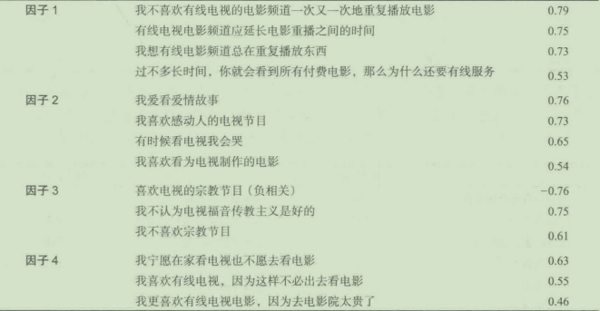


7. 下面是一个判别分析表。数据有关有线电视用户、从前的有线电视用户、从未使用过有线电视的人，以及他们对各种态度问题的反应。看一下不同的判别权数，对于三个组你有什么看法？

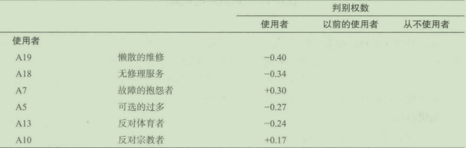

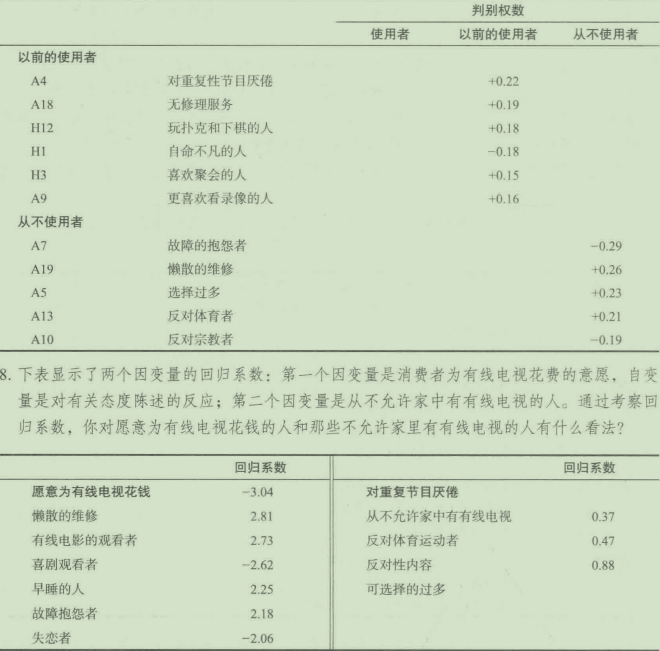


比萨快客的满意度调研

问题

比萨快客(PizzaQuik)是一家区域性比萨连锁店，其在美国中西部的7个州都有分店。比萨快客引入了全面质量管理制度。作为这种制度的一部分，公司承诺提供以市场为导向的高质量产品。因此，比萨快客要进行一项市场调研来解决两个问题：第一，顾客是怎样定义质量的；第二，顾客对于质量有着怎样的期待。

调研目标

这次调研的目标是：

- 识别影响消费者满意度的关键因素。
- 根据关键因素来衡量目前的消费者满意度。
- 确定影响消费者整体满意度的不同关键因素的相对重要性。
- 提供管理上的建议，指明公司的努力方向。

调研方法

第一个调研目标可以用定性分析的方法来实现。几个调研小组与消费者进行沟通，从而确定比萨快客的产品和服务的哪些属性对消费者而言是最重要的。在以上研究的基础上，下列属性被识别出来：

- 食物的整体质量。
- 菜单的多样性。
- 比萨快客的员工服务态度。
- 性价比。
- 服务的速度。

在调研的第二个阶段，调研人员对1200个随机选取的在过去30天内曾在比萨快客购买比萨或就餐（在餐厅就餐或外卖）的顾客进行了电话访谈。调研中得到的关键信息如下：

- 对比萨快客整体满意度的评分（满分为10分，"l"表示特别不满意，"10"表示特别满意）。
- 对比萨快客在定性研究中识别的5个满意度关键因素的评分（参考整体满意度的评分规则）。
- 人口特征。

结果和分析

这次调研采用外延交叉列表法(extensivecrosstabulations)和其他传统的统计分析方法。分析的关键步骤是：以整体满意度为因变量，以受访者对产品与服务关键属性的满意程度为预测变量，建立一个回归模型。分析结果如下

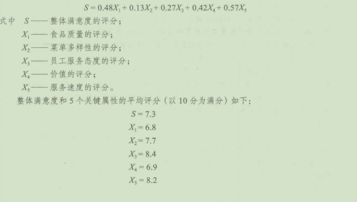

回归系数显示了决定整体满意度的不同属性相对重要程度的估计值。结果显示Xs(服务速度的评分）是驱动整体满意度的最重要的因素。结果表明，服务速度评分每提升一个单位，平均满意度就会提高0. 57。例如，现在服务速度的平均评分是8. 2,如果提高服务速度，将这项评分提高到9. 2,那么平均满意度的评分会提高到7. 87。根据回归分析的结果，X1(价值的评分）对整体满意度的影响仅次于服务速度。从另一方面看，在对整体满意度的作用上，X2(莱单多样性的评分）是最不重要的，X3(员工服务态度的评分）在重要性排序中位于中游。

经营表现评分提供了一种不同的格局。根据平均评分的结果，顾客认为比萨快客在X（员工服务态度的评分）方面做得最好，而在X1(食品质症的评分）方面做得最差。

问题：

1. 在矩阵中标注重要性和经营表现的评分。一个坐标轴代表重要性（从低到高），另一个坐标轴代表经营表现（从低到高）。
2. 你认为应对哪个象限投入最多的关注？为什么？
3. 你认为应对哪个象限投入最少的关注？为什么？
4. 根据你的分析，你会建议这家公司在哪个方面投入更多的努力？是什么逻辑支持着你的建议？

调研实例18- 

Gibson公司对预测分析法的应用

Gibson家庭折扣中心在得克萨斯州和俄克拉何马州的大约100个地点经营中型折扣店。正如它的名字所表达的，该折扣店面向那些寻找优惠和折扣的购物者。它经营各种各样的商品，几乎包含所有你在沃尔玛能看到的东西。但它不像7- Eleven那样，附带经营一些食品杂货。它尤其注重销售过季的成衣制品。在过去5年中，Gibson在稳步扩大它的市场。

在广告助理的建议下，Gibson最近购买了目标区域的家庭清单，其中包含的家庭数目超过JOO万。清单包含了所有家庭成员的名字、地址和其他由Acxiom公司收集的信息，信息中还包含了每个家庭对一些调查问题的回复。该调查是在购物中心进行的、通过网络小组成员得到邮件地址并发出调查邀请。

Gibson仍然非常依靠于每周向目标区域的家庭发送邮件通知。该地区只有不到200万个家庭，因此购买的家庭清单已经包含了一半的家庭。随着时间的推移，Gibson很有希望收集到剩下那100万个家庭的相同信息。然而，该公司想用现有的清单去提高营销效率，尤其是提高成衣制品的销量。正如上面提到的，与经营的其他商品相比，成衣制品一般是滞后销售。

Gibson公司的经理注意到越来越多的机构在使用预测分析，他相信使用这些工具能够提高公司成衣制品及其他商品的销量。为此，Gibson最近雇用了一个名叫戴维的年轻人，他之前在塔吉特当预测分析师。在加入塔吉特之前，戴维从美国西北大学毕业，并获得预测分析学硕士学位。

他为Gibson完成的第一项工作就是通过网络平台随机选择了目标地区的3218个家庭进行市场细分研究。通过人口统计变量、行为变量、态度变量和其他变量识别出6种市场类别。研究过程中用到了聚类分析。为了得到能够最好描述每个市场类别的名字，他观察了每个类别的具体特征。下表提供了6种市场类别的一些摘要项：

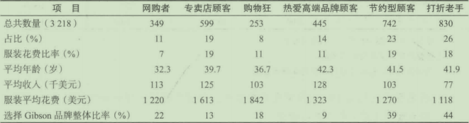

通过观察6种分类，戴维认为节约型顾客和打折老手是最好的目标群体。他将结果向经理层展示，经过一番激烈的讨论，经理接受了该项建议。

在讨论阶段，管理层中一部分人认为每个家庭都可能是潜在客户，另一部分人则认为要专注于那些最可能是他们客户的人接受了戴维的建议后，管理层让戴维分析清单中的100万个家庭，并将每个家庭划分为两组：一组为节约型顾客加打折老手（第一组）；另一组是6种分类中的其他类别（第二组）。

潜在的经济影响是巨大的。例如，在我们的调查数据中，估计只有42%的家庭属于目标分类口如果这项估计是对的，那么只有420000的家庭是我们的目标，另外580000则不是。仅仅就邮件通知来说，减少580000份每年可以节省22620000美元(52周X580000份X每份0. 75美元的印刷费、邮寄费和处理费）。

整体的研究设计包括市场细分和将该分类结果运用到Gibson的100万份家庭名单中。过程如下：

- 进行市场细分研究，将市场划分为上述几个分类

- 将Acxiom公司那100万份家庭数据添加到市场划分调研受访者的数据上。主要是受访者的地址信息。

- 将市场分类作为因变量，附加的家庭数据作为预测变量，对它们进行市场分类预测。这样不需要对那些家庭进行有关市场划分的提问就能预测100万份数据的市场分类信息。

- 目的就是预测人们是否属于下面两种分类之一：节约型顾客加打折老手（第一组）或其他类别（第二组）。戴维选择用多元判别分析来完成这项工作。结果如右表所示：

- 估计多元判别分析模型的预测能力。估计结果见下页的表格。整体上有将近79%的数据得到了准确预测，因此可以认为该模型的预测能力很强。

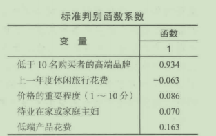

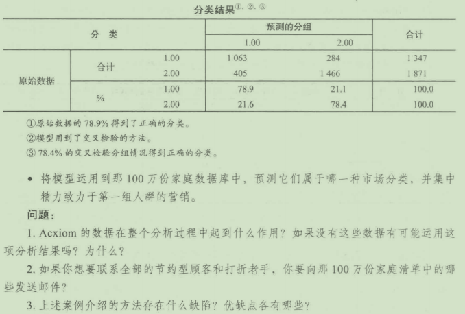


附录18A

市场调研在组织和伦理问题中的角色

贯穿企业组织的市场调研

(1)在今天的商业界，数据解释的问题并没有完全解决。有些人必须关注数据来搞清它们的含义，这通常是由市场调研人员做的。但调研结果影响工程、财务和生产运营时，这三方面的人员应解释所有的市场调研数据。你对这种情形有些什么不同看法吗？

(2)通过对一个大型电力公共事业部门所做的市场调研发现：对修理人员能力的信赖是顾客对电力部门满意与否的首要决定因素。基于这些发现，这个部门启动了一场较大规模颂扬电力部门维修人员英雄事迹的广告攻势，修理人员讨厌这种广告攻势，他们知道自已不能像广告中那样达到顾客的期望。那么应该采取什么样的做法呢？

(3)当市场调研被用于战略规划时，它经常在决定外部环境中的长期机遇和危机时起重要的作用。危机可能来自竞争对手的可察觉到的未来行动、新的竞争者、政府的政策、顾客品位的改变或其他各种来源。管理者的战略决策将决定公司的长期获利性，甚至可能决定企业的生存。大多数高层管理者不是市场调研人员或统计人员，因此他们需要知道他们应给予数据多大的信赖。换句话说，当市场调研人员提供统计结果、结论和建议时，他们必须理解高层管理者对于意义含糊不清和不精确的容忍度。为什么？这种理解对市场调研人员提供给管理者的资料有多大影响？在什么情况下，高层管理者的容忍程度能改变呢？

伦理困境：市场调研中的品牌化黑匣子

市场调研在20世纪80年代中期进入了品牌化阶段，在20世纪90年代得到快速发展，并延续至今。访问几乎任何一个大型市场调研公司的网站，你都会看到一系列有品牌的调研产品。这些产品涉及从市场细分到顾客价值分析的方方面面，它们都带有一个小型的标志SM、TM或＠。这里有一些例子：MARC调研公司的Designor5M、美国市场事实调研公司的品牌愿景。、美国马瑞兹调研公司的80/203®公关经理调研法和美国整体研究公司的TRBC™(一种规模偏差修正算法）。

这些产品有一个共同点，那就是它们都被注册过。这意味着这些公司不会公开这些方法的具体实施步骤，这就是为什么它们被轻蔑地看成黑匣子。被称为黑匣子的方法都是注册过的一公司因此可以保护产品的研发投入（黑匣子和品牌名称不是同义词，几乎所有被注册的方法都有一个清晰的品牌名称，但是也有些具有品牌的方法并没有注册）。如果顾客在某种方法中得到了附加价值．服务的提供商便可以收取额外服务费。

至少有两个因素推动了品牌化的潮流：第一，竟争压力迫使组织寻找提供差异化产品的新方法；第二，很多大型的调研机构都向公众发行了股票，这些公司每个季度都承受着增加销售额和利润的持续性压力。其中一种方法就是提高服务的售价。如果一家公司有一个对市场细分情况进行调研的已注册方法，它很可能相对于那些使用常用软件，如SPSS或SAS,进行调研的公司收取更多的费用。具有讽刺意义的是，也许有些黑匣子就是一些极其标准化的软件，如SPSS和SAS。但是，如果它们的拥有者不公开它们的使用方法和其中包含的技术，那么这些方法将会一直是黑匣子。

问题：

1. 使用品牌化的黑匣子模型是否是不道德的？
2. 是否应该强迫市场调研服务提供商向顾客解释调研模型的运行原理？
3. 法律是否应该要求市场调研公司对其调研方法进行效度和信度测试，以证明它们的方法比那些没有注册过的方法更好？


