# 第19章沟通调研成果

## 学习目标

1. 了解调研报告的基本目的
2. 学习如何组织和准备一份调研报告
3. 全面了解如何解释和展示市场调研结果
4. 学习如何进行个人汇报

调研报告是所有研究努力的收尾之笔，在传播关键发现及其影响上至关重要畸本章带你解决这个问题。

## 19. 1调研报告

调研目的、基千调研做出的决策和分析，以及报告应该被用千指导调研的设计和执行。对千基千调研的项目，尤其是问卷设计应该时常参考调研目标。现在我们有『数据，它们巳经被制成了交叉列表，并且进行了统计测试和大员的统计分析，调研人员及其闭队筛选了所有的信息，并将这些信息与最初的目标以及和这些目标有关的决策结合起来。这些过程可以持续进行下去，但是时间表上的截止日期推动进程的结束，通常比我们希切的要快。

调研人员掌握了大址的信息一大攒的交叉列表和统计分析、成堆的笔记，以及其他信息。他们面临的挑战是：如何以连贯的报告形式打包所有的这些信息，高效、有效地传播关键发现，以及基千这些发现做出的决策。我们常常把这个过程视为讲故事的过程。在开始讲故事之前，你必须要有一个好的构思一故事的结局。所有的分析都是为f得出结论。一且你知逍或者确定了你想要得出的蜇点，详细制定出你需要什么来和读者进行沟通，以使他们得出相同的结论变得相对简单。

调研公司有统一的报告风格很重要。所有的分析师风格一致，这样即使只是膘f眼报告，也能知道是哪家特定公司做的。说了这么多，我们必须承认，当客户有自己的报告标准时，有时候需要运用不同的方法，而不是运用上述推荐的方法。在一些情况下．客户甚至要求调研供应商根据客户风格的PPT模板制做报告。下列的“市场调研实例19- 1"告诉你们如何写出好报告的小窍门。

如何写调研报告

这种事频繁发生一－—作为一名市场调研人员，你为获取富有洞见的数据而通宵达旦，但最后让你震惊的是，你的调研报告最终却以失败告终。

是什么出了问题？很可能是你展示调研结果的方式出了问题。以数据为导向的报告写作方式，要么会造成报告干枯乏味，要么导致客户无法发现掩埋在诸多数据之下的干货。

下一次你打开微软Word之前，先学学如何从头到尾吸引住顾客。

写之前想一想

开始之前，撰写之时以及做最后修改时，这三件事应该作为重中之重：熟悉你的读者、熟悉你的数据和你做调研时的背景。

位于纽约的北美Gtk客户调研公司副总裁奥利·马拉凡金(OrlyMaravankin)说，如果研究者提前与公司领导人或客户沟通，弄清楚他们的商业目的，会对研究者有很大帮助，这会帮助你弄清楚你要在研究报告中实现什么。除此之外，可以读一读你公司或客户公司的年报，了解一下与你调研有关的文化与社会趋势，发掘数据所支持的商业认知。

万事达公司(MasterCard)信息与企划部门高级负责人弗莱德·约翰说：“首先，你得要弄清楚你真正需要说的是什么。你想要你的客户带着哪些基本知识离开？“通常而言，读报告的人要的不是数据而是对未来业务发展需采取步骤的认识。他说，关键在于不要简单地汇报你发现了什么。

讲故事

美国密苏里州芬顿的马瑞兹调研公司(MaritzResearch)的首席汇报员艾德·斯托林斯(EdStalling)常常把时间分成两部分：回顾公司的调研报告和改善员工的写作技巧和概念。他表示，在准备写报告时，要先找到组织和提炼想法的方式，比如画板和可视框架纲要，纲要会使调研的背景更清晰，也能使人更好地看到哪些数据最重要。要牢记写报告好比讲故事，要有清晰的开头、中间和结尾。“如果你想让顾客接收到信息，你必须跳出具体细节”。

不能把所有的＂干货”都攒到报告结尾，约翰说，“此时读者的精神巳经游离了＂。拉里·吉布森是来自明尼阿波利斯市的咨询员，也是EMA公司的高级调研员，他曾经在美国市场营销协会(AMA)举办的应用调研方法大会个别指导班做“撰写调研报告，创建展示框架＂的展示。他表示，有一个技巧就是像写新闻稿一样报告，新闻的标题就展现出其内容，每一部分的开头句子就总结出最重要的论据，“任何一段文档中最重要的位置就是第一段开头的部分，文档要么就此吸引住读者，要么就一了百了"。

为保证读者一直感兴趣，我们必须以简洁和谈话型语言写报告：用主动语态，避免长句子和行话。约翰说：“如果报告读起来像人际沟通语言，而不是由机器人堆砌出来的生硬语言，就会起到积极作用”。

吉布森说因为报告传达的意思至关重要，所以报告撰写者的总结一定要清楚明晰，要让读者就算随意浏览内容也能明白你在说什么。用写作语气和引人入胜的观点使数据鲜活起来。想知道如何设定语气基调，找到你最喜欢的商业专栏作家，分解他们的文章格式，问问自己为什么会被他们的文章吸引。

报告写完以后，隔一段时间再去检查修改，这样能以比较新的观点去看报告。分别和一位不清楚你撰写报告内容的同事和一位知晓你报告内容的同事分享，来测试一下他们能不能理解你所要表达的内容且一直兴致勃勃。

问题：

1. 你应该把报告中所有有价值的于货放在报告结尾吗？为什么要这么说？

2. 在展示报告时，如何使人们一直感兴趣？为什么这很重要？

3. 报告的读者想要的是数字，还是想要为下一步的商业行动寻找洞见呢？为什么这么说？

4. 根据这个作者所说，在写报告或者做汇报之前要做的第一件事是什么？为什么这件事重要？这件事简单吗？

## 19. 2组织调研报告

传统的调研报告的基本内容包含以下几个方面：

(1)标题页。标题页主题是项目名称，其他附加因素包括客户组织名称、调研公司名称和报告的日期。

(2)目录。目录不能多千一页并且需要列出报告的主要部分以及每一部分开始的页码，目的是为读者提供便利并且能够使研究人员迅速在报告中找到参考信息。

(3)执行摘要。这可能是调研报告中最难撰写的一部分因为它必须简明地包含主要发现以及根据这些发现给出的建议。不是所有的调研报告都包含建议，调研报告是否包含建议取决于报告的性质、调研公司期望获得什么、调研的发现。然而，所有的调研报告都应该包含主要发现。调研报告必须简明简短的要求增加了其撰写难度（最长2~4页），许多调研人员发现将他们获得的大量信息概括成2~4页非常困难。长篇大论容易，但是简洁地进行概括相对困难。执行摘要不是概括每个发现，而应该集中于那些重要的并且和研究目的相关的发现。

(4)背景。背景设定了进行研究的情景并且突出了调研的总体目标，需要做出的决策，企业在所研究问题上的优势和劣势以及其他类似信息。这部分不能多千1~2页。另外，将大量信息凝结成要点存在一定难度。

(5)方法论。这部分讨论如何完成调研以及为什么以这种方式进行调研。在这部分需要强调的间题包括谁是受访者，为什么访问这些人以及如何访问（如电话调研、邮件调研、网络调研，或者这些方法的组合），为什么以这种方法访问，如何选取受访者，使用何种抽样方法，样本是否具有代表性，受访者的人数，如何处理完成的调研结果，使用何种数据处理程序，以及为什么使用这些程序等。这部分不需要太长，1~2页最合适。假如需要更详细地阐述调研方法的一些技术性因素，那么更加详细的信息，例如使用数据处理程序应该附于附录部分。

(6)结果。这部分通常是报告中最长的部分，应总结出每个调研间题的结果。

(7)附录。这是最后一部分，通常会附上一些支撑性材料，比如一份调研报告，每个调研间题的交叉列表（客户可以查阅某些未被列在发现中的具体问题），以及其他支持性材料，比如一些特殊调研步骤、技巧的详细技术性信息。

## 19. 3阐释结论

对千第一次撰写研究报告的个人来说，最困难的是阐述发现并从中得出结论，然后利用这些结论形成建议。调研的执行摘要(executivesummary)部分解释了调研发现，数据意味着什么，如果需要采取行动，采取何种行动。这个过程存在的困难时完全可以理解的，鉴千调研人员经常淹没在成堆的电脑打印输出、大量的问卷、上百页的交叉列表、大量的数据测试结果、大量的数据分析输出，以及有关项目的便签上写满了笔记。然而，调研入员能够运用系统的方法得出结论。

在市场调研的早期阶段，应该将陈述调研目的和背景作为阐释结论和得出结论的指导。

结论(conclusions)是对调研目的所提间题回答的归纳，或者在其他方面服务于调研目的。这些结论经归纳产生，即从零碎信息中得出。调研人员必须提炼合并信息然后撰写出能总结调研结果的描述性陈述。简言之，调研报告的总结应是一段陈述或一系列陈述，该陈述能将调研结果传达给读者但又不一定包括从统计分析中得出的数据。撰写报告的真实过程要求有说故事的能力，如“市场调研实例19- 2"所示。

洞见要多，数据要少为什么你的调研应讲故事

调研人员本来多是操心细心的人。在项目进行中，我们要操心很多事情，要确保调研中每个细节都是完美的，我们撰写问题又重写问题，害怕有人看不懂，我们不停地对调研进行测试，填完的表格逐渐涌入，我们还要从头到尾细致监测调研进程。是不是超出配额了？要舍弃哪些？调研时间是不是大长了？

撰写报告时，我们逐渐培养起一种敏感性，能够捕捉到经手数据的一些微妙和细节之处。因此，我们想让客户（内部公司或外部客户）了解到我们发现的那些枯燥的发现。往往结果就是我们写成的报告有50多页，内附成百上千的数点和各种图表。当然，我们也会在执行摘要部分将内容简明地概括，希望能够借此吸引高级执行官，让他们对接下来的报告数据细节备感兴趣。

这就是我们的问题：我们希望有人真的会去读这些细节。

吸引力再强也没用

以我在这个领域20年的工作经验来看，无论我们把报告写得多有吸引力，没有市场营销经理或者高级执行官会为了弄清楚为什么新产品不够好，或者搞明白怎么弥补问题而去研读调研报告的一半，如果情况乐观的话，往往他们连一半都读不到。事实上，大多数人只会在个人口头展示中选取三四个关键点阐述，他们很少会继续看报告。

所以这对我们来说意味着什么呢？

我们在“讲故事”时要有策略。尽管这并不新鲜，你也会说“我一直都是这么干的＂，但是新的经济形势一—预算不断缩减，调研时长缩短，公司内部调研资源也日益稀少－使得我们改变”讲故事”的方式和述说地向变得尤为重要，毕竟很多客户自己不是调研的人。

激发客户

故事大都引人入胜，让人如身临其境，并给人们灵感和激励－这是我们这些专业人士需要做的一激发我们的客户采取行动。大多数客户只想知道马上要做的、能够帮他们从根本上改善经营的三件事，对于那些时间本来就紧张的高级执行官来说更是这样。他们想要快速上手又建议有趣的阅读格式。

客户确实为问题的解决方法付了钱，但是我们需要以更聪明的方式告诉他们答案，但在传达调研信息的时候我们需要机智一些。如果客户只抓重点，我们不得不过滤剪辑掉一些实验结果。只专注于几个能讲清数据含义的问题，无须确保每个问题都配有一个图表。客户其实会更满意，因为这样的报告更容易懂，也更方便做决定。

多一点洞见，少一点数据

相信我，这是可以达到的一无论问卷有多长、答案有多丰富，需要的是以不同的视角去撰写一个报告。

我们公司达到了一在市场细分调研和品牌健康度调研中，尤其是跟踪调研。一个很好也有点极端的例子就是，我们为一家汽车公司做的品牌健康度调研。调研时长20分钟，三本交叉列表汇总有700多页。最后，我们成功将这些信息提炼压缩至20张关键PPT页面，颇具战略性地做了报告，顾客反响很好。

瞄准“终点”再出发

巧妙做好报告的一个重要方面即是瞄准“终点”再出发，或者说瞄准调研的商业目的。客户正在努力解决的问题是什么？调研来的数据如何应用？最终要向谁报告？

如果客户回答不上来这些基本问题，我们会敦促他们组织内部寻找答案。要是他们还没有答案，就提醒他们想一想口头展示，基于这个研究得出哪5点或10点结论是他们想要扲出来说的。一旦这个确定了，我们会对项目的真正目的有了一定了解后，就可以据此来撰写报告了。我们经常添加一些超越研究的二级数据和竞争性评估来支撑报告。

更好的反应

不要理解错了，达到这个境界绝不是件容易的事，我也并非在暗示要对调研结果进行选择性分析。按我说的去做，报告写起来不会更轻松，也不会更短，实际上更难。哪些数据要留在正文，哪些要放进附件甚至要剪辑掉－这是非常艰难的选择。但是，最终的成品却能更好地反映我们的努力和细心。

问题：

1. 作者说“瞄准｀终点＇再出发”是什么意思？在你看来这个方法合理吗？为什么？

2. 数据和洞见的区别是什么？现在的决策者想要的是什么？

3. 决策者愿意看完长达50页的详细PPT,然后再做出决策吗？为什么这么说？

4. 你的调研报告和汇报应不应该像讲故事一样？为什么？

5. 你希望通过自己的报告和汇报激发客户吗？如果这样做有好处的话，会有什么好处？

### 19. 3. 1报告格式

市场调研报告的格式和编制在过去的15年发生了巨大的变化。寻找更有效和高效的沟通调研结果的压力促使调研人员严重依赖汇报软件，微软的PPT主导了这个市场。

典型的市场调研报告是用图形”讲故事”，这是客户所期望调研入员使用的汇报方式。客户通常明确地表明希望在他们的招标书中出现以图形为基础的报告在过去，调研报告通常为50页或更多的文字以及一些图形，但是现在以有限的文字陈述，假如串联在一起的话只有几页文字，但却包含20~30页的图形。这些方法可使面临时间压力的经理们快速抓住主要发现并直接跳到结论和建议。今天，大多数客户只是想要一份PPT副本，而不是冗长的、详细的传统报告。

图形、文本框、项目符号列表被用来解释各种图形的含义。报告中使用演示软件的那几页提供在图19- 1~图19- 9。

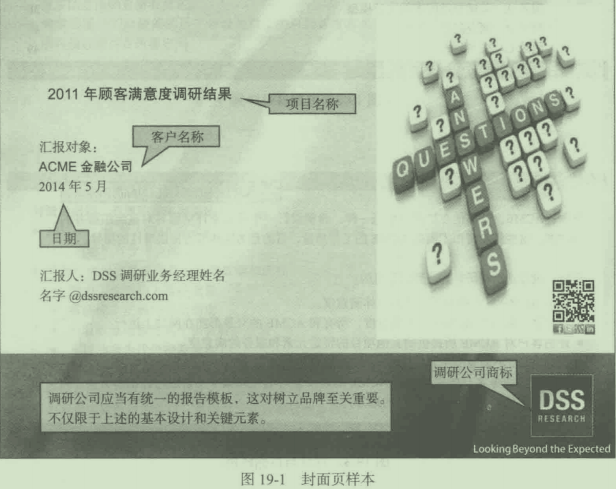

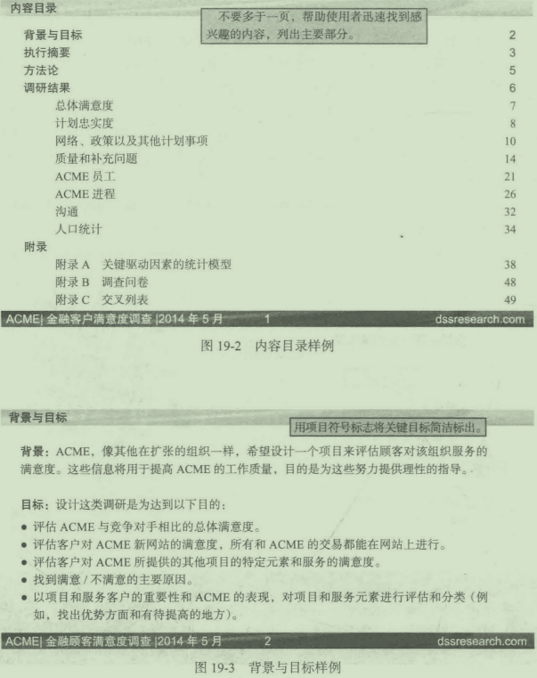

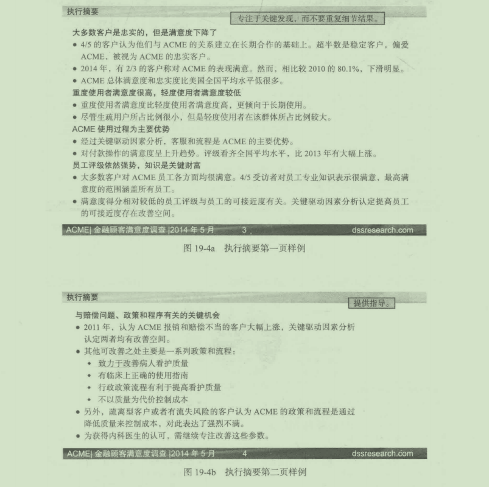

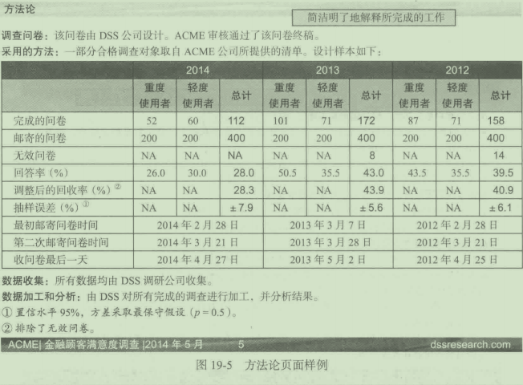

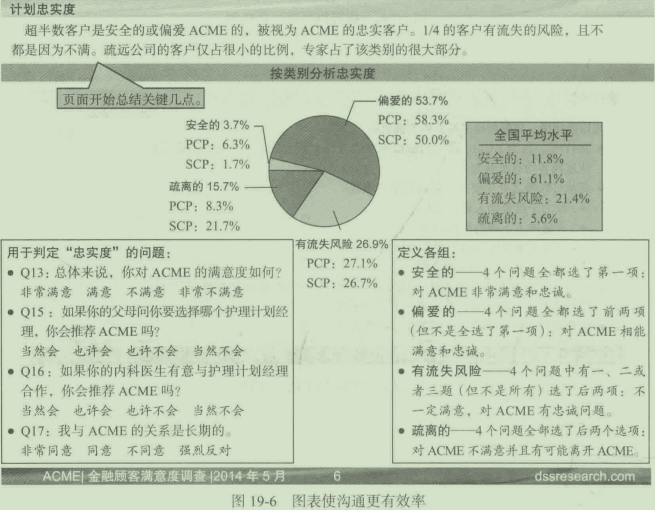

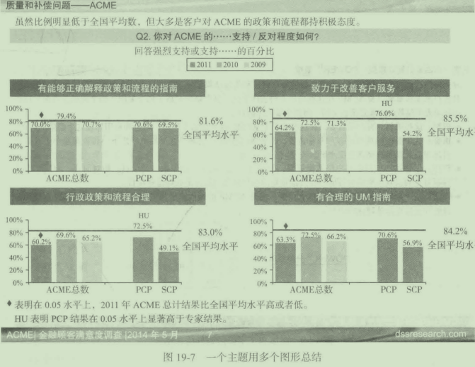

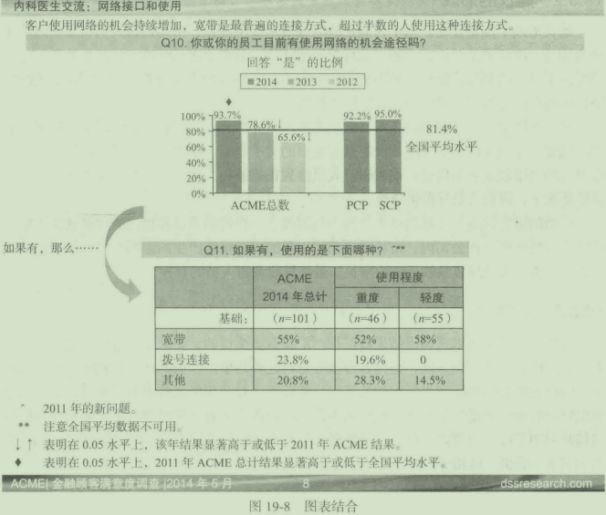

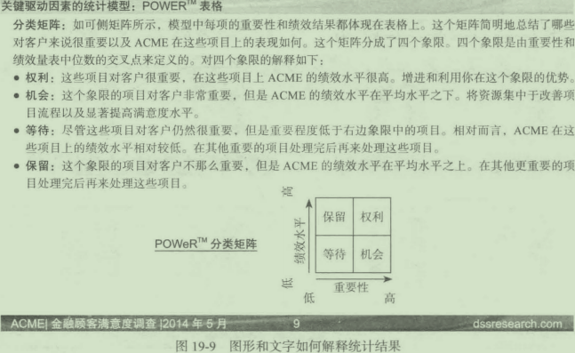

### 19.3.2建议的形成

建议形成于推论过程。为了为制定战略或战术提供建议，市场调研人员将结论运用于特定领域。建议通常关注客户如何获得差异化优势。潜在的市场营销组合产生的差异化优势提供f真正的利益，目标市场部能从别处获得这种潜在的市场营销组合（例如，美国航空公司拥有独占的在外国机场卸载货物的权利）。

在一些情况下，市场调研人员必须拒绝提出具体的建议，取而代之的是更一般化的建议。例如，市场调研人员可能并没有掌握足够的关于资源、基千公司经验的信息或关千接收报告的决策制定者的信息；或者研究人员接到正式通知，建议巾决策制定者来制定。在这些情况下，研究人员仅提供结论。

最后的报告代表了市场调研入员努力的制高点。报告的质趾和提出的建议通常决定了回馈报告提供商。在公司内，市场调研部门出具的内部报告产生的影响较少，但是出具优秀报告的传统可能导致绩效工资的增长，最终导致调研人员的晋升。

### 19. 3. 3汇报

有些客户可能要求将调研结果做汇报。汇报有多个目的，要求有关方面齐聚一堂，重新认识调研目标和调研方法，也为各方倾听意料之外的事件、调研结果和相关依据提供机会，同时还能展示调研结果提出相关建议。实际上，对公司的某些决策者来说，听汇报是他们唯一接触调研结果的时候，他们从不读调研报告。还有一些经理只会大致浏览调研报告借此回想汇报中的要点。总之，高效展示沟通绝对是至关蜇要的。“市场调研实例19- 3"为如何展示提供一些指导。

高效汇报指南

传达准确信息的人是好的调研人员，传达商业洞见的人是伟大的调研人员。对于很多研究经理来说，一大挑战是如何才能被视为积极参与公司战略决策的、富有洞察力的思考者，而不仅仅是“数据库”，除了调研所得的数据以外毫无贡献。

假设你是一个市场调研人员，拥有数年的工作经验，所做的汇报也都为人称道。你很有可能巳经达到了事业的某个关键节点－你巳经不再满足千只做一个负责调研数据的调研人员，你想扮演更重要的、更具战略意义的角色。简言之，你希望能有机会坐在那些讨论你调研报告意义的决策者中间。

怎样才能成为其中一员呢？或者说怎样才能提振事业，被人挖掘？首先要从汇报开始一要意识到“还不错“真的只是不错而巳。我自己既听过几百场口头汇报（很多无聊透顶）也做过上百场口头汇报，展示对象从中层管理者到公司董事会，我认为转型成为决策者的最好方式就是做出这样的口头汇报：一要有趣；二要提供与决策相关的、有意义的洞见。换言之，如果你想跻身公司高层，你就要给出高水平的汇报。

按照下列指南所说，给出高效的调研汇报。

改变观点

那如何才能做出高层次的汇报，并从最高管理层获取更积极的反响呢？你怎样去改变组织内部观点认为你只是一个老老实实负责数据的人呢？

首先，我们要明白数据是一回事，而数据的意义或者它对于企业的真正内涵，又是另外一回事。许多调研汇报过长，过于学木化和概念化。在需要有洞见的地方充斥着数据。

做汇报的目的不是向你的客户展现你的付出，也不是炫耀你对于某一个话题的知识。相反，它的目的在于传达洞见，帮助客户更轻松地做出关键决策。高层管理者只想知道，“根据你的调研，下个周二我们要采取什么不同的措施“。

如果你有这个倾向（其实我们也都有），即对你亲手收集整理出来的数据有感情的话，要想做出有影响力的汇报，第一步就是挥刀砍向你的数据“丛林”，除掉与重点相关度不高的所有数据。严谨地修剪完以后，就可以开始学习如何分别开来之不易的原始数据与数据支撑起来的更重要的商业洞见。

遵守以下“五绝”

我观察和指导别人做展示巳逾25年，见过很棒的汇报，也见过很烂的汇报。一个有吸引力且高效的汇报是由多个方面促成的。如果坚持我下文提出的“五绝”原则，一般而言你的汇报对象一定会兴趣盎然，接受你传达的讯息、一更重要的是，有所行动。

(1)紧凑。很多调研汇报似乎都是称重论斤卖，动不动七八十页，甚至更多。在今天的商业氛围里，人们连40页都没时间读完，更不要说80页了。结论要简洁，专注于洞见。不要在调研所用的方法论细节和调研技巧上浪费时间，没人会在乎的。管理层相信你有能力做好，他们只想知道你发现了什么。

(2)简单。我们所做的工作往往很复杂，但是我们的成功往往依赖于能否将其简单地呈现出来一以好让听汇报的人轻松地跟上我们。有时候，为了保持一个口头汇报的简短，我们常常竞相比较谁能在一张PPT页面上装进尽可能多的信息、J数据又不是你的子女，不妨把它们扔到一边需要牢记，要向展示观众传达最重要的讯息，还要控制住告诉他们全城所有细节的冲动。

(3)专注千客户的需求，而不是你的需求。任何情况下，你要做的都是吸引客户一所有一切都与他们有关。商业汇报的目的不是展示你工作多么勤奋，你调研模型多棒，也不是为了汇报你对展示软件的高超应用，你只需要解释调研结果对于企业来说意味着什么就好。

(4)吸引自己，也要吸引别人。让客户感到无聊可不是你的权利！我认识的一个研究者曾经说过：“我们能有多兴奋？研究而已嘛。＂唉！如果我们想让别人把我们当回事，而且相信我们能为战略讨论带来价值，我们首先要吸引住自己，兴奋和热情是有感染力的。我们的汇报是在讲有趣的“故事”，不是念字典。

(5)冒险。为了成为尽善尽美的专家，我们中的很多人对于数据的准确性非常痴迷，结果，我们有时会拒绝做出任何超出调研结果的结论。其实，执行官们每天都会根据并非面面俱到的信息做出有分寸的猜测。如果我们不能和他们一样接受不确定性，根据详细情报冒险，我们就无法成为决策者中的一员。和这些大佬们起头并进一去冒险，寻求答案，解释调研结果的内涵

捕捉那些少有人告诉你的信息

如果你的汇报充满了严谨的表格、内容密集的展示页面、大位的信息和对方法论的细致讨论，很有可能就是你的观众已经感到无聊透顶了，但他们不会告诉你的＾汇报也好，人生也好，大多数人倾向于把那些消极的看法藏在内心，因为他们不想伤害你，尤其是在他们把你视作一个数据怪物的时候～

“高层管理者很想告诉你，但是不能告诉你的五句话。”

(1)"我们已经被你弄得无聊死了'

(2)"够了，别再扯数据了，我们要做什么？”

(3)"我不能一天都坐这儿听你的汇报一下次把50页改成10页怎么样？”

(4)"我不在乎你用了哪些巧妙的方法一公司运行得怎么样？”

(5)"你能不能有个角度呢？”

想要你的观众看起来津津有味、兴趣盎然，而不是空洞和茫然无神吗？那就向他们清晰、简洁地汇报你的商业洞见吧，不要一味追求数据。

努力让人以新的视角对你＂刮目相看”

洞见不需要密集的图表，需要的是清晰、简洁、凝练的信息，管理决策者不需要知道你调研细节，只想知道你的调研对公司业务的影响和意义。想要成为他们中的一员吗？那就把你调研的影响意义，为什么它对公司很重要汇报给公司的决策者一汇报文件应不多千15页－你会发现自己巳经让别人刮目相看，也会成为战略圆桌讨论的常客。

问题：

1. 作者所说的＂冒险”是什么意思？有什么风险？可能会有什么回报？
2. 要形成洞见需要什么？不需要什么？
3. 如果你的汇报充满了严谨的表格、内容密集的展示页面、大量的信息和对方法论的细致讨论，可能会对你的客户产生什么影呴？
4. 汇报者如何能吸引其观众？

## 19. 4进行汇报

有效的汇报应以听众为核心展开。汇报者不仅要充分考虑听众偏好、态度、偏见、教育背景和时间因素，而且还应注意相关的词语、概念，对不易理解的数字进行解释。良好的汇报应在汇报最后留出时间供听众提问，并对此开展讨论。

汇报失败的原因：其一或许在千没有充分理解本章开始所列举的阻碍有效沟通的因素；其二是没有意识到或不承认调研报告的目的在千说服。这当然不是说要歪曲事实，而是调研的发现来强化调研的建议和结论。

在准备汇报的过程中．调研人员应时刻注意以下几个问题：

- 数据的真正含义是什么？

- 它们有什么影响？

- 我们能从数据中获得些什么？

- 在现有的条件下我们应做些什么？

- 将来如何进一步提高这类研究水平？

- 如何能使这些信息得到更有效的运用？

在互联网上展示汇报

有了PPT,将PPT展示发布在网站上更容易了。将PPT展示发布到网站上使个人能够使用，不管他们在哪里或者什么时候需要。另外，调研人员能够将结果发布在互联网的不同位匮。发布的步骤非常简单：

(1)打开PPT。看吞幻灯片发布在网站上看起来的效果，从“文件”菜单选择“网页预览＂。在进行完编辑后，从相同的菜单栏选择“以网页格式保存”。

(2)"另存为“对话框允许改变PPT展示的标题，改成任何你想要在访间者的浏览器中显示的标题。

(3)点击“发布”按钮，进入“发布为网页”对话框，在这里你可以自定义你的展示。

(4)"Web选项”对话框让你指定发布文件的方式，并将发布文件储存在服务器，也可以指定是否自动更新内部链接。

市场调研人员的＂愿望清单”

市场调研人员参与公司的技术研发并不罕见。Confirmit是一家市场调研公司，在针对市场调研软件的调研中，对那些调研人员做了调查，希望获得新兴的行业走势反馈，摸清整个行业中技术所起的作用。近期的一个研究发现了结果汇报环节发生的一些变化和研究者相关软件的使用情况。

时间跨度为一年，Confirmit发现调研报告的各个汇报方式的使用比例发生了巨大变化。PowerPoint展示工具使用率一直最大，但是从56%下降到了48%<. ,微软文字处理文档、打印的表格以及AcrobatPDF的使用都下降了。在线结果汇报没有变化，互动分析作为唯一使用率上升的沟通方式，从8%涨到10%,轻微上涨。尽管似乎有许多调研人员使用多格式(multifonnat)汇报方式，但这种模式的比例也在下滑C虽然52%的公司认为交叉列表报告的制作能力非常重要，但是真正用到的公司只有14%。

调研人员对分析、报告工具的改善意见主要集中于两大点：第一，74%的人把有关PowerPoint的问题列为“前三项＂，希望软件开发者能解决必须手动将导入的图表转换成展示材料的问题，将其自动化；第二，3/5的应答者认为在线分析工具目前令人不大满意，他们正在积极寻找可替代的方式，38%的人将更好的桌面分析工具作为“前三项”。

问题：

1. 你认为哪一种汇报方式对调研报告来说最有用？会不会有些方式更适合某些具体情况的要求？你会使用多格式方式汇报吗？

2. 你有没有用软件生成过调研报告？生成的结果如何？以你自己的经验为基础，你的“愿望清单”里，你最希望优先买现哪个愿望？

## 本章小结

一份全面的市场调研报告的七个部分，桉顺序分别是：标题页、目录、执行摘要、背景、方法论、结论、附带支持性信息的附录。

调研报告的主要目标是陈述具体的调研目的，解释为什么以及如何展开调研，汇报调研发现，提出结论和建议。这些元素中的大部分都包含在执行摘要中。结论中不一定要包含从调研中提取的统计数据，但需要总结与所陈述的目标相关的结果。结论部分也不给出企业应该采取什么行动的建议。这留给建议部分，建议运用结论指导具体的营销战略或战术，帮助企业在市场中建立有利地位。

现在的调研报告大量使用图形来陈述关键发现，大多数调研人员使用PPT来创建调研报告。至于方法，报告将文字的使用量最小化，将信息以“最小字节“传递给客户，并且大量使用图表。除了撰写报告—- Jt. ~:lffi. itJ;~~l~PPT的内容，还需要报告调研结果。通常情况下，客户或者在客户的要求下的调研人员会将研究报告发布在互联网上。这位客户组织遍布全球的员工都能阅读报告创造了有利条件。互联网也能用于支持在不同的地点同时报告调研结果。

## 复习思考题

1. 调研报告有什么作用？试举例说明。

2. 区分调研报告中的发现、结论和建议。

3. 为什么调研报告中应该包含执行摘要？执行摘要应该包含哪些内容？

美国联合慈善总会

有些拒绝为美国慈善总会捐赠的人声称对慈善总会有意见，所以慈善总会很关注这些人的态度，另外慈善总会还对使非捐赠者转变成捐赠者的因素很感兴趣。该调研报告的执行摘要见下文下面的标题及标题下方的正文都来自PowerPoint页面，该展示是由进行调研的公司提供的

执行摘要目标与方法论

- 本调研的主要目的是厘清非捐赠者对联合慈善会的看法、非捐赠的原因和促使非捐赠者日后捐赠的因素。

- 该调研依靠在线调研收集数据。

- 调研使用的是概率抽样。

- 726人给出了回复

结果

- 对联合慈善会持积极看法的比例比消极看法的多，但是大多数人对此没有倾向。

- 只有5. 2%的人认为慈善总会在帮助需要援助的人方面表现差劲。

- 慈善总会管理用费只占捐款总额的9%~10%,但80. 6%的人认为慈善总会的行政费用超过了JO%。

- 不捐赠的主要原因为：向宗教组织等其他慈善机构捐赠，缺乏对捐赠资金使用的了解，个人观点，没有喜欢的慈善机构，捐赠压力以及宁愿选择捐赠时间等。

- 被要求捐赠时，压力反而常常成为他们不捐赠的一个重要因素。

- 那些表示因个人经济状况做出不捐决定的人中，35. 6%表示，如果被邀，会向慈善总会捐赠。

- 很明显，在捐赠方面，其他慈善机构、宗教派别和慈善总会呈竞争态势。

- 很多回复者表示，如果他们能够指定接受捐赠的慈善机构，对慈善总会和它所支持的慈善机构有更多了解，被要求捐赠，捐赠压力小一点，能通过扣除工资方式捐赠以及在捐资发放上有更多选择的话，他们会捐赌的。

- 雇主参与慈善总会活动，员工被要求参加，49. 6%的此类员工没有参加。

- 公司活动能影响为数不少的高收入人群，如执行官、专家和管理人员，但是大量低收入群体、服务人员不包含其中。

结论

- 消极看法不是不捐的主要原因，而积极看法不一定就意味着捐赠。
- 非捐赠者缺乏有关慈善总会的足够信息，无法对该组织有准确认识。
- 有一些人对慈善总会和它捐资流向的组织缺乏认识和了解。
- 回复者对慈善总会管理费用的预期高千真实费用。
- 为获得有限的捐赠，慈善总会处于竞争中。

建议

- 就不捐老对慈善总会及其使命的了解，进行新的调研。

- 对潜在捐赠者进行“扫盲＂，内容主要有关慈善总会的使命、所支持的组织、总会的正常支出等。

- 工作场合多办活动，开发新途径促进对捐赠方式的认识。

- 适当采用有竞争力的市场营销策略来应对慈善总会的竟争对手。

问题：

1. 你认为执行摘要提供了有助于决策的信息吗？

2. 上文都包含了本章所讨论的执行摘要应包含的所有元素吗？

3. 发现、结论和建议在逻辑上与目标一致吗？为什么呢？

## 案例分析19- 2

TouchWell店铺概念与命名调研

TouchWell是一家医疗保险规划公司，主要经营区域为得克萨斯，包括达拉斯－沃斯堡地区(DFW)、休斯敦、奥斯汀和圣安东尼奥。Toucbwell希望能医疗保险行业的变化，目前形势：

- 60%的消费者是通过就业单位和配偶就业单位购买保险的。

- 8%的消费者自己直接从保险公司购买保险。

- 16%的消费者购买的是政府项目，包括老年医疗保险(Medicare)和残障、低收入者医疗保险。

- 16%的人未投保。

2010年通过的《保护患者与平价医疗法案》将给TouchWell及其他保险公司的行业背景带来一些变化：

- 用人单位开始放弃购买员工保险，通过用人单位购买保险的消费者比例将下降，尤其是小规模用人单位。

- 以前由用人单位购买保险的多数消费者将会自己直接从保险公司购买，医疗保险市场2013年成立，得到联邦政府或州政府支持。

- 未购买保险的人群可以在上述医疗保险市场购买，政府将有一定额度的补贴，补贴额最高达100%。

多数消费者会选择自己直接从保险公司购买保险，这意味着医疗保险像其他消费品一样，品牌的重要性越来越突出，TouchWell需要与消费者建立更密切的关系，为此进行了这个调研。为应对这些变化，TouchWell的管理层决定在它所服务的整片市场选定地点开设店铺，为消费者与医疗保险公司沟通互动提供便利的渠道。他们注意到，其他地区的医疗保险公司也开了实体店铺，为保持竞争力，TouchWell也需要这样做。TouchWell执行官希望弄清店铺概念在不同地区、对不同人群的总体吸引力，检验他们提出的各种店铺的名称并量化各种店铺特点的相对重要性。

TouchWell近期的调研所用的方法论和部分调研结果见下文。

问题：

1. 请评价这个展示的总体有效性。页面是否简明易懂？是否能高效传达关键信息？为改善展示，你有什么建议吗？

2. 请评价“总体概念吸引力”结果页面。这个页面传达了什么信息？有没有清晰的图景？如果要改变的话，你会对这条信息的展示做出怎样的改变？

3. 请评价”名字对比“结果页面。很多经理偏爱"Toucbwell护理吧”这个名字。你会对这些经理说什么？以这个调研结果为基础，在所有被检验的名字中，你的第一选择是什么？第二选择呢？第三选择呢？

4. 服务吸引力将如何影响你对开设的服务种类的建议？使用可能性又将如何影响建议？你认为哪一个最重要？

5. 有关护理中心的关键特点，你有怎样的建议？

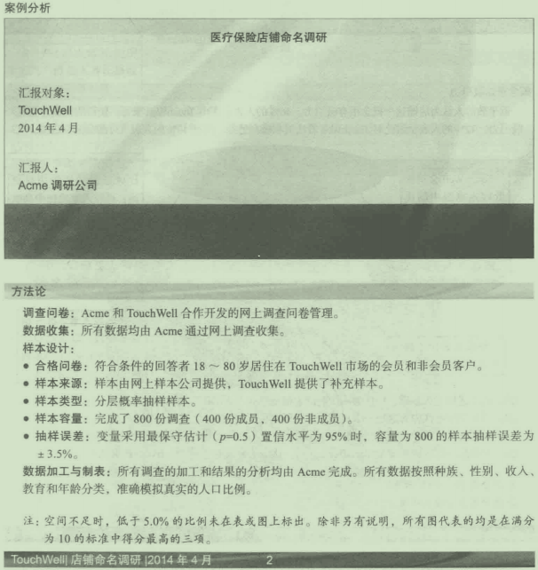
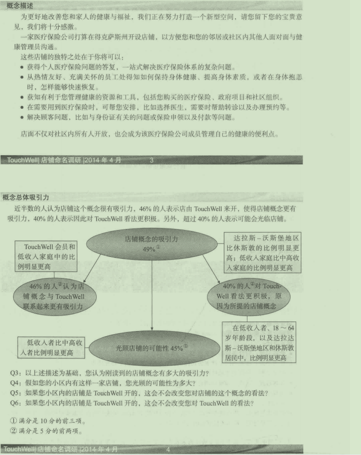
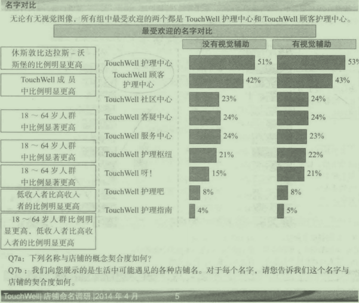
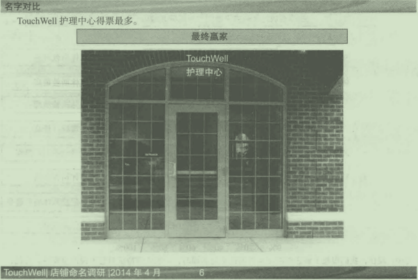
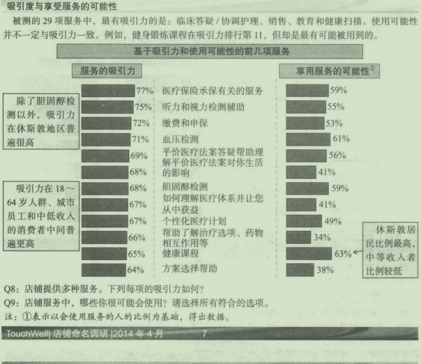
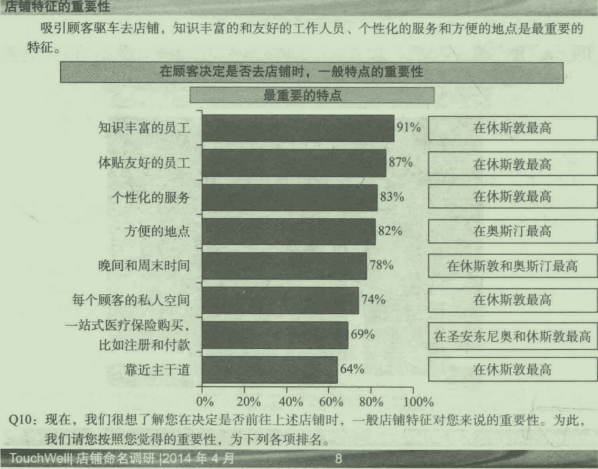
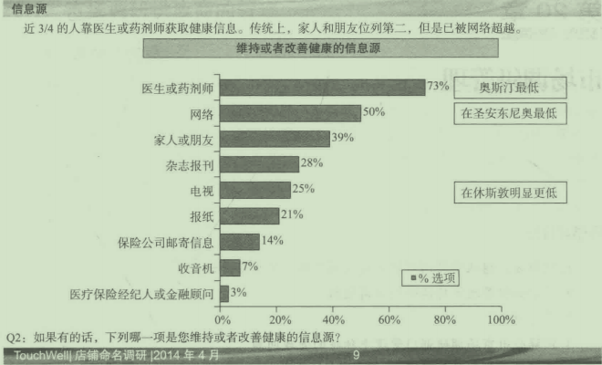
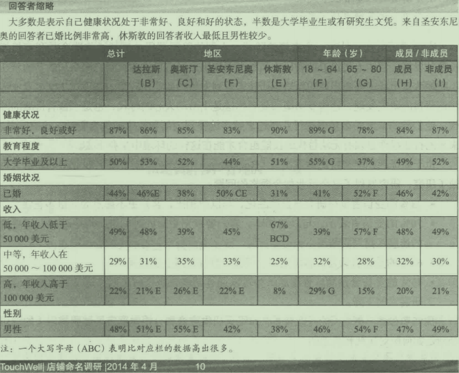

