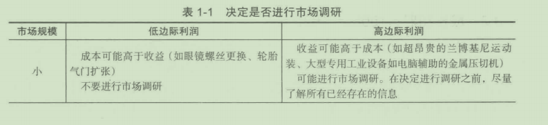

# 第 1 章 市场调研在管理决策中的作用

## 学习目标

1. 回顾营销观念和营销组合
2. 了解管理者做决策时所处的营销环境
3. 了解市场调研的历史
   
   欢迎来到迷人的市场调研世界！市场调研如何帮助管理者实现目标？市场调研领域如何发展？有什么巨大变化正在发生？我们将在第1章探讨这些主题。

##   1.1 市场营销的实质

   **市场营销**(marketing)是为顾客、客户、合作伙伴和整个社会创造、沟通、传送并交换有价值产品的活动、一系列组织和过程。良好的顾客关系通常会产生交易，这种交易是产品或服务与金钱进行的交换。只有当至少存在两方并且每一方都拥有对对方有潜在价值的东西时，才存在交换的潜在可能性。当双方能够沟通并传递所期望的产品或服务时，交换才能发生。

   营销经理如何促进交换呢？他们迫守＂恰当“原理，即在恰当的地点、恰当的时间，以恰当的价格，使用恰当的促销方式，把恰当的商品或服务卖给恰当的人。＂恰当“原理表明，营销经理要如何对许多最终决定营销成功的因素进行控制。为了做出“恰当的＂决策，管理者必须及时地获取制定决策所需的信息，市场调研就是提供这种信息的一种主要渠逍。

### 1.1.1 营销观念

   为了有效实现组织目标，现今的公司已经接受了具有消费者导向、目标导向和系统导向的**营销观念**( marketing concept) 。

   营销观念的第一要素是**消费者导向**(consumer orientation),是指企业应尽力识别最有可能购买它们产品的个人或企业（目标市场），同时生产或提供在激烈竞争中能够最有效地满足目标顾客需求的产品或服务。

   营销观念的第二个要素是 目标导向 (goal orientation ), 即企 业 消费者导向的程度应能 够保证实现企业的目标 。 对于以盈利为目的的企业，这些目标通常以财务标准为中心，例 如 15 % 的投资回报率。

   营销观念的第三个要素是 系统导向 (s ystems orientation) 。系统是一个 协调运行或运 作的有组织的整体，或者能够构成一个整体的分散单位。对企业来说，表面上的消费者导 向与事实上的消费者导向是一回书。要实现真正的消费者导向，首先，企业必须建立能够 发现消费者需求并识别市场机会的系统。正如后面要谈到的，识别目标市场需求和市场机 会足市场调研的任务。其次，信息必须反馈给企业。没有来自市场的反馈，企业也就谈不 上真正的消费者导向。

### 1.1.2 市场调研的机会导向
市场调研是一个发现市场机会的出色工具。中档连锁酒店 ， 比如假日洒店（尤其是少
千 150 个 房间的酒店） ， 经常不能产生足够的客流量来支持一个全方位服务的餐厅。假日
酒店调查了 10 000 位顾客，发现顾客大部分是商务人员、销售人员和政府员工，这些人
透露出 ， 他们不想简单地待在自己的房间里 、 他们想要在其他人周围。

假日洒店管理层判定洒吧应该在酒店中扮演更重要的角色。社会中心会调整假日酒店
的午餐和挽餐菜单，使之适应能够被分享的酒吧食物，比如美味的肉丸、芝麻鸡翅、汉堡
以及一些重要的主菜 ，比 如牛排和蛙鱼俱乐部三明治。

这些改变允许酒吧员工提供更多食物，反过来，也允许假日酒店的特许经营人通过减
少餐厅员工来限定劳动力成本，尤其是在一天中的悠闲时间。

### 1.1.3 外部营销环境
   随着时间的推移 ， 以及消费者和企业所处的生存、工作、竞争和制定购买决策的环境 的变化，企业必须对 营销组合 ( marketing mix ) 进行调整。这往往意味着一些新的消费者 和企业将成为目标市场的 一部分 ，而另 一些将退出市 场；那些仍旧属于目标市场的顾客与 原始的消费者相比，也可能会有与以往不同的爱好、需求、收入、生活方式和购买习惯。

   尽管管理者能够控制营销组合，但他们却无法控制那些外部环境中不断影响和重新塑 造目标市场的因素。除非管理者了解所处的外部环境 ， 否则企业不能科学地规划未来，并 且组织常常没有意识到正是外部的力量影响了它们的未来 。

   市场调研是了解外部环境的 一 种关键手段 。了 解外部环境不仅有助于企业改变目前的 营销组合，而且还有助于识别新的市场机会。 

   例如 ， 约翰 · 迪尔 ( John Deal ), 一位圣路易斯的居民 ， 受命用一项市场调研来确定 当地那些以浴室和厨房电器用具及其附件为特色的小型连锁店（两三个店）的潜在需求。 调研结果是确定的，千是约翰决定进行进一步研究。互联网在 他的 连锁店中应该扮演什么 样的角色？这个问题引起了约翰的关注。幸运的是 ，他 得到了埃森哲咨询公司的一项以 “无缝零售" ( Seamless Retail ) 为题的研究 ， 几项重点内容如下 ：

`49%的消费者相信，零售商能提升购物体验的最好方法就是更好地融合店内的、网上的以及移动的渠道；89%的消费者认为，对零售商来说，无论他们选择哪种销售渠道，以最便利的方式购得产品是最重要的。报告显示，一致性对消费者体验十分重要：73%的消费者期待零售商的网上价格和店内价格一致；61%的消费者期待零售商的网上促销和店内促销一致（当被问到在去实体店之前，来自他们最喜爱的零售商的哪种信息最为实用时，82%的消费者把获得当前产品的实用性作为他们的首选49%参与调研的人受到店内提供物的影响（如促销展示、销售人员），56%的人受到电子赠券和提供物的影响，并且有相同数量的人说他们受到邮寄到家的赠券的影响。实际上有69%(预期为62%)的人说，网上弹出的广告以及移动横幅广告从未影响他们的购买。`

研读这些报告之后，约翰立即制定了一套有关网络及传统零售店的有效的整体零售战略

## 1.2 市场调研与决策制定

市场调研在营销系统中扮演着两种重要角色：首先、它是市场情报反馈过程的一部分， 向决策者提供关千当前营销组合有效性的信息和进行必要变革的线索；其次，它是探索新 的市场机会的基本工具 。 市场细分调研和产品都有助于营销经理识别最有利可图的市场 机会 。

### 1. 2 .1 市场调研定义
   了解市场调研在整个传销系统中所处的位笠后｀我们再看一下美国市场营销协会 (AMA) 对市场调研所下的正式定义：

   `市场调研是一种通过信息将消费者、顾客和公众与营销者连接起来的职能 这些信息用于识别和确定营销机会及问题，产生、提炼和评估营销活动，监督营 销绩效，改进人们对营销过程的理解 。 市场调研规定了解决这些问题所需 的 信 息，设计了收集信息的方法，管理并实施信息收集过程，分析结果，最后要沟通 所得的结论及其意义 。`

   我们更倾向千另一种定义：市场调研(marketing research)是指对背销决策柜关数据进行计划、收集和分析，并把分析结果与管理者进行沟通的过程

###   1.2.2 市场调研对管理的重要性
   市场调研可以被认为发挥了三种功能作用：描述、诊断和预测。它的描述功能(descriptive function)包括收集并呈现对事实的陈述。行业中的历史销售趋势是什么样的？消费者对于一种产品的态度和信念是什么？打开熏肉的包装是一个脏活．喜爱熏肉的人不得不将手仲进包装内，并且，如果他们只是取出其中的几片，是没有很好的方式来存放剩余部分的。奥斯卡麦尔公司(Oscar Mayer)的市场调研人员获知f许多消费者对千早期熏肉包装的厌恶，所以营销入员考虑到最好的解决办法就是包装的创新，通过将其放置千可重新塑封的塑料袋或用塑料和锡纸包装来避免累人的工作。执行这项多余的任务能够保证最后一片熏肉和第一片一样新鲜。

   最近，奥斯卡麦尔切片熏肉引进了一种新的“保鲜封口盘＂。可翻转的顶盖能够很容易地存取里面的熏肉，关上顶盖之后能够随时重复密封，扁平的盘子能够在冰箱中方便地储存。

   调研的第二个作用是诊断功能(diagnostic function),通常用来解释数据和活动。例如，奥斯卡麦尔改变包装设计对销擞有什么影响？如何改变产品／服务供应来更好地服务顾客和潜在消费者？由千小孩子每年都会食用50亿盎司e的番茄酱，亨氏(Heinz)认为，重度使用者（小孩子）对于如何更有趣地使用番茄酱应该有很多要说的（通过市场调研）。享氏倾听并观察孩子们使用番茄酱，最后形成了新的瓶子设计和名称。真正的番茄酱行家促成了亨氏EZSquirt番茄酱的诞生！

   调研的最后一个作用是预测功能(predictive function)。在不断变化的市场中企业如何更好地利用所出现的机会？博马努瓦(Bonobos)是美国最大的一直以网络为基础的服装品牌，它们认为与客户对话（市场调研）能帮助它们创造出更合身的男裤标志线。它们的调研把客户带入设计的过程来创造成功的产品。市场调研已经为博马努瓦识别出不同的目标市场，如“运动者”“隔壁的人”和“穿红裤子的人”。

#### 1. 对质量和客户满意度的不懈追求

在今天的市场中．质措和顾客满意度巳经成为关键的竞争武器 。 近些年美国汽车业巳 经成为最艰难的产业之一，但是现在汽车制造商的运营状况和进口齐头并进，它们的口号 是质旦和客户服务 。 正如 一 位汽车公司高管所言：

`如果你回到很短一段时间以前，我们整体的客户理念是把车批发给一个中间 商，然后这个中间商把车卖给客户 。 我们从不希望收到客户的消息，因为如果这 样，就意味着出了状况 。 今天，我们想要和客户建立一个遍及全部拥有体验的对 话，我们想要和客户讨论这个过程中的每一个步骤，我们想要成为一个消费者－ 产品和服务公司，这仅仅是在汽车业务中 。`

市场调研在哪里发挥作用? J. D. Power Awards 以客户满意度水平为基础为汽车排名． 这反过来推动了特定公司和型号的销售 。 雷克萨斯在许多质歉和客户满意度研究中一直做 得很好。这帮助增加了 lS 、 LS 和 RS 型号的销售 。 在一些雷克萨斯经销商那里，在换汕 的时候，你能得到 一 次美甲和一次按摩服务 。 汽车制造商用市场调研来帮助设计者，决定 什么新特征要加到特定的型号中，并且了解它们的汽车如何累计这些有竞争力的特征。

质量对于顾客而言意义不大，通常不会产生提高销售额、利润或市场份额的回报，质 量也代表着浪费精力和开销 。 今天的新观念是强调 质量回报 (return on quality) 。质量回报 有两层含义 ： 第一，企业所提供的高质报应是目标市场所需要的；第二，质量改进必须对 获利性产生积极影响 。 例如，银行巨头美国银行 (Bank of America) 根据获利性的改变来 衡量服务质置的每一点改进，包括从增加更多的营业员到提供新的抵押货款服务等。 REI, 一家总部位于西雅图的户外运动产品连锁店，有一个昵称“返还一切东西的股份有限公 司＂ 。 数以百计的退回商品堆积在箱子里 ， 悬挂在行李架 和 成 排的 货架上。标签上详 细 列 出了客户抱怨 ： “突然不防水 ” 写在一件几十年以前破损的蓝色男士雨衣上 ； “不合 适 ”写 在一双破旧到看不出设计的黑色女士厚木底鞋上 。

在另一家 REI 商店 ， 最近一个客户退回了 一 双为徒步旅行和在河中膛水而设计的女式 凉鞋 。 问题是什么？根据标签上所写，“不够性感 ” 。 几年以前 ， 一位华盛顿州的客户成功 地退回了一件 1970 年为爬瑞尼尔 山 而购买 的 REI 防雪装。

尽管在 2013 年，连锁店宣布今后只回购一年以内的商品 。 在这 种 情况下，夸大其词 的服务质量对质扯回报产生了消极影响 。

#### 2. 留住现有顾客具有至关重要的作用
 顾客满意度和顾客忠诚度之间存在一种必然的联系。长期的关系不是自然产生的，它植根千企业传递的服务和价值，正如REI的例子所展现的。留住顾客可以给企业带来丰厚的回报。重复购买和顾客推荐可以提高企业的收入和市场份额。由于企业可以不必花更多的资金和精力去争夺新顾客，因而成本可以下降。稳定的顾客更容易服务，因为他们已经熟悉企业的习惯，相应要求员工投入的时间也较少。企业留住顾客的能力也给员工带来了工作上的满足感和成就感，从而使企业员工的保留率更高。员工在企业工作时间越长，获得的知识越多，这样又可以提高企业的生产效率。

 贝恩咨询公司(Bain&Company)的一项研究估计．顾客流失率下降5%能够使利润迅速提高25%~95%;另一项研究表明，顾客保持率会对企业价值产生重要影响。

 留住顾客的能力建立在企业对顾客需求详细了解的基础上，这种了解主要来自于市场调研。例如，在经过详细的市场调研后，英国肮空公司(British Airways)改变了它在横跨大西洋航线上的头等舱服务。大多数航空公司对跨大西洋航线头等舱强调的都是高档服务，而英国航空公司通过调研发现，大多数头等舱的乘客希望的仅仅是能够睡安稳觉。现在，该公司头等舱的顾客可以在飞机起飞前，在头等舱休息室就餐。一旦登机后，他们就可以穿上英国航空公司提供的睡衣，枕在枕头上，盖上毯子，享受一次免受打扰的旅行。到达目的地后，头等舱的旅客可以吃早餐，进行梳妆和洗浴，并且可以在离开前穿上褽烫平整的衣服。这些变化都是在严格的市场调研推动下产生的。

###   1.2.3 了解持续变化的市场
 市场调研有助于管理者了解市场趋势以及利用市场机会。从营销出现开始，市场调研就巳经开始进行应用了。当早期的排尼基人在地中海沿岸各港口之间进行交易时就进行了市场需求的调研；马可波罗日记也记载了在中国旅行时，他所执行的正是市场调研的职能；甚至有证据表明，西班牙人在探索新大陆时就曾系统地进行过市场调研；另外也存在文艺复兴时期从事市场调研的例子。

###   1.2.4 社交媒体和用户生成内容
 在过去的几年里，促销世界已经完全颠毅了。以前，营销人员创建一条消息，然后一个或一系列传统媒体，如电视、报刊、广播、广告牌把信息传递给目标市场。现在和以前和比，更多人参与博客、论坛、虚拟社区、产品／服务评论文辛［思考一下猫途鹰(TripAdvisor)]以及创建用户生成内容(UGC)的补交媒体网站在犯罪地点所表达的观点是主动提供的，一般是诚实的、坦臼的、激昂的，并且能够是极其体贴的。像推特(Twitter)、脸谱网(Facebook)、领英(Linkedln)这样的社交媒体｀一天之内会产生几百万条有关产品和服务的评论。其中20%的推文是关于品牌的。

2003年，数字媒体占比低千电视和报刊等广告开销的10%;2008年，其份额略高于10%。根据实力传播集闭(Zenith Optimedia)和TNS媒体怕报公司(TNS MediaIntelligence)的数据，到2013年巳超过了20%,、

市场调研人员正逐步获得这些大数据流来确定人们如何看待他们自己以及竞争对手的产品和服务。调研人员在网上建立入们的个人和案，用这些数据来确定促销努力的目标；其他调研人员利用虚拟社区来创建新的产品和服务。

智能手机导致了在媒体使用方式和购买决定制定方而的主要改变。包括平板电脑、传统电脑和电视在内，研究发现，消费者也许同时看四个不同的屏幕，调研入员现在必须衡鼠消费者的内容消费以及他们跨越全部四个屏幕的广告接触ESPN,一个运动网络，正在从五个平台收集数据，分别是广播、电视、电脑、智能手机和平板电脑。

### 1.2.5 市场调研的主动性
了解营销系统的性质对于成功地实现营销导向是十分必要的。如果对影响目标市场和营销组合的因素有一个彻底的了解，那么管理将是主动的而不是被动的。主动的管理意昧着通过调整营销组合来适应新的经济、社会、科技和竞争环境，而被动的管理则是等到对公司有重大影响的变化出现时才决定采取什么行动将剧烈变化的忤销环境看作是一种威胁（被动态度）还是一种机会（主动态度）差别很大。例如，苹果公司(Apple)对把尖端科技产品引入市场十分积极，这反过来为公司带来了巨大的利益。

一位主动的管理者不仅要发现即将出现的市场，而且会通过战略计划的制订尽力为企业提供长期的营销战略(marketing strategy)。基千现有的和将来的内部能力以及预计的外部环境的变化，战略计划可以用来指导企业资源的长期使用9一个好的战略计划是在出色的市场调研基础上得出的，它有助千企业实现长期利润和市场占有率目标。

### 1.2.6 应用性调研与基础性调研
实际上，从卓任何市场调研都是为了更好地了解市场，发现战略失败的原因，或是减少营销决策中的不确定性。出千这些目的所进行的市场调研叫作应用性调研(applied research)。例如.D心omo的冷冻比萨价格应该提高40美分吗？韦田应该为新款轿车选择一个什么名字?A和B两个广告哪个有更寐的同忆度？另一方面，基础性或纯粹性调研(basic or pure research)则是为了拓展新的知识领域，它并不以某个具体的实际问题为目标。基础性调研的目的足为现有的理论提供证明或者对某一概念或现象获得更多的了解。例如，基础性调研可能检验一个关千高度复杂的决策问题的假设，或者检验一个关千消费者信息处理问题的假设。从长期吞来，基础性调研有助千更多地了解我们所生活的世界通常，基础性调研的结果通常在短期内不能被管理者所应用。现在大多数基础性调研都在大学中进行，调研结果被刊登在一些期刊七，如《市场调研杂志》(The Journalof Marketing Research)和《市场营销杂志》(The Journal of Marketing)这样的出版物上。相反企业所做的大多数调研都是应用性的，因为它们必须在成本上划算并且对于决策人员有明显的价值。

尽管基础性调研在一些公司．尤其是商科技公司依111觅要，但上市时间的概念巳经改变f。更确切地说，基础性调研可以是适当长期的，但必须集中下最终解决现实世界的间题进叮基础性调研的公司包括基因泰克(Genentech)、思科系统(CiscoSystems)和谷歌(Google)例如，谷歌进行的基础性调研推动了应用性调研，这促成了自动驾驶汽车的诞生。

### 1.2.7 应用性调研的本质

市场调研可以分成三个大类：计划性、选择性和评估性计划性调研(programmatic research)的实施是通过市场细分、市场机会分析，或者通过消费者态度与产品使用研究来确定付销决策；选择性调研(selective research)用千测试备选决策，如测试新产品的概念、广告方案测试和试销等；评估性调研(evaluative research)用千评估项目绩效，它包括跟踪广告回忆度，进行组织形象研究和考察顾客对千企业服务质卧的态度等。

计划性调研产生千管理部门对定期获取市场概况的盂求。例如，产品管理部门会关注现有市场信息库对于制定决策来说不充分或巳经过期，或者秤销计划会需要关于新产品、广告官传或包装的介绍，尤论什么特定的情况，都需要当前的信息来进行可行的营销选择。通常的计划性调研包括以下信息：

- 目标市场发生变化了吗？是如何变化的？
- 该市场显示出新的细分机会了吗？
- 对于企业的营销投入，足不是有些细分市场吞起来更容易成为候选消费者？
- 在多样的细分市场中存在什么新的产品或服务机会？
  
  猛码山坐落丁恪杉矶和旧金山中间的塞拉内华达山脉，巳经为加利福尼亚州中部的滑 飞爱好者服务了 50 年。猛妈山有达到11000 英尺 e 的顶峰和年均 400 英尺的降雪量 ， 每 年都会有数以力计的游客成肝地来到这甩的滑雪坡和乡间旅舍
  
  但是 ． 这个旅游胜地为时已久的直邮项目并没有促使访问量提升。虽然景区没有失去
  游客（整个行业大多数骰区的交易忧都来自现有的滑丐爱好者 ， 而不是那些刚刚参加运动
  的游客），但行政部门希望通过向巳过时的营销官传中注入活力来实现在整体稳定的市场
  巾有所超越，并且提高数据库中 90 万游客光顾的频率 。
  
  景区行政部门使用了计划性调研，从一项年度调查一“国家滑雪和滑雪板爱好者意 见调杳" ( the National Skier and Snowboard Opinion Survey ) 中收集数据 ， 这项调查是代表 全围的景区进行的，调杳发现， 9 4% 的猛妈山游客是从互联网上寻找所需的信息 ，包 括从 大气咨询到查吞猛码山旅舍的房价。
  
这条信息导致了一个能联系 18 000 名预约者的电子邮件传销系统的诞生，这种形式
是非正式的且是告知型的。比如说：“随后这里的天气会非常好，雪的厚度有 12~14 英
尺，在山上任何地方都不会迷路 。 下午 l: 15, 主庄园的温度是 1 宅，天空晴朗，中到大
风。山顶风非常大，很冷 ， 只有 -8 屯．要确保穿得暖和 。 ”这项计划性调研的成果就是每
年增加了 5% 以上的滑雪访间数量 。

选择性调研通常是在计划性调研中确定了几个可行措施之后进行的 。 如果明显没有一 个备选是非常突出的，产品管理部门通常愿意去测试几个备选 。 然而，可能在营销过程中 的任意一步都需要选择性调研，比如当开发广告文案时，或者评估多种产品构想或评估整 体营销程序时，又或者在试销的过程中

当必须评估营销计划的效果和效率时，就产生了对评估性调研的需求 。 由千现在的绩 效表现而要改变计划或者需要全新选择的时候，像猛妈山的例子，评估性调研或许会被整 合到计划性调研中 。

### 1.2.8 决定是否开展市场调研

对于一个特定间题，管理者在面临几种解决问题的方案时，不应该凭直觉草率开展应
用性市场调研。事实上，首先需要做的决策是是否需要开展调研 。 在下述情况下，最好不
要做调研：

- 缺乏资源 。由于缺乏资源而没有市场调研可能性的情况有两种 。 首先，一个组织可
  能缺少正常开展调研所需的必要资金 。 如果一个项目要求样本达到 800 个被调研
  人员，但预算只允许调查 50 个人，那么就很难保证信息的质批 。 其次，一个组织
  或许能够提供调研的资金，但是没有足够的资金去实施调研所产生的任何决策。有
  时，小企业尤其缺乏创造有效营销组合必需的资源。例如，一个表演艺术团的经理
  可能完全同意市场调研项目提出的方案，但在项目完成两年后，该组织却由千资金
  缺乏而只能将方案束之高阁。
- 调研结果毫无用处 。有些类型的市场调研测量的是稳定顾客及潜在顾客的生活方式
  和个性特征因素。假设某项调研发现，一个自卑、内向但渴求成功的男人最可能光
  顾票据贴现经纪服务。但是，这个信息对千嘉信理财 (Charles Schwab) 贴现经纪
  服务的管理来说并没有什么价值 。
- 错过市场时机 。 如果已经错过成功进入某一市场的时机，那么就不应该开展市场
  调研。如果产品处于产品生命周期的成熟期或衰退期（比如磁带录音机或黑白电
  视机），此时还去做新产品导入调研将是非常愚蠢的 。 对于很快就能达到饱和的市
  场，情况也是如此，比如高价位冰激凌哈根达斯与本杰瑞 。 但是对于已经上市的产
  品，如果需要调整产品来适应消费者口味、竞争和其他因索的变化，调研还是必
  要的。
- 已经做出决策 。在现实的管理决策和企业政治中｀市场调研有时会被不恰当地使
  用 。 几年前，一家存款额超过 8 亿美元的银行进行了一项大型的市场谓研，目的
  是帮助高层管理者规划银行在以后 5 年的战略方向 。 银行总裁在听完汇报后说 ：

“我完全同意你们的建议，因为这正是我无论如何都要去做的 ！ 明天向董事会提交
战略计划时，我将会使用你们的调研 。 “调研入员接着间逍 ： “如果我的建议和您
的决定恰恰相反呢？”这家银行总裁笑逍 ： “那样他们就不会知道我曾经进行了 一
次市场调研了！”这个项目不仅仅浪费了金钱，而且还让调研人员怀疑这种行为的
“道德” 。
- 管理者还未对制定决策所需信息达成一致 。 尽管先明确目标再进行调研似乎是显而
  易见的道理，但有时情况并非如此 。 虽然开展初步的或探索性的调研有助千更好地
  认识间题的本质，但是大型的主要调研项目却不能这样做 。 如果有入说：＂噢，让
  我们先进行调研，然后就会更好地理解问题并知逍下 一 步该做什么了 。 ”这是 一 种
  错误的逻辑 。 调研的现象可能不准确，或者制定管理决策所必需的主要因素被忽
  略了 。
- 决策信息已经存在 。 有些企业对某个市场已经研究了很多年，充分了解目标顾客的
  特征以及目标顾客对现有产品的偏好 。 在这种情况下，再做进一步调研就是多余的
  并且浪费金钱 。 比如宝洁对咖啡市场巳经有了详细的了解，在进行了一些初始品尝
  实验之后，便迅速将福爵 (Fo lger ) 速溶咖啡推向美国市场，而并没有做进一步调
  研 。 莎莉公司 (The Sara Lee Corporatio n ) 在推出冷冻羊角面包时也采取了这种做
  法，桂格麦片公司 (Q uaker Oats) 的燕麦能量棒也是一样 。 但是，这个策略并不总
  是奏效 。 宝洁公司认为它已经彻底了解了镇痛剂市场，于是没有进行调研就推出了
  Encaprin 牌阿司匹林胶裳 。 但是，由千该产品相对于其他产品而言缺少独特的竞争
  优势而失败，宝洁公司最终只好退出市场 。
- 调研成本超过收益 。 如果与待定决策相关的进一步信息可以随时免费得到 ， 相信
  每位管理者都会接受信息，不过这种悄况几乎不存在 。 事实上，管理者可能不愿
  意为得到信息而付太多的钱或者等太长的时间 。 获取额外信息的意愿取决千管理
  者对信息的质值、价格和时效的认知 。 经理人愿意为充分的信息（即可以让人们
  准确无误做出决策的数据）支付更多的钱，而不是那些对千如何去做仍有不确定
  性的信息 。 因此，只有 当 信息的预期价值大于获取信息的成本时，调研才应当
  进行。
  
  潜在收益的两个蜇要决定条件是边际利润和市场规校 。 总的来说，假定产品具有同
  样的销售潜力，高边际利润的新产品要比低边际利润的产品更具有潜在收益；同样 ， 如果
  两个市场的竞争强度相同，那么大市场中的新产品机会要比小市场上提供更多的潜在收益
  （见表 1- I ) 。
  
  

## 1.3 市场调研的发展

在美国｀使用市场调研给管理者带来了很多益处，这也是促使人们开展市场调研的原 动力 。 以竞争优势的观点来看，企业能通过实行市场调研获得竞争优势 。 令人惊讶的是， 市场调研直到 20 世纪初才走出萌芽状态 。

### 1.3.1 初始阶段： 20 世纪之前
有记载的最早的市场调研足 1824 年 7 月巾宾夕法尼亚《哈里斯堡报》 (Harrisburg Pennsylvanian ) 进行的 。 那是一次投票选举 ， 其中安德彴 · 杰克逊 (An drew Jackson) 狄 得 335 票 ， 约翰 ． 昆西 · 亚当斯 ( John Quincy Adams) 获得 169 票，亨利· 克莱 (Henry Clay) 获得 29 票，威廉 H. 克劳福德 (W illiam H.Crawford) 获得 9 票 口 同年稍后时间，另 一家报纸《罗利星报》 ( Raleigh Star) 对在北卡罗米纳，州举行的具有民众意识的政治会议进 行了民意调查。或许首位市场调研人员是约翰 · 雅各布 · 阿斯特 (Jo hn Jacob Astor), 他在 18 世纪 9 0 年代雇用了一名画家来绘制时电的纽约妇女战的帕了的华图，以便于他能够限 上流行趋势 。

有正式记载的为制定营销决策而开展的第一次调研足 1879 年由广告代理商艾尔 (N. W. Ayer) 做的 。这是一次系统的市场调研，它对州和地方官员进行调查以决定谷物产机的 期望水平。调研目的是为农业设备制造者确定广告时间安排。第二次系统的调研可能足在 19 世纪末 20 世纪初由杜邦公司做的，它对推销人员提交的有关顾客特征的报告进行 f 系 统整理。对这次调研的反应十分强烈 。 负责获取并报告数据的推销人员由千不出欢额外的 书面工作而感到异常愤怒 。

学术研究者大约在 1895 年进入市场调研领域 。 当时，阳尼苏达大学的一名心坪学 教授哈洛·盖尔 (Har low Gale) 使用邮寄问卷调研方法研究广告 。 他邮寄了 200 份间卷， 最后收到 2 0 份完成的间卷，回收率为 10% 。之后不久，西北大学的沃尔特 D. 斯克特 ( Walter D. Scott) 也做 了一些开创性的工作。斯克特采用实验和心理学方法来研究刚起步 的广告实践 。

### 1.3.2 成长初期： 1900 ,__, 1920 年
进入 2 0 世纪后 ， 激增的消费者需求和大规模生产的发展导致更大、更远市场的出现 。 在传统的手工作坊下兼具卖者和工匠身份的人每天与市场接触的情况一去不复返，了解消 费者的购买习惯和对制造商产品的态度的需求应运而生 。 为适应这种需求 ， 问蒂斯出版 公司 ( Curtis Publishing Company) 在 1991 年设立了第 一 家正式的市场调研机构 ～ 该机构 的调研主要针对汽车业 ， 因为制造商认定那些有钱并且愿意购买汽车 的人 都已经 拥 有汽车 r. 因此制造商试图不断寻求新的消费者群以便对其进行促销 。 几年以后 ， 达尼尔 · 斯塔 奇 ( Daniel Starch ) 创立了广告反应的认知测度 ， 斯特 朗 (E.K. Strong) 提出了回忆测度和 市场调研鼠表 。

### 1.3.3 未成熟期： 1920 ,.._, 1950 年
珀西瓦尔 · 怀特 ( Percival White ) 首次将科学调研方法应用到解决商 业 问题中 。 怀特 下面的话反映了他对系统、持续的市场调研的认识 ：

`或许，公司拥有自己的市场分析部门的最大优势是将调研变成一个连续的过程，或者至少是可以定期分析的过程}这样，企业就可以在总体上检测市场和行业不断变化的环境勹应该把市场看作是不断变化的而不是固定的现象，这种必要性不容忽视。`

怀特关下市场调研的若作与上述观点并不一致。例如，除了简单提及一些美国人口普查局以外，他的书中没有使用统计和数学方法。

2 0 世纪 30 年代 ， 问卷调查法得到广泛使用 尼尔森 ( A.C. Nielsen ) 千 1922 年进入 调研服务业 。 他在怀特早期工作的基础上提 出“ 市场份额 ”概 念以及其 他 很多 种服 务 ，从 而为后来成为美国最大的市场调研机构之一奠定了基础 。 门到 20 世纪 30 年代末 ， 市场调 研才作为正式课程在大学校园中得到普及 。 知识的实质主体部分是巾实践和学术团体共同 开发的 。 两个重要的韦件 ， 即广播媒体的发展和第二次 世 界大战 ， 促 使 市场调 研由 一 门 不 成熟的学科演变为 一 个界定清楚的专业 。 社会学家发现，广播媒体创造了有趣的新现象并 且增大了人类行为的不确定性 。

到 20 世纪 30 年代末 ， 人们不再满足千对应答者回答的简单分析 ， 千是开始 根据收 入、性别和家庭地位等方面的差异被调研人员进行分类和比较 。 简单相关分析开始得到应 用 ， 但并不广泛 。 使用这种方法的人必须有条 件 借助当 时 该领域先驱所 做的 工作获得技术 等统计资源，如 G. Udney Yule 、 Mordecai Eze 灿 el 、 Horace Sechrist 等人 。 笫 二 次世界大战迫使社会学家从串前线所要求的调研 。 战前被认为是新奇韦物的一些 方法和工具被用 f 研究上兵的悄费行为以及后方家庭的消费行为，其 中 包括实验设计、民 意测验、人为因素调研和运芜学等 。

20 世纪 40 年代 ， 小组访谈在罗伯特 · 默顿 ( Robert Merton ) 的领导下发展起来。到 2 0 世纪 40 年代未 ， 随机抽样的重要性得到广泛的认识，在抽样方法和调查过程等方面 取 得了很大进步 。 少数曾在美国陆军军需部门服务的心理学家在第二次世界大战后进入企业 界 ， 推山了有关产品的消费者测试方法 。

### 1.3.4 成熟期： 1950 ,.._, 2000 年
由卖方市场向买方市场（游千第 二 次世界大战后被抑制的需求 ） 的转变要求更好的市
场悄报，生产者不再能够卖出他们生产的任何产品 。 生产设备、广告、存货成本的上涨以

及其他一些因素的成本增加，使得价格失败的可能性比以往大大增加 。 这时，重要的是通 过市场调研发现市场需求，然后生产产品满足这些需求 。

2 0 世纪 50 年代中期，主要依据容易区分的顾客人口统计特征提出了市场细分概念 。 同一时期，人们开始进行动机调研，重点分析消费者行为的原因 。 市场细分、动机分析 的基本概念与先进的调研技术的结合，产生了个人心理变化和利益细分等蜇要创新 。 20 世纪 60 年代，先后提出了许多描述性和预测性的数学模型，如随机模型、马尔可夫模型 ( Markovian model ) 和线性学习模型 。 更为重要的是 20 世纪 60 年代初计算机的快速发展 。 计霓机大大提高了调研人员快速分析、储存和检索大量信息的能力 。

### 1.3.5 互联的世界： 2000 ,__, 2010 年
互联网给市场调研带来了意义深远的改变 。 在一次全球调查中， 94% 的调研公司表明 它们在进行在线调研 。 一些公司正逐步集中于移动访谈，在智能手机、苹果手机、黑苺、 机器人等上进行移动自我完善 。 当今， 56% 的美国成年人有 一 部智能手机，超过 98% 的 美国人能连接互联网 。

互联网对市场调研人员有许多益处：

- 提供更快的商业情报获得途径，有利千更好更快地制定决策 。
- 提高公司对消费者需求和市场变化的反应能力 。
- 促进实施进一步研究和纵向调研 。
- 削减劳力和时间密集调研活动的相关成本，包括邮寄、电话营销、数据录入和报告 的成本 。
  
  在市场调研中，实施调研和分析大量使用者数据不是互联网革命的全部 。 互联网同时 大大增强了调研过程和信息传播的管理，尤其是互联网极大影响了几个关键领域 ：
  
- **作为信息来源，最终被替代的图书馆和多样的印刷材料**。在网页上，美国人口普查 局 ( [http:](http:) //www. cen s u s.g o v) 表明计划逐渐使互联网成为分类人口普查数据的主要 方式 。 许多其他的政府机构也是如此 。 大量数据库（政府的和非政府的）中的信息 能够即刻从使用者的电脑桌面、笔记本、智能手机、电子书阅读器 (Kindle) 、平板 电脑等中提取出来 。
  
- 征求建议书 (RFP) 的分配和建议书本身 。公司现在能够快速高效地把征求建议书 发送到调研供应商的可选择邮件列表中，然后供应商再把建议书和邮件给客户发回 去 。 这个过程过去需要几天时间，现在只要几个小时 。
  
- 客户和调研供应商在调研计划管理上的协商 。调研入员和客户在进行电话讨论时也 许同时盯着电脑屏幕看建议、征求建议书、报告或一些其他的统计分析 。 这是非常 快速高效的，因为样本容蜇、指标和调研计划其他方面的变化能随时讨论并立刻做 出调整 。
  
- 数据管理和网上分析 。客户能通过调研供应商的安全网页很便利地看到他们的调查 并且实时管理巳收集的数据 。 调查进行过程中，实际上客户能够用复杂的工具来实

施数据分析 。 这种实时分析能够让调查问卷、样本容员或调查对象类型改变 。 调研
供应商和客户成为即时市场调研的合作者 。

- 公布和报告分配 。报告以及主要文字处理、总分析表和演示软件安装包的最新版本
  都可以用 Power Point 等程序直接发布到网上，这意味着世界各地的合适管理者几
  乎能即时看到结果 。 报告的具体利益内容可以在用来看报告的同一个网页浏览器
  搜到 。
- 市场调研调查的口语展示。分散在各处的观众都可以 看到。全世界的管理者可以在
  密码保护网页上看到并且听到真实的客户端展示 。 这为公司节省了时间和金钱，因
  为管理者不再需要去中心会议场所 。
  
### 1.3.6 大数据： 2010 年至今
  市场调研中最热的行话是大数据 。 很有趣的是，大部分学者从不费心去定义这个术
  语，所以不确定人们总是说的是否是同一件事 。 为了我们的目标，我们把 大数据 ( big
  data) 定义为大量信息的积累和分析 。 每天每秒三次，我们生成等蜇数据，美国国会图书
  馆有全部的打印集 。

  直到最近，管理者分析排列数据受到限制。已排列的数据由固定的答案和巳按行列排
  列的数字构成 。 这些数据很容易储存、归类、询间、分析和报告 。 排列数据的格式有几个
  例子：心你是 a. 男人 b. 女人？＠你觉得这个餐馆 a. 很棒 b. 不错 C. 一般 d. 很差？第二个
  问题中的数据交错着性别数据来确定多少男人和多少女人觉得这个餐馆”很棒＂ 。 分析是
  简单直接的 。

  突破发生在 2009 年分析非排列和自由形式数据的新算法的创建 。 现在数据科学家可
  以分析 YouTube 视频、社交媒体的文章、网页点击行为、 GPS 追踪数据、卫星影像、视
  频流公众监督视频、店内跟踪摄像机等 。

  所以市场营销者如何使用大数据来提高他们的盈利能力？这有 一 个例子 。

` 奇科 (Chico's FAS) 公司，总部位于佛罗里达州迈尔斯堡的个人品牌女装特 色零售商，在脸谱网 、 推特和 YouTube 以及讨论论坛和博客上看到了消费者关于 品牌的评论 。 利用社交媒体分析工具，奇科能够找到品牌的关键影响因素，决定 品牌相关的网上对话如何影响商业结果 。 这些发现最终指导了品牌和交流战略以 及顾客关注努力 。 奇科的工厂实时识别与品牌相关的推文，并以观点和作者的影 响程度分类 。 然后公司会对重要的评论做出回应 。`

  国际咨询公司麦肯锡说，使用大数据和适当分析的公司能使其生产力和利润比竞争者
  高 5%~6% 。 大数据的巨大价值意味着大数据科技和服务市场增长 31%, 到 2 016 年总收
  入将达 240 亿美元 。

  用于分析大数据的数学超出了本书的范畴 。 然而，我们将在第 4 章从管理者和使用者
  的角度更加详细地讨论大数据的本质和益处 。

  “市场调研实践 1-1" 中表明，大数据不是围绕市场调研环境的唯 一改变的代理商。

### 市场调研实践 1-1

 **会改变市场调研世界的儿种力量**

`约瑟夫 · 吕德霍尔姆 ( Joseph Rydholm ) 是行业中最流行、最具影响力的商业杂志 《夸克》 ( Qui r k ) 市场调研评论的编辑 。 约瑟夫引用 Quart z- 一个专注于他们看到的力量 和因素形成全球经济的网上新闻资源 。 约瑟夫沉思这些力量会对市场调研世界产生什么 影响 。`

`(1) 移动网络 。在更便宜的智能手机和仅仅花费 10 美元的非智能手机之间，附加上 银行业、信息产业和能够在任何设置上运行的社会网络服务，了解地球上每个人的可能性 比以前更为真实 ， 像手表和基于脸的电脑的新方式因素会如何改变我们的网络体验呢？ 可能对市场调研产生的影响 ： 很明显一段时间之后这是一种方式，但是谷歌眼镜或像 Pebble 手表这样的产品对市场调研意味着什么呢？”可穿戴计算＂仅仅是互联网的延伸， 还是对于调查对象和调研人员或者消费者和公司是一种全新的相互作用形式呢？`

`(2)数字货币。网络、手机和新型消费终端使得提升信用卡交易或者同时去除这些东西的支付机械成为可能。这是一个盈利的业务，也是支付部门巳经看到了硅谷任一公司上市前的最高价值的原因。同时，比特币(Bitcoin)及其模仿者的增加意味着无国界的虚拟货币能够独立成为其他货币或支付方式之间的重要媒介。在新兴市场中，手机支付使得电信公司成为银行。`

`可能对市场调研产生的影响：随着时间推移，几种小额付款的自然增长能够比进入“从未有人嬴过＂的比赛对调查对象更具吸引力吗？这些支付（小额或其他）必须是货币形式吗?Quartz称自己为“无国界的虚拟货币＂，它会作为一种优先支付方式参与研究吗？`

我们如何购买

随着全球中产阶级的持续增加，从玉米到汽车再到空调，消费者花在每件东西上的金钱都达到新高峰，在线互动，新兴经济发展如此之快......什么类型的公司和产品满足这些变化的需求呢？消费在发展的经济中如何转变？实体零售店的未来如何？电子商务运营和传统的买体企业真是零和博弈吗？消费如何塑造全球贸易和经济？变化的政治潮流又如何影响消费呢？

可能对市场调研产生的影响：这使你头晕。我认为Quartz的问题列表如果不向我请求更多投入，其本身是完全令人难以置信的。

问题：
1. 你认为这些力量会如何影响商业和市场调研？

2. 哪个主题对商业最有影呴力？为什么？

## 本章小结

市场营销是为顾客创造、沟通并传递价值 ， 以及以利于组织和股东的方式管理顾客关
系的组织 功 能和 一 系列过程 （ 第 8 版为 “ 市场营销是为顾客、客户、合作伙伴和整个社会
创造、沟通、传送并交换有价值产品的活动、一系列组织和过程,,) 。 营销经理试图在恰当
的地点 、 恰当的时间，以恰当的价格 ， 使用恰当的促销方式 ， 把恰当的商品或服务卖给恰
当的人．这只有遵循市场营销观念才能得以实现 市场营销观念是基于消费者导向、目标
导向和系统导向的

营销经理必须在组织内部环境中工作，同时又必须了解几乎不能控制的外部环境 。 营
销经理可以控制的主要变量包括渠道、价格、促销和产品决策 ， 这四个变量的独特组合称
为营销组合。

市场调研在向管理者提供制定营销组合所需信息方面发挥非常重要的作用 。 由于管理
者越来越关注顾客满意度和留住顾客 ， 市场调研的重要性不断提高 。 同时，它也是进行主
动管理的重要工具 。 只有当预期收益大于成本时 ， 才应该进行市场调研 。
市场调研可以被描述成计划性的、选择性的或评估性的 。 计划性调研是通过市场细
分、市场机会分析，或者通过消费者态度与产品使用研究来制定营销决策 ； 选择性调研用
于测试备选决策 ； 评估性调研用于评估项目绩效 。

在美国，市场调研的历史可以追溯到 1824 年，当时进行了第一次民意测验 ； 成长初
期为 1900 ~ 1920 年，以第一个正式市场调研部门的建立为标志 ； 市场调研未成熟期为
1920 ~ 1950 年 ， 这时能看到市场调研的广泛应用 ； 市场调研的成熟期开始于 1950 年 ，
持续到 2000 年 。

互联网对市场调研行业具有重大的影响 。 因为在线调研可以快速部署 ， 成本显著降
低 ， 即时的个性化，具有高的回应率并且能够联系难以接近的受访者等优点 ， 在线调研的
使用急剧增加 。 最为重要的是，随着家庭的网络接入的增加，相同的线上和线下调研巳经
表明会产生相同的商业决策 。

市场调研为网络找到了许多其他的应用 。 网络起到了信息来源的作用，帮助 RFP 和
建议书的散发 ， 促进客户和调研提供商 在 管理调研项目中的协作 ， 提供数据管理和 在 线分
析 ， 并且使出版物、报告和口头汇报能被各地的观众收到和看到 。

我们现在处于大数据时代 ， 复杂的新型分析非排列数据的方式的发展成为可能 非排
列数据包括脸谱网帖子和 YouTube 视频等 。 大数据分析为巳掌握技术的公司带来生产力和
利润的增长 。

## 复习思考题

### 1． 营销的作用是创造交易 。 市场调研在使交易更为便利时发挥了什么作用？
### 2 传统的市场调研巳与消费品的制造相联系 。 如今日益增加的营利性和非营利性组织都在 使用市场调研 。 你认为为什么会有这种趋势？请举出一些例子 。

### 3. 解释市场调研与营销概念之间的联系 。
### 4. 请评论以下一个商业区餐厅老板的陈述 ： “我天天看到我的顾客，我们的关系十分密切， 互相直呼其名 ． 我了解他们的喜恶 。 如果我放在菜单上的食品卖不出去 ， 我就知道他们 不喜欢 。 我也通过阅读《现代餐厅》 ( modern res taurants ) 来了解行业的发展趋势 ， 这就 是我需要去做的市场调研 "

### 5. 为什么市场调研对于营销执行管理人员很重要呢？请给出一些原因 。
###    6 对以下几个对象进行市场调研时你会注意到哪些不同 ： O 零售商 ； ＠消费品生产商； ＠工业品生产商 ； ＠）慈善组织 。
### 7. 评论以下内容 ： 拉尔夫 · 莫兰正计划对圣路易斯的一家新餐厅投资 150 万美元 。 当他申 请建设融资贷款的时候，银行的工作人员问他是否进行了市场调研 。 拉尔夫回答：“我 对市场调研行情进行了调研 ， 一家市场调研公司为这些工作索要 2 万美元 。 我觉得在开 展一项新业务时，与其他花费相比，调研太奢侈了，没有调研我一样可以做到 。 ”
### 8. " 质量回报 ” 是什么含义？你认为这个概念为什么这样演化？请举出一些例子 。
### 9. 描述下不应当进行市场调研的三种情况，并解释这为什么是正确的 。
###     10. 为以下几个情况举例 ： <D 市场调研的描述性功能；＠市场调研的诊断性功能 ； ＠市场调研的预测性功能。
###         11 使用互联网和网页浏览器访问搜索引擎 ， 比如谷歌或 Bing , 并输入“市场调研＂ 。 从 几千个选项 中 选择一个感兴趣的网站 ， 并 在 课堂上报告该网站的内容。
###     12. 将班级分成四组 ， 每组都要参观一个大型组织（营利性或非营利性的），并且与营销总 监进行一次访谈 ， 来探究企业是怎么使用市场调研的 。 随后，每组都应该在课堂上报 告自己的发现 。
###   13. 互联网是如何改变市场调研领域的？
###     14. 解释大数据的概念 。

### 调研实例 1 - 1

  **给我 一 张可以网上使用的赠券**

   既然消费者都喜欢赠券，零售商坚持用什么来盈利呢？研究表明，除明显的消费者利 益外 ， 赠券对零售商的利润有重要影响。因为根据网上购物者情报机构中波斯顿 ( Boston ) 调研公司比赛的研究 ， 获得赠券者很可能消费更多，有更高 的 满意度，重复购买使用过赠 券的零售商 。

   一半以上上一次网上购物时使用优惠码的消费者说 ， 如果他们没有收到这个折扣，也 不会买这些东西 一 57 % 的人说不， 43 % 的人说是 一~ 现在更多的网上购物 者使用赠券 。 1/3 的网上购物者表明网上购物时通常使用赠券网站 ， 3 500 万消费者每月浏 览赠券网站。赠券有很高的投资回报 ， 因为消费 者 收到的小 折 扣会激励他们花更多钱。当 被问到最近一次网 上 购买他们花了多少时 ， 使用赠券的消费者的花费几乎是未使用赠券的 消费者的两倍（使用赌券者为 216 美元，未使用赌券者为 122 美元）。

   赌券是零售商和消费者建立好感，增加消费者满意度的有效方式。当问到他们所有的 购物经历，使用赠券消费者的满意度高于未使用赠券者一 92% 使用赠券的消费者感到很 满意 ， 高于 88 % 未使用赠券的消费者。和未使用赠券的消费者相比，使用赠券的消费者 更可能 再 次向零售商购买。 91% 使用赠券的消费者很可能再次向兑换赠券 的 零售商购买， 高于 86% 未使用赌券的消费者。

#### 问题：
1. 家得宝这样的公司会如何使用这些信息？亚马逊会像家得宝一样使用赠券战略吗？
2. 你认为家得宝在实施黯券战略之前需要更多的市场调研吗？如果是，需要知道些 什么？
3. 你认为实施市场调研对网上零售商是必需的吗？为什么？
   
### 调研实例 1-2
   **是否任何人都能够成为市场调研人员**

   最近谷歌宣布向任何想做市场调研的人提供谷歌消费者调查 (www.g oogle.com/ insights/consumersurvey) 。谷歌宣布这项服务向任何人提供 ，从 《财富》 500 强到“地方 自行车店＂ 。 以对传统市场调研是快速准确低成本的选择进行宣传 。 谷歌调查网页标注 “用谷歌消费者调查，选择目标观众，输入问题，几小时内就能查看结果，只需几天而不 是几周就能查看完整的结果”。谷歌标注使用者可以测试产品概念，监测品牌，测量消费 者满意度等 。

   谷歌消费者调查的创建者保罗 · 麦克唐纳 ( Paul McDonald) 强调了市场调研行业对这 项服务的几点担心 。 “我认为你对来自自助服务调查平台的数据质量的担心在调研组织中 是广为人知的，“麦克唐纳写道，“正如圣歌所言，＇输入的是错误数据 ，输出的也 是错误 数据' ...... 我们尝试鼓励在帮助内容、项目政策中买践最优调查，通过提供调查模板帮助 新的调研人员 。 最后，我们提供平台用来建立专业且统计准确的调查 。 ”

   **问题：**

1. 打开谷歌的消费者调查网页。点击运行之后，你能感觉足够用来创建网络调查吗？ 为什么？
   
2. 你认为市场调研行业需要担心谷歌消费者调查吗？为什么？
3. 大多数传统消费者调研包括一系列人口统计特征，如性别、年龄和住址等。谷歌消 费者调查不问这些问题，而是利用调查对象的 IP 地址和 DoubleClick cookie 来推测大致的 人口统计和住址信息 ，离调查对象最近的城市由其 IP 地址确定 。收入和城市密度可以通 过 定位人口普查区，使用人口普查数据来推算；年龄和性别可以通过调查对象之前在谷歌展 示广告网络上使用 DoubleClick cookie 浏览的网页类型来推算 。 谷歌表示这些信息用来确保 每次调研都能收到代表性的样本，使调研人员能够看到分组人口如何回答问题 。 推测这些 人口统计数据能让调研人员在调研中向消费者问几个问题，这反过来会增加回应的消费者 数量 。 你认为这种方法比简单地问人口统计问题更好吗？你能用谷歌方法论看到问题吗？ 
