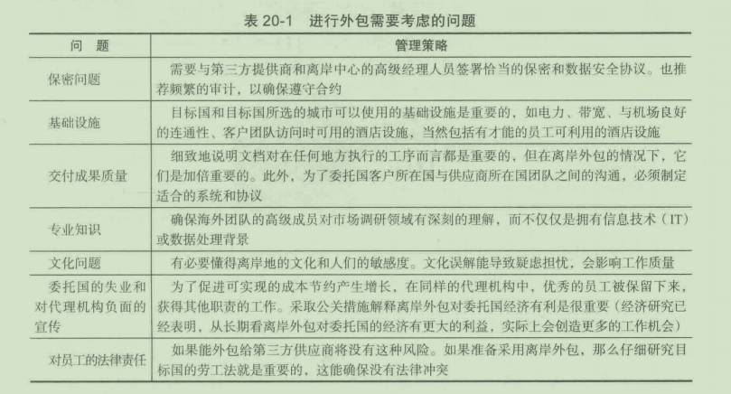
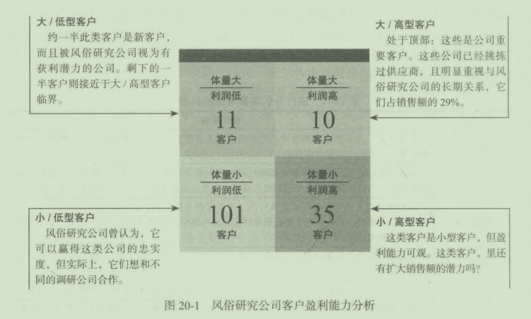
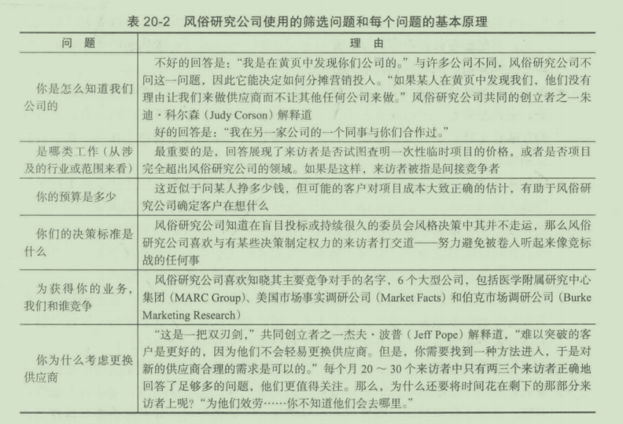
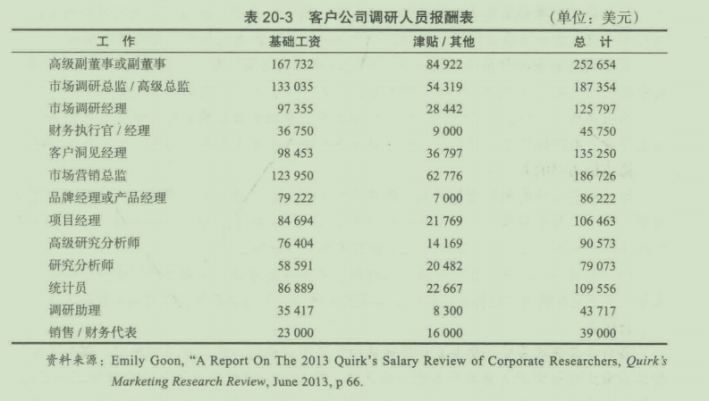
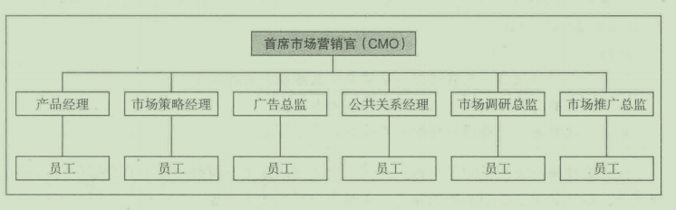
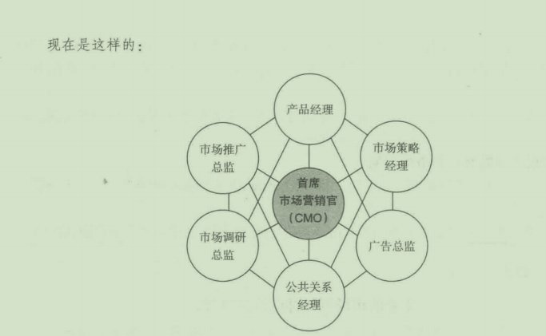
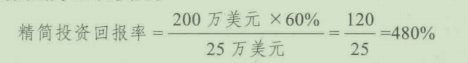
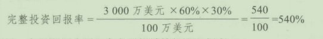
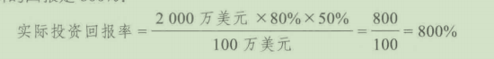
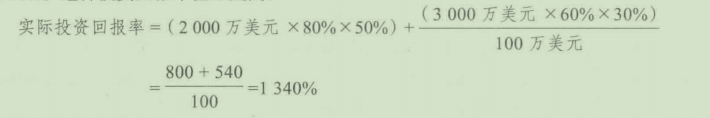

## 第20章 市场调研管理

**学习目标**

1.理解客户想从市场调研供应商或调研部门那里获得什么
2.了解如何管理市场调研供应商组织
3.学习沟通
4.理解公司市场调研部门管理中独特的管理问题
5.学习客户盈利能力管理
6.了解公司人事管理和发展
7.学习如何管理市场调研部门

市场调研行业正处在一个有趣的阶段。大型的跨国调研公司通过收购合并和有机增长茧壮发展，营销人员也迫使调研人员不得不做出更多有价值的贡献，网络和数字创新在不断地改变市场，不断出现的新兴调研技术得到发展和商业化应用。一项对249名专业市场调研员的研究发现，这些专家型回复者称这是个激动人心的时代，也是个富有挑战的时代。他们预测未来的市场调研行业将越来越多地受到创新和技术的综合驱动。这意味着，未来的行业经理必须有无法替代的技能组合才能在这样的环境中生存下去。

位于新泽西州萨米特的洛克霍普(Rock hopper) 研究公司对512名职业市场调研人员做了研究，研究发现了这个行业如今面临的问题：

- 73%的受访者觉得研究日益商品化，与以前相比，客户更不愿意为质量多花钱。
- 70%的受访者表示，与以前相比，客户要求用更短的时间进行调研项目，用更快
的速度汇报调研结果。
- 63%的受访者认为，非研究型管理层会自行在网上进行调研。
- 45%的受访者预测，管理层认为可以通过网络获悉任何东西，这会导致对基础调
研需求的下降。

我们来看看，在今天的行业背景，市场调研供应商和公司内部市场调研部门里的调研
经理是如何应对挑战和机遇的。

## 20.1 市场调研供应商的管理
### 20.1.1 客户的需求

管理市场调研供应商涉及了解客户需求与期望、与客户保持良好的沟通、有效地管理调研过程、良好的时间管理、成本管理和客户盈利能力管理。如果大型组织中的市场调研部门为本组织进行调研，那么它也会同样而临这些管理间题。如果组织外包调研，那么优秀的管理就需要选择合适的供应商。调研部门也必须尽力在组织营销决策制定过程中发挥更大的作用，尽力避免成为＂命令接受者”。

市场趋势公司(MarketDirections) 是密苏里州堪萨斯的一家市场调研公司，它对全美范闱内的市场调研客户做了一个调研，请他们对有关调研公司与调研部门的几个陈述的蜇要性进行排序。概括来自各个行业的数据，得出以下10条：

(1) 保守客户的机密。

(2) 诚信。

(3) 准时。

(4) 灵活。

(5) 按照项目规范说明书递交报告。

(6) 提供高质量的结果。

(7) 响应客户的需求。

(8) 高质量控制标准。

(9) 与客户互动中坚持顾客导向。

(1O) 让客户了解整个项目的进展。

最重要的两个因素是保守机密与诚信，这是伦理道德间题，已经在本书前面部分讨论了，其余的因素都是与管理调研职能以及保持良好沟通方面相关的。

**市场调研客户管理的“十诫＂**

如果你想和客户建立长期的合作关系无论是在事业上还是在其他方面，形成自己的一套与客户相处的哲学至关重要。我总结了自己过去10年的成功经验和失败教训，以下是我的客户管理”十诫"。

(1) 如果你和客户之间建立了稳固的关系，客户会包容你所犯的一两个错误。我们从“十诫＂中最重要的问题开始，因为其他“九诫”都是以这条为基础的。这就是为什么有些人为同一个客户进行了20个调研项目后，和客户的关系依然不咸不淡，而有些人只做了儿个项目就能更好地长期合作。

(2) 如果你与客户交谈时，顶多做到“不加分也不丢分＂，那就努力想想你要说的内容。我们对客户开口时只会有三种结果：加分；减分；不加分也不减分。和客户沟通时，当你说的话是加分项的时候，你能感觉得到；同理，你也会知递哪些话会让客户笑容僵硬。真正考验理解能力的是加分和减分中间的广大区间。你对中间部分的内容思考越多，就越有利于你。这么做是为了尽可能缩小中立区，尽量使想法落在加分区。

(3) 自始至终都要比客户多想两三步。在事情发生之前就有所考虑会提高工作的质量，对融合了科学与艺术的研究项目来说，向来都很重要。保持前瞻性能使艺木发挥作用一提高质量、增加创新点子。一天下来，客户就会放心把项目交到你手里，以后也会为你提供合作项目。

(4) 作为项目总监，你是创收人员的延伸，但你需要把为之投入努力的项目视如已出。项目总监是二把手，甚至可能是调研承包商的主要代表人，但并不负责增加或者创造收入。因此，项目总监很容易因为自己的次等地位，不卖力从而表现不佳、项目总监应明白，他们在客户面前的表现和创收人员一样重要。作为一名项目总监，如果你真的相信自已肩负着研究努力的结果，客户的研究体验就很可能是成功的。但是底线是项目总监和创收人员都需要对项目“视如已出”。

(5) 不要坐等客户做事。比如说，客户同意并签订了一个项目进程表，按照进程表，你周一将调查初稿发给客户，而客户则要在周三下午5点之前给出反馈，周三下午越来越近，而客户毫无动静，你可以继续想象顾客会在5点给出反馈｀也可以询问客户调查初稿是否有模糊之处需要解释。当然这么做实际上是为了提醒客户不要忘了截止日期。项目几乎所有的错误都会由你承担，你不能被动地坐等客户做事。

(6) 重要问题不能只凭与客户的口头交流一一要有文字记录。这不限于市场调研行业。你们就一个重要问题沟通过，最后对方观点不一致，出入很大，这种事情巳经发生过多少次？你要么坚持自己不是这么说的，要么坚持你说的意思和别人理解的不一样。如果只有口头语言，事情可能会变得非常混乱。如果你和客户就一个非常重要的问题对话，而除了口头语言以外没有其他文本，你很可能会有麻烦。为什么？因为当你与客户口径不一致时，就算你是对的，你都输了。

(7) 不时把你的观点让渡给客户有助千巩固合作伙伴关系。这可能是最有争议也是最难实现的一＂诫”了。这似乎与传统的客户管理技巧相悖，毕竟作为创收人员，我们的责任就是时不时为客户提供新颖的点子，证明其价值，建立客户对我们的信任。这是不错，但是人性是人们不愿意只做点头说可以的人。客户与创收人员在想法上有来有往，这样的关系是最好的。有时候，两个人有同样的想法则更好。

(8) 知道何时给客户打电话或者发电子邮件。既有积极的沟通形式（如面对面沟通和现场电话），也有消极的沟通形式（如电子邮件和语音信息）。知道如何正确地使用电话或邮件是无害性交流和灾难性沟通的分水岭。例如，客户委托你做一个跨国调研，涉及10个国家。按照调研进程表．周五的时候所有国家的数据应该巳经收集完毕，但是有两个国家拖了后腿。你决定采取新的调研方法来完成剩下的调查，除非能在项目的其他阶段弥补上，不然会比原先的安排晚一个星期给客户发邮件或者语音信息都是自找麻烦。但是，给客户发电子邮件或语音信息、请他给你打电话讨论一个问题是完全可以的。一般而言，任何消极甚至中立的事情都只能面对面交流，如果你不知道发电子邮件或语音消息是否恰当，那就不要发。

(9) 争取与客户多见面。有时候，用最大限度的方式处理问题，问题就会变得清晰明了假如你从不和客户见面，你和客户的关系能包容错误吗？当然不能。即使你和客户由于距离的原因不能定期见面，也要尽可能多地争取见面时间。

(10) 做最有利于项目的事，如果这些事也有利千你，那最好不过；如果对你不利，要以项目的利益为先。要想成功地管理客户，这一点至关重要。市场调研项目很容易自己跑偏一个看起来简单顺畅、进程清晰的项目，可能很快就脱轨。最后，所有一切围绕的中心是项目，不是你。这很残酷，如果项目束缚了你的生活，那又怎样？这只是暂时的。

**问题：**

1.和客户见面重不重要？你不能只靠电话、短信、邮件以及其他不需面对面沟通的方式吗？为什么这么说？

2.在关键问题上，能完全以与客户的口头聊天为依据吗？为什么？

3.你能坐等客户做他们该做的事情吗？说出你的理由。

近期对客户公司进行的调查显示，对调研供应商满意度普遍偏高(5分制下得分4.分）客户满意度最高的是数据质社和结果的准时回馈，而柜对成本得分最低。年度调查表叨、三大调研供应商的得分一丘很高，它们分别是位千辛辛那提的D订ectionsResearch公司、Burke公司、纽约雪城的KS&R公司。

巩固可接受供应商的数量

从2010年起，市场调研客户开始削减供应商，检查合同，看哪些合同可以淘汰，哪些布娑修改，哪些可以终止。根据客户所说，能留在客户调研供应商名单上的关键是供应商对公司的贡献这就意味着调研公司需要了解客户所在的行业，追踪行业趋势并为客户的独特需求bt体裁衣广

## 20.2 沟通

在供府商与客户之间建立良好关系的关键是良好的沟通。每个项目都应该安排一个联络入来充当供应商与客户的沟通纽带。在大型公司中，这个联络人可能是客户经理或项目经理，而在小公司中，他可能是公司所有者或合伙人。但是，无论职位头衔是什么，联络人都必须准确地、诚实地、频繁地与客户沟通。

在项口开始之前，联络入应该与客户仔细核对项目目标、研究方法、时间安排，以确保其中不存在任何误解。然后，客户应该在问卷上签字保证，这表叨客户同意，这一问卷足以收共到实现调研目标所需的原始数据。

约翰·科利亚斯(JohnColias) 是医学附屈研究中心调研公司(M凡lCResearch) 的副总裁，他就调研供应商与客户之间的沟通说了下面一番话：

当一家公司聘请一家市场调研公司来设计一项研究时，供应商必须作为调研人员和营销团队的一部分。为成为团队中的有效成员，供应商也必须深刻地理解市场营销问题。这种理解源于调研人员、营销人员和供应商之间进行的有关营销问题与经营决策的对话交流。这一对话使调研目标转化为具体的交付成果，这些交付成果直接影响经营决策

联络入必须弄清客户多长时间需要一次进度报告。至少每星期应该报告一次。报告的内容应该包括项目的进展状况、遇到的不同寻常的间题，如果是成本加成项目的话，还应有到目前巳发生的费用。成本加成是指实际成本加上追加提价以与开销持平。当一家大型公司（如福特汽车公司）的调研部门为另一个部门做调研项目时，通常会采用成本加成的形式。

## 20.3 项目经理的关键角色

巾于大多数调研项目都是巾粕对较大的调研供应商进行的｀因而与大多数调研客户进行互动的是项目经理而不是公司老板。但对千调研客户来说，项目经理就代表了供应商。上乘的项目经理会帮助客户确定调研目标，设计调研，完美执行调研，密切监控项目，以超出预期的方式汇报结果并就结果提供商业洞见。

不需要客户操心的项目总监，客户都愿意和他们反复合作。这种类型的项目总监懂得项目的方方面面且熟悉项目的目标。即使项目出现了一些问题，客户也衵信项口总监会解决这些问题。他们就像是安全网，使得客户确信项目的结局一定是圆满的而不是一闭籵肌拥有这种特质的项目总监提高了市场调研供应商的行业标准。

相反，差劲的项目经理可能会导致供应商流失客户。能破坏供应商和客户关系的行为如下：

- 项目经理从不露面、不履行责任，他把所有事悄交给一个无法回复问题或者解决间题的初级人员。
- 项目总监在项目出问题时不汇报，等到问题集中爆发的时候，客户被震惊到。
- 项目总是不能及时完成或者超出预算，且没有提前告知。

## 20.4 调研过程的管理
除良好的沟通之外，调研管理(researchmanagement) 有6项重要的目标：建立高效组织；保证数据质量；谡守时间进度表；成本控制；客户盈利能力管理；员工的管理与发展。项目经理对进程来说至关蜇要。针对项目经理提出的一些建议请见下面的“市场调研实践20- 2"。

轻轻松松管理项目

管理项目看起来是一件令人生畏的事，因为项目种类很多，有小规模简单的也有大规模复杂的。无论你是在策划一个项目、一场慈善活动、一座海边的梦中房屋还是一个网站，要想成功实现计划，你都需要良好的项目管理能力。

项目管理是一门学科，一门为了成功完成某个项目的目的目标而规划、组织、确保以及获取资源的学科。

项目经理要对所有影响项目成败的事情负责，直接也好间接也好。项目经理处在项目中心位置，不仅要管理工作团队，还要监管上司和同级对项目的贡献，后者和前者同样重要

你具备成为一个项目经理的潜质吗？有几个问题可以检测自己是否具备这些潜质：

- 你是个有条理且细心的人吗？
- 你和各式各样的人（包括员工）打交道时，感觉自在吗？
- 你频繁联系别人做后续跟进时，能做到不害怕打扰别人吗？
- 高效记录对你来说很简单吗？
- 人们会把你称为天生的领导者和激发者吗？
- 你能独立工作而不需要监管或赞扬吗？
- 你能高效管理自己的金钱和时间吗？

如果你对这些问题的答案大都为“是＂，那么你就拥有了项目管理所需要的基础技能。另外，你还会享受项目管理和你的工作。

有几个小窍门能在下个项目中应用：

第一，你需要用范围和总体目标来定义项目。就项目目标咨询所有与项目相关的人，定义这些目标并安排好他们的主次顺序，这对项目的成功至关重要。不要依据你个人观点给出项目所需预算、资源、时间等。总体来说，项目定义需要包括以下内容：

- 项目描述；

- 在给定的时间内可以实现也可以量化的目标；
    . 具体的目标清单；
    . 成功的标准；
    . 需要改变方向时可采用的备选计划。

第二，你需要制订一个计划。这是最重要的一个过程，没有计划你就无法控制项目。为了迅速启动项目，制订计划常常被忽略。但是如果正确操作，计划会节省时间、金钱，省去不必要的麻烦和问题。这个计划不仅要包括完成项目所需要的人员和资源，还应估计每项活动需要的时间和努力。制定一个切合实际的进程表，每项重要活动的完成时间节点都有着重标注，最重要的是，估计时把项目团队考虑进去。使用软件包（类似软件很多，包括微软产品），有助于制定项目进程、可交付品、任务、时长以及完成每项任务所需要的资源。

一定要意识到有哪些风险。你需要辨别出前方可能出现的问题、变化和挑战，并对它们有所理解。让你的团队一起解决问题能创造更好的工作环境。未能有效识别出这些风险，则是项目失败或者不能尽如人意最重要的原因。

第三，沟通。讽刺的是，尽管所有人都承认有效的沟通对项目的重要性，但是在很多公司的很多项目里，沟通依然是个问题区域。也许这是因为沟通方式不同，对信息的接受程度也不同。项目经理必须了解项目团队并知道哪些方法最有效果，比如开会、邮件、视频会议、电话等。

第四，项目经理必须沉着，创造平衡的环境。无论项目中发生什么情况，在高压下保持姿态是必需的。项目经理必须要有弥合差异的独特能力，找到团队的凝聚力量，使团队就项目目标、目的、个人角色（这可能是最重要的），达成共识。

第五，向过去学习。过去相似的项目可能出现过一些问题，项目经理可以从过去的经验里规避一些损失较大的错误。此外，利用过去取得的成功经验也会对公司有所帮助。

向过去学习包括评估过去自己的错误和他人的错误。这可能比较困难，因为当我们与项目联系大密切的时候，我们没有办法看清项目潜在的不足。从他人那里学习也很困难，但如果有档案或者有知情人能提供一些真知灼见，学习起来会容易一些。

第六，最容易被忽视的重要一步，可能就是庆祝项目的完结。你的团队勤奋工作，他们的努力需要得到承认和奖励。庆祝可以是一个不在公司举办的精致晚会，也可以是简单的电影票、饭店餐券等这种团队建设很重要，能够鼓舞团队士气和生产力。

**问题：**

1. 项目经理要负贵哪些工作？这些工作包括监控上司和同级的贡献吗？
2. 为什么沟通在项目管理中这么重要？项目经理的高效沟通有什么特点？
3. 为什么项目经理向过去学习很重要？

### 20.4.1 供应商的组织结构

从传统上讲，大部分市场调研公司都是圃绕职能进行组织的。例如，大型供应商可能有不同的部门，它们分别进行抽样、问卷编制、实地调研、编码、制表、统计和销售，甚至客户服务人员与管理项目、编写间卷与报告的人员也可能是分开的。每个部门都有一个深谙该部门职能的领导者，管理着部门内工作的分配。项目从一个部门“流”向另一个部门

职能型组织允许技术人员从巾如编程与数据分析的幕后工作，让联络人进行项目管理和客户联系事务，它提供了知识培养型监督。举例来说，样本设计的新手在资深专家指导下工作。它允许开发良好的工作流程以及质量标准，因此便千始终如一地完成任务。它使特定项目的难题与参与项目的人员的技能相匹配，因此将常规工作分配给初级职工，而将最复杂的任务留给专家。工作与技能水平的匹配可以让员工更快乐，使项目成本更低。

然而，职能型组织并非没有问题。部门员工专注千执行自己的任务，这有碍于员工关注整个项目流程和客户。部门标准与调度策略本身可能具有生命力，提高了一个部门的工作效率与质星，但这使及时地完成整个项目变得困难。不与客户联系，部门会形成内部型导向，将客户视为间题而非他们的谋生方法。因为项目经理或作业调度人员要与多个部门的领导者协商每个项目的计划安排，部门间的沟通与调度不仅耗时，还会出错。每个部门都觉得自己做得非常好，然而，从外部来看整个过程，仿佛就是死板、繁文绎节和无效的。

为应对以上这些问题，一些公司以团队形式来组织公司。它们解散职能部门，将员工按客户群或调研类型分成各个小组。这些闭队包括拥有从头到尾完成某项研究所需的全部或大部分技能的员工。一个典型的团队可能包括几个客户服务1项目管理人员、一个实地调研主管、一个问卷设计人员和一个技术规划专员。员工经常接受多种职能的交叉培训。团队几乎总是由有客户服务或项目管理背景的高级员工领导。

围绕这一主题有许多变形。在闭队中，工作可能仍然是专业化的（技术规划专员制作项目列表），或者有大量的交叉培训（每个人制作项目列表）。由一两个专家执行的高度专业化的职能（如统计分析）可能仍然作为职能部门，所有人都可以利用这些职能。混合法也是可能的，一些职能移到团队中，而其他职能（如现场管理）仍然作为职能部门。

因为每个客户群控制着自己的资源，进度安排和沟通是更容易的。不需要经过部门领导或中央调度，客户群的领导者就可以直接优先考虑每个人的工作，使员工致力千他们的项目。

技术与作业人员更接近客户，更符合客户的需求。通过缩短这些员工与客户的距离，他们更容易理解客户所处的环境状况，更容易专注于满足客户的需求。

员工可能更具灵活性，拥有更广泛的技能。当涉及的所有人都向同一个人报告时，交叉培训和交叉分配工作会更容易。

### 20.4.2 数据质量管理

也许调研管理最蜇要的目标是确保调研过程产生的数据的质批或完整性。你很可能已经听过电视播音员说，“民意调查的误差幅度为3%"。这一陈述中有一些问题和暗含的假设。首先，通过第13章中关千抽样误差的讨论，你知道这一陈述并没有说明自身的置信水平。换句话说，民意调研人员对民意调查有3%的误差幅度有多大的把握？他们有68.26%的把握、95.44%的把握、99.74%的把握，还是其他程度的把握？其次，这一陈述并没有表明，这一误差仅指随机抽样误差。暗含的或未陈述的假设是，没有其他的误差来源，所有其他误差来源巳经通过调研设计与程序被有效地处理了，或者所有其他误差来源已经通过对整个样本采取综合测量而被有效地随机化了。根据定义，当每个方向上的误差都一样多时，误差就是随机的，那么综合测矗（如平均数）就不会受到影响了。市场调研经理能够通过准备好的政策与程序来减小误差的来源（参见第6章），从而确保高质扯的数据。

最近的一次哈里斯民意调查发现，关于误差有许多误解。在调查了1052个美国成年人后，哈里斯报告了如下情况：

- 52%的成年人错误地相信"3%左右的误差”这一陈述意味着“考虑所有的误差，所有调研结果的最大误差为3%"。
- 66%的成年人错误地相信”误差范围”这一词组包括计算了由“问题的言辞表达”引起的误差。
- 不少人错误地相信误差范围的计算包括开发具有代表性的基础中的误差或称量误差(45%) ,由访谈人员造成的错误(45%) 以及问题在调查中所处的位置引起的误差(40%) 。
- 只有12%的公众同意”误差范围”这一词组应该仅指某一特定的误差来源，如抽样误差~们几乎总是这样做的。
- 56%的人相信，误差范围的陈述并没有说明这一计算不包括除纯随机样本的抽样误差外的所有误差来源。

市场调研人员不仅要试图减小误差也要在解释误差范围这一术语方面做得更好一些。

简单地说，“调查统计数值有正负3%的误差”会给一般受众一个有关准确性方面的假象。应该让读者知道其他可能的误差来源，例如调研人员误差或问题措辞引起的误差，即使计算这些误差是不可行或不切合实际的。

此外，管理者必须建立校对程序，以确保仔细审核以书面报告和其他交流方式提供给客户的所有的文本、图表和图示，错误可能误使客户做出错误的决策。假设数据显示有18%的购买意向，但是报告却显示为81%,这一印刷上的错误很容易导致一个错误的决策。即使客户发现相当小的错误，调研人员以及所有调研结果的可信性都可能打上很大的间号。经验法则告诉我们，绝不向客户提供未经仔细核查过的信息。

### 20.4.3 时间管理

调研管理的第二个目标是按照进度安排开展项目。在巾场调研中时间管理是重要的，因为客户通常有一份他们必须逑循的时间进度计划。例如，在3月1口获得调研结果可能是绝对的死命令，这样这些结果就能出现在新产品委员会季度会议上。调研结果将会影响试验性产品能否获得追加的开发基金。

两大问题会严重扰乱时间安排，它们是错误地估计发生率与访谈时长。低千预期的发生率将要求比原计划更多的访谈资源来使工作得以按时完成。如果调研经理没有可用于项目的剩余资源，那么完成项目就要花费更长的时间。对于比预期更长的访谈而言，情况同样如此。

发生率(inciden cerate) 是指某一研究一般总体中有资格作为受访者（人或家庭）的比例。通常，发生率的估计不是以严格的数据为基础的，而是以不完整数据为基础的，不完整主要是指相对不准确或过时的。发生率间题不仅增加完成项目抽样所需的时间而且会消极影响调研数据收集阶段的成本。

项目经理必须尽早获得有关项目能否按时完成的信息。如果存在问题，经理必须决定是否采取措施来加速进程。也许培训额外的访谈人员将有助于加速调查的完成。其次，调研人员必须通知客户，项目将会比预期花费更长的时间。然后，调研人员可以和客户探究延期是否是可能的或客户可能愿意做哪些变更，以让项目按原时间计划完成。例如，客户可能愿意减少总样本容最或通过剔除一些非关键性的问题来缩短访谈时间。因此，建立一个系统是十分重要的。这样，在项目开始的头几天，调研人员和客户都能注意到潜在的问题。

时间管理，像成本控制一样，需要建立系统以让管理层知道项目是否按进度进行｀必须制定政策和程序来高效快速地解决时间安排问题，及时通知客户存在的间题和可能的解决方案。

### 20.4.4 成本管理
与数据质量管理和时间管理比较起来，成本管理是相对比较简单的。成本管理只需要遴守好的经营方式，例如成本追踪与控制的程序。尤其是，好的成本控制程序包括以下要素：

- 每天准确地获取数据收集成本以及其他与项目相关的成本的系统。
- 每天向沟通联络人做的成本报告。理想的情况是，报告应该显示与预算相关的实际成本。
- 调研组织机构中的要求联络人向客户以及调研公司的高级管理者传递预算信息的政策与惯例。
- 快速识别超预算状况、发现原因、寻找解决方案的政策和惯例。

如果因为客户提供错误的信息（如发生率、访谈时长），项目超预算了，那么就不得不在早期阶段为客户提供一些选择：追加成本投入，减少样本容量，缩短访谈时长，或者综合采取以上三项措施。如果公司等到项目完成时才将这一问题告诉客户，客户可能会说：“你本应该早点告诉我的一现在我是无能为力了。”在这种情况下，调研公司很可能不得不承担超额成本了。

1. 外包

从21世纪初到2009年的大趋势是外包，到2010年外包趋势转向内包。“外包”(outsource)这一术语在本书是指，让另一个国家的人员完成某一市场调研项目涉及的一些或全部的职能。当调研公司在国外创立全资子公司时，这被称为离岸外包(captiveoutsourcing)。简单的外包是国内调研公司与提供市场调研职能的外国公司建立关系。例如，印度孟买的Cross-Tab市场调研公司提供在线调研程序、数据处理、数据分析以及其他服务。其他开始外包的服务为数据管理和样本管理。一家公司进行外包时，有许多需要考虑的间题，如表20-1所示。

 

2. 内包

某些公司（主要是客户公司）为削减成本，由外包转向内包(in source)。与雇请调研公司不同的是，它们自己进行在线调研，这是以更少的预算产出更多调研认识的一种方式。这为像ConfirmIt这样的公司提供了发展机遇，这些公司提供的软件平台，能帮助调研公司和调研客户创建并发放间卷，收集数据以及分享详细的分析。MarketSight和Vovici公司与Confirmlt类似，功能上有一点出入。随若内包的发展，在线调研工具销售商的仆收入预计会以15%~20%的比例上涨口内包最先涉及的主要是对顾客的定期调研和质1仆调研，现在逐渐转向网络市场调研群体和企业客户满意度和忠实度反馈管理。

### 20.4.5 客户盈利能力管理

虽然市场调研部门能够专注千为内部客户实施“立即响应式”项目，市场凋研供应商必须考虑利益率。20%的客户产生80%的利涧的古谚通常是对的。

明尼阿波利斯市的风俗研究公司(CustomResearchIncorporated)数年前意识到，它有太多的客户，而优质客户太少。根据客户对风俗研究公司的利润的感知价值，这个公司将它的客户分为四类（见图20-1)。风俗研究公司157个客户中仅有10个屈于最合意的类别（产生高成交额和高利润率）。另外IOI个客户对收入或利润贡献极少。简言之，风俗研究公司花费了太多的时间与太多的有价侦的人力资源在太多的不能带来利润的客户上。

 

在评估要保留哪些客户的同时，风俗研究公司通过从客户这一年带给公司的总收入中扣除所有直接成本和销售费用来计算每个客户所能带来的利润。也就是说，风俗研究公1--l」会问：“如果这个客户流失了，我们不会招致哪些成本？“高分与低分的分界点纯粹是1~观的，它们与风俗研究公司获取利润额和利润率的目标是相对应的。风俗研究公司管理层决定，它必须系统地抛弃大惯的老客户并仔细地筛选有潜力的新客户。风俗研究公司筛选新客户方面的问题如表20-2所示。

 

运用客户分析，风俗研究公司的客户从157个降为78个，其收入从1100万美元升为3000万美元。最重要的是，其利润多了两倍多。为了弥补他们打算在两年内抛弃的大约100个客户，管理者巳经计算出，他们需要从大约20个公司中多获得20%~30%的业务，这通过与保留的客户建立密切的个人关系来完成。这一过程涉及风俗研究公司研究行业、客户公司和其调研人员，以充分理解客户的需求。对千每个客户，风俗研究公司都制订了一个惊喜计划，为客户提供附加值。例如，陶氏品牌(DowBrands)获得了一些免费赠送的软件，风俗研究公司知道其需要这些软件。一对一的关系营销巳经成为风俗研究公司成功的关键。

### 20.4.6员工的管理与发展

任何市场调研公司的主要资产都是公司的员工。专利技术和专有模式有助千人们区分市场调研公司，但是公司的成功最终依赖千员工的专业性和他们交付有质量的产品的决心。因此，招募和保留能下的积极热心的员工就至关重要了，这也是永恒的管理挑战。

凯瑟琳·奈特(KathleenKnight)是纽约州塔里敦的市场调研公司BAIGlobal的萤事长兼首席执行官，她就调研公司员工开发提出了一些建议：

- 创造一个鼓励冒险精神，勇于实验，敢千承担责任的环境。对市场调研公司而言，这带来的益处，如新服务开发、新技术与业务增长，会超过任何潜在的风险。然而，员工需要感觉到公司支持他们的冒险精神。新的想法和不同的业务模式需要受到尊重，并给予开发的空间。

- 承认好业绩与责任承担。承认员工付出而取得的好成绩并奖励。奖励最好的形式之一是，该奖励在公司中应该是大家可见可知的。当完成了一项出色的工作时，确保每个人都知道，优秀卓越是很重要的。
  
- 在某一组织结构下提供工作自主权。市场调研是技术科学，必须将数字加起来。但是，它也是商业，项目必须产生收入以支付各种账单。在这些范围内，有许多不同的方法让工作得以完成。让员工将其个入特色赋予项目，这样在工作中，员工会感觉到像真正的合作伙伴。
  
- 以创业态度吸引和支持员工。设定业务目标和经营管理参数，然后让员工决定采用什么方法来完成工作。这让每个人充分发挥他的能力并取得最好的成功。
  
- 将奖励与业务成果联系起来。为调研人员提供公开的财务数据似乎创造了一种让所有人都激动的商业意识。通常，非常优秀的调研人员对行业财务动态知之甚少，他们很高兴有机会学习这方面的知识，从而对营收成果负更多的责任。
  
- 公开你的账蒲。调研公司可以为高级员工提供完整的财务信息，以让他们知逍几个月和几年后他们做得有多好。对千个人、团体和公司而言，账本盈亏结算线是最好的绩效综合衡量方法。公开账海确立了整个组织的共同的使命与目标。
  
- 在组织中提供多样性。了解新产品、服务新客户以及和新的调研团队合作是有趣且令人兴奋的。获取新职位的机会通常是公司某人需要的职业动力，这让其真正做得很好。这类工作更换的可能性似乎可以增加员工的满意度。如果你关注个体并通过训练在组织中创建职业生涯通道，优秀的调研人员更可能会留下来。
  
- 提供清晰的晋升途径。员工愿意知道他们如何能够前进，想对他们的职业有所控制。清晰的标准和预期在帮助调研人员感觉舒服轻松方面大有帮助。在市场调研公司中，最好的培养是学徒式培养，和高级调研员合作，一起做有趣的工作。当初级员工预期，高级管理者将是良师益友，初级员工可以向他们学习时，有才华的人会成长并会成功，共同产生出色的工作业绩将促进每个人的职业发展。

## 市场调研实例20-3

方案无往不胜的十大诀窍

艾米莉·沃特和萨拉·德萝摩，DSS的财务执行官

一个好的方案能帮助你嬴得更多客户，促进业务发展。为满足顾客方案的要求，拟写
方案时要记得以下小窍门。

(1) 严格遵守方案请求。这要求包括信息索求、页面长度要求、格式要求以及标签。严格遵守要求表明你注意细节，而不遵守要求很可能会导致方案被取消资格。

(2) 充分回答对方提的问题，但是不要带入无关信息。你的回答应该简洁清晰。

(3) 记得“推销“你的公司。一定要强调凭什么什么顾客要选择你，你所在的公司和其他公司有什么区别？客户会规避有风险的决策，所以把握机会强调为什么会是最合适的人选。

(4) 避免提交“存货”型方案。你会经常有机会借鉴过去的方案，但要根据顾客具体情况社身打造方案，避免成为磨具，避免泛泛而谈。

(5) 了解方案阅读者。为新客户准备的方案通常比为现有客户准备的更详细，因为现有客户比较熟悉公司的情况。如果你得到了客户最重视的评价标准，那就向这些标准靠拢。

(6) 弄清客户允许多少接洽且多少接洽比较适中。有些情况下，客户会要求你通过一个专门的人接洽，不允许你和其他人接洽。但是，如果客户的方案请求结构没有这么严密，你也可能会直接接洽到决策者。在这种情况下，你就拥有了促使决策者做出对你有利的宝贵机会。

(7) 提前规划。你有机会询问客户信息的时间一般都很短，提前查看客户的方案请求，把你想要询问客户的问题都列出来。大多数方案请求中提交问题都有时间截止日期，所以你只有一次拿到问题回复的机会。在回复方案请求时，如果你还要从分包商和同事处获取信息，尽快发出信息请求，以避免最后时刻的忙乱。

(8) 在项目明细和价格上，清楚写下你的估计。大多数情况下你得不到为项目定价所需要的全部信息，所以不得不根据自己的经验和类似项目的数据做一些合理估计。如果你缺乏手头上这类方案的经验，不要害怕征询同事的意见。确保在方案中清楚地写下所有的假设和估计。

(9) 只有当被问到替代方案时，才提出替代的解决之道。如果客户要求你提供替代解决方式或者建议，则无论如何要提供替代方案。如果没有人明确要求你更改方案请求明细，那就坚持只写被要求写的部分。

(10) 及时提交方案I过时的方案往往不予考虑。一定要及时提交方案，不然你所有的努力都白费了！如果客户要求提交纸质材料，那么你要确保方案及时到达目的地。

## 20.5 市场调研部门的管理
公司市场调研部门的管理者面临来自调研供应商一系列不同的问题。这些问题涉及有效支配调研预鍔，为公司按优先次序安排项目，保留有经验的员工，选择正确的调研供应商，让市场调研职能在公司中更具战略性，衡量市场调研的投资回报。

### 20.5.1 调研部门预算分配

无论谁控制调研项目的预算，明智地支配资金是重要的，精心支配调研人员时间是最为重要的。当客户（新产品开发经理或品牌经理）为每个项目提供资金，不能理解为什么市场调研部门没有员工来做客户想要做的任何事时，合理安排员工时间就显得尤其重要了。在这种情况下，许多调研部负责人正在学习如何按优先次序安排项目。有几种有效的方法来达成这一目标。

一项调研发现，只有约20%的调研项目关注千具有重要战略意义的间题。其余80%的项目关注于战术间题，如定价、广告宣传、产品分销，或者为现有产品增加新的特色。调研人员和客户一致同意，他们更愿意花费更多的时间在战略性间题上，如识别有潜力的新市场或开发新产品和服务。

例如，一个调研小组通过集合来自市场调研、营销、研发、制造、销售领域的专家，来设计新的开发工序以优化公司新产品开发过程，调研小组主动承担了该任务。

另一个调研小组的负责人学着促进战略规划（他的公司中的特设工作），当需要采取跨职能部门行动时，他就能帮助他的管理团队规划。

几个调研负责人说，在每年预箕季节开始之前，他们试着与客户见面，讨论在新的一年里什么调研问题对客户而言是最重要的。双方就新的一年里重要项目以及分配多少时间或资金达成一致。虽然每个人都承认不可预见的情况几乎总是迫使其修改计划，但有一个
年度计划会使管理者迅速适应并具有灵活性。

许多部门负责人说，他们相信调研小组在重要项目上拥有预算自主支配权是重要的。如果调研项目通常由客户提供资金的话，就尤为重要了。一个新的调研主管用自主支配预算去研究，面对发展变化的产业，为什么他所在组织主要产品的需求似乎在下降？另一个调研人员投资店铺布局设计项目上，因为他觉得，以前的设计很可能抑制销售，他是对的。还有一个小组投资学习情景规划并用它来帮助客户挑选新产品测试方案。

### 20.5.2按优先次序安排项目

估计一个调研项目的财务回报是使项目支出合理化的一种很好的方法，因为它为客户提供了一种定量研究方法，这有助于客户识别”必备"(must-have)项目与“有则更好”(nice-to-have)的项目。它不仅是摆脱不太重要的工作的有效方法，而且有助千加深与客户的关系，因为它表明，调研人员也在考虑他们的账本盈亏结算线。我们将在本章后面部分介绍一种方法来衡量市场调研投资回报率，这种方法是由调研顾问黛安娜·施马兰奇(DianeSchmalensee)和唐·莱什(DawnLesh)创造的。

估计某一项目的投资回报率有一些益处。首先，在开始工作前估计调研预期回报有助千：让调研专注千重要的调研目标以及弄清客户的需求；区分可能实施的项目（有更高的投资回报率）和不可能实施的项目；考虑预期的财务收益，弄清在某一项目上花费多少资金和时间是值得的。

其次，调研收益估计不会在计划阶段结束。理想的情况是，调研人员在工作完成后再向客户核对以确认实际的收益。这让调研人员与客户了解最初的投资回报率估计的准确性，以及如何提高未来估计的准确性。

最后，在项目之前与之后和客户进行有关投资回报率的讨论，这是一种很好的方法，它表明调研职能部门是客户的合作伙伴一—分享客户的目标和有效地花费调研经费。这一过程的另一个好处是，让过分劳累的调研人员回避或推迟不太重要的调研。

### 20.5.3 留住熟练员工

当调研人员感到工作过度，发现如果不放弃他们个人时间需求，他们难以满足客户的需求时，便开始失去工作热情，并考虑去其他地方工作。一个熟练员工的流失能损害一个调研小组，这意味着剩下的员工要承担更多的工作，它也破坏宝贵的客户关系。识别和奖赏努力工作的员工是尤其重要的。如何做呢？调研显示，市场调研部门的员工重视做有趣的能实现个人抱负的工作，珍视出色完成一项工作后的认可以及挣足够多的薪水。足够多的薪水是多少呢？表20-3展示了一项2013年针对客户公司调研人员的薪水调查。

 

以下是留住关键调研员工的一些方法技巧：

(1) 定期进行绩效考核，为出色完成工作提供持续的反馈或者提供提高绩效的方法。许多员工认为，老板在绩效考核时会厚此薄彼。那么，部门领导者就应该试着运用每个职位清晰的绩效标准并为每个人提供客观评价。

(2) 公开认可出色的工作。一些小组在员工会议期间讲出色的工作；在部门中公开宣布客户对荣誉墙(walloffame)的评价意见；让老板给在家中工作的员工寄送亲笔信，称赞他们的工作；为表现出众的团队举办比萨派对；或者仅仅让部门领导者短暂地拜访员工的办公室并表示祝贺与感谢。

(3) 提供不同的加薪以承认卓越表现。虽然全面的统一薪酬增长是经常使用的（因为这是最容易实施的），并没有承认卓越绩效，这让业绩较差的人相信自己做了足够多的工作。

(4) 工作多样化。为了让每个人感到有趣，一些调研小组识别出一次性项目，然后让 员工自愿为他们服务。特别项目的例子包括为公司战略计划和高能见度的跨职能团队形成提供支持的项目，或者使用新技术或解决不同寻常的有趣的主题的项目。

伯尼·艾森菲尔德是一位独立市场调研顾问，在“市场调研实践20-4"里谈及理想的市场调研行业求职者难以量化的技巧。

理想的市场调研人员应有的软技能

理想的市场调研人员应有良好的数量技能，但在今天竟争激烈的动态市场中，他们还应有其他的技能和特点。

终生学习者

最好的研究者都是贪婪的阅读者、旅行家、网络检索者、新闻迷．他们积累的知识和技巧常常出人意料地得以应用。例如，以生物学的进化论类比解释市场的竞争形势。

调研人员好奇心都很强。他们想了解人的行为、态度、观点以及隐藏的原因和动机。好奇心强的人喜欢问问题，仔细聆听答案，并从回复者身上探究出更多信息。

雇用调研人员时，检测好奇心的一个好法子是看应聘者在面试中提出的问题数量，尤其是不涉及薪酬的问题。但是，观察应聘者进行调查访问或者焦点小组访谈的方法更好，

适应能力强的人

除了要有良好的教育背景，成功的应聘者不仅要有很强的适应能力．还需明白在商业世界”简洁＂的重要性。新的调研人员必须适应公司的截止日期并迅速行动，有时候必须牺牲方法上的准确性，或者在有缺陷的数据基础上得出结论。

除了要有好的教育背景，我建议入行新手要有访谈经验。在实际访谈中获得的学习和成长都是无法替代的，能提高你拟写真实调查问卷一回复者愿意回答的问卷的能力。

合作者

公司内部调研人员不仅是公司管理层和外部供应商的信使，理想情况下，调研人员应该是公司战略制定者或者决策者的合作伙伴。他们必须理解调查的背景环境和调查目的，还要以决策者的调查目的为基础，帮助创建问卷问题，收集用以回答问题的数据。因而，每个调研人员都应该把握组织提供的学习和培训机会以获得行业背景知识。

问题：

1.你认为要成为一个好的市场调研人员需要什么技巧？

2.沟通技巧在你心中处于什么地位？

### 20.5.4 挑选合适的市场调研供应商
一旦确定项目的性质类型、范围和目标，下一步就是评估供选择的供应商的能力。一些调研供应商有特定领域的专业。一些公司专门从事广告或消费者满意度调研，而其他公司专注千某一特定技术方法（如联合分析或市场细分）或数据收集方法（如街上拦截访谈法、邮寄调研或互联网固定样本调研），还有一些公司专注千特定产品（如快餐）或特定行业（如医疗保险）。

市场调研公司，至少风俗调研公司的业务，是先由客户发出请求才能做成生意的。调研公司的市场营销部门的目标就是要使公司成为请求的对象之一。为此，你需要让潜在客户意识到你公司的存在，并说服对方你们能做好那个调研。调研客户会有一个调研公司库，他们相信里面的公司可以实现他们的目的，并以合理价格输出高质量、可行性强的结果。

潜在客户的请求可能是正式的，也可能是非正式的。非正式请求可能是通过电话或邮件传递客户需求的关键信息（调研目的、接受访谈者的特点、对数据采集方式的考虑以及其他抽样细节，所有他们认为合适的专业分析技巧，他们需要的时间表，还有其他相关细节）。调研公司所给的回复可能只是简短邮件，内附方法论、成本和时间表。这个请求可能只会给某一个受信任或者某几个有过合作经验的公司。

正式请求可能是客户送达的正式方案请求书，有时长达20多页，详细介绍项目并询
间以下方面的问题：

- 调研公司、其使用客户公司产品／服务的经验，以及在所要调查领域的经验。
- 建议的方法。
- 对于项目领导者或者其他团队关键人物的背景信息。
- 质量监控程序。
- 调研公司的经济状况。
- 完成工作所需的详细时间表。
- 进行调研所要的详细成本。
- 由调研公司提供的、能评论该公司调研结果的证明人。

不谈客户方案请求书或调研公司所给回复的正式程度，潜在客户下一步要做的就是审阅方案，提出间题，选择最佳调研公司，考虑成本，做出最终选择并通知提交了方案书的调研公司是否嬴得项目。

调研部门管理者应该提防公司致力于某一特定技术和／或数据收集方法，它们更可能“强迫”部门调研项目采用它们特定的模型，而不会调整调研以满足调研部门项目具体的需求。

调研部门管理者在他们决策时，必须考虑公司的规模。供应商的规模是一个相当重要的决策标准，不要让大项目将小公司压得喘不过气来。相反地，一个小项目在大公司中可能不会得到应有的关注。

原则上，与项目范陨一致的公司中选择最小的公司。然而，占市场调研供应商年收入30%或更大比例的任何项目，对那个公司而言可能就太大了，以至千其不能有效地进行处理。

调研部门管理者应该预先确立管理项目的人员，应该提前确定谁将对项目日常管理负责。也就是说，日常管理负责人会是“推销”这个项目的人或者是几百英里外的项目主管吗？如果不能联系到他们，有可以使用能干的协助支援员工吗？

调研部门管理者需要熟悉潜在供应商的背景，问每个潜在供应商一些一般性间题，以确定供应商的稳定性和它以令人满意的方式完成项目的资格能力。这些间题如下：

- 该供应商巳经经营多久了？
- 其他公司让该供应商实施调研项目的原因是什么？记住，要求每个公司写推荐信并审查它们是重要的。
- 从事项目的这些人的学历背景和经验如何？也就是说，项目主管、现场经理、数据处理经理等人的学历背景和经验。项目闭队的各组成部分是否保持恰当的平衡？
- 高层管理者、技术性调研员和分析员之间的比例是否得当？
- 项目的成功依靠分包商的能力吗？如果市场调研供应商将转包项目的任何部分，弄清楚分包商和其能力资格是重要的。

此外，调研管理者应该复审每个潜在供应商的质匮控制标准。任何调研项曰结果的有效性取决千供应商实施的质量控制措施。例如，关千电话研究，有关回呼、监督和确认的程序是什么？避免公司在运营过程中不执行普遍接受的惯例是明智的。

在决策中必须考虑公司的声誉。声誉是重要的，但部门不应该过分蜇视声誉。然而，在一些情形中可能需要享有盛誉的调研公司的服务，因为公司计划公布结果或者在广告中运用这些结果，千是提供最好的声望可能确实是一项好的投资。例如，戴尔极力兜售其在J.D.Power市场调研公司顾客满意度调研中的战绩。

最后，管理者应该避免让价格成为供应商选择的唯一决定因素。当复审方案时，价格应该是最后考虑的一项。

如今许多客户公司都不再只看重传统的挑选标准，它们所找的是合作者而不是调研提供者。来自俄亥俄州阿克伦多元化能源公司—一第一能源公司(FirstEnergyCorporation)的员工调研经理博斯·史丽芙说，＂供应商应尝试成为更好的顾问＂，和客户合作，完全了解客户的公司和客户的行业。建立合作关系，而不是单纯的买卖关系，使得调研商能帮助客户更好地利用大量数据，而这些数据往往是大多数客户公司内部的调研机构巳经获取到的。

加拉·阿莫罗索(GalaAmorso)是来自包装消费品巨头McCormick&Company公司的商场调研总监，她称还想和市场调研公司有更紧密的联系。她说：“对千我来说，伙伴的区别在千无论我们有没有项目我们都可以和他们沟通，非伙伴关系就只能在有项目的时候找到他们。”她还补充道，一个伙伴式的调研供应商从满足客户的调研需求里跳出来，预测公司的需要，从已有数据中挖掘新的商业认识并辅助公司获得越快来越好的商业见解。

在美国选取正确的调研供应商可能很棘手，而在发展中国家，这个问题成指数增长。

### 20.5.5 让市场调研发挥决策制定作用
对于市场调研部门而言，一个更具战略意义的管理问题是，在管理决策制定过程中市场调研的作用与重要性。调研人员的挑战是，摆脱长期作为支持性职能的传统角色一对项目和新产品开发经理的需求做出响应，然后关注数字的产生而不是它们对千公司的意义。市场调研与纽威尔集团(NewellRubbermaid)的决策在一体化中出现新变化，在下文的“市场调研实践20-5"进行详细讨论。

调研当道，纽威尔重组首席市场营销官模型

自从理查德·戴维斯成为纽威尔集团首席市场营销官后，他就开始改革这家拥有续乐美(PaperMate)笔、葛莱(Graco)婴儿用品、乐柏美(Rubbermaid)储存产品、卡福莱(Calphalon)厨具等众多品牌的公司。他整合了市场营销的员工和机构，并赋予一支经扩充的独立调研团队前所未有的权利。

公司虽然裁员了，但是他在位于亚特兰大的总部设立了有130名员工的市场营销部门，同时在上海和圣保罗也有还在扩大的营销站点，伦敦也为写字工具设有营销中心。现有市场调研员工20名，人数大约翻了一番，总体调研经费也有类似增长。他还打算增加在媒体上的经费投入

现在到了最艰难的时刻：请证明这些措施都有效，尤其是很多方面与像宝洁、联合利华这样的大公司的标准做法相左

2012年年末，戴维斯被首席执行官迈克·波尔克(MikePolk)招进纽威尔时，他马上觉察到改革的必要性首席营销执行官负责发展能力、加工、培训，但是市场营销的组织没有集中的领导．而是分散到各个业务单元，营销预算和营销决策都受到业务单元的控制。

这样做的一大后果就是“在理解顾客方面缺乏投入＂，有些品牌所依靠的依然是10年前的消费者消费习惯调研C市场营销人力和经费的使用也不能与公司的发展的战略重点相一致一一比如促进公司在亚洲和拉丁美洲市场的发展、发展丰富写字工具等。通过市场营销力量的整合统一，戴维斯表示可以在降低总体成本的情况下，增加在“顾客认识”方面的经费投入

戴维斯说，整合后就能够对公司内部市场营销机构进行培训，并且吸引像BBH和PHD这样的大型广告公司纽威尔之前把2.5亿美元分流到无数的小项，分散到无数个国家后｀这些大广告公司就不会考虑和纽威尔合作。

力找广告公司一一－要在10月审阅后定下来，戴维斯放弃了传统的“客户招揽“流程，称其“是对时间和资源的完完全全的浪费＂。相反，他和广告公司领导人聊天，内容有关“什么造就了好的广告，做过哪些为之自豪的广告作品以及哪些方面有改善空间”。

戴维斯的说法一“任何大广告公司都会招到优质人才”是他上述做法的部分原因。接着是领导力的质量问题他们为什么想要和我们合作？他们是如何看待作为客户的我们的？

因为戴维斯是最终拍板的人，这使得上述流程简单化。戴维斯说：“我的前任负责能力营销，技能培养和培训，我也负责这些，但是我需要照看的主要工作是市场营销。我负责广告和综合发展(mixdevelopment),这些非常有用，当我们开发新方法、流程、技巧时，我不需要说服人们＇这个不错＇，我可以告诉他们，让他们去做。”

“当然，我们没有时间围着一个和我们规模相近的公司转，告诉它们应该怎么做事情。就算是规模更大的公司，可能也没有这个闲工夫，这我就不清楚了。”

戴维斯治下的纽威尔市场营销部门另一个较大的变动就是市场调研部门一~也是向他汇报一拥有了前所未有的权威。戴维斯先生希望产品概念和广告想法能在顾客中进行测试、他也给了调研人员否决营销人员，称其想法”不值得测试＂的权力。

戴维斯认为这种权利应该成为标准做法，而不是个＂例外＂、因为市场调研人员是在替顾客发声他说：“整天把｀顾客就是上帝＇挂在嘴边的公司数不胜数，但是它们真的做到了吗？。

当然，最后市场会做出判断戴维斯指出，纽威尔的一项调查表明书写高度流畅的笔对顾客来说很重要，在经历大位抽样调研后，在电视广告上大址宣传笔的流畅度后，续乐美笔旗下的InkJoy笔赢得了市场份额。

纽威尔又投资了另一个“商业洞见“一巴西建筑工人在锯片上花掉了太多来之不易的钞票用双刃的刀片代替Irwin工具，这也是在大量抽样调查的基础上进行的。

问题：

1. 纽威尔改变了市场调研融入组织的方式和影响决策的机制，是怎样改变的？

2. 这些变化是否起效的早期表现是什么？

为了让高层管理者倾听，专家认为，调研人员必须超越简单地处理数据和结果的工作，他们必须理解潜在的处千危险中的商业问题，调整收渠信息的方式以及他们如何分析信息的方式。他们也必须接触其他部门，建立关系，更好地理解涉及整个公司的问题。“我们需要从进行调研向提供远见方向发展，＂位于加利福尼亚州森尼书尔市的雅虎公司首席观察官(Chiefoflnsights)彼得·达博尔(PeterDaboll)说，“如果你想在决策制定时有你的位置，你必须是高层人员。成为高层人员意味着要从收集、校对和呈献向参与、调解和推荐等方面转变。领导层想要新奇的答案，而不是带给他们答案的工具。”

“我极力强调，虽然调研经理和合伙人可能身处市场调研部门一—但找坚决主张，他们应该将自己看成业务团队的成员。”这是首要的，礼来公司(Lilly)美国市场调研主管达里尔·帕普(DarylPapp)说。他补充说，他的部门约一半的专业人士来自千营销领域而非调研领域，他们想要花几年时间了解公司业务，扩大视野。帕普相信，让市场调研人员与其他渴望高层次管理的同事在一起，有助于在他的部门中形成业务导向的精神状态。

市场调研执行委员会报告称，69%的高级执行官表示希望调研人员能成为战略伙伴，但其中只有29%的人表示已经这么看待调研人员。另外，将调研人员视为伙伴的执行官比起将调研视为分析源的分析官，更有可能根据调研改变决策（比例分别是57%和33%)。

市场调研部门可以采取一些具体措施稳固自己在公司内部的地位，提高与战略和顾间的相关度。这些措施包括：以市场影响为动力，领导钱略重点，挖掘韦宫的客户和市场洞见，用创新去创造，为影响力而汇报展示。

1.以市场影响为动力

某些调研部门里，成功被定义为对项目的成功执行一客户满意的调查问卷，在预鍔内准时完成实地访问，在报告或者汇报里总结所有能塞进去的新信息等，然后调研人员开始下一个项目。绩效述评偏重千项目管理技巧的质量。

将这些与高等管理者希望从调研中得到的东西进行对比。公司为调研投入大量资金，所以想知道自己这笔投入对市场产生的影响。高级管理层的时间非常宝贵，所以他们只想知道关键的商业洞见和基于这些洞见要采取的行动。如果这笔投入没有产生或者只产生了很小的市场影响力，公司为还有什么理由要继续投入呢？

不是只要发现了商业洞见就能对市场产生影响。商业洞见必须要与业务经济和组织优劣势结合起来，并与公司内部正确的部门沟通并得到执行。

调研部门要营造出一种环境，在这种环境里，市场影响力对这个部门的愿景和任务来说必不可少，意义深远的影响成为调研文化的一部分，而这种文化奖励这种影响。

2.领导战略重点

调研入员常常抱怨他们在战术间题上花了太多时间和金钱，而到了蜇要战略间题时，却没有足够的预尊。这种事情发生的时候，就清晰表明调研项目和预算很有可能没有被组织高层审阅，有可能是预算受控于品牌层面的市场营销人员，而尘封起来的部门调研预算没有被高级管理层审阅，或者高级管理层不相信或者没有意识到调研有助千蜇大的战略问题的推进。

调研部门经理必须理解公司面临的战略问题，然后决定未解决间题需要哪些资源，最后必须撰写调研战略计划，并送达高级管理层。

3.发展丰富的客户和市场洞见

商业洞见包括有市场影响力的发现：“洞见(insight)是指很有可能产生巨大市场影响力的新知识。”《福布斯》的一篇文音（见下面的“市场调研实例20-6")展望未来的市场调研部门。

未来的市场调研部门将是这样

未来不是2020年，未来即当下。每天我们都能看到、感觉到市场营销的功能在发生急剧变化，因而跟上变化的方式也在变化。不能重组适应2020年（也即当下）需求的市场营销组织，就会被淘汰。

但是，重组后的组织是什么样子的呢？为解答这个问题，在过去几个月里，美国国家广告从业者协会(ANA)、世界广告从业者联合会(WFA)和跨国市场营销策略顾问公司EffectiveBrands联手对高级市场营销领军型公司进行了一个在规模和范围上都史无前例的全球型调查研究，既包括定量研究，也包括定性研究。马克·德·斯万阿伦斯(MarcdeSwaanArons)是EffectiveBrands的主席，他将于本周末在菲尼克斯市会和一队首席市场营销官一起，向ANA年度会议的与会者展示这个调查项目的部分初期发现。除了ANA和WFA以外，《福布斯》也是这个项目的合作者，其他合作者还有SpencerStuart、Adobe和MetrixLab公司。

根据这个被叫作“市场营销2020"的项目，最终胜出的是一体化程度非常高的组织中心－辐条结构，在这个结构中首席市场营销官处于中心枢纽位置，产品经理、市场策略经理、广告总监、公共关系经理、市场调研总监、市场推广总监等类似工作岗位构建起车轮的框架。竖桶型框架最终会消失，这种新模型内部的相互连接和一体化促进了所有构成元素的协调发展。

以前组织的结构是这样的：

 

现在是这样的：

 

2020年不变的组织特点是：业务发展的目标，清晰的使命，内部职能领域的完全一致，个人清晰的角色和责任划分，调研中心和根据信息所做的努力和付出，由伙伴式调研公司和公司内部调研混合组成的团队，跨平台社交媒体的参与，首席执行官和首席市场营销官之间的坚固纽带。

调查还总结到首席体验官将是所有成功的组织不可少的。这个人可能是首席市场营销官、首席执行官，也可能是另一个负责监管市场营销员工，这些员工分成不同的组：“思考＂（营销分析人员）、“感觉＂（营销参与人员）和“执行”（制作／内容创作人员）。

最成功的首席市场营销官同时还会承担额外的责任，比如IT和人力资源。

无缝协调- 首席体验官

 

问题：

1. 为什么作者相信市场调研部门需要变革以迎接未来的挑战？

2. 他认为有必要采取的变革背后有什么考虑呢？

3. 认可他对未来市场调研组织的看法会有什么好处？

近年来挖掘商业洞见的工具越来越多。在线调研能力使得细分以及其他扭化技巧越来越平价，而且促进了虚拟购物的能力。人种志学研究成为主流。神经科学、哏动仪和面部解密方法都在发展。聚集在一起的在线小组群提供公司与客户、客户与客户沟通交流的机会。聆听社交媒体变得越来越重要。

如今的挑战是发现能够增加市场竞争力的商业洞见，能引发客户情感共呜的商业洞见、有机会最终对市场产生重大影响的商业洞见。

4. 用创造去创新

高级管理层喜欢创新因为创新可以带来更高的资金流、带来更多收入。创新（皿ovation)是一个组织内部对创造想法的成功应用；创造(creativity)是产生或发现潜在的、有用的想法的能力。创造是创新的必备条件。按照表20-4所示的创造性解决间题的流程，市场调研人员可以在汇报展示和基千调研得来的建议中融入创新。

表20- 4创造性解决问题的流程

创造性解决问题的流程第一步是要评估形势。这个流程分为三个阶段，其中两个阶段又有多个步骤，每个步骤都有一个收敛(convergence)部分和一个发散(divergence)部分。发散是指得出众多问题、愿望、想法或行动；收敛是指上述步骤被精炼成一个或儿个，以供将来探索。

阶段一是对问题的探索，包括三个步骤：

(1) 明确挑战：在这里先采用发散模式想出模糊的认知．再用收敛模式加以定义。

(2) 探索事实和感受：这是一个经典的调研步骤。制作一个列有事实、感觉以及相关数据的发散表格，再用收 敛模式，找到重要的数据。

(3) 问题陈述和重述：原始的看法在甄选出重点数据后会被重新审视，用发散方式制出多个问题陈述，再用收 敛模式选出一个对问题陈述，并将其转化成一个能促使答案产生的间题。阶段二是新想法的产生．只有一个步骤：

(4) 产生新想法：为回答上面问题陈述中提出的问题，想出尽可能多的答案。我们要的是突破。收敛后，想法结合、分类，最后选择一项或一个小的次项。

阶段三就是采取行动，有两个步骤：

(5) 发展解决答案：步骤(4) 中选出来的想法用针对此次挑战生成的标准进行检查和改良。额外思考后，如果想法更符合关键的标准，这些想法能得到巩固改善。

(6) 计划行动：最后一步，规划执行计划的流程。就有利因素、不利因素、增加计划的有趣性等进行发散思考，收敛思考后拟好标准行动计划。

5.为影响力而汇报展示

如果没有行动，世界上最有潜力的商业洞见也不能创造价值。调研人员应主动促进变化产生，因为这是实践商业洞见的要求。以有市场影象力为目标进行汇报展示、促进沟通是至关重要的。汇报的目的就是创造影响。任何其他的都是表面的。

下面技巧可以帮助创造影响力：

- 用汇报讲故事，而且要简洁明了。
- 运动视觉讲故事，可以的话加入视频。
- 了解客户和他们内心的想法，在展示之前处理可能会出现的问题。
- 观众想知道的是他们要做什么，而不是你们做了些什么。
- 你的工作没有随着汇报的结束而结束，还要承担起促进变革的责任。

### 20.5.6 衡置市场调研的投资回报率

将营销作为艺术形式的传统观点很久以前就消失了。代替它的是严格的会计责任观念。营销支出费用成为投资，来源于金融领域的绩效衡员c千是，在大型公司中日益流行。这需要市场调研证明它的价伯。越来越受欢迎的方式是投资回报率(ROI)。投资回报率是一项投资的税后收入除以投资额的所得伯。反对使用投资回报率来衡毋市场调研对一个组织的价值的几个争论如下：

(1) 投资回报率理论上存在缺陷，因为它用利润收益除以支出，而不是减去支出所有规范的底线标准，如利润、现金流、报酬率和股东价值，都川收入减去支出，用一个值除以另一个值会扭曲结果。

(2) 根据预计的资金回报率，发明投资回报率是用来比较资金的多种使用方案的然 而，市场调研通常是一连串的花费，其继续是为了每一年的比较。如果考虑投资一词真实的含义的话，市场调研几乎不是一项投资。

(3) 提高投资回报率倾向于局部优化支出。多项投资会减小利润回报。初期利润能 带来最大的投资回报率，但使生产能力（即总利润回报）最大化要求更多的支出，这会超 出既定支出。在同样的低风险水平下，你愿意投入2美元获得100%的回报、还是投入1000美元获得80%的回报？这一缺点直接起因于除法异常，而不是减法异常。

(4) 投资回报率通常关注千短期，而且并没考虑对营销资产（商标资产品牌资本品牌资产）或更长时间段里背销的动态发展的影响。

(5) 投资回报率之比是为了比较开支的多种方案。调研并不是立正的市场扞销组合要素，调研不是营销组合应该控制的。这样一种比较并不是对比同类的书物。内部信息，如账目管理或预算，是一种更近的比较，它与营销指标争夺高层管理者运用的推动促进业务公司发展的仪表盘上的空间。可是｀根据内部会计职能，什么时候有人需要投资回报率呢？

尽管有这些缺点，投资回报率还是日益流行起来。如何运用投资回报率应得到进一步检验，如何来运用它？两种方法是精简投资回报率(ROIlite)和完整投资回报率(ROIcomplete)。这两种方法是巾位千纽约的唐·莱什国际公司芼串长唐·莱什与位于马萨诸塞州切斯纳特希尔的施马兰奇合作伙伴公司(SchmalenseePartners)菹事长黛安娜·施马兰奇创造的。

1.精简投资回报率

为了衡量精简投资回报率，在前期计划中，市场调研让客户做两方面的估计：

(1) 决策预期资金额将基于调研而定。

(2) 预期做出“正确＂决策的信心的提高。例如，不说某项决策值1000万美元，客 户可能说它值800万~1200万美元，或者客户可以说他期待他的信心提高40%~60%。拥有这些问题的答案，市场调研中可用下面的公式计算期望精简投资回报率

精简投资回报率＝价值*增加的信心/调研支出

例如，假定一个公司必须决定在一项200万美元的广告活动中运用五个创造性的方法中的哪一个。

- 巾于不确定广告将如何影响销售，公司决定用200万美元活动支出作为价值估计值。
没有人知逍五种方法中哪一种是最好的，千是随机挑选出最好方法的把握仅为20%。

- 公司相信在调研后它将有80%的把握做出最好的决策（增加了60%) 。

- 文案测试的支出为25万美元。

 

对粘简投资回报率的讨论有助千决定在调研上投入多少资金。如果决策的价值较低或者预期不确定性减少较低，那么预算应该保持较低的水平。在调研完成后，市场调研公司再与客户见面，根据已荻得的信息来修正精简投资回报率的估计值。

2.完整投资回报率

除添加了采取行动的可能性这一概念外，完整投资回报率类似千精简投资回报率。市场调研公司与客户讨论进行调研与不进行调研时采取行动的估计的可能性。如果公司通常在没有调研的情况下行动，那么市场调研可能不能提高行动的可能性，公司应该不会花很多的资金在调研上。然而．如果公司在没有调研的情况下几乎不行动，那么调研就更具价值。

运用下而的公式可计算完整投资回报率

 

例如，假设决策是关千是否进入新市场：

- 成本（包括调研、制造和忤销）估计为2000万美元，第一年潜在收入估计为5000万美元。客户与市场调研公司同意使用第一年净收入3000万美元作为预期价值（消注意，既然一些市场调研部门计鍔持续的收入来源的净现值，但是我们应该让例子简单些）。

- 领导层知道进入新市场是阿险的。若不进行调研，他们仅有10%的把握做出正确的决策；若进行调研，他们估计有70%的把握，提高了60%。

- 领导层通常在不进行调研的情况下行动。若不进行调研（基千过去的经验），他们行动的可能性约为50%;若进行调研，他们行动的可能性将增长到80%,提高了30%。

- 调研的成本为100万美元。公司决定进一步实施调研，因为到第一年年末预期将有540%投资回报率：

 

完成调研后，市场调研公司和客户重新计算投资回报率。

如果调研表叭公司不应该进入市场会怎样？假使那样，调研仍有正投资回报率，因为它防止公司投资千失败的项目运用以前的例子，假设调研让公司有80%的把握确信它将损失2000万美元的投资。在调研之前，公司有50%可能性采取行动和做出失败决策，这意味着调研的回报是800%:

 

如果调研说服公司放弃起初偏向的市场（如上文所示），转而投资于其他市场，第一年能够产生3000万美元新利润又会怎样？假设公司有70%的把握备选方案是最好的（因为在调研前它仅有10%的把握，增加了60%)。同时假设，调研增加了实际进入新市场的可能性30%。这样投资回报率甚至更高：

 

即使调研预测有积极的结果，如果客户决定不行动又会怎样？领导层发生变动或者资金有其他用途时，投资回报率为0,但前期调研讨论后清楚表明，这是客户的选择，而不是市场调研的过错。

询问客户他们采取行动的可能性并不总是容易的。有时公司委托进行调研仅仅是为f保佑已经做出的决策，或者公司可能期望调研增加它们的知识，但并不必要采取行动。这样的例子将是新市场细分调研或消费者满意度追踪。在这些情况下，行动的可能性与价值完全取决千学习到了什么。一个市场调研主管说，”就像评估IT投资的回报一样，有如此多必要的假设以至于你不可能确信你的估计接近将来真实的结果。对于某些探索性调研，你做了你才知过它是否会产生效益。“因为这些讨论是困难的，一些市场调研组更喜欢宁愿用精简投资回报率而不是完整投资回报率。

量化调研经济价值的好处包括：

- 提高高级管理层和其他职能部门对调研部门的信赖程度。
- 在调研过程中，提高对最具经济价值的因素的关注度。
- 调研更有可能会被视为投资而不是支出。
- 在争取调研经费时拥有更多的活力。
- 更好地分清项目蜇点，分配调研资源。
- 调研部门在执行过程中全程关注会更有动力。

##本章小结

供应商调研营销管理除良好的沟通之外，还有6个项重要目标：

* 建立高效组织；
* 保证数据质量；
* 遵守时间进度表；
* 成本控制；
* 客户盈利能力管理；
* 员工的管理与发展。

许多调研公司正由传统的职能型组织结构向基于团队的组织转变。市场调研经理通过尝试试图努力将误差来源减到最少，以确保获得高质量数据。调研人员也应该奋斗争取让客户和受众更好地理解边际误差这一概念。时间管理要求报告潜在问题管理和有效快速解决落后于预定计划的政策方针的系统。成本管理需要良好的成本跟踪和成本控制程序。客户盈利能力管理要求市场调研供应商决定每个客户对调研人员总盈利能力的贡献程度，应该避免不能为公司带来利润的客户，应该将为公司带来微利的客户发展成为高利润客户或者放弃这些客户。供应商应该利用关系营销来建立与识别出的高利润贡献者的客户之间牢固的有利润可赚的长期关系。最后，员工管理与开发要求鼓励员工冒险和承担责任，为员工识别他们能干好的工作，为员工提供工作自主权、与业务结果相联系的奖励、新挑战和清晰的职业通道。

市场调研外包虽然流行了一段时间，但是很多客户公司也开始市场调研内包。外包是一种既能降低成本又能节省时间的方法。外包公司提供程序编制、数据处理、数据分析、数据管理和样本管理等服务。当考虑外包时，一些重要的问题是保密问题、基础设施、交付成果质量、专业知识、文化问题、委托国的失业所带来的潜在负面名声和对员工的法律责任。内包也能节省资源和节约时间。众多精细的在线调研工具，使很多公司自已进行在线调研。内包已经从基本的在线调研发展到调查在线群体、企业客户满意度和忠实度回馈管理

公司中市场调研部门的管理者与来自调研供应商的管理者面临一系列不同的问题。在这些问题中，有效地分配调研预算，按优先次序安排项目，留住熟练的员工，选择合适的调研供应商，让市场调研职能在公司中更具战略性作用和衡量市场调研的投资回报率就是这些问题中的一部分。

安排项目顺序的一种技巧是首先关注战略性项目，再关注战术性项目。这也适用于分配公司的调研预算。此外，应为潜在投资回报率最高的项目提供资金。留住关键调研人员的方法是提供有吸引力、可实现个人抱负的工作，识别能很好完成工作的员工，提供具有竞争力的薪资

公司调研部门的管理者必须开发新方法来挑选合适的调研供应商，这包括评价相互竞争的调研供应商的能力和复审每个供应商的质量控制水平。如今，很多客户公司不再注重传统的调研供应商的遴选标准，而是要求调研公司成为合作伙伴。

许多调研部门的目标是从简单的数据收集向战略决策过程伙伴参与者转变。本章在如何使之成为现实方面给予了一些建议。最后，许多公司正在衡量市场调研的投资回报率，将这一工具运用于市场调研会有很多优势，比如提高高层管理者的信任度。

##复习思考题

1. 调查介绍简报陈述说｀｀努力的结果差距为士3%",这可能吗？如果不行，这样展示有什么问题？

2. 叙述帮助管理者确保高质量数据的四种不同方法。

3. 需要制定什么政策确保适时及时地处理调研项目？如果项目进度落后于进度安排，应该采取什么措施？

4. 调研供应商如何开发它的员工？

5. 每个公司都应该进行客户盈利能力研究吗？为什么？

6. 外包对市场调研产业有利有益吗？为什么？那么内包呢？

7. 解释一下商业洞见、创新和创造的关系，

8. 应该如何分配一个公司的市场调研预算？这是唯一的分配方法吗？

9. 在调研部门中，可以接受的令人满意的安排调研项目先后顺序的方法是什么？

10. 为了在组织中起到更具战略性的作用，市场调研应该做些什么？

11. 假设一个公司正在试图决定是否进入一个新市场，预计第一年的收入为220万美元。因为管理层对该市场了解甚少，不进行调研，他们做出正确决策的把握为20%。进行调研，他们有80%的把握。不进行调研进入该市场的估计可能性为40%。进行调研后，该数值将上升为80%。调研成本为40万美元。第一年的投资回报率是多少？

12. 市场调研供应商要想和客户公司成为战略合作伙伴，需要采取哪些措施？ 

##案例分析20- 1

沃尔瑟调研公司对项目经理的管理

拉里·沃尔瑟(LarryWalther)于1992年在美国亚利桑那州菲尼克斯创立他的调研公司。一开始，公司仅有两名员工和一些当地的客户。他的访谈人员是分包雇用来的，当拉里的客户向他支付时，他才支付访谈人员工资。为了勉强平衡支出，他在几个购物中心设了办公点，创立了一个焦点小组访谈测试室，既承接买地调研工作，也承接全套调研服务，拉里的公司开始成长。1997年，公司的营业收入达到100万美元，拥有20个员工心如今该公司有300名员工。

伴随着公司的成长，职能型组织结构创立形成，一半是出于偶然，一半是有意为之。例如，为了管理15个服务／销售人员，设立了一个单独的部门。同样的事发生在问卷设计与编制、高级分析、数据库管理等方面。

公司的成长巳经远远超出他的想象，然而在组织中并非所有的事情都很顺利。最近，拉里失去了一些关键人员，整个公司士气低落。一些客户抱怨项目延期和报告令人不满意。实际上，最近他失去了一个合作时间长、关系密切的客户。问题大部分（当然不是所有的问题）是由项目经理和他对项目监控不足造成的。拉里自己对最佳客户进行的非正式调查显示：

- 所雇的实地调研人员中有些不合格的人。
- 不合格的访谈人员被用于行政采访。
- 监督人员无法跟上讨论指南中发生的变化。
- 报告缺乏深度、理解或商业涧见。
- 展示和报告混乱无序。

拉里还从与他关系好的一个客户那里得知了一个故事：该客户的调研报告应在周五呈递给客户。项目总监那天要外出度假，就安排了公司里的另一个人去给客户递交报告。但是，项目总监忽视了跟客户说自己要度假的事，也没有给客户交接人的姓名和电话号码。要交报告那天，客户给项目经理打电话得知她正在度假。自然，客户恐慌了，就给拉里的高级助手打电话询问：“我的报告在哪里？“客户最后如期拿到了报告，但是和沃尔瑟调研公司的关系受到了严重损害。

问题：

l拉里正在考虑改编整顿组织，他应该怎么做？

2.保留职能型组织结构的优势是什么？劣势是什么？

3.拉里有可能从团队型组织结构中收获什么？转成这种形式的组织有风险吗？

4.在指导和监管项目经理上，拉里应该怎么做？

##案例分析20- 2

约翰尼·杰茨快餐

约翰尼·杰茨快餐(JohnnyJetsDrive-Ins)是一家在美国27个州设有4500个店的快餐馆口约翰尼·杰茨的顾客可以选择在饭馆吃（美食车上、饭馆屋里、楼台上）或者打包带走。无论他们的选择是什么，他们都可以通过智能手机、平板、电脑或餐馆的触屏菜单订餐

约翰尼·杰茨成立17年来，发展速度很快，经济收益客观。随着新饭馆的数量增加放缓，近两年来增速下降

细分市场

管理层觉得约翰尼·杰茨已经较力成熟，公司的增长需要更多地由已有公司的销售来推动，同时在公司的市场营销方面需要更高效。这种想法背后的一大原因是，它已经通过＂店址模型体系”牢牢把握住了所有最佳开店地址，在新地址开店，未来增长空间有限。

公司聘请了一家著名的市场咨询公司来帮助应对挑战、评估战略选择。这家公司已经为约翰尼·杰茨做了三个月的数据分析，初始建议是约翰尼·杰茨需要：

- 以顾客态度、行为、人口学分组及其他因素为基础，找到快餐行业自然的市场分类。
- 在所有快餐市场分类中，找到约翰尼·杰茨能吸引到的一类或几类消费者。
- 评估约翰尼·杰茨吸引快餐行业其他市场细分小项或者扩大市场范围的机会。
- 通过适当改变餐馆选址策略、改善营销吸引力或者营销定位、改变产品以及适当改变营销组合的其他元素等，更高效地专注于目标市场细分小项。

选择调研公司

约翰尼·杰茨之前从来没有进行过策略调查。在咨询公司的帮助下，约翰尼·杰茨意识到它们用来进行味道测试和跟踪调查的调研公司没有能力和专业知识，不足以进行它所需要的市场细分调研。通过行业联系和咨询公司的意见，约翰尼·杰茨锁定了四家做过快餐行业和市场细分调研的调研公司。方案请求投给了这四家公司，要求表明目的、调研时间、调研公司的具体信息一一－历史、资源、经验、关键项目成员的背景、质量监管流程、经济状况，以及所建议的调研方法、具体项目时间表和成本等。

评估方案

管理层收到三家公司的方案，另一家公司婉拒了请求，原因是该公司此刻正在给约翰尼·杰茨的一个主要竞争对手做相似的工作，利益上有冲突。约翰尼·杰茨的团队评估了这三份方案，并决定：

- 三份方案书都合格。
- 三家公司所建议的调研方法高度相似。
- 均可满足时间要求。
- 三家公司所给价格中最高价与最低价差别约为10%~

管理层倾向于DSS调研的方案，它所出的价格比最低价高7%偏向DSS的原因是：

- DSS方案中的方法论比其他方案更具创新性，其解方案似乎将更具可行性，
- DSS价格处于三家价格的中间水平。
- DSS所提供的推荐人比其他几家的推荐人反馈更积极
- 最后，管理层喜欢DSS在“为什么约翰尼·杰茨要选择你”这个部分的回答
DSS在“为什么约翰尼·杰茨要选择你”这个部分的回答如下：
- 对项目的完美执行。建立在经验、兢兢业业的账户管理团队和技术的基础上
- 经验丰富的员工。我们拥有逾400名知识广博、经验丰富的员工，支撑我们完美
完成工作，迅速高效地对您的需求做出反应。
- 专注于快餐行业，有知识、有经验。我们时刻关注该行业的动态，对这个行业和行
业内顾客有很深的了解。
- 所有的工作都由本公司完成，以控制质量、时间和成本。
- 对客户的承诺。这是我们的基因，永远为客户考虑。
- 积极主动、积极应答的项目管理模式。我们的项目经理、流程和调查管理系统让您
时刻了解项目进展、参与调研过程。
- 对质量不懈追求。在它的学术背景下一~包括巳出版的研究和行业领先的教材，
DSS老板麦克·尼克松深知并在企业上下反复强调高质量调研的重要性。
- 最高的回答率。建立在最好的数据收集实践上，降低无回答造成的偏差，提高结果
的准确性。
- 强大的分析。尼克松先生曾为研究者教授并写过大量各种强大的分析技巧。他创立
了一个市场营销学小组，将其作为平台，向客户传达最好的分析方式，向他们传递
决策信息的力量。
- 清晰富有洞见的报告。我们的报告能为您提供满足您目的的所有信息。
- 无与伦比的价值。我们的内部体系能使我们细致地追踪成本、发现效率低的地方。
这个内部体系，与我们在快餐行业广泛的经验相结合，让我们得以提出十分具有竞
争力的价格，输出最有价值的调研。

问题：

1. 评价约翰尼·杰茨选择调研供应商的流程。如果你的做法不同于它的做法，有哪些不同？

2. 以利益冲突为由，拒绝提交方案合适吗？为什么这么说？

3. 你认为DSS在“为什么约翰尼·杰茨要选择你”这个部分的回答怎样？

4. 以所提供的信息为依据，你会选择DSS来做这个调研吗？

##术语表
adhocmailsurveys专程邮寄调研未经事先
联系，调研人员根据受访者姓名与地址将
问卷邮寄给受访者，有时又被称为单程邮
寄调研。

afteronlywithcontrolgroupdesign仅后期测
量控制组设计将受试者或测试单元随机
地分配到实验组和控制组中，但不进行因
变员的前期测蜇的真实实验设计。

allowablesamplingerror允许抽样误差调研
人员可以接受的抽样误差值。

analysisofvariance,ANOVA方差分析两
个或两个以上变扯平均值差异的检验。

appliedresearch应用性调研以解决具体的
实体问题为目标的调研，利于更好地了解
市场、搞清战略或战术失败的原因并降低
管理决策中的不确定性。

attitude态度一种与我们周围环境的某些方
面相关的包括动机、情感、感觉的认知过
程的持久结构。

balancedscales平衡量表肯定态度的答案
数目与否定答案数目相等的批表。

basicorpureresearch基础性调研或纯调研
以拓展新的知识领域为目的而不是为解决
具体的实际问题的调研。

beforeandafterwithcontrolgroupdesign前后
测量控制组设计包括目标受试者或测试单
元被随机地分配实验组（和控制组），以及
对两个组进行前期测忧的真实实验设计。

bivariateregressionanalysis二元变量回归分
析是对两个变址（自变址和因变址）线性
关系强度的分析。

bivariatetechniques二元变量法分析两个变
批之间关系的统计方法。

callcentertelephoneinterviews呼叫中心电话
访谈通过一套专门设施给受访者打电话
进行的访谈。

captiveoutsourcing离岸外包一个询研公司
为外包创立全资附属的外国子公司。

cartoontest漫画测试法要求受访者完成漫
画中的一个人物的对话的测试。

caseanalysis案例研究从与当前情形相似
的案例中得到信息。

causalresearch因果调研决定一种变扯是
否能够引起另一变拉产生可观察到的变化
的调研方法。

causalstudies因果性研究确定一个变址是
否导致或决定另一个变址值的研究。

causation因果关系对一个变扭的变化导致
或促进另一个变扯发生可观测到的变化的
推断。

census普查从同质总体中的每一个单位中
获取资料。

centrallimittheorem中心极限定理大扯样
本平均数或比例抽样的分布，不论他们的
总体分布如何，都趋近于正态分布。

chancevariation偶然变异样本值与总体均
值的真实值之间的差异。

chisquaretest"/J检验对变址的观察值分布
和期望值分布之间拟合优度的检验。

clarity明晰避免模棱两可的术语，使用合理
的用语和俗语，以适合于目标观众，一次
只问一个问题。

closedendedquestions封闭式问题一种应
答者从一系列问题中做出选择的问题。

closedonlinepanelrecruitment封闭式在线小
组招募只邀请经过提前筛查的人或者具
备某种共同、已知特征的人加入调研组。

clusteranalysis聚类分析以两个或更多的变
址分类为基础，把物体或人分到一些相互
独立的小组的过程。

clustersample整群抽样在总体中以群为单
位．随机抽取一些群，对选中的群的所有
个体进行全面调研的概率抽样法．以此减
少收集资料的费用

coding编码为某一问题的不同答案分组并分
配数字代码的过程。

coefficientofdetermination判定系数被自变
址解释的变差在总变差中所占的比例。

collinearity共线性自变址间的相互关系．能
导致有偏估计的回归系数。

commercialonlinepanels商业在线小组如
eRewarcls或SSI这样调研供应商，投资一些
钱用千提前招募那些愿意参与在线市场淜研
的人形成商业在线小组，商业在线小组为许
多不同的公司的多个项目所使用。大多数在
线小组要求人们在加入时填写大址含有个人
信息．通过这些信息，在寻找调研对象时就
容易找到符合要求的人选。

comparativescales比较性量表应答者对某
一客体、观念或人与另一客体、观念或人
进行比较判断的量表。

computerassistedtelephoneinterviews,CATI
计算机辅助电话访谈访谈员直接将受访
者的答案输入计算机的中心控制电话访谈。

conclusions结论对根据调研目标或者为了
满足调研目标而提出的问题的答案进行的
概括。

concomitantvariation相随变化假定的原因
与假定的结果同时发生或变化的程度。

concurrentvalidity同时效度在同一时点测
量的变批可以通过测扯工具预测的程度。

confidenceinterval置信区间在一个特定的
置信水平下，包含只是总体值的区间。

confidencelevel置信水平实际总体值在特
定置信区间范围内的概率。

conjointanalysis联合分析用来把人们将产
品或服务特性不同水平相联系的值定扯化
的程序。

constantsumscales固定总数量表要求应
答者根据各个特性的重要程度将一个给定
分数（通常是100分）在两个或多个特性间
进行分配的址表

constitutivedefinition组成性定义用其他概念
和架构来定义某个概念，对所研究的概念确
立边界．表明了所研究概念的中心思想

constructs架构存在于更商抽象层次上的
概念e

const「uctvalidity架构效度测址能够证实根
据所研究概念的理论而建立的假设的程度

consumerdrawings消费者绘图法受访者川
图画的形式描述他们的感受或对某事物的
感觉

consumerorientation消费者导向识别并集
中千最有可能购买产品的个入或企业，生
产更能有效满足他们需求的产品或服务。

contamination干扰包括实验中不属千锁在
区域的大拭反应者。例如，看见广告的外
来购买者往往购买在测试地区进行测试的
产品

contentvalidity内容效度测拭工具的条款能
够覆盖所研究的内容的程度。

conveniencesamples便利抽样基于便利性
（调研容易接近的人）的非概率抽样。

convergentvalidity收敛效度测扯同一概念
的不同测扭工具的关联程度。

conversion转换一个人在广告商网页的基础
上采取的行动，比如退出、注册、在购物
车中增加商品或浏览特定的页面。

correlationanalysis相关分析一个变址变化
引起另一个变歉变化程度的分析。

costperimpression单位印象成本将广告送
达一个潜在顾客的成本，一般以千人成本
(CPM) 为表达标准匕

creativity创造产生或发现潜在的、有用的想
法的能力。

criterionrelatedvalidity相关准则效度测扯
工具预测巳确定的准则变批的能力。

crosstabulation交叉分组表检测对一个问题
的回答与对另一个或几个问题的回答之间
联系的表

customresearchfirms定制调研公司进行定
制化的市场调研，进而为公司客户的特定
项目服务的公司。

dataentry数据录入将信息转化为电子格式
的过程。

datamining数据挖掘数据挖掘是指使用统
计或其他先进的软件来发现隐藏在资料中
不易发现的模型。

datavisualization数据可视化使用图像可视
技术阐述数据间的关系。

decisionrule判定标准决定是拒绝或不拒绝
原假设的规则或标准。

decisionsupportsystem,DSS决策支持系统
一种互动的、个人化的管理信息系统，由
决策者个人启动并操作。

degreeoffreedom自由度一个统计问题中
可以不被约束或自由变化的观测值的数目。

Delphimethod德尔菲法从专家收集很多轮
的个人观点，过一系列的密集的问卷和附
加的观点反馈，得到最可靠的一致性观点。

dependentvariable因变量由自变批解释或
引起变化的因素。

depthinterviews深度访谈法刺探和诱导详
细的问答的一对一会谈，通常使用不定向
技术来揭示隐藏的动机。

descriptivefunction描述功能对事实的收集
和表述。

descriptivestudies描述性调研回答是谁、
什么、何时、何地和如何等问题的调研。

designcontrol设计控制利用实验设计去控
制外来原因性因素。

determinantattitudes决定性态度指那些
最接近特别偏好或是明确购买意愿的顾客
态度。

diagnosticfunction诊断功能对信息或活动
的解释。

dichotomousquestions二项式问题要求应
答者在两个固定答案中加以选择的问题

discriminantcoefficient判别系数对某个具
体的自变量判别的力度。

discriminantscore判别分预测某个人或事
物应展于哪个组的基础。

discriminantvalidity区别效度假定不同的架
构间缺乏关联的程度。

discussionguide讨论指南关于焦点小组座
谈的讨论主题的书面清单。

disguisedobservation掩饰观察在不为被观
察者所知的情况下的监测过程。

disproportionaloroptimalallocation非比例分
配或最佳分配各类型中抽取的样本单位

数要与该类型的相对样本容址及特征标准
差成正比。

door- to- doorinterviews入户访谈在消费者
家中进行的面对面的访谈。

ed巾ng编辑检查问卷以确保按跳问形式进
行，需要填写的问题已经填好。

electroencephalograph,EEG脑电图一种
可以测扯大脑中电位节奏波动的仪器。

equivalentformreliability等价形式信度使用
尽可能相同的两种工具对同一客体进行测
量而产生相似结果的能力。

errorcheckingroutines错误检查程序可接
受用户指令检查数据逻辑错误的计算机
程序。

errorsumofsquares误差平方和未被回归
解释的变差。

ethics道德伦理准则或价值观，通常指导着
个人或群体的行为。

ethnographicresearch人种志调研在自然状
态下研究人们的行为，包括观察行为和物
理环境。

evaluativeresearch评估性调研用千评估项
目绩效的调研。

executiveinterviews经理访谈工业性入户
访谈。

executivesummary执行摘要执行摘要是调
研报告的一个组成部分，它要对以下的内
容进行解释：为什么要作调研；调研发现
了什么；这些发现有什么意义；如果有的
话，应该采取哪些行动。

experiencesurveys经验性调研与对问题能
够提供独特见解的公司内外的富有知识的
个人进行讨论。

experiment实验法调研人员改变一个或多个
变址、观测这种变化对另一个变址的影响，
从中发现因果关系。

experimentaldesign实验设计调研研究人员
有能力控制和操纵一个或多个独立变址的
实验。

experimentaleffect实验影响处理变批对因
变址的影响。

exploratoryresearch探索性调研为澄清拟
解决问题的确切性质所做的初步调研，或
者是识别将要研究的重要变量。

externalvalidity外在有效性将实验中被测扯
的因果关系一般化到外部的人、环境和时
间的程度。

facevalidity表面效度似乎测量了所要测量
内容的一种测批。

factoranalysis因子分析简化数据的过程，
通过识别数据中隐含的维度，将一组变扯
减少为少数几个因子或复合变撮。

factorloading因子载荷每个因子得分和初始
变批间的相关性。

fieldexperiments现场实验在实验室以外的
真正市场条件下进行的实验。

fieldmanagementcompanies实地调研公司
提供诸如问卷格式、过滤性问题的撰写
以及所有数据收集等支持性服务的全面调
研公司。

fieldservicefirms现场服务公司只负责为公
司客户或调研公司收集调研数据的公司。

finitepopulationcorrectionfactor,FPC有限
总体修正系数当样本容扯超过全及总体
的5%时，对样本容址进行的调整。

focusgroup焦点小组访谈法一组8- 12参与
者，由主待人引导就某一特定的主题或观
念进行深人讨论。

focusgroupfacility焦点小组访谈测试室由会
议室风格或起居室风格的房间和单独的观察
室组成，并具备自动录像设备的测试场所。

focusgroupmoderator焦点小组访谈主持人
受倘研委托商雇用组织焦点小组访谈的人。
这个人需要具备心理学或社会学的知识或
者至少营销学的知识。

frameerror抽样框误差因使用不准确或不完
整的抽样框而产生的误差？

FtestF检验对由偶然因素引起的一个特殊
计算值出现概率的检验。

galvanicskinresponse,GSR皮肤电反应
测址活化反应引起皮肤对电阻变化的仪器

ga「bologists垃圾研究人员通过对人们的生
活垃圾进行分类来分析他们的消费模式的
研究人员。

geographicinformationsystem,GIS地理图形
信息系统利用二手资料和原始资料绘制地
图，形象地回答研究问题的计算机系统。

goalorientation目标导向强调企业目标的实
现，是对消费者导向的一种限制。

graphicratingscales图示评比量表提供给
应答者一个有两个固定端点的图示连续谱，
以评价某一概念或客体。

groupdynamics群体动力在一个群体中，
群体成员之间的相互作用力。

hermeneuticresearch解释性调研通过交谈
关注解释的调研。

history历史因素发生在实验的开始与结束
之间的事件或外生变扯。

hypothesis假设调研人员或管理者对于被测
总体特征的假定或设想。

hypothesistestofproportions比例假设检验
用来确定比例间差异大千期望值是否由
于抽样误差引起的检验。

independenceassumption独立性假设在确
定样本容扯时，假设每个样本单位的抽取
都是相互独立的。

independentsamples独立样本对某一样本
某个变址的测址不会对其他样本的该变批
的测址产生影响。

independentvariable自变量调研人员在某
种程度上可控制或操纵的、被假设导致或
影响因变扯的符号或概念。

individualdepthinterviews个人深度访谈法
刺探和诱导详细问答的一对一会谈，通常
使用不定向技术来揭示隐藏的动机。

inputerror输入误差向计算机输入调研文件
的信息时发生错误而产生的误差。

insight洞见指很有可能产生巨大市场影响力
的新知识。

logicalormachinecleaningofdata逻辑或自
动清理计算数据的最后错误检查。

instantanalysis即时分析任务报告，主持人
或客户组织讨论进行头脑风暴。

instrumentvariation工具因素因测撮工具的
不同或改变（如不同的访谈人员或观察者）
而导致测械的不同，

intelligentdataentry智能数据录入通过数
据录入设施或与之连接的机器对录入数据、
录入设施信息进行逻辑检查。

internalconsistencyreliability内在一致信度
对在同一时间内，利用不同的样本对同一
现象进行测批而产生相似结果的能力。

internaldatabase内部数据库根据组织内部
资料建立的数据库。

internalvalidity内在有效性对千观察到的实
验结果可以避免有争议的解释的程度。

interruptedtime- seriesdesign间断时间序列
设计实验处理”间断了“正在进行的多
重测批研究。

intervalestimates区间估计对总体值落在某
范围内的可能性的推断。

intervalscales等距量表各点之间具有相同
间距以显示相对数抵，可以包含一个设定
的任意零点的顺序蜇表。

interviewererrororinterviewerbias调研人员
误差（调研人员偏差）因调研人员有意识
地或无意识地影响受访者而产生的误差。

itemizedratingscales列举评比量表应答者
必须在有限的列举类别中做出选择的批表。

judgmentsamples判断抽样一种非概率抽
样，抽选标准是基于调研人员的自我判断，
调研人员自我判断样本的总体代表性。

laboratoryexperiments实验室实验在可控
环境下进行的实验。

Likertscales李克特量表针对一系列表达对
被测概念肯定或否定态度的陈述，要求应
答者指出同意或不同意的程度。

marketingresearchonlinecommunity,MROC
市场调研在线论坛由精心挑选的愿意
参加网络对话的一组消费者构成。

longitudinalstudy纵向研究在不同的时点对
相同的受访者进行反复抽样的一种研究。

low- ballpricing虚假低价开出不现实的低价
以保证公司的经营业务，然后再以其他方
式暗中提高价格。

machinecleaningofdata数据自动清理计
算机对数据错误的最后清查。

mailpanels邮寄小组调研提前联系与筛选
受访者，并定期向受访者寄送问卷。

mall- interceptinterviews街上拦截访谈拦住
购物中心的消费者（或其他人流扯集中地
区的消费者），并进行面对面的访谈。

managementdecisionproblem管理决策问题
解决问题所需采取的管理行动的类别的描述。

marketing市场营销市场营销是为顾客、客
户、合作伙伴和整个社会创造、沟通、传
送并交换有价值产品的活动及一系列组织
和过程。

marketingconcept营销观念一种基于消费
者导向、目标导向和系统导向的经营哲学。

marketingmix营销组合用来满足具体顾客
群需求的产品、服务、定价、促销、提供
物和渠道的独特组合。

marketingresearch市场调研计划、收集和
分析与营销决策有关的资料，并向管理者
沟通分析结果。

marketingresearchaggregator市场调研整合
者获得、编录、重订格式、细分和转售
由或大或小的市场调研公司已经出版了的
调研报告的公司。

marketingresearchobjective市场调研目的
目标描述，即关于解决市场调研问题所需
的详细信息的界定。

marketingresearchproblem市场调研问题
对决策人员解决决策问题所需要具体信息
类型和怎样有效获取信息的陈述。

marketingstrategy营销战略基于现在和未
来的内部能力以及预计的外部环境变化，
指导企业资源的长期使用的规划J

maturation成熟因素在实验期间发生的与实
验无关的一些变化，但这些变化可以影响
对实验因素的反应。

mean平均值某个变址所有观察到的不同值
加总再除以观察次数所得的值。

measurement测呈按照特定的规则将数字
或符号分配给目标、人、状态或书件，将
其特性址化的过程。

measurementerror测量误差因寻找的信息
与测扯过程实际获得的信息之间的差异而
产生的误差。

measurementinstrumentbias测量工具误差
因问卷设计或测扯工具而产生的误差，又
被称为问卷偏差c

median中位数有一半的观察伯小于它的观
察值3

mode众数出现最频繁的数值。

mortality失员实验过程中测试单元或物体的
损失。问题是，损失的单元与留下的单元
存在系统差异。

multidimensionalscales多维量表用来测
扯某一概念、受访者或对象的多个维度的
批表。

multiplechoicequestions多项式选择题要
求应答者在多于两个固定答案中加以选择
的问题。

multiplediscriminantanalysis多元判别分析
基于两个或更多个自变批预测各组成员的
过程。

multipleregressionanalysis多元回归分析
根据多个自变量的水平来预测因变址的水
平的过程。

multipletime- seriesdesign多重时间序列设计
具有一个控制组的间断时间序列设计

multistageareasampling多区域抽样国家
或地区抽样中选择逐渐缩小的总体单位，
例如，先是县，然后是街区，最后是家庭。

multivariateanalysis多变量分析对每个个
体或研究对象的多重测址同时进行分析的
统计过程。

mysteryshoppers神秘购物者假装成消费
者在府主的或者雇主竞争对手的商店收某
有关消费者－雇员互动的数据和观测数据，
他们也可能比较雇主和其竞争对手商店商
品的价格、陈列以及相似性。

netpromoterscore,NPS一种满意度测量；
当同答问题（如“你会推荐它给朋友吗？”）
时，推荐者所占的百分比减去坻毁者所占
的百分比

neuromarketing神经营销学研究消费者面对
激励时的大脑模式和生理测定的过程。

neuralnetwork中枢网络指通过模仿人类大
脑极其通过示例的学习能力来从数据中找
到一定的校式的过程的计算机项目。

nominalorcategorical名义的或类别的在
多元判别分析中，因变址在性质上属于名
义的或类别的（例如，l=男性，2=女性）
大多数数学和统计程序不能用千额定数据。

nullhypothesis原假设现状的假设，假设检
验的基本思想是概率性质的反证法。

nominalscales类别量表将数据分成互相排
斥、完全穷尽的各种类别的量表。

nonbalancedscales非平衡量表答案偏向一
端或另一端的社表。

noncomparativescales非比较性量表应答
者在没有其他客体、观念或人作为参照的
情况下做出判断。

nonprobabilitysample非概率抽样包括在不
遵守随机原则的情况下从总体选择指定调
研单位的所有方法。

nonresponsebias拒答误差因回答者与拒答
者之间系统化差异而产生的误差。

nonsamplingerror非抽样误差抽样误差之
外的所有误差，也叫作测址误差

normaldistribution正态分布呈钟形，是关
于平均数对称的连续分布，其平均值、中
位数和众数相等。

ordinalscales顺序量表除了具有类别址表
用数字代表特征的特点外，还增加了对数
据排序的能力

observationresearch观察法在不直接交
互的条件下，监控被悯研者行为的描述性
调研。

observationresearch观察调研法记录行为
模式而不进行语言上的沟通的系统过程。

one- grouppretestposttestdesign一组前后测
试设计没有控制群体．在实验前、后进
行市场测试的预先实验设计。

one- shotcasestudy一组后期测量设计没有
控制群体，仅是一种随后测献的预先实验
设计。

one- wayfrequencytable单向频次表显示对
某一间题做出每种回答的人的数址的表。

one- waymirrorobservation单向镜观察法
通过躲在单向镜的后面进行观察的行为。

openendedquestions开放式问题一种应答
者可以自由地用自己的语言来回答和解释
有关想法的问题类型。

openobservation公开观察人们知道他们正
受到观察和检测的过程。

openonlinepanelrecruitment开放式在线小
组招募任何网络用户可以自我选择加入
调研组。

operationaldefinition操作性定义确定要测
性的可观察的事物特性，并赋予概念某一
数值的过程。

opportunityidentification机会识别利用市场
调研来发现和评估新的机会。

pairedcomparisonscales配对比较量表要
求被访者按照一定的标准，从一组的两个
客体中选出一个的最表。

Pearson'sproductmomentcorrelation皮尔逊
积矩相关用千计且数据的相关分析。

personification拟人化法将一种产品与人做
比较。

photosort图片归类法受访者将不同类型的
人的图片按照他所认为的这类型的人应使
用的产品或服务进行分类

physicalcontrol物理控制在整个实验过程中
保持外生变批的值或水平不变。

pilotstudies前导性研究与大面积的定址研
究相比，通常仅使用有限的样本和不太严

格的抽样技术的调研。

pointestimates点估计对于特定总体值的估
计相关的抽样误差的推断。

population总体从中获取所需信息的总体，
也叫作全域或者同质总体。

populationdistribution总体分布总体中所有
要素单位的频率分布。

populationparameter总体参数描述和区分
一个完整总体的因素或者值，比如平均年
龄和收入。

populationspecificationerror调研对象范围
误差因错误地界定总体或万物而产生的
误差。

populationstandarddeviation总体标准差
代表全部总体的一个变址的标准值。

predictivefunction预测功能对如何使用描
述和诊断功能做出规定，以便预测事先计
划的营销决策的结果。

predictivevalidity预测效度通过使用当前测
量工具预测变最未来水平的程度。

pre- experimentaldesigns预先实验设计对
外生变证有少扯或没有控制的设计。

pretest预先测试问卷的试运行。

primarydata原始资料为解决当前问题而专
门收集的新资料。

probabilitysample概率抽样总体的每一个
单位都有已知的非零的概率被抽中。

profession职业其成员资格是由客观标准所
决定的组织，如考试。

professionalism职业素养是由具有较高技
能、专业判断自由和独立工作能力的员工
所具有的素质。

programmaticresearch计划性调研旨在通
过市场细分、市场机会分析或消费者态度
与产品使用研究来确定营销选择的调研。

projectivetest投射测试通过使受访者将情
感投射到无限制的情境中，来了解其内心
深处的情感的方法。

proportionalallocation按比例分配根据总体
中各类型比例来决定样本中各种类型单位
比例的方法。

proportionalpropertyofthenormaldistribution
正态分布的比例性对于所有的正态分
布，落于平均值与给定的标准差之间的观
测值的数掀是一样的。

purchase- intentscales购买意向量表用于
测址应答者是否购买某一产品的量表。

pvaluep值指根据计算所得的统计撮而能够
满足统计显著性要求的水平。

qualitativeresearch定性调研调研资料不经
过扯化或数量分析。

quantitativeresearch定量调研使用数学分
析方法的调研研究方法。

quasi- experiments准实验调研人员缺乏对
实验处理时间进度表的完全控制或必须以
一种非随机性方式将被测试者分配到实验
处理中的研究。

questionnaire间卷为达到研究目的和收集
必要数据而设计好的一系列问题。

quotasampling配额抽样在总体各层中限定
配额的非概率抽样。

random- digitdialing随机数字拨号一种随机
产生电话号码列表的方法。

randomerrororrandomsamplingerror随机
（抽样）误差因偶然变异而产生的误差。

randomization随机化将受试者随机地分配
给处理条件。

rank- orderscales等级顺序量表应答者被要
求用一个条款来判断另一个，并且将其排
序的扯表。

ratioscales等比量表拥有绝对零点，可以
对变扯的实际数值进行比较的等距量表。

recommendations建议运用结论指导形成
营销战略或战术，关注形成客户的差异化
优势。

refusalrate拒访率联络到的人中拒绝接受
访谈的人的比例。

regressioncoefficients回归系数指明了单个
自变量对因变扯的影响。

regressiontothemean均值的回归目标群
体的行为在实验过程中向行为的平均值发
展的趋势。

relatedsamples相关样本对某一样本某个
变量的测扯会影响对其他样本的该变掀的
测鼠。

reliab山ty信度能够从一次测试到下一次测试
保持一致的测批。

「equestforproposal,RFP征求建议书发给
市场调研供应商的一份征求意见书，邀请
他们提交一份正式建议，其中包括出价。

researchdesign调研设计是指回答市场调
研目的所执行的计划，是解决问题的框架
结构。

researchmanagement调研管理监督良好
沟通系统的开发、数据质鼠、时间进度安
排、成本控制、客户盈利能力和员工开发。

researchproposal调研计划一份给出了调
研目的、调研设计、时间期限和成本的调
研文件，通常与征求建议书相对。

researchrequest调研申请书大型组织使用
的、描述可能的调研项目及其对组织的好
处和估计成本的内部文件。在调研申请被
批准前，项目不能启动。

「esponsebias回答误差因人们错误地回答
某一问题的倾向而产生的误差，而无论人
们是有意的还是无意的。

returnonquality质量回报基于下述原则的
管理目标：心传递的质扯应该是目标市场
所期望的水平；＠必须对利润率有正向
影响。

rule规则一种指南、方法或指令，它告诉调
研人员该做什么。

sample样本同质总体的子集。

sampledesignerror样本设计误差因样本设
计或抽样程序中的问题而产生的误差。

sampledistribution样本分布每个样本中所
有要素单位的频率分布。

samplesize样本容量由于对总体有代表性
而被定义并从总体中选出的总体的子集。

sampling抽样从较大群体的子集中获得信
息的过程。

samplingdistributionofthemean样本均值的
抽样分布所有样本（从特定总体中抽取，

样本容员一定）均值在理论上的频率分布，
该分布是正态分布。

samplingdistributionoftheproportion比例抽
样分布从特定总体中抽出许多样本，比
例抽样的频率分布叫比例抽样分布，是正
态分布。

samplingerror抽样误差选择的样本不能很
好地代表总体时产生的误差。

samplingframe抽样框一份总体单位或成员
的名单，样本单位可从这份名单中抽取。

scale量表一系列结构化的符号和数字，这
些符号和数字可以按照一定的规则分配给
适用于扯表的个人（或他们的行动、态度）。

scaled- responsequestions量表应答式问题
选择答案的设计能够抓住应答者同答强度
的多项选择题。

scaling量表以数字（或其他符号）代表客体
的某个特征，从而对所考察的客体的不同
特征以多个数字来代表的过程。

scanningtechnology扫描技术数据录入的
一种形式，即问卷上的回答可以通过数据
录入设备进行自动读取。

scatterdiagram散点图数据点在直角坐标
系平面上的分布图，因变址Y在纵轴上，
自变址X在横轴上。通过观察散点图，可
以得出两个变址之间是否存在直线或曲线
关系。

screeners过滤性问题用以识别合格应答者
的问题。

secondarydata二手资料以前已经收集好的
资料。

selectionerror抽选误差因不完整或不恰当
的抽样程序或者未恰当执行正确的抽样程
序而产生的误差。

selectiveresearch选择性调研用于测试备
选决策的调研。

self- administeredquestionnaires自我管理式
问卷没有访谈员介入，受访者自行坟写
问卷的一种访谈方法。

semanticdiffe「entialscales语意差别法让应
答者利用描述某一概念的一系列对立（相
反）的形容词或短语对某一概念进行分等。
根据应答者对每一对形容词评分的平均值，
构造出“轮廓”或“形象图”，用以测扯某
一产品或公司相对于竞争者的优势和劣势。

sentenceandstorycompletion句子与故事完
型法由受访者用自己的语言将残缺的句
子或故事补充完整的测试方法。

simplerandomsample简单随机抽样为总
体的每一个元素进行编号，然后使用随机
数表选择特定的收入样本的元索的概率
抽样。

situationanalysis情况分析研究将要展开市
场调研的决策环境。

skippattern跳问模式根据应答者回答确定
问题顺序的模式J

snowballsamples滚雪球抽样这种抽样中，
附加的被调研人员是以最初调研人员提供
的名单为基础选择的。

split- halftechnique折半技术通过将各测挝
项目和相关结果分为两部分，以评价址表
测试信度的一种方法。

spuriousassociation虚假联系由一个或一
组未经检验的变址产生的假定的效应和假
定结果之间的联系。

stability稳定性从测试到再测试，结果变化
很少）

standarddeviation标准差是离散程度的一个
衡社标准。用一组中的每个值减去组平均
数，再将各个值平方后，除以（项数- ]) ,
最后开平方，便可以得到标准差。

standarderrorofthemean平均数的标准误差
样本平均数分布的标准差。

standardnormaldistribution标准正态分布
平均值为0、标准差为1的正态分布。

Stapelscales斯塔普量表一种从+5~- 5
的刻度擢表，要求应答者评价描述性形容
词与被测概念的适合程度。

statisticalcontrol统计控制通过对每个实验
处理条件下的因变量数值进行统计上的调
整，来调整混淆变量的影响。

statisticalpower统计功效不发生第二类误
差的概率。

statisticalsignificance统计显著性大到不可
能是由于偶然因素或抽样误差而引起的一
个差分。

storytelling故事叙述法是一种要求受访者讲
述他们对一个公司或一种产品的体验的投
射法，也被称作隐喻法。

strategicpartnership战略伙伴关系由两家
或更多的拥有独特技能和资源，可以向客
户提供一项新服务的公司所组成的联盟，
对联盟中的每一家公司提供战略支持，或
者以其他方式创造共同利益。

sumofsquaresduetoregression回归平方和
用回归解释的变差。

supervisor'sinstructions管理者说明指导专
业调研机构如何进行调研的书面说明。

surrogateinformationerror替代信息误差因
解决某一问题实际所需的信息与调研人员
所收集的信息之间的差异而产生的误差。

surveyobjectives询问的目标通过问卷调研
来寻求制定决策所需信息。

surveyresearch询问调研法通过调研人员
与被访者的交互作用来了解被访者的事实、
观点和态度等信息。

Syndicatedserviceresearchfirms辛迪加服
务研究公司收集、打包并向多家公司出
售同样的市场信息的公司。

systematicerrororbias系统误差（偏差）因
调研设计执行中的问题或错误而产生的误
差，有时又被称为非抽样误差。

systematicsampling等距抽样一种对编号
过的总体中的元素，按跨越等距离的方法
进行抽样的概率性抽样。

systemsorientation系统导向创造能够监控
外部环境并将营销组合作用于目标市场的
系统。

temporalsequence时间序列按照事件原因
排列的顺序

testmarket市场测试利用实验或准实验设计
的方法对一种新产品或营销组合的某种要
素进行的测试e

test- retestreliability测试－再测试信度在尽
可能相同（或相近）的条件下，使用同一测
扯工具二次以产生稳定结果的能力

third- persontechniques第三人称法让受访
者从第三人称("你的邻居”“大多数人") 
的角度回答问题，从而了解受访者的感受
的方法。

treatmentvariable处理变量在实验中被操
纵的自变址。

trueexperimentaldesign真实实验设计利用
一组实验群体和一组控制群体的研究、而
且对两个组的测试单元分配是随机进行的。

TtestT检验当样本容且太小以至于不能使
用Z检验时，用于单个样本均值检验的假
设检验。

TypeIerror(aerror) I型错误原假设事实
上正确时，却拒绝了它。

TypeIIerro「(f3erro「) II型错误原假设事实
上错误时，却接受了它。

unidimensionalscales一维量表用千测队某
一概念、受访者或对象的单一特性的址表。

unrestrictedinternetsample无限制网络样本
任何愿意参加网络调研的人组成的自选
样本群。

utilities效用通过联合分析确定的属性级的
相对价值。

validation确认确定调研是否按事先规定程
序进行的过程。

validity效度试图要测址的事物是否实际上
得到测扯。

variable变量反映任何一组值的符号和概念。

wordassociationtests词语联想法一种由面
谈者提出一个词语，受访者立刻说出头脑
中出现的第一种事物的测试方法。

ZtestZ检验对样本容扯足够大且采集于正
态总体的单个平均值的假设检验。

