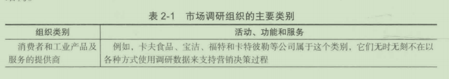
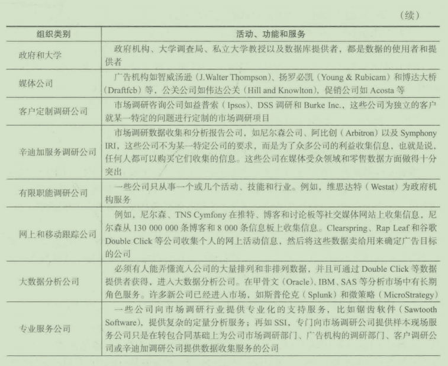
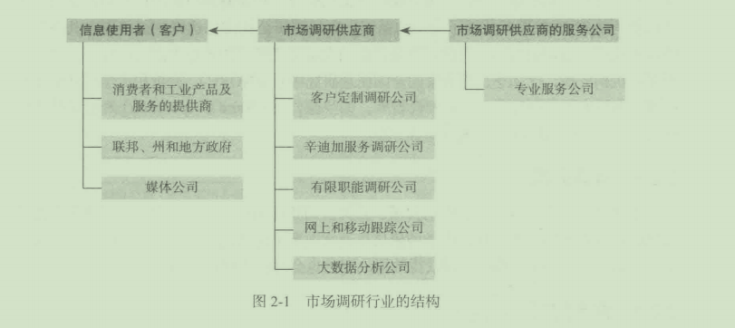
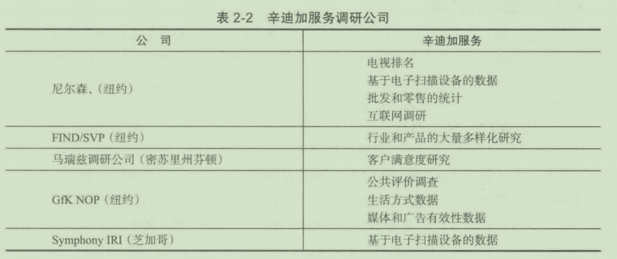
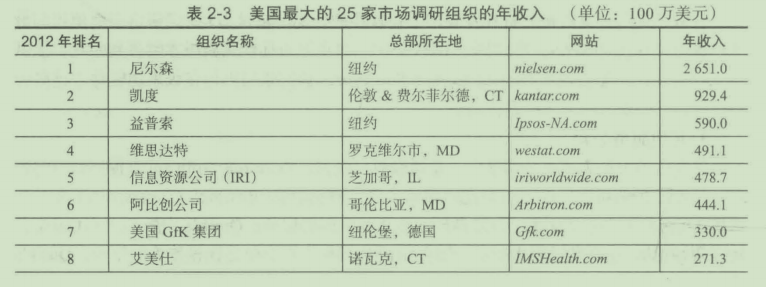
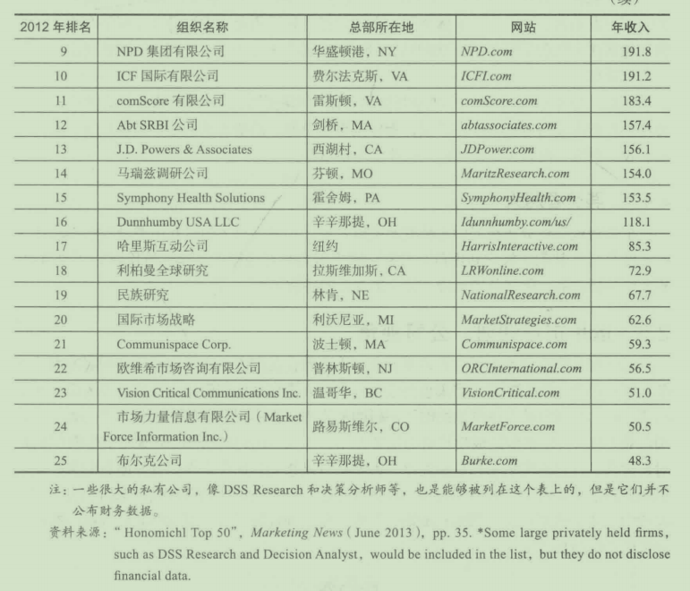
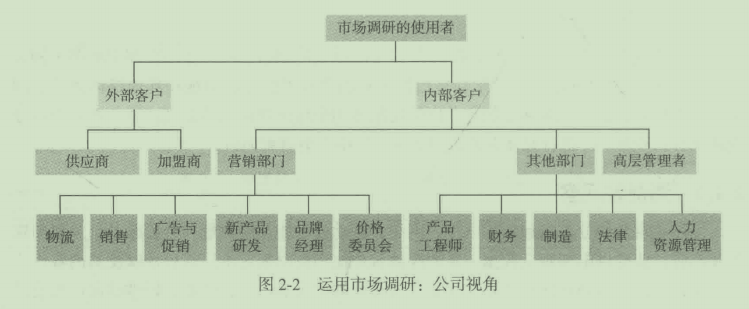

# 第2章 市场调研行业的道德抉择

## 学习目标

1. 了解市场调研行业的结构
2. 理解公司市场调研各部门的性质
3. 了解市场调研提供者的类型
4. 讨论公司如何使用市场调研
5. 回顾市场调研行业的现状
6. 学会识别市场调研提供商、客户和市场调研公司现场服务时的道德趋势和不道德行为

近年来市场调研行业经历了巨大的变化。市场调研行业将何去何从？谁是关键角色？每个角色的作用是什么？逍德在商业领域是最为蜇要的主题之一。市场调研领域有哪些逍德问题？对千迫德的决策有哪几种主要方法？我们在第2音将讨论这些问题

## 2. 1市场调研行业的发展结构
目前，世界上每年有超过320亿美元被花在赞销、广告或公众态度的研究上。世界上最大的25家市场调研公司的年收入占到全球调研费用的58%。全球最大的25家公司中，有16家总部在美国，其他总部在日本、英国、法国、巴西和德国。

在美国，最大的50家市场调研公司年收入超过170亿美元．这个数字预计会随着经济持续发展而引人注目地增长。其中，许多公司从根本上说是和客户（包装产品制造商、零售商、耐用品制造商和高科技公司）有长期合约的大数据公司。有长期合约的公司在股近的经济衰退巾表现还不错，然而许多关注千大客户（即独一无二的调研项目）的公司却在诚少。

## 2. 2市场调研中的相关组织
在表2- 1和图2- 1中总结的市场调研行业相关组织的多种类型描述了市场调研行业的结构。





### 2. 2. 1消费者和工业产品及服务的提供商
产品和服务的提供商如宝洁公司和美国航空是调研数据的最终使用者，主要的经营活动就是生产产品或提供服务它们无时无刻不在以各种方式使用调研数据来支持营销决策过程，比如：

(1)了解不同的目标群体对不同营销组合的反应。

(2)评价运行中的营销策略的成功程度。

(3)了解顾客和非顾客对自己的品牌及竞争品牌谈论些什么。

(4)评估外部的、不可控的环境的变化，以及这些变化对其产品或服务的战略影响。

(5)识别新的目标市场。

(6)测匮客户服务质虽和顾客满意度。

(7)更有效地确定促销自标。

我们将在本章中更详细地讨论市场调研的使用者的问题。

**零售商和批发商**在竞争激烈的零售市场中，了解顾客是最为重要的。沃尔玛、家得宝、萨克斯第五大道、BassProShop,还包括许多其他公司，想了解顾客的满意度水平、满意或不满意的原因，以及他们能够做些什么来提升顾客满意度。那些不了解顾客的公司是注定要失败的。

**制造商**使美国汽车行业好转的关键是生产人们想买的汽车。福特、通用汽车、克莱斯勒全部转到通过市场调研来指导它们生产价格合适的好汽车，卡特彼勒工业品制造商甚至用市场调研来测量经销商和顾客满意度。

### 2. 2. 2政府和大学

许多政府部门既是市场调研信息的购买者也是提供者，大学也是如此。政府购买包括从一座新的城市公园应建在何处，到美国人对千营养标识的态度这样的任何书项的信息。尽管并没有对千州和地方级别的市场调研支出的估算，但是联邦政府的市场调研支出有统计估尊为每年50亿美元。除了美国的第三大市场调研公司维思达特，这些支出几乎没有流向传统的市场调研机构。反而，市场调研的大部分工作是由政府内部完成或者通过非营利学术机构完成，比如芝加哥大学的全国民意研究中心(NORC)、密歇根大学的社会研究所或三角研究所，同时也包括营利性智库，如兰德公司(RandCorporation)和教学政策研究公司(MathematicaPolicyResearch)等。

### 2. 2. 3媒体公司
媒体公司包括广告机构、促销公司、公关公司和直销公司。所有这些公司都致力提供正确的目标市场的正确信息，市场调研信息通常被要求达到这一目的。媒体公司可以通过客户定制或辛迪加服务调研公司获得数据，有时也会自己进行市场调研。

### 2. 2. 4客户定制调研公司
客户定制调研公司(syndicatedserviceresearchfirms),产生千为公司客户执行定制化的某种市场调研项目的经营活动中。如果一个公司有一个新的产品、服务或包装创意，或者一个广告的概念、一个新的定价策略、一项新的产品组合，或者相关的营销问题或机会，这家公司往往会向定制调研公司寻求调研帮助。


在美国有数千家定制调研公司。较大的定制调研公司有MarketFacts、MARC组织(theMARCGroup)、国际民意调研公司(OpinionResearchCorp. International)、埃尔里克和拉维奇营销研究(ElrickandlavidgeMarketingResearch)、BurkeInc. 、DSS调研(DSSResearch)和决策分析师公司(DecisionAnalyst)等。然而，从总体上看，大部分定制调研公司的规模较小，资本不超过100万美元，员工不超过10人。它们大多只发展当地客户，并且不一定会专业从事某项调研或服务。

### 2. 2. 5辛迎加服务调研公司

和定制服务公司形成鲜明对比，辛迪加服务调研公司(Syndicatedserviceresearchfums)收集并向多家公司客户出售市场调研数据。任何愿意支付相当价格的公司都可以购买这些辛迪加公司收集、打包和销售的信息。辛迪加服务调研公司数量相对较少，同定制调研公司相比规模较大。它们主要基于对多家公司共同的信息需求服务的出发点，处理媒体受众和产品动态的信息。例如，在广播电视上做广告的公司想要选择最能有效接触目标顾客的节目，它们需要众多电视节目的观众数量和地理位置的信息。如果由各个公司自己来收集这样的信息，将十分低效。

尼尔森这样的公司向一些被称作辛迪加的公司出售标准化的电视排名，所以这些信息就叫作辛迪加化的信息。一些辛迪加服务公司，如托罗帕公司(RoperStarchWorldwide),同时以客户定制和辛迪加两种方式出售生活方式的信息。标准化的收集信息的流程是相同的，但是有的辛迪加成员公司也会想要专门的屈千自己公司的信息，事实上这是很普遍的现象。对千辛迪加调研，如提出定制化间题的需求，每个问题都要求支付额外费用。

表2- 2展示了一系列辛迪加服务调研公司和它们提供的特定市场调研服务。



### 2. 2. 6有限职能研究公司

一些公司只从市一个或几个领域的活动｀比如它们也许只为一个行业的客户服务。例如，Westat专门为各个政府机构服务，而艾美仕(fMSHealth)和DSS调研则专注千医疗事务，其他公司专门使用一类或一种研究方法。神秘顾客组织(MysteryShopperOrganization)的成员，如Shop'NCheck和立通(Speedmark),只关注神秘购物行为（将在第7章进行讨论）。主讲人公司(ThePretestingCompany)使用阅读器等设备来测扭阅读报刊时有多少时间被用来阅读广告。

### 2. 2. 7网上和移动跟踪公司

网上跟踪是以电脑为基础的互联网跟踪活动，以移动设各为基础是移动互联网和移动设备的胀踪活动。许多人就生活在移动设备上，他们用移动设备与朋友和商业伙伴保持联系，拍摄、存储照片，阅读新闻和娱乐，玩游戏以及使用方便生活的App。移动体验比桌面体验更私密。一项调查发现，44%的调查对象把手机放在床边睡觉，因为他们想要确保晚上的时候没有错过任何电话、信息和更新材料。卢斯调研(LuthResearch)、Tapad和Drawbridge等公司跟踪移动行为。调研入员的主要优势是能够跟踪智能手机的位置。许多学术研究者用电话收集10万名欧洲移动电话使用者的日期、时间和位眢信息。分析了1600万条用户记录之后，研究者可以预测一些人未来的位置，有93%的准确性。

### 2. 2. 8大数据分析公司

分析大数据的一些重要角色巳经在2. 1节中提到。了解大数据的第二个要素是数据形象化。大部分人很难想起比自己的电话号码长的数字出，那么如何理解数十亿的数据呢？答案是图片。现在访问http://biot. fm/wind,你会看到数据形象化。提供数据形象化软件的公司包括Gooddata、AYASDI、Gtk、Tidemark和Platfora。

### 2. 2. 9专业服务公司

巳经讨论过，客户定制调研公司、辛迪加服务调研公司、有限职能市场调研公司代表调研行业的前沿，它们出售调研服务、设计调研、分析结果，向客户提出建议。网上跟踪公司将在第7、8章进行更为详细的讨论。快速浏览专业服务供应商之后，这部分总结了市场调研的相关角色。本章后面会进一步讨论。

1. 市场调研供应商服务公司

正如上面的标题所暗示的，这些公司是为调研行业服务的，其中包括锯齿软件这样的软件提供商，也包括SSI这样的样本提供商。还有许多为市场调研行业提供大的在线样本组（一群愿意回答市场调查的人）的提供商。哈里斯民意调查(HarrisInteractive)声称它有世界上最大的样本组，由来自200多个国家和地区的成员组成。接下来会详细地介绍这些服务公司。

很多公司为市场调研供应商提供服务r当一家公司（比如卡夫食品）的调研部门要进行自己的研究，它们的服务公司也会进行协助。服务公司的两个最主要类别就是现场服务公司和抽样公司。

现场服务公司一个真正的现场服务公司．除了收集调研数据，不进行其他的活动，它不需要进行调研设计和分析。现场服务公司是数据收集的专家｀在同公司市场调研部门、定制服务公司、广告机构等签订合同的基础上进行数据的收集。
以下对于典型的现场服务公司的活动过程的描述可以让大家很好地了解这些公司是如
何运作的：

(l)客户接触。客户、辛迪加服务调研公司或广告代理的研究部门通知现场服务公司（通常通过电子邮件），告知对方自己想进行一项特定种类的研究（电话访间、卖场访问、焦点小组访谈或门味实验等）。

(2)采访者培训工作正式开始之前，有一个情况介绍或培训环节，以使采访者熟悉某一特定工作或间卷的要求。

(3)采访状况报告日进度报告是关千巳完成的采访数目和花费的报告，并通过电子邮件传达给用户。这些报告使客户可以判断工作是否按时｀在预算内完成，并允许现场服务公司就任何间题向客户提出建议。

(4)质屉控制。采访被录入编辑，也就是使用一个特别设计的软件来判明采访是否正确地完成

(5)送达客户。最终完成后，编辑完成的采访结果被送至（多采用电了方式）客户处。

大多数客户定制调研服务公司依赖于现场工作，因为由它们自己进行这些工作并不节约开支。因为涉及太多的地理区域，然而又很难知道哪些地域是一直需要的。此外，某一特定地域的现场服务公司一直保持着在当地的工作流程的运作，因为有数目众多的研究公司、调研公司、广告机构和研究部门作为它们的客户。

今天主要的现场服务公司都有一个固定的办公场所。它们也许有一个或更多的商场测试中心、焦点小组访谈设施、中央电话采访设备，同时还有其他专门的设施和设备。现场服务公司最近的趋势是在不同的城市建设卫星办公场所。

1. 抽样公司
抽样公司提供样本（可供采访的人）给市场调研供应商和其他调研实施者最大的抽样公司是抽样调查公司(SS1),这家公司的所有工作是为邮件、电话或互联网调研提供样本SSI的SurveySpotInternet讨论组有超过600万成员。公司的SSL- liteeSamplc是一个按照生活方式分类的讨论组，这个讨论组包括3500个以上的话题列表和I200万的用户名。其他公司如哈里斯互动(HarrisInteractive)和决策分析师(DecisionAnalyst),都有很大的互联网讨论组，被它们用千门己的调研或者租借给其他调研供应商。

2. 软件公司
有很多专门提供数据分析和互联网采访软件的公司。超过2/3的调研供应商使用的最流行数据软件包是SPSS,现在属千IBM公司，这正是当你购买新版本时得到的我们提供给你的软件。其他公司如Perseus和WebSurveyor,它们专门出售在线采访软件。这些公司也在自己的服务器上主持进行调研。

3. 其他服务公司
其他服务公司为调研公司提供一系列服务。例如，SawtoothSoftware就提供复杂的数据分析给市场调研供应商；市场调研职业生涯(MarketingResearchCareers. com)则专门从出（正像它的名字表明的）市场调研职业生涯方面的服务；Quirk's出版杂志《Quirk市场调研评论》，还有现场服务公司、国际调研公司和焦点小组访谈设施等的指南。Quirk's也为一些市场调研人员主持在线论坛。

## 2. 3消费者和工业公司的市场调研部门

因为公司是市场调研的最终消费者和发起者，逻担上它们就是了解这一行业运作机理的起点。大部分大公司（以及不论规模大小的所有快消品制造商）都有市场调研部门。一些公司也在将市场调研和战略计划衵结合，而其他公司也在试图将市场调研和客户满意部门相结合。

市场调研部门的平均规模都较小。最近的一项调杏发现，只有15%的像联邦快递和美国航空这种规模的服务公司，有LO个以上员工的市场调研部门；只有23%的制造商，有10个以上员工的调研部门。巾千兼并茧组和流程再造，市场调研部门的规模有下降的趋势。严重的经济衰退使得将调研活动外包给市场调研供应商成为一种长期趋势。现在，内包成了一个口号。公司试图找到花小钱办大事的途径。这也意味着供应商服务公司有更多工作，比如Confirmit、Marketingsight和Vovici,提供网上调研软件和分析报告调研数据的工具。

因为在这里不可能介绍所有类型的市场调研部门，我们将主要介绍那些更大、更复杂的公司内部的此类部门，这些市场调研部门是智娱性部门，它们的领导者主要向高层营销管理人员报告。这些部门的大部分工作要与产品或品牌经理、新产品研发经理或其他一线经理打交逍。凭借可以将各种亟复性调研编入公司的营销信息系统，市场调研部门通常不需要主动发起实验。现实中，调研经理只能控制佷少或者根本不能控制经费，事实上，职能经理管理的经费中有专门给予市场调研的部分。

当品牌经理认为他们遇到了需要调研的问题时，他们就会向市场调研部门寻求帮助。在与调研经理或高级分析员合作的过程中，他们经历的一系列步骤也许就会演变成一个市场调研项目的设计和执行过程。

## 2. 4调研供应商

尽管市场调研行业的特点是以由数百家小公司为主，在这个行业中还是有很多大公司的。表2- 3列出了最大的25家市场调研公司的年收入。这个行业最大的公司－尼尔森公司是以辛迪加服务为主要业务的公司。

表2- 3美国最大的25家市场调研组织的年收入（单位：100万美元）




尼尔森创立千1923年，连续40多年是美闰最大的调研公司。尼尔森在100多个国家办公，员工超过33000人。尼尔森是提供市场和消费者信息、电视和其他媒体测量、网上悄报、移动测量、交易展示和商业出版物服务的全球信息和媒体公司。尼尔森业务被分为两部分：观察一—进行媒体调研；购买一集中千消费者调研。

### 2. 4. 1消费者观察
尼尔森观察细分市场包括和电视、网络、移动设备相关的测冕和分析服务，主要向媒体和广告行业提供电视观众数据。它的媒体客户使用数据来定价广告目录以使其内容价值最大化；它的广告客户使用数据来计划广告花费并使其展优化，以及更好地确保广告被目标观众观看。尼尔森通过三个媒介提供测社服务：电视、网络和手机。

在美国尼尔森提供两个最重要的电视收视率服务：全部210个指定的地方电视市场中的国家电视台观众测措和地方电视台观众测屈，其利用多种途径收集家庭数据，包括电子仪表和写日记。方法不仅包括电视观着数据，还有观众的人口统计信息，以此来预测全部电视观众的成本。

尼尔森将互联网媒体和市场调研、观众分析，以及网上观众行为的社交媒体测菌提供给网上发布者、互联网和媒体公司、市场营销者和零售商。它测匮和分析消费者生成媒体，包括在1亿多条微博、社交网站、用户群或聊天版上的观点、建议、P2P讨论以及个人经历分享。

在移动电子交流行业，公司为电信和媒体公司提供消费者调研和独立的测最，包括移动运输器和设备制造商。在美国，指标是市场份额、消费者满意度、设各共享、服务质量、收入份额、内容观众及其他关键性能的指示器。

### 2. 4. 2消费者购买

尼尔森购买细分市场提供零售交易测量数据，消费者行为信息和主要针对快消品行业的商业分析。其购买客户利用信息及其洞察力努力更好地管理品牌，发现新的资源需求，研发增加新产品，优化营销组合，建立更有效的顾客关系。

## 2. 5运用市场调研：公司视角
既然现在您已经熟悉了市场调研行业，下面就让我们进一步了解调研使用者方面的细节。很有可能，我们的读者将来也会成为一名商人，与市场调研产生关系，成为调研的使用者。图2- 2列出了一些典型的市场调研的使用者。暂不提非营销的内部客户（如金融和制造业）对于一个组织的成功具有的重要作用，一些公司的调研部门还未对其非营销客户对具体营销信息的需求引起足够注意。大家都可以想到，这些未得到良好服务的客户对于市场调研信息表现出了较少的兴趣。我们都知道，那些最成功的市场调研部门和公司都能够致力于使它的所有客户都感到满意。下面让我们细致地了解一下这些各式各样的客户需要和使用的信息类型。



### 2. 5. 1外部客户
因为市场调研可以成为关千新的竞争优势或提升竞争优势信息的有价值的来源，也由于这样的信息往往收集费用巨大，一家公司的调研部门收集的数据很少在公司外部核舞。很多公司不对外提供任何信息，比如对供应商。然而，那些能够对外提供信息的公司，往往会发现这是与它们有共同利益的。

1. 供应商
制造商同它们的供应商建立战略伙伴关系(strategicpartnerships),以实现准时制(just- in- time)制造。这些联盟是基于整合了的制造商－供应商物流系统，这一系统将零部件在需要的时候运到组装流水线上，结果就是很少或没有材料存货，并大大减少了运输成本。这种系统的支柱是共享的信息，大的零售商，如沃尔玛和劳氏等，与它们的主要供应商都有这样的联系。

战略联合的框架内部，当消费者在制造商的消费者满意调查中，反映关于某一组件的意见时，市场调研信息就会反馈给制造商的供应商。例如，如果先锋公司(Pioneer,日本音响公司）给本田公司的汽车提供音响．而消费者抱怨某一个操作模式很难设性，先锋公司也会得到这样的信息。又如，一家主要的零售连锁执行了一项关千顾客对于圣诞节相关产品的偏好改变情况的调查，如礼品包装纸、贺卡、人造圣诞树和装饰物等．以帮助它的产品材料的供应商认识到进行和应的产品改进的蜇要性，并且提供做出这些改变的建议。

2. 加盟商

大多数主要的消费产品和服务的特许经营授权商对它们授权经恃的加盟商都提供市场调研数据。也许最普通的收集数据的方法就是通过“神秘顾客”。神秘顾客装扮成普通的顾客，观察多久才能得到服务或者进行支付，以及员工是否注重礼仪、操作区是否清洁、购买或者购买的顺序是否正确准备。有关神柲顾客还将在第7音详细论述。

授权加盟商也同它们的加盟商分享市场调研信息，来支持特定的建议或行动。当麦当劳建议某一加盟商的某一店面应当按照特定的风格进行改造时，它就会给加盟商调研数据，显示加盟商的店面风格已经被认为是过时或风格陈旧。其他数据也许就是用来说明现今消费者偏好的建筑主题和风格。当汉堡王进行一项新的促销活动时，它会和加盟商分享调研数据，这些数据显示在众多可选的主题中，已经选择的促销主题更受顾客和非顾客青眯

### 2. 5. 2内部客户

1. 营销经理

事实上组织内的每个经理都会在某种意义上成为市场调研信息的使用者。然而，营销经理比其他组织成员更多地使用调研数据。回顾营销组合理论，其中包括关于产品、服务、促销、分销和定价方面的决策，市场调研帮助决策者在这些方面做出更好的决策。例如，产品经理使用调研结果来确定目标市场，以开展接下来的工作。在某些情况下，管理者使用调研数据来确定目标市场中的重度消费者。市场调研揭示了奇妙奶(MiracleWhip,卡夫公司产品）的重度消费者每年食用550份，即17磅e该产品。这些数据被用来定位一项针对核心客户的耗资300万美元的促销活动，告诉这些核心客户不要“不吃这一口"(skipthezip)。巾于这次促销活动，奇妙奶的市场份额上升了2. 1%,年销售额达到了3. 05亿美元。在广告促销实施之前，共有效性也通过市场调研进行了全面测试。

新产品研发经理是市场调研信息的最重要使用者之一。从产生产品创意的定性调研方法，到概念测试、产品原型测试，再到试销，市场调研是创造一项新产品的关键。例如，宝氏(Post)麦片对于麦片的研究表明，香蕉一直是美国人最喜欢的麦片水果伴侣既然这样，为什么没有香蕉味的麦片呢？宝氏的新产品经理调制了含有千香蕉片的麦片，但是在市场调研的口味测试中并不成功。进一步的研究被用来解释为什么会产生这样的结果，发现原来消费者并不认为有必要去买另外带香蕉味支片的必要，因为新鲜水果全年都很便宜。如果消费者需要香蕉味的麦片，他们大多会临时剥开一个香蕉自己做这样的麦片一天，这位新产品经理有了一个灵感：消费者说他们喜欢香蕉坚果面包，千是他想起奶奶做的那些美味的食品。这位经理让宝氏的实验室做出一种新麦片，用千在消费者家里进行试验营销，结果是这种麦片得到了很高的测试分数。就这样，GreatGrains香蕉坚果门味麦片(BananaNutCrunch)一一宝氏最畅销的麦片诞生f。这完全是由市场调研而牛的产品，产生于一位新产品经理的直觉观念。

市场调研也在分销领域起到了很重要的作用。它被用来为新店铺进行选址，检测消费者对千店铺内部设计的安装和特色的反应。例如，香蕉共和国(BananaRepublic)一自依靠市场调研在其店铺内创造良好的气氛。

在较大的组织内部，定价决策一般是由营销、财务、生产或其他部门的代表组成的委员会做出。几年前，宝洁的首席执行官调查了电动牙刷市场，发现大多数电动牙刷售价都超过50美元。公司进行了定价市场调研，发现对于电动牙刷的需求十分有弹性。宝洁推出了使用电池的佳洁士电动牙刷，然而却只售9美元。它现在已经是美国最畅销的牙刷，或手动或电动，它都帮助佳洁士成为宝洁旗下的第12个价值10亿美元的品牌

2. 高层管理者

宝洁把市场调研提到r公司管理的最前端，然而这也意味着提升市场份额、盈利和股东价值的风险。杜邦、沃尔玛、万豪、嘉年华航线(CarnivalCruiseLines)、品食乐(Pillsbury)以及亚马逊网站的高层领导者，都依靠市场调研提供战略指导。

3. 其他内部使用者

通常，除了营销经理和高层管理层之外的其他组织成员也会用到市场调研结果。卡田的工程师有时只有在需求被评估了之后，才会去设计某一部件。丰田的市场调研为研发管理提供稳定的客户好恶的信息流。制造部门也从顾客满意度调查中得到待续不断的反馈，比如松动的车门、开关受阻的遮阳板的开关、突然加速等类似的情况。

财务部门利用测试市场的数据来预测未来1~3年的收入流。重新定位研究帮助财务经理预测老产品产生的收入。最初，佳得乐是按为竞技运动员设计的饮品而进行官传的。市场调研发现它的主要消费者是19~44岁的男性，这些用户更了解该饮品，知逍它的功效，也知道该何时饮用。后来产品被蜇新定位为针对体育运动爱好者，比其他饮品更能解渴和补充运动时流失的矿物质的饮品。新的产品定位戏剧性地增加了销售额。

人力资源经理会就一系列话题运用市场调研来调查员工。客户质量服务要求员工对于公司有一个良好的印象，一个公司希望传达给消费者的态度。西南航空和美国银行通过调查研究监测员工的态度。

公司越来越多地依靠市场调研来赢得诉讼。最近，先灵葆雅(Schering- Plough)和辉瑞(Pfizer)因为医师对千各种抗组胺剂的吞法和推销人关于这种药剂使用的销售信息而走上法庭。营销信息被用来证明或反证消费者对于类似品牌名称的看法。

一个旧金山的陪审团在康爵洒庄(Kendall- JacksonWinery)同E&J嘉露葡萄酒公司(E. &J. GalloWinery)的诉讼中否决了前者的诉讼请求。康爵洒庄辩称嘉露(Gallo)抄袭了它的Vintner'sReserve的商标一秋天颜色的葡萄叶的图案，嘉露在它的GalloTurning
Leaf葡萄洒系列上使用了类似的标识，而市场调研的结果帮助嘉露赢得了诉讼。

## 2. 6市场调研行业的现状

2013年，美国在市场调研上的花费超过了154亿美元，和2012年相比收入是平稳的，美国前50的公司占总收入的91%。到目前为止，在调研上花费最多的是联邦政府机构，2013年花了63亿美元。这95亿美元的估算不包括大学，比如密歇根大学的调查研究中心；也不包括许多美国大公司，比如宝洁和通用汽车，它们做了大量的室内调研。大多数的大咨询公司和广告机构的市场调研在国内完成。

这个趋势在市场调研行业持续不减。调查项目网上数据收集的使用持续增长。数据收集可以更快速、更省钱。通过网上访问得到更多样的人口数据与个人的电话访问对比。戈登·怀纳(GordonWyner),大全球调研公司明略行(MillwardBrown)顾客解决部门的副总裁，在“市场调研实践2- 1"中谈论了市场调研的快速变化。

讨论市场调研行业的艺术境界和层次，如果缺少了关千伦理和道德的问题，就是不宪整的。

## 市场调研实践2- 1

**市场调研在一段时期内的巨大改变**

新能力的形成使得人们对调研是什么和做什么的看法有所变化，这些改变使市场营销人员如何更好地实现目标变得不太清晰。

**好处**

最大的潜在增长领域包括：

(1)更多数据：对更多消费者行为的测量。

(2)更多控制：消费者对市场调研主动性回应的可预测性。

(3)更有深度：了解消费者的头脑如何工作。

在很大程度上，一些今天我们认为理所当然的行为在10年前并不存在。例如，网络搜索、数字媒体、电子商务、社交媒体对理解消费者十分重要。测量和这些活动相关的行为在市场调研人员的优先次序列表中排在前列。

列表仍然在增加，感谢新技术，尤其是手机。原则上许多新行为是可测量的，比如记录在每个新位置的社交网络。

即使不是新行为也可以更广泛地测量。消费者和品牌之间的更多互动点也是可用来测量的，比如银行顾客去柜台机、ATM机、银行网页或与呼叫中心和互动广告的互动。

因为新行为是电子俘获的，使用信息用来市场分析的机会十分充足。更多变量和更细微的测量导致更多可预测的力量，尤其是预见消费者对市场行为的回应。这反过来会导致更好的决定采取什么市场行为及如何分配市场资源。

缺憾

这些新能力不能解决所有重要的市场问题。

创新

市场调研的新能力将会如何协助和提升创新过程？可以确定的是，数据的可获得性将会允许市场营销人员对市场中的改变快速回应，使产品和渠道相应地做出改良，但是新的产品和服务创意从哪里来？对过去和现在行为的强烈关注不会必然显露出消费者未来想要什么的洞察力。

品牌

尽管新技术能够更仔细地聆听消费者说了什么，但它们不能直接回答这些重要的问题：

1. 品牌代表什么？（不仅仅是在网上表达的少数声音，而是对于有址可寻的市场）

2. 品牌应该如何定位？（与竟争相关）

3. 什么类型的交流会最好地提升品牌资产？（与可选的主题、战略、执行相比）

问题：

1. 调研人员如何决定消费者未来想要什么？简单地问他们吗？

2. 在这篇材料中你看到什么隐私问题了吗？如果有，是什么？

## 2. 7市场调研道德

对千调研客户与它们的调研部门／供应商的关系中最重要的两个因素就是保密和诚信，这两个因素中每一个都是一项道德问题。道德(ethics)就是通常约束个人或组织行为的道德准则或价值观。然而，有道德的行为不是单方面的关系，客户、供应商和现场服务公司必须都要以道德的方式行事。

道德，包括从实践性的较窄定义下的问题，如调研人员对于客户的诚信义务，到更广阔的社会和哲学间题，如公司保护环境和维护员工利益的义务等问题。许多伦理矛盾就是从公司所有者同员工、客户、周边社团、社会不同利益的矛盾中产生的。管理者必须平衡理想和现实的关系，给予公司股东客观的合理利润，同时保持经济活动中的诚信，并履行更大的环境和社会间题上的义务。

### 2. 7. 1道德理论
人们通常根据自己的生活经历做出个入道德理论的选择。下面就是一些可以适用千商业和市场调研领域的道德理论。

1. 道义论

道义论认为人们在分析迫德困境时应该严守他们的义务和责任。这意味着一个人应当遵循他们对其他人或社会的义务，因为坚持个入的责任在道德上被认为是正确的。例如，逍义论者总会信守承诺并且遵守法律。遵守这一道德观的人会做出十分稳定持续的决定，因为这些决定都是基千他个人的固定的义务。请注意这种理论并非一定考虑到他人的福利。例如，一个调研供应商认为准时会见客户是他的逍德义务。但是有一天他出发晚了，他应该怎样驾车到目的地呢？这个道义论者是应该超速，不赵守对F社会的法律上的义务，还是只能迟到导致守时的义务没有遵守呢？这种义务矛盾的情境让我们没有办法选择一个道德上正确的解决手段，也不能保护逍义论决定所影响到的其他人的利益。

2. 功利主义

功利主义道德理论是基千预测行为后果的能力的理论。对千一个功利主义者，能够为更多的人带来更多利益的选择在道德上是正确的。这种道德观的一个好处就是，功利主义者可以比较几个类似的解决方案，并且使用一个指标体系来确定哪种选择为最多的人带来最多的利益。这种指标体系为每项决定提供逻辑化和合理化的评判标准，并且使决策者可以视不同情况而采取不同的选择。

功利主义分两种：一种是情境功利主义，另一种是规则功利主义。情境功利主义严格恪守我们上面谈到的功利主义的定义。在情境功利主义下，个体进行对更多入有利的行为，不考虑个人感情或社会的约束，比如法律。规则功利主义考虑法律和公平正义的因索。规则功利主义试图通过最公平和最公正的可以实现的方式，来为最多的人获得利益。因此，规则功利主义的额外好处就是，它同样重视公正和为更多的人谋福利。

像其他的道德理论一样，悄境功利主义和规则功利主义都存在很多缺陷，两者的内在缺陷都同对未来的预测有关。尽管人们可以利用他们的人生经历来预测结果，然而没有人能够完全肯定他的预测就一定是正确的。这种不确定性会带来难以预料的结果，使得功利上义看起来随若时间的推移越来越不那么道德，因为决定并不会像预测的那样给最多的人带来福利。

功利主义者必须做出的另一个假定就是，他们有能力在一个类似的尺度上比较不同的结果。然而，比较物质所得（比如金钱）和难以度量的所得（比如快乐）是不可能的，因为它们的本质和差太大了。

3. 诡辩论

诡辩论将当前的道德困境同类似的逍德困境和它们的后果进行比较，这样有助于人们认识情况的严重程度，并根据他人的经验得出最好的解决方案。通常，人们会发现类似的、似乎是极端情况的例子：妥协达成，而且其中极有可能包含了从以前的悄形中得到的智慧。

这种道德理论的一个缺点就是，对千一个给定的道德困境，也许不存在类似的例子。也许道德上相反的或者有问题的清况正是全新的和未能预料到的。沿着同样的思路，这种理论认为当前逍德困境的结果会同类似例子的结果相同。这并不一定总是正确的，这极大地限制了这种理论应用的有效性。

### 2. 7. 2调研供应商道德

理解道德理论能够帮助我们更好地决定市场调研中的不逍德的行为应该如何应对和处理。表2- 4详细地展示了市场调研涉及的众多群体中十分常见的不道德行为。这部分讲了不道德的调研供应商行为，从虚报低价到黑箱品牌化。接下来的内容强调和调研客户与现场服务公司相关的逍德间题。


表2- 4市场调研中不道德的行为

|调研供应商|调研供应商|现场服务|
|:- - - |:- - - |:- - - |
|虚报低价|在供应商预先确定的情况下还进行招标|选用职业的受访者|
|调研带有主观性|通过招标获取免费的建议和方法|未经证实的数据|
|粗暴对待被调研人员|做出虚假的承诺||
|出售无意义的调研|未经授权征求建议书||
|侵犯客户机密|||
|黑箱品牌化|||

1. 虚报低价

调研供应商应该根据特定的发生率（抽样调查中有资格完成调查的受访者的比率）和问卷长度（完成的时间）来开出一个固定的价格。如果任何后两个项目改变了，则客户应该预料到合同价格的改变。任何形式的虚报低价(low- ballpricing)都是不道德的。本质上，虚报低价是以不真实的低报价以保证企业的经营，然后用某些手段暗地里提高价格。例如，基千一个不真实的高发生率而定价，就是虚报低价的一种形式。又如，供应商提出以每组8000美元的价格组织讨论组，当客户应允之后，供应商又说：”被调研人员参与小组讨论的费用，当然是不在这8000美元之内。”这也是一种虚假低价。

2. 调研带有主观性

调研供应商必须避免有偏见地采样、错误地运用数据、忽略相关数据，或者是为了支持一个既定的目的而进行调研。今天调研的一个领域是所谓的拥护性调研，这些调研是受企业或行业委托，为了公共关系的目的或者是拥护和证明某一立场而进行的。例如，汉堡王就曾经运用了一次拥护性调研来证明自己制作汉堡的方法比麦当劳更受欢迎。汉堡王利用了对千调研中一些问题的积极回应，这个问题是这样的：“你更喜欢火烤汉堡还是汕炸汉堡？”然而，当另外一个调研人员将间题改述为：“你更喜欢在不锈钢的烤架上烤熟的汉堡，还是更喜欢在明火上烤熟肉片做出来的汉堡呢？”结果相反：麦当劳比汉堡王更受欢迎。

Kiwibrands是一家皮鞋洁具生产厂家，它发起了一项针对志向和光亮的皮鞋之间关系的调查。这项调查发现，97%自我形容为有志向的年轻男性认为光洁的皮鞋是很重要的。很多情况下，拥护性调研只是运用了并不能代表总体的样本。例如，为一家减肥产品制造商而发布的一则新闻这样说：“对千当今美国6500万正在减肥的人，现在有一个好消息。”一家公司的调研表明，减肥的人可以做到体重不反弹－—－样本包括了20名公司进行的实验计划的完成者，这些人在广告中表示支持这种产品。

当调研结果在新闻媒体上公布之后，具体研究方法和过程就应随时准备好应对记者了。通常，这些信息不被告知，因为这些资料多是私有的。一项为卡罗来纳州制造商服务公司(CarolinaManufacturer'sService,一家优惠券赎回公司）提供的调查发现，很大一部分美国人认为折扣券才是他们购物的真正诱因。而关于这一结论的具体方法描述，却只有花上2000美元才能得到。

3. 粗暴对待被调研人员

粗暴对待被调研人员以几种形式存在，也许最常见的就是耗时过长的采访。这种现象大多是由于一些产品经理”只要我还在问问题”的心理状态。客户要求额外的“乐于知道”的问题也不是稀奇的事悄，甚至这些间题是关于另一项完全不相干项目的＂探索性问题"'这些导致了较长的间卷，30分钟的电话访间或网络访问，抑或40分钟的商场采访。由于采访耗时过长和恼人的电话推销，越来越多的美国人拒绝参与电话调查。电话调查的拒绝率现在平均在60%以上，在过去10年里增长了10%。49%的受访者表示这些调查涉及了太多私人问题。幸运的是，比起其他调研方式，更多人愿意参与网络调查。

对某一产品和服务的兴趣往往在电话访问过程中就能辨别出来，采访者也可以通过被采访者对于收入和其他和关经济间题的答案得出受访者的潜在购买力。尽管问卷的介绍阶段往往承诺保密，但是一些调研人员还是将一些潜在消费者的名字和地址卖给了那些渴望销撮领先的公司。愿意参与调查的人有权利使他们的隐私得到保护。

纽约州曾起诉学生营销集闭(StudentMarketingGroup)将大杖的信息卖给了直销者。这些巾学生填写的调查问卷包括年龄、性别、宗教信仰、职业兴趣和平均成绩等。这家公司声称它们收集这些信息是为了反馈给大学，以帮助学生取得入学资格和财政资助。直销者运用这些信息来销售信用卡、杂志、录像带、化妆品和其他产品。

4. 出售凡意义的调研

与对市场调研无甚了解的客户交易的调研供应商，经常可以找到机会来”糊弄客户”。例如，如果一个项目只需要召集4个讨论组和一次大约350名消费者的在线调研，调研供应商就会组织8个讨论组和1000次网上采访，其中有400次访间还是在6个月之后再进行的。

如果情形允许不同的方案设计，则向一位潜在的客户提供几种不同价格的研究方案是f分可取的做法。供应商应当指出各种方案的优劣之处．同时需要样本确认间隔c客户在和供应商咨询之后，可以客观地决定哪种设计能更好地满足企业的需要。

5. 侵犯客户机密

客户日常经营活动的信息或者是客户项目的结果应当对第三方保密。供应商甚至不能泄露客户的名字，除非市先有授权。

保密中最棘手的问题就是决定什么时候不应该再获得“背景知识”，什么时候由于和前一个客户的交易，会发生争端。一位研究者这样形容：


`我参与过很多私人调研，经常发生的问题就是，一项调研最终被发现同之前的一些调研内容相关。我们的职业道德准则要求我们不能将一项调研的结果用于其竞争者的相关调研中。然而，既然我经常能知道一些关于某一领域的信息，我最终还是会对不起之前的客户。虽然公司上层极其正式地表示这些事情不能做，但是他们也希望我们那样做，因为可以减少开支，这种利益矛盾的情形很难处理。最起码在我的公司，我还没发现对这种情况的解决方法。这不是只有一次的情形，而是一个问题本身长期存在的过程。让员工重新去做最近刚做过的类似调研的部分是很荒谬的，然而放弃一桩可能的生意从经济角度上又是不可能的。`

6. 黑箱品牌化

市场调研供应商发现了品牌的重要性。Synovate拥有25种注册了的产品可供使用，包括品牌视觉(BrandVision)和M2M;马瑞兹调研(MaritzResearch)提供LoyaltyMax而izer化；哈里斯互动有TRBC一一种数量偏差纠正箕法。登录较大的市场调研公司的网站，你就会发现很多注册了的调研产品，涵盖了几乎所有业务，从市场细分到顾客价伯分析．所有这些产品名称上都会有SM、TM或气

这些产品的一个共同特点就足它们都是有专利的．这意味名调研公司不会透露它们的具体流程，这也是它们被贬义地叫作黑箱的原因。黑箱的方法就是专利，公司可以保护它的产品研发投资。如果客户需要增加调研的价值，供应商可以加价。黑箱和品牌名不足同义的，几乎所有私有研究方法都会有一个聪明的品牌名，但是也有并没有专利的调研方法，却有了品牌名。

至少两个因素导致了这样的品牌疯狂：第一，竞争压力强迫组织寻求新的使自己的产品区别千竞争者产品的方法；第二，许多大的调研公司是上市公司，上市公司承受着巨大的每季度提高销韬和盈利的持续压力。一种解决办法就是对服务加价如果公司用私有化的方法做一项市场细分的研究，不难想象，通过这种方式，它可以比其他使用常用的软件（比如SPSS、SAS的公司）收取更多的费用。

客户并没有客观的方法判断专利研究方法和更标准的方法是否有显著的不同，我们也不能。例如，我们去5家有5种不同黑箱决策楼型的公司，每家公司都声称自己的模型足更好的，然而从心理测员学角度行，评估哪一种更高效是不可能的。

当然，没有人强迫客户去购买黑箱研究，客户也可以同其他使用调研供应商的专利方法的组织联系，以评估它的有效性。通常，客户会在同一项目上获得多个出价，从一系列方法中进行选择，以帮助他们回答所研究问题。

### 2. 7. 3调研客户道德

同调研供应商一样，客户（使用者）也有一些道德上的注意事项。较常见的客户问题就是在供应商巳经预先确定的悄况下还进行招标，以获取免费的建议和改进方法．做出虚假的承诺．以及未经授权征求建议书。

1. 在供应商预先确定的悄况下还进行招标

相比一个供应商更喜欢另一个供应商不是稀奇的事情，这种偏好也许是巾于良好的工作关系、费用的考虑、按时完工的能力、友谊或调研人员的能力。具有偏好就其本身而言并不足不道德的。然而，巳经提前决定了调研供应商，为了满足公司要求，却还向其他供应商征求提案，这就是不道德的，让并没有机会赢得合同的公司浪费时间、金钱和努力是不公平的。为什么要一个以上的RFP?因为一些公司需要不止一个中标者。

2. 通过招标获取免费的建议和改进方法

追求实惠的底价的客户公司，一直以来都会征求详细的建议书，包括来自多个供应商的完整的改进方法和问卷的初稿。在选择了较明智的供应商之后，客户就会自己编写一份问卷，然后直接同现场服务公司签订合同，收集数据。这种策略的不同就是客户带着客户“自己的提案”一一从众多供应商的建议书中选择最好的内容组合而成，从供应商中选择要价最低的那一个。客户接下来就会试图以更低的价格计供应商提供更加复杂的研究

3. 做出虚假的承诺

不道德客户使用的另外一种手段就是，以虚假的承诺换取供应商减少经费。例如，一个客户也许这样说：“我真的不想承诺什么．但是我们计划在这个领域做一系列调研，如果你能在这次调研上给我们一个好价钱，我们下一次调研也会找你来做的。“不幸的是，下一次调研永远也没发生；或者确实有下一次，但却是同样的话被用在另外一个亳无怀疑的供应商身上。

4. 未经授权征求建议书

在下面几种情况中，一位客户代表在未收到授权、巳得到调研资金的情况下就征求建议书：

(1)一位客户代表决定先征求意见书，然后再向管理层请示是否可以得到资金来进行调研。

(2)一位德高望重的员工向管理层建议需要在某一领域进行市场调研。尽管经理们对这个想法提不起兴趣，他们还是会叫这位提意见的员工对外征求建议书，不打击他的积极性，同时也不错过一个可能（但是，在他们看来这是不可能的）的好主意。

(3)客户代表和经理对千经营问题是什么和如何解决有不同的观点。调研供应商并不知逍管理层的看法，所以即使建议书达到了客户代表的要求，但是管理层还是会拒绝这项提案卢

(4)位客户代表在没有咨询销售部门的情况下，就对外征求对销售情况分析的建议书。公司的高层害怕得到不良的反馈，或者销售部门不了解市场调研，就会阻挠调研的实施。

5. 零售商道德

零售行业的激烈竞争使得消费者满意度调查迅速增长｀也许这种现象没有比汽车经销商更明显的了。尤其是在美国，许多汽车制造商大大削减了经销商数炽，剩余的经销商也承受着巨大的压力以提供特殊的顾客服务。服务水平巾制造商提供的顾客关系调查来测肚。一个有I700名新车购买者的调查发现，45%的调查对象相信经销商试图影响他们的调查回应e一些购买者不确定什么时候经销商会要求“请让我们解决任何间题而不要报告出来”。这是试图影响购买者，还是良好的客户服务？

尤其是对下面这个问题的回答：“当你买车的时候，销售人员或管理者关千这个调查说了些什么？”

- 25%三们从未提到过这个调查；
- 30%三们提到了我将会收到一次调查（但没有下面这些）；
- 36%- - /也们请求我有任何问题让他们来解决，而不要报告出来；
- 28%- —他们请求我给他们完美的分数，但没有乞求；
- 8%三们乞求我给完美的分数；
- 9%- ft!!们说如果我给出完美的分数，他们仅仅会得到一份奖金；
- 2%三们请求我把调查表带给经销商，让他们看着填写；
- 2%三们请求我把空白调查表带给经销商，然后他们自己填写；
- 2%三们给我一份礼物来交换上面的一个。

正如你所看到的，调查对象的回应有一个固定状态，但许多显然是不道德的。制造商可以通过把调查问卷送到调查对象的家中来帮助解决这些问题；建立并执行一项强有力的政策来抵制调查伪造，允许调查对象保持匿名。


### 2. 7. 4现场服务道德

需要电话或面对面访间的市场调研现场服务，是调研行业的生产部门，是受访者和调研供应商之间的关键环节。它们正确地记录信息、小心地迈循抽样计划是十分觅要的。否则，最好的调研设计也只会产出不实的信息（进的是垃圾，出来的也是垃圾）。保持较高的道德标准能帮助现场服务为调研公司提供优秀的原始数据。

选用职业受访者

职业受访者的间题在培训焦点小组访谈讨论参与者的时候最常出现。事实上，所有现场服务公司都会保留愿意参加更多讨论的入的数据，同时还有他们大致的个人情况记录。保有这样一份记录是很好的经营手段，也是道德的。当焦点小组讨论成员的限制条件较低时（比如拥有宠物或者驾驶SUV),没有很大的诱惑去使用职业受访者。然而，当调研供应商需要，比如双氧水(Oxydol)洗涤剂的重度用户，或者是拥有俄罗斯蓝猫(RussianBlue)的入时，就不难听到讨论组培训者给职业受访者打电话说：“我明天可以让你参加一个讨论组，受访费是75美元，你要做的就是说你有一只俄罗斯蓝猫。”

要想不用职业受访者，调研供应商必须具体声明参与者不能是在6个月内参加过样本组的成员。然而，不诚实的现场服务商只需告诉职业受访者，否认6个月内参加过样本组就可以规避问题。

### 2. 7. 5受访者的权利

市场调研项目中的受访者通常提供私人时间和看法，却只得到很少回报或根本没有回报。这些受访者也有一些应该被市场调研人员尊重的权利。一项调研项目的所有潜在参与者都有选择权、安全权、知情权和隐私权。

1. 选择权

每个人都有权利决定是否参加一项市场调研项目。一些人（比如受教育程度不高的人或儿蛮）不能完全享受这项权利。一个想中止一次调查或实验的人也许会给予极短、不完整的回答，甚至是错误的数据。

一个人同意参与一项实验或者回答一个间卷．并不意味着给予了调研人员全权委托让他们做任何他们想做的事。调研人员仍对受访者负有责任，尊重其权利。例如，一个人参与一个包括一件实验产品和其他几件现有产品的品尝实验，他更偏好实验产品，但调研人员没有权利将他的姓名和地址用在推销的产品上，说：“同X牌相比，琼斯先生更喜欢这个新的产品”。

2. 安全权

调研参与者有免受身体和心理上损害的安全的权利。尽管受访者受到身体损害并不常见，但是也有参与者参加食品品尝实验后生病的案例。更微妙的是，调研人员很少会告知参与者某一产品含有什么，比如含有很多盐分。如果一项实验持续几周，不知情并极度紧张的受访者就有可能出现身体上的危险。

受访者面临心理上受损的情况往往更为普遍。如果采访者强迫受访者参与一项调研，受访者会感觉到压迫；其他受访者也会在回答不出给定的问题或在给定的时间内完成特定任务的情况下感觉到压力（例如，“你有5分钟的时间浏览这本杂志，接下来我会问你一系列间题")。

3. 知悄权

调研参加者有知晓调研工作各方面信息的权利。知迫了调研内容、调研需要的时间和数据的用途，个人就可以做出合理的选择是否参加调研项目。

通常，为了不影响受访者的客观反映，有必要不公布调研赞助商的名称。比如说：＂我们为百事可乐做一项调研：你们平时购买最多的是什么牌子的软饮料？”这就是很糟糕的调研行为。在需要掩饰赞助商的情况下，调研完成后需要进行事后的情况说明，这个情况说明包括调研的目的、出资人、数据、接下来的用途和其他相关信息。事后情况说明能够减少受访者的压力并增加对调研行业的好印象。不幸的是，花时间进行串后说明对大多数公司来说是一项不愿支付的开销。

在一些商业或学术研究中，调研人员也许会提出向受访者提供一份调研结果的副本，以得到受访者愿意参与项目的意愿。一旦分发调研结果给受访者做出承诺，就应该履行这样的承诺。然而现实中很多情况下，我们参与一些学术研究｀它们号称向受访者公布研究结果，但是我们却从未收到。

4. 隐私权

所有的消费者都有隐私权。所有的主要调研组织，包括MRA、CASRO和TMRO、AMA、ARF等都有臼己的保密规定。例如，对千在线调研，潜在受访者名单必须有一两个特点。可能的受访者必须或有交流地预先选择性加入，或者他们同发送者已经有交易上的往来~未经过请求就发来的邮件。

网上和移动跟踪公司多起来以后，隐私战争在这个领域最热。跟踪公司知逍你用移动设备在网上干什么，但是它们不能或者不会把你的名字加到它们的数据库中。这个行业经常传召匿名计划者，跟踪不应该被视为是侵入的。然而，跟踪公司结合许多网上和离线数据，它们知道你的名字，电子邮箱以及许多个人离线信息。

RapLeaf为保守政治家提供电子邮箱来确定选举运动的目标。例如，RapLeaf知逍一个保守女人的名字，她对Bible感兴趣，热衷千环保和政治事业。RapLeaf声称在卖给网上广告之前去掉名字等个入信息，然而RapLeaf收集和卖出的数据是十分具体的。根据《华尔街日报》的评论记载，RapLeaf的市场细分包括个人的家庭收入范围、年龄范围、政治倾向、家中孩子的性别和年龄，以及宗教、赌博、吸烟、成人娱乐和提供“暴富”等主题兴趣。RapLeaf总共把人们分为400类。

当谈到社交媒体聆听和网上隐私时，消费者两者都想要。根据美商网基(NetBase)、山景城(aMountainView)、加利福尼亚(California)调研公司实施的调查，51%的消费者想要谈论公司但不想被听到，而58%的消费者想要公司对社交媒体上分享的抱怨进行回应。43%的消费者认为公司监测他们的评论侵犯了隐私，而32%的各年龄段的消费者不知道公司正在监视他们在社交媒体上说些什么。

我们将在全文强调隐私间题。技术发展如此迅速．以至于美国联邦和州的法律不幸落后。更多隐私立法将会来临．尽管没有人确定会采取什么形式。

#### 2. 7. 6道德和职业素养

现今的商业伦理实际上是整个社会价值观体系的一个子集。营销决策核心的价值判断标准是从家庭、教育和宗教机构，以及社会运动（如女权运动、环保等）中得来的。一个拥有成熟道德价值体系的市场调研人员会去接受影响社会决策的个人责任。以下这些需要抉择和考虑的情况就是一些例子：

- 员工的需要和渴望，以及组织的长期美好愿景。
- 公司活动直接影响到人们的长期意愿和利益（奖励：公司的良好企业形象）。
- 为企业存在的社会结构提供基础的企业社会价值和条件。
高水平的道德和职业素养是相辅相成的。好的道德水准为职业索养提供坚实的基础，为了达到更好的职业素养水平，要求调研人员行为符合逍德。

1. 培养职业素养

因为所拥有的专业知识和技能，一种职业的成员会对他们提供特定服务的一方更有权力和影响力。医生和律师掌握的技能不能被别人在市场中轻易获得或买到，这些专业人员守护着他们的知识、控制接触到它们的人。尽管市场调研人员和市场营销者使用权力影响他们的客户甚至社会，但营销行业并没有资质认证过程或很高的进入壁垒。所以可以这样说，营销人中最需要在思考、信仰、行为中体现职业素养的就是市场调研人员。

分清职业和职业素养之间的区别是很蜇要的：一个职业(profession)及其内部成员是客观确定的（比如医学委员会测试），然而职业素养(professionalism)是以更加个人和主观的水平评价的。一项被设计用来测倡市场调研中的职业素养水平的调查发现，市场调研人员在他们的职业中有自主权，允许做自己的判断，还因为他们的知识水平和独立工作的能力受尊重，这些都是职业索养的特点。然而，大多数调研人员不能随时认识到营销对社会做出的贡献，大多数公司也不愿意奖励调研人员在职业组织中的贡献，这些特点不能说明较高的职业索养水平。

市场调研行业最近采取了很多措施来提高行业的职业索养。例如，美国测址研究组织委员会(CASRO)赞助研讨会来处理调查研究中的道德问题；CASRO还创制了一套道德准则，在调研行业中广受推行；CASRO还和市场调研委员会(MRA)合作，向考虑设立反市场调研法律的立法机关提供相关支持。MRA还创建了自己的道德准则，被选择的条款在表2- 5中总结。

表2- 5市场调研组织道德准则部分列表

````
1. 确信每一项调研都按客户同意的那样进行吗
2. 绝不会在调研或项目的任一阶段为任何人伪造或遗漏数据吗
3. 会保护所有调研技术和方法及被认为是机密和专利信息的机密性吗
4. 会准确诚实地报告调研结果吗
5. 会保护调研对象的权利和隐私吗
6. 会以职业礼仪对待调研对象吗
7. 会采取所有的合理预防措施，绝不会使调研对象由于参加市场调研项目受到直接伤害或不利影响吗
8. 会不做虚伪陈述说有资格证书、经验、技能、资源或其他设备等没有的东西吗
9. 会不使用调研信息在未经调研对象允许的情况下来识别调研对象吗？以下是例外：

a调研对象的身份信息被用来处理数据，合并数据存朽

b悯研对象的身份信息被用来添加客户或第三方数据到以悯研为基础的数据存档中

c调研对象的身份信息被揭示以服从来自有决定权、公认的法律机构的法庭要求或其他法律需要（例如．发现术决的法律案件所处阶段）

1O. 会尊重调研对象在调研的任何阶段退出或拒绝合作的权利吗？不会使用任何程序或技巧来强迫或暗示合作是义务吗

11. 会确认调研对象在一开始就被通知采访或讨论会以音频或视频记录吗？如果衙要，是否得到允许记录下来的采访或讨论将会被
*第三方看到
*为外部使用再制作
12. 会把客户提供的全部调研材料或者巾客户提供的调研材料生成的结果视为客户的财产吗？在调研时是否经过客户同意，这些材料将会被保留或处理

13. 对千在线调研不会未经调研对象允许下以任何方式使用任何违反提供者巳发布的隐私声明的数据吗？未经调研对象允许不会获得数据这样做是对调查对象在行为准则声明的隐私权的直接侵犯，并且侵犯了特定司法范围的法律

14. 对f在线调研，会主动发这电子邮件给那些决定退出的人吗

15. 会编辑｀保留，利用网上祥本~（选择加人）的人．以及对因观点和市场调研目的有若合理预期而收到在线邀请的人吗

16. 会在请求下识别样本方法本身和完成调研目标的能力的合理性吗

17. 会给调研对象提供每次调研中为了未来的在线调研被移动的选择（选择退出）吗
````

2. 调研人员认证

现如今，想要尝试市场调研十分容易。我们经常见到几个口若悬河的人让亳无戒备的客户相信他们就是合适的调研入员。不幸的是，依凭极少的信息来做重要决策只会带来市场份额的损失、盈利的减少，某些情况下甚至破产。

资格认证在市场调研行业成员中造成了不小的争论。应当注意的是资格认证不是执照。执照是巾政府机构管理的，是允许从事某一职业的强制程序；认证则是一种由非政府机构管理的自愿行为，可以在市场中证明某种不同之处。认证的话题很敏感，因为它直接影响市场调研人员是否能够自巾地从市该职业。

MRA发起了一个职业调研师认证(ProfessionalResearcherCertification)计划，据MRA表示，其目的是“鼓励业内高水平从业人员，以提高竞争力；建立个人知识和效率的客观测量方法，鼓励持续的职业发展”。这个计划包括了对调研使用者、供应商或数据收集员的认证。认证过程要求连续修宪一定课程，然后通过一个考试。到目前为止，巳有I500多入已经得到认证。

## 本章小结

市场调研行业包括：CD信息使用者（消费者和工业产品及服务的供应商，联邦、州和地方政府，媒体公司，零售商和批发商）；＠市场调研提供者（客户定制调研公司、辛迪加服务调研公司、有限职能调研公司、在线和移动跟踪公司、大数据分析公司）；＠市场调研提供商的服务公司。

市场调研的使用者可以进一步划分为公司的内部客户和外部客户两种。外部客户包括供应商和加盟商；主要的内部客户是市场营销部门，它为了物流、销售、促销、新产品研发、品牌管理和定价等方面决策的制定而收集数据。其他需要市场调研的内部团体和部门是高层管理者、产品工程师、财务、制造、人力资游管理和法律部门。

市场调研行业的销售额大约是154亿美元。美国政府是市场调研上最大的单一消费者。市场调研行业一个重要趋势是网上数据收集持续快速增长。

道德是通常约束着个人或群体行为的道德准则或价值观心道义论认为，一个人应该严守对其他人或社会的义务，因为坚持个人的责任在道德上被认为是正确的。相反地，功利主义道德观认为能够为更多人带来更多利益的选择在道德上是正确的9诡辩论认为一个决策的做出，必须通过将现在的道德困境同类似的道德困境和它们的后果相比才能得出

供应商的不道德行为包括虚报低价、调研带有主观性、粗暴对待被调研人员、出售无意义的调研、侵犯客户机密、黑箱品牌化等。市场调研客户的不道德行为包括在供应商预先确定的情况下不进行招标、通过招标获取免费的建议和改进方法、做出虚假的承诺、未经授权征求建议书等。市场调研领域选用职业受访者也是不道德的。在线跟踪公司收集的数据数量的增长导致许多消费者需要更有力的保护隐私的法律。

受访者有一系列权利，包括选择什么时候参与一项市场调研项目的选择权，免受生理、心理伤害的安全权，以及被告知调研任务所有详情的知情权。他们应该可以知道调研都包括什么，时间有多长，这些数据会被用来做什么。此外，受访者也有隐私权。

市场调研行业职业素养的水平，通过CASRO和CMOR这样的机构和有责任感的市场调研公司的努力，是可以提高的。MRA开发了职业调研人员认证体系。

## 复习思考题


1. 你认为移动设备收集数据会变得日益流行吗？
2. 现场服务公司在市场调研中的作用是怎样的？
3. 大数据是什么，为什么使人如此兴奋？
4. 列出公司市场调研部门的儿个主要特点。
5. 讨论辛迪加服务公司所提供的各种调研项目。
6. 将班内的同学进行分组，5人一组。每个组选择授课地点所在城市的一个地区（或者是较近的大城市），然后确定这个区的邮编。访问网站[http:/claritas.com/MyBestSegments/Default.jsp](http://claritas.com/MyBestSegments/Default.jsp) ,根据提示，通过邮编找到该地区的PRIZM(PotentialRatingIndexbyZIPMarket,按邮政区划分为基础的潜力等级指数）。每个小组接下来讨论这个地区的营销资料。

7. 你认为道德准则在组织内部的作用是什么？怎样才能保证组织成员遵守这些准则？

8. 你认为在市场调研供应商、市场调研客户或现场服务商中，哪一个对于市场调研行业的道德水平的提高负有最大的责任？

9. 在建立市场调研行业的道德标准上，联邦政府应该起到怎样的作用？这样的道德标准如何有力地执行？

10. 如果受访者在被承诺50美元的受访费之后才决定参加采访，他是否侵犯了所有受访者的权利？如果是这样，他们丧失了什么权利？

11. 道德和职业素养的关系是什么？你认为怎样才能提高市场调研行业内的职业素养水平？

12. 在线和移动跟踪公司是否收集了人们太多的信息？为什么是或不是呢？

## 调研实例2- 1调研对象招募人员~范你的行为

马克·古丁(MarkGoodin)是拉斯维加斯Aaron-Abrams现场服务公司的总裁，公司从事介绍调研对象给定性市场调研人员。他谈论了他所看到的市场调研商业中存在的问题。当谈到“供应商”时，他提到了招募调研对象的公司。因此，正如本章所讨论的，调研对象供应商是为调研供应商或调研客户（如要求做定性调研的制造商Frito-Lay)进行招募

在过去的几年，我见证了定性调研中两个令人不安的趋势。我不得不相信，如果在如此巨大又一致的基础上，它会发生在我身上，也会发生在这个行业中其他调研人员身上一他们还没有讨论过这个问题。这些趋势对未来的定性市场调研是不利的：

- 调研对象招募人员接受项目，然后一旦招募开始进行，在项目原本设计的至关重要的方面强制做出改变的趋势。

- 招募无限制调研对象的招募人员，收取招募和鼓励性费用的趋势。

我相信许多供应商只是简单地闭嘴，接收项目，然后让问题显详。我相信他们已经采取这种态度，顾客可以要求月亮，但是最后他们不会得到他们想要的东西。通常，这是项目一旦进入这个领域所发生的事。

我从未见过如此多的项目被调研对象招募人员原样接受一没有说出他们的担忧或任何警告问题，只是随后才说，“我们没有找到你想寻找的东西，你需要放宽你要寻找的人员类型的条件”，或者是“我们巳经达到预算，如果你想让我们继续，需要更多的钱”。

还有，在进行中调研对象供应商提供低标准的服务，那么接受放宽条件或交纳更多钱的需求是不可接受的：

- 招募项目报告没有按要求交付。
- 招募项目报告有问题或者有拼写错误。
- 调研对象在再筛选或再确认时不具有资格。
- 筛选者没有正确管理
- 筛选者的差异被过分看重或忽视。
- 没有遵循说明。
- 招募时间放进了工作中，但没有做足够的内容或电话。

今天必须阻止

调研对象供应商向不合标准的调研对象收取费用的情况，今天必须阻止。如果调研对象不合格，不能在调研中使用，我们不应该向调研对象收取费用。到了调研对象供应商停止招募不合格或处于合格边缘的调研对象，藏在许多借口背后的时候了。招募人员要对调研对象的准确性负全责。如果招募人员不能站在他们所提供的产品背后，他们应该寻找另一行当。我们公司有一个第三方招募供应商在项目开始之前需要了解的简单政策。我们不会支付招募费用或者对在再筛选过程或实际调研时不合格的调研对象的鼓励费用，我们积极地鼓励所有的调研人员这么做。

问题：

1. 为什么调研对象满足在调研项目中提出的准确条件很重要？
2. 你曾经参加过明知自己处于合格边缘还参加的调研项目吗？你告诉调研人员了吗？
3. 调研对象供应商向客户收取不合格调研对象的费用是不道德的吗？
4. 这是道德的吗？如果招募人员寻找现在有猫的人，你说：“没有，但是在长大过程中养过一只猫。＂招募人员回答说：“这也可以，只是要告诉他们你仍然在养猫。”

## 调研实例2- 2可口可乐公司活跃了市场调研

这些天来，Dyquan和他的朋友都有强大的动力每天下午在附近的“男孩女孩俱乐部“(Boys&GirlsClub,位于弗吉尼亚州里士满）学习。“如果你完成了学习任务，你就可以得到一个汉堡。"11岁的Dyquan说。

Dyquan和他的朋友并不知道，这些免费的汉堡是来自一个可口可乐公司雇用的顾问这家位于亚特兰大的饮料公司（可口可乐）的主管派该人带着9000美元来到里士满，他将钱给了俱乐部和其他非营利组织，让它们在汉堡王餐钦店给孩子们提供“超值＂的饮食。

可口可乐在销的价值几百万美元的产品难以售出。公司试图劝说汉堡王协助推广它的雪溶甜味饮品一冰冻可乐。汉堡王在所有店内销售这种饮料，但是汉堡王希望在进行这项活动之前要进行试推广。所以，这家位于迈阿密的快餐连锁店在里士满进行了为期两周的实验，为购买了三明治、炸薯条和劲爽饮品超值套餐的顾客提供一杯冰冻可乐的免费优惠券。如果这个套餐销售得足够好，并且有足够多的人兑换了优惠券，汉堡王则会在美国全国范围内进行推广。

可口可乐投资这样一项引起消费狂潮的活动，是因为最初的实验结果令人沮丧。最后，它们的努力仅在推广期间的10万份套餐中增加了700份超值套餐的销量。但即使是这样少的数量也支持了可口可乐在美国推广的可行性。汉堡王在这次推广中投入了大概I000万美元。

后来，可口可乐公司发现它的部分员工”不正确地影响”里士满的销售成果，所做的活动是＂错误的且与可口可乐的价值观不一致的＂。它对汉堡王做了公开的道歉，并同意给汉堡王及其加盟商支付2100万美元进行改进。

问题：

1. 可口可乐公司试图改变市场实验结果的行为是不道德的吗？如果是不道德的，那么是应该可口可乐公司负责，还是一些被误导了的员工负责？

2. 汉堡王是可口可乐公司的第二大饮料机类饮料客户（麦当劳第一）。里士满的实验开始十分不顺利，除非结果得到改善，否则全国性冰冻可乐的推广就不可能了。可口可乐公司担心，如果不进行推广，这种饮料就不能成为汉堡王当年的饮料机类饮料销售对象，所以它们决定在里士满促进超值套餐的销售。良好的愿望（达到销售目标）是否可以为采取的手段辩护呢？为什么？
3. 运用本章提到的道德理论，解释为什么可口可乐公司的决策者会达成一个不同的决定？
4. 可口可乐公司是否应该解雇或者起诉那些责任人，或者什么也不做？


