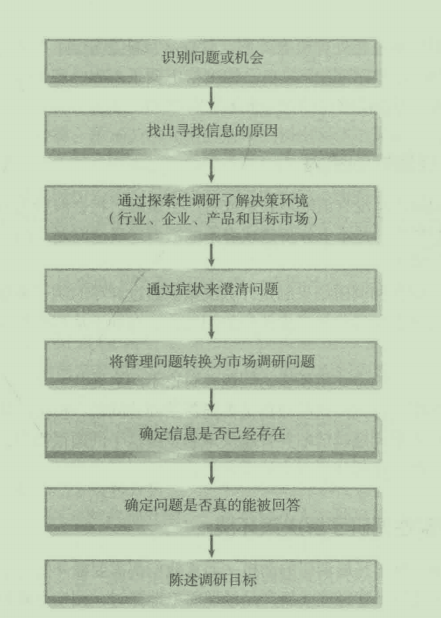
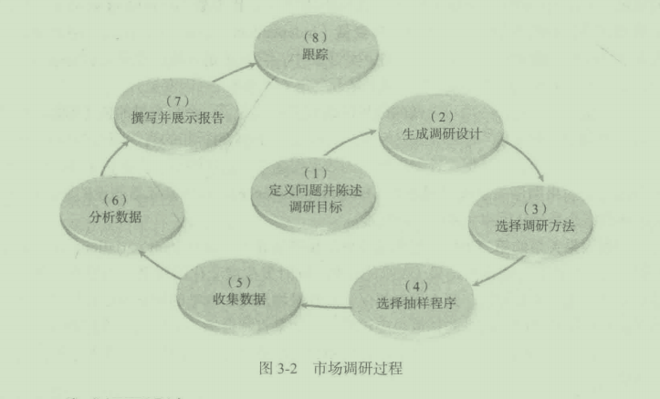
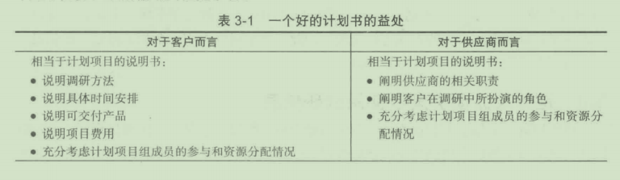
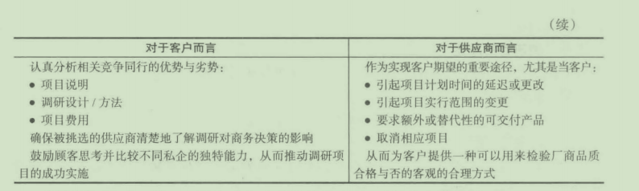
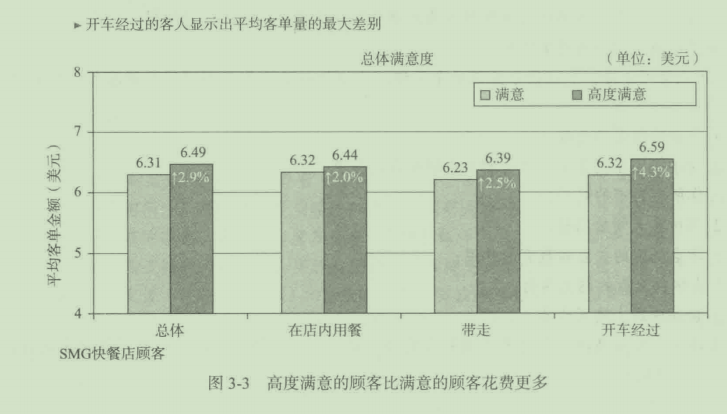
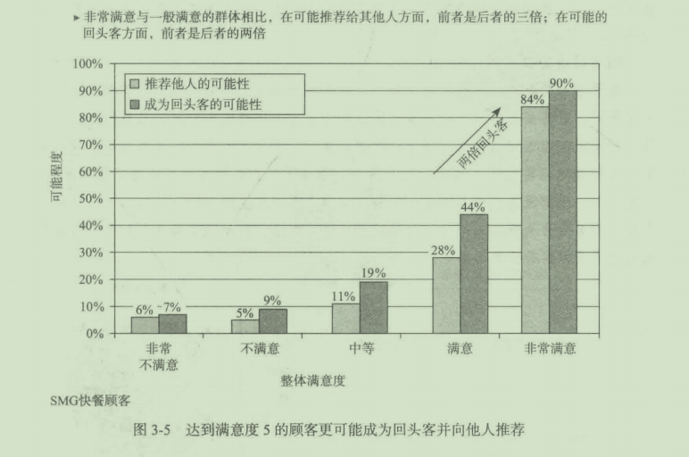
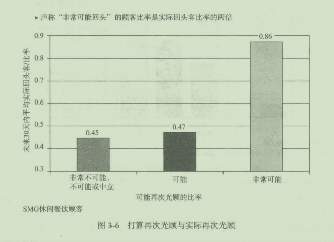
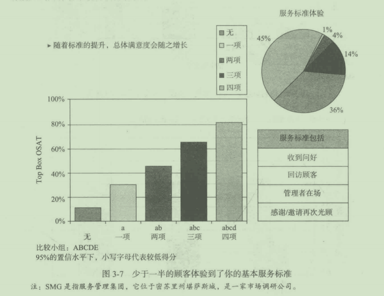
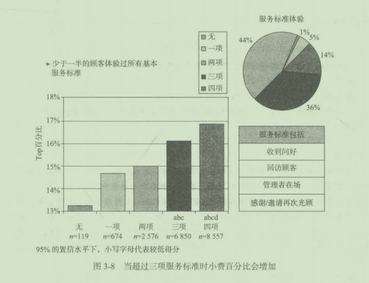
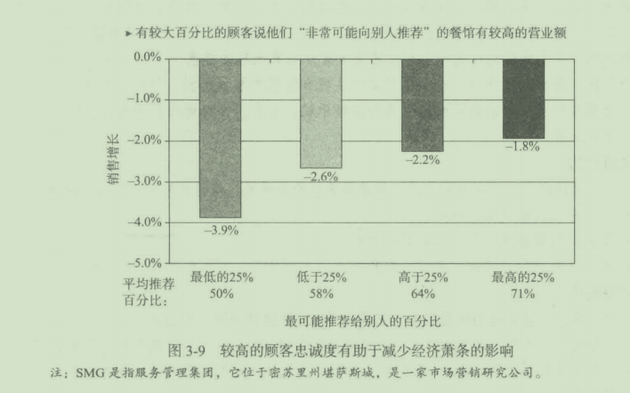

# 第 3 章 定义问题、探索性调研以及市场调研过程

## 学习目标

1. 分析问题界定的过程
2. 了解市场调研的步骤
3. 理解调研申请的内容
4. 了解市场调研目的的重要性
5. 了解是什么促使决策者应用市场调研信息

开展市场调研包含了一系列逻辑的步骤，由定义问题和调研目标开始 。 市场调研过程 中有什么步骤？调研过程如何启动？这就是本章中我们要提出的间题 。

## 3.1 正确定义问题的重要性
正确地定义间题是市场调研过程中至关重要的第一步。如果没有正确的定义所调研的间题，那么调研目标也会是错误的，并且整个市场调研过程都将会浪费时间和金钱。一家大型的消费品包装企业想要在品牌的重度消费者中进行一次调研，来了解品牌资产，更特别的是，它想要将资产扩展到新产品中。巾于品牌渗透率非常低，企业需要新产品来实现下一会计年度两位数的增长目标，注意缺少将调研学习（理解品牌资产）与企业目标联系起来。

品牌只有很小的赖以成长的基础，所以在最忠诚的用户中调查品牌资产无法帮助决策者实现两位数的增长。经再三考虑，企业目标集中千确定能够提高品牌渗透和成长的营销手段。因此，目标转换成了解现有品牌购买的屏障，并且确认能够激励类别消费者购买品牌的桥梁。

调研结果表明，品牌主要由千意识间题而遭到损害，品牌和类别用户都喜欢这个产品，但却不如类别中其他产品使用那么频繁，因为他们忘记了这个品牌。以广告、刺激和新产品为形式的提醒，成为能够提高品牌渗透率和帮助品牌成长的工具。在主要用户中间开展资产的研究显然不会捕捉到这些。

图 3-1中显示了定义间题的过程。请注意最终的目标是开发一个清晰简明并且有意义的市场调研目标。对这些间题进行调研将会为管理者提供确切的决策信息。

图 3-1 问题定义过程

### 3.1.1 识别间题或机会

市场调研过程开始千营销问题或机会的识别。由于企业外部环境的变化，企业面临这些问题：“我们是否应该改变现有的营销组合？”“如果应该改变，怎么去改变？＂市场调研可能用于评估产品与服务、促销、分销及定价策略。此外，它也可以寻找和评估新机会，这个过程被称为机会识别(opportunity identification)。

让我们观察一个机会识别的例子。美国咸辣酱的年销售额约为11亿美元，是美国鹰嘴豆泥的两倍多。鹰嘴豆泥是由鹰嘴豆和脱皮芝麻酱混合蒸制而成，通常搭配橄榄油、拧檬汁和大蒜来调味。新口味（比如黑橄榄味和烤红辣椒味）帮助拉动了需求增长，但是美国只有18%的家庭购买过鹰嘴豆泥。西部各州，比如加利福尼亚州和亚利桑那州，通常能很快接受新上市的非肉类食品。但是，美国西部的鹰嘴豆泥每周每店的平均销售额却是最低的(382美元），随后的是美国南部(406美元）、美国中部(493美元）、美国东部(762美元）。看起来鹰嘴豆泥的市场存在着大量机会，毕竟鹰嘴豆泥只是另一种浸刚的调料，就像咸辣酱和酸奶油一样。为了促进鹰嘴辣酱的市场增长，以追平或超过咸辣酱的市场需求，需要创新市场营销策略。一个策略是增加试用该产品的顾客数量，另一个关键策略是增加美国西部地区和南部地区对鹰嘴辣酱的消费。

当然，市场调研不总是处理机会问题。管理者可能想知逍：“为什么我们会失去市场占有率？”或者“阿贾克斯制造商将自己的价格下调了10%,我们应该怎么办？”在这些例子中，市场调研人员都能够帮助管理者解决间题。

### 3.1.2 找出寻找信患的原因

如果对市场调研信息没有清晰地表达或者产生误解，将会浪费大惜的金钱和时间。例如，管理者对他们想要的并不1-分清楚或者不能恰当地表达问题。因此，市场调研入员通常找到以下有川的活动：

- 讨论将利用信息和调研结果制定什么决策。通过详尽的例子来帮助澄清问题。
- 让客户或陓理者尽珊优先考虑他们的间题．这有助千从那些次要的兴趣中整理出核心问题。
- 用一些稍微不同的方式重新表达间题并讨论不同之处。
- 制作样本数据并且询问这些数据是否能帮助回答问题，模拟决策过程。
- 请记住，你考虑问题越清晰并且越快地感觉到这个问题很简单，那么你就越应该怀疑你是否已经真正理解了真实的需求。

### 3.1.3 通过探索性调研了解决策环境

一旦调研人员了解了开展调研的动机，通常他们都需要额外的背景信息来全面地理解问题。这可能意味着与品牌经理或新产品经理简单地探讨，阅读企业报告，参观生产设备和零售店铺，或许是与供应商讨论勹如果行业有一个贸易协会，那么调研入员可能会为（协会所发布的信息而仔细查阅它的网站。市场调研人员对包括行业、企业、产品或服务和目标市场在内的营销环境了解得越深入，间题就越有可能被正确地定义。这一步可以看作是进行情况分析(situatio nanalysis)。

有时与经理和供应商进行泛泛的讨论和网络会见并不够，开展探索性调研(exploratory research)可用来获取更多对概念的理解或者有助于间题定义的透明化，它也用来识别要研究的重要变员。探索性调研是基础性调研，而不是用千决定一系列行动的明确的调研。

1. 探索性调研的形式
   
 探索性调研可以采取以下形式：前导性研究、经验性调研、二手资料分析、案例分析和焦点小组访谈。
   
 (1)前导性研究。前导性研究(pilot studies)是使用有限数园的受访者的调研，通常使用不太严格的抽样技术，而不是像大型的定量调研那样。

 例如，尼克公司(Nickelodeon)已经注意到了新的生育高峰，想了解这对千网络意味若什么。探索性调研显示，长期以来持有的对儿童态度的假定是不正确的。在电视节目中，女性形象受女孩喜欢但不受男孩欢迎的现象在改变，这个有趣的发现是通过探索性调研得到的。本次探索性调研是巾互联网上小规模的前导性调研，以及召集一小群儿童讨论

他们对电视的态度的焦点小组访谈组成。像尼克公司的研究一样，许多探索性调研都具有高度的灵活性，使调研人员能够在时间和金钱的允许范围内跟踪想法、线索和直觉。想法经常可以从某个领域的专家处获得，例如尼克公司与幼儿心理学家的交谈。

随着探索性调研的开展，市场调研人员应从中识别出一些市场调研问题及了间题。调研人员应了解与问题有关的所有因素，这些因素将构成调研的主题。界定问题这个阶段要求采用头脑风暴法，但是应由先前阶段的研究结果所引导。所有可能的问题都应列出，而不要去考虑它们是否可以通过调研解决。尼克公司最终将市场调研问题界定为：一项以女孩为主人公的活泼的娱乐栏目是否同时受到男孩和女孩的喜欢。定员的调研结果显示这个节目会吸引两种性别，千是采取了管理上的行动，结果产生了一个栏目，主人公是女性，但是近53%的听众是男性。

(2)经验性调研。探索性调研的第二种形式就是经验性调研。经验性调研(experience surveys)包括与富有知识的入进行交谈，既有组织内的也有组织外的，它们都能提供对问题的见解。很少有经验性调研会涉及正式的间卷，反而经验性调研可能会有一个简单的讨论主题。例如，如果JetBlue重新设计机舱的内部，可以利用经验性调研来与内部设计者、频繁飞行的飞机旅客、飞机服务人员和飞行员进行交谈。

(3)二手资料分析。二手资料分析是另一种形式的探索性调研。二手资料分析会在第4贲展开介绍，所以在此只是简略地介绍。二手资料是为其他目的获得的数据。现在．市场调研人员能够通过网络非常快地并且以最小的成本接触到二手资料的无数来源。几乎很少主题是二手资料没有的。有一点幸运的是，市场调研人员可以利用二手资料来帮助精确定义问题。

(4)案例分析。案例分析(case analysis)是探索性调研的第四种形式。案例分析的目的是从一些与现在研究问题相近的情境中评审信息。例如，横跨美洲的电子设备公司非常想采用营销观念并且成为顾客导向，因此它们正实施市场细分研究、顾客满意度研究和顾客忠诚度等的调研。为更好地理解电子设备行业的解除管制，调研人员正通过测试案例来研究航空行业的解除管制。然而，调研人员必须注意确定每个案例与现有研究问题的关联性。

(5)焦点小组访谈。焦点小组访谈是深度的讨论，通常包括8~12名成员，由一个主持人领导并且通常局限在一个特定的概念、想法或主题。通常是有一个人说出普通想法，引发其他人的思考和评论，由此产生小组的动态讨论。这就是说，相对千单独采访这些受访者而言，受访者的相互影响会产生更多的信息。焦点小组访谈是第5章的基本主题，所以我们在这里只做简单介绍。这里提到焦点小组访谈是因为它是探索性调研中最受欢迎的一种形式。

焦点小组访谈能够包含任何一个可想象到的主题。与其他市场调研文稿的作者不同，焦点小组的执行者进行过3000多次的小组访谈c当利用到探索性调研时，焦点小组访谈通常有助千澄清并理解所包含的问题和争论点。一些讨论主题的例子包括：什么产生了哈雷秘法；当你在孩子头上发现乱子时会怎样；龙舌兰洒在美国制造是否会成为一个问题；哪件厨房用品最难打扫，等等。

2. 使用内部网进行探索性调研
   
 计算机是进行探索性调研的一个有力的工具。在一个拥有内部网络的大型组织内，调研人员能够决定是否需要组织内其他地方的相关信息。例如，德州仪器公司(Texas Instruments)的企业市场调研部门已经开发出了一个强有力的内部网络程序，允许全世界的德州仪器公司管理者在关键字的基础之上搜索过去的研究和正在进行的研究。它们可以直接在线进入每个研究的简要介绍，并且可以发送电子邮件来搜寻许可，以便查看过去项目的报告全文。报告的拥有者（付过费的人）可以通过邮件给予电子许可，整篇报告也可以在线阅读。
   
 越来越多的组织正在开发相似的系统，以便将信息更加有效地应用到管理中。在大型组织内部，一个部门进行的调研项目对另一个部门的经理也有非常大的价值是很平常的事。然而，一个部门通常不知道其他部门做过什么项目。像德州仪器公司这样的内部网络系统，会帮助组织从调研支出中获得最大的利益。

 内部网提供了访间内部数据的便捷途径，而互联网也是一种非常宝贵的资源，通过它可以搜索到数以百万的外部信息来源。在探索阶段，调研人员可能使用任何一个或几个在线搜索引擎，以找到所需的信息。这类搜索不仅比传统的图书馆检索快得多，而且提供在任何图书馆都找不到的海量信息。调研人员进行互联网搜索，可在几小时内找到或下载所需的信息，而标准的图书馆检索可能需要几天或几周。最后，调研人员可以发现一些可能与某一调研项目相关的讨论小组或特殊兴趣小组。

3. 完成探索性调研
   
 当市场调研人员确信他们已经找到了这一间题的主要特性时，探索性调研就结束了。他们可能巳经定义了一系列的问题，可作为详细的调研设计的具体指导；或者他们可能巳经发展出许多潜在性想法，这些想法是关千某一具体重要间题可能的起因的；他们也可能巳经确定其他某些因素的可能性是极小的，在进一步的调研中可以有把握地忽视这些因素。最后，调研人员可能结束探索，因为他们认为进一步的调研是不必要的，或者他们认为由于时间、资金或其他条件的限制，进一步的调研在当前是不可行的。

### 3.1.4 通过症状来渔清问题

市场调研人员必须仔细区别症状与真正的间题。症状是由于其他事物的存在而出现的一种现象。例如，管理者经常谈论销路不佳、利润下滑、消费者投诉增加、消费者背叛等问题。每个问题只是更深层次间题的一个症状。也就是说，某一因素正在导致公司消费者的流失，是竞争者提供了更低的价格吗？或者是竞争者提供了更好的服务吗？关注于症状而非真正的问题通常被称为“冰山原则”。一座冰山约10%是露出海面的，剩下的90%在海面以下。仅仅全神贯注千能够看见的障碍，管理者可能不会理解隐藏的深层次问题。

确保巳经界定了真正的问题并不总是一件容易的事。管理者和市场调研人员必须要有创造力和良好的判断力。深入一个问题的核心有一点像剥洋葱，你必须一次剥掉一层。一种排除症状的方法是间：“这是什么引起的？”当调研人员不能回答这一间题时，真正的问题就在眼前了。例如，圣路易斯市水泵制造商从上年度以来销售额下降了7%,管理者问：“这是什么引起的？＂查看产品线的销售额后，管理者发现除重型潜水泵以外所有产品的销售额都在上升或者大体没变，而霆型潜水泵的销售额下降了近60%。然后他们接着间：“这是什么引起的？”与上年度相比，东部与中部的销售额基本未变。然而，在西部地区的销售额却为零！他们再次问：“这是什么引起的？”进一步的调研显示，一家日本厂商正在西部市场以它们售价的约50%倾销某种类似的重型潜水泵．这才是真正的问题。于是该厂商游说司法部门，让司法部门对日本公司进行罚款，并发布终止这一行为的命令。

### 3.1 .5 将管理问题转化为市场调研问题

一且识别了真正的管理决策问题，就必须将其转化为市场调研问题。市场调研问题(marketing research problem)详细规定了解决间题需要什么信息，以及如何有效率、有效果地获得这些信息。市场调研目标(marketing research objective)就是目标陈述，它界定了解决市场调研间题所需要的具体信息。管理者必须将这些信息与他们自身的经验以及其他相关信息联系起来，以做出恰当的决策。

和比市场调研间题，管理决策问题(management decision problem)是行动导向的。管理决策问题的范围更广，远比市场调研问题笼统。调研要想成功的话，必须严密地界定市场调研问题并使其具休化。有时需要开展几项调研才能解决一个宽泛的管理决策问题。

### 3.1 .6 确定信患是否已经存在

柜比通过查阅原有报告与数据文件来确定所需要的信息是否巳经存在，开发新信息似乎更容易也更有趣。最新数据似乎最能反映“当下情况＂，因此调研人员倾向于假设现有数据优千以前收集的数据。调研人员对新数据的格式以及全面性有更多的控制，因此操作起来更容易些。不过，如果巳存在的数据可以解答市场调研的问题，那么使用已存在的数据就可以为管理者节省时间和金钱。

调研目标必须尽最具体且不可模棱两可。切记，整个调研项目投入的时间与资金都是为了达成目标。当市场调研人员与某个委员会接触以便了解某一特定项目的目标时，委员会成员可能对需要什么并未达成一致。经验告诉我们，调研人员与委员会（或委员会主管）接触时，应准备好一份书面的调研目标清单。然后，调研人员应该问管理者：“如果我们完成了清单上的目标，你是否就有足够的信息来做出这一问题的决策？“如果回答是肯定的，就应该要求管理者签字，以确信管理者是同意这些目标的。之后，调研人员应给管理者一份复印件，保留一份作为调研文件。以书面形式保留协商一致的目标，防止管理者事后说：＂嗨，这不是我想要的信息。”在繁忙复杂的公司环境中，此类误解比你想象的还要多。

避免“想知道更多“综合征

即使在探索性调研完成之后，管理者仍经常从广泛的、未知的领域来讨论调研目标。他们说，实际上，“这是我不知逍的一些事情”。一位星巴克的主管可能想知道：“你知道，我们已经在店里销售现场烘焙的食物·...．我想知道入们是否会在超市购买冷冻的星巴克酥皮糕点和面包卷？”可能我会在关千户外广告媒介的研究中问这个问题。遗憾的是，这种情形通常会带来失望。有趣的调研结果本身并没有错，但它们必须也是“可用于行动的＂，也就是说，调研结果必须提供决策所需的信息。完成调研目标并不仅仅在千增加管理者对间题的了解，除非整个调研是探索性的，否则它就应该导致某一决策的产生。也许确保调研是可用于行动的最好方法是确定调研结果将如何被使用。仅问对杂货店中星巴克冷冻烘焙食物是否有购买意向的问题，是不能用千行动的。还需要知逍更多的内容，如食物类型、岑售价、包装设计芍；另外，还需要进行许多的口味测试。

### 3.1.7 确定问题是否真的能被回笞

叫市场调研人员言过其实时，他们正在损害市场调研的可信度。无论是由千急千取悦顾客还是迫千管理权威．调研人员都应该避免为可能性很小的成功做出无调的努力这是相当重要的。在大多数情况下，你可以通过识别以下几种情况提前了解成功的可能性。

- 你确切地知逍所需信息巳经存在或能够容易地获得的情况 。
- 基于以往的经验，你颇有把握能收集到信息的情况 。
- 你正在探索相当新的间题，有劳而无功的风险悄况 。

### 3.1.8 陈述调研目标

问题界定过程的最终结果是一份调研目标的陈述。这些目标应以识别市场调研问题／机会所需的准确信息来加以表述。精心制定的目标可以作为实施调研项目的路线图，也可作为管理者评估调研质址与价值的一个标准。“目标可以实现吗？”以及“从目标与调研结果中可以得出符合逻辑的建议吗？”

## 3.2 将调研目标作为假设

假设(hypothesis)是指调研人员或管理者就被调研的人口特征做出的假定或理论猪想。假设必须是对实际测试数据敏感的。所以，像这样一个声称“一个大头针上有I000个角”的陈述，不是一个假设，它无法印证现实中的数据。

假设倾向千具有预测性。例如，一个汽车经销商对所有本田新车的购买者做出假设，假设那些收到告知他们买到的是市面上最好车的保证信的买家，将会比没有收到保证信的买家更满意。

假设往往以一个无效的形式表示，即“一和＿没有区别＂。也就是说，“收到增强想象信件的本田车购买者与没有收到该信件的购买者在满意度上没有区别。“最终调研人员的结论将会在研究数据的基础上保留或拒绝该无效假设。

学术调研通常是在假设下进行。在学术调研之外的实践上的市场调研，很少正式采取假设法，然而也要经过统计检验推断。

## 3.3 调研过程

我们刚刚讨论过市场调研的第一步：定义间题或机会．确定市场目标。调研过程的其他步骤是：生成调研设计，选择调研方法，选择抽样程序，收集数据，分析数据，撰写并展示报告，跟踪每一条产生千该报告结果的建议（见图3-2)这此过程的综述形成了全文的基础。接下来的音节讲述市场调研过程的具体几个方面。

#### 3.3.1 生成调研设计

调研设计(research design)是指实现调研目标或检验调研假设所要实施的计划，调研人员需要建立一个回答具体调研间题或机会的框架结构。客观上不存在唯一好的调研设计；相反，调研人员可以有多种选择，每种选择各有优缺点，调研人员需要进行权衡。一般来说．主要权衡调研成本和决策信息质员。通常，所获得的信息越准确、错误越少，成本就越高。另外，需要权衡时间限制和调研类型。总之，调研人员必须在各种条件的约束下，向管理者提供尽可能好的信息。调研人员的首要任务是决定调研应该是描述性的还是因果性的。

1. 描述性研究
   
 描述性研究(descriptive study)试图同答诸如谁、什么、何时、何地和怎杆等问题。描述性研究暗含的书实是，管理者已经知逍或了解了间题背后的基本关系。一个变量(variable)是一个简单的符号，或是能够反映任何一组数值的概念。
   
 星巴克的描述性研究可能包括星巴克的典型的、轻度的和五度的购买者的人文和生活方式的特征，以及星巴克烘烤食物的购买者、星巴克三阴治的购买者和速溶咖啡的购买者。其他的问题有，确定从家中或工作地点到最近的星巴克的行车时间，以及购买方式是刷卡还是支付现金。
   
 描述性研究可以说明两个变呈，例如广告与销售情况似乎存在某种关系．但是它不能提供足够的证据证明较高的广告投入导致较高的销售额。由于描述性研究有助于识别一些联系或关系，因此它可以帮助调研人员确定因果性研究的变量。

2. 因果性研究
   
 在因果性研究(causal study)中，调研人员要考察一个变录是否导致或决定另一个变挝的值。调研人员要考察一个变最是否导致或决定另一个变矗的值，并试图建立它们之间的联系。可以用实验法（参见第8章）来检测因果关系。因变量(dependent variable)是指能被预测或解释的变蜇。和对的是，自变量(independent variable)是在实验中市场调研人员可以操纵、改变或修止的变记。在调研项目中，自变量是导致因变量变化的原因。例如，星巴克希望知道广告支出（自变量）是否决定了销售水平（因变量）。

 对于星巴克而言，一项可以做的因果性研究是：改变了一个自变量的值（例如，在过去的6个月中一包l磅8的咖啡给目标客户可以提供10%的折扣的直接邮寄数址），然后观察对咖啡销售的影响，促销性邮寄材料的效果提高了。这样的话，说明在事件之间存在某种适当的因果顺序关系或时间序列(temporal sequence),效果紧随着假设的原因出现。时间序列概念是确认因果关系的一项标准。

 判别因果关系的第二项标准是相随变化。相随变化(concomitant variation)是指假设原因（直邮促销）与假设的结果（咖啡的销售）同时发生或变化的程度。如果直邮促销是导致咖啡销售增长的原因，那么当直邮促销的数侃增加时，咖啡的销量也应该增长；当直邮促销的数旦减少时，咖啡的销址也应该诚少。如果直邮促销的增加没有引起咖啡销售的增长，调研人员必须得出结论：对于直邮促销和咖啡销扭之间的因果关系性关系的假设没有得到支持。

 理想的情形是，星巴克提高直邮促销水平（最高可达到饱和水平），每次都能带来咖啡销售的增长。但是，我们生活在一个并不完美的世界。一次额外的邮寄可能带来销倡的少扯增长，而下一次邮寄会导致销址的大幅增长。也许再过半年，直邮促销的增长可能并不会对销量产生影响，销鼠甚至可能会下降。

 请记住，即使完全相随变化也不能证实A导致B,调研人员能够得出的结论是，这种联系使得假设很可能成立。

 研究因果关系的一个重要问题是，应认识到虚假联系(spurious association)的可能性。也就是说，因变招的变化可能是巾其他变量引起的。理想的情况是，调研人员能够证明完全不存在其他原因。然而，在市场调研的现实世界中，识别和控制所有其他潜在的可能因素很困难。设想一下能造成一包1磅装的咖啡销世上升或下降的所有因素，如博客、价格、报纸、电视广告、奖券、手机广告、折扣和天气等。调研人员可以通过控制其他因素来减少虚假联系的可能性。另外，调研人员也可以考察具有类似社会经济特征的其他地区销批的变化状况。

### 3.3.2 选择调研方法
调研人员可以根据调研项目的目标选择描述性或因果性的调研设计。下一步是选择收集数据的方法。有三种基本的调研方法：询间法、观察法、实验法。调查通常是描述性的，也有因果性的。观察通常是描述性的．而实验几乎总是因果性的。

1. 询问法
   
 询问法调研(surveyresearch)是指调研人员（除邮寄间卷调查和网上调查外）通过与被调研人员的面对面互动获得事实、观点和态度等方面的信息。问卷总是获取数据的一种有序的结构化的方法。面对面的访谈可以在受访者家中、购物中心或企业进行。

2. 观察法
   
 观察法调研(observationre search)是观察顾客的行为模式，而不是询问顾客做什么、为什么做。这可能包括人观察或者是用各种机器观侧。从2000年开始，金俏利－克拉克公司（凡mberly-Clark)作为Huggies、Kleenex和其他家庭主食的制造商，给顾客配装按在帽舌上并连接到记录装笆的摄像机。在参加合唱或购物的时候，收到报酬的参与者带着这种被称为CVS的有着奇怪外形的监视设备。
   
 在该系统下．金伯利－克拉克公司发现那些用这个沐浴露品牌的妈妈们拿瓶子是存在困难的，需要两只手打开和挤出沐浴霹。创新和设计部的负责人贝基说：“妈妈们不得不同时用一只手抱着孩子。”
   
 金伯利－克拉克公司重新设计了一个可以紧紧握住的瓶子，并且有用一个大拇指就轻易可以打开的大盖子。其结果是它们的市场份额有了明显提高，观察法调研将在第7立详细阐述。
   
3. 实验法
   
 实验法(experiments)是调研人员用来收集数据的第三种方法。在实验中，调研人员可以改变一个或多个变量，如价格、包装、设计、货架空间、广告主题或广告费用，然后观测这些变化对另一个变旦的影响（通常是销售额）。实验的目的是检测因果关系。最好的实验是，除了那些操纵的变量外，保持其他所有因素不变，这样调研人员可以对销售额的变化是否由广告投入的变化引起进行相当肯定的推断。
   
 在外部环境中，如果不是不可能的话，要保持所有其他因素不变也是非常艰巨和花费高昂的任务，诸如各市场中竞争者的行动、气候和经济状况这些因索均超过了调研人员所能控制的范围。控制可能影响因变似的那些因素的一种方法是采用实验室实验，也就是说，在实验室内而不是在自然环境中进行实验。有时调研人员创造出楼拟超市环境，给消费者一些便条（即代金券），然后诮他们像平常一样购物。例如，通过几次改变包装设计或颜色，调研人员可以确定哪一种包装最可能刺激销售额。尽管实验室技术能提供有价值信息，但是必须认识到，这些消费者不是在自然环境中。人们在实验室中的行为与实际购物情形可能是不同的。实验法将在第9章进行详细讨论。

### 3.3.3 选择抽样程序

样本是一个大总体中的一个子集。尽管样本实际上是调研设计的一部分，但在调研过程中是一个独立的步骤。在制订抽样计划前，必须先回答几个问题。首先，必须界定所涉及的总体，也就是将要从中抽取样本的群体，它应该包括所有他们的观点、行为、偏好、态度等能够产生有助于回答调研间题的信息的人。例如，所有每60天至少吃一次墨西哥食物的人。

总体界定后，下一个需要回答的间题是，是用随机抽样还是非随机抽样。随机抽样(probability sample)是总体中的每个元素都有一个被抽中的非零概率。采用这种样本，调研人员可以估计研究中的抽样误差。非随机抽样(nonprobability samples)是指总体中的不同元素被抽中的机会是不可知的。具体来说，任何没有试图完全代表总体各部分的样本都是非随机样本。调研人员无法用统计的方法计算非随机样本的笆信水平，也就是说，无法确定预计的误差大小。抽样间题将在第13章讨论。

### 3.3.4 收集数据

现在，大多数调研数据是从互联网上收集来的。数据收集工作是巾市场调研现场服务公司完成的。遍布全国的现场服务公司根据分包合同，通过面对面或电话访谈来收集数据。一项典型的调研项目往往需要在几个城市中收集数据，需要同许多现场服务公司一起工作。为确保所有的分包商按照统一的方式工作，每件工作都需要制定详细的说明，每个细节都应该得到控制，分包商必须严格执行规定程序。除了访谈外，现场服务公司还提供焦点小组访谈设施、购物中心调查的场所、试销食品存储和生产检测食品的厨房用品，它们也提供零售清点服务（清点零售货架中销售的产品数量）。

### 3.3.5 分析数据
数据收集完成后，调研过程的下一步就是进行数据分析。分析的目的是解释所收集的大量数据并提出结论。市场调研人员开始时可能只做简单的频次分析，最后可能会使用复杂的多变偎技术。数据分析将会在稍后的音节中进行讨论。

### 3.3.6 撰写并展示报告
数据分析完成后，调研人员还必须准备报告，并向管理层沟通结论和建议，这是整个过程的关键环节。因为想让结论发挥作用的市场调研人员必须使经理相信，依据所收集的数据得出的结论是可信和公正的。

通常，要求调研人员就项目进行书面和口头的报告。在准备和展示报告时，一定要考虑听众的性质。在报告的开始，应对调研目标做清楚和简洁的说明，然后对采用的调研设计或方法进行全面且简洁的解释。之后，概括性地介绍主要发现。报告的最后，应该提出结论和对管理者的建议。在今天快速发展的市场调研的世界里，苦心经营的书面报告本质上是过去的东西，今天的决策者只想要一份PPT的拷贝而已。

1. 判断报告质 量
   
 由千准备进入营销领域的大多数人将成为调研的使用者而不是调研的供给者，因此了解应该从报告中得到什么是非常重要的，评价调研报告的能力也是非常重要的。与我们购买其他产品类似．质量并不总是那么显而易见，高价格也不一定意味着高质阰。评价调研质量的基础是最初的调研计划书。调研是否实现了调研计划书中所确立的目标？是否采用了计划书中规定的方法？结论是否为数据分析所做的逻辑推理？结合所得出的结论，建议是否审慎？

2. 利用互联网发布调研报告
   
 调研供应商和客户直接在网上发布报告将越来越普遍。所有最新版本的主要文字处理软件、工作表和演示软件包都可以生成网上使用的材料，这大大简化了在网上发布报告的过程。一些公司，如德州仪器公司，今天正在这样做。这些材料一般不放在公共区，而是存在千企业内部网的某个地方，或在向公众开放的互联网上需要密码或口令才能访问的地方。网上发布报告有许多优势：
   
 (1) 分布在世界各地的管理者或获得许可的有关各方，可以直接获得这些报告 。

 (2)这些报告采用多媒体的形式，包含了文本、图标、各种类型的动画、声音评论、剪贴图片等。

 (3)这类报告可以实现完全查询。例如，一位经理可能对某个篇幅较长的详细报告中有关广告的所有材料感兴趣，不必翻阅整个报告查找，只需进行查询，他就可以搜索到报告中与广告有关的任何评论。

### 3.3.7 跟踪

在花费了可观的精力和资金开展市场调研并准备报告后，重要的是付诸实施C,管理者应该决定是否实施所提出的建议，为什么实施，为什么不实施。正如你在第4章节将要乔到的那样，有助千保证调研结果发挥作用的一种方法是，尽量减少市场调研部门和其他部门之间的冲突。

## 3.4 调研过程的管理

### 3.4.1 调研申请

在开展调研项目前，像微软这样的公司可能要首先审批正式的调研申请，中型和大型零售商、制造商和非营利性组织经常将调研申请作为决定是否资助项目的基础。一般来说，在大型组织中，市场调研的申请数量远远超过可以用于调研的资金，因此可以将调研申请作为配置稀缺调研的正式手段。

无论是品牌经理、新产品专家，还是其他任何有调研信息需求的人，都应该在正式调研申请中清楚地说明所希望得到的信息对组织至关重要的原因，否则，审批的人可能不会明白为什么需要展开某项调研。

在较小的组织中，品牌经理和市场调研人员之间的沟通非常紧密。日常的接触常常可以取代正式的调研申请，资助调研项目的决策巾营销经理或市场调研主管根据需要做出。

提交和审批调研申请是识别调研间题和获取资助的有效管理方法。在调研过程中的这一阶段所花费的努力程度，将直接反映在提供给决策者的信息质量上，因为它将引导调研设计、数据收集、分析和调研的报告等高度集中千调研目标。一份正式的调研申请应包括

以下内容：

(1) 行动。决策者必须描述依据调研将采取的行动。这将有助千决策者集中关注那些有意义的信息，并引导调研人员提出的调研设计和分析结果。

(2) 起因。决策者应陈述导致行动决策的事件，这将有助千调研人员深入了解管理决策间题的性质。

(3) 信息。决策者必须列出采取行动所需回答的间题，在这方面深思熟虑有助于提高调研效率，确保调研的问题有意义。

(4) 应用。这部分解释每条信息对制定决策的帮助，这有助千调研内容的合理性，确保调研问题有意义。

(5) 目标群体和子群体。这部分描述从哪些入处获得与调研问题有关的信息，这有助于调研人员设计调研项目的样本。

(6) 后勤保障。时间和预算的限制常常影响项目调研技术的选择，正因为如此，在调研请求中应对所需的费用进行估算，并说阴需要结果的时间。

(7) 评论。其他任何有关调研项目的事宜均应加以说明，以便调研人员充分了解间题的性质。

### 3.4 .2 征求建议书
调研申请是经理使用的内部文件，用以决定哪些项目需要资助。征求建议书(request for proposal,RFP)是传送给市场调研供应商的一种请求，邀语他们提供一份包括投标标书的正式提案。征求建议书是调研供应商的生命线，它是达成业务、取得收益的第一步。

一般来说，征求建议书要介绍进行研究的背景资料、研究的目标、采用的调研方法，并做出时间安排。在有些需求说明书中，供应商需提出一种方法，并实现调研目标。绝大多数的征求建议书包括：心一份费用明细表；＠供应商在相关领域的经验；＠参考资料。计划书的截止日期一般要确定下来。

供应商在根据征求建议书进行调研时，必须进行全面充分的准备。很多客户提出这一观点”计划书的制作好坏体现公司产品的优劣＂。因此，调研人若想取得竞标，必须拿出充足的时间充分准备计划书。

## 3.5 市场调研计划书

当进行市场调研的供应商收到需求方案说明书时，他们需要向潜在客户提供一个调研计划书。该调研计划书(research proposal)是一份提供调研目的、调研设计、时间安排以及项目费用的文件。在附录3A中有来自DecisionAnalyst调研公司（一家国际性调研公司）两名项目经理的实际建议。如今绝大多数的调研计划书都比较短小(3~5页），以邮件附件形式寄给潜在客户。联邦政府所做的调研计划书可达50页之多，联邦所做的调研计划书都有一些法定格式。

大多数调研计划书都包含以下几方面：

### I 标题页

此项包括征求建议书中项目的标题、计划书准备人的姓名、联系方式、计划书所面向群体以及制定日期。

### II 调研目的陈述
此项通常在征求建议书中提到，若没有，必须按照前几章节所说确定下来。
### Ill 调研设计
此项需说明如何收集数据、采样群体以及样本容量 。
### IV 问题的范围
此项并非所有计划书都有，但根据经验来讲此项确实十分有帮助 。 它是基于调研目的
所列出的一个初步调研清单 。
### V 数据分析
此项需利用一些技巧来分析数据 。
### VI 相关人员
此项列出所有参与此项目的监督和分析人员以及简短的个人简历，也必须列出每个 人 的分工 。 如果潜在客户和销售方巳经建立持续的业务关系 ， 则此项通常可省去。在大多数 政府性工作中此项是必需的 。

###  产品明细和假设

大多数征求建议书相对简短，未涉及所有细节 。 为确保销售方和潜在客户意见一致 ， 最好是在制作计划书时将产品明细和假设列出（见附录 3A ) 。 表 3-1 中详细阐述了好的计划书对客户和卖方双方的益处 。

### VI 服务
服务部分主要是用来准矶说明研究供应商的工作范围 。 例如，谁来设计问卷调查表 ， 是顾客、供应商还足两者共同完成？严格规定工作范围的目的 ， 就在千确保客户和调研供 应商在持有相同期望的背景下工作 。

### IX 费用
费用部分主要是用来阐述项目实施过程中资金的具体去向 。

### X 时间安排
此部分只要是用千标明项目不同阶段的完成日期，并注明项目全部完成的准确日期。

因为建议书的接受与否直接影响着公司的收入情况，所以调研计划书的准备工作也许就是公司调研部门最重要的职能了。若某个调研公司的计划书没有被采纳，那么这个公司就会因为缺少资金而走向倒闭。除此之外，如果公司方案成本偏低，那么即使能够拿到项目，也会收效甚微。同样，即使计划书完美无缺，公司也会因为较高的方案价格而在竞争中处千劣势，继而输给其他竞争者。

  
 **市场调研供应商在追求什么**
  
 堪萨斯的市场调研公司Market Directions曾要求美国市场调研的客户就几份关千调研公司和研究部门的陈述的重要性做出评估。评估答复来自各行各业、这些答复概括了客户对市场调研人员相关的品质要求。以下10个为最重要的要求：

  (1) 面对客户要充满自信 。

  (2) 诚实守信 。

  (3) 准时 。

  (4) 灵活变通 。

  (5) 履行项目规范。

  (6) 坚待提供高质措产品 。

  (7) 密切关注客户需求 。

  (8) 坚持高标准的质址监控 。

  (9) 与客户互动的过程中始终以客户为导向。

  (10) 新项目的实施必须保证让客户把握相关动态。

 在以上1O个要求中，自信和诚信是两个最受关注的品质，它们同属逍德范畴。其他的因素则关系到调研功能的实现和良好沟通的维持。

 良好的沟通是十分必要的。在上述10个要求中，灵活变通、密切关注客户需求、坚持以客户为导向、保证让客户了解和关动态，全部属千良好沟通的范例。一个成功的市场调研机构无论是在集团内部还是在与客户的交往中都始终贯彻着良好的沟通。

 那么沟通究竞有多重要呢？首先，请思考一下下面这个例子。一般而言，经理们每天至少有80%的工作时间都花费在与他人的直接沟通上，换句话说，也就是每小时平均有48分钟都被用千开会、打电话或交谈。而剩下的20%的时间则用千案头工作，这其中的大部分又是以阅读和书写的方式进行交流。因此，我们可以得出一个相关结论，那就是沟通渗透在市场调研管理职能的方方面面。

## 3.6 是什么促使决策者使用调研信息

 当调研管理者能够有效地沟通、生成质量数据、控制成本并及时传递信息时，他们就提高了决策者利用他们提供的调研信息的可能性。然而学术研究显示，政治因素和成见也会影响调研信息是否会被使用。尤其当一个经理人使用调研数据是否是：1按照事先的愿望；2消晰地提示；3研究质量高；4在公司内部的政治认可性高；5挑战贫乏的现状。管理者和调研人员都赞同技术质盘是调研信息应用的最重要决定因素。然而，管理者不喜欢使用不符合先入为主的观念或者政治上不可接受的调研。当然，这并不意味着调研人员需要去迎合管理者的先入为主的观念。

在工业公司中，营销经理使用调研结果的倾向胜于消费品组织。这可能要归因千收集信息的目标更高、组织结构更加规范以及对收集到信息的惊讶程度更低。

DavidSantee、TrueNorthMarketingInsights公司的总裁，在下面的“市场营销实践3-1"中谈论到，市场调研为什么必须变得更具战略性。

**市场调研需要更具战略性**

David Santee 向市场调研人员提出并主张市场调研行业应变得更具战略性 。

公司高层管理者想要了解我们的信息和我们的洞察力，尽管他们表现得不那么明显。事实上，他们想让我们成为战略伙伴。MarketResearchExecutiveBoard所做的一份发人深省的研究发现，65%的公司高层管理者希望与市场调研人员成为战略伙伴。但有趣的是，只有25%的管理者那么看待我们。换句话说，他们想要，但我们没能提供。

市场调研正在发生变化：从战术性的变为战略性的，从提供数据变为提供解决方案，从技术性的变为协商性的，从执行指令的员工职能变为积极主动的合作伙伴。我们的市场也在变化。就像这些由于没有意识到市场变化而倒闭的公司一样，我们也正见证我们调研市场的变化，那么我们能识别出吗？

我们中的大多数并没有将自己定位为市场领域的专家或战略家。我们没有被任命去制定一个策略，或成为高层管理者想让我们成为的那种战略伙伴，我们不被认可是那种角色，是因为我们的确不是。我们的行业还没有变成那样，我们的技能还没达到那种程度。在我们能解决问题之前，我们必须要意识到问题的存在。

目前的问题不是类似这个产品是绿色好还是蓝色好，哪个广告突破最好，哪个口味最好，或者是测量顾客满意度这些日常战术性决策。真正的问题是，更多的可以为未来几年提供参考经验的重要战略性决策显著影响了公司的成功。这些通常是执行委员会所做的重要决定。公司中唯一的学习是那些有能力采取行动的人所做的学习。

问题：

1. 解释上文故事中的最后一句话。

2. 为什么“变得更具战略性”对市场调研如此重要？

## 本章小结

准确定义调研问题的过程包括以下几个步骤 ：
* 识别问题或机会；
* 发现寻找信息的原因；
* 通过探索性调研了解决策环境；
* 通过症状来澄清问题；
* 将管理问题转化为市场调研问题；
* 确定信息是否已经存在;
* 确定问题是否真的能被回答； 
* 陈述调研目标 。

如果问题不能明确定义，调研项目将会是浪费时间和金钱 。
以下是市场调研步骤 ：

(1)定义问题并陈述调研目标；

(2)生成调研设计；

(3)选择调研方法；

(4)选择抽样程序；

(5)收集数据；

(6)分析数据；

(7)撰写并展示报告；

(8)跟踪。

在进行调研设计时，调研人员必须决定是采用描述性研究还是因果性研究。描述性研究的目的是回答谁、什么、何时、何地和怎样等问题；因果性研究则是要探索一个变量（自变量）是否导致或决定另一个变量（因变量）的值。生成调研设计的下一步是选择调研方法，是采用询问法、观察法还是实验法。询问法调研是通过调研人员与受访者的交互作用来了解受访者的事实、观点和态度等信息（不包括邮件、网络和手机调查）；相反，观察法调研则不依赖直接的人际接触；实验法是调研人员改变一个或多个变量，然后观测这些变化对另一个变量（通常是销售额）的影响。大多数实验的目的是检测因果关系。

样本是总体的一个子集。随机抽样是总体中的每个元素都有一个被抽中的非零概率；非随机样本指随机样本之外的其他样本；任何在总体中的不同元素被抽中的机会是不可知的抽样都被看作非随机抽样。

在大型企业中，要求在调研目标确定后准备一份调研申请是很普遍的事。调研申请包括的内容通常有：依据调研将采取的行动、需要信息的起因、将如何使用信息、从哪些目标群体中收集信息、完成调研项目需要的时间和资金、与申请有关的其他任何信息。征求建议书是客户使用的从市场调研供应商那里寻求建议的文件。

市场调研计划书是相对于一个征求建议书发展而来的。有些情况下，这些计划书是依据客户和调研供应商之间的一些不正式的电话谈话产生的。这些调研计划书给出了调研目的、调研设计、时间期限和成本。调研计划书是为调研公司带来收入的工具。

良好的沟通是调研管理和使决策者使用调研信息的基础。传递给决策者的信息依赖千展开调研的类型。

## 复习思考题

1. 为什么说界定调研问题是调研过程中关键的步骤之一？谁参与了这个过程？

2. 探索性调研在市场调研中扮演什么角色？探索性调研与其他形式的市场调研有何区别？
   
3. 给一些症状的问题的例子，然后提出一些相关的实际问题 
   
4. 举几个例子说明进行总体普查比分析样本要好 。
   
5. 评价下述方法，并提出更合适的方法选择：
   
 a.超市对确定自身形象很感兴趣。它在顾客购物之前将一份简短的问卷放进每位顾客的购物袋中。

 b.为评估服务区域的范围，一家大型购物中心每周一和周五的晚上在露天停车场安排了调研人员。顾客停好车后，调研人员上前询问顾客所在区的邮政编码。

 c.为评估描述外星机器人的恐怖电影的市场潜力，一家电影厂邀请人们拨打900电话，说明自己是否喜欢这种电影。每位拨打电话的人可得2美元。

6. 你正在负责确定如何为本校商科专业吸引更多的生源，请列出完成该项任务应该采取的步骤，包括抽样程序。

7. 为增加决策者采纳调研人员提供的市场调研信息的机会，调研人员能做些什么？
   
8. 解释调研计划书的关键作用。
   
9.[团队练习］将一个班级分成四五个小组。小组的一半成员就下面的主题准备一些简短的征求建议书。

   a. 大学校园里的食物 ；

   b. 大学校园里的男生兄弟会和女生联谊会的角色 ；

   c. 你所在城市的娱乐；

   d. 你所在大学的网址 ；

   e. 学生之间的关系对教育的作用 ；

   f. 大学供应商的网上购物 ；

   g. 在互联网上购买音乐 。

 征求建议书应该清晰准确地界定调研目的和相关信息。剩下的小组成员对照征求建议书，提出一个调研计划书。

## 调研实例 3-1 我们出去吃饭吧

 在零售环境中，创造积极的顾客体验能够使顾客更富有商业价值，有时能增加高达50%的平均交易量。然而，在餐饮店的环境中，由于顾客很少如他们所想的那样在同一个地方吃两次饭，就使得通过提供出色的顾客体验来增加交易数址的机会减少了。但为顾客创造积极的体验以及执行服务标准至少能增加平均交易量。

 在餐饮店中经历了高度满意的用餐体验的顾客，会比那些只是刚好满意的顾客多花一些钱（见图3-3),尽管这个结果不是像零售业里那么戏剧性。当一个服务员能说出一个特别的开胃菜或菜品，交易增加的一部分就可以归功于积极销售的影响（见图3-4)。然而，更高的平均交易数量不仅仅是建议销售的结果，通过创造顾客喜欢的出色的用餐体验和提出额外的菜品，饭店的员工也能够帮助增加交易量。提供极好的顾客体验后立竿见影的效果可能不是那么明显，但对于个体餐馆或连锁餐饮店，显著的影响是在成千上万次交易的积累下形成的。

 **非常直观**

 那些经历了高度满意体验的顾客相较于没有经历满意体验的顾客，他们能够告诉我们用餐的时间并说他们还会经常光顾那家饭店。这非常直观，不是吗？好的体验和极好的体验之间的区别可能不那么直观勹当饭店经营状况尚佳时，它的服务是友好并声名远扬的，它的食物尝起来很美味，店内的气氛很和谐，这时你就创造了顾客忠诚平均来说，当比较经历了卓越体验的顾客和那些经历了不怎么满意体验的顾客时，各种结果都表明了在愿意再次光顾的数量上前者是后者的两倍，在愿意向亲朋好友推荐的数量上前者是后者的三倍（见图3-5)。这个图对从快餐店到高档餐厅的所有餐饮业终端都适用。简单地讲，创造一个极好的顾客体验等于创造了顾客忠诚。

► 开车经过的客人显示出平均客羊社的最大差别

人们不一定说了什么就做什么。当某个人说他是某个饭店的忠实顾客时，他真的是吗？也许另一个人说他会经常再次光顾，他真的会吗？我们可以将顾客忠诚度与信用卡或会员忠诚度数据相联系来测度这一行为。表示非常有可能在未来30天内再次光顾而且也的确这么做了的顾客，几乎是只说有可能在未来30天再光顾并实际行动的顾客的两倍（见图3-6)。如果饭店可以将5%或10%有良好体验的顾客转换为有特殊体验的顾客，从而形成顾客忠诚，那么到时候对交通和道路的影响便都可想而知。

**花更多钱**

一个有趣的发现：当顾客由于推荐或先前良好的体验而再次光临某个饭店时，他们实际上会花更多的钱。这与由于宣传推广和广告而初次光临的顾客形成强烈对比。这些人实际上花的钱要比因为其他理由而光顾饭店的人花得少。举一个快餐店的例子，调查发现．由于受到信任的朋友正面推荐而光顾饭店的客人，比由于广告而去饭店吃饭的客人多花费大约14%的钱。

**服务员是关键**

餐饮店如何打造积极的用餐体验以使客人愿意再次光顾并向他人推荐呢？这要从一线员工开始。服务员是将只是刚刚满足的顾客转变为忠诚顾客的关键，只要执行一套简单的服务标准就能大大带动顾客对用餐体验感到满意。图3-7说明了只是做到简单地向客人问好，与顾客定期再联系，对他们表示感谢，并确保客人在饭店大厅能看见管理者这几项，比起那些一项都没做或者只做了一项的，能使顾客满意度翻四倍。所以，确保能持续执行简单的服务行为大概是最可行的改善顾客体验的方法，拉动顾客满意度和忠诚度增长的最有效方式是保留最优秀的服务员。

注：SMG是指股务管理集团，它位于密苏里州堪萨斯城，是一家市场调研公司。

管理者和执行者能够从服务员那里获得创收的方式之一，是回归数据并向他们展示他们的行为对自己收入产生的影呴。将顾客反馈与交易信息相联系，可以看出那些体验过上述规定服务的顾客，不仅对那家饭店更忠诚，而且给那家饭店服务员的小费也更多。事实上，对于休闲餐饮，当顾客体验了所有应有的服务而不是仅仅其中之一时，他们给的小费有明显的增加（见图3-8)。当服务成为焦点时，餐饮店中的所有人都会共嬴（见图3-9)。

**问题：**

  1. 你认为这是一个探索性调研吗？如果不是，调研问题是什么？
  2. 这个调研是因果性的还是描述性的？为什么？
  3. 解释为什么OliveGarden会用这些信息，那么麦当劳又是为什么？
  4. 为做更深入的调研，市场调研计划书应该包括什么？

## 附录 3A

**市场调研计划书**

Decision Analyst 调研公司进行品牌资产研究的计划

机密

提供给：博彩娱乐城公司 (Fun City Gaming.Inc.)

制作者：凯西· 麦肯齐 (Kathi McKenzie ) 和萨莉· 丹弗斯 ( Sally Danforth )

2013 年

**背景**

博彩娱乐城公司近期经营了一个多级码头沉箱江轮和有三个餐馆、一个宾馆的陆上看台，这些都位于阿伦河边。这个娱乐场所提供1500个老虎机和70种桌上游戏，这是该娱乐城特许权的旗舰店。卡西诺娱乐城(Fun City Casino)有四个主要的竞争者，它们都位于娱乐城大约30英里e半径范围内。在所有竞争者中，卡西诺娱乐城在税收上排名第二，但利润居首位。除了这些竞争者，其他竞争者将由计划中的“野河＂娱乐场所提供支持，它们很可能在一年内开始建设，这个娱乐场所将坐落在圣乔治市，距离卡西诺娱乐坡只有几分钟的路程。

娱乐城近期正在从事大型的再开发，包括建设一艘全新的游戏船，升级看台，新增旅馆和停车场。游戏船将以2500个老虎机、84种桌上游戏、高限制游戏和精美装饰为特色。这个新娱乐城将会提供比现有产品和主要竟争者产品更优越的特色。

为了保证资金的可行性，这个项目必须从现有顾客中增加盈利，并从竞争者那里吸引顾客，使顾客从竞争者的娱乐城转到卡西诺娱乐城。另外，这个新项目必须用特别的吸引力来奖励娱乐者。

**调研目的**

这次调研的所有目的应当是有助于经营安置新的娱乐城 。 将得到解决的关键问题如下：

- 新博彩项目的定位应该是什么？
- 应该使用娱乐城这个名称还是更名？
- 如果更改名称 ， 应该使用什么名称？
  
**调研设计**
  
 本次调研将在娱乐城JOO英里半径范围内对800个赌博者进行有目的的电话调查。特别地，我们会在阿伦谷地区调查400人，在东部地区调研400人，因为目前以及将来的大部分竞争者都在这个区域内。被调查人员将从过去12个月内去过娱乐城的人群中挑选出来。

**问题范围**

 决策分析师在开发问卷的工作中应当和博彩娱乐城紧密联系。假设我们有三四个将要测试的潜在定位，暂定的调研主题如下：

- 现有赌场的使用情况和博彩行为 。
- 娱乐城的名字，以及主要竟争对手的名字和娱乐城公司所有的可能用于新博彩项目 上的名字的认知和总体排名 。
- 娱乐城及其主要竟争对手在若干 ( 8 ~ 10 个）品牌形象属性上的等级 U
-告知被调研人员“新”（重新开发的）赌博项目的简要描述。每个回答者被告知其中一种潜在定位的描述，这样每个定位都将产生一个可读的样本容量。
  
- 新 “ 博彩项目的关键形象属性的整体排名和分别排名。
  
- 娱乐城名字的排序 ， 其他潜在名字的整体吸引力排序以及符合该描述的程度 。
- 新博彩项目的预期使用 ； 对消费者的赌博习惯和对赌博项目参观的人数的影响 。
- 数据将会从居住地面积和博彩价值（高／中／低价值参赌者）两方面进行分析 。
**数据分析**
  
 我们将进行因素分析，识别出与博彩项目的总排名最相关的因素。根据这些因素，制作一份可感知图，从视觉上来显示现有娱乐城和竞争者在品牌形象上的关系。新博彩项目的品牌形象同样也会显示在图上，用差距分析来突出每一个定位（三四个定位）所导致的在形象上的差别。
  
**参与人员**

 这个项目将由凯西·麦肯齐和萨莉·丹斯指导，其中凯西将全程指导，萨莉将负责数据分析和陈述。

 （注：每个参与者的个人简介通常也会附上）

**明细说明／假设**

  成本估算依据以下假设 ：
- 完成的访问数量=800 人（次）
- 平均访问时间=20分钟
- 平均完成率 = 0.62 人（次）／小时
- 假定发生率 =25%
- 没有开放型题目 。
- 抽样类型 ： 有针对性的、随机的阿拉伯数字 ，
- Word 数据表格形式的横幅两个
- 因素分析，两幅感知图（全部样本和高价值的参赌者）和差额分析 。
- 报告
- 个人介绍，如果有要求的话 C,

**服务**
  
  Decision Analyst 公司将要 ：

- 与娱乐城管理者一起开发问卷 。
- 在目标范围内实施抽样 。
- 制订询问调研计划
- 管理该调研项目
- 管理和监督所有电话调研
- 处理数据，确定交叉表格，编制统计表 。
- 分析数据，如果要求再准备展示用报告 。
  
**成本**
 像已经描述的，实施该调研的成本应是61900美元，加上或至少10%的机动费用，这仅仅是博彩娱乐城公司事先批准的支出。这个成本预算并不包括达拉斯－福特沃斯地区以外的任何旅行费用。所有不可预见的物品或旅行费用将在本调研结束后结账。

 Decision Analyst 公司将严格管理数据收集过程。如果实际数据收集经历不同于计划书的承诺和假设，我们将立即通知你讨论可行的方法。

**时问**

  问卷批准后，完成该项目需要 5~6 周，具体时间如下：

  询问调研与质量控制 3 ~4 天

  数据收集 3 周

  最终数据表格化    3 天

  最终报告  1 ~2 天

