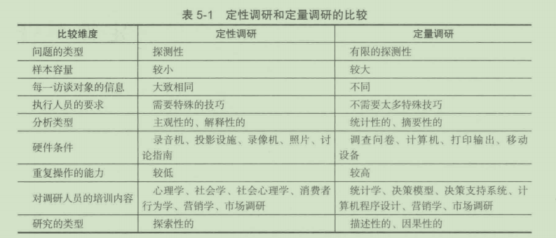
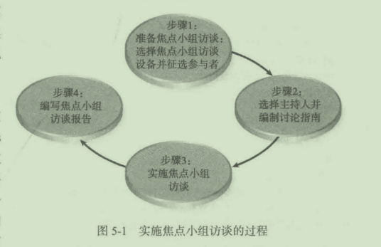
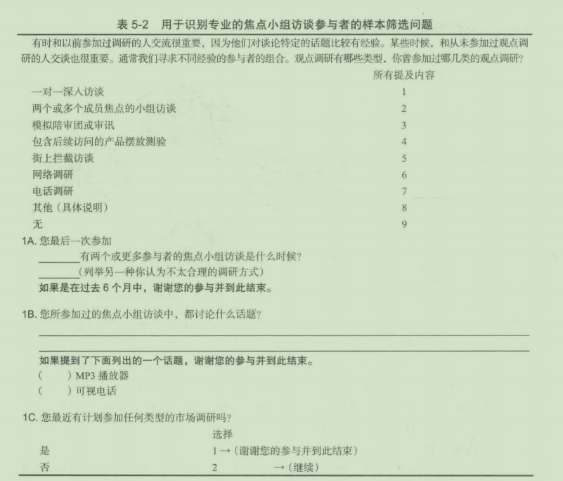
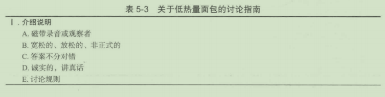
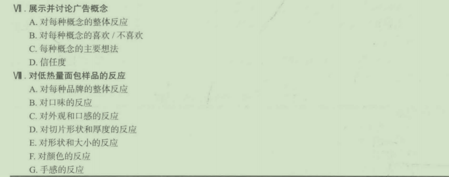
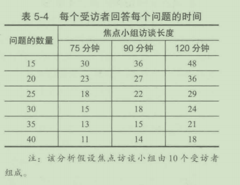
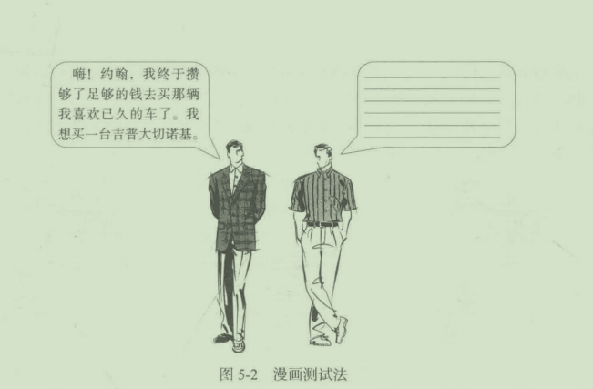
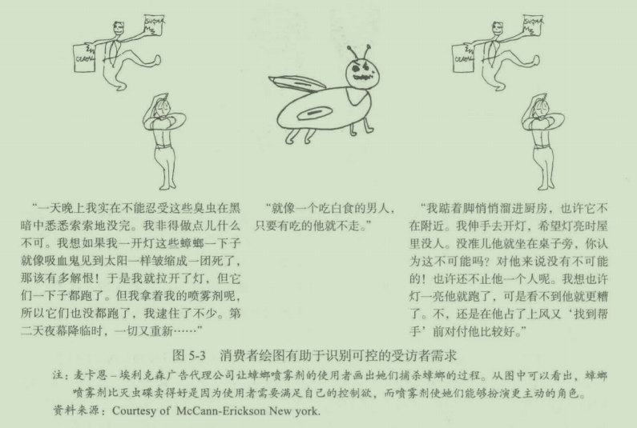

# 第 5 章 定性调研

## 学习目标

1. 了解定性调研概念以及它的普及性
2. 了解焦点小组访谈的定义、实施以及优缺点
3. 比较其他形式的定性调研与焦点小组访谈的异同
4. 了解定性调研的前景
   
   什么是定性调研？定性调研的优缺点是什么？为什么焦点小组访谈如此地普及？焦点
   小组访谈调研的趋势又是什么？对千市场调研人员来说，还有哪些其他的定性调研工具可
   以利用？这些都是本音将要讨论的间题 。
   
##    5.1 定性调研的本质

   定性调研 ( qu a l itative rese arch ) 是一个用得很随意的词。它意味着调研结果并没有经
   过扯化或者定址分析 。 一项定量调研可能发现大量饮用某种品牌的龙舌兰酒的人 ， 年龄为
   21 ~ 35 岁，年收入为 40 000 ~ 60 000 美元。 定量调研 ( quantitative research ) 能够揭示
   大量饮用的人和不常饮用的人之间重要的统计方面的区别；相反 ， 定性调研可以用来考察
   大倡饮用者的态度、感觉和动机 。 一个策划一系列龙舌兰酒促销活动的广告代理商会通过
   定性调研来了解大蜇饮用者的感受，他们使用什么语言方式 ， 以及很必要的一点 一 如何
   与他们交流 。

   定性调研方法可以追溯到 1 8 世纪中期的历史学家维科 ( G i ambatti s ta Yico ) 的文章 ， 维
   科写道 ： “只有人才能理解人，并且是通过被称作｀直觉＇的天赋来实现的。”在社会学和
   其他社会学科中，关于直觉试验以及移情的作用，既有大量的发现，同时又伴随着大量的
   争议 。

###    5.1.1 定性调研与定量调研的比较
   表 5 - 1 比较了定性和定量调研的几个方面。也许对管理者来说，最霞要的一点是定性
   调研的结果通常是由众多小样本所决定的，这一点也是定性调研受到批评最多的地方。从
   本质上讲，许多管理者都不愿根据小样本调研进行重大战略决策，因为它在很大程度上依
   赖千调研人员的主观认识和个人的解释 。 管理者更愿意参考经过计算机分析的、列成表格
的大样本 。 大样本和统计性较强的分析是市场调研中 管 理者感觉比较放心的部分 ， 因为这
些资料是通过精确而科学的方法收梊的 。

### 5.1.2 定性调研的普及性
企业 现在每年花在定性调研上的费用超过 50 亿美元，为什么 定 性调研的流行趋势持
续增长？其原因在千以下几个方面 ： 第 一 个原因，定性调研通常比定 量 调研成本低 。 第 二
个原因 ， 除了定性调研以外，没有更好的方法能了解消费者内心深处的动机和感觉 。 因为
通常的定性调研形式是产品经理坐在 一 面单向镜的后面，不引人注目地组织整个过程，所
以 他们 能得到有血有肉的消费者最宜接的感受 。 产品经理和其他营销人员可以亲眼观察消
费者对千各 种 观念的反应 ， 亲耳听到消费者用 他 们自己的语 言 详尽地讨论生产商和竞争对
手 的 产品 ，而 不是阅读计算机打印出来的含有数不清的数字和报表的文件 ， 或者是阅读某
个顾问做 的含有大量数字的报告 。 对于 一 位新产品开发经理来说 ． 当 消费者把某 个 花了数
月 时间 在贫乏 的 实验室条件下开发出来的产品 批 评得一无是处时，坐在单向镜后面可能是
一次令 人 沮丧的经历 。

第三个原因，它 可 以提高定量调研的效率 。 护丽 ( Woolite ) 和来苏尔 ( Ly s ol ) 的制造
商利洁 时 ( Reckitt Benckiser PLC ), 了解到妇女对洗碟机如何清洗玻璃不太满意 。 通过焦点
小组访谈得知，大多数时候 ， 在洗碟机中洗过的玻璃会变得不透明 ， 有污迹 。 公司决定 实
施一次以定量调研为主的研究 ， 探测洗碟机的＂污染”问题在家庭中的感知程度 。 定量调
研证实妇女 们 确实对在洗碟机中消洗过多次后的玻璃外观仍旧很不满意，同时 ， 她们愿意
以合理的价格寻找一个解决方法 。 利 洁 时公司最近推出了一种防止玻璃器皿矿物腐蚀的洗
涤剂 一 Finish Glass Protect 。 定性调研提供了好的定量调研构想并证 实 了新产品的需求 。

对于市场调研 入 员来说 ， 在 一 次单独调研或一系列调研中 ， 综合使用定性调研方法和
定员调研方法 ， 巳是 越 来越平常的事情了 。 Finish Class Protect 的例子反映了定性调研先千
定趾调研 ， 在其 他的 调研中 ， 可能会使用相反的顺序 。 例如，通过附加的定性调研可以从
原因 和 消费动机方面丰富定量调研所得出的结论 。 一家大型保险公司进行了一次定量调研 ，
分 析 消费者对 50 种服 务特点的重要性的排序 。 随后又进行了 一 次焦点小组访谈 ， 分析小组
参与者对前 10 种服务特 点 的详细阐述 。 前 10 种中的大部分都涉及顾客与保险代理之间的
互动关系 。 调研人员从焦点小组访谈中发现，”代理商做出迅速答复”事实上意味着立刻答
复，或者”在合理的时间内＂答复 。 对焦点小组来说，”在合理的时间内 ” 就是“对千常规
性事务 在 24 小时以内”“对紧急事务是人力可为的最短时间＇ 。 调研人员评论说 ， 假如没有
在 定量 调研后做焦 点 小组调研，那么他们只能通过推理得出消费者所想的“快速反应”。

在最后的总结性分析中，各种调研方法都被综合起来 ， 以提高营销决策的效率 。 定性
调研与定 扯 调研相结 合 ，可以更透彻地了解消费者的需求 。 定性调研技术包含无规定答案
的问题和诱导剌探技术 。 从中获得的资料内容丰富，更具入情味，也更具揭示性 。

### 5.1.3 定性调研的局限性
定性调研能够也的确提供了有帮助和有用的信息 。 然而，它还是受到了一些调研人员
的轻视 。 第一个局限性在千营销组合的细微 差 别经常会导致营销工作的成败 ， 而定性调研
不能像大范围的定值调研 一 样区分出这种差别 。 应当提醒注意的是 ， 在查明定量调研中被
忽略的问题时，定性调研具有 一 定的优势 。 例如、 一 家大型家用清洁剂生产商组织了一次
大规模定量调研，想了解为什么它的浴室清洁剂滞销 。 生产商确信自己产品中的化学成分
比竞争对手的更有效力 。 定量调研并没有给予切中要害的回答，困惑的产品经理转而求助
千定性调研 。 很快就发现 ， 是因为包装上暗淡的粉笔画 一 样的颜色给人一种没有去污力的
感觉，而且许多人用旧牙刷来清洗浴 室 的瓷砖 。 于是 ， 包装很快就该改用了明亮的颜色 ，
并且在顶部固定了 一 个刷 子。

第 二 个局限性是，定性调研并不 一 定能代表调研人员所感兴趣的 入 群 。 很难说一 个 由
1 0 个大学生组成的小组能够代表所有的大 学 生 ， 或是代表某 一 所大学的学生，或是那所
大 学 中的商科学生，或者甚至是 营 销专业的学生 ！ 小样本以及自由讨论这两点会使得在同
一 定性调研中出现多种不同的倾向 。 另外，接受定性调研的人总是不受限制 地 讲述 他们所
感兴趣的事 。 小组中的主导入物可能会使得整个小组的讨论仅仅与调研 人 员所关注 的 主题
擦边儿 。 只有一个非常有经验的调研人员才能将讨论重新引回主题 ， 同时又不压制讨论者
的兴趣、热情和表达自己的意愿 。

## 5.2 焦点小组访谈法

焦点小组访谈法源千精神病医生所用的群体疗法 。 目前所说的 焦点小组 ( focus group )
由 8 ~ 12 人组成，在一名主持人的引导下对某一主题或观念进行深入讨论 。 焦点小组调
研的目的在千了解和理解人们心中的想法及其原因 。 调研的关键是 ， 使参与者对主题 进行
充分和详尽的讨论 。 意义在于了解他们对一种产品、观念、想法或组织的看法，了解所调
研的事物与他们生活的契合程度 ， 以及在感情上的融合程度 。

焦点小组访谈法远不止是 一 间一答式的面谈，它 们 之间的区别 也 就是群 体 动力 和 群体
访谈之间的区别 。 群体动力 ( group dynamics ) 所提供的互动作用是焦点小组访谈法成功
的关键，正是因为互动作用才组织一个小组，而不是进行个人面谈 。 使用焦点小组的一个
关键假设是 ， 一 个人的反应会成为对其他人的刺激，从而可以观察到受访者的相互作用 ，
这种相互作用会产生比同样数昂的人做单独陈述时所能产生的更多的信息 。

在传销研究中应用群体动力的想法是受社会心理学的启发 。 社会心理 学 的研 究 发现，
来自各种生活和各种职业的人们，尽管他们自己都没有察觉到，但是当鼓励他们 主 动地表
现自巳而不是被动地回答间题时，他们会对某一主题表达出更全面和更深入的看法 。 通
常，在群体动力中避免直截了当的问题，而代之以间接的提间来激发自发的讨论 。 讨论所
带来的极为丰富的信息是通过直接面谈不可能达到的 。

### 5.2.1 焦点小组访谈法的流行

焦点小组访谈法究竟有多流行？大多数的市场调研公司、广告代理商和消费品 生产
商都使用这种方法 。 目前，市场调研中大部分定性调研费用都花在焦点小组访谈上 。在美
国，大量的焦点小组调研占据超过 750 处焦点小组访谈设施，并需要 1 000 多个主持人 管
理 。 最常用的定性调研方法包括焦点小组访谈法和深度访谈法 (IDl), 目前，这两种方法
都在互联网上和移动设备上被使用 。 这个间题我们将在第 7 章讨论 。

焦点小组访谈法是 一 种被全球接受的市场调研方法 。 每年大约有超过 65 万个 焦点小
组访谈以及相当数量的深度访谈在全世界范围内实施，美国每年平均有 25 万多个 。

比起工业品生产商，消费品生产商更多地使用焦点小组访谈法，这是因为 工 业品 生产
商的许多问题无法通过消费者调研来解决 。 例如，组织一个由 12 名家庭主妇组成的小组
通常很容易，然而，要把 10 名工程师、销售经理或财务分析员组织在 一 起却要花费更 多
的时间和费用 。

高露洁－棕榄公司 (Colgate-Palmolive) 调研与发展部的前任经理刘易斯· 斯通
(Lewis Stone) 认为：

如果没有焦点小组访谈，高露洁棕榄公司也许永远都不知道有些妇女小心地
挤出洗洁精，还有的非常非常小心地挤出所需的剂量 。 然而，也有人使用“纯粹"
的洗洁精，也就是说，她们将洗洁精直接倒在海绵或洗碗布上，然后在水龙头下
冲洗碗碟，直到没有泡沫了 。 这样，她们就需要更多的洗洁精 。

斯通还解释了在焦点小组中所表现出来的肢体语言是如何帮助调研人员对产
品进行洞察，而这是通过阅读关于习惯和实践的问卷所不能获得的 。 焦点小组访
谈法可以最有效地了解一种产品实际上是如何在家庭中使用的 。 通过让小组成员
详细描述他们从事某项活动的过程，你可以了解大量的潜在的供需差距，从而提
供相应的新产品或改进产品，还可以了解一种新产品的受欢迎程度 。

这种亲身经历的方法为调研人员提供了一个面对有血有肉的消费者的机会 。 在厨房和
超市中的实际情况与在大多数办公室内的情况有着戏剧性的不同 。 通过这种方法，调研人
员能够感受产品使用过程中的情感背景 。 从某种意义上说，调研入员能够进入 一 个人的生
活，与他一起重现当产品被带回家后的所有的满意、不满意、兴奋和沮丧 。

宝洁公司全球营销与消费者知识部副总裁罗伯特 L. 韦林 (Robert L.Wehling) 这样要
求调研人员：“把握消费者心理你就拥有未来，从而影响消费者的个人偏好！去了解正在
变化的消费者，针对每个个体而不是针对一般情况 。 ”

### 5.2.2 实施焦点小组访谈法

了解了焦点小组访谈法的概念后，我们接着讨论实施焦点小组访谈法 的 过程（见图
5-1 ) 。 在这个问题上花费些笔
墨是很必要的，因为在实施焦
点小组访谈的过程中可能会犯
许多错误 。

1. 环境
   
   焦点小组访谈通常是在
   一 个 焦点小组测试室 ( focus
   group facility ) 中进行的 。 这
   个环境一般是一间会议室风格
   的房间，其中一面墙上装有 一
   大面单向镜 。 在不引人注目的
   地方（一般在天花板上）装有
   图 5 - 1 实施焦点小组访谈 的过程
   话筒，来记录整个讨论过程 。 在单向镜后是观察室，室内为观察者准备了椅子和笔记台或
   桌子 。 观察室中还装有录音或录像设备 。
   
   有些调研机构提供起居室式的环境来代替会议室 。 像起居室这样非正式的环境 ， 会
   使参与者感觉更放松，就像在一般的家庭环境中一样 。 另外 一 种选择是不 使 用单向镜 ， 而
   改用闭路电视设备连接焦点小组和远处的观察室，这种方法的优点在千员工可以随意 地 走
   动，用平常的语调交谈而不会被隔壁的人听到 。
   
2. 征选参 与 者
   
   参与者是通过不同的方法征集来的 。 在商业街上随机地拦住 一 些行人 ， 或者随机选择
   一些电话号码，这是两种较为常见的方法（在第 6 章会对这两种方法有详 细 的论述） 。 通
   常，调研人员都会为参与者制定 一 些资格标准 。 例如，如果桂格麦片公司正在调研一种新
   的谷类食品 ， 那么它可能需要的是有年龄在 7 ~ 12 岁的孩子的母亲，并且在过去 3 周曾
   给孩子吃过谷类食品 ， 也许还规定了是某种特定的品牌 。
   
   其 他 焦点小组招募 人 员去目标市场寻找合 格 的受访者 。 这 种 类型 的 招募 相 当千去 托儿
   所寻找有孩子的妈妈，去健身俱乐部寻找有着积极生活方式的人，去住房整修中心寻 找 自
   食其力的整修者，去超市寻找食物购买者，去社团中心寻找老年人 。
   
   通常，调研人员极力避免在焦点小组访谈中有重复性的或“职业“性受访者 。 许多调
   研人员将职业受访者看成是做戏的人，至少是不会给予坦率回答的 人 。人 们也 许会 间什 么
   样的人会一再地参加焦点小组呢？是不是他们觉得孤独？是不是 他们 真的那么迫切 地 需要
   那份报酬呢？绝大多数职业受访者都不能代表目标市场，即便有也是非常少的 。 令 人 遗憾
   的是，外勤工作人员总是觉得使用重复受访者要比每次都组织新的小组要简单得多 。 大多
   数的外勤工作都会建立焦点小组访谈参与者的数据库 ， 记录 他 们的 人 口特征与购买方式 。
   识别重复受访者的样本筛选问题如表 5-2 所示 。

为什么人们同慈参加焦点小组访谈？研究发现，占第一位的原因是报酬 。 其他的动机
依次为：对话题感兴趣、有空闲时间、焦点小组有意思、受访者对产品知道得很多、好奇，
以及它提供了一个表达的机会 。 研究还发现，只为钱的参与者对调研的忠诚度较低，并且
更倾向千敷衍了事 。

3. 选择主持人
   
   拥有合格的受访者和一个优秀的主持人是焦点小组访谈法成功的关键因素 。 一个 焦点
   小组访谈主持人 (focus group moderator) 需要具备两方面的技能 ： 第一，主持人必须能恰
   当 地组 织一个小组 ； 第二 ， 主持人必须具备良好的商务技巧 ， 以便有效地与委托商的员工
   进行互动 。 组织焦点小组访谈的关键性个性特征和技巧包括：
   
- 尊重受访者 。
- 掌控全局 一 让人明显感受到主持人无形的领导力 。
- 清楚地表达自己，声音清晰且洪亮 。
- 设定预期并给出和关行业的全部所需信息 。
- 提间精简并善千倾听 。
- 把握谈话的进度，避免赶时间或离题的情况发 生。
- 避免＂顺次访谈＂（按顺序座谈第 一 个人、第 二 个人、第 三 个人等） 。
- 关键时刻思维敏捷，反应灵活 。
- 每 20 分钟调整一下访谈活动 。
- 四处走动~免 一 直坐在椅子上 。
- 保持一个开放包容的身体姿势和位置 。
- 在一个话题内将问题从一般过渡到具体 。
- 创造一 个能够接纳不同意见，尊重个性的谈话氛割 。
- 提问的顺序应遵循一定的逻辑 。
- 使健谈的受访者和内向的受访者都感到轻松 。
- 不错过任何 一 个可以挖掘额外信息的机会。
  以上方法都是便千创造一个和谐融洽的气氛，和谐融洽的气氛意味着主持人和受访者
  都感到亲切并对另一方抱有好感 。 主持人创造 一 种自由简单的可以与受访者讨论任何事情的
  氛围 。 通过这种轻松融洽的环境，这些陌生人可以衵互认识并找到共同话题 。 在 一 个舒适
  的、无强迫的、愉快的地方，他们可以谈论任何事情一勹关千香肠、保险、轮胎、烘烤食品、
  杂志 。 在调研中，主持人是纽带，融洽的氛围是连接入们日常生活与客户商业兴趣的桥梁 。
  
4. 编制讨论指南
   除了主待人所应具备的性格特点和应接受的培训以外， 一 次成功的焦点小组访谈还要
   求有一份精心编制的讨论指南 。 讨论指南 ( discussion guide) 是 一 份关千小组访谈中所要
   涉及的话题概要 。 通常，讨论指南是由主持人根据调研客体和委托商所需信息设计的，讨
   论指南保证按一定顺序逐一讨论所有突出的话题 。 例如， 一 份指南可能从讨论对外出吃饭
   的态度和感受开始，然后转向讨论快餐，最后以讨论某 一 连锁快餐集团的食品和装修风格
   结束 。 应使主管调研的人和其他的委托商人员（如品牌经理）都同意指南上所列的主题是
   最重要的和必须涉及的，这 一 点非常重要 。 所以，编制讨论指南通常采用团队协作法。
   
   主持人所编制的指南通常含有三个阶段部分：首先，建 立 友好关系，解释小组中的规
   则，并提出讨论的客体；其次，由主待人激发深入的讨论；最后，总结重要的结论，衡量
   信任和承诺的限度 。
   
   
   

5. 焦点小组访谈的长度
   
   现在许多管理者都喜欢较短的焦点小组访谈，然而，平均每个焦点小组访谈的时间仍
   是 90 分钟左右。虽然短时间的焦点小组访谈是未来的趋势，但较长时间的焦点小组访谈
   存在许多优点 。 一个较长时间的焦点小组访谈待续两个小时甚至更长，它可以帮助管理者
   在单 一 环节得到更多信息，可以让受访者更多地参与任务，进行更广泛的交流 。
   
   焦点小组访谈长度的问题并非孤立存在的，它还伴随着第二个关键因素 ： 讨论指南中
   间题的数星 。 我们认为，目前焦点小组访谈面临的最大问题是，讨论指南中的问题有越来
   越多的趋势，这妨碍了深度访谈和有意义的组内交流 。 管理者想得到投资回报，所以对他
   们来说，问每一个可能的间题都有意义 。 焦点小组访谈变成了一个不受控制，没有科学和
   数据支撑的小组审问和调研 。
   
   为了使提出的问题更清晰、更有逻辑，管理者需要考虑焦点小组访谈的长度和讨论指
   南的容量之间的协调 。 如表 5-4 所示，更多的间题和更少的时间柜结合，会产生一种调研
   环境，会使回答仅仅是问卷调查一样的座谈
   录音节选 。 在 90 分钟内展开 4 0 个间题，主
   持人也会感到匆忙，不能仔细深究感兴趣的
   答案．并且容易被表达嘐竣或缓慢的人打
   断 。 随着座谈的进行，这些压力和约束将会
   减小 。 间题少了，时间多了，受访者可以详
   细阐述他们的答案，主持人可以更有效地引
   导，使访谈的节奏变得轻松、自然、幽默 。
   
   
   
6. 客户的角色
   客户当然要挑选焦点小组访谈的实施机 注：该分析假设焦点访谈小组由^1 0 个受访者
   构，有时候也会选择主持人。客户通常会选
   组成 。
   择焦点小组访谈实施的市场并给出小组受访者所应具备的特征，客户有时候也会给主持人
   一 个现成的讨论指南 。 通常，客户和主持人共同编制最终的讨论指南 。
   
   客户不仅需要和主持入一起核查讨论指南，还要探讨相关的产品或服务 。 例如，主持人
   正在做一个耳机产品的焦点小组访谈，而客户在之前并没有向主持人展示该耳机如何工作 。
   主持人没有被告知，眼镜的框架将会妨碍耳机的佩戴，当主持人试图演示这个耳机的时候，
   耳机不能成功地戴上去 。 显然 ， 这种情况将会给焦点小组访谈参与者一种消极的印象 。
   
7. 编写焦点小组访谈报告
   通常，当最后一个小组座谈结束之后，要听取主持人的汇报总结，有时称作 即时分析
   (instant analysis ) 。 对这种传统做法既有赞成者也有反对者 。 支待的观点认为，即时分析提
   供了 一 个论坛，可以将观察小组的营销专业人员的知识与主持人的知识结合起来，及时听
   取主持人的最新感觉并做出反应，而且当时非常活跃的思维和兴奋感会引发全新的观念和
   理解 。
   
   不足之处包括：主持人的偏见；没有对所发生的事情进行深思熟虑就信口开河 ； 有选
   择的近因回忆和其他与限制性回忆相关的因素；无法听到在不那么受影响和紧张的情况下
   所做的描述 。只要主持人 明确保留在重新看过录像带后修正他的观点的权利，那么听取 主
   持人的汇报就应该是无可非议的 。
   
   现在， 一 份正式的焦点小组访谈报告就像一个 PPT 展示，书面报告就是 PPT 幻灯片
   的复制 。
### 5.2.3 焦点小组访谈法的发展趋势

1. 移动终端 上 的线 上 小组访谈

在移动终端上进行线上小组访谈是焦点小组访谈调研中一个非常普遍的趋势 。这点在
第 7 章详细叙述。甚至当焦点小组访谈在传统的会议室中进行时，调研委托方通过互联网
观看访谈会议也在成为一个越来越流行的趋势 。 对千调研委托方来说，优点在千节约了长
途旅行的时间和金钱成本 。 现在，在使用传统方法进行的焦点小组访谈中，超过 40% 使
用了视频的线上传送 。

2. 焦点小组访谈固定样本成员
   
   通常，对千焦点小组访谈参与者的筛选间题是：“在最近的 6 个月内，你参加过焦点
   小组访谈吗？“如果答案是肯定的，那么回答者不符合要求 。 这里的关键在千调研委托方
   想要“新的参与者”，而不是职业受访者 。 现在被一些公司采用的一个不同的筛选模型是
   焦点小组访谈小组 。 这种方法是建立一个由 8 ~ 12 个愿意参加 一 系列给定产品或话题的
   座谈的、符合要求的受访者组成的小组 。一 旦确定雇用，这个小组将在近 6 个月内每月会
   面一次 。
   
   这种筛选的好处之一在千不同的话题都能被涵盖，必要的话还可以继续讨论 。 例如，
   假设一个销售包装商品的公司想要建设 一 条沙拉酱调料的新生产线 。 它的定性筛选首先始
   千建立一条新的沙拉酱生产线的思想萌芽，下一个阶段将这个想法扩展到这种产品的包
   装、图样和味道 。 在下一个部分之前，已经制定了具有激励作用的广告板，并决定其摆放
   位置 ， 备选的名字 也 巳想好 。 最终，这种方法能为调研委托方节约时间和金钱 。
   
   焦点小组访谈固定样本成员的主要优势如下 ：

- 与在同一时间内雇用相同数量的独立小组对比，消费者固定样本的成本比较低 。由
  于同样的人员每月使用一次 ， 所以不再有额外的招募费用，只需要一些简单的提醒
  电话就足够了。这种更加精简的设计能够为调研委托方节约 2 5 % ~ 30 % 的花费 。
- 只需要一份总结 。 因为迅速的反馈是极其重要的，而整个过程是不固定的 ， 公司也
  就不再要求一份完整的报告 。一 份总结摘要不仅能够反映所需信息，而且能在访谈
  结束的极短时间内送达 。
- 企业认可在这个过程中消费者固定样本可能的影响。他们知道每个月他们需要与市
  场营销、包装及研发部会面决定现存的问题 。 同时，各个内部部门欢迎这种方式，
  即每个月都能听到来自样本成员的相关内容 。
  
3. 使用角色反转访谈法
   
   角色反转访谈法 ( rotated opposed view , ROV ) 是利用两个小时的会议来揭示和判断 不同的观点并找到一种建立两者之间桥梁的标准 。 参与者分成两组－在同样的社会经济 状况下对同 一 产品分高频率使用组和低频率使用组，有意让不同组在产品使用频率和感知 方面有所不同，以此确保参与者会有不同的观点 。

在会议的开始，低频率使用者先列出他们不使用该产品和不认同该品牌的理由，并指
出他们偏好的竞争产品 。

同时，高频率使用者和该组主持人一起在观察室中通过单向镜观看整个过程 。 通过主
持人一定程度上有目的地引导，鼓励会议的观看者在纸上写下自己和反的意见 ， 为下一个
部分做准备 。

45 分钟之后，角色反转，高频率使用者变成了被观察的人，会议重复上一阶段流程 。
然而，在这一部分，高频率使用者讨论他们和该品牌之间的密切关系、他们购买的理由，
以及为什么他们在同类产品中偏偏选择这个产品 。 他们还对和低频率使用者观点 一 致或不
一致的地方进行了开放的讨论 。

在分时段讨论的最后，两组使用者被带到了 一 起，试图探求他们对千产品不同使用和
不同态度之间的共性 。 在“辩论”部分，高频率使用者对低频率使用者就产品进行演说 ，
而低使用频率者解释他们在参加访谈小组之前的反对理由 。 这个过程在一定程度上达成一
致意见时结束 。

结果不仅发现了深入消费者内心，了解其态度的独特视角，对参加者来说也是一种有
价位的经历 。 无论是单独会议还是集体会议，都为市场营销策略的制定提供了非常有价值
的信息 。

角色反转访谈法提升了访谈会质谌，以及自由流动的受访者参与度，也不失为一种发
现新视角的好方法 。 它能够帮助产品经理理解不喜欢公司产品或服务的顾客的感受 。

4. 增加专业人士参与访谈
   
   当产品或服务有需要时 ， 市场专业人士（如广告总监、新产品开发经理和市场职员等）
   就会混进典型的消费者中 ， 这类人被称为专业消费者 ( prosumers) 。 英国航空希望挑战美
   国航空以及维珍航空在大西洋航线中商务舱出行的主导地位 。 调研团队通过对消费者实施
   定性调研没有获得他们寻求的深度信息，该团队决定，要想在帮助英国航 空 在商务舱旅行
   中打造差异化服务上取得突破性进展，就必须打乱原有的方案，推倒重做 。
   
   该调研闭队采取了不寻常的一步。他们组建了一个正常目标客户 定期商务出差者
   的焦点小组 。 同时，该小组加入了经常从纽约飞往伦敦的从事产品研发以及市场营销的工
   作人员 。 通常，这些专业工作人员是会被有意排除在外的 。
   
   在进行了一个包含普通消费者和专业消费者的联合焦点小组访谈之后，专业消费者的
   焦点小组加入了英国航空的领导团队会议，该创造性会议旨在解开束缚 ． 吸取焦点小组访
   谈中学到的经验，并听取专业消费者对千调研团队正在寻求的兼具合理性和创新性想法的
   理解 。
   
   专业消费者中的 一 员，联合利华的一位研发主管，分享了她出行时的秘密 。 她喜欢可
   以完全躺卧的椅子，但是又不喜欢在旁边是陌生人或商业伙伴的时候睡在完全躺卧的模式
   下 。 她认为很多女性乘客会同意她的观点 。 由此，一个新的想法产生了 。 现在，几乎所有
   的国际商务舱都设计了能够让乘客像睡在摇篮里一样的座位和遮挡隐私的隔板 。

“她的职业经验一对人口统计特征的理解 ， 知道我们在寻求突破性的想法，以及她
用有效的方式向调研陌队表达自己意见的能力 ，使她成为这个过程中关键的 一部分。”一
家宾夕法尼亚的创新公司 Lancaster 的创始人克里斯托弗 · 米勒这样评价。这种创造性的
矛盾 ， 即受访者既要代表个人发言又要作为专业人士 ， 成了这个过程的基础 。

WD-40 公司（一家生产金屈制品万能保养剂的公司）的市场闭队、在采用这种过程
帮助它的研发部门时取得了突破。该闭队的入员涉及 WD-40 公司的专业人士、两个专业
消费者和一组普通消费者 。 在焦点小组访谈之后的创造性会议 ． 一个专业消费者提出能否
将润滑油装进一支“笔”里，这种跳出惯性思维的想法就成就了现在的“没有混乱的笔”
(No-Mess Pen ) 这一产品。另一个需要用 WD-40 来保养一台设备部件的专业消费者抛出这
样一个问题一该产品能否放进盛杀虫喷雾那样的喷壶里。答案是肯定的。现在这种 B2B
的产品被称为 Big Blast Can 。

### 5.2.4 焦点小组访谈法的优缺点

定性调研的优缺点也同样适用于焦点小组访谈法。此外焦点小组访谈法还具有一些值
得一提的积极方面和消极方面 。

1. 焦点小组访谈法的优点
   
   参与者之间的互动作用可以激发新的思考和想法 ， 这是一对一的面谈所达不到的 。 而
   且，群体的压力可以使激进者把自己的想法控制得更现实些。参与者之间积极的互动作用
   还意味着，对委托商而 言 ， 通过观察焦点小组来获得第一手的消费者信息比通过一对一的
   面谈更为快捷和有趣。
   
   第二个优点是，可以在单向镜后观察顾客和期望顾客。事实上，日益普及的焦点小组
   访谈法使越来越多的员工可以直接接触到顾客的想法和观点。“我们发现要使员工真正了
   解顾客的唯一办法是让他们亲眼见到顾客，但是能直接接触到顾客的员工是很少的，“数
   字设备公司 ( Digital Equipment Corporation ) 营销部经理邦尼 · 吉斯 ( Bonnie Keith ) 说，
   “现在，我们正在使专注于生产和设计过程的人也来参与和观察焦点小组访谈。”
   
   第三个优点是 ， 焦点小组访谈法通常比其他方法容易执行 。 而且，通过焦点小组访谈 法所得的发现更容易理解，并能获得最迫切需要的信息以及令人兴奋的信息。“我可以给 客户看世界上所有的图表，但这却无法同让他 们 看到 8 ~ IO 个顾客围坐在桌前说这个公 司的服务不好所产生的震撼力相比 。 ＂凯旋广告公司 ( Ketchum Advertising) 的市场调研部 主管琼－安妮 · 马特 ( Jean-Anne Mutter ) 如是说。

2. 焦点小组访谈法的缺点
   不幸的是 ， 焦点小组访谈法的一些优势可能会变成它的缺点。例如，对所得的表面性
   的理解或貌似很理解会产生误导而不是指导 。 琼－安妮 · 马特说：”即使你只截取了很少
   的信息，焦点小组访谈法还是会使你认为你巳经掌握了全部情况。“她还说，焦点小组访
   谈法很能够满足”人们寻求快速和简单答案的心理 ， 我还看到人们越来越不愿意面对复杂
   的现象，也不愿意为定景调研所带来的复杂数据劳心费神了" 。
   
   以上观点受到了 NCR 公司营销部经理加里 · 威利茨 ( Gary Willets ) 的响应，他说 ：
”可能会发生的是，你组织了焦点小组访谈调研，而且你发现了所有的细节，然后有些人
就说，｀好了，我们已经得到了我们要知道的一切＇，而问题在千焦点小组所说的观点并不
一定都具有典型性 。 你实际上应做的是先进行定性调研，然后再进行定量调研 。 ＂焦点小
组访谈法以及一般的定性调研，从方法的角度看是非常诱人的 。 这种调研方法受资料的驱
策 ， 可以从所提供的信息中直接得出结论 。 相反，在完成定社调研之后通常还要使用演绎
的方法，用专门收集的资料对公式 化的想 法和假设进行检验 。
   
其他一些缺点在千焦点小组本身 。 例如，如果参与者与目标市场人群不 一 样 ， 那么与
其说是征集了一个焦点小组，倒不如说是征集了一个大麻烦 。 又如，白领中产阶级参与焦
点小组的数量与他们在市场上的地位似乎不相称 。 此外，一些焦点小组测试室给人一种偎
硬冷漠的感觉 ， 人们在其中难以进行开诚布公的交谈 。 使用宽大的桌子和简单乏味或暗淡
的装修，造成一种办公室化或者过千正式的环境 ， 这可能使受访者感觉紧张、难以表达他
们的真实想法 。

焦点小组访谈法的最大的潜在不足在千群体会谈本身 主持人是整个互动过程的一部
分，他必须注意不要带有偏见 。 主持人的个人风格可能是产生偏差的原因 。 例如 ， 一种进
攻性逼迫式的风格，通常使得受访者为了免受攻击而说一些他们认为主持人想要他们说的
话 。 如果主持人“玩深沉"'又会让人觉得主持人是一个骗子，也会使受访者却步 。

受访者本身 也可 能是个间题。有些人就是内向，不喜欢当众发言 ， 而有的人又 似 乎
想独占整个讨论。这些人什么都知道，或者自认为什么都知逍，总是第一个回答问题 ， 而
且不给别人说话的机会 。 一个专横的组员可能会影响其他成员 。 如果主持人对他的态度生
硬，会给其他人一种错觉：“你最好小心点 ． 要不然我也会这么对你的 。 “万幸的是，一个
优秀的主持人既能够压制住专横的组员，同时又不伤害其他成员 。 主持人可以使用一些简
单的技巧，比如不与专横的组员对视，向大家强调“我们想让每个人都有机会发言” ， 或
者说“让我们听听其 他人的 意见＂ ， 当其 他人 在发言而专横者不断插话时 ， 主持人应该注
视前一位发言者并说 ：“ 对不起，我听不见你说的了 。 ”

**人员招募 一 定要正确**

不恰当的人员招募一直是我的痛点，也许是因为想要解决这个问题比做一个一般的主
持或报告更加 困难 。 作为一个委托者，无论是否要根据我们提供的清单来招募人员，我们
都要不遗余力地确定我们想要的小组成员的身份、类型和组合，试图通过一切必要的工作
来明确和理解我们所要求的每条标准的含义 。 我们总是询问比实际需要更多的员工期望报
酬，以此来表明我们不介意为了确保我们有最少蜇符合要求的受访者而多付出金钱 。 除此
之外，我们还额外允许三周的时间进行招募工作，这样如果有意外发生，我们仍然有足够
的时间做出调整 ， 使整个座谈按计划时间进行。

如果为我们做调研的机构认为相比于我们的要求报酬给得太低的话，他们应该提前让
我们了解 。 当任何招募问题发生时，我们请求他们立即让我们知道，让我们有时间做出最
恰当的改进 。 即使是负责调研的机构核查报价，支付给负责招募的次承包者，我们也会重
新核查报价 。 从过去的经历中我们已经学到，不要完全指望调研机构或者负责招募的人会
做到完美 。

草率的或不充分的招募不仅仅是指忽视要求，它可能对整个小组访谈的有效性产生重
大影响 。 例如，我们需要一个带孩子去看医生的人，那么父亲带年幼的孩子去看小儿科的
反应可能和母亲的反应极为不同 。 如果是母亲带孩子去看医生，母亲的想法就比父亲的更
重要 。

问题：

1. 为什么在焦点小组访谈以及其他形式的定性调研中的人员招募如此重要？
   
2. 你认为给受访者付报酬会影响他们的回答吗？为什么会／不会？
   
##    5.3 其他定性调研方法
   本章的大部分篇幅都用千阐述焦点小组访谈法，因为在市场调研中它实在太普遍了 。
   然而 ，人 们也在使用其他一些定性调研技术，尽管使用得很有限 。
###    5.3.1 个人深度访谈法
   个人深度访谈 (i ndividual depth interviews) 这个词原意是相对无限制的一对一的会
   谈。面谈者在剌探和诱导详细的间答方面经过严格训练 。 有时会用心理学家来当深度访谈
   的面谈者，他们使用临床的不定向技术来揭示隐藏的动机 。 深度访谈是第二流行的定性调
   研形式 。

   深度访谈的走向依据受访者的回答而定 。 随着会谈的逐渐展开，面谈者彻底探究每个
   问题，并根据回答来决定下一个问题 。 例如， 一 次深度访谈可能从讨论零食开始 。 每次回
   答后，都要追问 ：“ 你还能再说些什么吗？”“你能详细说 一 下吗？”“还有吗？”然后访谈转
   向对不同食品成分（如谷物、麦类、马铃薯）的看法 。 接下来，讨论零食的社交性 。 例如，
   你是一个人吃弗瑞托雷公司的食品，还是同许多人一起吃？你会在聚会时准备小麦薄饼公
   司 ( Wheat Thin) 的食品吗？你在什么时候用乐之 ( Ritz) 饼干招待客人？

   相对千焦点小组访谈法来说，深度访谈法具有以下优点 ：

   (1) 消除了群体压力，因而每个受访者会提供更诚实的信息，而不必只说最容易被群
   体接受的话 。

   (2) 一 对一的交流使得受访者感到自己是被关注的焦点，个人的感受与想法是重要 的，是别人真正期望了解的 。

   (3) 在人与入的交流中，受访者的意识被激活了，因为他与面谈者达成一种融洽的关 系 ， 而且周陨也没有其他人 。

   ( 4 ) 在单个受访者身上花的时间比较多，这可以鼓励他们吐露新的信息 。

   (5) 可以深入地探查受访者，揭示隐藏在表面陈述下的感受和动机 。

   (6) 因为不需保持群体秩序，所以比较容易临时发挥 。 个人会谈更容易激发出偶然的 思路和发散的思维，这通常能对主要问题提供重要的洞察 。

   (7) 一对一的近距离接触使面谈者对非语言的反馈更加敏感 。

(8) 从受访者那里得到独立的观点而不受其他人的影响 。

(9) 深度访谈不像焦点小组访谈那样需要固定的设施 。

(10) 在一些特殊情况下 ， 深度访谈法可能是唯一可行的办法，否则相互竞争的对手
会同处 一 室 。 例如，很难组织相互竞争的百货公司或餐馆的经理对有关话题（如坏账保护
系统）进行焦点小组访谈调研 。

( 1 1) 当研究主题是个入对市场刺激（如网站主页）的决策过程或反应 时， 公司 通 常会
选择深度访谈 。 深度访谈能够详细地探索单个受访者的反应而不受干扰 。 当调研人员想要
获取个人经历中的个人反应时，这些将十分有价值 。

(I 2) 对千高敏感话题通常采用深度访谈 。 涉及非常私人（如破产）或者很复杂（如离
婚裁定）的事件时 ， 深度访谈是最好的挖掘深度信息的方法 。

( 13 ) 交流的大多数内容是非语言的 ， 像面部表情、身体语言以及语音语调 。 甚至像
“那很好啊”这样 一 句很简单的话都拥有很多的含义，说话者是真心的还是在 讽刺 ？
与焦点小组访谈法相比，深度访谈法的缺点在千 ：

   ( l ) 深度访谈法通常比焦点小组访谈法的总成本高 ， 但就每个受访者的单位时间来说 却不 一 定（详见下一部分） 。

   (2) 深度访谈法通常达不到像焦点小组访谈法那样的委托商参与水平 。 如果你的主要 目的是让委托商观察调研过程，从而让他们获得原始信息，那么你很难说 服 大多数委托商 的员工为了听深度访谈而连续坐上几个小时 。

   (3) 对主待人来说，深度访谈是很消耗体力的 ， 所以一天内所访谈的人数有限。大多 数主持人一天会谈的入数超不过四五个 ， 而如果他们进行小组访谈，则一天能完成对 20 个人的访谈 。

   ( 4 ) 当需要达成一致意见或采取辩论来获得不同观点时，则焦点小组访谈更加合适 。 焦点小组访谈能够让两个柜反观点得到讨论和解决 。

   ( 5 ) 焦点小组访谈法使主持人可以利用群体动力的杠杆作用来刺激组员的反应，这在 一 对一 的会谈中是无法实现的 。

美国的一个调研公司 Rheingold USA , 用深度访谈的方法分析了一些 “ 超级碗＂的广
告 。 它的目标是获得广告的潜在信息 。 诱导问题包括 ： 观看广告的每一个画面时，哪些东
西在你心头浮现？广告中的场景或元素引发了什么间题？广告是如何回答这些问题的？哪
些问题没有得到间答，作为 一 个观众，你的看法是什么？在广告之外 ， 你内 心 对这些 间 题
的回答是什么？这和广告中的产品如何关联起来？它让你对这个产品有什么看法？哪些因
素是该产品吸引你或者让你厌恶的关键？

第一个广告是大众的帕萨特汽车，你可以在以下网址观看 ： [http://www.youtube.com/](http://www.youtube.com/) watch ?v= OrD U 8K63hb o 。

广告 内 容 ：一 个装 扮成达斯· 维 达 ( Darth Vader, 星球大战中的一个人物 ）
的儿 童， 在一个上 层家庭 的 房子 里玩耍 ，试 图在 洗碗 机上表演达斯· 维达的法
术 。 画 面里 还有 一 只狗以及 他姐 妹 的玩 偶 。 但是， 他的 意 念并没有使任何东西 移
动 n 当 他 父亲驾驶着 大 众 的帕 萨特汽车 回到 家 中时，他同 样想 在 汽 车上施展他的
法术 。 让人意外的是，汽车发动了，车灯也亮了 。 作为一个旁观者，我们看见他
的父母在厨房的 窗户后面，很明显是他的父亲用手中的钥匙远程启动了汽车 。

受访者被该广告中创造的氛围触动了，开始谈论这家人家庭生活中的甜蜜和幸福 ： ＂父
亲看出了儿子的努力并且想要帮助他 。 ”“这是很亲密无间的一家人，这对父母既给了孩子
独立的 空 间又支持了他的创造力 。 ”“那很好不是吗？他的孩子对他来说就是整个世界 。 ”“对
这个孩子来说这是不朽的一刻，他就像在天堂里 一 样幸福，他的整个一生都将谈论这件
韦情 ！”

表面上受访者看到了他们自巳理想中的家庭生活，逐渐地他们就会将帕萨特看作最适
合一个典型幸福家庭的车 。 然而，进 一 步深入受访者心理会发现，在广告场景之后经常无
意识地揭示了它本身 ： “达斯 · 维达是如此得有力最，他在 一 切之上 。 ”“看到这样 一 个孩
子像那样跑来跑去有些使入惊慌 。 ”有些人甚至联系到了大众汽车的黑暗面：“这家公司开
始千希特勒 ...... "

受访者首先陈述的是这个小男孩与他的幸福家庭之间的乐趣 。 然而，我们看上 去真 正
享受的是自己将成为的这种充满力量的万能的角色 。 观看者变成了自信的父亲，偷偷地享
受和小男孩儿恶作剧的乐趣 ： ”就像是我按动了按钮 。 我能够完全想象出我对我儿子做这
些的场景...·· · "

调研人员称，我们通常不想承认的是，驾驶和 一 种认为自己是万能的掌控一切的感觉
紧紧地联系在一起：我们想要炫耀，想要逃离那些我们想丢在身后的，去探索新的事物 。
车被当成了 一 种能够提供我们自己无法获得的超能力的工具 。

调研人员声称，帕萨特传达了一种潜在的信息：“我不仅仅是平凡的、中庸的、尖锐
的甚至有些无聊的一辆车，我可以让你感到无所不能、充满力量 。 我提供了通往万能的
钥匙 ！”

调研人员认为，深度访谈表明，在没有人妨碍和没有威胁地开车时，大众汽车能够触
动观看者内心隐藏的对权力的野心，这则广告提供给他们一种可以完全不用面对这种野心
的＂愉快又安全的中等阶层的挡板” 。

任何 一 个深度访谈的成败很大程度上都取决于面谈者的技巧 。 优秀的面谈者，不管是
不是心理学家 ， 都是很难找到的，而且费用很高 。 另一个影响成败的因素是恰当的解说 。
会谈所具有的无限制的特点和“临床性”分析的特点 ， 更增加了分析的复杂性 。 小样本和
无限制的会谈使其难以进行相互比较，解说又受到主持人偏好的影响，加上高昂的费用，
这些都影响了深度访谈法的普及 。 深度访谈的典型应用包括：

- 交流检验（例如，对出版物、广播、电视广告或其他方面材料的回顾） 。
- 感观评价（例如，对除臭剂和洗手液的反应，对新香水的嗅觉检验，对新糖如的品
  尝检验） 。
- 探索性调研（例如，定义理解基点或一种产品、一项服务、 一 个想法） 。
- 新产品开发，产品原型制作 。
- 包装或用法调研（例如，当顾客想要反映个人经历和包含关键语言描述时） 。
  深度访谈的一种变化叫作顾客关注调研 (CC R ). 其基本思想是用深度访谈来了解购

买 过程的动态 。 下面 7 个问题是 CCR 的基础 ：

( I ) 什么促使你进行这次购买？

( 2 ) 为什么现在购买？

( 3 ) 过程中最难的部分是什么？有没有让你困惑的地方？

( 4 ) 什么时候以及如何决定你能够接受的价格？

(5) 这次购买之后有没有我应该与之交流的人 ， 以便得到更多信息'?

( 6 ) 如果你之前购买过这种产品，与这次购买有什么不同？

(7) 什么让你决定相信这个组织或这个人和你 一 起做你最感兴趣的事？

1. 焦点小组访谈与深度访谈的成本对比

一般标准，8个人90分钟的焦点小组访谈，有9个人(8个参与者和一个主持人）分亨发言权，平均每个受访者有10分钟的发言时间(90分钟被9个人平分）。

这种类型的焦点小组访谈的成本大约13000美元。这个花费包括了所有韦情：招募者、主持人、参与者薪酬、食物、设施、报告撰写，以及寻找一些观察者的成本13000美兀的花费分配在80分钟的参与者讨论时间上（不包括主持人），平均每分钟成本为162.50美元(13000美元/80)然而，一般的深度访谈需要30分钟，成本在600~800美元（包括招募、访谈、参与者薪酬和报告），每分钟成本为20~27美元。最大的不同在于受访者的讨论时间，在一次电话深度访谈中占20~25分钟。

2. 解释学的应用
   
   一 些深度访谈研究者用 一 种叫解释调研的技术来实现他们的目标 。 解释性调研
   ( hermeneutic research ) 侧重用解释说明来作为理解消费者的基础 。 解释说明从调研人员和
   参与者的交流中得到 。 在解释性调研中，调研人员回答参与者的问题，就像在传统的方法
   中 ， 调研人员只间受访者间题 。 没有预定的问题，问题是随若谈话的展开自动发起的 。
   
   例如 ， 一 个调研人员和一个消费者在交谈为什么那个人购买 一 个高端的家庭影院，也
   许讨论这次购买的原因 ， 比如举行电影、聚会、享受在家的休闲，或者把自己沉浸在体育
   项目中 调研人员也许将“举行电影聚会“解释成购买原因 ， 意 思是没有这个系统 ， 消
   费者就不能举办聚会，然后调研人员将会同馈给消费者其他的信息 。 通过以上回顾和更多
   的交谈，调研人员和消费者找出为什么这个产品会被购买和使用，而不是说拥有者对产品
   的感觉 。 在这个例子中｀拥有者作为参与者也许会感到自信 ， 更友善、活跃、充分、放松
   地参与进米 谈论和探索更多关千家庭影院的使用情况 ， 调研人员可以发现新的数据和间
   题，从而决定接下来的发展方向 
   
   不 管 用不用解释学，写 一 个深度访谈报告都与定量调研报告有很大不同 。
   
   3.ffi 尔菲法的使用
   
   德尔菲法 ( Delphi method ) 经常用于新产品的开发，如公司为产品和服务 寻 找创新性
   的新想法时、德尔菲根源千希腊历史 德尔菲城是一个混合文化、宗教以及移民信息视角
   中心 ， 德尔菲也是皮提亚神示所的家乡，她是一位很有远见的女性 。 神示所对访问者有很
   大影响，他们相信未来的知识可以帮助他们在生活中取得成功 。
   
   通常，德尔菲法依赖于各地方的专家 ， 可能是产品开发调研人员、营销经理、专业人
士 ( MDS 、工程师等）、杂志编辑、执行者和牧师等 。 显然，专家的类型取决千德尔菲会
议的目标 。 如果在一个仓库中要寻找更有效的方法掌握资料管理，专家也许就是仓库中的
工人 。
   
德尔菲法包括很多轮的数据收集 。 在传统的德尔菲程序中，第一轮是不固定结构的，
以便允许个别专家从自己的观点相对自由的识别和拟定相关问题，然后这些问题被调研人
员巩固成有结构的调查间卷 。

这个调查间卷后来用千引出小组专业的观点和判断，以定 量 的形式体现 。 回答会被分
析，总结并反馈给小组成员以便更近 一 步考虑 。 在反馈的基础上受访者有改变原来观点的 机会 。 轮数为 2 ~ 10 次，但要避免超过一两次重复 。

德尔菲法的主要特点是匿名性、重复性、反馈性和回答的集合性 。 其目标是通过 一 系
列的密集的问卷和附加的观点反馈，得到最可靠的 一 致性观点 。

德尔菲研究中匿名性的目的是排除组内相互影响，因为相互影响可以引出许多问题，
比如组内矛盾和个别控制 。 德尔菲依赖千一个有结构的，直接的方法来进行决策制定；参
与者不见面，而依赖千个人的预言和方法的统计集合 。

可控制的反馈，即第一轮公议的结果，将在下 一 轮的开始呈现给小组专家 。 反馈的形
式因话题而异 。 它可能是想法的集合，或者如果小组估计新产品的销鼠，然后定坻估计，
例如 ， 中间值可以给出；有时德尔菲法可以拟出说明书，例如，我们如何建 立 一个更好的
客户关系管理软件来让我们从两个市场领导者那里获取市场份额？说明书可以用千回答两
种类型的问题：心一些假定的情况怎样一步一步地发生?® 有什么变化存在，对于每个角
色和每个步骤，是阻碍、扰乱还是简化过程？

重复性、可控制反馈和回答的集合性都是为了从小组专家那里得到间题的高质蜇回
答 ， 以便决策制定 。 通过从小组成员反馈出的信息以及一系列的重复，专家可以在其他评
论的基础上校正他们的估计 。

### 5.3.2 投射测试法
有时，在深度访谈中结合使用投射法 。 投射法来源千临床心理学 。 简言之， 投射测试
( projective test) 的目的是探究隐藏在表面反应下的真实心理，以获知真实的情感、意图和
动机。投射测试的基本原理来自千对人们经常难以或者不能说出自己内心深处的感觉的认
识 ； 或者说，他们受心理防御机制的影响而感觉不到那些情感 。
投射测试是穿透人的心理防御机制，使真正的情感和态度浮现出来的技术 。 一般地，
对受试者给出一种无限制的并且模糊的情景，要求他做出反应 。 由于这种情景说得很模
糊，也没有什么真实的意义，受试者必须根据自己的偏好做出回答 。 在理论上，受试者将
他的 情感＂投射”在无规定的刺激上 。 因为受试者并不是在直接谈论自己，所以就绕过了
防御机制 。 受访者谈论的是其他的事情或其他的人，然而却透露了自己的内在真实情感 。
为什么投射法很重要？消费者（或医生、投票者、经理，或者任何我们研究的对象）
也 许不会完全告诉我们影响他们的事物 。 其中包括的障碍有：

( I ) 受访者也许意识不到一个特殊的影响 。

(2) 他们可能意识到了影响，但感觉它是太个人的或社会不欢迎的（例如，有威望的
形象或种族偏见） 。

(3) 他们也许意识到他们以一种特殊的方式感觉到一种产品，但他们不想提及，因为
在他们看来这不是买或不买一个产品的符合逻辑的合理的理由 。 例如，一些医生坚决认为
他们开处方与药品的名称或制造商的商标的吸引力没有任何关系，而仅仅依赖于决策制定
因素，比如研究发现、临床经验和病人配合 。

大多数的投射测试都很容易操作，它的问题像其他无规定答案的问题一样被列成表
格，通常与非投射的无规定答案的问题和非投射的有规定答案的问题连用 。 投射测试收集
的资料比 一 般提问方法所收集的资料更丰富，而且可能更有揭示性 。 投射测试法经常与印
象调查间卷、观念测试法 ， 偶尔还有广告效果预先测试法混用 。 在一次深度访谈中 也 经常
运用多种投射技术 。

市场调研中最常用的投射测试是词语联想测试法、句子和故事完型测试法、漫画测试
法、图片归类法、消费者图画法和第三人称法 ； 其他方法 ， 如心理戏剧测试法和主题统觉
测试法 ( TAT ), 常用于治疗心理失调者 ， 对市场调研的帮助不大 。

1. 词语联想测试法
   
   词语联想测试法 (w ord association t e st s) 对市场调研人员来说是非常实用和有效的投
   射方法 。 访谈者给受访者读 一 个词，然后要求他说出脑海中出现的第一种事物 。 通常消费
   者反应的是一个同义词或反义词，一般是快速地念出一连串词语，不让心理防御机制有时
   间发挥作用 。 如果受访者不能在 3 秒钟内做出回答 ， 那么可以断定 他 已经受到了情感因素
   的干扰 。
   
   词语联想测试法常用千选择品牌名称、广告主题和标语。例如 ． 一家化妆品生产商为
   了替一种新香水命名，可能会测试消费者对以下候选名称的反应 ： 无限、激情、珍宝、遭
   遇、渴望、欲望 。 其中的一个词语或消费者建议的一个同义词可能会被 选做 新 的 品牌名。
   
2. 类比法
   
   与词语联想测试法有些许的不同 ，类比法 ( analogies ) 是对两个项目的相似点进行对
   比 。 例如 ， 一个调研人员调查消费者对福特汽车的态度 ， 也许会问 ： “我将给你读一些商
   店名称，然后请你们告诉我哪个与福特汽车最相似？如果可能，试若给出闪现在你脑 中 的
   第一个答案 ， 这些商店是 ： 尼曼、沃尔玛、梅西百货、杰西潘尼、凯马特、诺德斯特龙 、
   塔吉特和罗德与泰勒百货 ( Lord & Ta y lor ) 。 “ 接下来，调研人员会问 ： “商店 X 什么方面
   与福特汽车最相似？福特汽车的质量与这个商店有多相似？”一系列的问题会激发消费者
   间接谈论他对福特汽车的感觉 。
   
   这个例子 中 类比法的应用不是为了找出人 们 会把哪个商店与福特汽车联系起来， 而 是
   想让人们用平时不太习惯、不太可能使用的方式谈论他们对福特的感觉和认识 。 因为对各
   商店的感觉不同，有的受访者会选择商店 A, 有的会选择商店 B 。 调研人员应该少关注受
   访者趋向选择哪个商店，而应多关注他们做出这种选择所给出的原因 。 甲乙两人选择了不
   同的商店，但如果两个 入 对他 们所选商店的感觉相近，那就没有什么意义了，福特品 牌也
   是如此 。

3. 拟人化法
   
   与类比法相似， 拟人化法 (personification) 是将 一 种产品与人做比较 。 继续上面的例
   子，调研入员也许会说 ： “想想福特品牌，并把它想象成 一 个人，谁将会是这个品牌？你
   怎样描述这个人？这个人有什么个性特征？你是用什么方式将这个人与这个品牌联系起
   来的？”
   
   在这种类型的练习中，调研人员应该鼓励参与者讨论像个人价值观、信仰、目标、 生
   活方式、外貌、年龄、职业、社会经济地位、爱好、兴趣这样的内容 。 所有这些都能大 量
   表达出受访者对品牌的态度并比标准问题更有意义和收获 。
   
4. 句子和故事完型测试法
   
   句子和故事完型测试法 (sentence and story completion tests) 可以与词语联恁测试
   法连用 。 受访者拿到 一 段不完整的故事或 一 组残缺的句子，然后将其补充完整，如下例
   所示：
   
   (1) 百思买是... ...
   
   (2) 在百思买购物的人是......
   
   (3) 百思买应该是 .... ..
   
   ( 4 ) 我不明白为什么百思买不 ......
   
   这是 一 个故事完型测试法的例子：
   
   萨利 · 琼斯 (Sally Jones) 刚从旧金山搬到芝加哥，她在旧全山是 IBM 的销
   售员，现在她是芝加哥地区的销售经理 。 她的邻居罗达· 史密斯笫一次到萨利家
   未拜访她，随即她们谈到该到哪里购物，萨利说：“我曾听人说过百思买...... "
   罗达会如何回答呢？
   
   正如你所看到的，故事完型测试法给受访者 一 个较有限制和较详细的剧情，目的同样
   是让受访者将自己投射到剧情中假设的人物上 。
   
   句子和故事完测试型被 一 些调研人员认为是所有投射技术中最有用和最可靠的 一 种 。
   现在决策分析者对其客户做在线句子完成和词语联想的调研 。
   
5. 漫画测试法
   
   典型的 漫画测试法 (car toon tests ) 包含两个人物，正如在漫画书中看到的， 一 个框中
   写有对话，另 一 个则是空白的（见图 5-2), 受访者被要求填写空白框 。 注意图 5-2 中的卡
   通形象是模糊的而且没有任何解释 。 这么做是为使受访者不会得到任何暗示某种规定答案
   的＂线索＂ 。 模棱两可是为了使受试者更随意地表达自己 。
   
   漫画测试法可用千多种用途 。 可以用来了解对两种类型的商业机构的态度，了解这些
   商业机构与特定产品之间是否协调 。 它可以测试对于某种产品和品牌的态度的强度，还可
   以确定特定的态度的作用 。
   
6. 图片归类法
   
   图片归类法 (photo sorts), 消费者通过一组特殊安排的图片来表达他们对品牌的感受，
   这组图片展示的是不同类型的人群，从公司领导到大学生 。 受访者将照片与他所认为的这
   个人应该使用的品牌连在 一起 。

环球 BBDO 公司是美国最大的广告代理商，它开发出 一 种已注册成商标的技术叫作
”重复图片查找" ( Photosort ) 。 对通用电气的图片归类调查发现，消费者认为受这个品牌吸
引的是保守而年长的商界人士 。 为了改变这一形象 ， 通用电气进行为一次“为生活增添光
彩”的宣传促销活动 。 另 一 次为维萨信用卡 ( Visa ) 所做的图片归类调查发现 ， 在消费者
心目中，维萨卡的形象是健康、女性、 中 席 。 千是公司开展了名为 “ 随 心 所欲 ＂ 的针 对 高
收入男性市场的宣传促销活动

另 一 种图片归类法 -~~00%{-tJi* ( Pictured Aspirations Technique, PAT ) 是巾
格雷 广 告公司 ( Grey Advertising ) 开发的 ， 该公司也是纽约州的一家大型广告代理商 。 这
种技术旨在发现一种产品符合消费者期望的程度 。 消费者根据图片所描述出的自己的 期 望
的程度，将一组图片进行分类 。 在为一种女士内衣所做的调研中 ， 运 用 这种 技术发现产品
与潜在消费者的期望不相符 。 受访者选择一系列看起来精神饱满、苗条 和 充满青春活力的
图片来表述“她们也想和我 一 样 ＂ 。 但公司用来表述对产品的印象的图片却显得有些守旧、
粗壮 ， 看起来也不太有朝气和活力 。 随之公司开展了名为“每个女孩的好消息 ” 的宣传活
动，以简 · 拉塞尔 ( Jane Russell ) 为品牌代言人， 宣 传更为迷人和时堂的品牌概念 一 " 18
小时立现完美曲线 ” 。

7. 消费者 绘 图法
   
   有时调研 入 员要求消费者画出 他们的 感受 ， 或者他们对 一 个事物的感知 。 有 时 消费者
   绘图法 ( consumer drawings ) 可以揭示消费动机，表达消费者的理解 。 例如 ， 麦卡恩－埃
   利克森广告代理公司 ( McCaun-Erickson ) 想弄清为什么在某些市场上突击牌幛螂喷雾剂比
   格斗牌灭虫碟要肠销 。 在访谈中，大多数使用者都同意格斗牌灭虫碟比较好 ， 因为它对人
   体无害 。 千是 ， 调研人员让大量使用蟒螂喷雾剂的人 -{氐收入的南方妇女 ， 画出她 们 捉
   幛螂的过程 （ 见图 5-3 ) 。 目 的 是探究她 们 内心深处对这 种肮脏 家务的感受 。
   
   所有参加面谈的这 100 位妇女都将幛螂描绘成男性的形象 。 麦卡恩 － 埃利克森的 执 行
   副总裁宝拉 · 德门 ( Paula Drillrnan ) 说 ：“ 她们对璋螂的许多感受同她们对自己生活 中 的
男性的感受非常相似 。 ”这些妇女有很多没有正式结婚 。 她们说蜕螂就像她们生活中的男
人 一 样．“只有他想吃的时候才回来” 。 对这些沮丧而又无助的人来说，喷射蝉螂然后看着
它们死去也算是一种安慰 。 ”这些妇女渴望控制权，“德门说，“她们使用喷雾剂是因为它
使她们能参与杀戮 。 ”

8. 叙述故事法
   
   叙述故事法 ( storytelling ) 就是让消费者讲述他们自己的经历，从中洞察 一 些微妙的
   消费行为 。
   
   哈佛商学院的教授杰拉德 · 萨尔特曼 (Geral d Zaltman) 为此创建了 一 个暗喻测试 室
   （暗喻是用一种事物来描述另一种事物，人们用暗喻来表达心照不 宣 的、暗含的和不可 言
   传的想法） 。 萨尔特曼先让消费者花几周时间考虑如何形象地表述他们对某 一 公司的感受 。
   要求他们从杂志上剪下任何能反映这种感受的图片 。 然后 ， 消费者聚集到他的测试室中，
   用几个小时的时间，以故事的形式讲述他们所选择的图片以及图片间的相互关系 。
   
   以下是一次关千连裤袜的暗喻调查 。 为连裤袜生产商提供原料的杜邦公司的营销部经
   理格伦达 · 格林 ( Glenda Green) 说：“在焦点小组访谈中的女士们总是说她们讨厌连裤袜，
   只是不得不穿，我们认为我们还没有完全地真正地了解她们的感受，但是我们又想不出好
   的办法 。 ＂杜邦公司求助千暗喻测试室 。 一些入带来了溢出的冰激凌圣代的图片，这反映
   出她看到连裤袜上脱线的裂口时的盛怒；有人带来了 一 张一位美丽的女子和几篮水果的图
   片 ； 还有人带来了伊丽莎白女王的图片 。 “随着我们不断地深入探究选择这些图片后的动
   机，她们逐渐承认连裤袜使她们感到自己变得年轻 漂 亮 富 有吸引力，“格林说，“这 在焦点
小组访谈中是没人会承认的 。 “千是，若干家连裤袜的生产商根据这一信息来调整自己的
广告和产品包装 。
   
下面这个故事里讲了另一个叙述故事法的例子：

一个高级珠宝商想要通过创新应对行业衰落 u 首先他在两个市场实施了 8 次
焦点小组访谈，邀请购买黄金首饰这一年龄段的女性讨论，对不同种类首饰、材
质以及风格的偏好、该零售商和其竞争者之间的比较、对于店铺设计以及销售人
员的反应等在内的话题 。 因为在 16 小时的焦点小组访谈中缺乏让人惊喜地发现
而感到失望，该珠宝商在两周的时间内于两家店铺收集了 100 个购买故事 。

笫一个有利于管理的意外发现是有 70% 的故事是由男士讲述的，这也是在
组织焦点小组访谈时被忽略的人口特征 。 当他们被问到你人生中的什么因素使得
你今天到这里来时，他们故事中的一个关键因素是，这不仅仅只是买一份珠宝首
饰作为礼物的需要，而是将它作为一个浪漫的惊喜 。 在他们的需求里，这种浪漫
的惊喜是和珠宝本身同等重要的一部分，但是珠宝店却很少采取行动满足这种
需求 。

男士们描述了他们寻找珠宝包装盒的困难，一个好包装盒可以更好地达到惊
喜的效果 。 他们在寻找呈现珠宝好的镶嵌方面同样遇到麻烦，他们花费很大力气
去找合适的话语与礼物搭配 。 换句话说，珠宝店仅仅提供了顾客所需产品四个要
素中的一个 。

虽然男士们没有直接向珠宝商要求其他的产品要素，但他们在店铺里面的种
种尝试与努力正是一个创新的机会：将公司的产品定义从“好的珠宝”转变到“惊
喜，让人感动的话语，精致的镶嵌和礼盒带来的对完美珠宝最浪漫的呈现“，并
且重新定位店铺的目标为，提供资源帮助男士们集齐一个完整产品的所有要素 。

男士们没有向珠宝店寻求这种帮助，这并不意味着他们不需要，而是因为珠
宝店从来没有表示过它们有能力提供这种帮助 。 不过两周的故事收集并不只是揭
示了这种需求，还发明了珠宝商以后使用的珠宝展示的整个包装 。

9. 第 三 人称法
   
   除了词语联想以外的最容易的投射方法也许要算是 第三人称法 (t hird-person technique)
   了 。 这种方法不是直接间一个人的感受，而是用“你的邻居”“大多数人”或其他的第三人
   称来表述问题。不是直接问一个母亲为什么她给孩子们做的早餐总是营养不均衡，而是问
   ”为什么许多人给家人准备的早餐总是营养不均衡＂ 。 第三人称法是为了避免由于直接回答
   可能使受试者感到的尴尬甚至是激怒受访者 。

## 5.4 定性调研的未来

定性调研测试的基本原理在千 ：

(1) 大多数购买和使用决策中运用的选择标准和评判标准都具有情感和潜意识的内
容，这些情感和潜意识的内容是购买和使用决策中的重要影响因素 。

( 2 ) 这些内容足受访者在直接交流方法中不能充分和准确地表述出来的，只能通过间
接交流方法充分而且准确地表达出来 

只要以上这些观念仍然是正确的，或者即使是部分正确的，那么在市场调研中对定性
调研技术的运用就会存在下去 。 但是，小样本和主观偏见这些问题也将继续困扰 一 些定性
调研方法 。 定性调研还存在无法验证和无法重复的缺点，这也会阻碍其未来的发展。 

从积极方面吞，焦点小组访谈法将会继续发展 。 焦点小组访谈法可以提供其他任何
方法所不能提供的资料和分析 低成本和易操作将使联机焦点小组访谈法应用更广泛 最
后，随着对定性调研方法和定措调研方法的不断调整和革新 、 这两种方法之间的裂痕将会
逐渐缩小 ， 调研人员将会同时享有两种方法的优点 。

## 本 章 小结

定性调研指的是调研的结果不经量化或数量分析 。 它通常用于分析态度、感觉和动
机 。 定性调研特别是焦点小组访谈法还在继续普及 ， 原因有以下三个 ： 第一，定性调研通
常比定量调研成本低 ； 第二 ， 定性调研在了解消费者内心深处的动机和感觉方面尤为突出；
第三，定性调研可以提高定量调研的效率 。

定性调研也并非没有缺点 ： 第一，有时定性调研不能像大范围的定量调研那样区分
在观点和态度方面的细微的区别 ； 第二，定性调研中的受访者并不一定就是调研人员感兴
趣的人群 ； 第三，调研的质量可能是有问题的，因为许多从事定性调研的人没有受过专业
训练 。

焦点小组访谈法是最流行的一种定性调研方法 焦点小组访谈通常包括 8 ~ 12 人，
由一名主持人引导就某一特定的主题或观念进行深入讨论 。 焦点小组访谈法的目的在于了
解人们想要说的话以及为什么要这么说，其关键在于让参与者就主题进行充分而且详细的
讨论 。 群体动力所引发的互动作用是使焦点小组访谈成功的关键 。 一个人的回答会激发其
他人的思路，从而获得比同样数量的人做单独陈述更多的信息 。

大多数焦点小组访谈是在特定的测试室中进行的 。 通常是一间会议室风格的房间，在
一面墙上装有单向镜，在不引人注目的地方装有话筒以记录整个讨论，单向镜后是观察
室 。 主持人在焦点小组访谈法的成败中扮演关键角色，并且一个好的讨论指南也是很有帮
助的 。

还有许多其他的定性调研方法 ， 只是使用得不太频繁 。 一种方法是深度访谈法 。 深度访
谈实际上是无限制的会谈，面谈者在剌探和诱导详细回答的技巧方面受过严格训练，他们经
常使用临床的无定向技术来揭示隐藏的动机。其他定性调研方法有解释学和德尔菲法 。 投射
测试法是另一种定性调研方法 ， 任何投射测试法的目的是透过表面的回答来分析真实的感觉、
意图和动机 。 比较常见的投射测试方法有词语联想测试法、类比法、拟人化法、句子和故事
完型测试法、漫画测试法、图片归类法、消费者绘图法、叙述故事法和第三人称法 。

## 复习思考题

1. 定性调研与定量调研的主要区别是什么？
2. 焦点小组访谈的缺点是什么？
3. 设计一个从网上下载音乐的故事完整法的测试 。
4. 为了更好地利用焦点小组访谈法，调研委托商的员工应该做什么？
5. 投射法的目的是什么？组织投射测试时应注意什么？
6. 将全班分成 4 人组和 8 人组 。 4 人组将从下面选择一个话题并设计一个讨论指南 。 其中
   一个人作为小组的主持人 ， 其中一个 8 人组将在焦点小组访谈中作为参与者 。 小组座谈
   至少持续 2 0 分钟，班上其余的人作为观察者 。 建议话题 ：
   a. 新的视频游戏 ；
   b 买一辆燃油汽车或电动汽车；
   c 学生在大学生联合会的经历；
   d 现有的冷冻晚餐和饼于的质量和学生们期望的新食物品种 ；
   e. 学生们怎样消费他们的娱乐活动，他们想要什么附加的娱乐机会？
7. 做一个消费者绘画测试－~画一个典型的百事可乐饮者和一个可口可乐饮者 。 这些形象
   让你对百事可乐和可口可乐饮者有什么认识？
8. 用隐喻法讲述一个去超市的故事 。
9. 对你的大学进行 5 个句子或故事完型测试 。

**麦当劳的倾听之旅**

据疫病预防与控制中心统计 ，超 过 1 / 3 的美国成年人和接近 70% (或者说 I 250 万）
的儿童以及青少年过度肥胖 。 不用说，市场提供者成了消费者团体期待采取行动遏制肥胖
问题的目标，快餐店以及其他高脂高糖食品生产商经常是肥胖问题争论的中心 。

麦当劳通过公开宣布一项提供更营养选择的长期计划来作为对此事的官方回应 。 该
计划包括在快乐套餐中增加低脂食品，从菜单中减少钠以及额外的糖 ， 让顾客更多地知
道营养信息等 。 该计划同样包括一个长期的定性调研项目，一个由包括 Nutrition Cindy
Goody 的高级主管，麦当劳美国地区总裁简· 菲尔兹 ( Jan Fields) 、 CEO 尼尔· 戈登 ( Neil
Golden ) 在内的麦当劳的领导者和关键决策制定者号召的全国性的＂倾听之旅” 。

这次倾听之旅旨在收集当地民众对麦当劳公司的营养信息、可持续性以及整体品牌促
进的反馈 c 近些年来，麦当劳的菜单巳经随着时代的发展在改变，这次行动的目的就是要
收集来自各种顾客的反馈 。 整个活动以双向交流为前提 。

麦当劳根据不同的受众给予不同的指导 。 这次活动不仅仅只是一个宽泛的不限话题的
谈论 。 一些活动是和小众消费者的交谈，其他的活动包括 BlogHer 网上社区讨论，针对女
性博主的社交网络会谈等 。 其他的一些访问小组包括美国营养饮食协会的饮食与营养大会
人员、家长教师协会成员，以及来自华盛顿特区的教育工作者、美国杜克大学的学生 。

麦当劳发现，大部分人认为该公司现在走在正确的道路上 。 在另外一些情况下 ， 麦当
劳发现它在让更多的人知道麦当劳的故事方面还有很多事情要做，它并没有因为一些它正
在做的事情而得到夸赞 。 例如，麦当劳有一款苹果手机 A pp 可以获取它的营养信息，但
是几乎没有人知道这款 App ; 还有一些人根本没有意识到麦当劳的菜单可以完全定制化 。
如果你不想要腌制食品 ， 那么你就可以不要它 ； 如果你想要生莱和土豆，你唯一要做的只
是说出你的需求 。

问题：

1. 麦当劳的这次倾听之旅是真的定性调研吗？为什么是或为什么不是？
2. 当这次调查的结果被呈现给管理层时，还需要做定量调研吗？
3. 麦当劳可以只实施焦点小组访谈来替代这一系列活动吗？
4. 除了焦点小组访谈，麦当劳可能还采取了哪些其他的定性调研方法？

