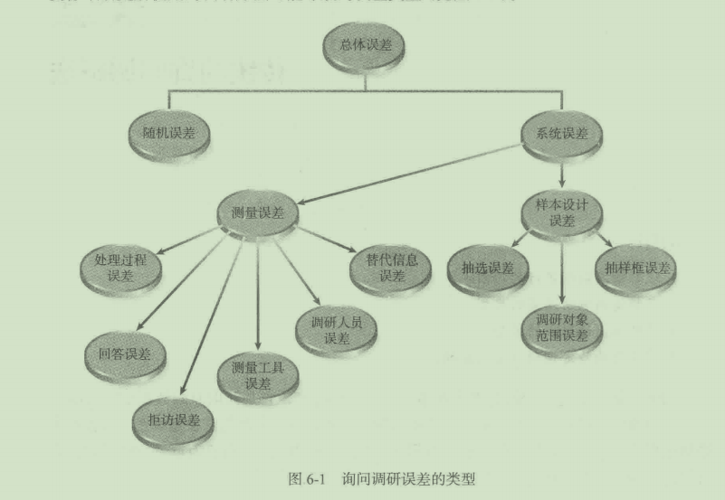
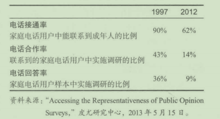
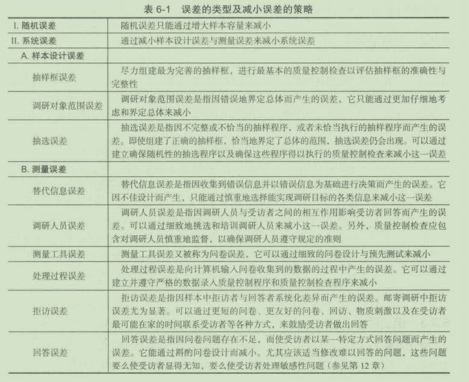
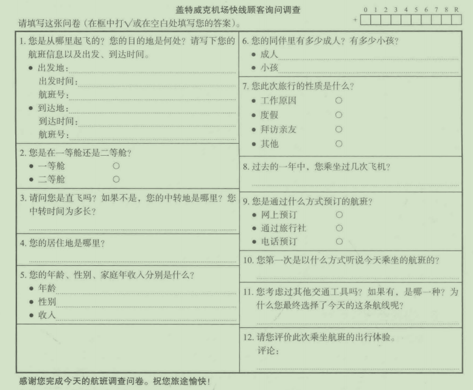
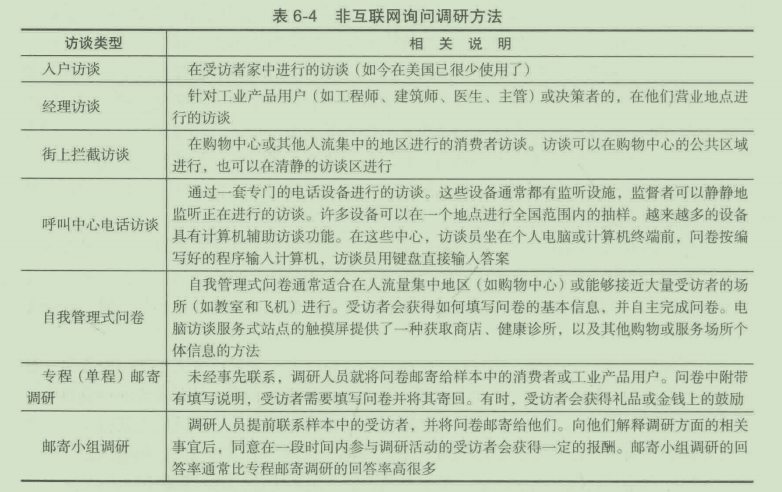
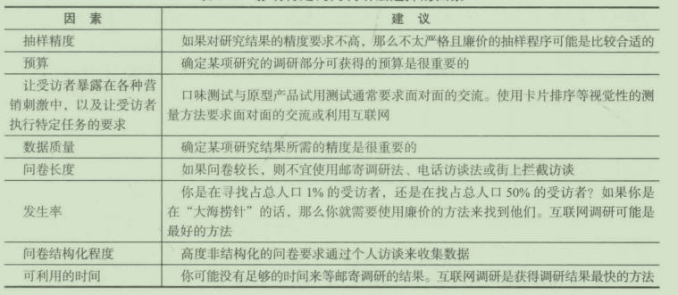
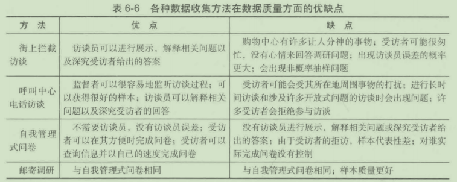

# 第 6 章 传统的询问调研法

**学习目标**

1. 理解询问调研流行的原因
2. 了解询问调研误差的类型
3. 了解询问调研法的类型
4. 掌握影响特定调研方法选择的因素

询问调研，就是利用问卷来收集事实、意见和态度，它是获取原始数据最流行的方
法 。 询问调研有哪些类型？正如前面所提到的，并不是每个入都愿意参与调查 。 这会产生
哪些类型的误差？在询问调研中还会有哪些其他类型的误差？为什么互联网询问调研会变
得如此流行？它的缺点是什么？这些问题将在本章得到回答 。

## 6 .1 询问调研流行的原因

大约 1.26 亿的美国人在他们的生活中曾接受过访谈 。 在美国，每年约有 7 000 万人接
受访谈，这相当于每位成年人每年要接受超过 1 5 分钟的访谈 。 与其他类型的原始数据收
集方法相比，询问调研在市场调研中有很高的使用率，主要原因如下 ：

- 了解“为什么”的需要。在市场调研中，需要了解人们为什么做或不做某些事情。
  例如，为什么他们购买或不购买某一特定品牌的产品？对于这一品牌，他们喜欢或
  不喜欢哪些方面？谁或什么影响了他们？我们并未暗示通过询问就能探明原因，只
  是说询问有助千我们了解真正起作用的起因 。
- 了解“如何＂的需要。 同时，市场调研人员发现通常有必要了解消费者在行动之前
  的决策过程 。 他们是如何做决策的？都经历了哪些时间段？他们考察或考虑了些什
  么？他们在何时何地做出决策？他们计划下一步做些什么？
- 了解“是谁＂的需要。市场调研人员也需要从人口统计或生活方式的角度来了解消
  费者 。 在细分市场的识别与界定方面很需要有关年龄、收入、职业、婚姻状况、家
  庭生命周期阶段、教育程度以及其他方面的信息。

## 6.2 调研过程中误差的类型

在评估调研过程中所获得的信息的质量时，管理者必须判定这些结果的精度 。 这就需
要仔细研究所使用的调研方法可能导致的误差类型（见图 6-1) 。

### 6.2.1 抽样误差
抽样过程中可能产生两类主要的误差。它们是随机误差和系统误差，系统误差有时又
称为偏差 。

询间调研通常试图通过目标总体中具有代表性的样本来获取信息，它旨在根据抽取样本给出的回答来推及总体的情况。即使样本的所有方面都被恰当地调研了，调研结果因偶然变异仍不免有一定的随机误差(random error)或随机抽样误差(random sampling error)。偶然变异(chance variation)是样本值与总体均值的真实值之间的差异。这类误差不可避免，但它会随样本容量的增大而减小。在一定的置信水平下，我们可以估计陆机误差的误差范围。随机误差以及其估计过程的内容将在第13、14章中进行详细讨论。

### 6.2.2 系统误差
系统误差 (sys temat ic error) 或偏差 (bias), 是指因调研设计中的错误间题或样本设计
实施中的缺陷而产生的误差。如果样本结果在某一方向上有持续偏离（固定地偏高或偏低）
总体参数真实值的趋势，那么样本结果就存在系统误差。系统误差包括除随机抽样误 差之
外的所有误差，因此系统误差有时又被称为非抽样误差 。 系统误差能系统地影响抽样调研
的结果，它分为样本设计误差和测量误差 。

1. 样本设计误差
   
   样本设计误差 (s ample design error) 是指因样本设计或抽样程序中的问题而产生的误
   差 样本设计误差包括抽样框误差、调研对象范围误差和抽选误差 。
   
   (1) 抽样框误差 (frame error) 。 抽样框 (sa mpling frame ) 是 一 份总体单位或成员的
   名单，样本单位可从这份名单中抽取 。 抽样框误差是指因使用不完整或不正确抽样框而产
   生的误差 。 间题是，从包含抽样框误差的名单中抽取的样本可能并不是目标总体的真实样
   本 。 在市场调研中，一个常见的抽样框误差例子是，在电话访谈中将出版的电话号码简作
   为电话访谈的抽样框 。 因为很多家庭不希望公开家庭电话，他们的电话并没有列在当前出
   版的电话领中；因为很多家庭巳经搬家或更换了电话号码，他们的电话号码并未准确地列
   在当前出版的电话简中 。 调研显示，电话简上所列的人与那些未列在电话简上的人在某些
   重要方面存在着系统化差异，如社会经济水平等 。 这意味若，将当前出版的电话简作为抽
   样框对某地区所有家庭的某种慈向进行研究，就会出现抽样框误差 。
   
   (2) 调研对象范围误差 ( population specification error) 。 调研对象范围误差是指因对
   研究对象总体或样本选择范围不正确的界定而引起的误差 。 例如，假设一个调研人员将
   35 岁以上的人界定为某一研究的总体 。 后来，他判定总体本应该包含更年轻的人，本应
   将 20 岁或 20 岁以上的人界定为该研究的总体 。 如果那些未被包括进去的年轻人在某些屈
   性方面存在着系统化差异 ， 那么样本结果将出现误差 。
   
   (3) 抽选误差 (se lection error) 。 即使分析员选择了适当的抽样框，正确地界定了总
   体，抽选误差也可能出现 。 抽选误差是指因不完整或不恰当的抽样程序或正确的抽样程序
   未得到恰当的执行而产生的误差 。 例如，入户访谈员可能会绕开那些看上去不整洁的房
   屋．因为他们认为这些居住者不会同意接受访谈 。 如果这些居住者与住在整洁房屋中的人
   有着系统化差异的话，那么这 一 调研结果就会有抽选误差 。 在第 13 章讨论的非随机抽杆
   中，抽选误差是一个更为严蜇的间题 。
   
2. 测拉误差
   
   对调研准确性而言，测量误差通常比随机抽样误差更具威胁性 。 当媒体和专业的市场
   调研报告给出民意调研结果时，总要标出 一 个误差指数（如土 5%) 。 电视观察员或市场调
   研研究的使用者一般会认为 ， 这个指数指的是总的调研误差 。 不幸的是 ， 韦实并非如此 。
   这个指数仅仅指随机抽样误差，它并不包括样本设计误差，也不涉及调研结果中可能存在
   的测植误差 。 测量误差 (meas urement error) 是指因寻找的信息（真实值）与测鼠过程实际
   获得的信息之间的差异而产生的误差 。 在本书中我们主要关注系统性测扯误差，测量过程
   中许多不足之处会产生各种类型的误差 。 这些误差包括替代信息误差、调研人员误差、测
   最上具误差、处理过程误差、拒访误差和回答误差 。
   
   (1) 替代信息误差 (s urrogate information error) 。 替代信息误差是指因解决某一问题
   实际所需的信息与调研人员所收集的信息之间的差异而产生的误差 。 这种误差与调研设计
   的主要问题有关，尤其与不恰当定义问题和关 。 几年前，凯洛格公司花费数百万美元开发
   出一个系列的 17 款谷物类早餐食品，着重突出产品原料有助千降低消费者的胆固醇 ， 这
   一产品线被称为 E nsemble 。 它在市场竞争中惨遭失败 。 的确，人们想降低胆固醇，但是
真正的问题是他们是否 愿意 购头 一 系列的谷物类早各食品来完成这 一 任务 。 在调研中，这
个问题从未被间及过 。 此外， "Ensem ble " 这 一 名字通常要么是指管弦乐队，要么是指我
们穿的东西 。 消费者既不理解产品线的含义，也不知消费这些产品的必要性 。
   
(2) 调研人员误差 (i nter viewe r error or interviewer bias ) 。 调研人员误差或调研人员
偏差是指因调研人员有意识地或无意识地影响受访者，而使受访者给出不真实或不准确的
答案而产生的误差 。 调研人员的衣着、年龄、性别、面部表情、肢体语言或语气语调都可
能影响部分或全部受访者的回答 。 这类误差是由调研员挑选与培训中的间题或调研人员未
遵循调研指导而引起的 。 必须对调研人员加以适当的培训与管理，以使其一直保持中立的
立场 。 另 一 类调研入员误差是巾故意欺骗引起的，这一间题在入户访谈中尤为突出 。 调研
人员可能非常想伪造访谈记录，以骗取报酬 。 调研人员制定的程序中必须包括防护措施，
以确保这类间题能被检测出来（参见第 15 章） 。

(3) 测量工具误差 (meas urement instrument bias ) 。测量工具误差（有时又被称为问卷偏
差）是指因测量工具或间卷方面的问题而产生的误差（参见第 12 章） 。 这些问题包括诱导性
问题或问卷设计中的某些要素，它们使问卷很难记录真实的回答或受访者回答时容易产生错
误 。 这类问题可以通过密切注意问卷设计阶段的细节和在实地调研前进行预先测试而避免 。

(4) 输入误差 (i nput error) 。 输入误 差 主要是指由于向计算机输入调研文件的信息时
发生错误而产生的误 差。 例如，未 正 确地扫描文档，在智能手机或笔记本电脑上填写问卷
的受访者可能按错键 。

(5) 拒访误差 (nonresponse error) 。 如果从某 一 总体中选出 一 个包含 400 人的样本，
理恕的情况是这 400 人都接受访谈 。 实际上，这种情况通常不会发生 。 在邮寄调研中，回
答率通常是 5 % 或更低 。 问题在千“回答者与拒访者在某 一 重要方面是否存在系统化差
异＂ ， 这些差异引起的误差就是拒访误差 。 我们最近考察了 一 项研究的结果 ， 该研究是在
一个大型储蓄与信用社的消费者中进行的 。 附在消费者每月账单中的间卷的回答率略低于
1% 。 对这些回答者的职业进行分析时发现，退休职工的回答率比该城市的这一比例高 2 0
倍。退休职工比例过高使我们深深怀疑调研结果的准确性 。

很明显，回答率越高，拒访的影响越小，因为拒访者在总体中所占的比例减小了 。 如
果陆若回答率的提高而误 差 减小不明显的话，那么投入资源提高回答率可能就是一种浪
费，因为恰当利用这些资源可以达到更好的目标 。

拒访误差在以下三种情况下发生 ：

- 在特定时间无法联系到受访者 。
- 联系到了潜在的受访者，但其在当时的环境下不能或不愿意接受访谈（例如，在全
  家人吃饭时接到要求其参与访谈的电话） 。
- 联系到了受访者，但受访者拒绝接受访谈 。 这种情况最严重，因为前两种情况还有
  让受访者再次参与的机会 。
  
  拒访率 ( refusal rate) 是指联络到的人中拒绝接受访谈的人的比例 。 尽管移动端和互
  联网调研的回答率一直徘徊在 60%, 专项调研甚至更高一点，但电话和邮件调研的回答率
  非常低 。 皮尤研究中心 ( Pew Research ) 一 个典型的电话调研的回答率在 1997 年是 36%,
 而 2002 年是 8% 。 固定电话向智能手机的转移是 一 个很大的原因 。 通过 1997 ~ 2002 年的

对比我们发现 ：

(6) 回答误差 ( response bias ) 。 如果
入们有以某一方式回答某 一 特定问题的倾
向，那么就产生了回答误差 。 回答误差的
产生有两种方式 ： 有意误述与无意误述 。

有意误述是因为受访者故意做出不 家庭电话用户样本中实施调研的比例^ 36%^ 9%
真实回答而产生的 。 人们在调研中故意 资料来源： "Accessing the Representativeness of Public Opinion
给出失实信息是有许多原因的，他们可 Surveys,·• 皮尤研究中心， 2013 年 5 月 15 日 。
能希望显示自己的智慧，不给出使他们感到尴尬的信息 ， 或者隐瞒他们认为屈千个 入隐私
的内容 。 例如，在一个有关快餐食品购买行为的调研中，受访者可能记得在上个月去快餐
店的次数 。 然而，他们可能不记得去了哪些快餐店或每一家去了多少次 。 对千你去过 哪些
快餐店这一间题，受访者宁愿简单地猜渊也不愿意回答“不知逍＂ 。

无意误述是指人们想做出真实准确的回答，却给出了不准确的答案。这类误差会因间
题的格式、内容或其他原因而产生 

表 6- 1 概括了诫小调研误差的策略 。

## 6.3 询问调研的类型

向人们提问题是询问调研方法的本质 ， 但在给定的情赞下，哪种调研是最好的？木 程
探讨非互联网调研 ， 包括入 户 访谈、经理访谈、街上拦戟访谈、电话访谈、自我管理式问
卷和邮寄调研 。

### 6.3.1 入户访谈

入户访谈 ( d oor - to-door interviews ) 中消费者在家中亲自接受访谈 ， 入户访谈曾被认
为是最好的调研方式 这 一 结论有许多依据 门 首先 ． 入户访谈是私下的面对面的相互交
流 ， 它有许多优点 —— 即时获得受访者的反馈，可以对复杂任务进行解释 ， 可以运用 需 要
现实交流的专门的间卷技术（这些间卷技术可以加快访谈速度或提高数据质姓），可以展 示
产品的理念以及其他促进受访者评估的物品 其次 ， 在熟悉舒适安全的环境中受访者是安
心自在的。

入户访谈在 20 世纪 70 年代初开始急剧下降，现在入户访谈几乎已经完全退出了美国
市场调研舒台 。 费用问题是上要的原因 ， 费用就是访谈人员差旅时间、交通补贴、调研时
间方而的支出 ， 以及应对不断上升的拒访率方面的支出 然而 ， 这种方法仍然被用在 一 些
政府调研 中 。 例如 ， 最近的 一 些美国人 1 一 ！普查就是使用入户访谈法 ， 入户访谈法也是很多
发展中国家最流行的访谈形式 。

### 6.3.2 经理访谈

市场调研人员将 经理访谈 ( executive interviews ) 当成专业性入户访谈 。 这类访谈包括
在商务人士办公室对他们进行有关工业产品或服务的访谈 。 例如 ， 如果惠将公司想获得用
户在打印机功能偏好方面的信息 ， 就需要对打印机的潜在购买者进行访谈，惠普公司下 一
批 新型办公 电 脑打 印 机就可能提供用户偏好的功能 ， 找到这些人并在他 们 办的公室中访问
他 们 是恰当的做法 。

这类访谈费用很高 。 首先 ． 必须识别并找到我们正在谈论的产品的购买决策者 C 有
时 ， 可以通过多种途径来获得购买决策者名单 ， 但通常需要通过电话来识别真正的购买决
策者 。 公司里可能的确有我们正在寻找的这类人 ， 但是在 一 个大型组织里面找到他们是耗
时且昂贵的 。 一旦找到这个人 ， 下一步就是让这个人答应接受访谈，并为访谈安排时间 c
这并不像乔上去那么困难，因为多数专业人士似乎乐意谈论与他们工作相关的话题 。

最后 ， 访谈员必须在约定的时间到达指定的地点 。 长时间的等待是常有的事，取消访
谈 的 情况 也 不并罕见 。 这类访谈需要技术精湛的访谈员，因为他们通常都是就一个他们不
太 了 解的话题进行访谈 。 实质上 ， 经理访谈具有与入户访谈 粕 同的缺点与优点 。 在线经理
访谈变得越来越多 。

### 6.3.3 街上拦截访谈

街上拦截访谈 ( m all-interce p t interviews ) 是一种流行的询问调研法 ， 它用千进行个人
访谈 ， 这 一 调研方法是相对简单的 。 在购物中心的公共区域，购物者被当场拦住，或者当
场接受访谈或到购物中心固定的访谈室接受访谈 。 全美约 350 家购物中心中有市场调研公
司运营的访谈室 ， 数址相卉或更多的购物中心每天都允许市场市场调研人员进行访谈 。 然
而，许多购物中心禁止市场调研访谈，因为它们认为访谈是对消费者的一种骚扰 。

相比入户访谈，街上拦截访谈成本更低，因为受访者自已出现在访谈员面前，而不需要
访谈员去寻找受访者 。 访谈员可以将更多的时间用千访谈 ， 而用更少的时间去寻找受访者 。
入户访谈有行程时间和车旅用费方面的大批开支，而街上拦截访谈并没有这些开支 。 除 成 本
低以外，街上拦截访谈同样县有入户访谈的优点 ， 如受访者可以当场试一试测试产品 。

然而，街上拦截访谈也有许多不足之处 。 第 一 ，事实上不可能从某一购物中心的消费
者中抽出一个能代表大都市区域消费者的样本 C 即使有许多很大的购物中心 ， 它们中的大
部分也只是吸引相对较小区域的消费者 。 而且 ， 基千购物中心所包含商店的类型 ， 购物 中
心倾向千吸引某些类型的消费者 。 研究也表明，相比其他人 ， 有些 人 的购物频率更高 ， 因
而他们被选中参加调研的机会更多 。 许多人拒绝参与街上拦截访谈 。 总之，街上拦截访谈
不能 产生 好的或具有代表性的样本 七 在极少数情况下 ． 如总体恰好是某 一 购物中心的消费
者，或总体恰好是某一购物中心消费者的子集 ｀ 街上拦截访谈能产生具有代表性的样本 。

第 二 ， 购物 中 心的环境并不总被视为一个适合进行访谈的地方 。 受访者可能感到不
安、匆忙，可能全神贯注千各种使人分心的市情 ， 而这些串情是访谈员无法控制的 。 这些
因素都会降低收梊到的数据的质扯 。 即使有这些问题 ． 近年来街上拦截访谈受欢迎程度仅
有轻微的降低 。

### 6.3.4 电话访谈

直到 19 9 0 年，电话访谈仍是询问调研中最受欢迎的方法 。 电话访谈的优点是引 人 注
目的 ： 第一，利用电话收集调研数据是一种相对廉价的方法 ； 第 二 ， 传统意义上讲 ， 电话
访谈能产生高质址的样本 。 95 % 的美国人有电话 ， 随机数字抽样或随机数字拨号是经常 使
用的抽样方法（参见第 13 音） 。 基本思想很简单 ， 调研人员不从电话颌或姓名 地址录 中抽
取样本，而使用随机数程序 产 生的电话号码 。 这种方法能确保那些未列在电话颌上的人和
出现在上次出版的电话海上的现在巳经搬家或更换电话号码的那些人 、 以正确的比例出现
在样本中 。 但是正如已经提到的 ， 它最显著的缺点在于极低的回答率 。

1. 预测性拨号
   
   现在，已经和相关软件 一 起出现的电子随机拨号催生了预测性拨号 。 访谈者不用再
   自己拨打号码，预测性拨号给了访谈者更多的时间进行真正的访谈 ， 因此它提高了访谈过
   程的效率 。 拨号机自动地拨打一个号码 ， 并过滤掉如自动答录机或占线用户这样的无效电
   话，然后接通 一 个正在等待的潜在受访者 。 该软件会优先蜇播给打过的已经到预约 时间的
   用户，再做 完 整的访谈 八
   
2. 呼叫中心电话访谈
   
   呼叫中心电话访谈 ( call center telephone interviews ) 是通过一套专门设备 进 行的访谈 。
   呼叫中心电话访谈流行的原因相当简单 ， 用一个词来形容就是控 制 。 第一 ， 可以对访谈过
   程进行监瞥 。 大多数呼叫中心电话访谈设备都有不引人注目的监听设备 ｀ 监督者可以在访
谈进行时进行监听。访谈员进行的不恰当的访谈会得到纠正，不能进行正确访谈的访谈员会被解雇。一个监督者可以监听 10 ~ 20 个访谈 。通常，每个访谈员每班至少被监听一
次。第二，对已完成的访谈进行当场审查，对其进一步的质卅控制检查。访谈员能立即知
道自己工作中的不足之处。第三，访谈员的工作时间受到控制。
大部分调研公司已经使用计算机来处理中心控制电话访谈过程 f 。在 计算机辅助电话
访谈 (computer-assisted telephone interviews , CATI) 中，每个访谈员都坐在计算机终端或
个人电脑前 。当接通受访者电话时 ，访谈员通过按下键盘上 一个或一系列的键来开始这一
访谈。屏幕上一次显示一个问题以及其备选答案，访谈员读出问题并输入受访者的答案，
计算机会跳到下一道恰当的问题。例如，访谈员可能会间受访者是否有狗，如果受访者回
答有，计算机可能显示一系列关于受访者购买哪类狗食的问题；如果受访者回答没有，这
些问题就不恰当了。计算机会考虑受访者的回答，然后跳到下一个恰当的问题。
   
另外，计算机还能定制个性化的问卷。例如，在一个长访谈的开始部分，会间受访者
拥有的所有汽车的制造时间、品牌和款式，接下来，问题可能具体到每 一辆特定的车。屏
幕上可能出现如下问题 ： “您说您拥有一辆 2014 年的通用卡车 ． 在您家里通常谁开这辆
车？”有关这辆车的其他问题或有关其他车的问题会以同样的方式出现。

计算机辅助电话访谈的另一个优点是计算机制表能在调研中的任何时点使用。在用纸
笔的访谈中这是奢望。根据表格中的初步数据，某些间题可能被删除，以节省后续访谈的
时间与经费 。例 如，如果 98.3% 的受访者以同样的方式回答某 一 1 司题，那么可能就没有必
要继续问这一问题。表格也可能建议增加某些访谈间题。如果产品某项未被预期到的用途
在访谈早期阶段未被提及，就可以加入这些问题，以进一步探究受访者这方面的情况。最
后，管理者发现报告早期访谈结果对初级计划与战略部署开发是有帮助的。

获得受访者的配合是电话访谈成功的关键。宾夕法尼亚州费城的一位市场调研公司顾
间 Bonnie Eisenfeld 在“市场调研实践 6-1 " 中讨论尊觅受访者的重要性。

尊重受访者为市场调研带来各方面的提升

我听到的关于调研最普遍的抱怨是：问题让人迷惑，给出的多个选择中没有符合受访
者情况的答案和访谈冗长而无聊 。人们不喜欢在晚餐时在家接到电话 ，尤其不喜欢访 谈比
之前承诺的时间长 。 如果打电话的人说访谈只需要 5 分钟而实际却花了 20 分钟时， 受访
者会变得愤怒，甚至很有可能拒绝参与下一个访谈。类似这样的调研失礼表明缺乏对受访
者的尊重。

为了确保受访者继续参加市场调研的过程，市场调研人员需要从受访者的角度来理解
调研过程并表现出对受访者的尊重和感谢。

激励受访者的是多种因素的结合 。

同意参加调研的受访者被多种因素所激励 。他们也许是对话题感兴趣 ， 意识到自己的
意见是重要的 ， 认为这是一个表达自我和自己想法的机会，想要帮忙的意念认为是一个诉
求满意度的机会 ， 或者在一定程度上是一个影响产品或服务的机会；他们也许是对话题好
奇或好奇他们同龄人的回答；从更自我的角度、受访者也许认为最终调研结果会对他们有
利 。 空闲时间是个大问题，但是，如果提供了他们想要的激励作为参与的回报 ， 忙碌的受
访者往往也会腾出时间 。

设 计一 个能让受访者 表 达自我的问卷

受访者非常渴望表达他们的想法和意见 。 如果一个仅仅有多项选择和量表式问题的问
卷无法反映受访者真正的想法 ， 他们会感到失望 。 因此，即使你的问卷几乎都是封闭式问
题，你也应该允许有开放式回答 。

避免问题的答案有大多的选项，受访者可能会感到无聊并早早结束 ， 最多他们会给出
敷衍而不经过思考的答案 。

预测问卷的逻辑性和清晰度，反复修改，直到你已经减少了任何会让人疑惑的问题 。
另外 ， 要测试完成整个问卷所需要的时间 。 问卷看起来可能很简短，但是如果你想要有想
法的答案，你需要给每个受访者时间去思考 。 在满足调研主题的情况下 ， 尽可能使问卷
简短 。

心中装有受访者的福求去招募

时间对大部分人来说是无价的东西，调研人员应该给予足够的调研时间以便让受访
者能够在他们最方便的时候完成访谈或填写问卷 。 如果你要建立一个小样本来获取多个及
时回访的话，这点尤其重要 。 你的目标人群有工作、家庭、责任、聚会、爱好 ， 还有假
期，他们人生中的其他部分比你的调研项目重要得多，你很幸运他们拿出时间来回答你的
问题 。

招募受访者，应该提前发信息告知这个调研项目的详细情况、调研目的、受访者参与
的重要性，以及出资调研的组织类型 。 按照惯例应该向受访者承诺其匿名性以及保密性 。

问题：

1. 你经常拒绝参加市场调研吗？为什么？
2. 你曾经在参加过一个调研之后感到失望吗？发生了什么使你感到失望？
3. 调研人员可以采取什么方法让更多的人参与市场调研？

### 6.3.5 自我管理式间卷

自我管理式问卷 ( self-administer e d qu e stionnair es) 与本章讨论的邮寄调研有一个共同
点 。 它们区别于其他询间调研方法的地方是访谈过程中没有访谈员（人或计算机）的介入 。
自我管理式问卷主要的缺点是没有人在现场为受访者解释和阐明开放式问题的答案。例
如 ， 如果利用开放式间题调研 ： “为什么您不购买某一品牌的软饮料？＂典型的回答是 ： “因
为我不喜欢它 。 ”从管理的角度看，这类回答是毫无用处的 。 它没有提供改进营销组合的
信息，这些营销组合信息可以使产品更具吸引力 。 如果有访谈员参与该调研，在接收和记
录无效回答后 他 会“深究”这 一 回答，访谈员会问他不喜欢这一产品的哪一点 ； 然后受访
者可能指出不喜欢该产品的味逍 ； 接下来，访谈员会问受访者不喜欢哪种口味 。 这样 ， 访
谈者可能最终会获得 一 些有用的信息 、 例如，受访者指出该产品“太甜了＂ 。 如果许多人
给出相似的答案 ， 管理者可能会选择降低该饮料的甜度 。 关键是 ， 没有深究，管理者可能
只能获得一个没用的答案 。

有些人则认为没有访谈员的参与是一种优点 ， 这样可以消除因访谈员参与而带来的误
差 。 访谈员的外表、衣着、 言 谈方式和未遵守访谈规则，都会影响受访者的回答 。

自我管理式问卷通常适用千购物中心或其他调研人员能够接近受访者的中心地区 。 例
如 ， 航空公司经常在飞机飞行期间发放问卷，邀请乘客评价航班各方面的服务 ， 这些评价
结果用千追踪乘客随着时间的推移对服务的看法 。 许多宾馆、餐馆以及其他服务机构向顾
客发放简短的问卷，以了解顾客对他们提供的服务质址的评价（见表 6-2 ) 。

表 6-2 自我管理式问卷

近期 计 算 机 直接访谈方面的发展是站点式计算机访谈 。 站点式计算机访谈伴随若多媒
体触 摸屏、置千独立式 的机柜 中的 计算机而发展 。 这些电脑能按照计算机程序执行复杂的调
研 ， 显示色彩综纷 的 扫描图像（产品、商店布局），播放影音片段 。 站点式计鍔机访谈巳经
成功运用千商贸展与会议中，现在正尝试将其运用于零售环境中 ， 在零售环境中其有许多 应
用 。 从调研 的 观点吞 ， 站点式计鍔机访谈可用来代替离职面谈 ， 以获取离职者近期经历方面
的数据 。 站点式计算机访谈有其他一些确切的优点 ： 这种形式的访谈费用比较低 ；相比 个
人面谈，人们倾向于给出更多的真实答案；因为访谈是预先编程的，其内部控制程度更高 。

### 6.3.6 邮寄调研
在市场调研中，邮寄调研主要有两类 ： 专程邮寄调研与邮寄小组调研 。 在 专程邮寄调
研 (a d hoc mail surveys, 有时又被称为单程邮寄调研）中，调研人员通过恰当的来源抽选
一 个包含受访者姓名与地址的样本，并将问卷邮寄给他们 。 一般没有提前联系，且一个项
目的样本只用一次 。 然而，为了提高整体回答率，同样的问卷可能会多次寄给拒访者 。 相
比较而 言 ，邮寄小组调研是以如下方式进行的：

(I) 用信函提前联系样本组成员 ＾ 在初次联系中将指明他们即将参加的调研的目的，
受访者通常会获得 一 定的报酬

(2) 作为初次联系的 一 部分，消费者 需 要埴写 一 份背景资料间卷，其中包括家庭人
口、年龄、受教育程度、收入、宠物类型、汽车类型及使用年限、家用电器种类等 。

(3) 在初次联系后，小组参与者会时不时地收到问卷 。 初次联系中收集到的背景资料
数据使调研人员只向合适的家庭邮寄间卷 。 例如，有关狗食使用与偏好的调查间卷，只会
邮寄给有狗的受访者 。

邮寄小组调研 (mai l panel ) 是一 种纵向研究 。 纵向研究 ( longitudinal study) 就是指在
不同的时点反复访问衵同的受访者 。一 些公司 ， 如思纬市场资讯公司、 NPD 市 场调研公
司、盖洛普咨询有限公司，都进行了大型的固定样本邮寄调研（超过 10 万户家庭） 。

我们首先想到的足，邮寄调研似乎是一种具有吸引力的调研数据收染方法 。 它不需要
招募、培训、监督访谈员，也不需要支付访谈员的工资，整个调研的实施与呼理都可以在
一个地方完成，原本难以接近的受访者也可以很容易地参与访谈 。 邮寄调研似乎是一种方
便、高效、低廉的调研方式 。 匿名承诺是它的另一优点。虽然个人访谈和电话访谈可能会
声称收栠的所有信息都是保密的，隐蔽的邮寄调研却能绝对保证信息的机密性 。 这对某些
提供机密信息或私人信息的人而言是尤其重要的 。

就像自我管理式问卷一样，两类邮寄调研都有调研现场无访谈员的缺点，尤其是没有
人在现场深究开放式间题的答案，这的确限制了能收集到的信息的类型 。 因此 ， 和比其他
一些有访谈员介入的访谈，邮寄调研通常在间卷间题的数量以及可获得的信息鼠方面更受
限制 。

专程邮寄调研拒访率高，且具有由此引起的系统误差 。 如果每个人拒访的概率是一样
的 ， 那么拒访将不是邮寄调研的一个问题 。 然而，许多研究表明，某几类人一—受过更多
教育的人、职位较高的入、妇女、对该话题不感兴趣的人和学生，拒访的可能性更大 。 专
程邮寄调研的回答率在不足 5% 到 50% 多之间浮动 ， 这取决于间卷长度、间卷内容、受访
者、使用的激励方式以及其他因素 J 邮寄小组调研人员声称他们的同答率在 70% 左右

为提高邮寄调研的回答率 ， 已经开发出了许多策略，表 6-3 概括了几种常见的策略。
而问题在于”相比增加的回答率，某 一 策略的花费是否值得＂ 。 遗憾的是，这 一 间题还没
有叨确的可用千所有情景中所有程序的答案 。

表6-3提高邮寄调研回答率的方法

- 提前用明信片或电话提醒受访者
- 用明信片或电话进行跟踪提醒
- 金钱刺激 (50 美分 、 1 美元 ）
- 物质奖励（铅笔 、 钢笔和钥匙链等 ）
- 使用加贴邮票而不是付费打戳的信封
- 附上回程信封（已经写好地址并贴好邮票）
- 写受访者的私人地址以及制作精美的附信
- 承诺进行慈善事业
- 受访者可以参与抽奖
  ． 真诚地恳求
- 表明与大学或研究机构联办
- 亲笔签名的附信
- 问卷的多样化投递
- 提醒受访者其参加过以前的相关淜研（针对邮寄小组调研参与者）
  
  在商业市场调研中，邮寄调研法的流行度正慢慢减弱 。 很多过去采取邮寄方式的调研
  项目现在正在慢慢地向互联网和移动终端转移 。
  
  表 6-4 概括了本章讨论的非互联网询问调研法 。
  
  表 6- 4 非互联网询问调研方法
  

## 6.4 影响调研方法选择的因素

在特定的情境下，许多因素会影响调研方法的选择 。 调研人员应该选择以最低的成本
获得理想的数据类型、质侬和数量的调研方法 。 表 6-5 概括了选择调研方法时所考虑的主
要因素。 

表 6-5 影响特定询问调研法选择的因素

### 6.4.1 抽样精度

抽样精度要求是决定特定悄境下调研方法选择的一个蜇要因素 。 有些项目巾于其自身
的性质，要求很高的抽样精度，而在其他项目中抽样精度却不是主要的考虑因素 。 如果抽
样精度是唯一的标准，那么合适的数据收集技术很可能是中心控制电话访谈，从大型互联
网固定样本中抽选样本的在线调研．或者某一形式的从消费者名单中抽选样本的民意测试
调查 。 对千抽样精度要求不高的项目而 言 ，邮寄调研或某 一 类型的街上访谈可能是恰当的
调研方法 。

考虑抽样精度 ， 选择中心控制电恬访谈、互联网小组调研还是邮寄调研，是一个权衡
精度与费用的问题 。 中心控制电话访谈使用随机数字拨号抽样程序，这很可能产生一个比
邮寄调研法更好的样本，然而，邮寄调研成本很可能更低 。 有时，互联网样本则可兼顾更
低的成本与更高的精确度 。

### 6.4.2 预算

商业市场调研员经常遇到这样的间题，某项研究可支配的预算会强烈地影响调研方
法的选择 。 例如，假定某项研究的访谈预算额为 1 万美元，而达到所需精度的样本容量为
1 000 人 。 如果使用街上拦截访谈进行间卷访谈的费用是 34.5 美元／人，而互联网调研的
费用是 l.5 美元／人，那么应该如何选择就相当明显了 。 当然，这是在假设调研不需要面
对面交流情况下的选择 。

### 6.4.3 要求受访者做出反应

在 一 些研究中，市场调研人员需要让受访者对各种营销刺激做出反应 。 营销刺激也许
是原型产品的试用（如试用新款个人电脑键盘），也许是一次口味测试 。 在这些悄况下 ， 让
受访者对营销刺激做出反应，通常要求访谈员与受访者进行交流

典别的口味测试需要准备食品 这些食品的准备必须在严格的控制下进行，以确保每
一 位受访者都是对同样的刺激做出反应 。 街上拦截访谈或其变形足进行这类测试咐 一 可钉
的调研方法 。 例如，街上拦戟访谈的 一 种变形就是将人们吸引到准备好的中心地区（如社
区活动中心），让他们品尝样品，并进行访谈 。

因为需要使用特殊的测柏技术或为了获取特殊形式的信息， ．些调研荌求面对而的访
谈 。 任务是如此复杂，访谈员必须在现场解释这些任务 ． 以开沽受访者是否了解了对他们
的要求 “

### 6.4.4 数据质量

数据质址要求是调研方法选择的 一 个重要影响囚索 。 通过效度与信度来衡川数据质忧
（这两个概念将在第 10 章中进行汗细的讨论） ， 效度是指测川反映测址对象特性的程度、
换句话说，一个有效的测讨能够准确地给出调研人员想要测址的内容 ； 信度是指一致性．
对同 一 总体或相似总体进行测扒产生同样的结果

除调研方法本身外，还有许多影响数据质景的因索，抽样方法、间卷设计、具体的度
卧方法和访谈员培训就是这些囚素中的几个 仁 然而，就数据质扒而 言 ，每种访谈方法都有
某些固有的优点与缺点 。 表 6 - 6 概括了这些优点与缺点

表 6-6 各种数据收集方法在数据质 量 方面的优缺点

关键在千数据质最可能比费用等其他因素更为重要 例如，虽然获得受访者对长问卷
（有许多开放式间题）回答最廉价的方法是街上拦截访谈，但通过这种方法收集的数据会因
受访者的疲劳、分心与粗心而出现很大的误差。最好的结果是，这一调研结果是没有价值
的；最坏的结果是 ， 这一调研结呆具有误导性。 

### 6.4.5 问卷长度

间卷长度——受访者完成一份调查所需的平均时间，是决定选择使用何种调研方法的
重要因素 ， 如果某项研究的问卷需用一小时来完成，则可用的调研方法是相当有限的 L 电
话访谈、街上拦截访谈 ， 以及除了个人访谈之外的许多其他调研方法都是不适用的 。 购
物中心的消费者通常不会花一个小时的时间来接受访谈 。 当访谈员试图进行一个小时的电
话访谈时，受访者终止访谈和发脾气的概率就会增加 。 当人们收到需要花费 一 个小时甚至
更长时间才能完成的邮寄问卷时，回答率会直线下降 。 关键在千使调研方法与问卷长度相
匹配 。

如果没有不能更改的规则，以下是推荐的各种访谈的时间上限 ：

- 面对面（家里或办公室）访谈 25 分钟
- 电话访谈 20 分钟
- 街上拦截访谈 15 分钟
- 互联网调研 20 分钟
- 深度访谈 40 分钟

### 6.4.6 发生率

发生率是指某一研究一般总体中 ， 人们、家庭、企业有资格作为受访者的比例 。 寻找
成本与找到合格的受访者所花的时间相关，有时会超过访谈成本 。 在那些发生率低且寻找
成本高的情况下，选择以合理的费用提供所需的调研结果的调研方法或调研方法组合是很
重要的 。

在购物中心进行一项低发生率的调研将是非常昂贵的 。 只有在不得已的情况下才使用
这种方法，如长时间深度访谈 。 对低发生率的调研而言，成本最低的方法很可能是互联网
小组调研法，当然这需要假定互联网小组调研能够满足该调研数据收集方面的其他要求 。
互联网小组调研的一大优势是它能进行事先筛选，可以问人们许多问题，通常包括一些产
品使用方面的问题 。 例如 ， 如果在前期筛选中间受访者家庭成员中是否有人参与速降滑 雪
或高山滑雪，互联网小组调研人员就能够以较低的成本挑选出有一个或更多个滑 雪 者家庭
来参加高山滑雪方面的调研 。

### 6.4.7 问卷结构化程度

除间卷长度外，问卷结构化程度可能是决定哪种调研方法最适合某一研究的因素 。 结
构化是指问卷连续性和顺序性程度、间卷问题措辞的预定性程度以及封闭式间题（多选）
的数挝 。 一份满足上述条件的间卷就是结构化的间卷，偏离上述楼式的间卷就是非结构化
间卷 。 结构化程度低的问卷很可能需要面对面的访谈；很简短、高度结构化的间卷就不需
要访谈员与受访者之间面对面的交流，对千这类间卷，邮寄调研、电话访谈、自我管理式
间卷与在线调研都是可行的方法 。

### 6.4.8 可利用的时间

如果客户需要快速获得调研结果，互联网是最好的选择 。一 般而言，呼叫中心电话访
谈和街上拦截访谈也能及时完成调研 。

##  本章小结

询问调研因为这些原因而流行：第一，管理者需要知道人们为什么这样做或不这样做；第二，管理者需要知道决策是如何做出的；第三，管理者需要从人口统计学或生活方式的角度来了解做出购买或不购买某一产品决策的人是哪类人。

询问调研中主要有两类误差：随机误差和系统误差（或偏差）。系统误差可进一步分解为测量误差和样本设计误差。样本设计误差包括抽选误差、调研对象范围误差和抽样框误差。抽样框误差是由于使用不完整或不正确的抽样框而造成的误差；调研对象范围误差是由于对全域或抽样总体不正确的界定而造成的误差；抽选误差是由于采用不完整或不恰当的抽样程序，或者未恰当执行正确的抽样程序而造成的误差。

第二类系统误差是测量误差。测量误差是指因寻找的信息（真实值）与测量过程中实际获得的信息之间的差异而产生的误差。测量误差是由许多因素造成的，包括替代信息误差、调研人员误差、测量工具误差、处理过程误差、拒访误差和回答误差。替代信息误差是指因解决某一问题实际所需的信息与调研人员所收集的信息之间的差异而产生的误差；调研人员误差是指因受访者受到调研人员的影响而给出不真实或不准确的答案而产生的误差；测量工具误差是指因问卷自身方面的问题而产生的误差；处理过程误差是指由于向计算机输入调研文件的信息时发生错误而产生的误差；拒访误差是指因样本中某一个体无法联系到或拒绝参与访谈而产生的误差；回答误差是指因受访者以某一特定方式回答问题的倾向而产生的误差，而不论是有意的还是无意的误述。传统的询问调研法有以下几类。街上拦截访谈是对购物中心公共场所的购物者进行的访谈，购物者要么在购物中心中接受访谈，要么到购物中心固定的访谈室接受访谈。经理访谈是专业性入户访谈，包括在专业人士办公室对他们进行有关工业产品或服务的访谈。中心控制电话访谈是通过一套专门的电话设备进行的电话访谈；计算机辅助电话访谈(CATI)是呼叫中心电话访谈中的一类，每个访谈员都坐在计算机终端或个人电脑前面，计算机通过屏幕上显示的恰当问题来引导访谈员与访谈过程。在访谈进行时，相关数据就输入计算机了。自我管理式问卷是受访者自行填写问卷的访谈方法，这一方法的一大缺点是，不能对回答进行深究以找到有用的答案。邮寄调研可分为专程（单程）邮寄调研与邮寄小组调研。在专程邮寄调研中，问卷邮寄给没有提前联系的潜在受访者，一个调查项目的样本只用一次；在邮寄小组调研中，需用信函提前联系消费者，并为消费者持续的参与提供酬金；如果他们同意，他们将填写一份有关背景情况的问卷。然后，参与者定期会收到邮寄的问卷。

影响调研方法选择的因素包括抽样精度、预算、是否需要受访者对各种刺激做出反应或执行特定任务、数据质量、问卷长度、发生率、问卷结构化程度和完成调研可利用的时间。

## 复习思考题

 1. 加利福尼亚尤里卡地区的一家五金工具店店主，想了解到他店里购物的消费者与到其竟
 争对手店里购物的消费者在人口统计学特征方面的差异 ； 他也想知道，相对于竞争者，
他的店给人的印象是怎样的 。 他只提供了有限的预算，并想在三周内获得这些信息。你
将推荐哪种调研方法？为什么？
    
2." 街上拦截访谈只能代表在某一购物中心购物的人，因此只有涉及某一购物中心消费者
购物模式的调研才应该使用街上拦截访谈 。 ＂讨论这一说法 。

3 一位同事争辩说，在社区中进行有关人们如何看待市政府的调研最好的方法是邮寄调
研 ． 因为它是最便宜的方法 。 对此你有什么看法？如果时间不是你决策 中 的重要 因 素，
你会改变看法吗？为什么？

4. 讨论各类样本设计误差并举例说明 。
   
5. 为什么在询问调研中要着重考虑测量误差？为什么专业的市场调研报告不讨论测量误差？
   
6. 下列情况可能存在哪类误差？
   a. 进行有关人们如何看待市政府的调研时 ， 将电话簿作为抽样框 。
   b. 仅在上午 8 点到下午 5 点之间进行访谈，以了解受访者想在某 一 新公寓开发中看到 什么 。
   c. 问人们在最近的两个月里是否去过公共图书馆 。
   d. 问人们在过去的一年里使用过多少支牙膏 。
   e. 告诉访谈员 ， 他们可以举任何一个他们想编造的例子来深究受访者的回答 。

##  调研实例 6-1

**美国必能宝集团提升顾客满意度**

美国必能宝 ( P i tn ey Bowes ) 是一个提供邮政以及文件服务的销售额超过 50 亿美元的
公司 。 从必能宝的角度看，每位顾客对千组织的成功都是必不可少的 。 该公司对很多人进
行深度访谈，深入挖掘和理解人们的需求和关注点 。 例如，每个月和多个企业客户进 行 电
话深度访谈，探求售后支持、机器状态、回复时间 ， 以及对服务代理的满意度、业务 便利
性和整体满意度 。

如果客户表示仅仅是满意，服务经理有 3 天的时间解决问题 ， 并制订出一个行动计划
使客户感到愉快 。

经理每周都查阅满意度结果，分析小组寻找在地区、服务代表、模型等方面的趋势 ，
以此制定策略，驱动战略并发起新项目 。 报告追踪了顾客满意度 ， 但更重要的是 ， 它 揭 示
了提升顾客满意度的因素 。

这样做的目的不仅是谈论具体的细节 ， 也是探索发现他们是否会推荐必能宝公司以及
必能宝公司在他们信任的供应商 中 的地位 。

快速增长

自从儿年前重新设计测量项目 ， 必能宝公司就在顾客满意度和业务表现上有了快速增
长 。 现在 ， 有 86 % 的顾客表示非常满意 ， 96% 的顾客表示他们会推荐必能宝公司 。

必能宝公司内其他部门向每天进行上百万笔交易的数百万顾客提供桌面应用 。 必能宝
公 司负责客户体验的副总裁盖尔 · 伦丁 ( Gael Lundeen ) 说 ： “我们的很多顾客通过互联网
购买我们的技术产品 ， 从未和必能宝的代表见面 ， 所以我们需要建立一个有力的机制使我
们能够轻易地反映、倾听和分析顾客的关注点 。 ”

该测量项目的要点包括以下方面 ：

- 针对 20 位关键顾客每月进行一次电子邮件调研 。 在过去的 16 个月里 ， 已经完成
  超过 18 万份顾客满意度调研 。
- 如果有任何顾客的报告显示他们不满意 ，相 关 的工 作模块就会被警告 。 他们需要对
  报告结果做出回应 ， 并公布结果 ，
- 作为调研过程的一部分，顾客也会被征求建议 。 到目前为止，有 25 % 的顾客给出
  了回答 ， 促成了 4.4 万个新想法 。
  
  持续研究
  
  类似必能宝的公司一直在不断研究以寻找新的方法超越现有期望 ， 并以此指导它们收
  集顾客想法 c 它们明白潜在顾客是有限的，顾客满意度、忠诚度以及购买行为都紧密地联
  系在一起 J
  
  谈到顾客满意度时，公司真正测最的是什么
  
  当一个公司说“我们的顾客中有 90 % 是满意的 ＂． 这到底意味着什么？实际上，领先
  的技术公司并不是测量顾客是否满意，它们唯一关心的是顾客是否非常满意 。
  
  每个公司的调研反馈机制都不同，大多数采用量表式问题 ， 从非常满意、满意、有点
  满意、到中立、有点不满意、不满意、非常不满意 。 消费者应该提防引用除了顶层数据之
  外其他东西的供应商 。
  
  在包括美国在内的很多国家，“满意 ” 和文化礼节关系密切 C 当顾客称他们满意或者
  有点满意时 ， 那通常意味着该公司存在很多 问 题需要去 解 决 。
  
  “非常满意 ” 才是金牌标准 。 在这一点下，很少有公司能够达到 90 % 以上 ， 但是当很
  多公司以此为目标时，这已经表明了很多 。 采用这种顶层标准测量的公司更有可能寻找方
  法使顾客满意 。
  
  公司多久测量 一 次顾客满意度
  
  一个顾客满意度测量要想成功就需要持续进行 ， 这是一个常被误解的最好方法 J 一年
  一次的顾客反馈不足以让任何人提升交易过程 
  
  由千技术的关键特性，软件和系统在顾客眼中每天都要”表明“自己的良好运作 商
  业需求和市场条件可能快速改变 ， 这就是很多公司每月进行顾客满意度调研的原因 。
  
  问题：
  
  1 有哪些形式的调研可以用来测量顾客满意度？每种方法的优缺点各是什么？

2. 顾客满意度应该每天都调研吗？如果应该，这样成本不会太高吗？为什么需要每天
   都测量？
   
   3 假设你有 2 000 位顾客 ， 并且 95 % 表示很满意 。 这是不是已经足够好了？
   
4. 知道顾客满意的原因重要吗？为什么？

