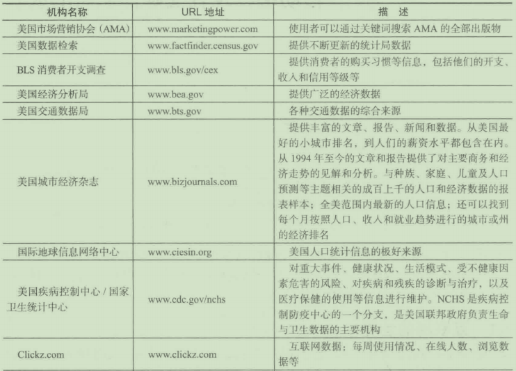
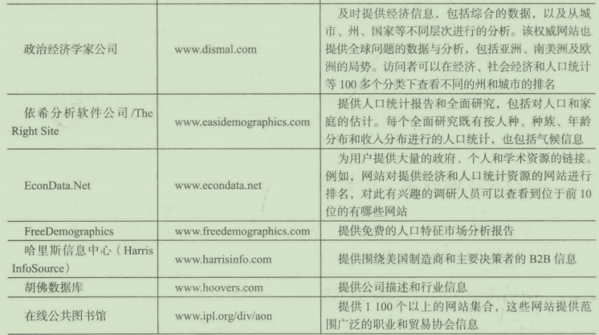
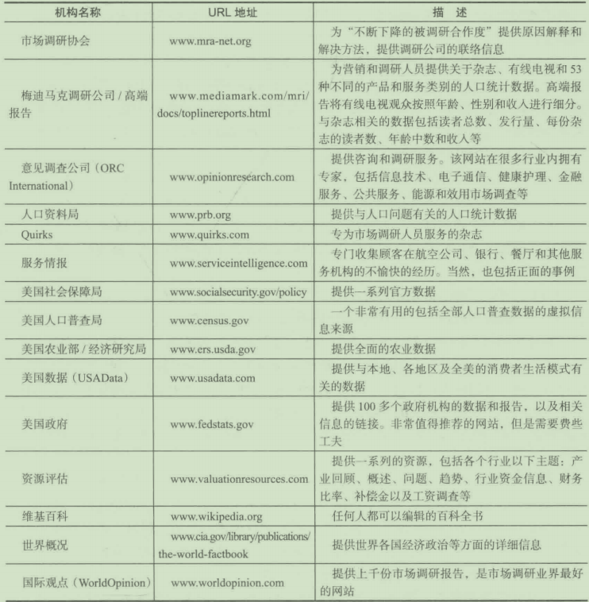
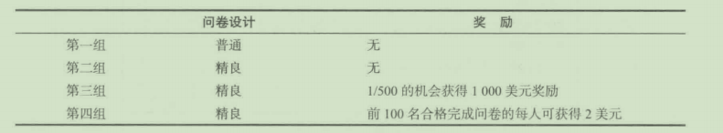
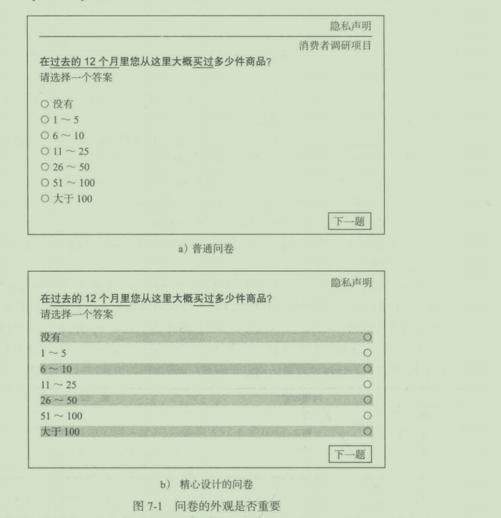

# 第 7 章 互联网的应用： 移动端以及社交媒体调研的成长

## 学习目标

1. 了解应用于市场调研的互联网世界
2. 学习使用互联网收集二手资料
3. 领会在线焦点访谈、在线个人深度访谈和市场调研在线社区的本质
4. 领会在线问卷调研并掌握实施方法
5. 理解在线小组管理在维持数据质量方面的重要性
6. 评价智能设备越来越多地用于调研的趋势和社交媒体调研的重要性

笫7章名探讨互联网在二手资料收负、定性调研及间卷调研巾发挥的日益重要的作用，以及电了设备和社交媒体对定性调研和调杏研究的促进。在线观察研究作为另一种研究模式正在迕勃发展石，第8盎将对此进行介绍，

## 7.1 互联网的世界

此刻叫你阅读这段文字时，个球网络入门巳达到 30 亿 。 是的，大约 1 / 5 的人是互联
网用户 。 在美国和加拿大 80 % 的人口足网民 ， 包括所有种族群体，各个社会经济阶层和
个同教育水平的入 。 全球范围内 ， 超过 1 / 3 的人口可以接触到互联网 。 美国拥有着全球最
高的厅联网普及率 ， 紧接若是大洋洲／澳入利业 ( 68 %) 、欧洲 ( 61 %)、拉丁美洲／加勒比
悔岸 ( 40 %) 、中东 ( 36 %) 、亚洲 ( 26 %) 和非洲 ( 1 4 %)
绝大多数美国市场调研公司都在互联网上开展某种在线调研栝动 ， 共受欢迎程度还在
继续架升 。 H 前在线间卷调研已经取代丁计算机辅助电话访间 (CATI ) 成为最受欢迎的
数据收梊方式 。 网络数据收集也被认为最具增长潜力 。

## 7.2 利用互联网收集二手资料

我们曾在第 4 章提到 二 手资料在早期市场调研阶段发挥若重要作用 ， 它能将问题变得
沽晰，或者可能提出一种方法切入问题 如果足够幸运的话，它甚至可以提供解决问题的
方法 ， 从而为你省下原创性研究的时间和费用

### 7.2 .1 市场调研人员感兴趣的网站

表 7 - 1 详细列示了一些网站 ， 调研人员可以从中获取包括竞争悄报在内的二手信息 。

你会发现那里有针对各种不同主题的资料，信息丰宫多杆尽管许多信息都可以免费获取，但仍有一些信息必须是付费的，比如克拉瑞塔斯国际提供的信息点击http://wwwclaritas.com/MyBestSegments/Default.jsp#,获取你所在地区的入门统计信息与消费者心态，进入网站之后选择“邮政编码查询＂，然后输入你所在地区的邮政编码。

表 7-1 为市场调研提供二手资料的网站

有一些非常优秀的期刊、报纸和文库适合调研人员收集信息。我们的网站[http://www.wileycom/college/McDaniel](http://www.wileycom/college/McDaniel) 上有这方面的介绍。这些资源有的可以直接通过互联网访间，有的则需要通过读者所在地区的图书馆网站访间。

### 7.2.2 新闻组

新闻组 ( newsgroups ) 是在互联网上与其他专业人士和某个兴趣小组进行沟通的一个
主要渠逍。新闻组的功能和电子公告牌差不多 ， 是针对某个话题或兴趣组建的，话题涉及
各个面｀从公司、运动、产品、服务、投资、品牌到动物 。 用户将信息发给新闻服务器，
服务器再将它们发送给其他参与者 。 这样，其他的用户就能够获取信息，阅读公告 。 新闻
组可以是有权限的，由管理员决定哪些东西将发出来供用户讨论；也有无权限的新闻组，
所有的东西都可以发布 。 用户必须订阅该小组才能参与到其中，订阅通常足免费的 。 几乎
所有的新闻组都可以在 Use net 新闻组服务器上找到，该服务器是来自全世界的新闻服务
器的集合 。

目前新闻组的数量超过 2 0 万个 ． 而这 一 数字每天还在增加 。 几乎针对每种爱好 、 职
业和生活方式都有各自的新闻组 。 不论是网景浏览器、微软 IE 浏览器还是其他 一 些浏览
器都提供新闻组阅读器 。 如果你还没有新闻组阅读器，你可以通过任何 一 个搜索引擎去搜
索到免费软件或共享软件 。 这些新闻组阅读器的功能和屯子邮件 差 不多 。 要寻找某个特定
的新闻组 ， 可以遵循以下步骤 ：

( I ) 像往常一样连接互联网 。

( 2 ) 打开新闻阅读器程序 。

(3) 搜索感兴趣的话题 。 大多数新闻阅读器可以通过关键字或题目来搜索新闻组 C 大
多数新闻组都会有一些简单介绍 ， 所以有的新闻阅读器（如微软的 IE) 还支持对新闻组的
简介展开搜索 。

( 4 ) 选择感兴趣的某个新闻组 。

( 5 ) 开始浏览信息 。 每条消息的题目一般会概括它的主题 。

新闻组的信息看上去和电子邮件差不多 。 包括题目、发布人以及信息的主体 。 但是 ，
与屯子邮件不同的是 ， 新闻组的信息是把相关的一系列的讨论链接在 一 起，也就是说，将
信息本身和对它的回复链接起来 。 对于某个话题 ， 访间者可以从最原始的信息开始，通过
链接，访间随后的与之和关的所有回复 ， 无论讨论是在几个人之间进行的，你都可以对他
们的观点了如指掌 。 新闻组也支持上传图片、声音和视频文件，供所有人下载和查阅 。

### 7.2.3 傅客

传统意义上的博客或网络日志是指个人在网上不定期地发布自己的想法或 一 些网页链
接 ，如 今 ， 一些公司也借助博客与顾客或其他商业伙伴进行交流 。 最近 ， 市场调研人员已
经使用博客来监测品牌、追踪趋势、描述顾客和识别未被满足的需求 。 在很多正式的调研
项目中，博客已经成为一种重要的探索性调研工具 。

公司也借助博客与顾客或其他商业伙伴进行交流 。 随着自动发布系统的出现，如
最著名的 bloggeratblogger.com, 博客的使用得到普及 。 市场调研人员发现博客是 一 种
重要的信息来源 ， 任何想象得到的话题都可以在博客中找到 。 调研人员也通过博客来征
集问卷调查的参与者 。 尽管大多数搜索引睾都支持博客搜索，但是有 一 些搜索引擎，如
blogsearchengine.com, 是专门进行博客搜索的 。

博客也能作为深度访谈的一种形式 。 在一 项女性包的研究中，来自千罗马、伊斯坦布
尔、上海和旧金山等全球 17 个城市的 150 名女性被招募，谈论她们包里的东西，她们和
自己包的关系 ，以及她们 的包在生活中扮演的不同的角色 。 所有的参与者都是“包袋狂热
分子”，但是之前她们中没有人写过博客 。

调研人员为这些女性发送了涉及三个部分的话题，并给予两天的时间回答每个部分 。
这种安排的合理性在千给了女性足够的时间去思考每个系列的问题，让她们可以比在传统
的深度访谈中同答得深入和详细 。 很重要的 一 点，这种方式也给了她们机会 ， 用照片直接
展示她们的包和包里的东西 。

这些博客打开了一个丰富的和富有洞察力的世界 。 最吸引调研人员的是博客“自白阴
特征．女性在展示她们包里东西时的愉悦和快乐，某一个特定物品背后的故事 ， 她们和自
己的包之间丰富的，常常是复杂的关系。以下是一些例子 。

( l ) 对自己的第一个包记忆深刻 。 “我最早的一个非常惊艳的、非常蜇要的钱包是我
的红色皮革贝奇约翰逊 ( Betsy Johnson ) 钱包，我男朋友将它作为 19 岁生门礼物送给我 。
它使我想到了我祖母的路易威登 (Lo uis Vuitton) 的钱包 。 作为一个小女孩 ， 我当然不知
道路易是什么，但是我知逍在某种程度上它们很蜇要 。 原谅我说话直接 ， 我认为它们有些
丑 。 我知过它们重要是因为每到下雨天，我的祖母就会非常讲究地把它 们 藏到雨伞或外套
下面，然后以我从来没见过的最疯狂的速度冲向一辆车 。 ”

(2)关于我和我的包之间的关系 。 惯七我从来没有真正地想过我们之间的关系 。 我
想你可能会说那个巴黎世家的包是＇我的坏女人 ＇， 她（对，她是 一 个女孩）经常对我装
｀不 幸 或麻烦' 。 ”

”这个包是最了解我的东酉 。 我们曾一起无数次地陷入困境，并且成功地脱离 ！ 如果
另 一 个包间起，这个包有很多很多关于我的美好事情可以说 。 它会把我们描述成一个团
队，并且告诉其他的钱包我教会它多少并炫耀过它多少次 。 ”

“我想我会认为这个包是我的保护者，毫无疑问，是一个男性 。 我感觉到它在我胳膊
下给予的支撑，无论是什么场合，和它一起参加日常的活动让我充满自信 。 那个绣花的包
和奶油色的罗缎小包就像是我的女朋友，在晚上和我一起出去，让我显得迷人和少女 。 ”

## 7.3 在线定性调研

在线定性调研的最主要形式是焦点小组访谈 。 传统的焦点小组访谈 ， 顾名思义，是指
同时安排 8 ~ 10 个参与者在线，由主持人将问题发给他们进行评论 。 这种电子公告牌式
的在线焦点小组访谈有一些缺点 。 由千主持人是输入一个问题，焦点小组访谈的参与者 也
是输入他们的回答，那么所有的非语言交流便缺失了 。 音调语气上的变化和肢体语言都是
完整理解 一 个人表达意思的关键 。 另外， 一 些受访者的打字速度可能会比其他人更快 ， 这
就造成了座谈进程不是最理想的状态 。 正如一位主持人所写，“很多次，我已经进行第二
部分的中间环节了，一些人还在回答第一部分的问题 。 ”

不像传统的定性调研小组，在给出自己的答案之前，在线参与者不会等待其他人回
答，每个人（回合）同时进行 。 在这样的情况下，主持人的工作难度加大，需要阅读大址
的答案，并对每个参与者给出有意义的引导 。 这实际上限制了继续探索的能力，因 此也削
弱了定性调研的 一 个关键特征 。

### 7.3.1 在线焦点小组访谈
电子公告牌式的焦点小组访谈的很多缺点，是因为网络摄像机以及网络摄像焦点小组
访谈软件的普及应用减少了 。 网络摄像机将参与者与主持人联系起来 。 为了降低对带宽的

136 当代市场 调 研
要求 ， 使视频会议更加流畅 ， 音频数据常常通过电话线来传输 。 这种基于视频的在线焦点
小组访谈结合了传统定性调研的优点 。 以下是在线焦点小组访谈的优点 ：

- 主持人能够看到和听见参与者，这意味参与者的回答有着非常丰 富 的内涵 ， 对这些
  内涵的探索未受到影响 。
- 参与者能从这个同家（如果调研需要，也可以是世界）的任何 一 个地方登录 ， 因此
  减少了主持 人 或委托商去特定市场的需要 。
- 内置的 协 作工具能够使主持人使用多种不同形式的激励（想法、广告 、 故事板等） 。
  
  网络摄像焦点小组与传统的线下焦点小组访谈小组和比，需要更多的筛选 。 额外的条
  件有 ： 评估招募者对于参加网络摄像焦点小组访谈的适应等级（要求特别适 应 ） ； 参 与 者使
  用 的 电脑是否能接入宽带（要求有宽带） ； 个人对使用电脑与网络的适 应 程度 ； 参加者是否
  有 网 络摄像头 。 一些调研公司会给符合要求但难以找到网络摄像头的受访者邮寄一个 。
  
###   7.3.2 远程监控技术在远程焦点访谈中的应用

  为了简化虚拟商业会议 ， 思科公司发明了远程监控技术 c 思科和塔塔通信在全球的
  30 个城市建立了公共远程监控室，形成一个网络 。 每个远程监控点都有 三 个 高 清视频屏
  幕 ， 呈半圆形（目的是创造一种另 一 边就是房间的视角） ； 反射性灯光增加 3D 效果 ； 全双
  工音频 ； 定向的声音激活视频与音频 ； 笔记本屏幕即时共享 ； 与多个地点进行同时会议 。

  ”和 传统 的视频 流 相 比 ， 最大的不同在于这里没有远程观看技术 ， 这是远程参与技术 。
  你 可以在另一个城市主持 ， 这不是从网页到你桌面的视频流 。 现在 ， 每个入都坐在那里 ，
  就像是在一个房间，坐在同一个桌子旁一样进行对话 。 " Mindwave 负责调研的 C E O 乔纳
  森 · 希兰德 ( Jonathan Hilland ) 这样写道

  参与者到达自己所在城市的远程监控 室。 主持人通常是和其他的参与者 一 起待在远程
  监 控室 中 。每 个地方 的参与者都坐在一个半圆形的桌 f 旁，面对 三 块电视屏幕 。 屏幕展示
  了 另 外一 个城 市或几 个 城市布翌完全相同的监控室的现场监控 ， 屏幕看上去就像是整个房
  间。每块屏幕上最多可以看见两个人 ， 一次总共可以看见六个人 。 在每个电视屏幕上都是
  摄像头 ， 瞄准对应的半圆形桌子前坐着的两个人 。 每两个人前有 一 个话筒 ， 音频被设定成
  定向的 ， 所以正在讲话的人的声音只会从该受访者对应的屏幕后传出来 。 尽管参与者可能
  在全球 的 六个城市 ， 但每个人都有 一 种和其他人在同一张桌子上的虚拟感 。

###   7.3 .3 使用 M2 频道实施在线焦点访谈

  M 2 频道不仅为市场调研提供友好的虚拟访谈空间 ， 帮助招毋访谈成员 ， 还提供所需
  的技术支待使在线定性调研得以高效、有效地进行 。 通过 M2 频逍，协调人和委托人能够
  对每位参与者进行观察并倾听 他 们的发言 。 其网站 www. cbannelM2.com 上有相关的演示 。

  M 2 的招募 过 程综合了电子邮件招募（通过一个拥有世界各国的 1 500 多万在线消费
  者 的 平台 ） 和 电 话核实、 确 认的方法 。 具 体地 说 ， 首先通 过 电子 邮 件发送邀请 ， 指引参与
  人 完 成 在线资格调查，确 保 其符合筛选的标准 ； 随后再通过电话给予确认 。 在访谈开始前 ，
  参与者要在摄像头前展示带有照片的证件以证明其身份 ， 比如在摄像头前出示驾驶证 。

M 2 频过的焦点小组访谈是这样进行的 。 首先，参与者要登录到一个网页上 ， 形成一
个小组 。 在这个小组里他们可以看到彼此 ， 也可以听到对方讲话 。 小组成员是通过传统方
式招募的 ， 每个小组成员会收到一个摄像头，这样语 言 的和非语言的信息就都能被记录下
来了 。 网络摄像头的安装很简单 ， 访谈前一两天 M2 的技术支持会帮忙安装 。

小组成员还将收到 一 些通过邮件发送的指示 ， 包括登录 M2 频道访谈空间 的 链接 ， 以
及一个免费的电话号码 。 点击链接，参与者就能登录并进入 M2 频道 的 访谈空间 ， 可 以 看
到其他参与者的实时影像、文 字 谈话、共享的屏幕或幻灯片以及书写板等 ， 一应俱全 。

焦 点 小组访谈时，如同现场讨论一样 ， 问题和回答均以实时的方式出现 。 参与者能随
时发表意见 ， 语言的或文字的都可以 ， 而协调人也可以像传统模式中一样对讨论的方向给
出指引。

最近， M2 频逍巳经引入了实时声音分析 。 这个程序能够更加详细 地 了解受访者 的：
情感思维模式（兴奋、紧张、 害 怕、尴尬）、认知过程（拒绝、疑惑、不础定）、诚实度（真
相、谎 言 、冲突） 。 当这些信号出现时 ， 主持人可以更加深入地探索 ， 以阐述当前的情况。
声音分析可以用在以后的焦点小组访谈分析中 ， 以移除那些被软件确定 为 不诚实的参与者
意见 。

### 7.3.4 通过互联网寻找焦点小组访谈参与者

互联网被证明是寻找符合特定要求参与者的 一 种非常有价值的工具 。 调研入员只需要
在诸如 Craigslist ( 一 个每月吸引 600 万访客浏览分类广告 的 美国网站）这样的在线公告 板
上发布信息 。 “ 当你在试图寻找很难找到的小众用户群体时” ， 这样的网站最能发挥作用 ，
一位在切尔斯市场咨询公司 ( Ches kin ) 工作的人类学家蒂姆 · 普洛曼这样说道 。

美国加利福利亚州雷德伍德市的 Point Forward 市场调研公司的副总迈克尔 · 巴 瑞
( Michael Barry) 说 ， 曾经使用 Craigslist 来寻找满足具 体 类别的 人， 比 如 在美国和墨 西 哥
之间频繁往返的人 。

另外一个市场调研公司发布的Craigslist广告，愿意让调研人员参观它们的酒柜，带他们去买酒或者制作一个它们正在计划的社会活动的视频文件的纽约居民提供350~900
美元的报酬。

以下是一些筛选间题 ； “你什么时候会外出喝酒或者去商店买酒？会有人常常就该买
什么洒寻求你的意见吗？如果是，多久发生一次？”

### 7.3.5 在线深度访谈

除了深度访谈的时间更长并且 一 次只有 一 个人之外，在线深度访谈的实施几乎 和网 络
摄像焦点小组访谈一样 。 因为要求密集的输入并且没有非语言反馈 ， 电子公告牌深度访谈
并不高效 。 在网络摄像调研之前， 一 些市场调研人员深度访谈里的电话采访和互联网结合
起来表达激励 ， 这种方法仍然不能得到非语 言 线索 。 无论是线上还是线下进行的深度访谈
都 比 大多数焦点小组访谈提供了更丰富 也 更深入的观察 。 在线深度访谈 也 许是接 触到 诸 如
物理学家、忙碌的高管这类人的唯 一 方式 。

### 7.3.6 市场调研在线论坛
一 个 市场调研在线 论坛 ( ma r keting research online community , MROC) 由粘心挑选
的愿意参加网络对话的 一 组消费者构成 。 信息的价伯来自对调研人员从一个 M ROC 中所
获取的更丰富更复杂信息的理解 。 所有的论坛交流都在 一 个自定义的网页上进行，只有通
过邀请才能成为会员 。 在社区的有效期内一通常是 6 个月到一年或者更长，社区的会员
要定期的回答公司发布的问题 。 这些通常是采取主观”对话”形式的讨论，随若社区会员
相互间的讨论而逐渐丰窝 。

这种网络社区的普及最初来自千以下关键利益 ：

- 创造了一个使消费者感到最轻松的空间 ， 使委托人可以史深入地和他们交流 ）
- 拥有“激励者”和惊喜发现，带来顾客导向的创新 。
- 提供了实时结果，能够让委托商探索到一般情况下所没有的想法 。
- 创造了一种自然对话下让消费者谈论对他们而言重要话题的形式 。
  另外 ， 网络社区为公司创造了 一 个顾客中心组织，员工只盂要很舒服地坐在自己的桌
  子旁就可以直接与顾客交流 。
  因为这种网络社区在速度、灵活性以及全天候接触顾客方面的优势，它们使企业很迅
  速地做出调研决策并节约支出 。
  在网络社区环境中增加一个调研中心，论坛将有以下作用 ：
- 刻画消费者心智 ；
- 头脑风暴出新的想法 ；
- 合作创造和测试新产品；
- 观察自然状态下消费者行为；
- 让公司聚焦以消费者为中心视角 。
  当获取的信息能够迅速地从网络社区传送到传统市场调研机构时，这种形式甚至可以
  提供更大的价值 。 这种和更多的上流调研方法之间的紧密交流，确保了网络社区既能获取
  新的调研提供信息，又能从传统的调研项目中得到补充 J
  这种类型的相互交流提供了 一 种新的调研膜式，将网络社区和传统调研结合起来 这
  种新的模式拥有以下潜在优点：
- 在迅速找到探索新观点的合适方法上提高了调研的效率
- 通过网络社区使用临时调研中剩下的未回答的问题节约成本 。
- 改善了在组织内部间共享消费者想法的途径 ，
  不像在线问卷调研 ， 参与者在调研论坛中和调研人员、市场人员在内的每个人交谈 。
  消费者用他们自己的语言交换想法，并提出和回答调研人员有时没有想到的问题 。 换句话
  说，这种社会交流是很重要的，它帮助人们形成 一 个整体的理解 。 然而，这种整体的理解
  只能通过 创造不同程 度的参与来达到 。 第一种形式的参与是自然参与 ， 消费者需要认识投
  资的品牌 ， 熟悉该话题 ； 第二种形式的参与是方法参与，调研人员需要用 一 种有趣且富有
  挑战性的方式提出问题，来增加参与者，提高输入质队 。 使用游戏化的方法（计分、和其
  他人比赛、制定游戏规则）能够增加调研问题的趣味 娱乐性的视频片段或者让名人来提
问，也可以提 高 受访者参与度 。
  
很多调研人员关注 MROC 中的绝对入数，尽管这很重要 ， 但更有价值的是每个讨论
帖中的交流人数，该数据只能从正在参与的消费者人数中得到 。 更大 一 点的网络社区（超
过 100 个成员）对主持人吸引参与度的要求更高 。 潜水 (lurking) (论坛成员留在论坛中但
是很少参与讨论）一在论坛成员过多或者帖子数记过多的时候发生的概率会增加 。 这是
一 个矛盾吗？并不是 。 当参与者看到太多的信息时 ，他们 不再发 言 ，因为他们确信他们的
意 见巳经被表达了，他们再补充对整个讨论来说意义不大 。

总部在荷 兰 和纽约的咨询公司 lnSites Consulting 的调研人员，在以下“市场调研实践”
中谈论了在 MROC 中给参与者更加活跃的角色 。

让参与者变成调研人员

在 MROC 中，我们是调研人员，他们是参与者 。 如果推倒我们和他们之间的这道墙，
让参与者变成调研人员会发生什么？我们现在正研究的案例表明，论坛的参与者不仅能够
完美地胜任合作调研人员这一角色，这也是减小文化、代际、知识差距的一种途径 。 通过
将参与者放在合作者的位置上，我们能够从多种角度分析调研问题 。

在没有正式引入“合作调研人员”这样一个角色之前，我们已经看到一些参与者开始
表现出主持人的素质，比如提问或者发现一些问题 。 在我们最近建立的 15 个论坛中 ， 这
种主持 人 行为在其中 12 个的“无限定话题房间”（论坛成员可以发起自己的讨论，谈论任
何他们想要谈论的话题的一个地方）都可以看见 。 当成员开始新的话题 ， 提出有关调研的
品牌或主题的问题，发起新的讨论并最终对该调研论坛的目标做出贡献时，这种主持人行
为最显著 。 这些问题对于调研来说是新颖的，并且委托商和调研人员都没有问过 。 例如，
在最近的一个关于咖啡的论坛里 ， 一个成员开始了对我们喝咖 啡的 原因的讨论 ：

我们已经讨论喝咖啡好儿周了，现在我认为不仅仅是因为它好喝，给人安慰、提神
等，对我而言，它能使心灵平静 。 我曾经在一个农场工作，每天上午大约 10 点，每个人
都会到厨房休息一下，我们坐在一起喝咖啡 。 我们一起聊天，一起结束喝咖 啡， 然后每个
人都回去工作 。 只有在喝咖啡时才能坐下来休息一刻 ！ 所以，咖啡是关千休息和放松 。 你
同意吗？你喝咖啡的理由是什么呢？

这种自然的主持人行为已经显示，让授权的参与者成为调研团队的一部分并作为实际
合作调研人员是有潜力的 。 将合作调研人员引入论坛有很多种方法 ， 我们已经认可的有两
种类型的合作调研人员 ： 一种是任务型，另一种是官方任命型 。

任务型

联合主持人的任务是在 MROC 的特别房间（如社会角）里担任另一个主持人 。 调研方
鼓励联合主持人发起讨论 、 主持、总结并向主持人报告 。 在“和我一起外出吃饭”这个我
们为坎贝尔公司 ( Campbell's) 运行的论坛里，有 23% 的参与者坦率地表示他们对成为联
合主持人很感兴趣 。 最终，被选中的联合主持人非常认真地履行他的职责并在专门的房间
中完全开始了一个新的话题 。 根据讨论的定性编码，我们得出结论，该任务型的联合主持
人的努力使讨论和一般的主持人（没有联合主持人）情况下相比，交流多了两倍 。

多 重 视角

主持的下一步，当受访者参与分析阶段（也称为人群演绎）时，同样可以为调研增加
价值 。 人群演绎背后的基本原理在于数据分析中的偏差是和调研人员的视角有关的，为了
得到所有可能的解释和隐藏在数据中的内容，我们需要加入多重视角 。

最近我们和法国航空以及龙记集团（世界四大模架制造商之一）合作建立了一个论坛
来探求中转旅客的新需求 。 经过一段中转旅客讲述自己旅程的观察期后，我们邀请论坛成
员来解释其他人的发言 。

通过之前的研究，我们知道对该话题了解最多的顾客是最适合解释调研结果的人 。

人群演绎在一个游戏中完成 。 在第一轮中，参与者需要对他们同龄人的输入做出解
释 ； 在第二轮中，最开始的发言者可以评估分析 。 每做出一个正确的分析，一个成员可以
获得分数 。 在分析中表现最好的顾客（得分最高）赢得游戏并获得特别奖励 。 和调研人员
小组得到的结果相比较，我们得出结论：有合作调研人员参与的情况下多得到高达 21%
的新观点 。

问题：

1. 让一个 MROC 的成员担任市场调研人员的角色是一个好主意吗？为什么是或为什
   么不是？
2. MROC 是在线焦点小组访谈的替代形式吗？为什么是或为什么不是？
3. 所有的公司都应该使用 MROC 吗？如果不是，哪种类型的公司不该使用？

## 7.4 在线问卷调研

互联网彻底改变了我 们 进行问卷调研的方式 。 如前文提到的，大多数美国调研公司现
在都在网络上进行调研 。 在美国最关键的人口地区，网民的数量直追人口数量 。 此外，全
球互联网人口数量 也 在持续上升 。 随着世界范围内互联网用户的增多， 一 个国家居民的性
格特点和互联网用户的性格特点正趋千同化 。 在线调研显著增长的原因很简单，其优点远
远多千缺点 。

### 7.4.1 在线间卷的优势

如今，大多数公司都面临着产品寿命缩短、竞争激烈、外部环境变化快等问题 。 经营
决策者面对复杂 的 问题必须快速做出决定 。 在线调研能够及时地提供信息，帮助他们做出
决策 。 在线间卷的好处具体包括以下几点 ：

- 快速实施，实时报告 。在线问卷能同时散发给成千上万的潜在参与者 。 参与者完成
  后，问卷被 收 回，经过统计将结果制成表格发给企业委托人审阅 。 因此 ， 决策者可
  以在很短的 时 间内获得在线间卷的结果 ， 比使用传统问卷时快很多 。
- 节省费用 。电子间卷的使用不仅比传统的电话间卷节约了 25 % ~ 40 % 的费用，而
  且只需用一半的时间就可以获得间卷结果 。 对千任何一种传统市场调研方式，数据
  收集的费用占了全部预舞的大部分 。 电话间卷是劳动密集型活动，会产生培训费、
通信费和管理费用 。 在线问卷几乎避免了这方面的所有花费 。 使用传统问卷方法
时，访谈的数量与花费是成正比的，而电子问卷的费用却不会随着问卷的数量增长
而成倍增长 。

- 支持个性化 。在线问卷能够根据每个参与者的具体情况进行高度个性化 ， 这样有助
  千参与者更快地完成问卷 。 参与者更希望问卷的问题与自己相关 ， 并且可以根据自
  己的需要暂停或继续进行间卷 ， 能够回顾之前回答的间题并做和应修改 。
- 回答率高 。日程繁忙的参与者对普通邮件或电话间卷越来越难以忍受 。 电了问卷 比
  电话访谈花费的时间更少 ， 参与者可以选择在自己方便的时间（如下班后）完成 。
  电子问卷更具趣味性 ， 更吸引人 。 图解的表达方法、互动功能、与奖励性网站的链
  接 ， 实时的总结报告，使电子间卷更吸引人 。 其结果是 ： 更高的间卷回答率 。
- 能让日程繁忙的人参与其中 。有些人特别难访问到（医生、高收入的专家 、 全球
  2 000 强公司的首席财务官） ， 但这些人会经常上网 。 网络间卷为 他 们提供了便 利，
  可以随时随地地访问 ， 这使得那些日程繁忙的专业人士很容易参与其中 。
- 简化的、增强的小组管理 。网络小组是与互联网连接的电子数据库 ， 为调研公司及
  其客户给出意见或建议 。 它们可大可小，可能是集团的或者私有的 ， 可能包括客
  户、潜在客户、合作伙伴或员工 。 网络小组的创建和维护比传统小组耗费更少的 时
  间和金钱。 一 旦小组成立、问卷定稿 ， 就可以展开问卷调查，收集数据，几天 内 就
  能够生成高水平的调研报告 。
  一个复杂的数据库会记录下小组成员的概况及对问卷的回答情况，有助千对
  他们在不同时间和不同项目中的态度和行为进行纵向研究和数据挖掘 。 因为小组成，所有问卷的回答率很高，通常有 20 % ~ 60% , 比 起传统问卷，网络小组的成员提供的意见更详尽，更加深思熟虑 。 一方面因为 他们 不用再填写自己的基本资料和生活方式（已经被掌握了） ； 另一方面，经过一段 时 间，他们对焦点小组访谈已经很投入了 。

- 外部网络小组简化了调研公司的工作 。 巾于有了哈里斯互动、 SSI 、格林菲尔德在
  线、 e-Rewards 和决策分析家等公司负责维护大量的网络小组，使得应用这些小组
  的市场调研公司更容易获得调研数据 ， 我们将在本章后面的部分对这些小组做更详
  细的介绍 。 此外 ， 由于越来越多的公司开始提供网络小组，小组的使用费 也 有所
  下降 。

### 7.4.2 在线问卷的缺点

对在线问卷最常见的质疑是认为互联网用户并不能代表整个样本 。 前面提到过 ， 这种
顾虑在美国巳经基本消除了 。 哈里斯互动和 DSS 调研公司通过平行模式（电话和网络 ） 进
行了 300 多组间卷调查，得出的结果基本相似 。 在所有的调研中，几乎没有数据表明 两种
取样模式有明显不同。 DSS 公司得出结论，在线调研模式在估计市场份额和竞争基准目标
的应用中，在费用（比电话调研节约一半费用）、速度（比电话调研的速度快一倍）和测量
精确度方面都略胜一筹 。

观点速递公司的首席运忤官李· 史密斯对在线调研和邮件间卷进行过 一 次对比研究 。
根据他的研究，要传递相同质拊的信息，与传统邮件相比，通过网络所需的时间和费用都
只足原来的 1/8 。 其他的研究表明，在大多数互联网渗透率超过 20% 的国家，在线问卷得
出的结论与传统的屯话和纸笔间卷得出的结论是相似的 。

第二个问题是关了网络上的 无限制网络样本 (unres tricted Internet sample) 。只要 自己
愿意，任何人都可以参与间卷调杳，这完全是一个自我选择的过程，并且结果可能对其他
不使用网络的人不具代表性 。 如果 一 个人反复参加同 一 个调研情况就更糟了 。 例如，《信
息世界》 ( JnforWorld ) 这个针对计算机用户的杂忐，在它的第一次网络问卷中对“读者的
选择“进行调研 。 巾千应答者重复地为一个产品投票使结果出现很大的偏差，以至于问卷
被当众宣布无效，编辑不得不要求读者今后避免发生类似情况 。 为了防范这种问题的发
生，所有负责任的机构都会在进行网上间卷调查时提供给参与者 一 个唯一的密码，这个密
码只能允许参与者参加 一 次间卷调查 。

第 三 个问题是互联网上可能并没有所需的样本框架 。 假设俄亥俄州代顿市 一 个非常受
欢迎的意大利餐厅圭多餐厅 (Gui do 's), 想知道它们在食物质晟和服务上与大型连锁餐厅
如橄榄花园衵比，在顾客心目中做得怎么样 。 就要选择生活在俄亥俄州代顿市并且常去惠
顾圭多餐厅的人作为样本 对千格林菲尔德这样的大型在线调研公司可能不容易找到足够
的人选 。 如果圭多餐厅不能提供顾客的电子邮件地址，且联网样本并不可行 。

其他间题包括缺少对“斤放式的＂的回答进行“回访＂的流程，潜在的问卷程序错误，
以及缺少对误差范围的估计（有的潜在参与者不能按时完成间卷或者下载照片和视频） 。
很多公司和调研人员开始变得关注互联网样本的质姐 。宝 洁公司表示，一个高质扯的互联
网样本必须只包括身份和地址可以被鉴定的真实的受访者 ； 要求受访者按照它们规定的筛
选和行为标准来回答问卷；每个人只能填 一 次间卷 ； 受访者必须经过思考之后回答 。

因此，所有为宝洁做调研的公司必须满足以下要求 ：

- 使用预先决定的、可靠的、标准化的和客观的质址标准 。
  - 使用自动化处理过程来满足质措要求 。
  - 确保有潜在欺骗倾向的受访者很难满足或绕开实施的质址标准 。
  - 无论样本来源、调查技术和地理情况如何，有需要时，要对所有的项目实行一致的
    质鼠标准。
  - 寄送阐述质鼠标准应用影响的报告 。
  - 保护从受访者、供应商或委托商处收集到的所有个人信息的私密性和安全性 。

### 7.4.3 实施在线问卷调研的方法

有几个最基本的进行在线间卷调研的方法 ： 在线间卷软件、间卷设计和网页寄存网站。

I. 在线问卷软件

网络问卷软件是专门设计、投递在线问卷的软件系统 。一 个典型的做法是，问卷被
设计成具有容易修改的特性，通过一个可视界面，被自动传到网络服务器系统 。 服务器
将问卷发布出去，再将收回的间卷归档到数据库 。 用户可以在服务器上随时查询问卷完
成悄况、问卷响应的描述性统计以及数据的图形表达 。 几个著名的在线间卷软件有 SPSS
Quanquest 、 Inquisite 、 Sawtooth CiW 、 lnfopoll 和 SurveyGold 。

2. 提高问卷完成率
   自定义设计软件（如 SPSS Quanquest) 强调，如果想让参与者 完成间卷 ，就要尽 匮使
   其在答卷时感到愉快 。 参与者越投入，他们提供的观点就越有用 。 下面这些技巧可以使参
   与间卷者获得更愉快的体验 ：
   
- 不管是哪类间卷，都尽可能用口语化描述，避免过多使用“调研＂的门吻 。
- 要坦诚，提前通知间卷调查结束的时间 。
- 为参与者提供更多机会进行开放式回答，使他们能真实地表达自己的想法 。
- 确保备选答案涵盖了所有可能性，避免过度使用“其他 “ 作为选项 J
- 使间卷在 20 分钟内可以完成，参与者能够在答卷时看到自己的进度 。
- 在合适的时候尽可能使用图形，使间卷在视觉上更具吸引力 。
- 寻求新的办法促进参与者和调研人员之间的合作 。
- 使研究更具教育意义，通常参与者会为获得某个产品或主题相关的新知识和信息而
  受到激励 。
- 为参与者提供联系方式，使他们可以有机会获得关千所测试产品项目的最新进展 。
  物质奖励对于在线调研有多重要？问卷的外观对完成率是否有影响? Decipher 公司
  进行了一项在线调研来说明这些问题，它利用 e Bay 提供的一个国内客户的名单进行了一
  次问卷调杳，超过 I 900 名会员参加了这个 7 分钟的在线间卷调查 。 参与者收到电子邮件
  邀请 ， 点击邮件里的链接就可以访问电子问卷 。 调研使用了四组并行的数据 。

从上面的安排可以看出，第一组和第二组是为了比较普通问卷与设计精良的间卷之间
在效果上的差异。表格的使用以及合理排列的选项，这些都是设计精良的问卷有别千普通
问卷的标志（见图 7-1) 。

第二组和第三组，以及第二组和第四组之间的比较是为了衡量奖励对间卷的作用 。 最
后，第三组和第四组对抽奖与有保证的小额奖金这两种不同类型奖励的作用进行比较 。

问卷的外观对千完成率没有明显影响（两种情况下间卷完成率均为 77% 左右） ； 奖励
的类型对间卷完成率也没有影响。然而，两种奖励都使问卷完成率提高了大约 10% 。 在四
组测试中，中途放弃的情况都发生在参与者进入问卷 90 秒 后 。 在有奖励的情况下，这段
时间放弃间卷的现象显著减少。

3. 问卷设计和网页寄存网站
   许多网站允许调研人员在不安装设计软件的情况下进行在线间卷设计，服务器代为
   管理间卷，有的还提供制表和分析服务。热门的网页寄存网站包括 WebSurveyor 、 Survey
Monkey 、 e-Rewards 、 Zoomerang 和 Google Consumer Surveys 。 超过 200 个国家的人群已
经回答了 Survey Monkey 制作的 3 300 多万份问卷。

## 7.5 商业在线小组
许多调研公司将间卷托管在那些提供商业在 线小组 (commercial on line panels) 的网
站上，以协助完成市场调研。商业在线小组不是专门为某一个公司或某个项目设立的，相
反，商业在线小组为许多不同的公司的多个项目所使用 。这些公司需要投资一些钱用千提
前招募那些愿意参与在线市场调研的入 。有的在线小组有上千个会员，专门从事某一行业
的调研，如建筑、医疗或技术产业，而 一些大 的商业在线小组则包括数百万人，可以参加
不同主题的在线间卷调查 。 大多数在线小组要求人们在加入时填写大量含有个人信息的间
卷，包括基本资料、生活方式和心理情况，通常有上百个方面 。 这些个人资料使小组服务
商能够记录每个小组成员详细的信息。通过这些信息，在寻找调研对象时就容易找到符合
要求的人选。

尽管在线小组在节约成本和时间上非常有效，但数据的质量却决定千小组的管理水
平。影响在线小组的质量的因素包括招募方法、受访者参与度、小组管理实践和提供的奖
励类型等。

### 7.5.1 小组招募

小组招募的方法对于一个小组的质鼠至关重要。如果某项调研是针对该产品的消费者
群体进行的，为满足这一需求，招募小组成员时就要确保采取正确的方法，从该消费者群
体中招募成员 ； 同样地，如果调研项目需要商务人士，小组招募就要采用适当的方法从商
务人士的范畴挑选成员。对千某项调研，在线小组所呈现的样本最好是多样化的。小组成
员的招募方法是区别在线小组的一个关键特征，主要有两种方式 ： 开放式招募和应邀参 加 。

开放式招募是指通过广告吸引正在上网的人们。 开放式在线小组招募 ( open online
panel recruitment) 允许任何有网络资源的人“自我选择”并加入市场调研小组 。这样 做的
好处是能够利用网上冲浪并被在线广告所吸引的人快速建立起一个小组。

这种方法最大的缺点是对千被招募对象的身份无法控制。开放式招募可能会吸引上
百万拥有相似特征的网络用户，但很可能这是一些对网络广告反应灵敏，或者利用搜索引
菜寻求机会参加在线小组的人，这就使相当大一部分人被忽略了。

在许多情况下，开放式招募会导致小组拥有过于充足的人员，这些人参加许多不同的
小组，完成过量的间卷调查 ， 业内称他们为“职业间卷埴写人”一他们加入各种小组 ，
填写成干上万份问卷以获取抽奖或其他类型的奖励。对千职业问卷填写人的主要顾虑在
于： CD 他们为了快速完成问卷而不经过深思熟虑，会提供虚假或误导性信息 ； ＠他们对待
问卷持敷衍的态度，这一点在回答间卷所花费的时间上表霖无遗 ； ＠他 们 破坏了间卷 回 答
者的比例，使调研数据出现偏差或不具代表性。有的网站允许人们一次注册好几个小组，
对网络市场调研更加不利。一项研究表明， 30% 的在线问卷是由不到 1% 的人完成的。该
研究还发现，职业问卷填写人平均每 9 0 天要完成 8 0 份间卷，有时一天要完成几份。即使
如此，还是要认识到不是所有的在线问卷都是由职业问卷填写入完成的。因此 ， 在使用在
线小组时弄清楚招募的方法很重要。

另一种在线小组的招募方法是“应邀参加“。美国最大的商业在线小组服务商 Research
Now 第一个使用这种方法。 封闭式在线小组招募 (closed online panel recruitment) 或“应邀
参加“只允许提前验证过的人或具有某一特征的人参加市场调研小组。最常见的方式是对大
的、可信度高的顶尖品牌的客户发出邀请，这类品牌在任何指定的人群（如普通消费者或商
务人士）中都拥有很多不同特征的顾客。例如，为了招募消费者小组成员 ， Research Now 与
大的知名公司结盟，借助这些公司所拥有的大量、特征各异的消费者群体 ； 同样 地，为招 募
商务人士， Research Now 与主要的航空公司、酒店和汽车租赁公司建立合作关系。因为常
出差的商务人士也属千一般消费者，这就使招募中会出现重径的现象 ，但 是 Research Now
会对小组成员的登记保持紧密的关注，以避免这种重复。

“应邀参加＂的方法使小组调研人员可以招募到符合某种人口特征的人，可以作为委
托人所调研人群的代表性样本，或者满足委托人的某种具体需求。例如，为了确保充足的
小组成员，小组服务商可能要从高级零售商的顾客中招募。要招募青少年时，就要瞄准主
营青少年服装市场的零售商，要招募经营决策者，要从服务于商人的公司着手，如航空公
司、酒店、汽车租赁公司和商业出版物的订阅者。

“应邀参加＂的方法赋予了小组服务商更大的控制权，使他们能够清楚受邀加入小组
的人的身份，大大减少了职业间卷填写人参与的可能性。应用这种方法需要特别注意的一
点是小组的组成取决于接收到邀请的入 ，这 一组成可能因为某一作为招募来源的客户而
有所倾向性。因此，“应邀参加＂的小组需要与不同领域的许多公司合作，从而获得大卅
多样化的招募来源，确保小组具有均衡的代表性。

### 7.5.2 小组成员的参与

提高小组成员的参与度可以使问卷回答率低，造成的偏差最小化，这对于调研的成功
是至关重要的。因此，懂得如何管理小组和使用激励手段是很重要的。在线间卷的响应率
有时变化很大，有的群体回答率仅 5%, 而有的则可达到近 30%, 有时在提前筛查过的群
体中回答率甚至超过 60%, 这部分参与者会提前预知将在某一特定时间或日期接受间卷调
查。随着电话访谈的回答率逐渐降低，促进了在线小组的应用。

参与度的高低受几个因素的影响，包括小组成员对调研过程产生的兴趣，他们参加间
卷调查和焦点小组访谈的总体经验，以及调研的题目等。当然，其中一个主要的驱动因素
是激励机制。

一般来说 ，在线小组使用两种激励模式：抽取奖励式和全部奖励式 。抽取奖励式为间
卷参与者提供参加抽奖的机会，通常是几百或几千美元，得奖的概率非常低；全部奖励式
对完成间卷的参与者均给予小额的奖励，作为对他们所付出时间的报酬。

选择合适的激励模式是非常芷要的。合理的激励模式不仅影响间卷回答率，对小组成
员的维持率也产生影响一通过小组成员的基本资料，可以在需要时快速锁定某一类型的
参与者，因此保持小组成员的稳定很重要。当小组成员觉得自己付出的时间和努力没有得
到应有的回报时，就不那么愿意参加问卷调查了。

### 7.5.3 小组管理

除了有效的小组招募和小组成员的参与，在线小组服务商必须有效地持续管理他们的
小组 ， 确保高水平的质鼠，要保证小组成员每次参与问卷调查的经历都是积极的。良好的
小组管理包括频率控制，即控制小组成员参加问卷的次数不要过多或过少。小组成员应该
获得足够的机会参与问卷调查，使他们能够有效地融入调研过程，但也要避免给他们过多
间卷而造成负担 。其 他因素还包括保证参与者的隐私、保护个人信息、防止试图利用在线
间卷作为销售渠道的假冒间卷调查("假市场真推销”一以市场调研做掩饰的销售） 。

小组服务商要持续的招募新成员以满足持续增长的在线样本需求，或者当有成员退出
时能够及时补充 。即使是小组维持率很高的情况下， 也会出现 一些成员对待间卷积极度降
低的情形 C 此外，通过招募新成员还有助于培养稀缺的细分群体，以及使小组成员结构达
到平衡．最大限度地代表所有群体 。 持续地吸收积极投入的小组成员是每个小组服务商恒
久不变的目标 。

最后，小组管理还包括确保小组信息的更新 已 随着小组成员的变化，他们的 信息 资料
也要随之更新 。 例如，上 一 年的 一个 25 岁的单身大学毕业生 ｀ 今年已经是 一 个 26 岁的会
计师了，她可能已经结婚并有了一个孩子，其收入也从上一年的个人年收入 1 2 000 美元，
变成如今的家庭收入 45 000 美元 。 更新的个人资料确保小组服务商能够持续地锁定符合
间卷调查要求的人选

## 7.6 移动网络调研：下一阶段

截 至 2013 年，在这个星球上智能手机、手机加上平板电脑的数拟已经超过了全世界
的人口总狱 。 2 01 2 年，仅智能手机的流址就增长了 81% ; 现在， 56% 的美国成年入拥有
智能手机、并且 57% 的成年入用他们的手机上网（在收入超过 75 0 0 0 美元的家庭中这个
数字上升到 79%) 。 34% 的成年入拥有 一 台平板电脑 。

人们将自己的 生 活装进了他们的移动设备中．用它们来照相和储存照片、阅 读 新闻和
朋友同事保持联络，并使用各种能让生活变得更方便和更有趣的应用 。 这种移动设备上的
体验远比传统的电脑体验更加私人和亲密 。 在随时随地使用这一方面，移动设备有着不可
比拟的优势，但这也意味若对人们注意力的无限 F- 扰 。

### 7.6.1 移动端调研的优点

现在，有 1 /4 的受访者倾向千用自己的移动设备参与调查，这个数字还将继续增长 。
唯一的问题在千，增加的速度到底有多快？在传统的调研下，研究者要求消费者回忆他们
的经历和感受 。 但是，智能手机不仅能让研究者通过地理定位、地理围栏技术或移动分析
观察受访者所在的地点，还能够在移动调研中询问他们的实时反馈，地理闱栏即在 一 个地
点周围建 立 一个虚拟的边界 。

当一 个使用智能手机的人跨越了 一 个地理闱栏时，就会引发 一 个特定位性的调查 。 例
如， 一 个顾客可能要离开梅西百货，就会被要求回答关千购物体验的 一 些问题 。一 些其他
的问题可能关注每个产品的位 四 、店内促销效率以及顾客购 买意 图 。
除了定位消费者以外，移动网络调研还有以下优点：

- 提高回答率 。 和 一 般方法相比，顾客在移动设备上回答率更高 IL 速度更快 。
- 增强便利性 。 当受访者可以在自己方便的时间和地点完成调杳时，他们将拥有更好
  的体验 。
- 扩大受访面 移动设备可以接触到发展中国家以及偏远地区的受访者，这给获取这
  些地区的消费者心理提供了巨大的机遇 。
- 韦宫调研内容 。 通过移动设备，受访者可以便捷地分享媒体资料（如照片、视频、
  录音等） C
- 扩大受访人群 。 各个人群的受访者配合度都更高 。
- 即时反馈 。 对千市场活动、测试等方面的调研间题，移动网络调研可以提供即时反馈 C
- 节约成本。调研人员收到回复的速度更快，间卷完成时间更短。
- 其他选择。使用移动网络招苏工具吸引受访者参与网络间卷调查或联系平时难以接
  触的人群 。这是接触活跃人群的另一种方法。

### 7.6.2 开始阶段的一些问题
第一个“吃镑蟹的人“总是紧张的 ， 一些调 研公司在进入移动网络调研时并没有 一个
考虑周详的计划。仅仅将一个为 f MAC 电脑或者笔记本设计的问卷转换成短信息 ( SMS )
的形式，对企业来说就是 一个火难。通过在键盘上打字回答一个复杂的、需要 40 分钟的、
慢节奏的问卷会导致高未完成率。所以，当移动设备调研还是一个新鲜韦物的时候，通过
短信形式来实施调查巳经足够可 h 飞行业关注的焦点巳经转移到了通过 WAP 协议或者为
特定的运行系统（如苹果手机或安中设备）设计的调研应用来实施调研。

无论是基千 WAP 协议（或者说基于网页）还是基 F 移动应用的间卷调查，都有它们
的优点和挑战。 WAP 调查允许交叉平台的文本编辑和多媒体调研（它们可以在多种操作系
统的移动设备上运行），设备通用性达到 70% 以上。缺点在千移动设备的速度依赖于无线
网络的连接情况 ， 变动常常很大 基千 App 的调研是针对特定设备的（意味着苹果手机 上
的应用无法在安卓手机上使用 ． 因此对千交叉平台调研来说，多种版本的调研应用是必不
可少的），但是 ， 通常拥有更快的传输速度，这些最终会在调研过程中提高受访者的满意
度。另外，调查应用能被嵌入已经存在的应用中，这就给予了调研人员机会一在其他应
用 中加 入调查的功能。

调查问卷必须在一个实际的电脑上下载的日子巳经一去不复返了。现在 ， 平板设各已
经能够轻松地进行调查并且立即通过无线网络将数据传输到网上的分析工具中，调研人员
甚至使用平板笔记本二合一设备将定性调研升级为混合定址／定性技术。例如 ， 受访者会
被给予 一 个小定性调研来测试个人偏好，之后调研结果能被 立 即通过实时网络分析工具总
结出来。接着，就会实行关 f 偏好的焦点小组访谈 ， 将最初的定员调研数据用千定性小组
访谈 巾 。

### 7.6.3 设计一个移动调查间卷

间卷设计者在设计问卷和寸找用户时都必须要积极主动 ， 以给一个移动设备受访者完
美的调研体验。第一，也足最玉要的一点，移动间卷必须要短小。 10 个问题或更少一些最
好 J 这是因为用户界面和数据传输速度的限制使得问卷传到移动设备上需要更长的时间。
第二 ， 一个好的移动调杳问卷必须将页数降到最少。每一次翻页时 ｀ 受访者都必须等待。
一面上不能放太多问题是很重要的一点 ， 因为移动设备的运行内存不足 ， 一面上有太多内
容会导致设备变慢或者没有响应。第三 ， 问题的类型要简单。单维度的无线电、复选框或
选择题要比多维度的网格问题更好，因为后者对千移动设备窄小的屏幕来说很难完成 r 尽
扯不使用开放式问题，因为它需要受访者打字。第四 ， 所有的无关内容都应该降到最少。
屏幕上出现的任何东西都需要额外的加载时间和虚拟内存 ， 甚至一个进度条都增加了加载
时间且需要垂直滚动 。

这种移动调研的及时性、地理定位技术以及地理围栏技术，使得一些新的调研激励成
为可能 。 很多公司会提供实时奖励，比如你正要去的店铺的电子优惠券 。

Toluna, 一个互联网移动调研公司阐述了移动网络调研的优点 。 一个 To luna 的委托
商想要在“超级碗”比赛期间就比赛间播放的广告实施一个问卷调查 。 该委托商想要看到
实时的反应，但是大多数看“超级碗＂的观众那时候并不是坐在电脑前面 。 但是，他们却
在一心多用，使用自己的手机（在至少一周一次的看电视时间里， 63% 的 18 ~ 24 岁美国
智能手机拥有者发短信、使用 A pp 、收发邮件、上网，或者在社交网络平台上参与讨论） 。
只有移动调研才能收集到委托商寻求的实时数据 。 受访者会在比赛开始前招募，然后在比
赛期间问卷就会发放下去，在广告播送时询问他们的实时意见 。

## 7.7 社交媒体市场调研

社交媒体，如脸谱网、推特、 Pinterest 、领英给了调研人员从未有过的机会来了解它
们的顾客和潜在顾客 。 公司可以问自己：“谁是我们的｀粉丝＇？关于我们的品牌他们能
教会我们什么？“要回答这些问题首先要和消费者建立对话并成立关于公司或品牌的消费
者组织 。

很多社交媒体市场调研和传统的问卷调查是有巨大的区别的 。 不是 一 个产品经理来
决定 XYZ, 然后让调研人员去实施一个调研并提供反馈，社交媒体调研是更具交互性的，
是通过 一 些问题和长时间的观察来实现的 。 通过分析一个产品或服务在社交媒体上的改
变，调研人员能够获悉影响顾客价值判断的因素，以及他们对产品、服务或品牌的评价 。
很多社交媒体调研都是依靠各种方式的观察法，这我们将在第 8 章详细介绍 。

胡椒博士 (Dr. Pepper, 七喜公司生产的一种焦糖碳酸饮料）花了数年的时间在脸谱网
上建 立 了 一 个 850 万“粉丝”的基地 。 现在，只要仔细地追踪和测试这些脸谱网用户对这
种软饮料的评价，就能帮助品牌寻找到有价值的市场信息 。 该品牌每天在它的“粉丝 ” 主
页上发布两条信息，然后观察｀｀粉丝”的反应 。 通过使用脸谱网提供的工具，胡椒博士能
够知道发送的消息被浏览了多少次，被分享了多少次以及“粉丝“回复了什么 。

“我们收集这些数据来研究顾客的喜好，顾客喜欢什么以及不喜欢什么 。 “胡椒博士
Snapple 小组的交互媒体服务主管罗伯特· 斯通这样说道 。

例如，该公司了解到胡椒博士的忠实“粉丝“喜欢犀利的俏皮话。最好的一条信息就
是：“如果喜欢你是错误的，那么我不愿意正确 。 ”并且他们不喜欢关千价格和特别优惠的
信息 。 “那和消费者对品牌的热爱是无关的 。 ”斯通说道。

### 7.7.1 实施脸谱网焦点小组访谈

牛肉协会 (NCBA) 想要了解“千禧一代”（年龄在 13 ~ 30 岁的一代人）的牛肉
消费习惯，因此 一 组同时满足年龄特征和消费心态特征的受访者被招募了 。 该研究特定的
筛选要求包括 ： 每月最少吃两次牛肉 ； 有制定食谱的习惯或者准备开始制定食谱 ； 经常使
用脸谱网（至少一周两次）并且至少拥有 2 5 个好友；能够回答关于现在或未来生活计划的
一系列问题；典型性别、年龄和物质水平组合的一部分 。

参与者和其他的在线焦点小组访谈或深度访谈 一 样被招募 。 在通过筛选并同慈参与该
研究之后，参与者会被邀请访问 一 个研究者为该小组建立的脸谱网页面，成为它的好友，
然后回到调研并回答一些问题以确认他们真的访问了该页面 。 加好友的要求是为了确保他
们熟悉脸谱网的操作 。

使用脸谱网作为平台的缺点之 一 ，在千这样开放性的社交网络网站带来的安全感的缺
失 。 为了补救这点 ， 一且小组被完全录用，研究者会将该页面的隐私级别调到最高（只能
邀请进入）。

受访者需要在 6 周的时间里连续参与该讨论 。 研究者知道这样长时间的调研会导致参
与者的不良情绪，所以他们在过程中采取措施使这种不良情绪降到最低 ：

- 每周发布两三个新话题 。 这减少了参与者每天要去该小组的次数并避免了太频繁的
  信息使他们感到厌烦 。
- 该讨论的主持人本身是“千禧 一 代” 。 所以他理解主持的原则，并且知道怎么用 一
  种有趣的方式激励小组成员 。
- 主持人回应参与者的观点 。 主持人会针对受访者的回答给出自己的评论，根据他们
  的回答尝试提出新的想法 。 因此，讨论会建 立 在受访者之前所说的基础上，这些
  “千禧一代“将明白他们的意见在被倾听 。
  
  在 6 周的讨论 过 程中，会一直有随机抽奖环节 。 除了参与讨论所获得的酬金，参与者
  常常会 收 到礼物卡 ， 感谢他提供了最好的想法 ， 分享自己的经验，或者仅仅是在今天参加
  的 人中 随机 选取 。
  
  该研究的目标是有 60 名“千禧一代“完全参与该讨论 。 考虑到时间跨度和研究进行的
  时间（从 11 月中旬开始直到圣诞节那周），可以预料到会有一些中途退出者 。 总共有 227 名
  “千禧一代”符合要求并且同意参与该小组 。 在这 2 2 7 人中，有 119 人 ( 5 2%) 加该小组为
  好友 ； 在这 119 人中 ， 有 66 人 ( 55 %) 活跃参加 。 总共有 2 7 个话题发布 ， 收到了来自参与
  者 的 1 545 个回答 ， 这相当于每个话题有 57 个回答，每个参与者大约回答 2 2 次 。
  
  美国牛肉协会在如何改善包装、分销、店内促销和社交媒体市场营销方面获得了有
  价值 的 信息 。 该访谈小组在参与者和主持人之间创造了能够进行丰富多彩且活跃对话的
  条件。

### 7.7.2 进行一项问卷调查

对于想要实 施 询间调研的研究者来说，社交媒体可以用作受访者招募的工具。通过给
“喜欢＂某产品或服务的顾客，或者在线论坛的成员发送邮件，提供可以参与在线调研的
内部网站 。

有很多 App 应用可以实施社交媒体调研。 Survey Monkey' s app 使调研人员能够在脸
谱 网 上进行调研 ， 调 研人 员可以直接使用 Survey Monkey 的模板，也可以从其题库中选择
来制作 一 个问卷 。 Survey Monkey 的 建议是让调查简短 ，提 供奖励 ， 并 使 它有趣 ，也 就是
用 一 种友 好 的 方式 ， 最好能有一些定制化的内容。

脸谱网 也在 http: // apps. facebook.com/opinionpolls 网站上提供实施调研的工具 。 例如，想
要在 一 个小组内询问一个或几个问题，你可以点击该小组最上方的 ASK QUESTION 按钮 ，
然后进入一个问题，需要的话可以加入投票选项，最后点击 POST 按钮分享给小组成员 。

TwitPolls 使推特用户可以向他们的关注者询问问题，并收到用户回答时间的计算结果 。
该 App 能够让品牌或企业在不需要让他们的“粉丝“离开推特的情况下收到实时反馈 。

所有的社交媒体都有调查研究 A pp , 研究者必须决定哪种社交媒体拥有对该调查感兴
趣的人群，以及哪种 A pp 提供了最能表达需求的工具 。

## 本章小结

全球超过 30 亿的人口是网络用户，在美国和加拿大这个数字达到 80% 。 美国 9 0 % 以
上的调研公司通过互联网进行调研 。

二手资料在市场调研过程中起着至关重要的作用 。 它能澄清一个问题，提出某个研究
方法，有时候甚至可以提出解决方案 。 表 7- 1 提供了一个二手资料的清单 。 互联网在许多
方面都颠覆了二手资料的汇集过程 。 如今，使用者可以自己从互联网上获取成千上万条信
息，而无须再等着政府机构或其他渠道给予回复 。 对于许多研究人员来说，奔波于图书馆
已经成为历史，搜索引擎和目录涵盖了遍及全球的无数资料 。 网络上的兴趣焦点小组访谈
和博客也是二手资料的宝贵来源 。

越来越多的焦点小组访谈被搬到互联网上 。 传统的在线焦点小组访谈是采取电子公告
牌的形式，主持人输入问题，然后受访者输入回答 。 这导致了所有非语言交流的缺失，人
们的打字能力不同也带来了问题 。 网络摄像焦点小组访谈使用声音连接，相关软件也创造
了一个更像线下访谈的环境 。 受访者同样可以来自全球各个不同的城市 。 远程监控技术创
造了一个虚拟的传统焦点小组访谈环境．使所有的参与者感觉身处同一个房间 。

M2 频道提供了进行小组讨论的虚拟空间，小组成员可以通过网络视频参加，模拟了
传统小组讨论的方式，提问和回答都是实时的 。 非共时焦点小组访谈会将讨论持续一段时
间，其形式类似在线聊天群 。 在线调研论坛是指一组消费者同意与某个公司进行持续的
交流 。 讨论可能持续一年或者更长的时间，参与者对那些定期发布在社区里的问题给出回
答 。 来自社区的观点可以作为传统市场调研的基础 。 最近 ， M2 频道引入了实时声音分析
技术，该技术的引进可以详细分析受访者的情感状态、认知过程和诚实度 。

一些公司在网上试着进行个人深度访谈 。 除了一次只与一个人访谈以外，在线深度访
谈与在线摄像座谈的实施方式一样 。

市场调研在线论坛 (M ROC ) 越来越流行 。 只通过邀请参与的 MROC, 持续时间可能
从几天到一个长期的过程 。 正如巳经在本章中讲到的， MROC 具有很多的优点，能够为调
研人员提供对于概念、品牌、策略和消费者行为更丰富、更复杂的理解。

网络调研实施速度快，能够实时地获取报告，极大地降低了费用，实现了个性化设
置 。 网络调研的回答率高，能采集到不易接触群体的数据，其小组管理更加简化、强大，
为调研公司带来更多利润 。 缺点是网络用户可能不具备代表性，对开放式的回复缺乏回访
流程，误差问题，以及网上可能不存在所需的样本框等问题 。

本章对如何提高在线调查问卷的回答率给出了一些建议 。 一项研究发现，问卷的外观不
影响完成率，但是物质奖励的确能提高问卷回答率 。设 计问卷时，在提前设定的选项前要应
用单选按钮 。 对于应答者熟悉的范畴，如居住地等问题，适合应用下拉式菜单 。 文字表述的
问题要给出清晰、简洁的说明，要尽量减少使用文字表述问题，否则会使放弃率很高 。

商业在线小组同时为几个不同的公司的不同项目服务 。 尽管在线小组节约了费用和时
间，但要具备良好的小组管理以确保数据的质量 。 小组成员的招募可以通过开放的渠道或
者“受邀参加＂ 。 出千对质量的考虑，推荐使用发送邀请的方式 。 良好的小组管理要防范
职业问卷填写人。一般来说，网络小组采取“全部奖励”或抽奖方式来嬴得参与者的配合
全部奖励方式更有效些 。

几乎超过一半的美国人拥有智能手机，超过 1/3 的人拥有平板电脑，因此越来越多的
市场调研在这些移动设备上进行 。 移动网络调研提供实时反馈，例如，一个购物者正在逛
街，地理定位软件检测到该顾客的确切位置，问卷将自动发送 。 本章详细阐述了移动网络
调研的优点 。 调研人员迅速地发现，和基千 WAP 协议或 A pp 应用的问卷调查相比， SMS
调查并不好用，但是前两种方法依然有自己的缺点 。 移动网络问卷必须简短，将页数控制
到最少，询问的问题要简单并且将无关内容降到最少 。

社交媒体调研给了调研人员从未有过的机会了解消费者 。公 司可以建立一个关于该公
司或者品牌的论坛然后就该品牌开展长期对话 。 与传统的调研方式相比，调研人员和论坛
成员之间有了更多的互动性交流，对于品牌的评价和评价者也有了更多的观察 。 焦点小组
访谈、深度访谈和问卷调查都可以在社交媒体上进行 。

## 复习思考题

I. 你是否认为最终所有的市场调研就都会在移动设备上完成？为什么会或为什么不会？

2. 请你解释博客、 MROC 和市场调研之间的关系 。

3. 探讨在线焦点小组访谈的优缺点 。
   
4. 你认为卡特彼勒这样的公司可以从在线论坛调研中获益吗？福特和美国航空呢？
   
   5 探讨在线问卷调查的普及性。为什么这种方式这么流行？
   
6. 描述一些招募在线小组的方法 。
   
   7 如 何才能在商业在线小组中避免职业问卷填写者？
   
   8 对于 商业在线小组的质量来说，小组管理是个关键因素吗？
   
   9 一 个好的移动网络调研的关键有哪些？
   
  10. 什么是地理围栏技术？怎样将它用千调查中？
      
      11 请 你解释传统市场调研和社交媒体调研之间的区别 。
      
      12 怎样使用脸谱网进行一次焦点小组访谈？

## 调研实例 7-1

宝沽利用在线论坛为新产品线确定香型

当宝洁在为其新的产品线开发香型时，它询问了其在线论坛成员的意见，让他们简单
地记下他们最近儿天遇见的让他们感到愉快的香味 。 在一周的最后，他们收集到视频或简
单的文字，描述了刚修剪过的青草的味道、刚刚完成的画作的味道、橡皮泥的味道，或者
是能够引发消费者冒险 、 竞争、舒适和其他情感的味道 。

这次关于香型的调查说明了移动网络调研如何发现人们对特定感觉的看法的过程 。 但
是，宝洁同样采取了一个大胆的举措来进一步了解其顾客－她是谁，她去哪里，她看到
了什么 。 通过使用一个移动 App , 论坛成员被要求分享他们的美好瞬间 － 他们这周在家
里或在外面遇见的美好的产品或品牌，自己的感觉体验 。 结果可以让调研人员深刻地理解
到消费者是如何在一天的不同时间、不同的情境下有着不同的感受，又是什么促使消费者
使用现有的产品或尝试一个新的产品 。

美好是一个非常主观性的属性，感觉到美好更是一种非常戏剧化的状态 。 所以，宝洁
招募论坛成员来帮助它挖掘得更深入，不仅仅是通过更私人的分享，还一对一地通过这些
移动 A pp 分享来达到集体合作 。 毕竟，当新的工具和应用产生时 ， 人们可以做出更加精
确的回答，但还需要人们有意愿去回答 。 这也是为什么通过一种方式与顾客建立亲密、信
任和良好的关系如此重要，就像是在线论坛或是一系列的小组会议，你都可以应用到移动
调研项目中 。 反之亦然 。

在这个例子中，宝洁试图找到人们看待它的异同 。 所以，论坛成员仅仅是使用他们的
手机拍下那一刻的自己（在家或者在工作），然后加上自己的评论上传 。 其他的论坛成员可
以匿名评论该图片 。

”这是下班之后的我 。 我仍然穿着工作装，很累，但是感觉很好，“一位勇敢的自愿参
与者在她上传的照片下这样写道，“我再一次看到了我的微笑，我也看出了我的脸需要补
妆，我的双眼很疲惫 。 ”

但是其他的女性看到这张照片怎么说呢？有一些人仅仅是一瞥，眼光就十分锐利 。
“她看起来有很多粉刺 。 ”一位不留情面的成员这样评论 。 “她的鼻环和她很不搭 。 ”另一位
成员评论 。 “明亮而快乐的双眼 ！” 一位赞美者观察到 。 “十分美好的微笑，牙齿很白 。 ” 另
一位评论 。 总体来说，＂批评“比自己的评价要更温和 。

了解到年轻女性对自己要比别人更严厉很惊讶吗？也许不是 。 在这个事件中学到的更
深层次的一课在千合作中的潜在积极性一科技之间（移动设备和网络）、消费者之间以及
消费者和品牌之间 。

问题：
1. 你认为宝洁对该调研问题使用了正确的调研方法吗？可以使用深度访谈吗？
2. 一个公司要怎样为它的在线论坛或是社交媒体论坛招募合适的受访者？
3. 调研人员说可以从在线论坛中得到更丰富的理解，这句话真实的意图是什么？
4. 像雅诗兰黛这样的公司如何使用这一信息？它们也应该建立一个在线论坛吗？它们
   已经这样做了吗？

