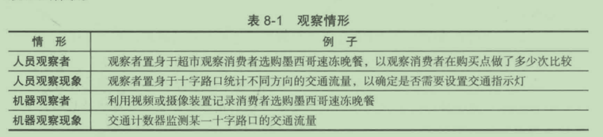
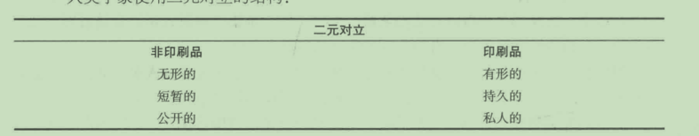
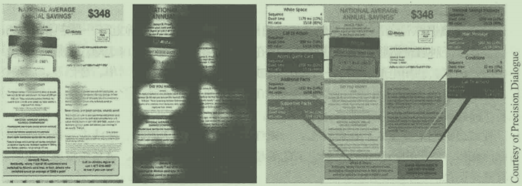
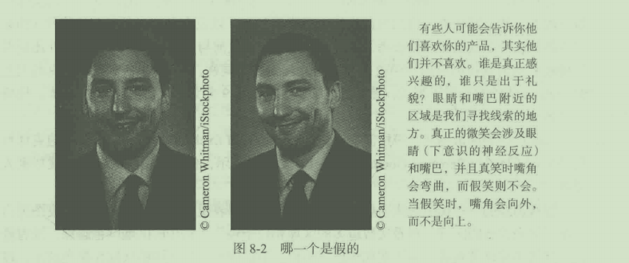

# 第 8 章 原始资料收集：观察法

## 学习目标

1. 对观察调研法有一个初步的认识
2. 学习观察调研的方法
3. 了解机器观察法的类型
4. 认识在线跟踪正在发生什么变化以及它在社交媒体上的应用
5. 了解虚拟购物环境是如何在市场调研中构建和 应用的

什么是观察调研法？它如何应用千市场调研？什么是人种志？它为什么这么流行？观
察法巳经在互联网和社交媒体引起轰动，为什么？为什么在线观察调研如此有争议？什么样
的机器能被使用在观察调研中，它们能提供什么样的数据？在第 8 章我们将探讨这些间题 。

## 8.1 观察调研法的本质

与在调查中向入们提问不同，观察调研法主要是观察人们的行为 。 具体来讲， 观察调
研法 (observation research) 可以被定义为 ： 不通过提间或交流而系统地记录事件发展状
况或行为模式的过程（神秘购物除外）。市场调研人员应当运用观察技巧来收集整理来源
千以往事件记录的证据，或者在事件发生时见证并记录这些事件。观察法既包括观察人又
包括观察现象 ，既 可由人员来进行，也可由机器来进行 。 有关这些不同观察情形的例子如
表 8-1 所 示。

### 8.1.1 使用观察法的条件

要想成功地使用作为市场调研数据收集工具的观察法必须满足 三 个条件：

(1) 所需信息必须是能观察到的或者是从可观察到的行为中推断出来的 。 例如，一个
调研人员想知道为什么个人消费者更愿意购买一辆丰田红杉 (Toyota Sequoia) 而不是一辆
福特远征 (Ford Expedition), 在这种情境下观察法并不能为此提供答案。

(2) 观察对象的行为必须是重复的、频繁的或者在某种程度上是可预测的，否则观察
法的成本将非常高。

(3) 观察对象的行为必须是相对短期的。观察购买一幢新房子的整个决策过程可能需
要花费几个星期甚至几个月的时间，在这种情况下观察法是不可行的。

### 8.1.2 观察调研法的种类

可供调研人员选择的观察方法有许多种，调研人员需要从成本和数据质量的角度 为某
一特定调研间题选择一种最有效的方法。观察法可以从四个方面进行分类 ： O 自然的观察
与经过设计的观察；＠公开观察与掩饰观察；＠人员观察与机器观察；＠直接观察与间接
观察 。

1. 自然的观察与经过设计的观察
   
   一个有关完全自然状态观察的很好例子是统计在一定时间内有多少 人进入梅西百货 。
   观察者在所观察的行为中没有扮演任何角色，那些被观察者也没有意识到他们正在被观
   察 。 在另一种极端情况下，我们可以招募一些人在一个模拟超市（在市场调研区设几排货
   架），以便仔细地观察他们的行为。在这种情况下，必须至少让被招募者知道他们是在参
   加一项调研。给参与者每人一辆购物车，并让他们随意浏览货架，挑选出平时他们常用的
   商品。调研人员对于所要研究的几种产品可以更换不同的购物展示地点。为了测试不同展
   示的效果，观察者需要记录下消费者在被测试商品前停留的时间以及此种商品实际被选购
   的次数。现今，许多公司（如菲多利和宝洁）都使用在线模拟环境。
   
   在经过设计的环境下进行观察，调研人员能够更好地控制对人们行为产生影响或者
   能够解释人们行为的无关变量。此外，模拟环境能加快数据收集过程。调研人员无须等待
   事件自然发生，而是指导参与者实施特定的行为。由千在相同的时间内可以进行更多的观
   察，因此能够收集到较多的样本数据，或者加快目标样本数据收集过程。后者能有效地降
   低调研活动成本。
   
   经过设计的观察的主要缺点是环境是人为的，因此观察到的行为可能和自然状态下发
   生的行为有所偏差。设计的环境越自然，被观察者的行为就越可能接近自然状态。
   
2. 公开观察与掩饰观察
   
   被观察者知道他们正在被观察吗？众所周知，观察者的出现可能会影响被观察的现
   象 。 有两种一般性的机制会导致数据产生偏差：首先，如果人们知道他们正在被观察，正
   如在公开观察 (open observation) 中的那样，他们的行为可能会有所不同；其次，类似于
   在调研中访问人员的出现，调研人员的出现和行为会潜在地造成偏差。
   
   掩饰观察 (disguised observation) 是在不为被观察者所知的情况下监测入们行为的过
   程 。 掩饰观察的最普遍形式是在单向镜后观察人们的行为 。 例如，在焦点小组访谈过程
   中，产品经理可以从单向镜后观察人们对不同包装设计的反应 。
   
3. 人员观察与机器观察
   
 在某些情况下，用机器代替人员进行观察是可行的甚至是所期望的一当机器能更便宜、更准确、更容易地完成工作时。交通流量统计装置比人员观察者更准确、更便宜同时也更愿意从事这项工作。例如，对尼尔森公司来说，安排人员到居民家中记录他们的收视习惯是不可行的。摄像和视听设备能更客观地记录行为，同时比人员观察者记录得更为详细。最后，大多数零售商店使用的电子扫描仪能够比人员观察者更为准确、及时地提供有关产品流通的数据。

4. 直接观察与问接观察

 市场调研中所进行的大部分观察都是直接观察目前的行为或史前古器物。例如，俄勒冈州波特兰、得克萨斯州布兰诺市100位女性的手包中物品是一项观察研究的一部分。几乎每个参与者(99%)都有和金融相关的东西，比如信用卡或借记卡、支票海和钱包。受过高等教育的高收入已婚女性携带银行卡数量最多；98%的女性携带奖励卡和会员卡；93%的手包里发现了本子、笔之类的办公用品，发现的其他东西，按从多到少顺序依次为美容美发护理、护肤品、优惠券、眼镜、照片、垃圾、护甲产品、女性护理产品、纸巾、免水洗手液、纸巾、牙签、口腔护理产品、宗教产品、武器、纪念品和相机；只有8%的女性携带照相机。
   
 然而，在有些情况下，也需要观察过去的行为。为了做到这一点，市场调研人员需要求助千以往的行为记录。考古学家挖掘出土古代人们定居点的遗址，并试图根据他们发现的实物证据来确定早期社会的生活本质。垃圾研究人员(garbologist)通过对人们的生活垃圾进行分类来研究家庭消费模式。与此相比，市场调研通常要平凡得多。在一个产品原型测试中，知道消费者实际使用了多少被测试产品对我们来说很重要。找出答案的最准确的方法莫过千让参与者交出尚未使用的产品，这样，市场调研人员就可以知道多少产品被使用了。假如一项调研的是家庭使用洗衣粉和去污剂的情况，那么知道每个参与调查的家庭实际使用产品的数量很重要。因此，可以从使用情况角度推断所有问题的答案。
   
   有时候也可以利用图片推断人们在特定情境下的行为。例如，为了更好地了解全球消 费者，位于纽约的 GfK NOP 公司进行了一项全球性的调研，它们建立了大量可视化数据 库 。 调研的部分工作包括拍摄人们的厨房，在很多文化中，厨房都是家庭的核心 。

### 8.1.3 观察调研法的优点

观察人们实际在干什么，而不是求助于他们告诉我们他们做了什么，有一个非常有
意义且显著的优点 ： 原始资料避免了运用调查法时会产生的误差因素 。 具体来讲，市场调
研人员可以避免由千受访者回答问题的意愿和能力而产生的间题 。 而且，通过观察可以更
快、更准确地收集某些类型的数据 。 使用扫描仪记录比要求人们罗列出他们食品袋里的每
样产品要有效得多 。 类似地，比起询间孩子他们喜欢何种类型的玩具．大多数玩具制造厂
商更愿意邀请目标儿童群体到一个很大的玩具室，并通过单向镜观察孩子们选择了哪些玩
具，以及每一种玩具吸引孩子的程度 。

### 8.1.4 观察调研法的缺点

观察调研法的主要缺点是通常只有行为以及物理特征才能被观察到 。 市场调研人员不
能了解人们的动机、态度、目的和感受 。 同时，只有公开的行为才能被观察到，一些私下
的行为（例如，上班前的穿衣打扮或者公司委员会的决策制定）超出了观察调研法的调查
范围 。 第 二 个问题是，现在观察到的行为可能不能代表未来的行为 。 在衡量了几个可供选
择的品牌后，消费者购买了某一特定品牌的牛奶，但这并不代表这位消费者在将来也会购
买相同品牌的牛奶 。

如果被观察的行为发生的频率较低，那么观察调研会很耗 时 且成本很高。例如 ，如 果
一 个观察者在超市中等待观察人们选购 La v a 香皂的购买行为，那么他可能等上很长时间 。
假如被选为观察对象的消费者是根据一定的限制条件选择的（例如，下午 5 点之后去杂货
店购物的顾客），那么就有可能得到有误差的数据 。

## 8.2 人员观察

正如表 8-1 所示 ， 可以雇用入员来观察其 他人 或特定 现 象 。 例 如， 作 为神秘 购 物者的
人员、在单向镜后面的观察者或记录消费者购物路线与行为模式的记录员 。 调研 人 员 也可
以对零售和批发进行审查，这些都是观察调 研 法的几种类型 。

### 8.2.1 人种志调研

将人种志调研运用千市场营销源自于人类学领域 。 在商业市场调 研中 ，这种技术的流
行程度正在与日俱增 。 人种志调研 ( e t hnographic research ) 或在自然状态下的 人 类行为研
究包括观察行为和物理环境 。 人种志专家直接观察他们正在研究的人群 。 作为“参与其中
的观察者”，人种志专家能利用 他 们与被研究者的密切关系来获得对文 化和 行为更为丰富
与深入的理解 。 简而 言 之，就是理解人们行为的驱动因素是什么。每年花在 人 种志调研上
的费用超过 4. 5 亿美元 。 现在，一些企业（如宝洁和微软）拥有它们自己内部的 人 种志专
家 。宝 洁在墨西哥城的低收入阶层中进行了人 种 志调研 ， 该调 研 带来了“一漂净 ”， 一 种
纤维柔软产品，当地的洗衣机没有该功能 。 人种志调研的花费为 5 000 ~ 800 000 美元，
它取决于公司想在多大程度上研究消费者的生活 。

第 一 次以非正式的方式运用 人 种志调研可以追溯到 20 世纪 30 年代的 西 班牙内 战 。 在
不作战的时候 ， 福莱斯特 · 马耳斯 ( Forre s t Mars ) 观察到士兵们将糖涂抹到巧克力上 。 这
种观察调研或人种志调研的结果是创建了马耳斯巧克力公司 ( M&M ), 它以马耳斯 ( Mars )
和合伙人布鲁斯 · 默里 ( Bruce Murrie ) 命名 。

I. 人种志调研的优点

焦点小组访谈和个人深度访谈都依赖千回忆，也就是说，调研人员让受访者回忆 他 们
自己的行为和其他人的行为 。 当然 ， 人类的记忆有时会出错 。

另外，受访者有时会以社会期望的方式做出回答 。 一个正在看成人杂志的人 也 许会声
称他正在阅读《财富 》 和《商业周刊》 。 人种志调研拥有以下优点 ：

- 人种志调研建立在事实的基础上 。 它能够准确 地 展现顾客使用产品的情况 ， 而不仅
  仅是他们自己阐述或回忆的内容 。
- 它能揭 示 未被表达的需求 。
- 它能发现未经开发的消费者利益 。
- 它能发现产品间题 。
- 它能揭示怎样、何时、为什么以及在哪里人们购买该品牌一和竞争产品相比，消
  费者如何看待该品牌 。
- 它能展现家庭中该产品的实际使用者，可能发现一个全新的潜在顾客目标 。
    - 在设计新产品或产品改进时，它能够利用消费者对该种类别产品的经验和实际创
      造力 。
    - 它能在现实情境下测试一种新产品 。
    - 它能直接通过消费者的体验揭示广告执行情况 。
    - 基千对消费者生活方式的理解，它能够帮助品牌或企业与消费者建立更好的关系 。
      
      随着时间的推移，个人能逐渐适应观察者的出现（通常很快），因此他们的行为相对无
      偏差 （如此一来）能更为准确地描述他们的行为 。
      
      尽管人种志调研人员的主要工作是观察人们的行为，积极地采访或与受访者讨论也是
      其工作内容的重要组成部分 。 通过对话了解受访者对行为的看法能为调研人员提供大量信
      息。此外，还可以在混合方式的研究中运用人种志数据，以与其他来源的数据进行比较和
      对 比 。例如，一个调研经理可能会获得销售人员与消费者以及潜在客户互动方面的观察数
      据 ， 并将它与来自千区域和地方销售经理深度访谈方面的信息进行比较，确定现行工作和
      期望之间存在的差距。
      
2. 实施人种志调研
   
   人种志调研的第一步是找到参与者，然后观察过程开始 。 一个非常熟练的人种志研究
   者一定受过良好的人类学训练。调研开始于一个系统的观察和询间 。 人种志研究者经过训
   练如何去观察人类文化：符号、代码、神话、习俗、信仰、价值观、社交规则和概念类别
   等。很多所谓的人种志家的访谈在大约 90 分钟的时间段里进行，这个时间太短不足以进
   行近距离的环境观察和提问（三四个小时的人种志观察和访谈会更有效果）。
   在一项消费者如何使用家庭打印机的研究中，一个受过良好训练的入种志研究者会这
   样提问 ：
   
- 假设人种志调研受访者从未见过打印机，在他们最基本的意识里，打印的过程和意
  义是什么？
  
- 通过探索受访者如何区分非印刷品和印刷品 ， 我们能够理解符号印刷吗？
  
- 入类学家使用二元对立的结构：

- 消费者关千印刷或非印刷的故事、神话和信仰是什么？关千不同品牌的打印机的看
  法是什么？
- 印刷仪式是如何作为一种过渡形式将消费者从一种状态转换成另一种状态？
- 打印并保存硬拷贝的人和将印刷视为传统和浪费的人在“生活环境”上不同吗？
- 有在社会情境或商业场合下要求或者拒绝印刷吗？如果有，为什么？
  
  这些问题和观察无疑会丰富新产品的开发和市场推广，利千确定产品设计、品牌定位
  和广告内容 。 和以上相对应的是，精简版的人种志调研包含有限的观察（一个小时以内）和
  一些少侃的个入深度访谈 。 这种形式的调研通常是由没有经过专业人类学或社会学 训 练 的
  调研人员实施 。 不幸的是，很多研究都以这种方式进行，它们通常得不到什么有效信息。
  
  下一个步骤就是分析和解释收集到的所有数据，以找出它们的主题和意义。这不是一
  项简单的任务 。 大量的音频和视频材料必须转化成文字以便进行再次研究。即使对于受过
  良好训练且经验丰富的人种志专家而言，偶尔过多的数据也会让人种志专家感到压力。然
  而，通过对数据进行仔细而全面的分析，主题和分类会逐渐显现，有用 的 发现 也 会变得
  清晰。人种志专家通常会建立框架，以帮助企业研究它们的消费者和理解这一切意味着
  什么 。
  
  三角测量是指将调查发现与其他人所说的内容以及已经实施过的相似研究进行比较的
  过程，它是一种核实所收集信息的准确性的方式。然而 ， 传统的人种志学停留在对群 体 研
  究的描述上，并不能满足企业的需求。企业需要可付诸实施的指导、建 议和战略 框 架 。 调
  查结果的呈现必须达到一定的要求，以使企业能够制订出创新的、成功 的 解决方 案 。
  
  剑桥音响 ( Camb r idge SoundWorks ) 的经理们面 临 着一个复杂 的 间 题： 在全国 的 零售
  经销店里，当销售代表展示公司的高保真" blow-your-hair-back" 立 体 声音响时 ， 男 人们
  都会睁大眼睛观看，但是为什么对这种产品毫不掩饰的热情没有转化为更好 的 销售呢 ？
  
  为了找出其中的原因，马萨诸塞州的立体声音响制造商和零售商 Andover 聘 请了 位 千
  马萨诸塞州西牛顿市的 Design Continuum 调研公司对其大量潜在消费者进行了为期 两 个星
  期的跟踪调查。研究者的结论是 ： 高端音响市场因所谓的“夫妻认 可因素 差 异 ”而 受到了
  影响。男人喜欢大的黑色箱型音响，而女人却讨厌它们的外观。考虑到音响在客厅中的摆
  放，女人会说服她们的丈夫不要购买一个性能优良但外观丑陋且昂贵的立体声音响。甚至
  那些购买了该产品的人们在音响摆放上也产生了分歧 ： 男人试图在客厅中展示被 他们 当 作
  战利品的音响，而女人却希望将它们藏在植物、花瓶和椅子后面。“女 人 走 进 商店 ， 看着
  音响说， ＇ 那东西真难看', " Design Continuum 公司负责 人 艾伦艾伦 · 迪 雷 斯 塔 (Ellen Di
  R esta ) 说，“这时，男人便失去了争论的耐心，就不购买音响了 。 解决方法是同时满足目
  标市场中男女双方的需求 ： 一个看起来像家具的大型音响系统，这样你就不用刻意 把 它藏
  起来了 。 ”
  
  掌握了这些知识，剑桥音响公司开发了一条新的产品线 ： 看起来像家具的牛顿
  ( N ewt o n) 系列音响以及家庭影院系统，具有一系列不同的颜 色 和光洁度 。 结果是，在公
  司 1 4 年的历史中，牛顿系列是成长最快、最畅销的产品线 。
  
  万豪国际酒店 ( Mar r iott ) 聘请 ID E O 公司为其日益重要的客户 一 在外奔忙的精 通技
  术的年轻人，重新考虑酒店体验 。 ”这完全是以全新的眼光看待商务旅行、 人 们的行为以
  及他们的需求 。 “万豪国际酒店品牌管理执行副总裁迈克尔 E. 詹尼尼 ( Michael E.Jannini )
解释道。
 
为了更好地了解万豪国际酒店的顾客 ， IDEO 派遗一个由 7 名顾间组成的小组，进行
了一次为期 6 个星期的旅行。该小组成员包括设计师、人类学家、作家和建筑师。该小组
去了 12 个城市，小组成员常去酒店大厅、咖啡厅和酒吧，让这些场所的顾客描述他们每
时每刻在做什么。

这就是他们的发现：相比小型商务旅行团体，酒店通常更捆长为大型商务旅行 团体服
务。调 研人员 注意到酒店大厅光线通常较暗，不宜进行临时的商务活动，而更适合顾客消
磨 时光 。在顾客住房外 ， 万豪国际酒店并未提供将顾客工作和娱乐很好地结合在一起的场
所。 IDEO 公司顾问兼万豪国际洒店项目经理达纳．赵 (Dana Cho) 想起自己曾看到这样
一幕 ： 一位女性商务旅行者在酒店大厅喝咖啡的同时，却要注意尽量避免把酒洒到桌面的
文件上 。“很少有酒店考虑到处理这些间题。”赵说。

研 究了 IDEO 公 司的调研结果，万豪国际酒店在 1 月宣布了彻底改造万豪酒店大厅和
万丽酒店大厅的计划 。该 计划为每个酒店大厅设计了 一个光线更 明亮且带有小桌子和无线
网络的社交区域，这一区域更适合各种会议 。个 人旅行者可以在另外一个区域开展 工作或
在 此区域提供的更 大、更安静的半私用空间里休息，在这一休息空间他们不必担心会把咖
啡洒在笔记本电脑或文件上 。

宝洁首席营销官吉姆 · 斯登格尔 ( Jim Stengel ) 强调 ： “我是一个推 崇观察的人。 “因
此，他力促宝洁的市场营销人员花大量的时间待在消费者家中，观察他们洗衣服、拖地以
及给孩子换尿布的方式，询问他们的相关习惯和遭受的相关挫折 。回顾 2000 年， 一般的
品牌营销 人 员一个月内与消费者在一起的时间少千 4 小时。斯登格尔说 ： “现在与消费者
在一起的时间至少是那时候的三倍。”

Herman M小 er 公司（一个家具及配件生产商）的高级研究人员布莱恩 · 格林在“市场
调研实践中 8-1" 描 述了他最近实施的一个全球范围内的人种志调研。

作为 一 项世界性的工作

我的人种志调研涉及四大洲，并在调研的 3 个月内与超过 10 000 人进行了交流 。 730
多小 时的田野调查， 3 000 多张图片和接近 30 个小时的参与者拍摄的长镜头录像，该调查
获得 了极其丰富的数据 。

人们互动的方式

这项国际性调研的最初目的在于聚焦人们物理上和虚拟中的工作行为 。 我们的团队想
要研究人们互动的方式以及雇用者是如何支持和促进这种行为的 。 我们了解到的信息有助
于赫曼 · 米勒 ( Herman Miller ) 的新产品开发并发掘到可以和消费者共同分享的知识 。

观察法

这是我们方法论的基础 。 我们和客户联系人一起工作，以此确定哪个部门是进行观
察 的最好地点 。 这样的情况下，无疑会有一些样本误差，但是这在预料之中 。我们在寻找
将花时间和他人互动视为工作一部分的研究参与者。观察将在一栋办公大楼的一或两层进
行，这样利于确保一个子集不会影响研究发现 。

我们通常坐在一个桌子后，就像在自己公司一样 。 从这里，我们观察员工的互动情
况 。 我们现场的观察可能会有影响员工行为的风险，但是这并没有成为此次研究的阻碍 。
员工的互动在他们中间发生，我们并不是办公室动态的组成部分 。 实际上，大多数员工没
有注意到我们 。

参与者的资料记录

我们要求员工使用一份互动日志，也就是一张印有复选框的表格 ，用 来记录互动特
征 。 我们想要采用一种简单的方法来记录每一次互动 。 它能够反映如人们参与互动的次
数、持续时间、发生地点、使用的技术或工具和隐私程度这样的事项，无论对话是发生在
虚拟空间还是现实生活中 。

一个参与者的二次抽样样本，通常在两天左右的时间里由 10 ~ 15 人组成 ， 会被要求
完成该日志 。 我们不希望这变成一个负担，所以这些参与者中的每个人在调研时间内完成
一到两天的日志 。 完成的日志数量激起了我们的好奇心 。 在大多数情况下，人们会对日志
的数量和他们一天内进行的互动次数感到惊讶 。

在线调研

该在线调研针对顾客网站上的所有员工，我们的调研收集类似于互动日志上的信息 。
员工会被要求回想他们最近的一次互动，然后他们会收到 6 种不同的场景 ， 并选择他们最
近一次互动发生的地点 。 这些场景来自于他们自己所处环境的照片或写下的描述 。 一旦他
们选定了地点类型，他们会被询问互动的特征 。 该调研是根据每个公司的日志信息及公司
环境图像为每个研究网站定制的 。

焦点小组访谈

我们在每个网站召集了 8 ~ 10 个人进行焦点小组访谈，来帮助我们更好地理解我们
所寻找的信息 。 我们探求了他们最喜欢的和最不喜欢的场所，他们谈论了他们躺下休息的
地点、完成工作的地点和进行交流的地点 ； 我们询问了参与者碰见其他人并进行随机对话
的地点 。 我们同样讨论了这些场景下使用的工具和技术 。

影像日志

日常生活的影像日志记录了员工的互动情况 。 员工被要求寻找到可能有意义的场景，
并告诉调研人员他们为什么用这种方式做这件事情 。 我们询问他们是否注意到了他们互动
时周围的环境的影呴，这些影响从参与者的视角提供了丰富的信息 。

图片

我们在每个地点拍摄大量照片来记录场所类型和该场所内发生的互动 。 之后照片会被
分类并贴上附有描述的标签 。

应用研究

在最初拜访每个地点时，我们要求公司提供楼层的地图指南，这些地图指南被用来
标记互动 。 我们每半小时在整个空间内观察一次，所以我们能够做出空间热点图，该图显
示了发生互动的地点和不发生互动的地点 。 我们捕捉这些互动的特点，例如 ， 多少人在互
动，使用了什么技术，以及使用的工作工具和参与者姿势等 。

丰富 的 结果

正如人们所预料的，这座办公楼，它的内部结构和装修在人们如何在工作环境中互动
方面起了巨大的作用 。

应用研究产生了一个最有趣的统计性发现，我们观察和标记到有 70% 的互动发生在
个人办公室周围。这很重要，这给“人们不需要正式会议室来和同事交流”这一观点更多
的支持 。

通过焦点小组访谈，我们发现人们会通过一个几乎无意识的清单来决定是否应该寻找
一个会议空间或是在他们的个人空间中 。当一个人 向一张私人办 公桌走去时，该人会考虑
以下问题：

- 这次谈话会持续多久？
- 我们还需要其他人加入讨论吗？
- 我们还需要其他的工具（如白板、图表板、投影仪和电话会议使用的电话等）来得
  到一个成功的结果吗？
- 我们讨论的话题对周围的人来说合适吗？
  当人们去会议室时，他们会避开与自己需求无关的区域，人们知道自己需要什么和不
  需要什么 。 当一次交流需要变得更加正式时，决定人们去哪里有以下基本驱动因素：
- 距离一人们通常不会绕到一个条件更好但是更远的区域 。
- 空闲 － 该地点现在是否可以用来交谈？
- 技术 － 该地点是否拥有解决手头任务所需要的技术工具？
- 亮度 一 该地点是否能受到自然光线的照射？这里是否有足够的亮度？
- 工具（如白板和布告板等）－该地点是否有能使会议更加有效率的工具？
  
  长期以来认为互动环境已经消失的观点和办公室参与者所重视的价值完全相反 。人们
  使用“提高效率”“增加谈话的清晰度”和”更好的个人联系”这些词汇，来描述办公地
  点对他们的价值 。 即使在科技发达和远程通信的时代，面对面的互动仍然受到高度重视 。
  
  问题：

1. 赫曼 · 米勒可能会怎样使用这些研究结果？
   
2. 还有其他的调研技术可以用来获取相同的信息吗？如果有，是什么？
  
3. 人种志调研与焦点小组访谈
   
   亳无疑问，人种志调研和焦点小组访谈都是定性调研的形式 。然 而，大多数调研委托
   者都认为这两种方法在整体调研过程中扮演了不同的角色 。 有时候，这两种方法也会用在
   同一个调研项目中 ：
   
- 在探索性调 研 最开始的创新阶段，人种志调研有助于战略理解 。
  
- 焦点小组访谈／个人深度访谈有助于处理策略间题一对激励的反应（广告、图像
  和概念等） ， 通常在第一阶段应用。一定程度上说，这些方法在委托者心中被重新
  定义了。

我认为焦点小组访谈获取到的东西是有限的 。 如果我有 8 个想法，我想要知道哪一
种想法更好，哪一种语言效果更好等 。当 我试图获取更深入的东西或者我不知道要如何去
问的时候，我会选择面对面 。 如果我能选择，也有时间一人种志调研是需要时间和金钱
的，毫无疑问我每次都会选择人种志调研（制药企业委托者） 。

在达成共识和淘汰意见方面，焦点小组访谈仍然有一定的地位 。 就创新而言，我认为
人种志调研确实更有优势（咨询顾问） 。

我们进行一项研究时没有同时使用人种志调研和焦点小组访谈是很少见的，它们各有
所长 。 我们要对人种志调研获取的想法和信息在焦点小组访谈中尝试验证 。 焦点小组访谈
更节省时间且效率更高（金融服务委托者） 。

### 8.2.2 神秘购物者

神秘购物者 (m ystery shoppers) 用于收集有关商店的观察数据（例如，货架是否摆放
整齐），以及顾客和员工间互动的数据 。当 然，在后一种情况下，神秘购物者和员工之间
需要进行交流。神秘购物者可能会问 ：“这个 产品多少钱？”“这种款式有蓝色的吗？”“星
期五之前能送货吗？”这种相互交流不是为了访谈，只是为了观察员工的行动和评论 。 因
此，虽然观察者经常卷入彼此间的交流，但神秘购物者仍可以看成是一种观察调研法。据
估计， 70% 的美国零售商店使用这种技术：沃尔玛、麦当劳、星巴克、 Blockbuster 、 Jiffy
Lube 、 Rite Aid 、 PF Chang's 餐厅和全食超市是一些使用神秘购物者的大客户 。

“我们尝试做的第一件事是加强公司培训 。 " ICC/ 决策服务的主管戴维·里奇 (David
Rich) 解释道 。 该公司为一些像李维斯和高迪瓦的客户提供神秘购物者调查服务。神秘购
物者为经理提供了关于他们的员工在应该微笑时是否微笑，是否让顾客觉得自在，邀请他
们时的即时反馈 。 许多公司将员工奖金与根据神秘购物者的观察得出的绩效挂钩，鼓励员
工有更出色的表现。

神秘购物概念有四种基本形式，每种形式在深度和收集的信息类型上有所不同 ：

- 形式 1 : 神秘购物者拨打神秘电话 。 在这种方法中，神秘购物者给其客户打电话，
  并根据电话内容评估所接受的服务水平，继而与其进行一番照本宣科式的谈话。
  
- 形式 2: 神秘购物者参观某个展览并快速地购买一些产品，不需要过多或者完全不
  需要顾客与员工间的相互沟通 。 例如，在形式 2 的神秘购物中，神秘购物者购买了
  一些商品（如汽油、汉堡或一张彩票），并对其交易能力和场所的形象进行评估。
  
- 形式 3: 神秘购物者造访某企业，用事先准备好的手稿或方案与服务或销售代表谈
  话。形式 3 的神秘购物通常并不包含真正的购买行为。类似的例子包括与销售代表
  讨论手提电话的不同包装，在换油期间评价一下所提供的服务等 。
  
- 形式 4: 神秘购物者进行一次需要良好的沟通技巧以及有关产品的丰富知识的访
  间。这样的例子包括讨论家庭贷款，购买新车的过程或是参观公寓群等。
  神秘购物可能包含一个或几个目标。早期提到的，其中一个共同的目标是评估员工培
  训。其他的一些目标如下：
  
- 使组织能够监测其是否遵循产品／服务标准，以及是否符合规格。
- 使营销人员能够检查通过广告／销售促进做出的承诺与实际的服务之间的差距。
- 协助监测培训产生的影响以及绩效改进计划是否遵循或者与产品／服务规范相一致。
- 识别在一天中的不同时间、地点、产品／服务类型引起的消费者的不同消费体验，
  以及其他造成产品／服务质量差异的潜在原因 。
  一家神秘购物公司在一个中档连锁餐厅获得了以下数据：
- 电话技巧／客户服务；
- 顾客体验；
- 食物质量和温度；
- 硬件设施；
- 餐厅整洁度和卫生状况；
- 停车条件；
- 着装标准；
- 能见度和与管理人员的互动情况；
- 特许代理协定的执行情况。
  
  了解餐厅的服务和环境是星期五餐厅、 橄榄园餐厅和 Ch 山 's 餐厅成功的关键 。 例如，
  一 项 4 000 名食客完成的中档连锁餐厅调研发现， 57% 的顾客表示当上菜速度在 10 分钟
  以内时，他们“一定会再来”；当上菜时间超过 15 分钟时，该比例下降到 17% 。
  
  现在，神秘购物公司使用智能手机通过网络汇报系统提供实时反馈 。 在过去，总结报
  告最少需要在购物者离开之后 l 周到 IO 天的时间里才能完成 。 科学技术的发展使委托者
  在同一时间收到总结报告成为可能 。

### 8.2.3 单向镜观察法

在第 5 章有关焦点小组访谈的讨论中曾经提到，焦点小组访谈的设施中几乎总是包括
单向镜观察 (one-way mirror observation) 。 这样，当单向镜打开时，客户可以观察到焦点
小组访谈的情况 。 例如，新产品开发经理可以在主持人展示不同类型的包装时观察消费者
的反应（为了重新设计一次性尿布，一位市场调研人员曾花费 200 个小时观察母亲们给孩
子换尿布的过程）。另外，当消费者说话时，客户能观察到他们流露出来的感情色彩 。 单
向镜有时候也被儿童心理学家和玩具设计师用来观察玩耍中的儿童 。 Fish-Price Play 实验
室每年迎接大约 3 500 名儿童。这个实验室被设计得像幼儿园的教室 。 在玻璃的另一边是
一间铺有地毯的狭窄的房间，房间里大约有 I O 张椅子，两个摄像机。在产品开发的过程
中，几乎所有的 Fisher-Price 玩具都要先拿到 Fis her-Price 实验室中进行测试 。

为了恰当地使用观察室，其光线必须比焦点小组访谈房间的光线要暗 。 否则，焦点小
组访谈的参与者就可以看到观察室内的清况。几年前，作者在圣路易斯曾指导过一个有关
整形外科的焦点小组访谈 。 一位医生早到了大约 2 0 分钟并被带进了小组房间，而一位年
轻的制药业产品经理巳经在观察室内落座 。 这位单独待在小组房间里的医生决定利用墙上
那面镶框镜子做最后几分钟的整理。他向那面镜子走去，开始梳理头发 。 与此同时，那位
坐在镜子的另一面，大约距镜子 1 英尺远的产品经理助理决定点 一 支烟 。 在医生梳理头发
的时候，突然间镜子中出现了一迫闪光和另一张脸 。 接下来发生的事情超过了本书的 研究
范围 。 近年来将单向镜告诉参与者并向他们解释谁在另外一间房间观看以及观看的原因，
已经成为一种趋势 。

## 8.3 机器观察

到目前为止，我们所讨论的观察方法仅限千人观察事或消费者。现在我 们 把注意力转
向机器观察 。 我们从流行的但也充满争议的神经营销学开始 。

### 8.3.1 神经营销学

神经营销学 ( neuromarketing ) 是研究消费者面对激励时的大脑模式和生理测定 的 过
程 。 大脑模式通常是通过记录脑电活动的 脑电图 ( el e ctroencephalograph , EEG ) 测量的 。
功能性磁共振成像 ( FMRI ) 测量大脑中和神经活动相关的血液流动变化 。 生理测定包括血
压、心率和出汗情况 。

神经营销学在市场调研 中 是一个很热门的领域 ， 它既 拥 有坚定的支持者 ，也拥 有大力
反对者 。 该领域最大的公司是尼尔森的 NeuroFocus, 该公司发明了一个便携的无线 EEG,
可以直接发送数据到远程遥控的笔记本电脑或 iPad 上 。 在看电视、观看广告或产品原型、
吾电影，或是在商店购物时佩戴该设备，消费者被给予一定的报酬 。 一个 EEG 实时虚拟
测母佩戴者的脑电活动 ； 相反，一个 MRI 记录大脑里的血流变化会导致读取上的 5 秒 延
迟 。 MRI 提供清晰、高分辨度的画质，但在速度上不如 EEG 。 例如，想象你要想一个关
于球的动作 。 在 200 毫秒内，你的大脑已经接收到了信号 。 脉冲移动到运动皮质层 ， 使你
的牙合器回应，你可能想说“扔＂ 。 这个过程发生的速度太快以至千 IMR 无法记录 。 但
是，一个 EEG 可以捕捉从“球 ” 这个词产生的每个虚拟神经脉冲。支持者认为 ， 这就是
神经营销学存在之处一在一个无意识的想法产生的最初 ， 在大脑 收到刺 激 和 潜意识反应
之间的一瞬间 。 因此，数据都是没有被你的意识过滤和处理过的，也没有机会对字眼或手
势做出有结构的回答 。

N e urofocus 仅仅为其合作者测试了 24 个项目 。 据称 ， 尽管在男性和女性、小孩 和 成
年人之间大脑构造有所不同，但是 人 类大脑的大部分是 相 似的。 Neurofocus 收 集了大量 的
数据输入，在一个神经测试项目中记录和分析了上 亿 的数据点。

英特尔雇用了 Neurofocus 帮助其了解 人 们对千英特尔品牌的印象。前期的调研发现 ，
大部分人知逍英特尔这个品牌并且喜欢该品牌 。 但是谈及到技术先导时 ， 英特尔的 排 名比
较靠后 。 因此 ， 英特尔的经理想要更深入 地 了 解 消费者对该品牌的评 价 。

NeuroFocus 为英特尔设计了测试 ， 使用了神经科学一 种 最主要 的 技术 ——诱发反应
电位 。 测试主体付费以后来到 NeuroFocus 的实验室 ， 戴上一个有 64 个 传感器的帽子 ， 这
些传感器可以测鼠脑电活动。因为美国和 中 国是英特尔两个非常霆要 的 市场 ， Neurofocus
测试了来自 加利 福尼亚 州伯 克 利 和 中 国四 川 省一个中等城市的 24 个 消费者 （ 一半 男性，
一 半女性） 。

在一个安静的房间内，每一个测试主体会看到这些词语：成就、可能性、探索、机会、
潜能、鉴别、发现、解决和解决问题 。 每个词在电视屏幕上停留半秒。要求规定当测试主
体看到标红点强调的字母时则按下一个按钮。在几分钟的词语激发测试之后，测试主体会
看到一些英特尔的广告 。接着 ，上述词语会再次出现在屏幕上，但是没有红点 。

这些测试有两个作用：首先，红点会集中测试主体的注意力；其次，因为每次测试主
体看到红点，他的大脑就会自动出现一个“点击”按钮，一个所谓茅塞顿开的时刻，这就
给 NeuroFocus 一个大脑反应的测量基准 。

当 NeuroFocus 之后分析脑电图时，它会寻找测试主体在观看英特尔广告期间同样茅
塞顿开的时刻 。 最能激发这种时刻的是成就和机会 。 美国和中国的女性几乎在广告后有同
样的反应，就像美国男性和中国男性一样，区别在于性别 。在 两个国家，男性和女性拥有
截然不同的反应，成就在女性中诱发了最强烈的反应，而男性被机会吸引 。 这个结果最终
促使英特尔改变了其促销策略 。

尽管 NeuroF ocus 成功了，美国最大的市场调研公司之一华通明略的消费者神经科学
部门执行副总裁格雷厄姆 · 佩吉 (Graham Page), 建议调研人员谨慎。裴吉说道：

- 仍然有很大的实践障碍存在。该技术并不是在任何地方都适用，脑波测量或大脑扫
  描的逻辑是很重要的。测试获取参与者稳定的数据是很昂贵的，或者更糟的是无法
  完成。
- 该领域早期实践者的极端言论激发了一些怀疑论。
- 我们的很多委托人相信他们在该领域的工作有产生巨大竞争优势的潜能，所以不愿
  意公开太多的信息。
- 很多市场人员迅速意识到孤立的神经科学方法很难解释和突出。
  
  裴吉补充道 ： “最后一点很关键。在最近 6 年的时间里，我们检验了该领域的所有主
  流技术，并和我们做的现存的定性调研和定量调研项目对比，确保从现实的角度上决定什
  么是科学可以表达的，而什么不能 。我们巳经看到了一些神经科学方法的巨大价值，但是
  只有和现有的方法一起使用，而不是直接替代现有方法才有效，且需要该领域专业人士的
  解读。以神经科学为基础的方法并不揭示内在真相，它们提供消费者对于品牌或者市场反
  应的额外视角，这种额外视角需要其他信息的辅助解释。把两者综合使用的方法比只用传
  统调研法或神经科学方法能获取更多的信息。”
  接着，我们将介绍两种应用更早的技术，这两种技术同样隶属于神经营销学一—皮肤
  电反应 (G SR) 和视线追踪。
  
1. 皮肤电反应
   
   皮肤电反应 (g alvanic skin response, GSR) 也叫皮电反应，是测量与活化反应联系的
   皮肤对电阻的变化 。一小股连续的电流 通过附在手指内侧的电极棒传送到皮肤上，观察到
   两个电极之间电压的变化表明了刺激的水平 。由于这种设备是便携式的而且并不贵，所以
   测量皮肤电反应是测量人们对剌激的情绪反应的 一种最流行的方法。皮肤电 反应通常被用
   千测量人们对广告的刺激反应，但是有时候也用千包装调研 。

2. 视线追踪
   
   随着视线追踪设备越来越成熟，视线追踪法在调研中的应用掀起了一阵热潮。 Tobii
   科技设计了一种智能眼镜，能够让佩戴者像在现实世界的环境中自由走动。他们可以在店
   铺中四处浏览、使用电脑、尝试一个新产品或观看一个广告。联合利华、金伯利、康尼格
   拉、亨氏和家乐氏都使用视线追踪法调研。 Tobii 为联合利华创造了一个虚拟店铺货架测
   试新产品包装设计的驱动因素。
   
   视线追踪用来测匮人们在看什么。一束红外线光直接射入眼睛，光线进入视网膜并反
   射回照相机，瞳孔中心和角膜反射之间的矢批被测量，发现关注点。该系统根据三角原理
   计算眼球运动。
   
   视线追踪可以记录：
   
   (1) 可见性。人们能否从混乱的货架中、巨大店铺的陈列中看到或注意到产品包装，
   或是混乱的网页屏幕上看到产品链接？
   
   (2) 参与度。这些市场措施吸引消费者的注意力了吗？还是他们仅仅是路过？
   
   (3) 观看模式／沟通层次。哪一种具体元素或信息吸引 人们注意并且一直被注视／阅
   读，哪一种经常被忽视？
   
   这三个方面就什么时候视线追踪最有价值提供了重要的方向。由千视线追踪测量可见
   性和参与度，它与营销人员确定购买的“空间”（如直邮信封、杂志上的一个广告或货架上
   的一个包装品），以及尝试吸引观看者的时间与注意等相关性最强。
   
   营销测量公司 (Marketing Metrics) 进行了一项涉及 33 个不同公司、 45 个不同直邮广
   告片段的视线追踪调查，目的是确定接收者观看时长，以及在做出保留该广告信件（和家
   里的其他人分享或以后用作参考）或扔掉的关键决定之前与广告的交互时长，另外还获得
   了接收者如何看待和与信件中收到的广告交互的行为洞察。一组 18 名参与者在克利夫兰
   的 Metrics 实验室进行了测试，参与者包括 9 名男性和 9 名女性，平均年龄为 35 岁，性格
   爱好各异。
   
   直邮广告的保留率从“布拉德福德交换" (Bradford Exchange) 等广告的 0 到迪克体育
   用品公司 (Dick's Sporting Goods) 的 89% 。受访者表示，他们会留下来以后用或与家人
   分享。
   
   视线追踪的一些输出形式为热度图、焦点图和关键表现因素（见图 8-1) 。热度图突出
   了使用者最常看的区域。观看次数越多的区域相较于观看次数少的区域颜色越深，没有颜
   色的区域未被直接观看。焦点图和热度图相似，但是观看次数较少的区域用黑色表示，越
   清晰的区域观看次数越多。
   
   关键表现因素表展示了观看者对特定区域的兴趣指数。对一个区域感兴趣程度的顺序
   是考虑所有特定区域的情况下，根据该区域被浏览情况决定的。没有设计感兴趣指数的区
   域会被涂成空白区域。停留时间是用户看兴趣区域的亳秒数，停留时间旁边的百分数是在
   整个浏览时间中花费在这个项目上的百分比。命中率描述的是用户关注兴趣区域的数量，
   占总用户的比例也包含在分析中。
   
   接下来，我们了解其他机器观察。

### 8.3.2 脸部动作编码服务
旧金山加利福尼亚大学的研究入员识别出 43 种肌肉 运动，人类所有面部表情都是由
它们引起的（见图 8-2) 。 他们花 7 年时间粗略地编录了 3 000 种 这些运动的组合以及它们
代表的情感 。 例如，“眼脸紧绷”代 表生气，＂鼻唇紧闭”意味着难过。该系统被证明是高
度准确的 。 据报道，美国联邦调查局和美国中央情报局就在审讯过程中使用脸部动作编码
服务 (FACS) 方法来确定嫌疑人的情 感。

知觉逻辑公司 (Sensory Logic) 是明尼苏达州 圣保罗市的一家调研公司，它使用脸部
动作编码服务来获得“真相” 。 据公司总裁唐· 希尔 (Don Hill) 说， 该公司的客户包括塔
吉特、 Nextel 、通用汽车公司和礼来制药厂（参见 http://www.sensorylogic.com) 。 为了测 量 人们
对商业活动或广告的最初本能反应，希尔首先将电极的 一端附千目标顾客的嘴上（监测控
制微笑的额骨肌）、眉毛上方（控制皱眉的皱 眉肌）和两个手指上（控制焦虑）。他说面部
肌肉的运动反映了诉求 。然而，将出汗理解成所谓的“影响＂－ ~ 情感力量。在初步阅读
后，他移开了电极，然后摄录下与每个 目标顾客的访谈。随后，他的接受过 FACS 培训的
小组一秒一秒地观看录像，编录情感。

甚至希尔的一些忠诚客户都认为阅读面部表情存在局 限性 。一方 面，并不是每个人都
相信表情一定表达了人的内心。“我们制作的一些广告更偏向千理性销售 ，“一位通用汽车
公司的研究人员说 ， “因此 ， 这时候情感研究并不适用。”

### 8.3.3 性别和年龄识别系统

日本的 NEC 电 子已经发明了一种技术，识别消费者的性别和大 致年龄 。带 有数字信
号的该系统可以在购物广场、机场和其他人流量大的公共场所放置。例如 ，购物中心零售
商可以向路过的行人发送信息。该系统还可以对在任意特定时间路 过平板电视电子信号的
人计数。该系统使用一个建立在拥有数千张面孔的数据库用作参考的运箕法 则上 。 它注意
到脸上差异显著的点，从耳朵和眼睛的形状到头发的颜色 ，以此判断年龄 。在更 多的行人
路过摄像头时，数据库得到扩展 ， 同时该系统 也能做出更好的判断 。

NEC 已经在日本的售货机上安装了这种识别系统 。当一 个人站在售货机前时 ，系统
读取消费者特征，然后它会推荐符合该人特征的小吃和饮料。

同时，消费者可能会反对在不知清的情况下自己的面部被扫 描 。 同样地，零售商也不
愿意自已被卷入侵犯隐私之类的事件中。至今，该系统都没有在美国 使用 。

### 8.3.4 店内跟踪

店内的安全摄像头以便被用来跟踪消费者行为。 Retai!Next 从 安全摄像头获 取视频，
通过其独有的软件跟踪消费者。摄像头可以和运动传感器结合起来 判断，例如，一个
品牌被拿起却没有被放进购物车里的次数。 T-mobile 、 Family Dollar Stores 和 American
Apparel 等公司都在使用该系统。

RetailNext 的数据有时 会和传统结论相悖。例如，很多食品生产 商会为其产品付额外
的费用以陈列在过道尽头。但是根据 RetailNext 的分析，消费者会更多地注意货架 中间的
货品。为什么会这样？这可能又是另一个研究的索材了。

奢侈品零售商 Montblanc 开始在迈阿密的一个店铺测试 Retai!Next 的视频分析 ，其员
工巳经使用它制作店内最佳客流量地图，以此决定店内装饰、销售 人员和商品的摆放位
笠。该技术巳经使销售额增长了 20%, Montblanc 决定把该方法扩展到其 他店 铺。

另一个店内跟踪法是正在被 Neiman Marcus 测试的 苹果手机 App 。 购买者从 iTunes
下载该 App, 然后选择这项服务。传感器装在店铺的关键进入点，所以当装有该应 用的购
物者进入范陨内，他会收到消息，提醒他熟悉的销售人员现在的位置，以及新款上市、打
折促销、时尚潮流趋势和接下来的店铺活动。购物者可以使用该 App 来预约或给 销售人
员留言，标记喜欢的产品，然后被标记产品会自动分享给 他们 喜欢的销售 人员；扫描店内
展示的二维码可获取商品信息。 Neiman 的应用还可以同步过去的购买数据 ，让销售人员
提供相关推荐。

像 Foursquare 的定位工具从餐厅到专卖店跟踪包装消费品。一 些杂货店和药店正在测
试进入和提供有针对性的实时服务。 Walgreen 是第一个从 LocalResponse 采取一项新服务
来监督 GPS 服务的零售商，如 Foursquare 和 Yelp, 接受“进入“提醒 。当 一个购物者进
入一个 Walgreen 店铺，后台服务人员将根据他的定位在推特上给他推送 一 则广 告。 例如，
Walgreen 为 Halls 止咳糖推送了超过 5 000 份广告：“欢迎选购感冒区域 Halls 新款止咳糖 。 ”

### 8.3.5 电视观众测量追踪

在过去 10 年或更长的时间里，尼尔森媒体调研公司招聘的美国电视观众家庭已被很
好地界定，这些家庭同意将一个电子仪表连接到自己的电视上，或者在日志里记录他们每
天看的节目 。 传统的“个人收视记录器”是电子的电视机顶盒，可以持续记录接进的电视
频道 。 现在，发展趋势是不再使用个人收视记录器，而从机顶盒 (STB) 直接测 量。 这些
是类似千 Direct TV 、 Dish Network 之类的有线电视公司安装的盒子，使你可以通过它收
看到电视节目。随着技术的发展，调研人员将能够 一 步 一 步地获取上亿户家庭的收看习
惯 。 相反，尼尔森的全国个人收视记录器样本组只有 18 000 入 。

在过去，电视节目一般只在家里观看或者在运动俱乐部观看，而且是在电视机上观
看 。 现在，这种情况巳经改变 。 越来越多的人在笔记本电脑上、平板上和便携设备上观看
电视节目 。 一项最近的调查发现， 80% 的受访者在平板上观看完整的电视节目 。 尼尔森已
经开发出一种新的技术，现在可以让它像在传统电视上观看一样测量移动端电视的观看情
况。这对于电视网络来说是非常重要的，因为电视收看率（每个电视节目的观看人数）在
2013 年开始下降，这意味着电视播送网络不得不对它播放的每一条广告收取更少的费用 。
尽管一些观众可能确实减少了，观众只是转移到移动端观看也是有可能的，而这在此前是
没有被测量到的。

### 8.3.6 TiVo 定位

TiVo 公司已经开发了一款 Power\\Watch, 一个拥有 TiVo 的 48 000 个家庭组成的小
组，这些注册家庭的个人认证观看信息会被收集起来，并且每月接受一次在线调研 。 注册
用户有机会嬴取一张价值 1 000 美元的亚马逊购物卡和其他奖励 。 广告商可以看到基千态
度和其他行为特征（比如购买一个新交通工具的想法、喜欢的不同类型的电影、政治 立 场
和旅行计划）的家庭电视收看行为 。

TiVo 公司表示它也将匿名数据授权给电视定位公司 TRA, TRA 将来自 TiVo 和 一 个
大型有线电视运营商的 170 万台机顶盒的逐秒数据和其他类型的数据进行匹配， 其 他数据
包括 5 700 万的频繁购物卡 。 匹配过程是通过一家大数据公司 Experian 完成的，该公司知
道哪一个机顶盒和哪个频繁购物卡来自哪个特定的街道地址，但是它并不和 TRA 分享这
些地址 。

这种方法可以发现惊人的联系： TRA 发现，经常观看 Jersey Shore 的人会定期购买
酸奶。

### 8.3.7 美国有线电视定位

美国有线电视公司可以给不同的用户播送不同的广告，即使他们观看的是同 一 频道 。 通
过悄悄地将美国有线电视订阅者的名字和地址与大数据公司提供的信息匹配，这种技术可以
判断哪些订阅者应该看哪些广告。美国有线电视公司表示它并没有和广告商分享订阅者信息
或利用观看者信息。美国有线电视公司现在在它全部收看范围内给广告商提供定点广告。

### 8.3.8 艾力艾消费者网络

艾力艾 (S ymphony IRI) 消费者网络是 一个动态家庭 购买小组，它从美国全国消费
者委员会 (NC P ) 接收购买信息，它是艾力艾和尼尔森的合资项目。家庭用户会被招募到
NCP, 并给予酬劳，用一个手持型家用扫描仪记录他们所有基千 UPC 的购买商品 。
从该小组处得到的可用信息包括以下内容 ：

- 一定时 期内每个家庭购买商品的平均数量；
- 一定时期内扫描的总类别或售出的产品数量 ；
- 一定时期内购买该类别或产品的预期家庭数量；
- 当该产品被购买时购物的平均次数；
- 每个购物场景下该产品的平均售出数量。

## 8.4 跟踪观察

在线跟踪是观察法的另一种基本形式。目的是要在正确的时间将正确的信息传递给
正确的受众。旅程网发现苹果笔记本用户和 PC 同行相比花费在酒店房间上的费用高大
约 30% 。而且 ，有 40% 的苹果笔记本用户更喜欢预订四星或五星级酒店。因此，当苹果
笔记本用户想要预订酒店时，他们比在同一城市预订房间的 PC 用户表现出更昂贵的选择
倾向。
调研让调研人员发现“为什么”和“怎么样＂，跟踪观察（也叫作行为跟踪）回答了
”在哪里”“多少”和“多久一次＂的间题 。 跟踪观察缩小了消费者告诉你他们所想的、打
算去做的与他们实际做的之间的差距。
传统的网络跟踪是通过 c ookies 来完成的。一个 co o 灼 e 是用户的网页浏览器储存的一
个文本，它可以用来验证身份、储存网页偏好、购物车内容和其他有用的功能。 cookies
还可以用来跟踪互联网用户的网页浏览习惯 。 一个 flash cookie 是一个通过 Adobe 系统流
行的 F lash 程序安装在电脑上的 cook比，使用 F lash 是在线观看视频最常用的方式。
坐落在纽约的劳特姆公司 (L otame Solutions) 使用一个成熟的 "beacon" 软件捕捉人
们在网页上输入的内容－~他们对金钱的看法和他们对教育以及怀孕的兴趣。劳特姆公司
将没有个人姓名的个人信息打包成档案，然后卖给寻求顾客的公司。
也许最受争议的监测来自千“第三方 c ookies " 。 它们的工作原理是：第一次访问一个
网站时，它会安装一个跟踪文件，该文件给每个电脑分配一个唯一的身份号码。之后，当
用户用这台被跟踪的电脑访问其他网站时，可以记录该用户之前的位烈和现在的位置。通
过这种方式长时间累计，该公司可以建立一个庞大的档案。
直到最近，跟踪者在如何跟踪和定位使用多种设备一台式电脑、笔记本电脑、智能
手机和平板电脑的同一消费者上遇到了问题。当一个人使用一个设备（比如台式电脑或笔

172 当代市场调研

记本电脑）时， coo 压 es 工作良好；当用户转移到移动设备时，他们的足迹变得更难被跟
踪；当用户频繁地在台式电脑和移动设备之间转换时，他们被称为数字不可知者 。一 项最
近的调查发现，数字不可知用户一小时内转换屏幕次数可达 27 次 。一些新兴公司 ，比如
Tapad 和 Drawbridge, 已经解决了这个问题 。 Tapad 分析测试了 1 500 亿来自 cookies 、手
机 ID (将个人手机和应用下载以及网页浏览连接起来）、 Wi-Fi 连接、网页注册、浏览历史
和其他输入的数据点 。 Tapad 寻找连接一个设备和另一个的共同特征 。
例如，如果一个平板电脑和一个笔记本电脑共享同一个 Wi-Fi 网络，这就是一个积极
的信号 。浏览模式 也是一样，比如两个设备都有访问运动网站的历史记录 。每一点联系都
将同一个人拥有两个设备的可能性推向更高 。 在这些可能性的基础上， Tapad 委托商在不
同的平台上给潜在顾客推送广告。一个目标客户可能在一个工作电脑上看到一则广告，乘
车回家时在手机网页上看到另一个，坐在沙发上时在平板上看到第三个 。 美国航空、 Audi
和 Turbo Tax 等公司都在使用 Tapad 。

### 8.4.1 你的电子阅读器也在跟踪你
在美国大约有 4 000 万电子阅读器和 6 500 万台平板电脑在被使用 。 亚马逊、苹果和
谷歌能够轻易地跟踪到用户在多远的地方购买书籍，他们花多长时间阅读这些书籍以及他
们使用什么搜索引擎寻找书籍 。例如 ，亚马逊知道， 18 000 名读者标记了这一段“因为有
时候有些事情突然发生，人们毫无准备应对他们＂ 。 它来自《饥饿游戏》三部曲的第二部
《星火撩原》 。
拥有 50 000 订阅者的电子阅读平台 Copia, 收集详细的人口和阅读数据，包括 年龄、
性别和购买特定书籍读者的学校隶属关系，以及书籍被下载、打开和阅读的次数，然后将
这些发现和出版社分享 。 Copia 汇总这些资料以防个人用户被识别，然后和提出要求的出
版社共享这些信息 。

### 8.4.2 社交媒体跟踪
社交媒体调研最大的优势之一在千可以实现在非连续时间段里监控品牌，进行跟踪调
研 。因为社交媒 体的数据被标以时间和日期，信息会被公开储存直到用户删除，所以历史
数据可以立即被获取。了解消费者是如何评论一个产品、品牌、服务，或者他们的期望在
如何确定一个成功的市场组合上有巨大的价值。一个公司想要进入一个对它来说全新的市
场，扩展其品牌，通过使用社交媒体跟踪，该公司可以看到人们对生产此类产品的现有公
司的评价 。 调研人员可以判断消费者喜欢什么不喜欢什么，什么要素可以在设计一条新产
品线中起作用 。
脸谱网是最大的社交媒体网站，拥有超过 12 亿用户；谷歌正在快速增长，拥有
34 500 万用户；随着其“只限女性”图片的发布， Pinterest 也在持续发展；其他的如
Slideshare 、 Tumblt 、 Path 和 Mobi 也在社交媒体的市场中分有 一杯羹，且不断发展壮大。
推特没有表现出衰落，但是它也很想看到自己如何通过创新追赶 Google+ 。 推特最近新增
了一个微视频应用 "Vine" 作为迈向实时视频分享的一步 。 Vine 允许的最大时长为 6 秒 。

第 8 章原始资料收集：观察法 173

接下来我们进 一 步了解 三 大社交媒体网站上的追踪：脸谱网、推特和 Pintere st 。

1. 脸谱网
   当你决定注册 一 个新账号时，脸谱网在你的浏览器中插入两个跟踪 coo kies: 一个临
   时 coo 伈 es 和一个浏览器 cook ies 。 自此，每当你访问有脸谱网分享选项或可以用脸谱网登
   录的网页时，该社交媒体网站会获取你点击网页的地址、时间和日期，其他信息（如 IP
   地址、操作系统和浏览器版本等）也会被记录下来 。 如果你在登录脸谱网时上网，临时
   cookies 就会记录你的活动，它还会记下你的姓名、电子邮件、朋友和所有与你的特征相
   关的数据 。 如果你没有登录，或者你不是它的用户，浏览器 co okies 会执行记录并给出一
   个唯一的编号，但是不会记录其他个人信息 。
   对广告商来说，脸谱网提供了 转换 (conversion) 跟踪 。 一次转换是指一个人在广告商
   网页的基础上采取的行动，比如退出、注册、在购物车中增加商品或浏览特定的页面 。 实
   际上，网站上的任何一页都可以代表一次转换，广告商可以在网站的任何一页上增加一个
   转换跟踪码 。 转换跟踪通过监测人们在看过这些广告之后的行为来帮助企业测量它们在脸
   谱网广告的投资回报 。 广告商可以制造跟踪转换的像素，并将它们加入到发生转换的网站
   页面中，然后将转换引回到它们在脸谱网上正播放的广告中 。
   单位印象成本 (cost pe 口 mpression) 是将广告送达 一 个潜在顾客的成本，一般以千人
   成本 (CPM) 为表达标准 。 脸谱网的分析使广告商的这一过程最大化，所以最可能转换的
   入也最有可能看到广告 。 转换跟踪帮助企业达到最优单位印象成本，将广告播放给最有可
   能关闭脸谱网的用 户。
   如果 一 个广告商想要跟踪因为它们在脸谱网上播放的广告而发生的转换 ， 该公司可以
   产 生一 个转换跟踪像素放登在其网站上 。 使用这个转换跟踪像素工具，广告商可以产生一
   个 JavaScript 代码片断，放置在转换页面上 。 例如，一个公司想要跟踪校验，它会放 一 个
   转换跟踪像素在人们完成校验后看到的校验确认页面 。 无论什么时候，一个人在他的浏览
   器内加载该页面，这个代码会告诉脸谱网此次转换事件的发生 。 然后，脸谱网会将转换事
   件和看过或点击过广告的用户设置进行匹配，以便脸谱网向广告商提供帮助其理解投资回
   报的信息 。
   脸谱网正在测试一种可以极大地扩展从用户处收集数据范围的技术 。 这种社交网络可
   以在用户与其内容发生互动的 一 刻开始收集数据，比如用户的光标在网站的某一特定区域
   徘徊了多久，或者在一个既定时刻用户的新闻推送是否在其手机屏幕上可见 。
   脸谱网收集两种类型的数据，入口统计和行为方式 。 人口统计类数（比如用户的居住
   地和上学地）记录了用户在网络之外的生活 。 行为方式类数据（如一个人的脸谱网朋友圈
   或“收藏"), 网络自己会实时捕捉 。 正在进行的测试将很大程度上扩展收集到的行为方式
   类数据 。
2. Pinterest
   Pinterest 是 一 个剪贴板式的图片分享网站，允许用户创建和管理主题相册，比如爱
   好、兴趣和事件等 。 你可以浏览其他的图片剪贴板，重新将图片放入你自己的剪贴板中 。
   2014 年， Pinterest 宣 布开放 Promoted Pins 给广告商 。 这些广告商巳经付过费的内容，会

174 当代市场调研

出现在搜索结果和分类的顶部 。广告是 有内容的，当你搜索“万圣节”时，就可能收到
一个在线服装店的广告 。 Pinterest 和其他社交媒体的不同点在于它 关注事 情本身而不是
信息或关系 。一 个 Georgia Tech 的研究发现，在该网站使用最多的动词是使用 (use) 、看
(look) 、想要 (want) 和需要 (need), 这些都和购物相关。 Pinterest 跟 踪的一部分是当一个
人浏览有一个“喜欢”按钮的网站时，就会从该网站标记一些东西 。
除了购买通过分析发挥最佳作用的 Promoted Pins, 一个广告商 也可能在 Pinterest 上
拥有自己的主页 。 任何通过认证的企业账号都可以使用 Pinterest Analytics 。一 个企业用户
可以使用的信息包括以下这些：

- 发布的内容：从你的 主页上发 布的图像；
- 发布者：有多少人在转发来自你主页的图片；
- 转发：你原创的哪些图片在被转发；
    - 转发者：转发你原创内容的人数；
    - 印象：你的内容在 Pinterest 上出现的频率；
    - 可见度：多少人看见了你的内容；
    - 点击率：用户点击你主页的次数；
    - 访客：从 Pinterest 点进你网页的人数；
    - 流行性：最近的内容、转发次数最多的内容和点击次数最多的内容 。
      通过对 Pinterest Analytics 的数据进行分析，以下问题可以得到回答：
      (1) 你的访客转发的都是什么内容？
      (2) 有多少种不同类型的顾客在发送来自你主页的图片？
      (3) 什么内容给你的主页从 Pinterest 带来了最大客流量？
      使用这些信息，一个人就可以决定哪些其他的图片应该发布在 Pinterest 上，哪些图 片
      或产品特点应该在他们的主页或社交媒体活动上强调，以及如何调整主页上的产品布置 。
      通过转发次数最多的这一部分，一个人可以收集到 Pinterest 关注者的深入洞察 。 如果你点
      击一条个人发布的信息，可以看见转发的数量，然后你可以点击数量查看转发者 。 你可以
      访问他们的档案，了解他们转发的其他内容 。 如果他们分享的内容很有趣，你可以关注他
      们，并且研究测量关系从社交信号到参与 关系再到行动的过程。
      一些第三方分析也可以帮助一个企业使其 Pinterest 主页达到最优 。 Curalate (http://
      [http://www.curalate.com)](http://www.curalate.com)) 能够让 一个人跟踪和测量分享的虚拟内容。 O ctopin (http://www.
      octopin) 能够让调研人员识别该网站最有影响力的内 容和参与度最高的关注者。它可以塑
      造网站的声誉和形象 。 Pinleague (http://www.pinleague.com) 能够让公司 实 时监控网站的
      增长，测量 ROI 和跟踪竞争者 。
3. 推特
   推特分析发送的内容、转发、地点和你关注的人来决定将哪种广告插入你的时间轴
   中 。 推特页面中所有的按钮都可以作为跟踪设备使用 。 推特在 2012 年 宣 布它将使用更多
   的追踪数据以提供与用户相关性更高的广告 。 最近推特收购了 MoPub, 一个在移动 A pp
   内植入广告的公司 。

第 8 章原始资料收集：观察法 175

最近，推特宣布了 一 项新的目标广告创意 。 它使用一个本地花店作为例子，该花店想
要在推特上 宣 传它的情人节特别花束......
他们更想要把广告展示给经常去他们网站或订阅他们时事通讯的花卉爱好者 。 为了得
到这些也使用推特用户的特别订单，花店可能会分享给我们一个快速的、不可读的电子邮
箱地址（ 一 个散列）或浏览器信息（一个浏览器 cookie ID) 。 然后，我们可以将信息与账
户匹配，向他们展示 一 个情人节的促销活动 。
和其他社交媒体 一 样，推特成员可以获取自己的追踪数据 。 推特计数器让一个公司
或者 一 个人获取关注者数据，关注情况和每天的发送内容 。 推特 stats 提供用户账户图表，
例如，每小时、每个月同时在线的人数、推特时间轴和回复的数据 。 推特分析人员确保检
查 一 些成功的社交媒体测量，包括影响和普及性。推特活跃者问答这样的问题：他们一般
都发些什么？他们发了多少条推特？它们的社会关联度如何？他们会使用散列标签吗？他
们会分享链接吗？这些数据每天更新几次，以帮助用户跟上快速发展的推特世界。

## 8.5 观察调研法与虚拟购物

计算机技术的进步使调研人员能在计算机屏幕上模拟一个真实的零售环境。依靠这类
模拟，购物者通过触摸显示器的图像就能够＂拿起“一个包装好的产品，而且可以旋转它
以检查产品的每一面 。 就像在大多数在线零售店购买商品一样，购物者触摸购物车以将商
品放入购物车中 。 在购物的过程中，计算机悄悄地记录消费者用在每类产品上的时间、消
费者购买的产品数量以及购买产品的顺序。
相比传统的调研方法，像这样的计算机模拟环境有许多的优点。第一，与焦点小组访
谈法、概念测试以及其他实验室研究方法不同，虚拟商店复制了真实市场令人分神的杂乱
喧闹 。 消费者可以在高仿真的复杂与多样性的环境中购物 。 第二，调研人员能迅速安排与
变更测试 。 一旦产品图像被扫描进计算机，调研人员就可以在品牌、产品包装、价格、促
销以及货架空间搭配方面做出改变 。 而且，数据收集既快又无差错，因为计算机会自动将
购买信息制成表并储存起来 。 第三，因为通过电子手段进行展示，生产成本较低 。 一旦硬
件与软件准备好了（或者到位了），测试费用很大程度上由受访者数量决定（或测试费用
很大程度上是受访者数量的一个函数），而一般只需给予受访者较小的奖励就行了。第四，
模拟有很高的灵活性 。 它能用于测试全新的市场营销概念或调整现有项目，而且模拟使消
除实地实验中的许多噪声成为可能 。
金伯利－克拉克公司（凡 mberly -Clark ) 已经大大改善了虚拟购物体验 。 公司坐落于
威斯康星州阿普尔顿市，其虚拟测试实验室有一个女子站在一个由三块屏幕围绕着的房间
里，这些屏幕显示着商店的过道，视网膜追踪设备记录她的每一次扫视（记录了她眼睛的
＂ 一 举 一 动.) 。
金伯利－克拉克公司调研人员要求她找到“一大箱" 3 号好奇牌自然舒适纸尿裤，这
位妇女向前推像购物车把手似的柄，录像机模拟她在过道中的行进过程 。 看见好奇牌红色
包装，她向右旋转把手，面对着让人目不暇接的大批纸尿裤 。 在按下一个按钮以较低的视
角查看货架之后，她伸出手轻敲屏幕，将她想要的箱子放进了她的虚拟购物车 。

176 当代市场调研

金伯利－克拉克公司希望这些虚拟购物通逍能有助于公司进一步了解消费者行为和更
快速、方便、准确地进行新产品测试 。
一个从地面延伸到天花板的 U 形屏幕也是金伯利－克拉克实验室的特色，它逼真地
再现了销售公司产品的大型零售商的店内环境情况 。 它是公司为了在竞标中赢得商品货架
的面积而展现给发标方主管的一个工具。一个独立区域被保留了下来，该区域用千展示模
拟商店内部环境的复制品模型 。 可按零售商（如塔吉特、沃尔玛）的要求来定制模型，以
与零售商店内地板、照明设备和货架相匹配。
金信利－克拉克公司表示，它的工作室使研究人员和设计师快速肯定新产品设计与展
示（不会出错），而不用在产品早期开发阶段进行真实的测试 。 他们在一个无窗的地下室里
进行研究，而不是在一个真实的测试市场，这也避免了在产品开发过程中，过早地向竞争
对手泄露新产品。
“我们正在尝试更快速、更便宜、更好地测试各种构想 。 “金伯利－克拉克公司主管战
略的副总裁拉明 · 埃尔瓦斯 (Ra m in Eivaz) 说 。 以前，新产品测试 一 般需要花费 8 个月到
2 年的时间 ； 现在，新产品测试时间缩短了一半 。 埃尔瓦斯先生说，在虚拟－现实工具测
试下表现良好的项目将很快进行实体店测试，对其的跟踪也会很快进入实体店 。
虚拟购物调研正在快速增长，如菲多利、固特异、宝洁、通用磨坊和可口可乐公司，
都意识到了这种观察调研方式带来的好处 。 美国每年大约引进 40 000 种新的快消品，所
有新产品都在竞争有限的零售货架面积 。 能加速产品开发速度以及降低成本的任何过程
（如虚拟购物）一直受到制造商的欢迎 。
为了向零售商销售新产品，制造商透露更多有关产品渠逍的信息，以在早期引起零售
商对新产品的兴趣。金信利－克拉克公司表示，在过去的几个月里，它已经邀请主要连锁
零售商（包括塔吉特、沃尔玛、克罗格）的经理来参观阿普尔顿的设施 。 金伯利－克拉克
公司利用关千消费者的虚拟－现实测试数据来兜售其开发中的产品的表现 。
”这已经成为历史一带着新产品来到零售商的门口，并间｀这个好看吗''"埃尔瓦
斯先生说，“我们需要成为零售商不可或缺的伙伴并表明我们可以为它们做更多 。 ”

## 本章小结

观察调研法是在不提出任何问题和不与观察者交流的情况下，记录人们的行为模式和
事件发展状况的系统过程 。 为了确保成功，所需信息必须是可以观察得到的，观察对象的
行为必须是重复性的、经常性的，并且在一定程度上是可预测的 。 此外，观察对象的行为
应具有相对短的持续时间。可以从四个方面对观察法进行分类 ： CD 自然的观察与经过设计
的观察；＠公开观察与掩饰观察；＠人员观察与机器观察；＠直接观察与间接观察 。
观察调研法最大的优点在千，我们可以看到人们实际做了什么，而不必依赖他们所说
的他们做了些什么，从而可以避免许多偏差因素 。 此外，通过观察调研法可以更快捷、更
准确地收集某些类型的数据 。 这种调研法最主要的缺点是，调研人员无法了解人们的动
机、态度、目的和感受 。
在人员观察法的形式中，我们可以使用人种志调研、神秘购物者、单向镜观察法（例

第 8 章原始资料收集 ： 观察法 177

如，儿童心理学家观察孩子们玩玩具的过程）和购物形态和行为 。
机器观察法包括神经营销学，使用类似功能性磁共振成像、脑电扫描术、皮肤电反应
和视线追踪的测量方法 。 其他形式的机器观察法包括脸部动作编码服务、性别和年龄识别
系统、店内跟踪和电视观 众 测量跟踪 艾力艾使用手持型扫描仪在其全国消费者委员会内
用 UPC 编码扫描所有的家庭购买行为 。 这些数据在之后用来测量消费者购物模式、产品
分类或品牌销售额 。
在线跟踪用来在正确的时间将正确的信息传递给正确的消费者 。 跟踪 ， 也称为行为跟
踪，可以回答“在哪儿”“多少钱”和“多久一次＂的问题，传统的跟踪使用的是 cookies,
它用于笔记本电脑和台式电脑 。 现在，新的技术使得企业也可以通过移动设备跟踪消费
者 。 社交媒体追踪帮助营销人员理解消费者如何看待一个品牌或产品以及他们期待从品牌
中获得什么 。 像 Google + 、脸谱网、 Pinterest 和推特这样的社交媒体都提供成熟的跟踪形
式，来帮助广告商将信息传递给最有可能成为潜在消费者的人群 。
通过建立模拟环境利用先进的电脑技术实施虚拟购物是一种快速成长的观察调研法形
式 。 它缩短了新产品上市的时间，减少了成本 。

## 复习思考题

1. 你被委任调研消费者在购买网球用品时是否有品牌意识，概括说明制定所需的观察调研
   过程 。
2. 费雪 ( Fisher-Price ) 公司要求你为其设计一调研过程，以确定哪种模型玩具对四 五岁的
   孩子最有吸引力 。 请为这一决策提供一套方案 。
3. 观察调研法最大的缺点是什么？
   4 比较观察调研法和询问调研法的优点和缺点 。
   5 有人说：“人们买东西不是为了它的用途，而是为了它的意义 。 “联系观察调研法讨论这
   一说法 。
   6 假设你是某高级品牌冰激凌的制造商，你想知道更多的有关市场份额、竞争对手定价以
   及最佳店址等情况 。 你会购买哪些类型的观察数据？为什么？
7. 神秘购物者对下列组织有什么价值？
   a. 捷蓝航空公司
   b. 梅西百货公司
   C. 美国布洛克税务公司
8. 使用人种志调研评估在你们的学生中心的就餐体验 。 你从中了解到了什么？
9. 描述点击流调研是如何让在线零售商受益的 。
10. 你认为虚拟购物是否会替代其他形式的市场调研？为什么？
11. 你是否意识到社交媒体从你身上收集到的所有类型的信息？你对此感到介意吗？你是
    否喜欢只有对你有潜在吸引力的广告才会展示给你这一现象？
12. 将班级分成以 5 人为一组的小组，每一组选择一个不同的零售店 （神秘购物也可以选
    择服务商） 。 小组中的 2 名成员准备 10 ,.__., 15 个问题 。 下面给出了向眼科诊所提出的问

178 当代市场调研

题的例子 。 余下的 3 名成员作为神秘购物者回答该小组提出的问题 。 购物结束后，每
个小组结合他们的发现，向全班做一个报告 。
神秘购物者向眼科诊所提出的问题的示例．

1. 电话是否在三声铃声之内被接起？
2. 为了预约，你必须等多长时间？
3. 是否给了如何去科室的明确指示？
4. 你是否收到新患者的数据包邮件？
   5 引导你去科室的标志是否清晰可见？
6. 当你进入科室时，接待人员有没有向你问好？
7. 在你被带入房间进行前期检查之前，你等待了多长时间？
8. 是否所有的员工都佩戴了姓名标签？
9. 仪器是否干净？
10. 在见医生前，你的瞳孔是否放大？
11. 检查流程有没有解释清楚？
12. 你是否有机会向医生提问？
13. 你的问题有没有得到及时和恭敬地回答？
14. 在检查完成后，有没有人引导你去眼镜店？
15. 是否按时将眼镜配好？

## 调研实例 8-1

吃得好才能做得好
社会贵任型商业模式的出现巳经改变了一些消费者对企业的认识，同样也改变了企业
对消费者的认知。例如，买一送一型的公司，消费者每买一个产品，赌送一个产品或者给
予同等价值的现金 。这 要求企业理解两种不同类型的消费者：通常购买其产品的顾客和因
为公司慷慨的促销手段而购买其产品的顾客。
这是 1-For-1 食品（一家印第安纳州的买一送一型能量棒 公司）面临的最主要挑战之
一。该公司在芝加哥大都市区销售，每售出一个能量棒，就送一个能量棒给该地区的收容
所。 1-For-1 食品意识到，它真正的目标市场远不止关注健康的人群，而是扩展到原本不
会买能量棒但拥有社会责任意识的消费者。
为了更好地理解这些消费者之间的区别和他们之间的叠交关系， 1-For-1 食品找到了
一家密尔沃基调研公司 Culture Concepts 寻求无偿的专业性调研帮助 。作为一家年轻公司，
1-For-1 食品没有很沉重的市场负担 。所以，为了在 确保有利的结果下帮助其减少物流成
本和激励成本， Culture Concepts 建议进行一系列的人种志调研，并将补充在线人种志调
研的结果。
根据此方法实施了三个独立的研究 。第一个研究 在一次徒步旅行中观察一组酷爱能
量棒的消费者，记录他们的对话 、习惯和与健康食物产 品之间的互动 。第二个研究观察

第 8 章原始资料收集：观察法 179

TOMS 鞋的拥有者 。 TOMS 公司是洛杉矶一个快速发展的公司，并且每卖出一双鞋就捐赠
一双鞋给贫困儿童，既通过公开捐赠也进行私人捐赠 。 尤其关注他们给自己的鞋赋予的意
义和 T OMS 这种买一送一的模式。第三个研究使用数字人种志调研方法，观察能量棒消费
者中的不同同龄人小组和 TOMS 的顾客通过社交媒体对该产品的评价。每个产品最活跃消
费者的极其详细的简介会设置成线上公开信息，以便捕捉每一组消费者的其他首要关注点 。
一 种理想的筷 式
对于第一个人种志调研，调研人员在芝加哥地区的独立咖啡店健康食品消费者。基于
该研究的社会关注点， Cu lture Concepts 选取了由多年龄段的 10 名男性和女性朋友组成的
小组来今晚集中观察，而不是仅仅选取一定数量的个人参与者。
在研究中使用预先计划的徒步旅行模式，能够保证所有的参与者沉浸在一种自然且对
他们有意义的环境中，确保他们的行为是真实的和具有洞察力的 。 三天的调查得到了大量
的人格、社会和个人行为的记录和有价值的徒步者的表述 。 值得注意的是，由千旅行过程
中缺乏电力，所有的数据都是手写记录的 。 太阳能充电器只用来给他们的智能手机充电，
以便录像 。
调研人员尤其关注徒步者之间是如何交流管养棒和他们买的其他健康食品的。在这
些观察中调研人员得到了一些有力的信息。一个重要的发现就是，能量棒似乎为徒步者的
生理和心理都提供了能量。在相当的程度上，能量棒提供了一种便携和便利的能量补充形
式；但是在更高的层次上，能量棒似乎是成了一种健康生活方式的有形象征，将自然食物
与自然环境结合起来，表现了徒步者的世界观。正如一个参与者所说 ： “能量棒代表了我
是谁和我认为重要的东西。”
能量棒的深层意义被他们在小组动态中补充的社会价值进一步佐证。徒步者一直持续
地共同消费能量棒，并且经常分享和交换不同的品牌。大多数的徒步者表示，在发现新品
牌和听取同龄人对流行品牌的评价方面十分有兴趣。另外，一半的徒步者以相似的社会方
式在体育馆或锻炼之后消费能量棒，这为能量棒拥有社会价值提供了进一步的证据。
跟踪小组
和不同的鞋零售商一起工作，我们确定了一批 TOMS 鞋拥有者参加第二个人种志调
研。如之前对能量棒消费者的研究，一组六个朋友——－二三十岁的男性和女性，至少拥有
一双 TOMS 鞋，被选中进行观察。我们跟踪了该小组一天，陪他们一起购物游览和在芝
加哥市中心的一家餐厅吃晚饭。尤其是一些重要话题的讨论，包括健康护理、企业腐败、
全球变暖、苹果手机传闻和新电影 。
这些接触点给了我们核心受众价值的有用信息，也作为了观察阶段之后进行的 一 对一
访谈中个人回答的参考。在这些访谈中，参与者被问到他们会将什么样的想法和 TOMS
联系起来以及一般而言的社会责任型商业模式。他们回答的一部分和这天之前的讨论话题
是相符合的。例如，一些参与者和 TOMS 联系起来的观点包括健康和其他人的幸福、道
德企业的价值、真实性和发展趋势。另外，几乎所有的参与者都联想到了社会责任和环境
友好型企业。
从现场人种志调研中收集到的这些信息接下来被用于在线人种志调研 中，分析社交媒

180 当代市场调研

体网络上关于营养棒和买一送一型产品的讨论 ， 并描述出一些该产品的热心“传教士”顾
客的特征 。 线上人种志调研的研究验证了现场人种志调研中出现的一些假设，使用可用 公
开信息描述关键顾客成员，是获取消费者价值和生活方式的详细情况的一种迅速且可承担
的方法 。
Culture Concepts 了解到能量棒并不总是单独消费，它们常常是和一些健康活动（如
徒步旅行或锻炼）搭配在一起 。 能量棒有时甚至能够成为谈话主题，成为社交的一种工
具 。 它们能够帮助提升社会体验的事实表明 ， 它们可以成为一种象征，而不仅仅是一种症
候或健康的生活方式 。
能量棒不仅仅是一种营养的来源，对一些人来说，它们是生活方式的一种象征、一种
文化以及关注健康的消费者之间共享的一种特定的价值观 。 为了进入这些细分市场，市场
营销和广告不能只关注产品的营养价值，还应该用一种增强特定消费者文化的方式突出健
康的活动和健康的人群 。
从 TOMS 鞋顾客身上，调研人员了解到他们的个人社会政治信仰与他们对 TO MS 的
忠诚度联系十分紧密 。 这种买一送一的模式是他们重视 TOMS 的核心，当他们选择产品
和同伴时，社会意识相关的关注点对他们来说是重要的 。 这种文化中的社会意识型消费者
在他们的政治信仰和购买原则中都以正直和真实为荣 。 他们更重视未经加工的、真实的和
耐用的东西 ， 不虚伪的和遵循宗教教义的事物 。 因此，针对这些受众的信息应该是诚实和
简单的，包装应该看上去自然和有机 。
确保社会意识型顾客对整个产品的体验，是使他们保持对买一赠一型品牌忠诚度的关
键 。 拥有一个社会责任型商业模式是不够的 。 如果一个品牌的体验不能达到他们的期望并
且符合他们的价值观，就算是再好的买一送一品牌也会被看作装腔作势的虚伪者 。 一言以
蔽之 ， 社会责任型 品 牌的理念更符合社会意识型顾客的价值观 。
在交叉点
l-For-1 食品 的 消费者坐在两种消费者文化的交叉处 ， 既支持健康意识型消费者又支
持社会意识型消费者 。 在两组现场人种志调研的所有参与者中 ， 超过一半的人既购买能量
棒 也 拥有 TOMS 鞋，这表明在这两种核心顾客中有明显的重叠部分 。 在重叠的产品偏好
之外，同样也有价 值 观的突出重叠 。 两种细分市场都展现了对人类健康，无论是自己的还
是他人的 ， 对环境的深切关注 。 这些生命力和可持续性的价值观预示这些小组成员的角度
和行为 ， 改变着他们的信仰和购买原则 。
问题：
I. 你认为 l-For-1 食品拥有足够的信息来制定一个成功的营销策略吗？如果没有，还
需要回答哪些问题 ， 用到哪些调研方法？

2. 哪些其他的调研方法可以用来收集该研究中没有发现的信息？
3. 这个调研能够用跟踪数据和谷歌分析来完成吗？为什么可以或不可以？
   4 徒步旅行对人种志调研来说是一个合适的选择吗？在餐厅吃晚餐呢？
   5 既然现在定性调研巳经完成， l-For-1 食品应该进行定量调研吗？为什么应该或为
   什么不应该？

