# 第9章 原始数据收集：实验法和市场测试

## 学习目标

1. 了解实验法的性质
2. 了解证实因果关系的必要条件
3. 了解实验环境
4. 检验实验的有效性
5. 比较实验设计的类型
6. 了解外部变量
7. 分析实验设计、处理和结果
8. 了解实验法在市场调研中的局限性
9. 评价己选择的实验设计
10. 掌握市场测试方法

第9章涉及与市场调研中数据收集实验法的使用相关的间题。现场实验、实验室实验和市场测试是涉及的主要实验途经。我们还展示了你必须提供的证据，来证明一件韦可能巾另一件书导致（不简单），不同类型的实验设计和实验中的间题来源

## 9. 1什么是实验法

实验经常作为数据收集的第三种类型，在询间和观察之后。严格来说，实验法根本不是数据收集的形式，而是一种调研战略。无论何时我们试图确定一件事对另一件事的作用或影响是合适的。很平常的一个例子，比如广告对销量的作用或者价格对销毋的作用。仅仅建立在调查或观察的基础上，没有任何类型的实验设计的调研从本质上是严格描述的。

相反的是，询间或观察被用来作为使用实验设计的调研必要采取的测段。

以实验为基础的调研与以询间或观察为基础的调研相比有若根木的区别。从本质上讲，在询问和观察的情况下，调研人员是一个被动的数据收集者。调研人员询间人们一些问题或观察他们在干什么。在实验条件下，情况就大不一样了：研究人员成了研究过程中积极的参与者r实验(experiment)在概念上是简单易懂的，研究人员改变或处理一些变炽（这些变卅被称为实验变量、处理变鼠、自变炽或解释变损），观察这些因素对其他因素（即因变量）的影响。在营销实验中，因变旦经常是衡量销售的一些指标，如总销量或市场份额。实验变量则是典型的营销组合变量，如价格、广告的数社或类型、产品特征的变化等。

## 9. 2证明因果关系

实验调研通常又称因果性调研(casualresearch)(非偶然），因为它是唯一的一种有潜能证明一种变量的变化能否引起另一种变量产生预见性变化的调研。为了证明因果关系(A引起B),必须具备三个条件：

(1)存在相关关系或共生变世。

(2)发生存在适当的时间顺序。

(3)不存在其他可能的原因性因素。

请注意，当我们谈到因果关系和因果律时，我们正使用科学意义上的那些术语。科学角度上对因果关系的观点和日常生活中有很大不同，后者通常指一个事件只有一个原因。例如，在日常观察中，如果我们说X是可观察到的使Y产生变化的原因，那么意味着X是引起Y变化的唯一原因。然而，科学定义认为，X是引起Y产生可观察改变的众多决定条件之一。

其次，有关因果律的日常观点往往意味着一种完全决定性的关系，而科学观点则认为是一种可能性关系。一般观点认为，如果X是Y的原因，那么X必然导致Y;科学观点则认为，如果X的出现使Y发生的可能性更大，那么X就是Y的原因。

最后，科学观点认为，我们永远不能明确证明X是Y的原因，仅仅是推断存在着一种关系，换句话说，因果关系总是被推断出来，而永远不能在疑间的掩盖下断然证明这一点。以上提到的三种类型的条件（存在相关关系或共生变量、发生存在适当的时间顺序、不存在其他可能的原因性因素），被用来推断因果关系。

### 9. 2. 1共生变量

为了证明A的变化引起了B的某种特殊变化，必须首先说明A和B之间存在相关关系。换句话说，A和B必须以某些可预见的方式同时变化，可能是正相关或负相关。广告和销量是两个可能正相关的变量。当广告增加一定数量时，销量增加预期的数量。价格和销量是两个可能负相关的变量。如果价格降低，销量将增加；反之，销量将减少。调研人员可以借助统计程序来验证统计关系的存在和方向。举例来说，这些程序包括卡方分析、相关分析、回归分析和方差分析。所有这些统计程序都会在以后的章节中讨论（卡方分析、相关分析和回归分析在第16章，方差分析在第17章）。

然而，相关关系本身不能证明因果关系，只是因为两种变最碰巧以某些可预见的形式一起发生变化，并不能证明一个变量引起另一个变量的变化。例如，你可能会发现美国的某种产品销量与德国的国内生产总值(GDP)之间有高度的相关性，这可能真的只是因为两种变量碰巧以相似比率同时增长。进一步的验证和考虑表明，这两个变量之间确实没有真正的相关关系。为了推断因果关系，必须能够证明相关，但是只靠相关性并不能成为因果关系的证据。

### 9. 2. 2发生存在有适当的时间顺序

为了证明两个变趾之间可能存在因果关系，第二个要求是证明两者的发生存在适当的时间顺序。为了证明A引起B,调研人员必须能够证明A发生在B之前。例如，为了证明价格变化对销量产生影响，必须能够说明价格变化发生在可观察到的销量变化之前。然而，证明了A与B变化的相关性和A发生在B之前，仍然不能提供强有力的证据让我们得出这样的结论：A是引起可观察到的B变化的可能原因。

### 9. 2. 3排除其他可能的原因性因素

在许多营销实验中最难证明的是，B的变化并不是A以外的其他因素引起的。例如，假定一个公司增加广告费用并观察到产品销量增加了，相关关系和发生的适当时间顺序是存在的，但是这可以证明一种可能的因果关系吗？答案是“不＂。有可能在销售中观察出的变化是由千其他因素引起的，而不是广告的增加而引起。例如，在广告费用增加的同时，一个主要竞争者可能降低了广告费用，或者提高了价格，或者撤离市场。即使竞争环境没变，一个或多个因素的联合作用也可能影响销量。例如，由千某些与实验无关的原因，使得区域经济得到很大增长，对于任何这些原因或那些可能的原因，观察到的销量增加是由许多其他因素，而不是仅仅由广告费用增加所引起的。本章大多数讨论与实验设计问题相关，这使得我们能够排除或调整其他可能原因性因素的影响。

## 9. 3实验环境

实验能在实验室或现场环境中进行。大部分物理科学实验在实验室中进行，许多营销实验是现场试验。

### 9. 3. 1实验室实验

实验室实验(laboratoryexperiments)提供了大量重要优点。在实验室进行实验的主要优点在千控制许多其他原因性因素的能力一温度、光线、湿度等，焦点放在A的变化对B产生的影响上。在实验室里，研究人员能更有效地处理证明因果关系的第三种因素（排除其他可能的原因性因素），而集中考虑前两种因素（相关性和发生的适当时间顺序）。这种额外控制增强了证明可观察到的因变量变化，是由实验变擞或处理变量的变化引起的能力。因此，实验室实验通常被认为有较强的内在有效性（内在有效性还会在后面详细讨论）。此外，可控制的和可能毫无效果的环境并不能很好地模拟市场。因此，实验室中的实验结果有时在真实的市场条件下并不能成立。所以，实验室实验通常被认为存在较大的外在有效性问题（见下节）。然而，由千实验室实验有许多优点，所以它现在在市场调研中的运用比过去更加广泛。

### 9. 3. 2现场实验

现场实验(fieldexperiments)是在实验室以外真正市场环境下进行的实验。市场测试（在本章后面要讨论）经常采用现场实验这种类型。它能解决环境的真实性问题，但也会引起一系列新间题。主要问题就是调研人员在现场不能控制可能影响因变量的所有其他因素，如竞争者的活动、天气、经济、社会潮流和政治气候等。

## 9. 4实验的有效性

有效性是指实验室测量结果与研究人员试图测晕结果的相符程度（参见第10章），测量的有效性依赖千测量仪器受系统误差和随机误差的约束程度。有两种特殊的有效性与实验相关：内在有效性和外在有效性。

内在有效性(internalvalidity)是指对千可观察到的实验结果可以避免有争议的解释的程度。如果研究人员能够证明，实验变最或处理变量真的对因变量产生可观察到的差异，那么我们就可以认为这个实验是内在有效的。这种有效性需要证据来证明因变量的变化是由处理变量引起的，而不是其他可能因素。

外在有效性(externalvalidity)指在实验中被测量的因果关系可以一般化到外部的人、环境和时间的程度。问题是，对于我们想要把结果推广给的其他人和环境，在实验中的人和环境有怎样的代表性。由此可见，与实验室实验相比，现场试验具有较高的外在有效性，较低的内在有效性。

## 9. 5实验符号

在我们对实验法的讨论中，将运用标准的符号系统来描述实验。规定如下：

- X用来代表个别的或一组的实验处理。实验处理是我们想要测量和比较其影响的因素。实验处理可以是以下这些因素：不同的价格、包装设计、购买地点的展示、广告方法或产品形式等。

- 0(观察）代表测量实验测试单元的测量过程。测试单元是指对实验处理有反应的个体、群体或实体。测试单元可能包括：单个的消费者、群体消费者、零售商、全部市场，或者其他成为公司营销目标的实体。使用第8章谈到的观察技巧或第6章谈到的调研方法进行观察。

- 不同的时间段可以用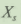和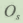,的水平方式表示。例如：

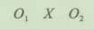

它可以表示预先测量一个或多个测试单元中的01,然后让一个或多个测试单元与实验变量X接触。随后，对测试单元中的02进行测量。X,和Os还可同时以纵向方式表示同步接触和不同测试单元的测量。例如，以下设计涉及测试单元的两个不同组别。

测试单元的两个组同时接受不同的实验处理(X1,X2),随后，这两个组被同步测量(01,02)。

## 9. 6外生变量

在解释实验结果时，调研人员可以得出结论：可观察到的反应是实验变量的影响。然而，存在许多障碍阻止我们得出结论。为了预测解释中遇到的间题，我们需要对实验进行设计，来尽可能地排除这些影响观察效果的外在因素。

### 9. 6. 1外生变量范例

举例来说，对实验有效性存在威胁的外在因素或外生变量有：历史因素、成熟因素、计量因素、选择误差、失员、测试效应、均值的回归。

1. 历史因素

历史因素(history)是指不受研究人员控制（实验变址），发生在实验的开始和结束之间，并影响因变量数值的任何变量或事件。由金宝汤公司进行的"Prego"意大利面调料的早期实验为这种外生变量形式可能出现的问题提供了范例。决策人宣称，在他们对Prego测试期间，竞争品牌Ragu采取了大幅增加广告投入和降价的策略。他们相信，这种营销行为使消费者增强了对Ragu的印象，同时也使得金宝汤公司不可能得到Prego产品潜在销址的精确数值。

2. 成熟因素

成熟因素(maturation)是指在实验过程中受试者方面随着时间而发生的变化。例如，包括长大、饥饿、劳累和其他类似的因素。在这个实验过程中人们对处理变量的反应可能改变，因为这种改变是由千成熟因素而非处理变量。在特殊实验中成熟因素是否是一个严重间题的可能性取决于实验的长度，实验时间越长，成熟因素对千解释结果越有可能产生问题。

3. 计量因素

计量因素(instrumentvariation)是指用以解释测量差异的测量工具的任何变化。在人们从作为访问员和观察者的角度去衡量因变量的许多营销实验中，这是一个重要问题。如果对同一事物的测批可以由不同的访问员和观察者在不同的时间进行，这些在测量中的差异，可以反映出不同访问员和观察者在访问和观察方法上的差异。此外，同一访问员或观察者超出规定时间对同一物体进行测址，这时差异会表现为这样的事实：特定的访问员或观察者对工作失去了兴趣，导致工作的质量下降。

4. 选择误差

选择误差(selectionbias)对有效性的威胁将在以下情形中遇到：实验或测试群体与调研人员拟使用实验结果推测或控制的总体有系统差异（如果设计包括一个）。在推测群体与测试群体有系统差异时，调研人员得到的结论可能不尽相同，因为两个群体的构成不同。类似的，在测试群体和未处理的控制群体（没有暴露在实验变量面前）之间出现的可观察到的区别，可能是因为两个群体间的差异造成的，而不是实验变量的影响。调研人员能通过抽样或搭配的方法来保证群体的等同性。抽样(randomization)是指随机确定测试群体和控制群体的人员。搭配(matching)正如名字所表明的，确保测试中的入员之间或其他组与控制组之间在主要特征方面（如年龄、收入、教育等）是一对一搭配的。具体的搭配步骤将在本章后面予以讨论。

5. 失员

失员(mortality)是指在实验过程中测试单元的损失，这也是个问题，因为不能很容易地知道所损失的测试单元是否会像在整个实验中保留下来的那些单元一样，以同样的方式对处理变量做出反应。代表总体的或类似千控制群体的实验群体可能变得不具代表性，因为具有某些特征的受试者发生了系统损失。例如，在有关音乐偏好的研究中，如果实验过程中几乎所有25岁以下的被研究者发生丢失，那么在实验结束时我们有可能得到的是有误差的音乐偏好记录。这样，结果可能缺少外在有效性。

6. 测试效应

测试效应(testingeffects)源于实验过程本身对我们所观察到的结果的影响。例如，登广告前对产品态度的测量可能作为一个处理变量，会影响广告后的测量。测试效应有两种方式：

- 主要测试效应是指早期观察对后期观察可能产生的影响。例如，第二次考GAMT的学生的成绩比那些第一次考的要好很多，即使在学生并不确切知道部分考题的条件下也是如此。这个结果也具有反作用：态度测试第一次的反应，会对随后进行的相同测试所反映出的态度有一些实际影响。

- 交互测试效应是指先前对被测者反应测量的结果对后来测量者反应产生的影响。例如，如果我们先询间目标群体对不同产品的广告知晓度（暴露前测旦），然后让他们接触一个或多个这些产品的广告（处理变量），那么后期测量可能反映出的是先前测量和处理条件变化的联合影响。

7. 均值的回归

均值的回归(regressiontothemean)是指具有极端行为的目标群体在实验过程中，向着行为的均值发展的可观察的趋势。测试单元可能出现极端行为，这是因为偶然或因为他们的极端行为而被特别选中。例如，你可以选择某些人作为你的实验群体，因为他们是某一具体产品或服务的大量使用者。在这些情况下，他们向均值变化的行为趋势可能被解释为由处理变量引起，而事实上与处理变量无关。

### 9. 6. 2外生变量的控制

威胁有效性的原因性因素必须以某些方式被控制，从而建立一幅清晰的被操纵变量影响因变量的画面。外来原因性因素通常称为混淆变量(confoundingvariables),因为它们混淆了实验处理条件，使得我们不能确定因变量的变化是否仅仅由于实验处理条件引起。

可以使用四种基本方法来控制外来因素：随机化、物理控制、设计控制和统计控制。

随机化(randomization)是指随机地分配给受试者处理条件，以便千我们可以合理的假设：与受试者特征相关的外来原因性因素将在每种处理条件下相等地出现，从而消除外来因素的影响。

外来原因性因素的物理控制(physicalcontrol)是指以某种方法使实验过程中外来变量的数值或水平保持不变。物理控制的另一种方法是配对，受试者在被分配到不同的实验处理条件之前，按照重要的个人特征（如年龄、收入、生活方式）互相配对，目的是确保实验的测试群体和控制群体的反应者特征之间没有瓜要差异。

设计控制(designcontrol)是指通过一些特殊形式的实验设计达到对外来原因性因素的控制。这些设计将在本章的后面加以讨论。

最后，如果在整个实验过程中外来原因性因素能被证明和测姐，那么统计控制(statisticalcontrol)过程就能解释外来原因性因素。这些程序（如协方差的分析）通过对每个实验处理条件下的因变量的数值进行统计上的调整，能用来调整混淆变量对因变量的影响。

### 市场调研实践9- 1

数据使用：隐藏的机顶盒和对测撮线分享的作用

消费者有有限的预算和消费能力，所以当公司想要对产品线做出改变的时候，管理者想要知道这些改变会如何影响人们在范畴内做出选择。为了发现真相，市场营销人员经常使用“机顶盒"(top- box)作为测量购买意图的工具。使用机顶盒的调研展示了一件给出的产品，调研对象一般以从“明确会购买”到“明确不会购买＂的尺度评估。一个清晰的回应看起来提供了管理者需要的信息。

尽管来自调研参与者的回应是清晰的，但公司的回答是否定的。一个可能的产品线扩展也许会在机顶盒方案中评估更高，但是机顶盒对照没有提供指示，高评估选择是否将会获得竞争者份额或者从其他产品线获得。机顶盒也以生成言过其实的结果而闻名。再者，这是因为它衡量了欲望，不是真实的选择。它经常不能在广泛的欲望范围内做出区别，如图9- 1所示，不能生成清晰的证明多样产品概念中的感官差异的结果。

市场人员会受益于使用可选择的途径，测量选择而不是简单地模仿，如相连的分析和离散的选择。调研人员应该从样本中创造相等的测试群体，建立可控的群体使用全套的相关竞争产品，包括那些现在提供的产品，系统地介绍测试产品，改变每个测试群体单一的差异变量，这在根本上是科学方法的应用。这种方法允许实验者处理营销组合中测试样本或要素的一个变量。实验人员可以比较不同的战略，比如产品适应和产品线扩展。

对于关心增长业务和获得相关产品互动及产品线共享信息的市场营销者，重新思考用来收集数据的工具是有价值的锻炼。

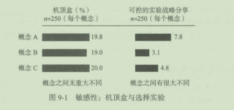

问题：

1. 你认为如果展示一个选择而不是多个选择，机顶盒测量会更准确吗？为什么？

2. 你认为任何市场调研方法能正确地预测行为而不是简单地评估欲望吗？

## 9. 7实验设计、实验处理与实验影响

在实验设计(experimentaldesign)中，研究人员能控制和操纵一个或多个独立变讯。在我们讨论的实验中，一般只有一个独立变量被控制。非实验的设计不涉及控制，一般称作事后（在事实之后）研究。在这种研究类型中，研究入员观察到效果并试图把效果归因千某些原因性因素。实验设计包括匹类因素：

(1)被操纵的处理或实验变址（自变凰）；

(2)参与实验的目标群体；

(3)要测量的非独立变蜇（因变矗）；

(4)处理外来原因性因索的计划或程序。

处理变量(treatmentvariable)是指在实验中被操纵或改变的自变量。操纵是指研究人员设置自变量水平，以测试某一特定因果关系的过程。为了测试价格（自变量）和产品销量（因变量）之间的关系，研究人员可以将目标群体置于三种不同的价格水平中，并记录每种价格水平下的购买水平。价格作为被操纵的变量，是三种处理条件或价格水平下的单一处理变量。

一个实验可以包括一个实验组和一个控制组。控制组是指在实验期间自变量没有变化的群体；实验组是指自变量受到操纵而发生变化的组。

实验影响(experimentaleffect)是指处理变量对因变量产生的影响，目的是确定每种实验处理条件（处理变量的水平）对因变量的影响。例如，假设选中三个不同市场，用以测试三种不同价格或处理条件。在每个市场上对每种价格进行三个月的测试；在市场1中，以比产品现价低2%的价格进行测试；市场2中，以降低4%的价格进行测试；在市场3中，以降低6%的价格进行测试。在三个月测试结束时观察到，市场1的销擅超过三个月以前的销榄近1%;市场2的销量增加了3%;市场3的销措增加了5%。观察到的每个市场的销批变化都是实验的影响。

## 9. 8实验调研的限制因素

上述讨论表明，实验是一种强有力的研究形式，它是能够真正证明所感兴趣的变量之间因果关系的存在与性质的唯一研究形式。给出这些与其他原始数据收集的调研设计相比明显的优势，你可能会间为什么实验法研究不在市场中经常使用。对此有许多原因，包括实验成本、保密问题与实施实验相关的问题等。

### 9. 8. 1高昂的实验成本
从某种程度上讲，比较实验成本与询问法或观察法调研的成本，就好像是比较苹果和橘子，实验法在费用和时间方面成本都很高。在许多情况下，经理可能预料到实验成本要超过所获信息的价值。例如，考虑一下在三种不同地理区域对三种可选择的广告活动进行测试的成本：三种不同的广告活动必须实施；在所有三个市场中媒体时间必须被购买；所有三个市场的测试时间表必须谨慎地协调；一些系统必须在测试活动的前、中、后使用，以测量不同时点的销量；必须对其他外生变量进行测扯；必须对结果进行广泛的分析e为保证实验实施，一系列其他工作必须完成，所有这些将至少花费100万美元以换取一个低利润产品，甚至为了一个高利润品牌，要花费好几千万美元。

### 9. 8. 2保密问题

在测试市场中采用现场实验涉及暴露某个营销计划或营销计划的某些关键部分。毫无疑问，竞争者将会在大规模市场推广之前考虑出对策，这种预先信号使竞争者有机会决定是否以及如何做出反应。无论如何，策略失去了出其不意的效果。在许多例子中，竞争者实际上已经＂窃取“了市场中正被测试的创意。而且，在公司完成对产品或策略因素的市场测试前，竞争者就巳经进入了全国性的分销网。

### 9. 8. 3实施问题

可能会阻碍实验完成的问题主要包括以下方面：难以在组织内部取得合作；干扰问题；测试市场和总体市场之间的差异；缺少一组人或是作为控制群体可用的地理区域。在实施某种类型的实验时，要想获得组织内的合作可能是极其困难的。例如，一个地区的市场经理可能极不情愿地同意他的市场区域被用来作为降低广告水平或拥有较高价格的测试市场。自然地，他主要担忧实验可能会降低这个地区的销鼠。

当来自测试区以外的购买者购买被测试的产品时会发生干扰(contamination),从而扭曲实验结果。外来购买者可能住在测试区边缘，看到了电视广告，仅仅是因为测试区提供了较低的价格、特殊的折扣或其他一些诱因而购买产品，他们的购买意味着被测试的特殊销售刺激因素比实际情况更有效。

在一些情况下，市场测试情况差别很大，在那些市场中的消费者行为也不同，所以很难找出比较小的实验影响。这个问题可以通过对测试市场进行仔细地搭配和其他类似战略计划来解决，从而保证测试单元有较高程度的等同性。

最后，在一些情况下，不能获得合适的地理区域或一组人作为控制组。在工业产品测试中会出现这种情况：它的少量购买者在地理区域上集中，在这样的购买者子群体间测试一项新产品的尝试几乎注定是要失败的。

## 9. 9选择实验设计

本节将介绍预先实验设计、真实实验设计和准实验设计的例子。在叙述这些实验设计时，我们将使用以前介绍过的符号系统。

### 9. 9. 1预先实验设计

预先实验设计是不包括真实实验设计中基本要索的研究设计。因为这些要素的简易型，它们可能在特定情况下有意义，但生成的结果却是很难解释的。使用预先实验设计(pre- experimentaldesigns)的研究经常是很难解释的，是因为它们几乎不能控制外来因素的影响。因此，当用预先实验设计来进行因果推断时，不会比描述性研究好。利用这些设计，研究者在暴露处理变批（如对谁、何时）和测量方法方面的控制很少。然而，这些设计通常用千商业营销研究，因为它们简单且成本低。

1. 单组后期测试设计

单组后期测试设计(one- shotcasestudydesign)是指把测试单元（人或测试市场）暴露在处理变量一段时间，然后测量因变量。使用标准的实验符号，设计如下所示：

在这个设计中有两个基本缺点：对将要进行实验处理的测试单元没有测试前观察；不接受实验处理的测试单元的控制群体也没有得到观察。这些缺点的结果是：设计不能处理以前讨论过的任何外生变最的影响，因此设计缺少内在有效性，同时更可能缺少外在有效性。这种设计对提出因果假设有用，但不能提供这些假设的有力检验。许多新产品（之前市场中没有）的测试市场都以此设计为基础，因为它们更简单且成本较低。

2. 单组前后测试设计

单组前后测试设计(one- grouppretest- posttestdesign)是一种经常用来进行现有产品和营销战略变化情况下的市场测试设计。产品在变化市场上的事实为前期测试(01)提供了基础，设计用符号表示如下：

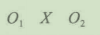

对后来接受实验处理的单个受试组或单个测试单元进行前期观察(01),最后进行后期观察(02),实验处理的效果通过02- 01估计。

历史因素是对这个设计内在有效性的一种威胁。因为可观察到的因变量变化可能是由发生在前期测试和后期测试之间、实验以外的事件所引起的。在实验室实验中，这种威胁可以通过将被测试者与外界影响相隔离来控制。遗憾的是，这种类型的控制在现场实验中是不可能的。

成熟因素是对这种设计类型的另一个威胁。可观察到的效果可能是由于目标群体在预先实验测试和测试之后的过程中，巳经变得更成熟、更聪明、更有经验等因素造成的。

这个设计只有一个预先测试观察，因此调研人员对因变量实验前期的趋势一无所知。在一种不是研究者感兴趣的实验处理产生效果的情境下，因变量有不断增长的趋势，实验后的测量分数可能会更高。

正如接下来讨论的“市场调研实践9- 2",任何一种设计中都会存在误差。

### 市场调研实践9- 2

当选择误差是由采访者性别造成时，会发生什么

在市场调研战略中，为了测量营销策略的变量而进行实验设计时，选择误差通常意味着对有效性的威胁，因为测试群体与调研人员渴望调查的目标群体有很大差异。但是，如果选择误差以市场调研人员的性别开始会怎样？会对实验有效性产生什么影响？最近，德国研究人员发现，以女性或带有女性名字所进行的调查，与男性相比，可以得到更好的回应。

斯蒂芬·奥尔索夫(StefanAlthoff)是德国汉莎航空技术公司(LufthansaTechnik)的市场调研经理。2004年，他的部门开始了一项在线顾客调研，他们收到了很少的回应。一周后，他们发出提醒，信的署名作者是朱莉娅，回应率跃至30%。对于随后的许多在线调研，汉莎航空技术公司都让女性为电子邮件调查和提磋信署名。有趣的是，研究人员有这样的印象：与男性署名相比，女性署名的回应者阅读和完成调研的速度更快，他们把这称为“安妮塔效应"(Anitaeffect),即发出者性别对回应的影响。

2006年1月，奥尔索夫和同事在汉莎航空技术公司进行了一项关于企业内部网络使用的室内员工调研，他们的样本是两个分别由105名男性构成的小组：其中一组收到的是由女性发出的电子参与邀请；另一组则来自男性。210名男性的回应率是80%,但其中收到女性邀请的回应率是83. 9%,另一组只有74. 3%。

2006年3月，奥尔索夫和他的同事又对“安妮塔效应”进行了测试。这次结合大学市场，对UNipark注册用户进行了调研。奥尔索夫将460名用户分成四组，并要求他们对UNipark的网站主页及Globalpark的网上搜索软件效用进行评价，奥尔索夫及全体人员（包括一名女性研究人员）改变电子邀请的性别，结果是值得注意的。奥尔索夫评论说：“接收到由女性发出电子邀请的小组回应率高于其他组。”

问题：

1. 哪些类型的可能（甚至不可思议的）误差，是由那些回答女性发出或签署电子调研的男性回应者造成的？

2. 奥尔索夫计划测试不同女性名字对回应率的影响，思考哪三个女性名字可能对男性最具吸引力？哪三个最不具有吸引力？

### 9. 9. 2真实实验设计

在真实实验设计(trueexperimentaldesign)中，实验人员把实验处理随机地分配到随机选出的测试单元中。在我们的符号系统中，实验单元随机分配给实验处理，用R表示。随机原则是一种重要的机制，它使得真实实验设计的结果比预先实验设计的结果更有效。由千随机原则兼顾了许多外生变量，从而使得真实实验设计更具优越性。选择进行随机实验而不是其他类型调研设计的主要原因是，它们使因果推断更清晰。本节将讨论两种真实实验设计：前后测试控制组设计和仅为后期测试控制组设计。

1. 前后测试控制组设计

前后测试控制组设计(beforeandafterwithcontrolgroupdesign)可以用如下符号表示：

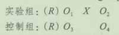

因为在这个设计中的测试单元随机地被分配到实验组和控制组中，所以这两个组被认为是对等的。因此，它们可能除了在实验组中收到研究所感兴趣的处理外，还同样受到外来原因性因素的影响。由千这个原因控制组前后测试之间的差异(04- 03)将提供所有外来影响对每组所经历结果的合理估计。为了得知处理变量X的真实影响力，外来因素的影响必须从实验组前后测试之间的差异中去除。这样，X的真实影响力被估计为：(02- 01)- (04- 03),这个设计基本上控制了除死亡和当地历史因素以外的全部有效性威胁。

如果某个单元在研究期间退出，或者，如果中途退出的单元与留下的单元存在着系统性差别，那么失员将会是个问题。在选择误差下的结果是因为实验组和控制组在后期测试与前期测试中主体的构成不同，在事件而不是处理变量影响了实验组但没有影响控制组的情况，或者相反情况下，历史因索将成为问题。前后侧试控制组设计和仅为后期测试控制组设计的例子将在表9- 1中列出。

表9- 1真实实验设计的例子

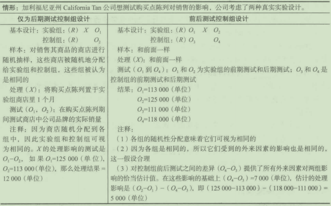

2. 仅为后期测试控制组设计

就测试单元的分配而言，仅为后期测试控制组设计(after- onlywithcontrolgroup
design)确保实验组和控制组可以被认为是相同的，用符号表示如下：

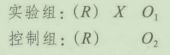

你将注意到测试单元被随机地(R)分配到实验组和控制组中。这种随机分配产生的实验组和控制组与先千实验处理的因变址大致相等。你可以合理地假定测试单元的失员（内在有效性的威胁之一）将以同等方式影响每一组。

在表9- 1中所描述的洗发水实例背景下考虑这个设计，我们能看到许多间题：是事件而不是处理变鼠发生在实验期间实验组的一个或几个商店里。如果实验组中的一个特殊商店经营某些其他类型的产品，而使商店中有了大量顾客，洗发水的销盘可能会因客流增加而增加。诸如此类的事情，商店的特殊性（历史）可能扭曲总的实验处理影响。此外，还有一种可能性就是在实验期间有几家商店可能会中途退出（失员威胁），导致由于实验组中的商店与后期测量时不同，结果会出现选择误差。

### 9. 9. 3准实验设计

当设计一个真实实验时，调研入员通常必须创造人为环境来控制独立变琵和外生变址。因为这种设计的人为性，实验结果存在外在有效性问题。因此，人们开发出准实验设计解决这个问题。准实验设计一般在现场环境方面比真实实验更可行。

在准实验(quasi- experiments)中，调研入员缺少对实验处理进度表的完全控制，或必须以非随机方式将受试者分配到实验处理中。巾千费用和现场限制经常不允许调研人员对处理进度表和受试者的随机抽样进行直接控制，因此这些设计往往被用千市场调研中。准实验设计的例子是：间断时间序列设计和多重时间序列设计。

1. 问断时问序列设计

间断时间序列设计(interruptedtime- seriesdesigns)是指在引入实验处理前后反复测
试，从而打断以往的数据形态。该设计用符号表示如下：

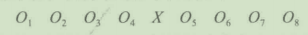

在市场调研中使用这种设计最普通的实例就是消费者购买小组的使用。调研人员可以
利用一个小组对消费者购买行为(O,)进行定期的测试。引进一种新的促销活动(X),并
测试其对小组数据的影响。研究人员能够控制促销活动的时间表，但不能保证小组成员什
么时候感受到了促销活动，还是根本没有感受到。

这种设计与单组前后测试设计十分相似：

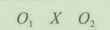

然而，由于多次前后测试对外生变匮进行了更多的控制，所以时间序列实验设计比单组前后测试设计有更强的解释能力。例如，在产品销噩上升的同时，一种新的促销宣传活动正在进行，如果使用前后测试设计，那么这项活动的真实效果就无法估计。可是，如果进行大量的前后测试观察，销批的增长趋势是明显的。时间序列设计可以帮助我们确定因变矗的隐含趋势，并提供关于实验处理效果更好的解释能力。

这种设计有两个根本缺点，其中主要缺点是缺乏控制历史因素的能力。尽管保持所有可能相关的外来事件的详细记录能减少这个问题带来的干扰，但是实验人员还是无法确定前后测试观察的恰当次数和时间。

这种设计的另一个缺点来自于交互测试效应的潜在价值和对测试单元进行重复测量的估计理解。例如，小组成员可能成为“专业”购买者或是更多地意识到他们的购买习惯。在这些情况下，以此来推断总体或其他群体可能是不适当。

2. 多重时问序列设计

如果可以将一个控制组加到间断时间序列设计中，那么对测觉效果的解释就更加肯定了，这种设计称为多重时间序列设计(multipletime- seriesdesign)。用符号表示如下：

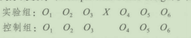

研究人员必须小心选择控制组。例如，一位广告商可能在一个测试城市中测试一种新的广告活动，那么这个城市将构成实验组，没有实施这项新广告的另外一个城市被选为控制组。测试城市和控制城市在产品销量有关特性方面（如有效的竞争品牌）是大体等同的。

## 9. 10市场测试

产品和服务的发展经历了一系列过程，包括创意形成、创意审查、概念测试、商业分析、原型发展、市场测试和商业化。市场人员是否会测试一种产品或服务的市场取决于预期的扩散率，巳存在的竞争产品的区分程度及一系列其他因素。

市场调研人员所用的一种普通的实验方法是市场测试。市场测试(testmarket)这一术语泛指通过使用实验设计或准实验设计所进行的任何研究。这些研究包括在单个或一组市场、某个地区测试一种新产品或现有营销战略（如产品、价格、渠道、促销）的变化。

新产品的引入对决定公司财务的成败发挥着重要作用。传统观点认为，在公司的世界里，由千竞争日趋激烈、变革速度加快，因此将来新产品对利润的贡献将超过以往。新产品失败率的变动幅度大，并可能达到90%以上。以下“市场调研实践9- 3"讨论的是麦当劳的市场测试。

### 市场调研实践9- 3

麦当劳的市场测试

麦当劳等大公司在全球都有店铺，可以在自己的店里进行市场测试。以龙虾汉堡(McLobster)为例，我确定在创意形成时期就开始测试。有些人也许会说：＂嘿，我们加拿大／新英格兰市场正在错过什么？”或者也许他们只是喜欢参与龙虾三明治业务的创意，然后自问：“谁会吃？”或者也许这不是内部创意资源，而是来自消费者或供应商的外部创意。龙虾汉堡错过了创意审查时期，“这帮助我们尽可能发现好的创意，摒弃不好的＂。

接下来说到产品概念“创意的详细版本从有意义的消费者角度陈述＂。这会像这样“真正的大西洋(Atlantic)龙虾，在小圆面包上展开，用奶油、白色的龙虾面包调味汁炯. . . . . . 嗯，我喜欢！”然后这会变成一个比描述更为丰富的产品形象一也像一个龙虾汉堡画出的或实体的代表。

最后，在麦当劳描述其目标市场的战略发展阶段之后，公司会探索计划的价值命题、销量、市场份额和利润目标。最终，麦当劳会对龙虾汉堡进行商业分析，回顾销量、成本及利润预测，来看是否符合公司的目标。

然后就到了有趣的部分，比如产品发展，这时麦当劳会真正地创造龙虾汉堡，也许会咨询海鲜专家。然而，麦当劳不会把产品商业化到每一家服务目标市场的麦当劳。首先必须做市场测试，在目标市场中特定位置的真实市场环境下引入产品和营销计划。

市场测试对麦当劳等公司很简单，它可以在自己的店里测试自己的产品，简单地做小型的地方促销，在菜单上挨着写一个大大的“新”就可以。龙虾汉堡不是必然有足够的盈利能力来集中商业化，但据我所知，这些年在有限制的市场中作为一种季节性产品在引入。

问题：

1. 好的市场测试的特点有哪些？

2为什么市场测试对麦当劳这样的公司更容易？

你可能已经认识到，市场测试研究的目的是协助营销经理对新产品及附加品做出更好的决策，并对现有产品或营销战略进行调整。市场测试研究通过提供一种真实市场的测试来评估产品和营销计划。营销经理利用市场测试规模较小且成本较低的特色，对所提出的具有多个独立部分的全国性计划进行评估，这种基本思想可以用来确定产品在全国推广后得到的估计利润是否会超过潜在风险。设计市场测试研究提供了有关下列问题的信息：

- 市场份额与容量的评估。
- 新产品对公司巳上市的类似产品销量的影响，这种影响可用替换率表示。
- 购买产品的消费者特征。人口统计学数据几乎都能收集到，生活方式、心理特征和其他形式的分类数据也可以收集到，这些信息将有助千公司改善产品的营销策略。例如，了解可能购买者的人口统计学特征将帮助我们创造出更有效、更有影响力的接触目标顾客的媒体计划。了解目标消费者心理和生活方式的特征对如何进行产品定位和确定吸引顾客的促销手段将提供有价值的参考。
- 测试期间竞争者的行为。这可能会提供产品在全国推广后竞争者可能反映的一些预示信息。

正如下面的“市场调研实9- 4"所说，其他类型的调研会在实验或市场测试后出现。

### 市场调研实践9- 4

释放潜力

创新是促进进步的破坏性力量，但创意不会在真空中出现。新产品和服务必须进行测试，并且经常再测试来测试可行性。

有一个创新的例子，是PSCU经济服务公司的CardLock服务，这是一家佛罗里达州圣彼德斯堡的经济服务及支付处理公司，为全国600多家信用合作社和1400万持卡人服务。在2009年夏末引入的CardLock旨在加强诈骗防护，通过加强持卡人锁上或者解锁信用卡或借记卡有效地关闭或打开。持卡人可以拨打免费电话或访问特定网页，在几秒内用简单的4位数字键控密码锁上或解锁账户。

在进入市场之前，PSCU经济服务公司实施了调研来测试CardLock概念的可行性，这里会讲述它的具体过程。

CardLock不是在真空中创造出来的。想象力得到发展，创意受到内部支持以获得关键公司股东的接受和认可。一项跨部门的特别小组开会讨论创意，这个团队想出一个产品概念，讨论技术需求，分析与概念相关的间接数据，提供传闻的市场回馈及信用合作社及其成员的潜在收益。

明显的区分

可以确定的是没有其他类似CardLock的产品在市场中存在，这给了PSCU明显的产品区分。但在任何产品开发之前，调研计划需要全面测试概念。股东提供投入和最终确定以及支持调研计划。股东需要回答下面的问题：是否与需求相适应？是否有市场潜力？促使其成功需要哪些特性和功能？就这一点，公司联系了SRA调研组织来咨询解决这个调研中大量问题的潜在方法。

调研计划被分为三个明显阶段：定量细分研究；一系列焦点小组访谈；如果概念使其足够深入，通过信用合作社进行市场测试。过程是非典型的，许多调研计划从定性开始，然后转到定量。SRA基于经验表明产品发展的典型陷阱之一定性调研被用来把创意推入市场，并且PSCU要相信在探索特点和功能一更昂贵的努力之前，市场存在。因此，定量调研首先完成。

阶段一：消费者细分研究

公司需要可靠的消费者需求意向。为了这个目的，PSCU利用一次全国范围内的代表小组进行了一次网上调研。参加调研的条件主要限制在拥有借记卡或信用卡，总共I080人回应了调研。

详细的CardLock概念陈述被引入。调研包括兴趣水平的问题（有没有报酬）、加入或拒绝加入的原因、使用的可能性、拥有信用卡和借记卡的数量、有关信用卡诈骗的经验七调研结果通过年龄、收入、教育水平、是否有孩子、拥有信用卡的数量、自有住房状况，以及经济组织从属关系进行比较。

40%的人表示了对CardLock的兴趣。即使是在把每月1美元费用引入到概念中后，兴趣水平依旧得到维持。

兴趣的两个关键驱动力包括：防止诈骗的需求（首要驱动力）和内心的宁静。那些不感兴趣的人通常是感觉不需要或者担心便利性（如忘记解锁或忘记密码）。最大的收获是为了促使最大化采用，产品开发人员巳经确信CardLock很容易使用调研明确了市场细分。最感兴趣的人包括网上购物者、频繁旅行者、年轻消费者、承租人，以及那些经历过信用卡诈骗的人。

调研证明这种产品存在市场，有了确定市场细分中小规模的极大感兴趣者，内部股东有信心进入调研的下一阶段。

阶段二：消费者焦点小组

PSCU很自信它是一款有市场潜力的产品。投放到市场以前，公司需要一个关于提供什么特性和功能的方向来促使它更好地适应和使用。公司需要知道消费者会如何使用产品，他们有什么担心，会遇到什么障碍。焦点小组访谈最终被选为选择方法，因为它们允许丰富的讨论带来新的见解，使产品更有效。SRA调研组织受到委托实施这一阶段的调研。

调研人员决定在两个市场中成立四个焦点小组。这些市场出于便利性，在某种程度上出于对中立消费者群体的需要被选择。阶段二的调查研究表明，年轻的消费者比年老的消费者对这个概念更感兴趣。因此，四次会议之中的每一个分别专心千四个具体的年龄段中的一个：18~24岁、25~34岁、35~44岁、45~54岁。基于定量调研，55岁及以上的人不考虑为主要市场。

对定量调研进行仔细回顾之后，决定被邀请者必须至少拥有一张借记卡或信用卡，对概念有一些兴趣，呈现一些阶段识别的细分特点（如日常旅行者、网上购物者等）。SRA仔细监控调查对象组合来确信会议能代表所有的潜在兴趣群体。

讨论指南被开发，分类为四个关键部分。第一部分涵盖了焦点小组成员的信用卡使用模式和行为；第二部分涵盖了焦点小组成员对理想卡片的感觉。如果他们想要开发一个刮卡，会是什么样子呢？

为每一组提供清晰的产品概念陈述，然后主持人征求反馈。他们的反应是什么？他们会把自己的卡注册这项服务吗，为什么？他们更喜欢怎样注册？有人想要使用锁住的卡时，他们想要怎样接到通知？他们会多久使用一次？产品缺少什么？

便利性是焦点小组提到的主要考虑因素。系统需要快速地锁上、解锁，否则调研对象不会使用。

焦点小组还包括一次关于信用卡诈骗的简短讨论。这有点微妙，因为我们想要避免长期战争故事，但还要了解消费者对这个问题担心的深度。

出乎大家意料的是，在已存在的持卡人同意下，参与者只对他们的责任有有限的了解。除此之外，焦点小组成员普遍了解服务的价值并表达了兴趣。能够控制给了他们大量需要的内心的宁静。除了额外的控制，处理信用卡诈骗的便利性也是增强兴趣的主要促进因素。

总的来说，消费者关注群体给了产品开发经理在如何建立特点和功能以驱动被采纳和使用方面很大的领悟，他们也提供了关于应该如何鼓励消费者签约参加这类服务的深入看法。现在，产品开发经理需要试水。

阶段三：信用合作杜测试

在这一阶段，CardLock的开发工作儿乎完成。但是，PSCU意识到在它们维护自身的会员利益之前，信用合作社需要对它感到舒服一产品成功的关键。对许多信用合作社中间实验新方法也可以用来提供有价值的市场内数据。

做出实验三个信用合作社的新方法的决定。这些信用合作社的员工充分接触到CardLock,他们的使用被监控。他们如何开卡或销卡？他们会让信用卡锁多久？有什么技术差错吗?PSCU和实验协调者每周进行签到电话，在实验最后进行网上反馈会议。市场内测试进行了10周，被认为是成功的。

增加的控制感

在许多尽职调研之后，CardLock通过了产品开发通道，成为一款正式产品。新闻稿被送到主要的信用合作社商业出版物那里宣布这项新服务。自从首次亮相，许多信用合作社巳经注册。

市场调研为CardLock铺好道路。在消费者调研和市场内测试中的时间和投资证明是有益的，它帮助把概念转换为真正切实可行的创新产品。最后，需求被识别，市场被垄断，内心的宁静也得到实现。

问题：

1每项调研要素（定量焦点小组访谈和市场内测试），在把成功的产品引入市场的过程中有什么贡献？

2. PSCU是如何从调研的每一阶段学到知识的？

### 9. 10. 1市场测试的类型

大量市场测试可以分为四类：传统或标准市场测试、扫描或电子市场测试、受控的市场测试和模拟市场测试。

(1)传统或标准市场测试是指通过企业常规的分销渠逍，对一种产品及其他混合要素进行测试。传统市场测试花费的时间相对较长(6个月或者更长），成本昂贵，并且会立即向竞争对手暴露。一些人认为，传统市场测试提供了最佳的类似千真实市场的环境。所以，如果引入传统市场测试，它可以提供关于产品及联合市场混合要素效果的最佳解释。然而，以下讨论的一些其他选择，也会对小部分成本提供很好的估计，更加迅速，并且不会给竞争者有关企业行为的提前信号。

(2)扫描或电子市场测试是扫描研究公司在市场进行的测试，市场上的消费者使用可扫描银行卡购买特定产品，特别是通过杂货店出售的产品6这些样本组允许我们分析购买和不购买测试产品的消费者特征。单个样本组参与者的购头与否可以与他们的详细人口数据、过去购买历史相联系；在某些情况下，与观看媒体的习惯相联系。提供样本组信息的公司包括尼尔森和信息资源公司(InformationResources),这种测试方法速度快、成本低。同时，我们正在考虑营销策略和策略上其他变化的安全程度间题。在讨论中对这种营销测试方案的主要批判是它的抽样不具有代表性。同意仪器测试的人也许对这些或其他市场上更广泛人群不具代表性。

(3)受控的市场测试被调研供应商控制，它们可以保证提供的产品是通过协议的分销种类和数量。例如，受控测试市场的调研供应商（如尼尔森）会付款给分销商，使它们提供货架空间上测试产品所必需的数量。调研供应商会认真监测这些受控市场上产品的销量。这使得公司更快地将产品投入测试，经常性地提供更多真实的分销水平，同时也提供了更好的产品动向监测。正如下面”市场调研实践9- 5"中所讨论的，某些测试市场比其他市场更受欢迎。

### 市场调研实践9-5

为什么是俄亥俄州哥伦布市

在温蒂国际(Wendy'sInternational)的高安全度测试厨房中，他们正在研制黑标汉堡(BlackLabelBurger)。但不要现在就开始流口水，在它进入你的城镇之前，首先要在俄亥俄州哥伦布市达到标准。白衣服的食物技术员将制成的汉堡样品送给志愿者品尝，让他们对其评级，如洋葱味和混合味。

这是进入测试市场前的最后一步，高级副总裁洛丽·埃斯特拉达(LoriEstrada)有很高的期待：“我们仍然在等待消费者的分数，但基于我所知道的，预期他们进入这里会感到很棒。”

然后测试汉堡进入真实的温蒂国际。发言人丹尼，林奇(DennyLynch)说，甚至到出现在菜单上时仍然在调整。

消费者“天竺鼠"(guineapigs)有各种人口统计。在俄亥俄州大学和许多其他大学有大量的学生，有很强的国际风度。全部加起来就是一个国家消费者的几乎完美的横断面(cross- section)。它在美国中部，但不代表平均水平。有一种有趣的时髦文化的混合——创造性、多样化、企业文化真正混合，使其成为一种独特的测试台(testbed),与只是作为平均水平截然相反。所以想法是，如果创意在这里实现，就能在任何地方实现。

问题：

1. 为什么俄亥俄州哥伦布市被许多市场营销人员看作好的测试市场？你把认为它是一个好的测试市场吗？为什么？

2. 有像“平均“市场这样的事物吗？不论你同意还是不同意，论证你的答案

(4)模拟市场测试(STM)正如它的名字所表明的，模拟上述记录的市场测试类型。与其他方法相比，楼拟市场测试的实施速度更快、成本更低，并且相应的结果在大多数情况下对真正要发生的事情具有更高的预见性。在这些模拟市场测试中使用了更为有限的信息队，并且结合了数学模型，这些数学模型包括对不同营销变量的效果估计，这些变量可以进行调整以适应具体情况。包括尼尔森(Bases)、哈里斯互动(Litmus)和思纬(MarketTest)在内，许多不同公司提供了这些服务，而且每家公司都有各自的特色。但是，它们全部都包含以下要素：

- 以所期望或认知的测试产品目标顾客的特征为基础，选择顾客样本。
- 抽取顾客样本进入中心测试场所，让他们观看测试产品和竞争产品的商业广告。
- 随后给予参与者机会，让其在真实市场环境或模拟商店环境中购买测试产品。
- 在顾客使用一定时间产品之后与其进行接触，询问他们再次购买的可能性和对产品的评价。
- 以上信息与校拟市场测试公司的专利模型同时使用，可以估计销售容量、市场份额和其他关键市场度矗。

### 9. 10. 2市场测试的成本

市场测试是很昂贵的，一个简单的两市场测试可能至少要花费100万美元，长期复杂的测试可能要花费好几千万美元。这些成本还只是指直接成本，主要包括：
- 商业广告的制作；
- 支付广告代理商的服务费；
- 由于容量有限导致的媒体时间费用提高；
- 辛迪加调研信息；
- 定制的研究信息和关联数据分析费；
- 销售现场材料费；
- 促销券和样品费；
- 为获得分销渠道而支付的较高的经销商补贴。也有许多与市场测试有关的间接成本，主要包括：
- 管理者花在市场测试上的时间成本；
- 现有产品销售活动的分散；
- 一个测试市场的失败可能对家族品牌中的其他产品产生负面影响；
- 如果企业背负了失败的名声，那么可能会给产品带来负面影响；
- 如果让竞争者知道你在干什么，那么他们会在全国市场上制定更好的策略以击败你的成本优势。

市场测试的成本很高，而且正因如此，这种方法仅用于已表现出潜力的新产品或战略营销研究过程的最后一步。在某些情况下，即使失败，直接发布新产品也可能会使成本更低。

### 9. 10. 3决定是否进行市场测试

从上面的讨论可以看出，市场测试为测试公司至少提供了两方面重要好处：

- 第一，也是最主要的一方面，市场测试为企业在真实条件下获得产品销售潜力的合理估计提供了工具。在这些测试结果的基础上，研究人员可以估莫产品的全国市场份额，并利用这些数字预测该产品的财务状况。

- 第二，能识别产品和巳提出的营销战略的弱点，并为管理者提供改正这些弱点的机会。在市场测试阶段纠正这些问题比产品进入全国性分销渠道之后再纠正更容易，成本更低。

这些优点必须与许多有关成本和市场测试的其他消极因素结合起来考虑。市场测试的财务成本并不是无足轻重的，同时市场测试向竞争者提供了早期信号－你打算干什么。这就给了竞争对手一个机会去调整他们的营销策略，或者说，如果你的想法很容易被模仿而且没有合法的保护，对手就很可能效仿，并在你之前更快地进入全国性分销渠道。

在决定是否进行市场测试时要考虑四个主要因素：

(1)将成本、失败的风险、成功的可能性及相关利润进行比较。如果估计成本很高，而且又不能完全确定成功的可能性，那么就应该倾向千进行市场测试；如果预期成本和产品失败的风险都较低，那么就不用市场测试而直接进入市场可能是合适的战略。

(2)要考虑竞争者仿制产品并将其推向市场的可能性和速度。如果产品能轻而易举地被模仿，最好直接将产品推向全国市场而不必进行市场测试。

(3)考虑为市场测试生产产品所需投资和面向全国市场生产必须数量的产品所需的投资。在两者差异很小的清况下，不进行市场割试直接向全国推广产品可能更有意义；然而，若两者之间存在很大差异的话，在决定向全国推广产品之前进行市场测试还是有积极意义的。

(4)要考虑有关新产品上市失败可能对公司声誉造成多大程度的损害。失败可能会损害公司分销渠道的其他成员（零售商）的声誉，妨碍公司为今后推出产品而获取合作的能力。

### 9. 10. 4市场测试研究的步骤

一旦决定进行市场测试，那么要想取得满意的结果就必须采取很多步骤。

1. 确定目标

这种类型的列表一如既往，过程的第一步就是确定测试目标。典型的市场测试目标有：
- 估计市场份额和销量；
- 确定产品购买者的特征；
- 确定购买频率和目的；
- 确定在哪里购买（零售渠道）；
- 测量新产品的销售对产品线上现有相似产品销售的影响。

2. 选择一种基本方法

在确定市场测试目标后，下一步是确定适合既定目标的市场测试类型。在本节开始，我们巳经讨论过四种市场测试类型的特征及其优缺点：

- 传统或标准市场测试；
- 扫描或电子市场测试；
- 受控的市场测试；
- 模拟市场测试。

在既定情况下，确定使用哪种市场测试类型取决于你有多少时间，你的预算开支是多少，以及保持计划行动内容不被竞争者知道的重要性有多大。

3. 制定详细的测试程序

确定了目标和基本测试方法后，就需要制订详细的市场测试计划。制造和分销决策的制定必须保证提供适当的产品，而且出售具体产品的方式在大多数商店是可行的。另外，用于测试的营销计划细节必须详细地加以规定，包括基本的定位方法、实际使用的商业广告、价格策略、媒体计划以及各种促销活动。

4. 选择测试市场

测试市场的选择是个很重要的决策。在做出选择时必须考虑许多因素。

首先这里有一些整体标准：

- 对现有全国性品牌进行测试，除了一个控制市场外，还要有至少两个测试市场，对千测试一个新品牌至少要有三个市场。
- 所选择的市场从地理角度看应该是分散的，如果这个品牌是地区性品牌，市场要覆盖该地区的几个分散市场。
- 对美国而言，市场应该具有人口统计学的代表性，除非特殊情况，如某一种族成员渴望某一特定的品牌。
- 在结果能被准确推断前，测试应至少持续6~12个月，这依赖千产品购买周期。如果产品不被频繁购买，建议实验实施一年甚至更长时间。
- 市场必须有多种媒介通道，包括至少四个电视台，有线渗透率在美国平均水平的上下10%之内；至少四个广播电台；一个具有日常和周日版的且占优势地位的当地报刊，周日增刊有集闭版本，或者一个相似质量的当地增刊。

### 市场调研实践9- 6

具体产品测试市场的快速扫描

一些地方看起来具有专门用于做市场测试实验的绝佳条件，比如高端啤酒、优质的伏特加或巴西牛排。

2008年年初，位于威斯康星州密尔沃基的米勒酿酒公司(MillerBrewingCompany),决定进行一项针对三种低能量、工艺风格淡啤酒的市场测试该测试仅在四个城市中进行，分别是明尼苏达州的明尼阿波利斯、北卡罗来纳州的夏洛特、加利福尼亚州的圣迭戈马里兰州的巴尔的摩。它们的目标是为淡味精酿啤酒建立一种全新的战略，并向啤酒工业中的三个重要的趋势进行投资，这三种趋势是：向淡啤转变（低能量且低糖）；更为多样化；所谓优质高端具有质感的产品。这是一致的想法，因为精酿啤酒在2006年的销量上升了17. 8%,同时上述四个城市拥有保证市场测试准确的适当人口统计组合。

1711年建立的一家伦敦酿酒厂富勒(Fuller's)选择科罗拉多州首府丹佛作为美国优质的测试地点，对其高端的＂伦敦之巅"(LondonPride)啤酒进行市场测试。为什么选择丹佛呢？因为这个地区是大量啤酒饮用者的故乡，他们喜欢极品啤酒，而且可能不介意花8美元买一组6听装的伦敦之巅。调研人员发现，那里的人们很喜欢优质的和精酿的啤酒更好的是，精酿啤酒在科罗拉多州赢得了10%的市场份额，在全美国位列第三。富勒认为，公司的营销策略应包括对高尔夫及关注户外运动类型的顾客轮番投放广播广告，他们大多是消费小厂啤酒(microbrewset)的群体。

安海斯－布希(A吐euser- Busch)的普鲁斯(Purus)伏特加在意大利进行蒸熘并且以35美元的价格销售，现正在波士顿、纽约、华盛顿、安纳波利斯进行测试。为什么在那测试呢？因为公司想利用以小麦为制成的有机啤酒来吸引”时髦的奢侈品行家”。同时，它们想把测试定位在城市中的高级俱乐部和餐厅，以及少量的特殊杂货店和烈酒零售店。

再者，在这种策略背后有理性思考的依据。2003~2006年，美国高端伏特加酒的销量增

加了一倍多，通常的消费者是谁呢？是那些与价格相比更在乎形象的年轻饮酒者，他们的年龄在21~30岁。

拥有国际餐厅概念的科罗拉多州的雷克伍德，会选择美国的哪个城市来测试其啄木鸟巴西烧烤牛排馆(TucanosBrazilianGrillsteakhouse)的市场呢？是犹他州的普罗沃。乍一看，普罗沃的人口统计数据好像与之不符。普罗沃的10万居民中有87%是白人并且只有10%的西班牙人，因此啄木鸟烧烤的市场在哪儿？结果显示，由于普罗沃是杨百翰大学的故乡，并且为摩门教徒经营着一家传教士培养中心，成千上万的摩门教徒学生被派到野外，许多被派到巴西。另外，大学人群中包含许多国际学生，他们共同组成了一个种族多样、语言丰富社会和良好的测试市场。

问题；

1. 明尼阿波利斯、夏洛特、圣迭戈、巴尔的摩这四个城市拥有什么特征，使它们成为推广高端啤酒的好市场？

2. 这些充满摩门教徒的地区中，成员都游历甚广且精通巴西食品，怎样针对该地区的,巴西菜肴修改市场测试实验？

5. 执行计划

一旦有了合适的计划后，研究人员就可以开始执行计划C开始测试时，要做的一个关键决定就是测试将持续多久。平均测试时间是6~12个月，然面，更短或更长的测试也很常见。测试必须持续到能观察到足够多的重复购买周期次数，以反映一种新产品或营销计划在市场中的“保持力”。平均购买周期越短，测试所需的时间也越短。香烟、软饮料和其他包装类商品每隔几天就要购买一次，而剃须轩、牙脊等几个月才需购买一次。后一类产品需要稍长的测试时间。不管产品是哪种类型，我们都需要继续测试直到重复购买率稳定下来。重复购买人数的百分比在达到相对稳定水平前有一段时期下降的趋势。重复购买率对估计最终销量很关键，如果太早地结束测试就会过高地估计销量。

在确定测试长度时，竞争者反映的预期速度和进行测试的成本是另外两种要考虑的因素。如果有理由预计竞争者对市场测试会迅速做出反应（引入他们自己的新产品版本），那么测试应该尽可能的短，缩短测试时间能够减少竞争者做出反应所需的时间。最后，必须衡星测试中获得的附加信息价值与继续进行测试的成本之间的关系。在某些情况下，测试成本超过了所获得的附加信息价值。

### 市场调研实践9- 7

模拟市场测试调研增强你的实验，磨炼出最好的营销计划

尽管这是事实，一些市场人员使用模拟市场测试战略来测试几个选择计划，在目标销量方面选择胜者，没有原因控制数量来实验。下面是其原因。

市场人员现在比以前更需要计划来尽可能增强新产品或服务的表现。市场人员不论在哪里一尽管有好的产品或准备进行服务，都需要自问：“我有好的战略和战术组合能在市场份额、收益或利润方面从投资中收到最大的回报吗？”

当我们问一个主要的消费者包装产品制造商关于最近90%~95%失败率的原因时，公司解释说，＂错误的市场计划或实施计划的失败“比没有颠覆的表现更常见。

不仅仅作为一种预测工具，模拟市场测试调研使你能够通过不同的传统和数字媒体用不同的投入试验一从战略因素（如目标市场和定位）到战术因素（如总收视点和预算配额），现在在营销计划上严格要求很可能是在真实世界中支持表现目标。

我们从未见过一个计划基于模拟市场测试被推荐，却不能击败营销管理层所提交的计划而受到推荐。有时利润是适中的，有时区别是压倒一切的。

模拟市场测试应用超出了推出前的计划和预测。市场人员也可以使用更明智的模拟市场测试来提升营销计划再推出。市场人员可以看到新产品或服务的现轨道或者基于至少30天的买际的、真买世界结果的计划。如果他们看到了发布前和发布后关于意识、销量和收益的巨大不同，他们有时间（以及模拟市场测试技木）对计划进行重新规划，在追踪上得到创新投资回报率。

尽管越来越多的市场营销者经常使用技术来测试大量不同的新产品和服务的配置，我们承受巨大压力以发现太多使用技术规划营销计划的配置。致力于模拟市场测试等技术工具对提升创新努力的表现有很大帮助。

问题：

1. 模拟市场测试是什么？和传统市场测试相比有什么不同？
2模拟市场测试能够用来仅仅评估目标销量吗？还有其他什么用处？

6. 分析测试结果

尽管在实验进程中也会对所产生的数据进行评估，但在实验完成后，必须进行一次更详细、更彻底的数据分析。这种分析集中在四个方面：

- 购买数据。这通常是大多数实验或市场测试产生的最重要数据。在整个实验过程中，最初的购买水平（试用）表明了广告和促销工作的效果。重购率（第二次或更多次购买者占试用者的百分比）表明了产品在满足有广告和促销手段时产生的预期程度。当然，如果当产品推向更广泛的市场，试用和重复购买的结果会为估计销售情况和市场份额提供基础。

- 认知数据。在创造产品认知方面，媒体支出和媒体计划将起多大作用？顾客是否了解我们产品的成本？他们知道产品的关键特点吗？

- 竞争反应。理想的情况是，在市场测试期间监测竞争者的反应。例如，竞争者可以通过提供特殊的促销、价格优惠、数量折扣等方式试图扭曲我们的测试结果。这提供了一些有用的信息，如果产品进入全国分销系统，可以反映出进入全国分销系统时他们将要做的事，并能为估计他们的行为产生什么影响提供依据。

- 销售来源。假设新推出的产品属千现有的某个产品类别，那么决定销售来源将十分重要。换句话说，购买测试产品的顾客在以前购买哪种品牌？这给了我们有关真正竞争者的真实信息。如果我们在市场上巳有品牌，这也可以表明新产品对公司现有品牌和竞争者品牌的影响。

根据这些估计，企业可以制定决策来改善营销计划或产品，决定终止该产品还是进入全国或地区分销系统。

### 9. 10. 5市场测试的其他类型

除了前面提到的四种市场测试以外，企业还可以通过其他方法估计一种新产品的潜力。有一种可选择的方法是＂滚动式展示＂，通常在预先测试后进行。新产品是在某一特定区域而不是在一个或两个城市推出。在大约几天内，扫描数据能提供有关产品销售情况的信息，然后产品在其他地区相继推出。在向全国市场推广的过程中可以调整广告和推广服务。通用磨坊(GeneralMills)在新产品（如多谷物麦片）上市中使用了这种方法。

另一种方法是当产品还没有进行全球推广前先在某以国外市场试销，具体来说，就是以一个或几个国家作为某个大洲甚至全球的测试市场。这种“领先国家”战略已经被高露洁棕榄、宝洁和许多其他公司所采用。

## 本章小结

实验研究提供有关自变量的变化能否引起可预期变化的证据。为了表明A的变化可能引起B的可观察到的变化。我们必须证明三个条件：存在相关关系或共生变量；发生存在适当的时间顺序；不存在其他可能的原因性因素。实验可以在实验室或现场环境中进行。在实验室进行实验的主要优点是，在这种环境下研究人员能控制外来因素。然而在市场研究中，实验室环境通常不能恰当地复制现实市场。在真实市场中进行的实验称为“现场实验＂，现场实验的主要困难是研究人员不能控制所有可能影响因变量的其他因素。

在实验法中，我们还谈到内在有效性和外在有效性。内在有效性是指对可观察到的实验结果可以避免有争议的解释的程度；外在有效性是指实验中被测试的因果关系可以一般化到其他环境的程度。外生变量是指可以影响因变量的其他自变量，它们妨碍了我们下结论的能力，即判断因变量中可观察到的变化是否由实验或处理变量引起的。外生变量主要包括历史因素、成熟因素、计量因素、选择误差、失员、测试效应和均值的回归。四种控制外生变量的基本方法是随机化、物理控制、设计控制和统计控制。

在实验设计中，研究人员能够控制和操纵一个或多个独立变量；非实验设计不涉及控制，一般被称作事后的研究。实验设计包括四类因素：处理变量（自变量）、受试者、将被测量的因变摄，以及对外来原因性因素进行处理的计划或程序。一个实验的影呴是指处理变昼对因变量的影响。

实验法的一个明显优点是，它是能够显示所感兴趣的变量之间自然因果关系的产生和特征的唯一研究形式。然而，由于高昂的实验成本、保密问题和实施问题，在市场调研中实际进行的实验调研是很有限的。不过，有证据表明，实验法在市场调研中的使用正在增加。

预先买验设计几乎不能控制外来因素的影响，因此使用预先实验设计一般很难解释所生成的结果，范例包括单组后期测试设计、单组前后测试设计C在真实实验设计中，调研人员能为了处理变量，排除所有作为竞争假设的外生变量J真实实验的范例包括前后测试控制组设计、仅为后期测试控制组设计。

在准实验设计中，调研人员能控制数据收集过程，但缺乏对实验处理进展表的完全控制，准实验中的控制组通常由那些以非随机方法挑选的受试者组成。准实验设计的范例包括间断时间序列设计和多重时间序列设计。

市场测试是指通过实验或准实验设计测试一种新产品或营销组合的某些因素。市场测试属于现场实验，进行测试的成本很高。进行市场测试研究的步骤包括确定目标、选择一种基本方法、制定详细的测试程序、选择测试市场、执行计划并分析测试结果。

## 复习思考题

1. 把班级分为合适的6组，每组都要介绍一个市场测试设计，并为下列方案的其中之一提出相关问题。（团队练习）

- 为橘子浓缩汁的新价格策略设计一个测试，品牌是已建立的品牌。我们感兴趣的只是对测试5%的价格变化将产生的影呴，其他所有的市场组合要素保持不变。

- 一家软饮料公司决定进行一项口味测试来验证这样一个结果：与同等饮品相比，消费者更喜欢加入庶糖素而变甜的饮料。现在它们感兴趣的是确定新的增甜剂将在市场上发挥怎样的作用，设计一个可以达到这一目标的测试实验。

- 一个全国性的比萨饼连锁店想要测试四种不同的折扣优惠券对销量的影响，设计一个可实现这一目标而且清晰易懂的测试。你应该关注对销量的影响。测试结果后的财务分析要提出有关税收和利润影响。

- 一个全国性的价值定价连锁酒店需要了解免费自助式早餐对客人的影响，设计可达到这一目标的测试并证明。

- 一个信用卡公司需要测试其吸引大学生使用该卡的策略，该公司将继续使用学生会岗亭和其他高客流的校园场所。公司一直都在向签约使用该卡的人员提供他们列表内的免费CD,但是自从其他售卡公司也在使用这一方法，公司想尝试一些其他选择。他们正考虑提供iTunes中的MP3免费下载和印有流行音乐团体的免费T恤。如果公司的目标是最大限度地提高签约量，设计一个测试并向公司陈述应该选择哪种方式。

2. TicoTaco是墨西哥全国连锁快餐店，它开发的“音速小子炸玉米卷"(SuperSonicTaco)是市场上最大的炸玉米卷，售价为1. 19美元。TicoTaco已经把这种新产品的目标顾客群定位于以下消费者：30岁以下、不在意脂肪含量或卡里路等健康问题的男性。在决定进行全国性推广前，公司想在至少四个地区性市场对产品进行测试。你建议使用什么标准来选择这种新产品的测试城市？你推荐哪些城市？为什么要推荐这些城市？

3. 在可供研究人员使用的主要数据收集方法（询问法、观察法和实验法）中，为什么实验法是唯一一种可为因果关系提供结论性证据的实验？在各种类型的实验中，哪种或哪些类型能更好地证明因果关系或非因果关系？

4在用来测试顾客对一组新电视试播节目反应的实验中，应处理哪些重要独立变量？并解释为什么重要。

5. 你所在大学或学院的学生中心经理正考虑提供三种可选择的冷冻比萨饼品牌，他们只想提供三者之一，并想看看学生们更喜欢哪一种。设计一个实验来确定学生们更喜欢哪一品牌的比萨。

6. 大学或学院的夜大学生年龄比一般学生要大得多。在前一个实验中，明确地对一般学生与夜大学生年龄差异问题进行控制。

7在市场调研中为什么准实验比真实实验更受欢迎？

8历史因素与成熟因素有什么不同？在实验中你可能采取什么特殊办法处理每一种影响？

9一家微波炉生产商巳经设计出一种既能降低能源成本又可以完全加热熟食的改进模型。然而，由于附加部件和工程设计的改变，这种新模型将提高产品价格的30%。公司决定在家庭收入极高地区对新微波炉进行市场测试，另外生产者提供折扣券来促进产品销量。这家公司想确定一下这种新模型对微波炉销售会产生什么影响。基千市场测试销量的结果，你能看到任何销量预测的潜在问题吗？你会做什么不同的事？

10. 讨论能控制外来原因性因素的不同方法。

11. 讨论传统市场测试可供选择的方法，解释这些传统市场测试的优缺点。

调研实例9- 1

得克萨斯红软饮料

得克萨斯红(TexasRed)是得克萨斯州最古老的软饮料公司。在20世纪80年代，公司经历了倒闭，因为没有能力和国际软饮料大品牌竞争。2003年，一群投资者从破产法庭购买了品牌名称，赋予它新的渠道，主要通过特色杂货店和选择的主题餐馆销售。公司在全得克萨斯267个杂货店和123个餐馆出售。

在将近8年的历史中，“新”得克萨斯红巳经经历了可信赖的成长和财务表现。然而在竞争中依然艰难，一边是国际大品牌，另一边是其他专业软饮料生产者。很重要的是，得克萨斯红以最有效的方式花费有限的营销预算来促进零售和餐馆的业务。

最近几个月，得克萨斯红的管理层按照对公司最好的营销战略划分成两队。和其他专业软饮料相比，一个团队想要追求低价战略，其他团队想要通过专注于其在得克萨斯州的悠久历史及其独特方面和高质量的产品，来增强品牌意识和品牌形象。两个派系的不同观念愈演愈烈。进一步说，在接下来的一年里一直没找到合适的战略。

营销主管托比·纽伯思(TobyNewbern)知道，做出正确的决定、快速打破僵局很重要，如此公司才能继续计划和商业开发活动。他想要设计一个测试以科学的方式来彻底地解决问题。得克萨斯星(TexasStar)一直专注于高收入的人口数据目标市场。今天的调研计划需要测试一个市场中的价格导向活动以及另一个市场中的形象导向活动。各自市场中活动对销量的影响会表明两种方式的有效性。他面临许多决定：首先，他需要选择测试市场；其次，有一个问题是测试进行多久；最后，从得克萨斯红的一般趋势中分辨出在两个测试市场发生了什么是必要的。

问题：

1. 市场测试方法是处理这个问题的最好方法吗？还有其他切实可行的选择吗？如果有，是什么选择？
2. 本章讨论的哪个实验设计对这个项目是最可行的？为什么是那个设计？
3. 这个测试使用了几个市场？这些市场的特点是什么？
4. 测试中的哪类证据会决定性地打破公司中有不同观点的两个组织间的僵局？

调研实例9- 2

爱尔康

爱尔康(Alcon)实验室刚刚为新型非处方眼药水产品完成了一系列产品测试。这个产品在临床试验中被证明在清理眼部充血时十分有效，市场测试中消费者已经意识到它很有效。

这时候在临床上和消费者方面，产品有效性都巳经得到了证明。现在在产品和设计营销价格的两个不同派系间有一个争论。一个团队强烈认为，产品应该以稍微高出竞争者5%范围内定价。这个团队的成员认为这类非处方眼药水产品的需求比较有弹性，进一步说，他们认为他们巳证明的临床和感觉上的优势不足以克服10%的价格区别，甚至有可能不能克服5%的价格区别，他们认为更高的区别会使消费者选择竞争产品。

另一个团队认为新产品的优势和他们可以基于临床试验做出的相关声明会证明20%~25%的价格区别是合理的。他们关于这个问题的想法部分是由焦点小组访谈结果和一些相关产品的类似经验所支持的。这些区别巳经成为几次会议的主题，一些人相当激动，两个团队都不想改变立场。这个问题巳经变得有些失控，许多人视为创新产品的上市被推迟伤害了公司。想要赞同推出和定价的高级管理者在争论中看到了逻辑，认为他们不具备必要的信息来做出有根据的决策。他们不想随意做出决定，或者因为不明显的原因被看起来赞同某一个团队超过另一个团队。他们认为最好的方法是进行市场测试，基千测试结果做出最后的决定。

问题：

1. 公司使用间断时间序列设计解决涉及特定产品特色的类似问题。描述使用间断时间序列设计的测试来解决定价问题。这类测试会提供这个问题的最终答案吗？为什么？

2如果尝试解决，公司可以使用其他什么类型的设计来回答这个问题？描述那个设计在这个案例中如何工作。这种方法比间断时间序列设计更好吗？为什么？3不论使用什么方法，当比较两种价格的有效性时，你对全年单位销量还是全年收益更感兴趣？论证你的回答。
